# 诊断通信 (DoCan)

<cite>
**本文档引用的文件**
- [DoCan.h](file://src/bsw/services/docan/include/DoCan.h)
- [DoCan.c](file://src/bsw/services/docan/src/DoCan.c)
- [DoCan_Cfg.h](file://src/bsw/services/docan/include/DoCan_Cfg.h)
- [DoCan_Lcfg.c](file://src/bsw/services/docan/src/DoCan_Lcfg.c)
- [DoCan_spec.md](file://openspec/changes/dev-doip-docan-module/specs/DoCan_spec.md)
- [CanTp.h](file://src/bsw/ecual/cantp/include/CanTp.h)
- [Dcm.h](file://src/bsw/services/dcm/include/Dcm.h)
- [ComStack_Types.h](file://src/bsw/ecual/include/ComStack_Types.h)
- [DoCan_test.c](file://src/bsw/services/docan/src/DoCan_test.c)
</cite>

## 目录
1. [简介](#简介)
2. [项目结构](#项目结构)
3. [核心组件](#核心组件)
4. [架构概览](#架构概览)
5. [详细组件分析](#详细组件分析)
6. [依赖关系分析](#依赖关系分析)
7. [性能考虑](#性能考虑)
8. [故障排除指南](#故障排除指南)
9. [结论](#结论)
10. [附录](#附录)

## 简介
DoCan（Diagnostic over CAN）是基于AutoSAR经典平台4.x标准的诊断通信服务层模块。该模块作为诊断通信管理器（DCM）与CAN传输协议（CanTp）之间的适配器，实现了ISO 15765-2（ISO 14229 UDS）诊断协议在CAN总线上的传输。

DoCan模块的主要职责包括：
- 将DCM面向的诊断PDU映射到CanTp的N-SDU标识符
- 管理诊断会话状态和CAN传输通道
- 路由来自CanTp的传输确认和接收指示
- 提供超时管理和错误检测机制
- 支持物理地址和功能地址两种诊断模式

## 项目结构
诊断通信模块位于服务层，采用AutoSAR标准的模块化设计：

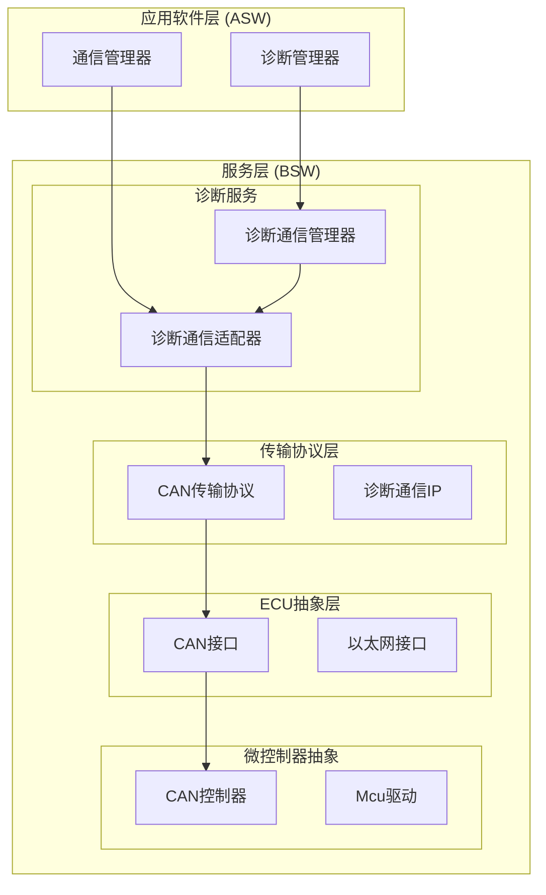

**图表来源**
- [DoCan_spec.md:21-32](file://openspec/changes/dev-doip-docan-module/specs/DoCan_spec.md#L21-L32)
- [DoCan.h:13-22](file://src/bsw/services/docan/include/DoCan.h#L13-L22)

**章节来源**
- [DoCan_spec.md:11-32](file://openspec/changes/dev-doip-docan-module/specs/DoCan_spec.md#L11-L32)
- [DoCan.h:13-22](file://src/bsw/services/docan/include/DoCan.h#L13-L22)

## 核心组件
DoCan模块的核心数据结构和类型定义如下：

### 模块状态类型
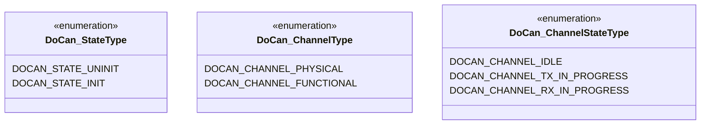

**图表来源**
- [DoCan.h:59-79](file://src/bsw/services/docan/include/DoCan.h#L59-L79)

### 配置数据结构
DoCan模块使用以下关键配置结构：

| 结构类型 | 描述 | 主要字段 |
|---------|------|----------|
| DoCan_PduMappingType | PDU映射配置 | DoCanPduId, CanTpPduId, ChannelType, Tx/Rx启用标志 |
| DoCan_ChannelConfigType | 通道配置 | ChannelId, ChannelType, Tx/Rx PduId, TimeoutMs |
| DoCan_ConfigType | 全局配置 | PduMappings指针, NumPduMappings, ChannelConfigs指针, NumChannels |

**章节来源**
- [DoCan.h:82-113](file://src/bsw/services/docan/include/DoCan.h#L82-L113)
- [DoCan_Cfg.h:14-53](file://src/bsw/services/docan/include/DoCan_Cfg.h#L14-L53)

## 架构概览
DoCan模块在诊断通信栈中的位置和交互关系：

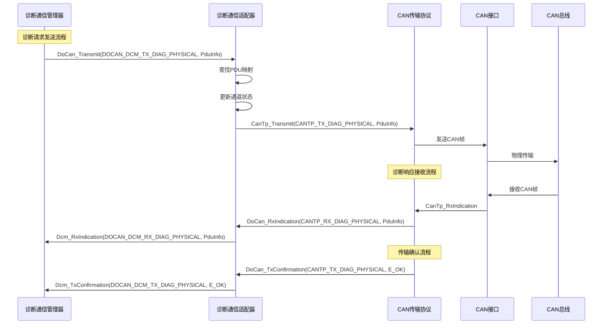

**图表来源**
- [DoCan_spec.md:172-220](file://openspec/changes/dev-doip-docan-module/specs/DoCan_spec.md#L172-L220)
- [DoCan.c:242-409](file://src/bsw/services/docan/src/DoCan.c#L242-L409)

## 详细组件分析

### 初始化流程 (DoCan_Init)
DoCan_Init函数负责模块的初始化和资源分配：

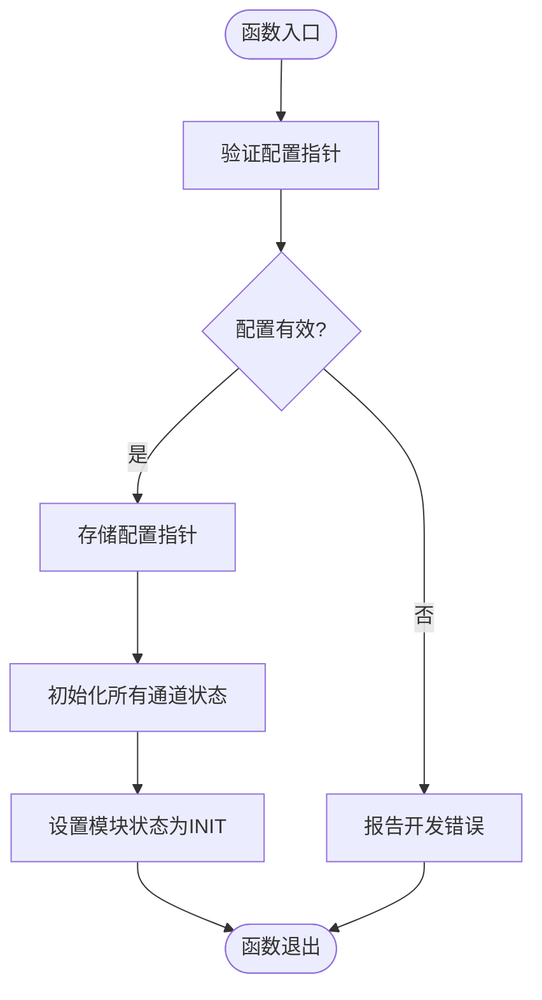

**图表来源**
- [DoCan.c:187-212](file://src/bsw/services/docan/src/DoCan.c#L187-L212)

初始化过程的关键步骤：
1. **配置验证**：检查传入的配置指针是否有效
2. **配置存储**：将配置指针保存到内部状态结构中
3. **通道初始化**：遍历所有可能的通道，设置初始状态为空闲
4. **状态设置**：将模块状态标记为已初始化

**章节来源**
- [DoCan.c:187-212](file://src/bsw/services/docan/src/DoCan.c#L187-L212)
- [DoCan_spec.md:42-44](file://openspec/changes/dev-doip-docan-module/specs/DoCan_spec.md#L42-L44)

### 诊断消息传输 (DoCan_Transmit)
DoCan_Transmit函数处理诊断请求的发送：

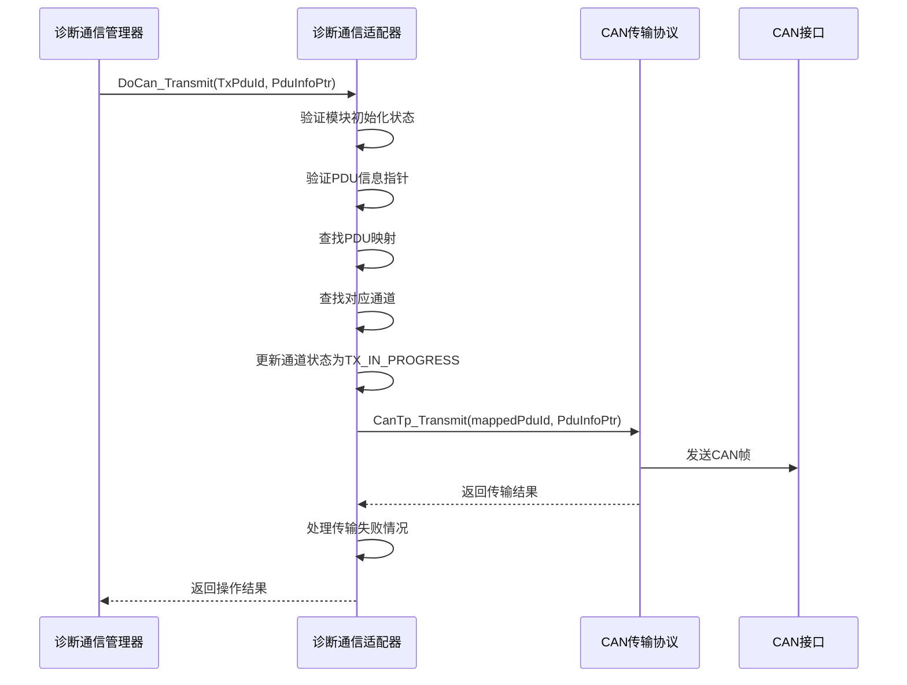

**图表来源**
- [DoCan.c:242-303](file://src/bsw/services/docan/src/DoCan.c#L242-L303)

传输流程的关键特性：
1. **错误检测**：检查模块初始化状态和PDU信息有效性
2. **PDU映射查找**：通过DoCan_FindPduMappingByDoCanId函数定位对应的CanTp PDU
3. **通道状态管理**：更新相关通道的状态和活动标志
4. **超时处理**：重置通道超时计时器
5. **传输失败处理**：当CanTp传输失败时，重置通道状态并报告错误

**章节来源**
- [DoCan.c:242-303](file://src/bsw/services/docan/src/DoCan.c#L242-L303)
- [DoCan_test.c:135-155](file://src/bsw/services/docan/src/DoCan_test.c#L135-L155)

### 诊断响应接收 (DoCan_RxIndication)
DoCan_RxIndication函数处理来自CanTp的诊断响应：

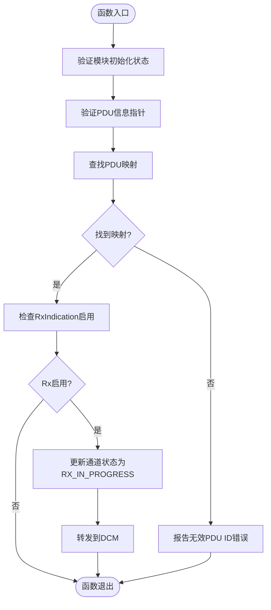

**图表来源**
- [DoCan.c:311-359](file://src/bsw/services/docan/src/DoCan.c#L311-L359)

响应接收流程的特点：
1. **条件检查**：确保模块已初始化且PDU信息有效
2. **映射查找**：通过CanTp Rx PDU ID查找对应的DCM PDU
3. **功能控制**：只有当RxIndicationEnabled为TRUE时才转发
4. **状态更新**：更新通道状态和超时计时器
5. **DCM转发**：调用Dcm_RxIndication将诊断响应传递给DCM

**章节来源**
- [DoCan.c:311-359](file://src/bsw/services/docan/src/DoCan.c#L311-L359)
- [DoCan_test.c:157-178](file://src/bsw/services/docan/src/DoCan_test.c#L157-L178)

### 传输确认处理 (DoCan_TxConfirmation)
DoCan_TxConfirmation函数处理来自CanTp的传输确认：

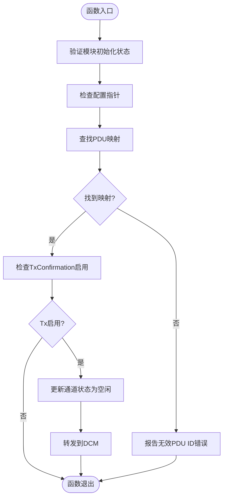

**图表来源**
- [DoCan.c:367-409](file://src/bsw/services/docan/src/DoCan.c#L367-L409)

传输确认处理的要点：
1. **状态验证**：确保模块处于已初始化状态
2. **映射查找**：通过CanTp Tx PDU ID查找对应的DCM PDU
3. **功能控制**：只有当TxConfirmationEnabled为TRUE时才转发
4. **状态清理**：将通道状态重置为空闲，清除活动标志和超时计时器
5. **DCM通知**：调用Dcm_TxConfirmation通知DCM传输完成

**章节来源**
- [DoCan.c:367-409](file://src/bsw/services/docan/src/DoCan.c#L367-L409)
- [DoCan_test.c:180-192](file://src/bsw/services/docan/src/DoCan_test.c#L180-L192)

### 超时管理 (DoCan_MainFunction)
DoCan_MainFunction提供周期性处理，主要负责超时检测：

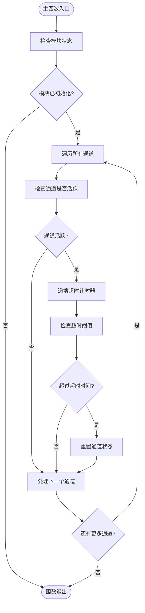

**图表来源**
- [DoCan.c:416-446](file://src/bsw/services/docan/src/DoCan.c#L416-L446)

超时管理机制：
1. **周期性检查**：每DOCAN_MAIN_FUNCTION_PERIOD_MS毫秒执行一次
2. **活跃通道检测**：只对处于活动状态的通道进行超时检查
3. **超时阈值比较**：将通道超时计时器与配置的超时时间比较
4. **自动重置**：超时发生时自动重置通道状态和计时器
5. **配置灵活性**：不同通道可以有不同的超时配置

**章节来源**
- [DoCan.c:416-446](file://src/bsw/services/docan/src/DoCan.c#L416-L446)
- [DoCan_Cfg.h:27](file://src/bsw/services/docan/include/DoCan_Cfg.h#L27)

### 连接状态管理
DoCan模块维护每个通道的运行时状态：

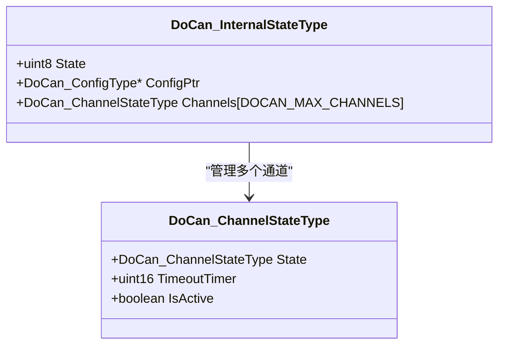

**图表来源**
- [DoCan.c:54-67](file://src/bsw/services/docan/src/DoCan.c#L54-L67)

状态管理的关键点：
1. **状态枚举**：支持空闲、发送中、接收中三种状态
2. **超时计时**：每个通道独立维护超时计时器
3. **活动标志**：用于跟踪通道是否正在处理数据
4. **内存管理**：静态分配固定数量的通道状态空间

**章节来源**
- [DoCan.c:54-67](file://src/bsw/services/docan/src/DoCan.c#L54-L67)

## 依赖关系分析

### 上层依赖
DoCan模块依赖于以下上层模块：

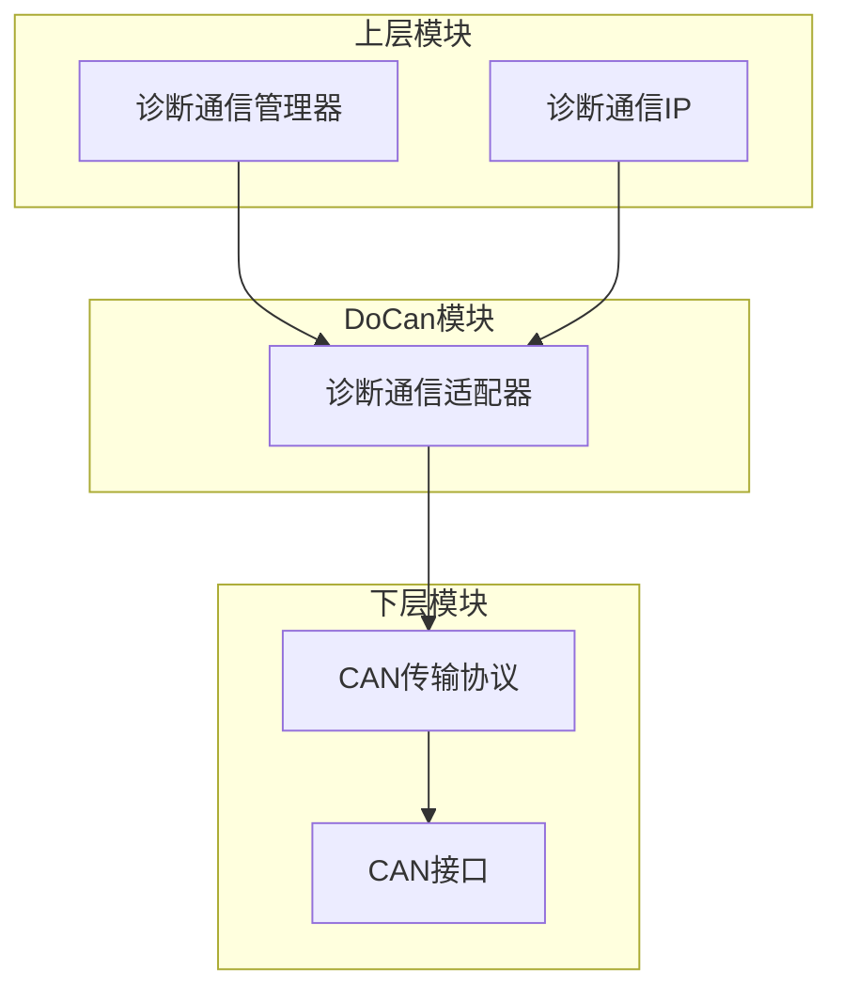

**图表来源**
- [DoCan_spec.md:239-247](file://openspec/changes/dev-doip-docan-module/specs/DoCan_spec.md#L239-L247)

### 关键依赖关系
1. **DCM接口**：通过Dcm_RxIndication和Dcm_TxConfirmation回调函数
2. **CanTp接口**：通过CanTp_Transmit函数进行数据传输
3. **标准类型**：使用ComStack_Types.h中的PduInfoType等标准类型
4. **错误检测**：依赖Det模块进行开发错误报告

**章节来源**
- [DoCan.c:27-29](file://src/bsw/services/docan/src/DoCan.c#L27-L29)
- [ComStack_Types.h:56-60](file://src/bsw/ecual/include/ComStack_Types.h#L56-L60)

### 数据流图
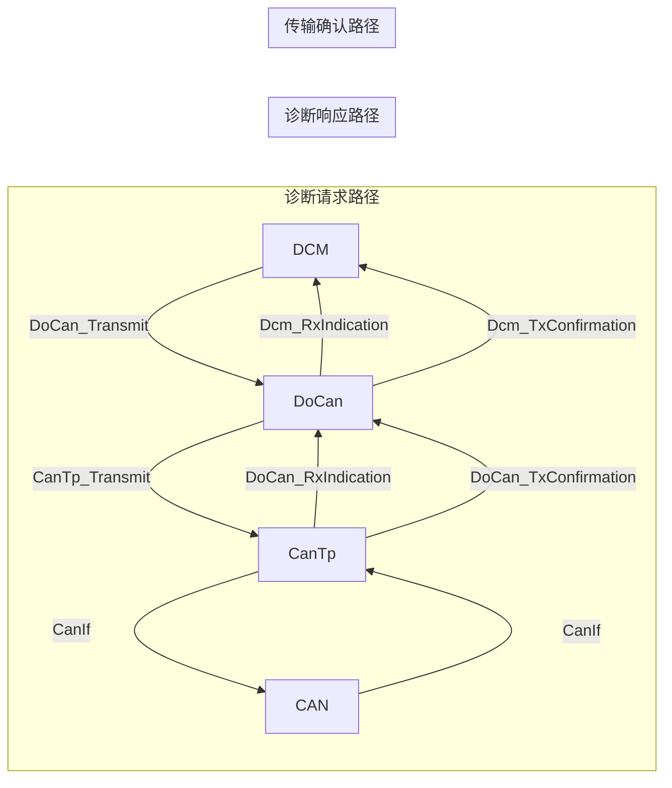

**图表来源**
- [DoCan_spec.md:172-220](file://openspec/changes/dev-doip-docan-module/specs/DoCan_spec.md#L172-L220)

## 性能考虑

### 内存配置优化
DoCan模块的内存配置参数：

| 参数名称 | 默认值 | 描述 | 性能影响 |
|---------|--------|------|----------|
| DOCAN_MAX_CHANNELS | 4 | 最大通道数 | 增加内存占用，提高并发能力 |
| DOCAN_MAX_PDU_MAPPINGS | 8 | 最大PDU映射数 | 影响查找性能和内存使用 |
| DOCAN_MAIN_FUNCTION_PERIOD_MS | 10ms | 主函数执行周期 | 影响超时精度和CPU占用 |

### 传输性能优化建议
1. **通道配置**：根据诊断需求合理配置物理和功能地址通道
2. **超时参数**：为不同类型的服务设置合适的超时时间
3. **PDU映射优化**：减少不必要的PDU映射条目
4. **错误检测**：在开发阶段启用错误检测，在生产环境可考虑关闭以节省资源

### CAN总线配置
虽然DoCan模块本身不直接配置CAN总线，但其性能受以下因素影响：

1. **波特率选择**：影响诊断响应的传输速度
2. **消息过滤**：合理的过滤规则可以减少不必要的处理开销
3. **缓冲区大小**：足够的缓冲区可以避免数据丢失

## 故障排除指南

### 常见错误代码
DoCan模块支持以下开发错误检测：

| 错误代码 | 值 | 触发条件 | 解决方案 |
|---------|----|----------|----------|
| DOCAN_E_PARAM_POINTER | 0x01 | 传入NULL指针 | 检查传入的配置或PDU指针 |
| DOCAN_E_PARAM_CONFIG | 0x02 | 配置参数无效 | 验证配置结构的完整性 |
| DOCAN_E_UNINIT | 0x03 | 模块未初始化 | 确保先调用DoCan_Init |
| DOCAN_E_INVALID_PDU_ID | 0x04 | 无效的PDU标识符 | 检查PDU映射配置 |
| DOCAN_E_INVALID_CHANNEL | 0x05 | 无效的通道标识符 | 验证通道配置 |
| DOCAN_E_TX_FAILED | 0x06 | 传输失败 | 检查CanTp层状态和CAN总线连接 |

### 调试技巧
1. **启用错误检测**：在开发阶段保持DOCAN_DEV_ERROR_DETECT为STD_ON
2. **单元测试**：利用提供的测试用例验证功能正确性
3. **日志记录**：在关键路径添加调试输出
4. **状态监控**：定期检查通道状态和超时计时器

**章节来源**
- [DoCan_spec.md:127-144](file://openspec/changes/dev-doip-docan-module/specs/DoCan_spec.md#L127-L144)
- [DoCan_test.c:110-133](file://src/bsw/services/docan/src/DoCan_test.c#L110-L133)

### 单元测试覆盖
DoCan模块提供了完整的单元测试，覆盖以下场景：

1. **初始化测试**：验证正常初始化和NULL配置错误处理
2. **传输测试**：验证物理和功能地址的传输行为
3. **接收测试**：验证响应接收和路由功能
4. **确认测试**：验证传输确认的处理逻辑
5. **错误处理测试**：验证各种错误条件下的行为

**章节来源**
- [DoCan_test.c:109-294](file://src/bsw/services/docan/src/DoCan_test.c#L109-L294)

## 结论
DoCan模块成功实现了AutoSAR标准的诊断通信适配器功能，提供了以下关键能力：

1. **标准化接口**：遵循AutoSAR经典平台4.x标准，提供清晰的API接口
2. **灵活配置**：支持物理地址和功能地址两种诊断模式
3. **完整生命周期**：提供完整的初始化、运行和去初始化流程
4. **错误检测**：内置开发错误检测机制，便于调试和问题定位
5. **超时管理**：提供可靠的超时检测和自动重置机制
6. **性能优化**：通过合理的配置参数和内存管理实现高效运行

该模块为上层DCM提供了稳定可靠的诊断通信基础，同时通过与CanTp的紧密集成确保了ISO 15765-2协议的正确实现。模块的设计充分考虑了实时性和可靠性要求，适合在汽车电子系统中部署使用。

## 附录

### API参考
DoCan模块提供的完整API列表：

| API名称 | 功能描述 | 参数类型 | 返回值 |
|---------|----------|----------|--------|
| DoCan_Init | 初始化模块 | const DoCan_ConfigType* | void |
| DoCan_DeInit | 去初始化模块 | void | void |
| DoCan_GetVersionInfo | 获取版本信息 | Std_VersionInfoType* | void |
| DoCan_Transmit | 发送诊断请求 | PduIdType, const PduInfoType* | Std_ReturnType |
| DoCan_RxIndication | 接收诊断响应 | PduIdType, const PduInfoType* | void |
| DoCan_TxConfirmation | 传输确认处理 | PduIdType, Std_ReturnType | void |
| DoCan_MainFunction | 周期性处理 | void | void |

### 配置参数说明
DoCan模块的预编译配置参数：

| 参数名称 | 默认值 | 描述 |
|---------|--------|------|
| DOCAN_DEV_ERROR_DETECT | STD_ON | 启用开发错误检测 |
| DOCAN_VERSION_INFO_API | STD_ON | 启用版本信息API |
| DOCAN_MAX_CHANNELS | 4 | 最大通道数 |
| DOCAN_MAX_PDU_MAPPINGS | 8 | 最大PDU映射数 |
| DOCAN_MAIN_FUNCTION_PERIOD_MS | 10 | 主函数执行周期(ms) |