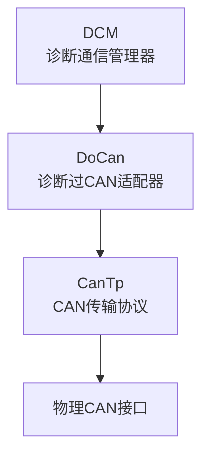
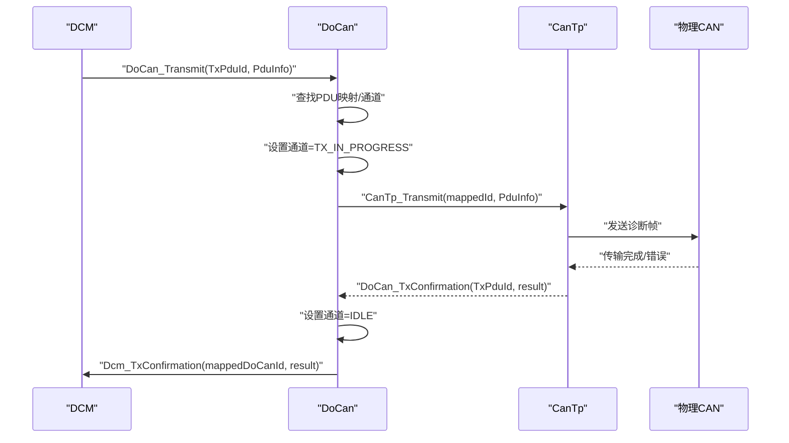
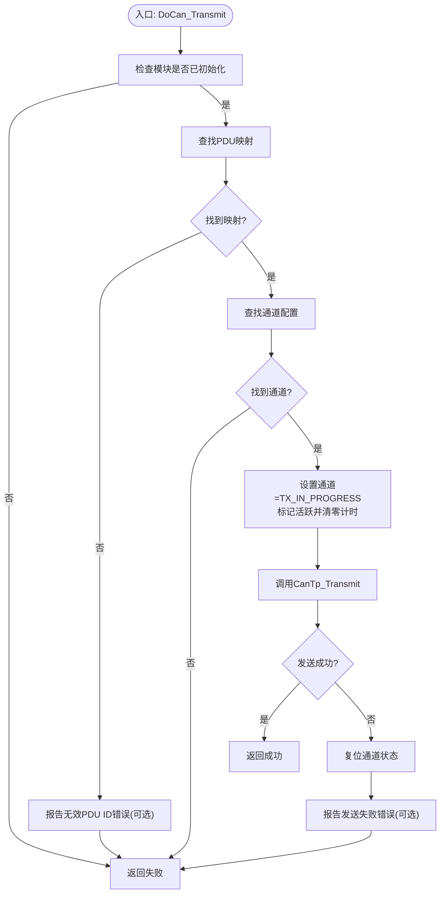
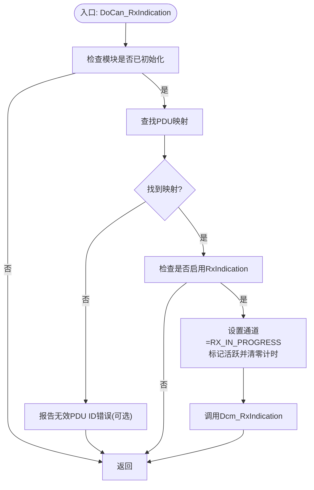
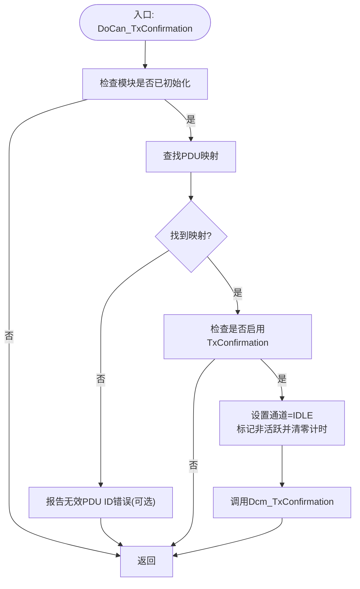
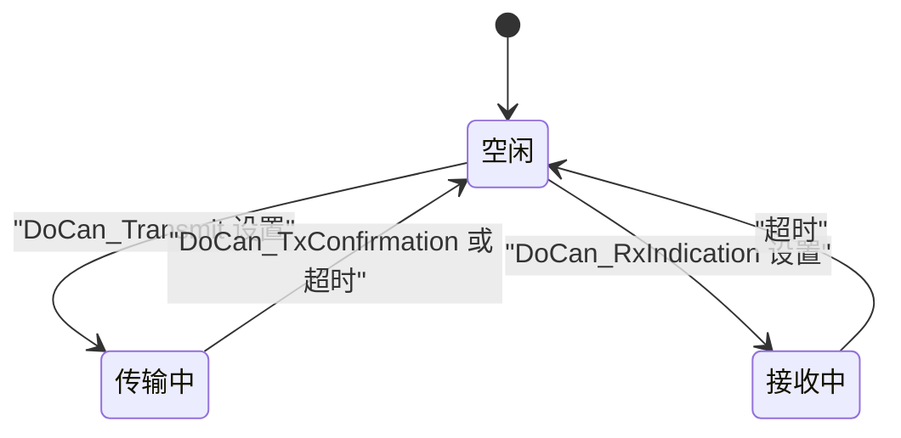
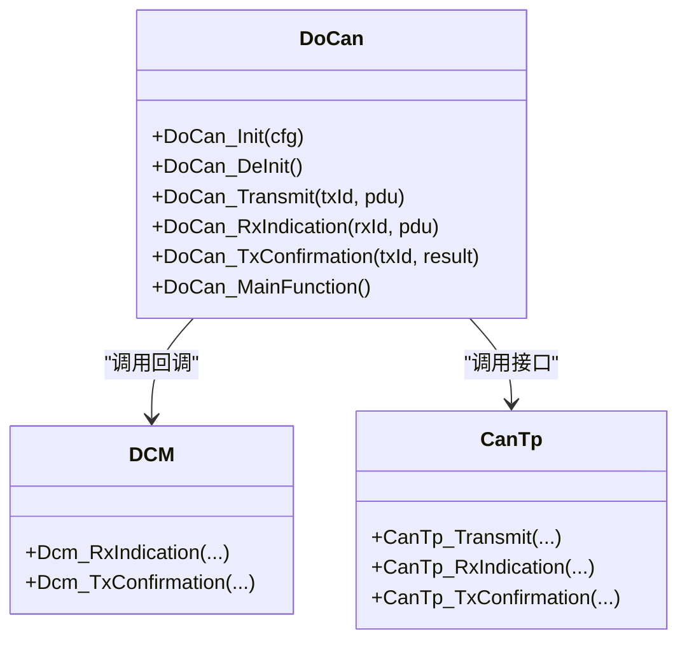

# 诊断通信处理

<cite>
**本文引用的文件**
- [DoCan.h](file://src/bsw/services/docan/include/DoCan.h)
- [DoCan.c](file://src/bsw/services/docan/src/DoCan.c)
- [DoCan_Cfg.h](file://src/bsw/services/docan/include/DoCan_Cfg.h)
- [DoCan_Lcfg.c](file://src/bsw/services/docan/src/DoCan_Lcfg.c)
- [Dcm.h](file://src/bsw/services/dcm/include/Dcm.h)
- [CanTp.h](file://src/bsw/ecual/cantp/include/CanTp.h)
- [ComStack_Types.h](file://src/bsw/ecual/include/ComStack_Types.h)
- [Std_Types.h](file://src/bsw/os/include/Std_Types.h)
- [DoCan_test.c](file://src/bsw/services/docan/src/DoCan_test.c)
- [Dcm_Cfg.h](file://src/bsw/services/dcm/include/Dcm_Cfg.h)
</cite>

## 目录
1. [引言](#引言)
2. [项目结构](#项目结构)
3. [核心组件](#核心组件)
4. [架构总览](#架构总览)
5. [详细组件分析](#详细组件分析)
6. [依赖关系分析](#依赖关系分析)
7. [性能考虑](#性能考虑)
8. [故障排查指南](#故障排查指南)
9. [结论](#结论)
10. [附录](#附录)

## 引言
本文件面向DoCan（诊断通过CAN）通信处理模块，系统性阐述诊断消息的发送与接收流程，覆盖以下关键主题：
- 发送路径：DoCan_Transmit如何将诊断请求转发至CanTp，并在传输完成后回调DoCan_TxConfirmation更新通道状态。
- 接收路径：DoCan_RxIndication如何将来自CanTp的诊断响应转交给DCM，并更新通道状态。
- 缓冲区与队列：当前实现采用直接转发模式，未见显式环形缓冲或队列结构；消息处理以“按需转发”为主。
- 并发访问控制：模块内部通过通道状态机与定时器进行并发与超时管理，避免竞态。
- 连接状态管理：定义并维护DOCAN_CHANNEL_IDLE、DOCAN_CHANNEL_TX_IN_PROGRESS、DOCAN_CHANNEL_RX_IN_PROGRESS三种状态。
- 超时与错误检测：DoCan_MainFunction周期性检查通道超时，超时后复位通道；结合DET报告错误码。
- 分段传输：基于CanTp的ISO 15765-2分段协议，DoCan不直接参与分段细节，但负责通道状态与超时。
- 自动重传：当前实现未见自动重传逻辑；如需支持可在上层（如DCM或应用）实现。

## 项目结构
DoCan位于BSW服务层，作为DCM与CanTp之间的适配器，负责：
- 将DCM侧的诊断PDU映射到CanTp侧的传输PDU；
- 维护每个通道的状态与超时；
- 在传输开始/结束时更新通道状态；
- 向DCM上报接收指示与传输确认。

图表来源
- [DoCan.c:27-29](file://src/bsw/services/docan/src/DoCan.c#L27-L29)
- [DoCan.h:136](file://src/bsw/services/docan/src/DoCan.c#L136)
- [CanTp.h:255](file://src/bsw/ecual/cantp/include/CanTp.h#L255)

章节来源
- [DoCan.h:136-177](file://src/bsw/services/docan/include/DoCan.h#L136-L177)
- [DoCan.c:27-29](file://src/bsw/services/docan/src/DoCan.c#L27-L29)
- [DoCan_Cfg.h:32-43](file://src/bsw/services/docan/include/DoCan_Cfg.h#L32-L43)

## 核心组件
- DoCan模块对外接口
  - 初始化/反初始化：DoCan_Init、DoCan_DeInit
  - 版本信息：DoCan_GetVersionInfo
  - 发送：DoCan_Transmit
  - 接收指示：DoCan_RxIndication
  - 传输确认：DoCan_TxConfirmation
  - 周期任务：DoCan_MainFunction
- 内部状态
  - 全局状态：DOCAN_STATE_UNINIT、DOCAN_STATE_INIT
  - 通道状态：DOCAN_CHANNEL_IDLE、DOCAN_CHANNEL_TX_IN_PROGRESS、DOCAN_CHANNEL_RX_IN_PROGRESS
  - 通道运行时数据：状态、超时计时器、是否激活
- 配置
  - PDU映射：DoCan_PduMappingType（DCM↔CanTp）
  - 通道配置：DoCan_ChannelConfigType（超时等）
  - 预编译常量：最大通道数、主函数周期、PDU ID宏等

章节来源
- [DoCan.h:59-79](file://src/bsw/services/docan/include/DoCan.h#L59-L79)
- [DoCan.h:106-113](file://src/bsw/services/docan/include/DoCan.h#L106-L113)
- [DoCan.h:136-177](file://src/bsw/services/docan/include/DoCan.h#L136-L177)
- [DoCan_Cfg.h:21-27](file://src/bsw/services/docan/include/DoCan_Cfg.h#L21-L27)
- [DoCan_Lcfg.c:26-130](file://src/bsw/services/docan/src/DoCan_Lcfg.c#L26-L130)

## 架构总览
DoCan在DCM与CanTp之间承担“协议适配与状态管理”的职责：
- 发送路径：DCM调用DoCan_Transmit → DoCan查找映射与通道 → 更新通道状态 → 调用CanTp_Transmit → 传输完成回调DoCan_TxConfirmation → 更新通道状态并通知DCM。
- 接收路径：CanTp_RxIndication → DoCan查找映射 → 更新通道状态 → 调用Dcm_RxIndication → DCM处理后可能触发下一次发送。
- 超时管理：DoCan_MainFunction周期递增通道计时器，超过配置超时则复位通道状态。

图表来源
- [DoCan.c:242-303](file://src/bsw/services/docan/src/DoCan.c#L242-L303)
- [DoCan.c:367-409](file://src/bsw/services/docan/src/DoCan.c#L367-L409)
- [DoCan.c:27-29](file://src/bsw/services/docan/src/DoCan.c#L27-L29)

## 详细组件分析

### 发送流程：DoCan_Transmit
- 输入参数校验（开发错误检测开启时）：未初始化、空指针等。
- 查找映射与通道：通过DoCan_FindPduMappingByDoCanId与DoCan_FindChannelConfig定位目标通道。
- 更新通道状态：进入“传输中”状态，标记活跃并清零超时计时。
- 调用CanTp_Transmit执行实际发送。
- 失败回退：若发送失败，复位通道状态并记录错误码（若启用DET）。

图表来源
- [DoCan.c:242-303](file://src/bsw/services/docan/src/DoCan.c#L242-L303)

章节来源
- [DoCan.c:242-303](file://src/bsw/services/docan/src/DoCan.c#L242-L303)

### 接收流程：DoCan_RxIndication
- 输入参数校验（开发错误检测开启时）。
- 通过DoCan_FindPduMappingByCanTpId定位映射。
- 若允许接收指示，则更新通道状态为“接收中”，标记活跃并清零计时。
- 调用Dcm_RxIndication将诊断响应交给DCM处理。

图表来源
- [DoCan.c:311-359](file://src/bsw/services/docan/src/DoCan.c#L311-L359)

章节来源
- [DoCan.c:311-359](file://src/bsw/services/docan/src/DoCan.c#L311-L359)

### 传输确认：DoCan_TxConfirmation
- 输入参数校验（开发错误检测开启时）。
- 通过DoCan_FindPduMappingByCanTpId定位映射。
- 若允许传输确认，则更新通道状态为“空闲”，标记非活跃并清零计时。
- 调用Dcm_TxConfirmation通知DCM。

图表来源
- [DoCan.c:367-409](file://src/bsw/services/docan/src/DoCan.c#L367-L409)

章节来源
- [DoCan.c:367-409](file://src/bsw/services/docan/src/DoCan.c#L367-L409)

### 通道状态机与超时管理
- 状态枚举：DOCAN_CHANNEL_IDLE、DOCAN_CHANNEL_TX_IN_PROGRESS、DOCAN_CHANNEL_RX_IN_PROGRESS。
- 运行时状态：包含状态、超时计时器、是否活跃。
- 主函数周期：DoCan_MainFunction按固定周期（预编译常量）递增各通道计时器。
- 超时判定：当通道处于活跃状态且计时器达到配置超时时，复位通道状态为空闲。

图表来源
- [DoCan.h:75-79](file://src/bsw/services/docan/include/DoCan.h#L75-L79)
- [DoCan.c:416-446](file://src/bsw/services/docan/src/DoCan.c#L416-L446)
- [DoCan_Lcfg.c:91-120](file://src/bsw/services/docan/src/DoCan_Lcfg.c#L91-L120)

章节来源
- [DoCan.c:416-446](file://src/bsw/services/docan/src/DoCan.c#L416-L446)
- [DoCan_Lcfg.c:91-120](file://src/bsw/services/docan/src/DoCan_Lcfg.c#L91-L120)

### 缓冲区管理与消息队列
- 当前实现采用“直通转发”模式：DoCan不维护独立的发送/接收缓冲区或队列，而是将DCM/CanTp的PDU信息直接传递给对端。
- 分段传输由CanTp负责（ISO 15765-2），DoCan仅负责通道状态与超时。
- 因此不存在显式的环形缓冲、队列结构或并发互斥保护（如信号量/中断屏蔽）。

章节来源
- [DoCan.c:279](file://src/bsw/services/docan/src/DoCan.c#L279)
- [DoCan.c:349](file://src/bsw/services/docan/src/DoCan.c#L349)
- [CanTp.h:100-105](file://src/bsw/ecual/cantp/include/CanTp.h#L100-L105)

### 错误检测与异常处理
- 开发错误检测（DET）：通过宏控制，启用时在关键分支调用Det_ReportError并上报错误码。
- 关键错误码：
  - 未初始化：DOCAN_E_UNINIT
  - 参数为空：DOCAN_E_PARAM_POINTER
  - 无效PDU ID：DOCAN_E_INVALID_PDU_ID
  - 发送失败：DOCAN_E_TX_FAILED
- 单元测试覆盖了上述错误路径，验证DET行为与接口正确性。

章节来源
- [DoCan.c:43-48](file://src/bsw/services/docan/src/DoCan.c#L43-L48)
- [DoCan.c:191-197](file://src/bsw/services/docan/src/DoCan.c#L191-L197)
- [DoCan.c:250-261](file://src/bsw/services/docan/src/DoCan.c#L250-L261)
- [DoCan.c:289-292](file://src/bsw/services/docan/src/DoCan.c#L289-L292)
- [DoCan.c:317-329](file://src/bsw/services/docan/src/DoCan.c#L317-L329)
- [DoCan.c:354-357](file://src/bsw/services/docan/src/DoCan.c#L354-L357)
- [DoCan_test.c:121-133](file://src/bsw/services/docan/src/DoCan_test.c#L121-L133)
- [DoCan_test.c:194-215](file://src/bsw/services/docan/src/DoCan_test.c#L194-L215)

### 分段传输与性能优化
- 分段传输：由CanTp实现（单帧/首帧/连续帧/流控），DoCan不参与分段细节。
- 性能相关点：
  - 主函数周期（DOCAN_MAIN_FUNCTION_PERIOD_MS）影响超时精度与时钟开销。
  - 通道超时（每个通道独立）避免长时间阻塞。
  - 无额外缓冲/队列，减少内存占用与上下文切换。

章节来源
- [DoCan_Cfg.h:27](file://src/bsw/services/docan/include/DoCan_Cfg.h#L27)
- [DoCan_Lcfg.c:97](file://src/bsw/services/docan/src/DoCan_Lcfg.c#L97)
- [CanTp.h:100-105](file://src/bsw/ecual/cantp/include/CanTp.h#L100-L105)

### 自动重传机制
- 当前实现未发现自动重传逻辑。
- 如需实现，建议在DCM或应用层根据负响应码与会话/安全状态进行策略性重试，并配合DoCan的超时与状态机协同。

章节来源
- [DoCan.c:416-446](file://src/bsw/services/docan/src/DoCan.c#L416-L446)
- [Dcm.h:353-360](file://src/bsw/services/dcm/include/Dcm.h#L353-L360)

## 依赖关系分析
DoCan与上层DCM、下层CanTp的依赖关系如下：

图表来源
- [DoCan.c:27-29](file://src/bsw/services/docan/src/DoCan.c#L27-L29)
- [DoCan.h:136-177](file://src/bsw/services/docan/include/DoCan.h#L136-L177)
- [CanTp.h:255-324](file://src/bsw/ecual/cantp/include/CanTp.h#L255-L324)

章节来源
- [DoCan.c:27-29](file://src/bsw/services/docan/src/DoCan.c#L27-L29)
- [DoCan.h:136-177](file://src/bsw/services/docan/include/DoCan.h#L136-L177)
- [CanTp.h:255-324](file://src/bsw/ecual/cantp/include/CanTp.h#L255-L324)

## 性能考虑
- 时间复杂度
  - PDU映射查找：线性扫描，最多DOCAN_MAX_PDU_MAPPINGS次比较；通道查找：最多DOCAN_MAX_CHANNELS次比较。整体为O(N)。
  - 主函数遍历：对所有通道进行常量时间操作，复杂度O(M)，M为通道数量。
- 内存占用
  - 仅保存内部状态与少量配置指针，无动态分配。
- 实时性
  - 主函数周期固定，超时精度受其影响；建议根据诊断需求调整周期与超时阈值。

章节来源
- [DoCan.c:99-176](file://src/bsw/services/docan/src/DoCan.c#L99-L176)
- [DoCan_Cfg.h:21-27](file://src/bsw/services/docan/include/DoCan_Cfg.h#L21-L27)
- [DoCan_Lcfg.c:123-130](file://src/bsw/services/docan/src/DoCan_Lcfg.c#L123-L130)

## 故障排查指南
- 症状：DoCan_Transmit返回失败
  - 可能原因：未初始化、PDU ID无效、CanTp发送失败。
  - 排查步骤：检查DoCan_Init调用、映射表配置、CanTp链路状态；关注DET错误码。
- 症状：接收无响应或超时
  - 可能原因：通道未进入接收中状态、超时阈值过小、CanTp未正确上报。
  - 排查步骤：确认DoCan_RxIndication被调用、通道配置超时值、CanTp链路。
- 症状：传输确认未到达DCM
  - 可能原因：TxConfirmation未启用、映射错误。
  - 排查步骤：核对映射项TxConfirmationEnabled标志、DoCan_TxConfirmation路径。

章节来源
- [DoCan_test.c:135-155](file://src/bsw/services/docan/src/DoCan_test.c#L135-L155)
- [DoCan_test.c:157-178](file://src/bsw/services/docan/src/DoCan_test.c#L157-L178)
- [DoCan_test.c:180-192](file://src/bsw/services/docan/src/DoCan_test.c#L180-L192)
- [DoCan_test.c:194-215](file://src/bsw/services/docan/src/DoCan_test.c#L194-L215)

## 结论
DoCan模块以轻量、清晰的方式实现了DCM与CanTp之间的诊断通信适配，具备：
- 明确的通道状态机与超时管理；
- 完整的发送/接收/确认回调链路；
- 可扩展的配置与映射机制；
- 未内置自动重传，适合在上层按业务需求实现。
对于诊断消息的分段传输，DoCan不直接参与，交由CanTp处理，从而保持模块职责单一、边界清晰。

## 附录
- 关键类型与常量
  - PduIdType、PduInfoType、Std_ReturnType等来自通用通信栈类型定义。
  - PDU ID宏：物理/功能地址的DCM与CanTp映射。
- 配置要点
  - 最大通道数、PDU映射数量、主函数周期、各通道超时。
  - DCM侧缓冲区大小与会话/安全配置（用于理解上层资源规划）。

章节来源
- [ComStack_Types.h:36-60](file://src/bsw/ecual/include/ComStack_Types.h#L36-L60)
- [Std_Types.h:40-80](file://src/bsw/os/include/Std_Types.h#L40-L80)
- [DoCan_Cfg.h:32-51](file://src/bsw/services/docan/include/DoCan_Cfg.h#L32-L51)
- [Dcm_Cfg.h:76-115](file://src/bsw/services/dcm/include/Dcm_Cfg.h#L76-L115)