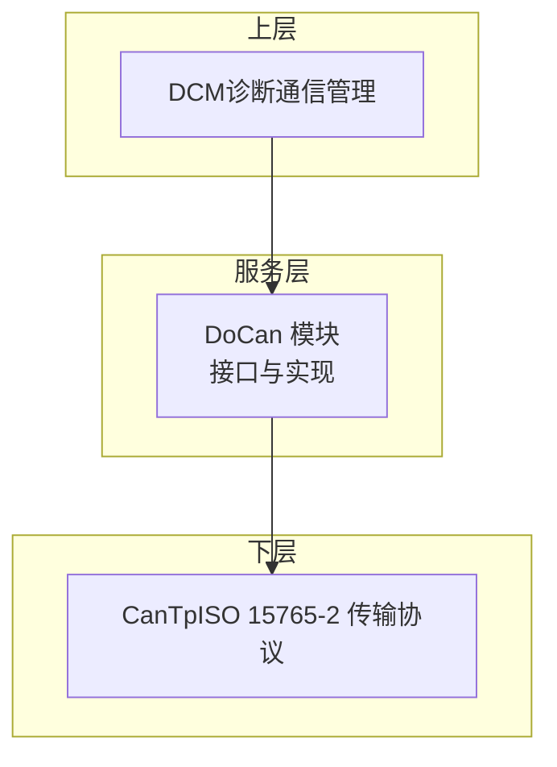
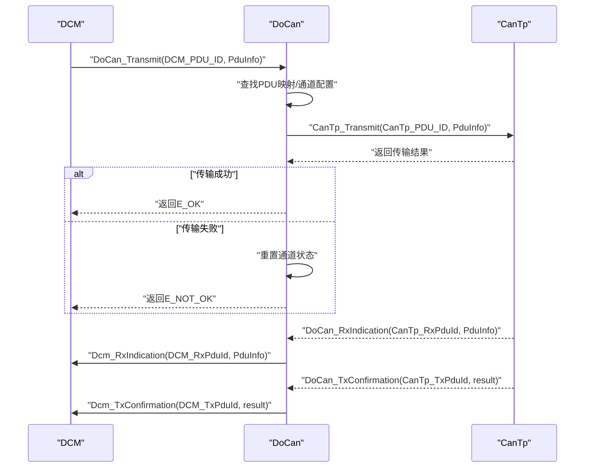
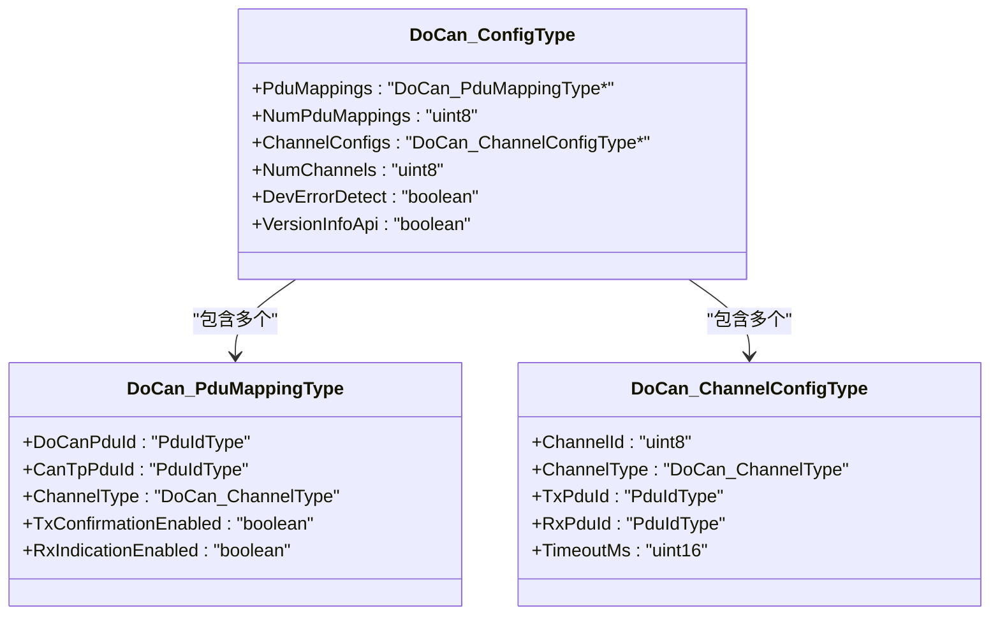
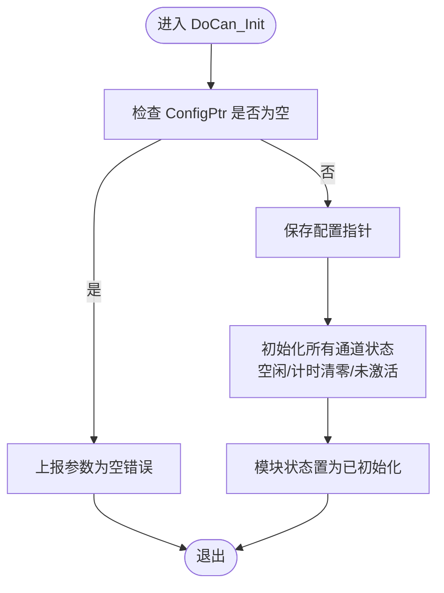
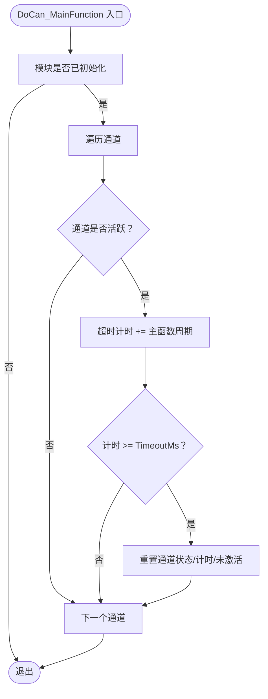
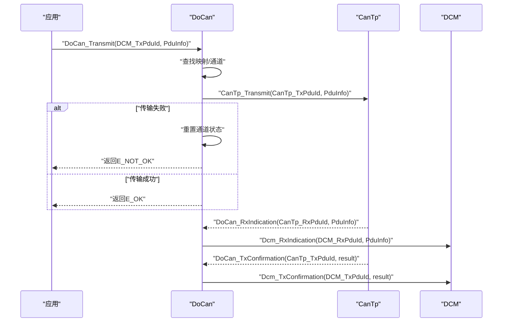
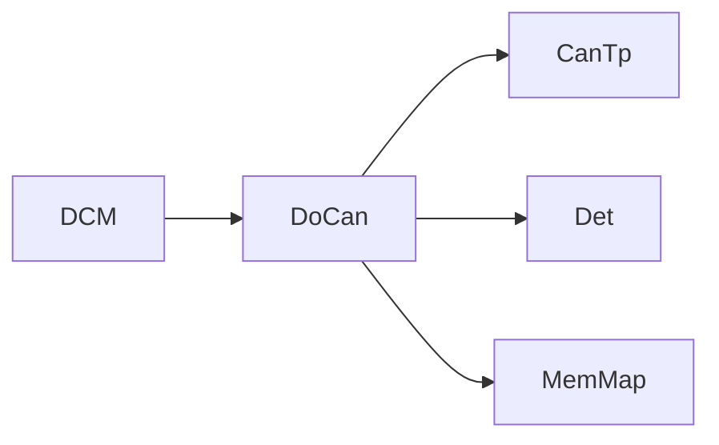

# 配置与初始化

<cite>
**本文引用的文件列表**
- [DoCan_Cfg.h](file://src/bsw/services/docan/include/DoCan_Cfg.h)
- [DoCan.h](file://src/bsw/services/docan/include/DoCan.h)
- [DoCan.c](file://src/bsw/services/docan/src/DoCan.c)
- [DoCan_Lcfg.c](file://src/bsw/services/docan/src/DoCan_Lcfg.c)
- [DoCan_spec.md](file://openspec/changes/dev-doip-docan-module/specs/DoCan_spec.md)
- [DoCan_test.c](file://src/bsw/services/docan/src/DoCan_test.c)
- [CanTp.h](file://src/bsw/ecual/cantp/include/CanTp.h)
</cite>

## 目录
1. [简介](#简介)
2. [项目结构](#项目结构)
3. [核心组件](#核心组件)
4. [架构总览](#架构总览)
5. [详细组件分析](#详细组件分析)
6. [依赖关系分析](#依赖关系分析)
7. [性能考量](#性能考量)
8. [故障排查指南](#故障排查指南)
9. [结论](#结论)
10. [附录：配置模板与最佳实践](#附录配置模板与最佳实践)

## 简介
本文件面向DoCan（诊断通过CAN）模块的配置与初始化，系统性阐述以下内容：
- DoCan_ConfigType配置结构体各字段含义与配置方法
- PduMappings与ChannelConfigs的配置要点
- DoCan_Init初始化流程（含配置验证、资源分配、状态初始化）
- PDU映射（DoCan_PduMappingType）：物理通道与功能性通道的差异
- 通道配置（DoCan_ChannelConfigType）：超时设置与PDU ID映射
- 配置模板与最佳实践
- 配置验证规则与常见错误的解决方案

## 项目结构
DoCan位于服务层，作为DCM与CanTp之间的适配器，负责诊断消息在CAN上的传输与路由。其配置由编译期配置头文件与链接期配置实现文件共同构成。

图表来源
- [DoCan.h:132-177](file://src/bsw/services/docan/include/DoCan.h#L132-L177)
- [DoCan.c:27-30](file://src/bsw/services/docan/src/DoCan.c#L27-L30)

章节来源
- [DoCan.h:19-22](file://src/bsw/services/docan/include/DoCan.h#L19-L22)
- [DoCan_Cfg.h:15-27](file://src/bsw/services/docan/include/DoCan_Cfg.h#L15-L27)

## 核心组件
- 配置头文件（编译期参数）：定义开发错误检测开关、版本信息API开关、最大通道数、最大PDU映射数、主函数周期、DCM/CanTp PDU ID常量等。
- 接口头文件：声明DoCan_ConfigType、DoCan_PduMappingType、DoCan_ChannelConfigType、DoCan_StateType、DoCan_ChannelType、DoCan_ChannelStateType以及对外API。
- 实现文件：完成初始化、主函数、PDU映射查找、通道配置查找、错误处理与状态机维护。
- 链接期配置：提供默认的PDU映射表与通道配置，并汇总为全局配置对象。

章节来源
- [DoCan_Cfg.h:15-53](file://src/bsw/services/docan/include/DoCan_Cfg.h#L15-L53)
- [DoCan.h:82-113](file://src/bsw/services/docan/include/DoCan.h#L82-L113)
- [DoCan.c:187-212](file://src/bsw/services/docan/src/DoCan.c#L187-L212)
- [DoCan_Lcfg.c:26-130](file://src/bsw/services/docan/src/DoCan_Lcfg.c#L26-L130)

## 架构总览
DoCan在AutoSAR经典平台4.x中承担“诊断传输适配器”角色，将DCM的诊断请求转发给CanTp进行ISO 15765-2传输，并将接收与确认事件回传给DCM。

图表来源
- [DoCan.c:242-303](file://src/bsw/services/docan/src/DoCan.c#L242-L303)
- [DoCan.c:311-359](file://src/bsw/services/docan/src/DoCan.c#L311-L359)
- [DoCan.c:367-409](file://src/bsw/services/docan/src/DoCan.c#L367-L409)

## 详细组件分析

### 结构体与类型定义
- DoCan_ConfigType：模块级配置入口，包含PDU映射数组指针与数量、通道配置数组指针与数量、开发错误检测与版本信息API开关。
- DoCan_PduMappingType：PDU映射条目，关联DCM侧PDU ID与CanTp侧N-SDU ID，指定通道类型，并控制是否启用发送确认与接收指示。
- DoCan_ChannelConfigType：通道配置，绑定通道ID、通道类型、发送与接收PDU ID，以及超时时间（毫秒）。
- 状态枚举：模块状态、通道类型、通道运行时状态。

图表来源
- [DoCan.h:106-113](file://src/bsw/services/docan/include/DoCan.h#L106-L113)
- [DoCan.h:84-90](file://src/bsw/services/docan/include/DoCan.h#L84-L90)
- [DoCan.h:95-101](file://src/bsw/services/docan/include/DoCan.h#L95-L101)

章节来源
- [DoCan.h:59-113](file://src/bsw/services/docan/include/DoCan.h#L59-L113)

### 初始化流程（DoCan_Init）
- 参数校验：当开启开发错误检测且入参为空指针时，上报错误并返回。
- 存储配置指针：将传入的配置结构体指针保存至内部状态。
- 通道状态初始化：遍历最大通道数，将每个通道的状态置为空闲、超时计时清零、标记未激活。
- 模块状态切换：将模块状态置为已初始化。

图表来源
- [DoCan.c:187-212](file://src/bsw/services/docan/src/DoCan.c#L187-L212)

章节来源
- [DoCan.c:187-212](file://src/bsw/services/docan/src/DoCan.c#L187-L212)

### PDU映射与通道配置
- PDU映射（DoCan_PduMappingType）
  - DoCanPduId：DCM侧PDU标识（用于上层调用与回传）
  - CanTpPduId：CanTp侧N-SDU标识（用于底层传输）
  - ChannelType：通道类型（物理/功能性）
  - TxConfirmationEnabled/RxIndicationEnabled：是否启用发送确认与接收指示
- 通道配置（DoCan_ChannelConfigType）
  - ChannelId：通道编号
  - ChannelType：通道类型（物理/功能性）
  - TxPduId/RxPduId：该通道对应的发送/接收PDU ID
  - TimeoutMs：超时阈值（毫秒）

章节来源
- [DoCan.h:84-101](file://src/bsw/services/docan/include/DoCan.h#L84-L101)
- [DoCan_Lcfg.c:26-120](file://src/bsw/services/docan/src/DoCan_Lcfg.c#L26-L120)

### 物理通道与功能性通道
- 物理通道（Physical）：通常对应ISO 15765-2的物理寻址（如SAE 27448），用于ECU间直接通信。
- 功能性通道（Functional）：通常对应功能性寻址，用于多路复用场景或集中式诊断。
- 在DoCan中，两者通过PDU映射与通道配置分别绑定不同的DCM/CanTp PDU ID，并可独立设置超时。

章节来源
- [DoCan.h:67-70](file://src/bsw/services/docan/include/DoCan.h#L67-L70)
- [DoCan_Lcfg.c:26-88](file://src/bsw/services/docan/src/DoCan_Lcfg.c#L26-L88)

### 主函数与超时机制
- DoCan_MainFunction按固定周期执行，对处于活跃状态的通道递增超时计时。
- 当超时达到通道配置的TimeoutMs时，重置通道状态为空闲、未激活、计时清零。
- 该机制用于防止传输挂起或异常阻塞。

图表来源
- [DoCan.c:416-446](file://src/bsw/services/docan/src/DoCan.c#L416-L446)

章节来源
- [DoCan.c:416-446](file://src/bsw/services/docan/src/DoCan.c#L416-L446)

### API工作流示例
- 发送路径：DCM调用DoCan_Transmit → 查找映射与通道 → 调用CanTp_Transmit → 若失败则重置通道状态；若成功则等待确认。
- 接收路径：CanTp回调DoCan_RxIndication → 查找映射 → 若允许接收指示则转发至DCM。
- 确认路径：CanTp回调DoCan_TxConfirmation → 查找映射 → 若允许发送确认则转发至DCM并重置通道状态。

图表来源
- [DoCan.c:242-303](file://src/bsw/services/docan/src/DoCan.c#L242-L303)
- [DoCan.c:311-359](file://src/bsw/services/docan/src/DoCan.c#L311-L359)
- [DoCan.c:367-409](file://src/bsw/services/docan/src/DoCan.c#L367-L409)

章节来源
- [DoCan.c:242-409](file://src/bsw/services/docan/src/DoCan.c#L242-L409)

## 依赖关系分析
- 上层依赖：DCM（诊断通信管理）
- 下层依赖：CanTp（ISO 15765-2传输协议）
- 公共依赖：Det（开发错误追踪）、MemMap（内存段管理）

图表来源
- [DoCan.c:27-30](file://src/bsw/services/docan/src/DoCan.c#L27-L30)
- [DoCan_spec.md:239-247](file://openspec/changes/dev-doip-docan-module/specs/DoCan_spec.md#L239-L247)

章节来源
- [DoCan_spec.md:239-247](file://openspec/changes/dev-doip-docan-module/specs/DoCan_spec.md#L239-L247)

## 性能考量
- 主函数周期：固定周期（毫秒）用于统一更新通道超时计时，建议与系统调度周期匹配，避免过小导致开销过大。
- 最大通道与映射数：受编译期宏限制，应根据实际诊断需求合理规划，避免浪费内存与查找开销。
- 超时设置：不同通道（物理/功能性）可设置不同超时，建议结合网络负载与诊断协议特性设定，兼顾可靠性与响应速度。

章节来源
- [DoCan_Cfg.h:27](file://src/bsw/services/docan/include/DoCan_Cfg.h#L27)
- [DoCan_Lcfg.c:91-120](file://src/bsw/services/docan/src/DoCan_Lcfg.c#L91-L120)

## 故障排查指南
- 常见错误码（开发错误检测开启时）：
  - 参数为空指针：初始化/发送/接收时传入空指针
  - 参数配置无效：配置结构不合法
  - 未初始化：在未调用初始化前调用API
  - PDU ID无效：找不到映射或通道配置
  - 通道无效：通道索引越界
  - 传输失败：底层传输返回非成功
- 建议排查步骤：
  - 确认DoCan_Init已调用且传入有效配置指针
  - 检查PDU映射表中是否存在目标DCM/CanTp PDU ID
  - 检查通道配置中的TxPduId/RxPduId是否与映射一致
  - 检查超时设置是否过短导致误判
  - 关注CanTp错误码（如超时类错误）以定位底层问题

章节来源
- [DoCan_spec.md:127-144](file://openspec/changes/dev-doip-docan-module/specs/DoCan_spec.md#L127-L144)
- [DoCan.c:191-197](file://src/bsw/services/docan/src/DoCan.c#L191-L197)
- [DoCan.c:250-261](file://src/bsw/services/docan/src/DoCan.c#L250-L261)
- [DoCan.c:317-329](file://src/bsw/services/docan/src/DoCan.c#L317-L329)
- [DoCan.c:373-379](file://src/bsw/services/docan/src/DoCan.c#L373-L379)
- [CanTp.h:54-81](file://src/bsw/ecual/cantp/include/CanTp.h#L54-L81)

## 结论
DoCan通过清晰的配置结构与严格的初始化流程，实现了DCM与CanTp之间的可靠桥接。正确配置PDU映射与通道参数、合理设置超时、遵循开发错误检测策略，是确保诊断通信稳定性的关键。

## 附录：配置模板与最佳实践

### 配置模板（基于链接期配置）
- PDU映射表（DoCan_PduMappings）
  - 包含物理与功能性两类映射，每条映射需明确DCM侧PDU ID、CanTp侧PDU ID、通道类型，并选择是否启用发送确认与接收指示。
- 通道配置表（DoCan_ChannelConfigs）
  - 每个通道绑定唯一通道ID、通道类型、发送与接收PDU ID，并设置超时时间。
- 全局配置（DoCan_Config）
  - 指向映射表与通道表，设置映射数量与通道数量，以及开发错误检测与版本信息API开关。

章节来源
- [DoCan_Lcfg.c:26-130](file://src/bsw/services/docan/src/DoCan_Lcfg.c#L26-L130)

### 配置验证规则
- 映射完整性：每个通道的TxPduId/RxPduId必须在映射表中存在对应项。
- 通道数量：NumChannels不应超过最大通道数（编译期宏）。
- 超时设置：TimeoutMs应大于等于主函数周期，避免频繁误判。
- 开关一致性：DevErrorDetect与VersionInfoApi应与模块能力匹配。

章节来源
- [DoCan_Cfg.h:21-27](file://src/bsw/services/docan/include/DoCan_Cfg.h#L21-L27)
- [DoCan.h:111-113](file://src/bsw/services/docan/include/DoCan.h#L111-L113)

### 最佳实践
- 分离物理与功能性通道：为不同诊断场景（如ECU直连与集中诊断）分别配置通道，便于独立管理。
- 合理设置超时：根据诊断报文长度与网络延迟设置TimeoutMs，避免过短导致误触发。
- 明确启用项：仅启用必要的发送确认与接收指示，减少不必要的上层回调。
- 使用默认模板：优先采用链接期配置模板，减少手写错误。

章节来源
- [DoCan_Lcfg.c:91-120](file://src/bsw/services/docan/src/DoCan_Lcfg.c#L91-L120)
- [DoCan_spec.md:149-167](file://openspec/changes/dev-doip-docan-module/specs/DoCan_spec.md#L149-L167)