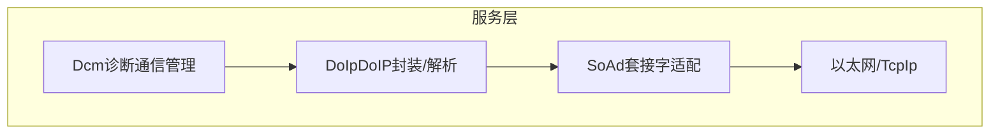
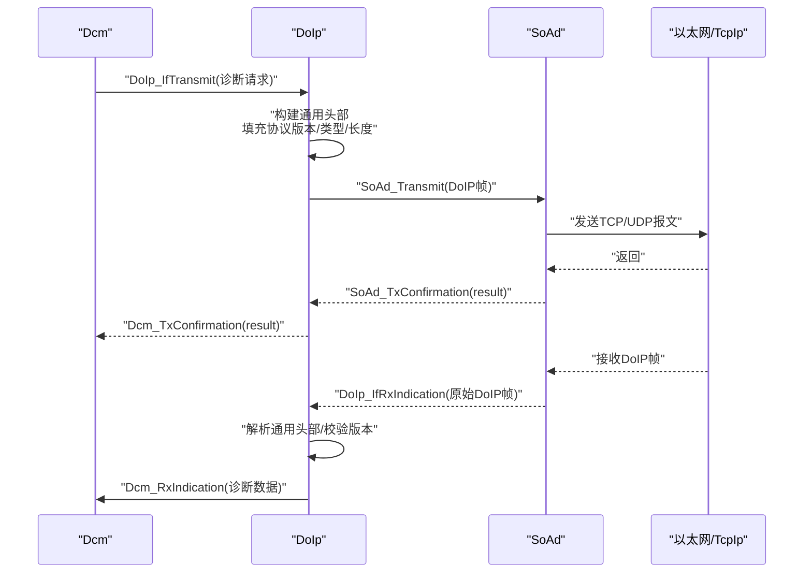
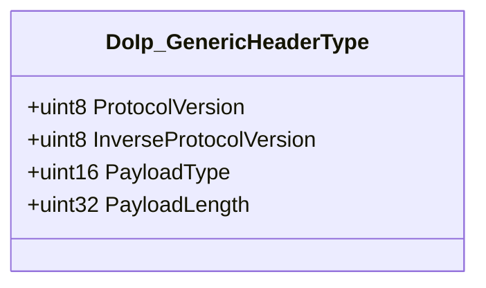
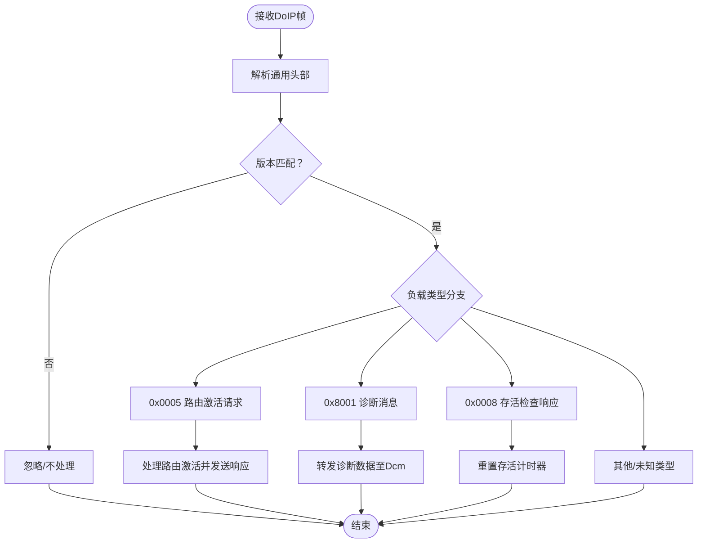
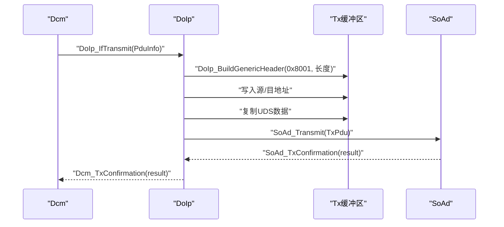
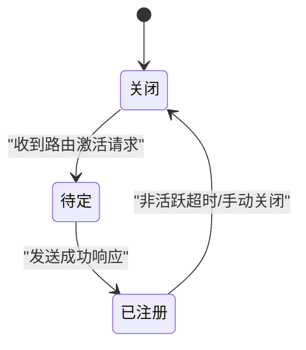
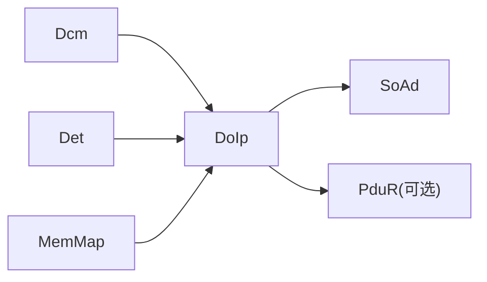

# 协议规范与标准

<cite>
**本文引用的文件**
- [DoIp_spec.md](file://openspec/changes/dev-doip-docan-module/specs/DoIp_spec.md)
- [DoIp.h](file://src/bsw/services/doip/include/DoIp.h)
- [DoIp_Cfg.h](file://src/bsw/services/doip/include/DoIp_Cfg.h)
- [DoIp.c](file://src/bsw/services/doip/src/DoIp.c)
- [DoIp_Lcfg.c](file://src/bsw/services/doip/src/DoIp_Lcfg.c)
- [DoIp_test.c](file://src/bsw/services/doip/src/DoIp_test.c)
- [bsw_integration_verification.md](file://verification/bsw_integration_verification.md)
</cite>

## 目录
1. [引言](#引言)
2. [项目结构](#项目结构)
3. [核心组件](#核心组件)
4. [架构总览](#架构总览)
5. [详细组件分析](#详细组件分析)
6. [依赖关系分析](#依赖关系分析)
7. [性能考虑](#性能考虑)
8. [故障排查指南](#故障排查指南)
9. [结论](#结论)
10. [附录](#附录)

## 引言
本文件面向DoIp（ISO 13400-2）诊断通信协议在本项目的实现与使用，系统化阐述协议版本兼容性、通用头部格式与负载类型定义、字节序与对齐要求、数据封装格式、协议兼容性矩阵与版本演进历史，并提供解析示例与错误处理机制说明。目标读者包括工程开发人员、测试工程师与系统集成人员。

## 项目结构
DoIp模块位于服务层（Service Layer），作为Dcm与底层以太网栈（SoAd/TcpIp）之间的传输适配器，负责UDS诊断会话在IP网络上的承载。其核心由规范文档、头文件接口、实现代码、链接期配置与单元测试构成。

图示来源
- [DoIp_spec.md: 第22-31行:22-31](file://openspec/changes/dev-doip-docan-module/specs/DoIp_spec.md#L22-L31)

章节来源
- [DoIp_spec.md: 第11-31行:11-31](file://openspec/changes/dev-doip-docan-module/specs/DoIp_spec.md#L11-L31)

## 核心组件
- 通用头部结构：DoIp_GenericHeaderType，包含协议版本、反向协议版本、负载类型与负载长度四个字段。
- 负载类型枚举：涵盖车辆识别请求/响应、路由激活请求/响应、存活检查请求/响应、诊断消息及其确认/否定应答。
- 运行时状态：模块状态、连接状态、路由激活配置与连接配置。
- 关键API：初始化/去初始化、诊断消息收发、路由激活、连接关闭、主函数周期处理、SoAd回调。

章节来源
- [DoIp.h: 第103-150行:103-150](file://src/bsw/services/doip/include/DoIp.h#L103-L150)
- [DoIp_spec.md: 第69-162行:69-162](file://openspec/changes/dev-doip-docan-module/specs/DoIp_spec.md#L69-L162)

## 架构总览
DoIp在AutoSAR Classic 4.x框架内，承担“诊断通信”到“以太网传输”的桥接职责。上层通过Dcm发起UDS请求，DoIp将其封装为DoIP帧；下层通过SoAd进行TCP/UDP传输，DoIp负责解析与转发。

图示来源
- [DoIp_spec.md: 第35-66行:35-66](file://openspec/changes/dev-doip-docan-module/specs/DoIp_spec.md#L35-L66)
- [DoIp.c: 第428-487行:428-487](file://src/bsw/services/doip/src/DoIp.c#L428-L487)
- [DoIp.c: 第495-557行:495-557](file://src/bsw/services/doip/src/DoIp.c#L495-L557)

## 详细组件分析

### 通用头部结构与编码规则
- 字段定义
  - 协议版本：1字节，当前实现为0x02。
  - 反向协议版本：1字节，为协议版本按位取反（0xFD）。
  - 负载类型：2字节，大端序。
  - 负载长度：4字节，大端序。
- 字节序与对齐
  - 采用网络字节序（大端序）存储，解析/构建时严格按大端顺序处理。
  - 未见显式内存对齐要求，按标准整数字节边界访问。
- 解析与构建
  - 解析：从原始缓冲区按偏移读取各字段。
  - 构建：按网络字节序写入各字段，确保版本与反向版本匹配。

图示来源
- [DoIp.h: 第105-110行:105-110](file://src/bsw/services/doip/include/DoIp.h#L105-L110)
- [DoIp.c: 第117-134行:117-134](file://src/bsw/services/doip/src/DoIp.c#L117-L134)
- [DoIp.c: 第143-161行:143-161](file://src/bsw/services/doip/src/DoIp.c#L143-L161)

章节来源
- [DoIp_spec.md: 第166-176行:166-176](file://openspec/changes/dev-doip-docan-module/specs/DoIp_spec.md#L166-L176)
- [DoIp.c: 第37-38行:37-38](file://src/bsw/services/doip/src/DoIp.c#L37-L38)

### 负载类型与用途
- 车辆识别请求/响应（0x0001/0x0002）
  - 用于发现ECU身份信息（VIN、逻辑地址、EID、GID等）。
- 路由激活请求/响应（0x0005/0x0006）
  - 建立诊断路由，携带激活类型、源/目标地址与响应码。
- 存活检查请求/响应（0x0007/0x0008）
  - 维持连接活性，定时发送请求并重置计时器。
- 诊断消息（0x8001）
  - 封装UDS请求/响应，包含源/目的逻辑地址与用户数据。
- 诊断消息正/负确认（0x8002/0x8003）
  - 对诊断消息的确认/否定应答。

图示来源
- [DoIp.c: 第519-556行:519-556](file://src/bsw/services/doip/src/DoIp.c#L519-L556)
- [DoIp_spec.md: 第99-112行:99-112](file://openspec/changes/dev-doip-docan-module/specs/DoIp_spec.md#L99-L112)

章节来源
- [DoIp_spec.md: 第177-202行:177-202](file://openspec/changes/dev-doip-docan-module/specs/DoIp_spec.md#L177-L202)

### 诊断消息封装流程
- 计算负载长度：固定头（源/目地址）4字节 + UDS数据长度。
- 构建通用头部：协议版本=0x02，反向版本=0xFD，负载类型=0x8001。
- 写入源/目地址（各2字节）。
- 复制UDS数据（受最大长度限制）。
- 通过SoAd发送。

图示来源
- [DoIp.c: 第428-487行:428-487](file://src/bsw/services/doip/src/DoIp.c#L428-L487)
- [DoIp.c: 第143-161行:143-161](file://src/bsw/services/doip/src/DoIp.c#L143-L161)

章节来源
- [DoIp.c: 第459-480行:459-480](file://src/bsw/services/doip/src/DoIp.c#L459-L480)

### 路由激活与连接管理
- 路由激活请求解析：提取源地址与激活类型，查找配置项，更新连接状态为已注册。
- 路由激活响应：构造响应帧（含测试仪逻辑地址、目标地址、响应码与保留字段）。
- 连接状态机：关闭/待定/建立/已注册。
- 主函数维护：存活检查定时器与非活跃超时，超时则关闭连接。

图示来源
- [DoIp.c: 第674-723行:674-723](file://src/bsw/services/doip/src/DoIp.c#L674-L723)
- [DoIp.c: 第227-259行:227-259](file://src/bsw/services/doip/src/DoIp.c#L227-L259)
- [DoIp.c: 第295-332行:295-332](file://src/bsw/services/doip/src/DoIp.c#L295-L332)

章节来源
- [DoIp_spec.md: 第80-88行:80-88](file://openspec/changes/dev-doip-docan-module/specs/DoIp_spec.md#L80-L88)

### 配置参数与默认值
- 预编译配置（DoIp_Cfg.h）
  - 最大连接数、最大路由激活条目数、诊断请求/响应最大长度、主函数周期等。
- 链接期配置（DoIp_Lcfg.c）
  - 连接配置：源/目地址、测试仪逻辑地址、存活检查超时、非活跃超时、是否启用存活检查。
  - 路由激活配置：激活类型、源/目地址、认证/确认需求等。
- 全局配置（DoIp_Config）：汇总上述配置并暴露给模块。

章节来源
- [DoIp_Cfg.h: 第15-33行:15-33](file://src/bsw/services/doip/include/DoIp_Cfg.h#L15-L33)
- [DoIp_Lcfg.c: 第26-63行:26-63](file://src/bsw/services/doip/src/DoIp_Lcfg.c#L26-L63)
- [DoIp_Lcfg.c: 第66-139行:66-139](file://src/bsw/services/doip/src/DoIp_Lcfg.c#L66-L139)
- [DoIp_Lcfg.c: 第142-151行:142-151](file://src/bsw/services/doip/src/DoIp_Lcfg.c#L142-L151)

## 依赖关系分析
- 上层依赖：Dcm（诊断通信）、Det（错误检测）、MemMap（内存分区）。
- 下层依赖：SoAd（以太网传输）、PduR（可选路径）。
- 内部依赖：DoIp内部状态、连接数组、路由激活表。

图示来源
- [DoIp_spec.md: 第320-330行:320-330](file://openspec/changes/dev-doip-docan-module/specs/DoIp_spec.md#L320-L330)

章节来源
- [DoIp_spec.md: 第318-330行:318-330](file://openspec/changes/dev-doip-docan-module/specs/DoIp_spec.md#L318-L330)

## 性能考虑
- 主函数周期：默认10ms，用于计时与定时任务。
- 缓冲区大小：通用头部8字节 + 诊断消息头4字节 + 最大诊断数据长度（默认4096字节）。
- 连接与路由激活上限：最大连接数与路由激活条目数受配置限制。
- 传输路径：通过SoAd进行TCP/UDP传输，避免在DoIp中重复封装。

章节来源
- [DoIp_Cfg.h: 第33行](file://src/bsw/services/doip/include/DoIp_Cfg.h#L33)
- [DoIp_Lcfg.c: 第142-151行:142-151](file://src/bsw/services/doip/src/DoIp_Lcfg.c#L142-L151)

## 故障排查指南
- 初始化错误
  - 未初始化调用API：返回E_NOT_OK并上报DOIP_E_UNINIT。
  - 传入空指针：上报DOIP_E_PARAM_POINTER。
- 路由激活失败
  - 无效连接或未知激活类型：上报DOIP_E_INVALID_CONNECTION或DOIP_E_INVALID_ROUTING_ACTIVATION。
- 传输确认
  - SoAd回调DoIp_SoAdTxConfirmation后，DoIp转发至Dcm的TxConfirmation。
- 单元测试覆盖
  - 包含初始化、路由激活、发送封装、接收解析、未初始化错误、连接关闭、确认转发与版本查询等场景。

章节来源
- [DoIp_spec.md: 第205-225行:205-225](file://openspec/changes/dev-doip-docan-module/specs/DoIp_spec.md#L205-L225)
- [DoIp.c: 第407-420行:407-420](file://src/bsw/services/doip/src/DoIp.c#L407-L420)
- [DoIp.c: 第566-610行:566-610](file://src/bsw/services/doip/src/DoIp.c#L566-L610)
- [DoIp_test.c: 第110-287行:110-287](file://src/bsw/services/doip/src/DoIp_test.c#L110-L287)

## 结论
本实现严格遵循AutoSAR Classic 4.x标准，完整实现了DoIp通用头部解析与构建、多种负载类型的处理、路由激活与连接管理、以及错误检测与主函数周期处理。通过链接期配置与单元测试保障了可配置性与可靠性，满足在以太网环境下进行UDS诊断通信的需求。

## 附录

### 协议版本兼容性矩阵
- 协议版本：0x02（对应DoIP 2.x）
- 反向版本：0xFD（与0x02按位取反）
- 兼容性：仅接受与模块版本一致的头部；否则丢弃或忽略。

章节来源
- [DoIp.c: 第37-38行:37-38](file://src/bsw/services/doip/src/DoIp.c#L37-L38)
- [DoIp.c: 第521-524行:521-524](file://src/bsw/services/doip/src/DoIp.c#L521-L524)

### 版本演进历史
- 1.0.0（2026-04-24）：初始DoIp规范版本，定义模块职责、API、数据类型与帧格式。

章节来源
- [DoIp_spec.md: 第333-338行:333-338](file://openspec/changes/dev-doip-docan-module/specs/DoIp_spec.md#L333-L338)

### 协议解析示例（步骤化）
- 输入：原始DoIP帧（至少8字节通用头部）
- 步骤：
  1) 校验模块初始化状态与指针有效性。
  2) 解析通用头部：读取协议版本、反向版本、负载类型、负载长度。
  3) 校验版本一致性。
  4) 根据负载类型分派处理：
     - 路由激活请求：查找激活类型，更新连接状态，发送响应。
     - 诊断消息：提取源/目地址，转发用户数据至Dcm。
     - 存活检查响应：重置存活计时器。
  5) 返回处理结果。

章节来源
- [DoIp.c: 第495-557行:495-557](file://src/bsw/services/doip/src/DoIp.c#L495-L557)
- [DoIp.c: 第227-259行:227-259](file://src/bsw/services/doip/src/DoIp.c#L227-L259)
- [DoIp.c: 第267-288行:267-288](file://src/bsw/services/doip/src/DoIp.c#L267-L288)