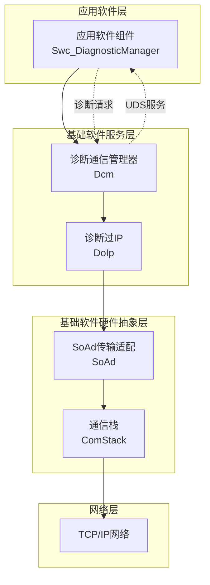
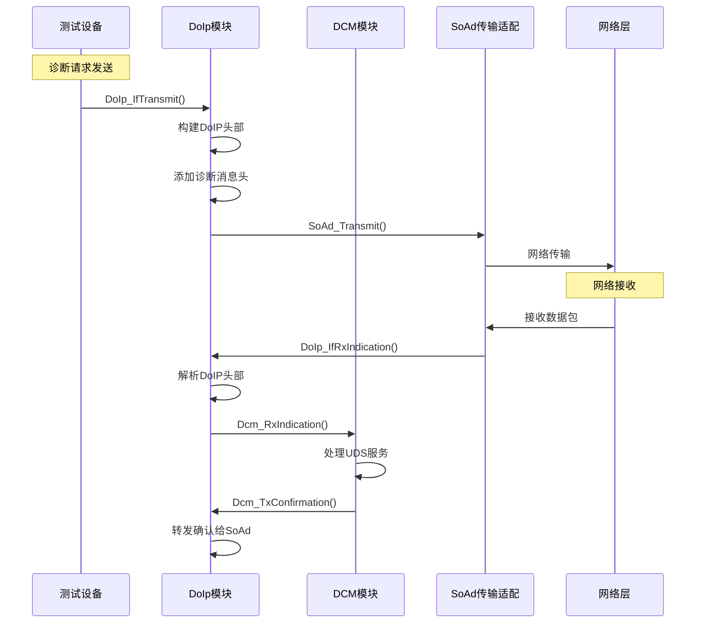
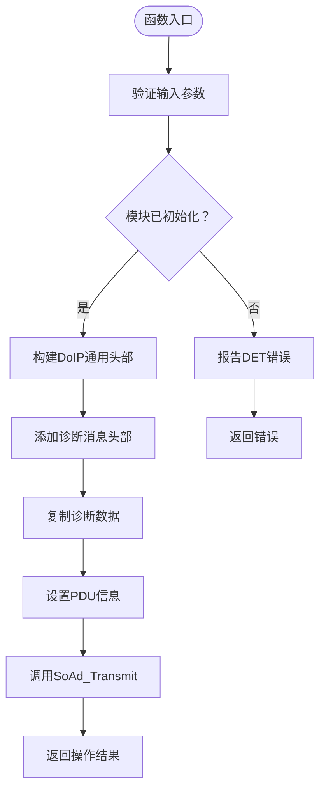
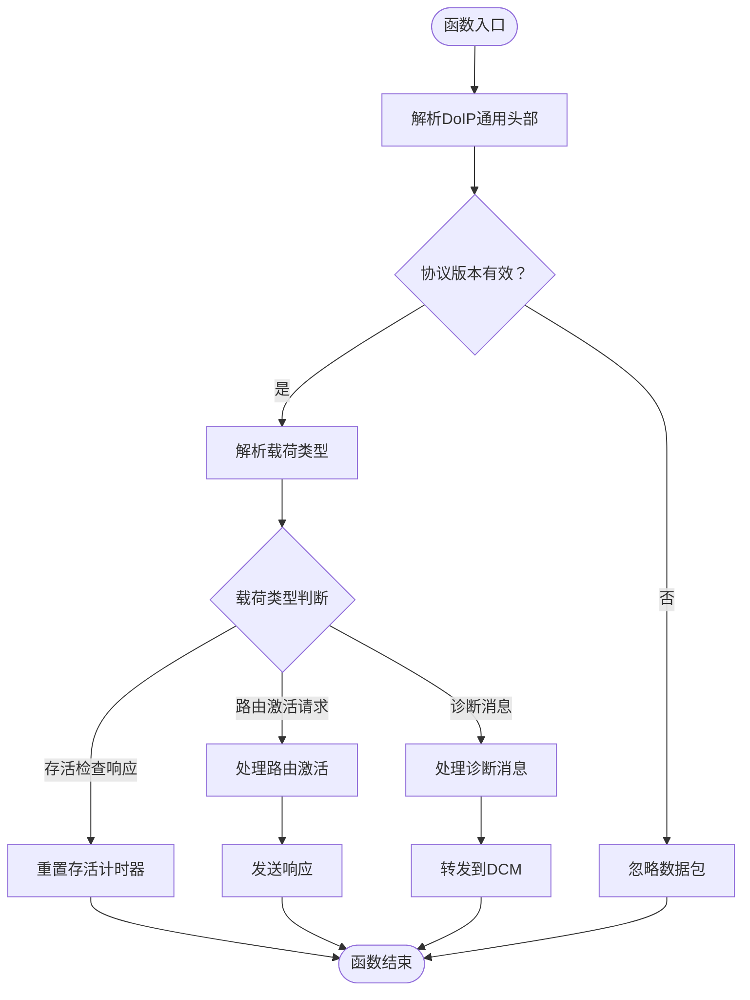
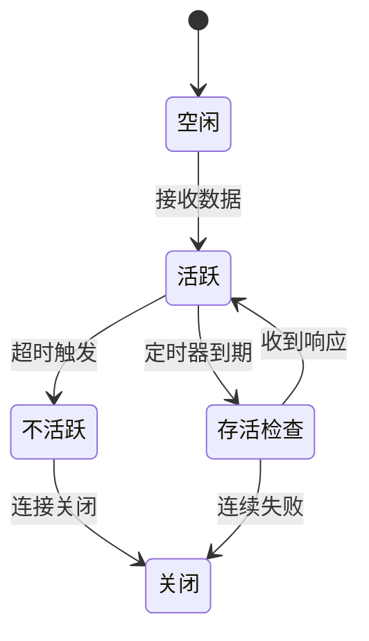
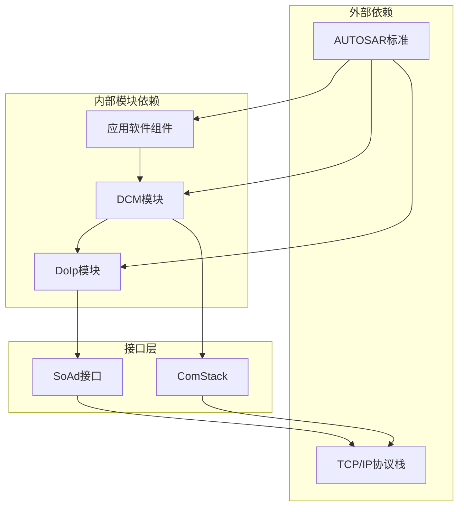

# 诊断消息处理

<cite>
**本文档引用的文件**
- [DoIp.h](file://src/bsw/services/doip/include/DoIp.h)
- [DoIp.c](file://src/bsw/services/doip/src/DoIp.c)
- [DoIp_Cfg.h](file://src/bsw/services/doip/include/DoIp_Cfg.h)
- [DoIp_Lcfg.c](file://src/bsw/services/doip/src/DoIp_Lcfg.c)
- [Dcm.h](file://src/bsw/services/dcm/include/Dcm.h)
- [Dcm.c](file://src/bsw/services/dcm/src/Dcm.c)
- [Dcm_Cfg.h](file://src/bsw/services/dcm/include/Dcm_Cfg.h)
- [Swc_DiagnosticManager.h](file://src/asw/diagnostic_manager/include/Swc_DiagnosticManager.h)
- [Swc_DiagnosticManager.c](file://src/asw/diagnostic_manager/src/Swc_DiagnosticManager.c)
</cite>

## 目录
1. [简介](#简介)
2. [项目结构](#项目结构)
3. [核心组件](#核心组件)
4. [架构概览](#架构概览)
5. [详细组件分析](#详细组件分析)
6. [依赖关系分析](#依赖关系分析)
7. [性能考虑](#性能考虑)
8. [故障排除指南](#故障排除指南)
9. [结论](#结论)

## 简介

本文件详细阐述了基于AutoSAR Classic Platform 4.x标准的DoIp诊断消息处理系统。该系统实现了诊断通信协议在IP网络上的传输，提供了完整的诊断消息接收、处理和转发机制。

系统采用分层架构设计，主要包含以下核心模块：
- **DoIp模块**：负责诊断消息的封装、解析和网络传输
- **DCM模块**：处理诊断会话控制、安全访问等UDS服务
- **应用软件组件**：提供诊断管理功能和DTC处理

## 项目结构

**图表来源**
- [DoIp.h:173-227](file://src/bsw/services/doip/include/DoIp.h#L173-L227)
- [Dcm.h:286-307](file://src/bsw/services/dcm/include/Dcm.h#L286-L307)

**章节来源**
- [DoIp.h:1-233](file://src/bsw/services/doip/include/DoIp.h#L1-L233)
- [Dcm.h:1-379](file://src/bsw/services/dcm/include/Dcm.h#L1-L379)

## 核心组件

### DoIp模块核心功能

DoIp模块实现了AutoSAR标准的诊断过IP功能，主要包含：

**状态管理**
- 模块状态：未初始化、已初始化、活跃状态
- 连接状态：关闭、待定、已建立、已注册
- 路由激活类型：默认、WWH-OBD、中央安全

**消息处理流程**
1. **接收处理**：解析DoIP通用头部，验证协议版本
2. **路由激活**：处理路由激活请求和响应
3. **诊断消息**：封装诊断数据，转发至DCM
4. **发送处理**：构建DoIP头部，通过SoAd传输

**章节来源**
- [DoIp.h:62-85](file://src/bsw/services/doip/include/DoIp.h#L62-L85)
- [DoIp.h:105-150](file://src/bsw/services/doip/include/DoIp.h#L105-L150)

### DCM模块核心功能

DCM模块提供完整的诊断通信管理功能：

**协议支持**
- UDS服务：会话控制、ECU复位、安全访问、测试器存在
- 数据标识符读写：读取和修改车辆数据
- DTC管理：故障码读取、清除和状态监控
- 诊断服务：程序下载、数据传输等高级功能

**会话管理**
- 多会话支持：默认、编程、扩展诊断、安全系统诊断
- 安全级别管理：三级安全访问控制
- 超时管理：P2/P2*定时器和S3服务器定时器

**章节来源**
- [Dcm.h:133-156](file://src/bsw/services/dcm/include/Dcm.h#L133-L156)
- [Dcm.h:247-263](file://src/bsw/services/dcm/include/Dcm.h#L247-L263)

## 架构概览

**图表来源**
- [DoIp.c:428-487](file://src/bsw/services/doip/src/DoIp.c#L428-L487)
- [DoIp.c:495-557](file://src/bsw/services/doip/src/DoIp.c#L495-L557)
- [Dcm.c:1271-1305](file://src/bsw/services/dcm/src/Dcm.c#L1271-L1305)

## 详细组件分析

### DoIp_IfTransmit发送接口实现

DoIp_IfTransmit函数实现了诊断消息的发送功能：

**图表来源**
- [DoIp.c:428-487](file://src/bsw/services/doip/src/DoIp.c#L428-L487)

**处理流程详解**：
1. **参数验证**：检查模块初始化状态和输入指针有效性
2. **头部构建**：使用固定协议版本(0x02)和反码(0xFD)构建通用头部
3. **诊断头添加**：添加源地址和目标地址(各2字节)
4. **数据复制**：将诊断数据复制到发送缓冲区
5. **SoAd传输**：通过SoAd接口发送到网络层

**章节来源**
- [DoIp.c:428-487](file://src/bsw/services/doip/src/DoIp.c#L428-L487)
- [DoIp_Cfg.h:27-28](file://src/bsw/services/doip/include/DoIp_Cfg.h#L27-L28)

### DoIp_IfRxIndication接收指示实现

DoIp_IfRxIndication函数处理来自网络层的诊断消息：

**图表来源**
- [DoIp.c:495-557](file://src/bsw/services/doip/src/DoIp.c#L495-L557)

**处理逻辑**：
1. **头部解析**：提取协议版本、载荷类型和载荷长度
2. **版本验证**：确保协议版本匹配(0x02)和反码验证
3. **载荷分发**：根据载荷类型调用相应处理函数
4. **状态更新**：更新连接状态和计时器

**章节来源**
- [DoIp.c:495-557](file://src/bsw/services/doip/src/DoIp.c#L495-L557)
- [DoIp.c:227-288](file://src/bsw/services/doip/src/DoIp.c#L227-L288)

### 诊断消息负载封装机制

诊断消息的负载封装遵循DoIP标准格式：

**头部结构**：
- **DoIP通用头部**：8字节(协议版本+载荷类型+载荷长度)
- **诊断消息头部**：4字节(源地址2字节+目标地址2字节)
- **诊断数据载荷**：UDS服务数据

**封装流程**：
1. 验证诊断数据长度不超过配置限制(4096字节)
2. 计算总载荷长度：诊断头(4字节)+UDS数据长度
3. 构建DoIP通用头部，载荷类型设为0x8001
4. 添加诊断消息头部(源地址、目标地址)
5. 复制UDS诊断数据到缓冲区

**章节来源**
- [DoIp.c:462-477](file://src/bsw/services/doip/src/DoIp.c#L462-L477)
- [DoIp_Cfg.h:27-28](file://src/bsw/services/doip/include/DoIp_Cfg.h#L27-L28)

### 协议头处理和数据完整性校验

系统实现了多层的数据完整性保护：

**协议头校验**：
- **版本字段**：固定使用0x02协议版本
- **反码验证**：确保0x02的反码为0xFD
- **载荷长度**：验证载荷长度与实际数据匹配

**连接状态管理**：
- **存活检查**：定期发送存活检查请求(默认500ms)
- **通用不活动超时**：连接空闲超时(默认5000ms)
- **状态机转换**：自动处理连接生命周期

**章节来源**
- [DoIp.c:521-524](file://src/bsw/services/doip/src/DoIp.c#L521-L524)
- [DoIp_Lcfg.c:32-34](file://src/bsw/services/doip/src/DoIp_Lcfg.c#L32-L34)

### 诊断响应超时管理和重传机制

系统实现了完整的超时管理和响应处理：

**超时管理策略**：
1. **P2/P2*定时器**：控制服务响应等待时间
2. **S3服务器定时器**：管理诊断会话持续时间
3. **连接超时**：处理网络连接异常情况

**重传机制**：
- 基于定时器的自动重试
- 连接状态的自动恢复
- 错误条件下的降级处理

**章节来源**
- [Dcm.c:1192-1245](file://src/bsw/services/dcm/src/Dcm.c#L1192-L1245)
- [Dcm.c:1203-1242](file://src/bsw/services/dcm/src/Dcm.c#L1203-L1242)

### 消息队列管理、优先级处理和缓冲区管理

系统采用了静态缓冲区管理策略：

**缓冲区配置**：
- **诊断请求缓冲区**：4096字节(最大请求长度)
- **诊断响应缓冲区**：4096字节(最大响应长度)
- **内部工作缓冲区**：包含DoIP头部和诊断头

**内存管理策略**：
1. **静态分配**：所有缓冲区在编译时确定大小
2. **零拷贝传递**：通过指针直接传递数据，避免额外复制
3. **边界检查**：严格的长度验证防止缓冲区溢出

**优先级处理**：
- 所有诊断消息具有相同优先级
- 按到达顺序处理，无抢占机制
- 网络层负责消息排序和完整性

**章节来源**
- [DoIp_Cfg.h:27-28](file://src/bsw/services/doip/include/DoIp_Cfg.h#L27-L28)
- [Dcm_Cfg.h:77-79](file://src/bsw/services/dcm/include/Dcm_Cfg.h#L77-L79)

## 依赖关系分析

**图表来源**
- [DoIp.c:28-30](file://src/bsw/services/doip/src/DoIp.c#L28-L30)
- [Dcm.c:21-23](file://src/bsw/services/dcm/src/Dcm.c#L21-L23)

**依赖关系特点**：
- **单向依赖**：应用软件组件依赖DCM，DCM依赖DoIp
- **抽象接口**：通过AUTOSAR标准接口解耦
- **层次清晰**：从应用层到网络层逐层抽象

**章节来源**
- [DoIp.c:28-30](file://src/bsw/services/doip/src/DoIp.c#L28-L30)
- [Dcm.c:21-23](file://src/bsw/services/dcm/src/Dcm.c#L21-L23)

## 性能考虑

### 内存优化策略

**静态内存分配**
- 所有缓冲区在编译时确定大小，避免运行时内存分配开销
- 减少碎片化，提高内存使用效率
- 支持实时系统确定性行为

**零拷贝优化**
- 通过指针传递数据，避免不必要的内存复制
- 减少CPU占用和内存带宽消耗
- 提高数据传输效率

**编译时优化**
- 使用预编译常量减少运行时计算
- 启用编译器优化选项
- 减少分支预测失败

### 处理性能优化

**批量处理**
- 合并多个小消息到单个传输单元
- 减少网络协议开销
- 提高吞吐量

**异步处理**
- 非阻塞的网络传输接口
- 异步回调机制处理完成通知
- 提高系统并发能力

## 故障排除指南

### 常见错误类型和处理

**初始化错误**
- **DOIP_E_UNINIT**：模块未初始化就调用API
- **DCM_E_UNINIT**：DCM模块未正确初始化
- **处理方法**：确保按正确的初始化顺序调用

**参数验证错误**
- **DOIP_E_PARAM_POINTER**：空指针参数
- **DCM_E_PARAM_POINTER**：DCM参数为空
- **处理方法**：检查所有输入参数的有效性

**连接管理错误**
- **DOIP_E_INVALID_CONNECTION**：无效的连接标识
- **DOIP_E_INVALID_ROUTING_ACTIVATION**：无效的路由激活类型
- **处理方法**：验证配置参数和连接状态

### 调试和监控

**DET报告机制**
- 所有错误条件都会通过DET报告
- 提供详细的错误代码和API标识
- 便于问题定位和调试

**日志记录**
- 关键状态变化的日志输出
- 性能指标的统计收集
- 异常情况的告警机制

**章节来源**
- [DoIp.h:51-57](file://src/bsw/services/doip/include/DoIp.h#L51-L57)
- [Dcm.h:68-76](file://src/bsw/services/dcm/include/Dcm.h#L68-L76)

## 结论

本DoIp诊断消息处理系统实现了完整的诊断通信功能，具有以下特点：

**技术优势**：
- 严格遵循AUTOSAR标准，确保兼容性和可移植性
- 分层架构设计，模块职责清晰，易于维护
- 实时性能优化，支持确定性响应时间
- 完整的错误处理和故障恢复机制

**应用场景**：
- 车辆诊断和标定
- 远程诊断和OTA升级
- 工厂测试和质量保证
- 维修诊断和故障排查

**扩展性**：
- 支持多连接和多路由激活
- 可配置的缓冲区大小和超时参数
- 模块化的架构便于功能扩展

该系统为现代汽车电子系统提供了可靠的诊断通信基础设施，能够满足各种复杂的诊断需求。