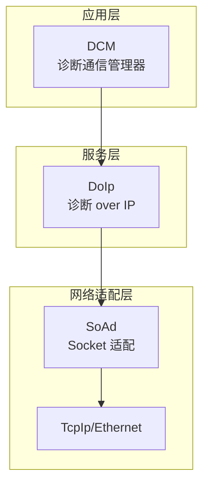
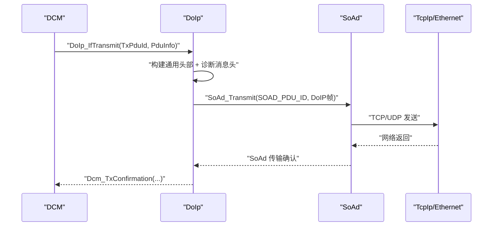
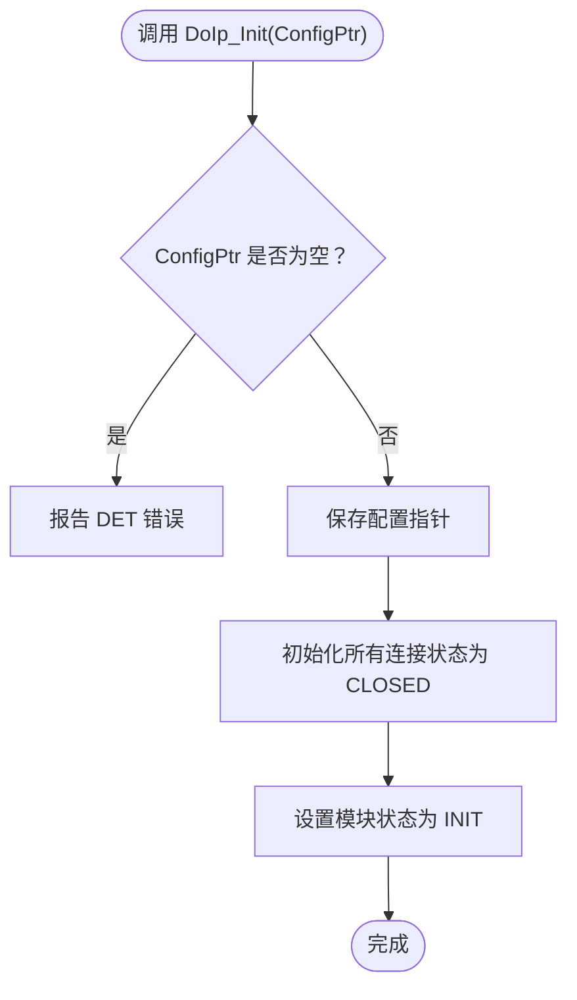
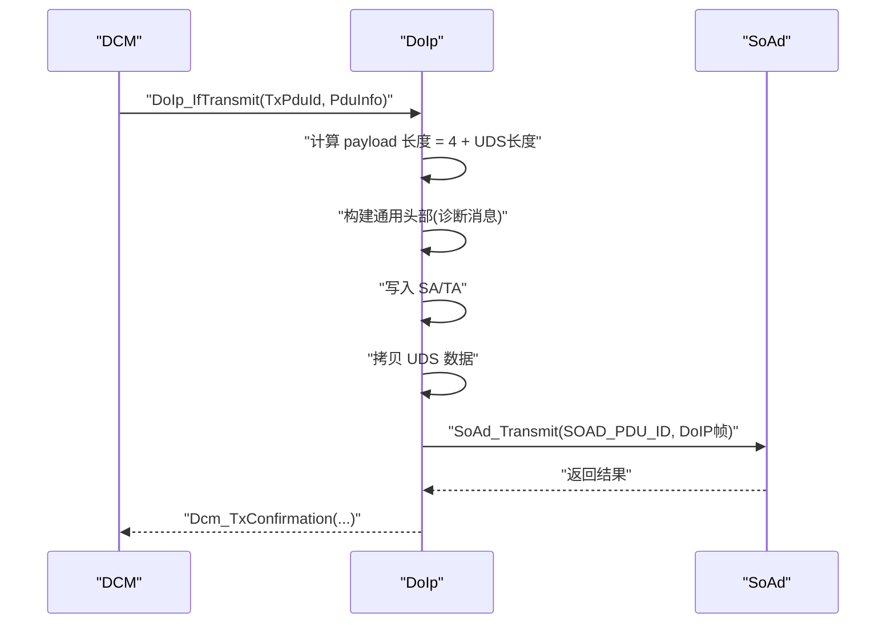
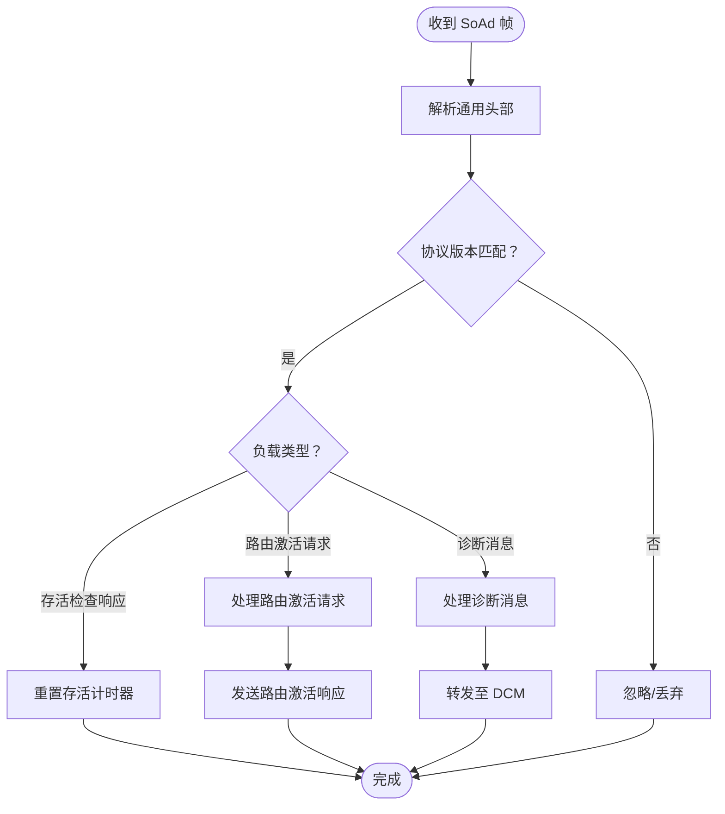
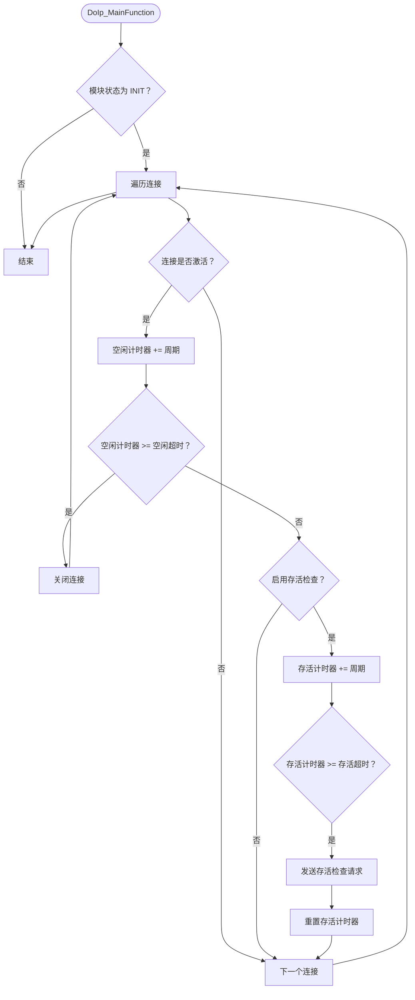
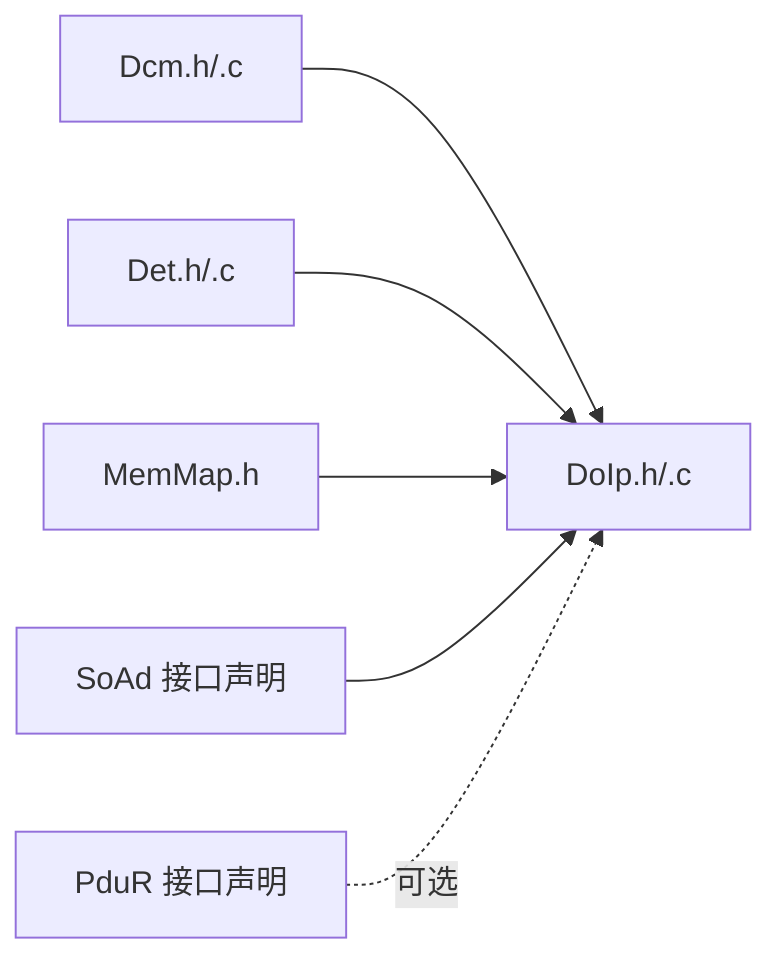

# 诊断通信 (DoIp)

<cite>
**本文引用的文件**
- [DoIp.h](file://src/bsw/services/doip/include/DoIp.h)
- [DoIp.c](file://src/bsw/services/doip/src/DoIp.c)
- [DoIp_Cfg.h](file://src/bsw/services/doip/include/DoIp_Cfg.h)
- [DoIp_Lcfg.c](file://src/bsw/services/doip/src/DoIp_Lcfg.c)
- [DoIp_test.c](file://src/bsw/services/doip/src/DoIp_test.c)
- [Dcm.h](file://src/bsw/services/dcm/include/Dcm.h)
- [Dcm.c](file://src/bsw/services/dcm/src/Dcm.c)
- [DoIp_spec.md](file://openspec/changes/dev-doip-docan-module/specs/DoIp_spec.md)
- [spec.md](file://openspec/specs/toolchain/spec.md)
</cite>

## 目录
1. [简介](#简介)
2. [项目结构](#项目结构)
3. [核心组件](#核心组件)
4. [架构总览](#架构总览)
5. [详细组件分析](#详细组件分析)
6. [依赖关系分析](#依赖关系分析)
7. [性能考量](#性能考量)
8. [故障排查指南](#故障排查指南)
9. [结论](#结论)
10. [附录](#附录)

## 简介
本技术文档围绕诊断通信服务中的 DoIp 模块展开，系统阐述其在 AutoSAR Classic 平台下的实现，重点覆盖：
- ISO 13400-2 协议支持：DoIP 通用头部、诊断消息封装、路由激活、存活检查等
- 网络层通信与连接管理：基于 SoAd 的 TCP/UDP 适配、逻辑地址与连接状态维护
- 诊断服务封装：UDS 请求/响应在 DoIP 帧中的封装与转发
- 初始化流程与配置：DoIp_Init、配置参数、运行时状态
- 响应时间与超时：空闲超时、存活检查、错误上报与重试策略
- 关键接口：获取下一个诊断消息、发送诊断消息、路由激活、连接关闭等

## 项目结构
DoIp 模块位于基础软件服务层，与 DCM（诊断通信管理器）和 SoAd（以太网套接字适配）协作，形成“UDS → DoIP → SoAd/TcpIp/Ethernet”的完整链路。

图表来源
- [DoIp_spec.md:22-31](file://openspec/changes/dev-doip-docan-module/specs/DoIp_spec.md#L22-L31)
- [DoIp.h:169-227](file://src/bsw/services/doip/include/DoIp.h#L169-L227)
- [Dcm.h:282-373](file://src/bsw/services/dcm/include/Dcm.h#L282-L373)

章节来源
- [DoIp_spec.md:11-31](file://openspec/changes/dev-doip-docan-module/specs/DoIp_spec.md#L11-L31)
- [DoIp.h:169-227](file://src/bsw/services/doip/include/DoIp.h#L169-L227)
- [Dcm.h:282-373](file://src/bsw/services/dcm/include/Dcm.h#L282-L373)

## 核心组件
- 模块状态类型：未初始化、已初始化、活跃
- 连接状态类型：关闭、待定、已建立、已注册
- 路由激活类型：默认、WWH-OBD、中央安全
- 负载类型：车辆识别、路由激活、存活检查、诊断消息及确认
- 配置类型：连接配置、路由激活配置、全局配置
- 关键 API：初始化、去初始化、版本信息、传输、接收指示、路由激活、连接关闭、传输确认、主函数

章节来源
- [DoIp.h:62-150](file://src/bsw/services/doip/include/DoIp.h#L62-L150)
- [DoIp.h:169-227](file://src/bsw/services/doip/include/DoIp.h#L169-L227)

## 架构总览
DoIp 作为服务层模块，负责：
- 将来自 DCM 的 UDS 数据封装为 DoIP 帧（含通用头部与诊断消息头）
- 通过 SoAd 发送/接收 DoIP 帧
- 处理路由激活请求与响应
- 维护连接状态与定时器，执行存活检查与空闲超时处理

图表来源
- [DoIp.c:428-487](file://src/bsw/services/doip/src/DoIp.c#L428-L487)
- [DoIp.c:653-667](file://src/bsw/services/doip/src/DoIp.c#L653-L667)

章节来源
- [DoIp.c:428-487](file://src/bsw/services/doip/src/DoIp.c#L428-L487)
- [DoIp.c:653-667](file://src/bsw/services/doip/src/DoIp.c#L653-L667)

## 详细组件分析

### 初始化与配置
- DoIp_Init：存储配置指针，初始化所有连接状态为关闭，设置模块状态为已初始化
- 配置参数：最大连接数、路由激活条目数、诊断请求/响应最大长度、主函数周期、PDU ID、逻辑地址、路由激活 ID
- 链接时配置：连接数组、路由激活数组、全局配置对象

图表来源
- [DoIp.c:369-398](file://src/bsw/services/doip/src/DoIp.c#L369-L398)
- [DoIp_Cfg.h:15-62](file://src/bsw/services/doip/include/DoIp_Cfg.h#L15-L62)
- [DoIp_Lcfg.c:25-151](file://src/bsw/services/doip/src/DoIp_Lcfg.c#L25-L151)

章节来源
- [DoIp.c:369-398](file://src/bsw/services/doip/src/DoIp.c#L369-L398)
- [DoIp_Cfg.h:15-62](file://src/bsw/services/doip/include/DoIp_Cfg.h#L15-L62)
- [DoIp_Lcfg.c:25-151](file://src/bsw/services/doip/src/DoIp_Lcfg.c#L25-L151)

### 诊断消息封装与发送
- DoIp_IfTransmit：计算负载长度（SA+TA+UDS），构建通用头部（诊断消息类型），填充诊断消息头（SA/TA），拷贝 UDS 数据，调用 SoAd_Transmit 发送
- 传输确认回调 DoIp_SoAdTxConfirmation：转发给 DCM 的 Dcm_TxConfirmation

图表来源
- [DoIp.c:428-487](file://src/bsw/services/doip/src/DoIp.c#L428-L487)
- [DoIp.c:653-667](file://src/bsw/services/doip/src/DoIp.c#L653-L667)

章节来源
- [DoIp.c:428-487](file://src/bsw/services/doip/src/DoIp.c#L428-L487)
- [DoIp.c:653-667](file://src/bsw/services/doip/src/DoIp.c#L653-L667)

### 接收与路由激活处理
- DoIp_IfRxIndication：解析通用头部，校验协议版本，根据负载类型分发处理
- 路由激活请求：解析源地址与激活类型，更新连接状态为已注册，发送路由激活响应
- 诊断消息：解析 SA/TA，重置空闲计时器，转发给 DCM

图表来源
- [DoIp.c:495-557](file://src/bsw/services/doip/src/DoIp.c#L495-L557)
- [DoIp.c:227-259](file://src/bsw/services/doip/src/DoIp.c#L227-L259)
- [DoIp.c:267-288](file://src/bsw/services/doip/src/DoIp.c#L267-L288)

章节来源
- [DoIp.c:495-557](file://src/bsw/services/doip/src/DoIp.c#L495-L557)
- [DoIp.c:227-259](file://src/bsw/services/doip/src/DoIp.c#L227-L259)
- [DoIp.c:267-288](file://src/bsw/services/doip/src/DoIp.c#L267-L288)

### 连接状态管理与定时器
- 连接状态：关闭、待定、已建立、已注册
- 主函数 DoIp_MainFunction：遍历活动连接，累加空闲计时器；若超过空闲超时则关闭连接；若启用存活检查且超过超时则发送存活检查请求并复位计时器

图表来源
- [DoIp.c:674-723](file://src/bsw/services/doip/src/DoIp.c#L674-L723)

章节来源
- [DoIp.c:674-723](file://src/bsw/services/doip/src/DoIp.c#L674-L723)

### 路由激活请求与响应
- 路由激活请求处理：解析源地址与类型，查找对应路由激活配置，更新连接状态为已注册，发送路由激活响应（成功或失败码）
- 路由激活响应：包含测试仪逻辑地址、目标地址、响应码与保留字段

章节来源
- [DoIp.c:227-259](file://src/bsw/services/doip/src/DoIp.c#L227-L259)
- [DoIp.c:295-332](file://src/bsw/services/doip/src/DoIp.c#L295-L332)

### 诊断响应时间管理与超时处理
- 空闲超时：连接在无活动时达到空闲超时则关闭
- 存活检查：启用时按周期发送存活检查请求，收到响应后重置计时器
- 错误上报：通过 DET 报告未初始化、参数错误等

章节来源
- [DoIp.c:674-723](file://src/bsw/services/doip/src/DoIp.c#L674-L723)
- [DoIp.h:49-57](file://src/bsw/services/doip/include/DoIp.h#L49-L57)

### 错误重传机制
- 当前实现未显式实现诊断消息的自动重传；传输结果通过 SoAd 回调传递给 DCM，由上层模块决定是否重试
- 建议：可在 DCM 层引入请求等待与重试策略，结合 DoIp_SoAdTxConfirmation 的结果进行决策

章节来源
- [DoIp.c:653-667](file://src/bsw/services/doip/src/DoIp.c#L653-L667)
- [Dcm.h:353-368](file://src/bsw/services/dcm/include/Dcm.h#L353-L368)

### 关键接口说明
- DoIp_Init/DeInit：模块生命周期管理
- DoIp_IfTransmit：封装并发送诊断消息
- DoIp_IfRxIndication：接收并解析 DoIP 帧
- DoIp_ActivateRouting：激活诊断路由路径
- DoIp_CloseConnection：关闭活动连接
- DoIp_SoAdTxConfirmation：传输确认回调
- DoIp_MainFunction：周期性任务（空闲超时、存活检查）

章节来源
- [DoIp.h:169-227](file://src/bsw/services/doip/include/DoIp.h#L169-L227)
- [DoIp.c:369-420](file://src/bsw/services/doip/src/DoIp.c#L369-L420)
- [DoIp.c:428-487](file://src/bsw/services/doip/src/DoIp.c#L428-L487)
- [DoIp.c:495-557](file://src/bsw/services/doip/src/DoIp.c#L495-L557)
- [DoIp.c:566-610](file://src/bsw/services/doip/src/DoIp.c#L566-L610)
- [DoIp.c:617-645](file://src/bsw/services/doip/src/DoIp.c#L617-L645)
- [DoIp.c:653-667](file://src/bsw/services/doip/src/DoIp.c#L653-L667)
- [DoIp.c:674-723](file://src/bsw/services/doip/src/DoIp.c#L674-L723)

## 依赖关系分析
- 上层依赖：DCM（UDS 协议处理）、DET（错误上报）、MemMap（内存段）
- 下层依赖：SoAd（TCP/UDP 传输）、PduR（可选）
- 内部依赖：内部状态结构体、连接数组、通用头部解析/构建

图表来源
- [DoIp.h:19-22](file://src/bsw/services/doip/include/DoIp.h#L19-L22)
- [DoIp.c:28-31](file://src/bsw/services/doip/src/DoIp.c#L28-L31)
- [DoIp_spec.md:318-329](file://openspec/changes/dev-doip-docan-module/specs/DoIp_spec.md#L318-L329)

章节来源
- [DoIp.h:19-22](file://src/bsw/services/doip/include/DoIp.h#L19-L22)
- [DoIp.c:28-31](file://src/bsw/services/doip/src/DoIp.c#L28-L31)
- [DoIp_spec.md:318-329](file://openspec/changes/dev-doip-docan-module/specs/DoIp_spec.md#L318-L329)

## 性能考量
- 主函数周期：每 10ms 执行一次，平衡定时精度与 CPU 开销
- 缓冲区大小：诊断请求/响应最大长度均为 4096 字节，满足典型 UDS 需求
- 连接数量：最多 4 个并发连接，路由激活条目最多 8 项
- 传输路径：直接通过 SoAd 发送，避免额外中间层开销

章节来源
- [DoIp_Cfg.h:33-28](file://src/bsw/services/doip/include/DoIp_Cfg.h#L33-L28)
- [DoIp_Lcfg.c:25-63](file://src/bsw/services/doip/src/DoIp_Lcfg.c#L25-L63)

## 故障排查指南
- 未初始化错误：调用 DoIp_IfTransmit/IfRxIndication/ActivateRouting/CloseConnection 前必须先初始化
- 参数错误：传入空指针或无效 PDU ID
- 传输失败：检查 SoAd 返回值与网络连通性
- 路由激活失败：确认激活类型与配置一致，检查响应码
- 连接关闭：检查空闲超时与存活检查配置，确保定期交互

章节来源
- [DoIp.h:49-57](file://src/bsw/services/doip/include/DoIp.h#L49-L57)
- [DoIp.c:440-451](file://src/bsw/services/doip/src/DoIp.c#L440-L451)
- [DoIp_test.c:121-133](file://src/bsw/services/doip/src/DoIp_test.c#L121-L133)

## 结论
DoIp 模块实现了 ISO 13400-2 协议的关键能力，能够将 UDS 诊断请求封装为 DoIP 帧并通过 SoAd 完成网络传输。其设计遵循 AutoSAR 规范，具备清晰的状态机、完善的 DET 错误处理与可扩展的配置结构。建议在 DCM 层补充请求等待与重试策略，以提升诊断通信的鲁棒性。

## 附录

### 网络配置参数
- 预编译配置（DoIp_Cfg.h）
  - 开发错误检测开关、版本信息 API 开关
  - 最大连接数、最大路由激活数
  - 诊断请求/响应最大长度
  - 主函数周期
  - PDU ID、连接 ID、逻辑地址、路由激活 ID

- 链接时配置（DoIp_Lcfg.c）
  - 连接数组：源地址、目标地址、测试仪逻辑地址、存活检查超时、空闲超时、是否启用存活检查
  - 路由激活数组：激活类型、源/目标地址、认证/确认需求
  - 全局配置：连接数、路由激活数、错误检测、版本信息 API、车辆公告次数与间隔

章节来源
- [DoIp_Cfg.h:15-62](file://src/bsw/services/doip/include/DoIp_Cfg.h#L15-L62)
- [DoIp_Lcfg.c:25-151](file://src/bsw/services/doip/src/DoIp_Lcfg.c#L25-L151)

### 单元测试要点
- 初始化：有效配置与空配置的 DET 报告
- 路由激活：成功与失败场景
- 传输封装：DoIP 帧头部正确性
- 接收路由：DoIP 帧解析与转发到 DCM
- 未初始化错误：对未初始化状态的 API 调用应触发 DET
- 传输确认：SoAd 回调正确转发至 DCM
- 版本信息：返回正确的模块版本

章节来源
- [DoIp_test.c:110-287](file://src/bsw/services/doip/src/DoIp_test.c#L110-L287)