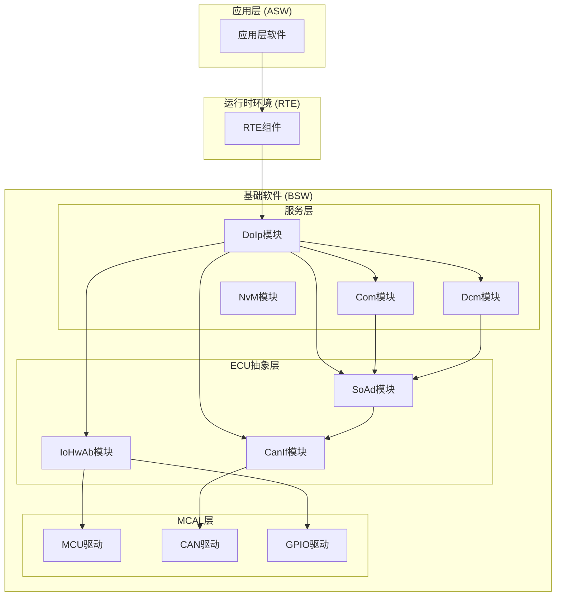
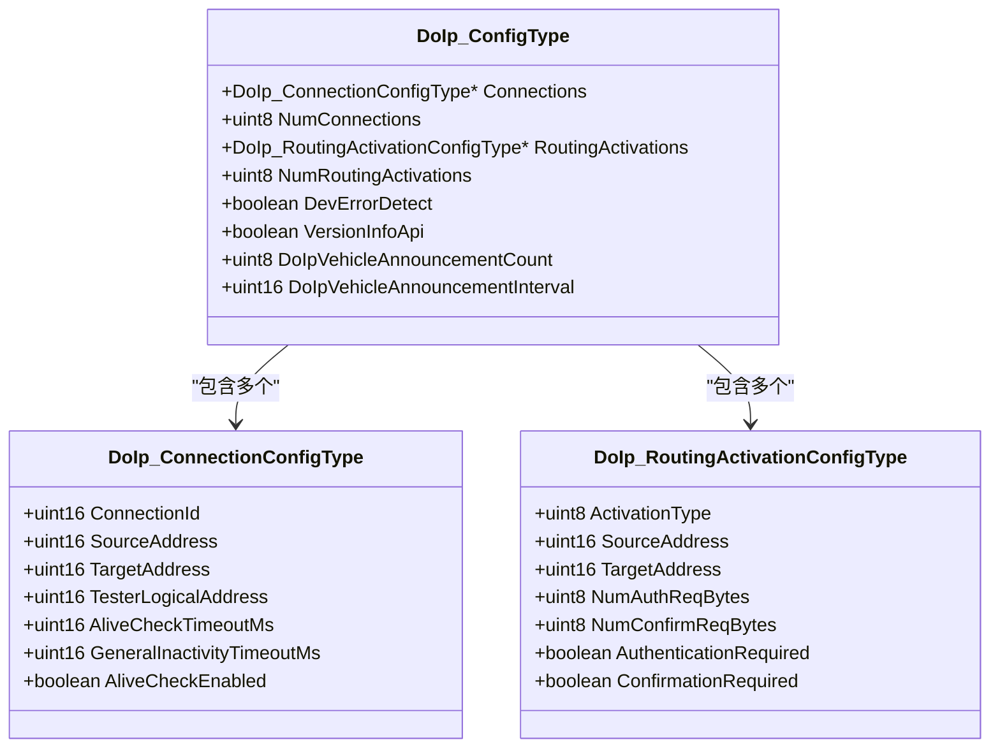
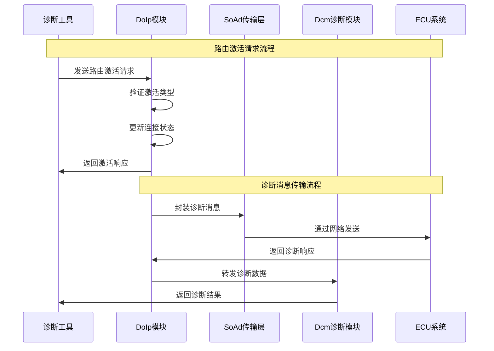
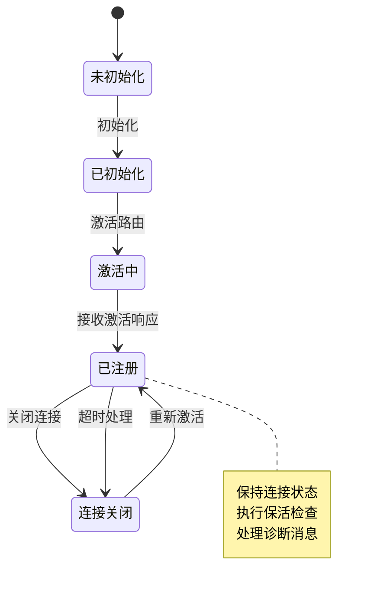
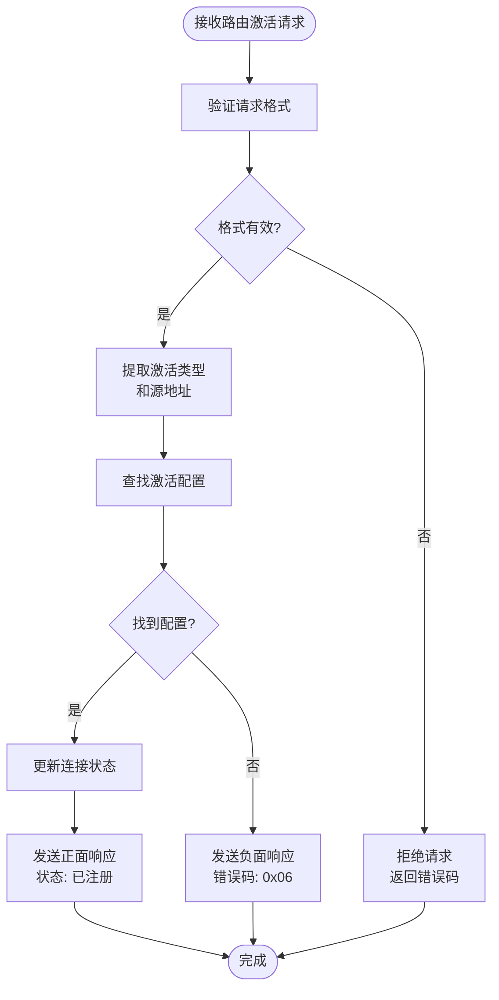
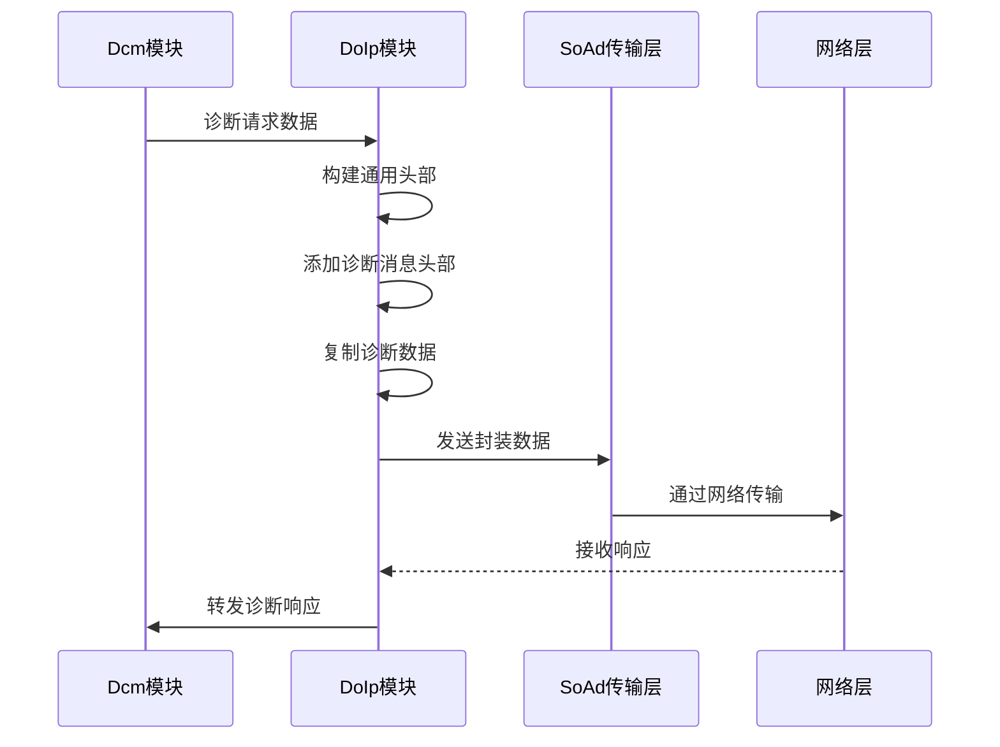
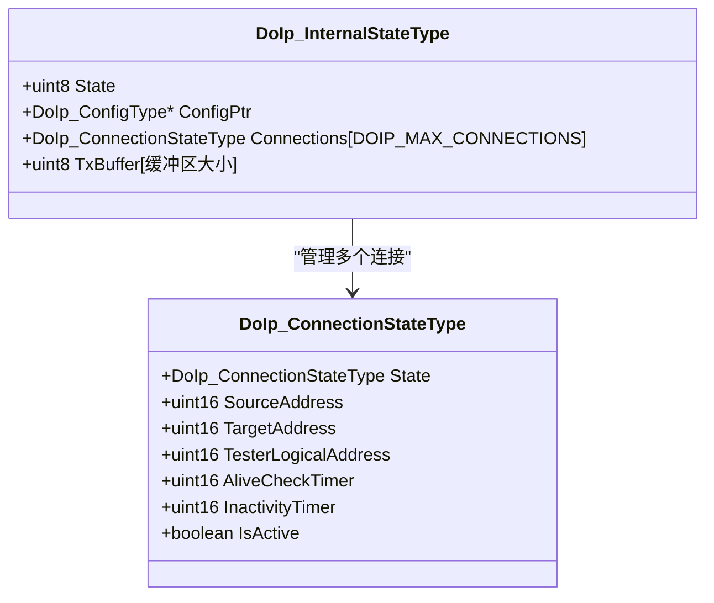
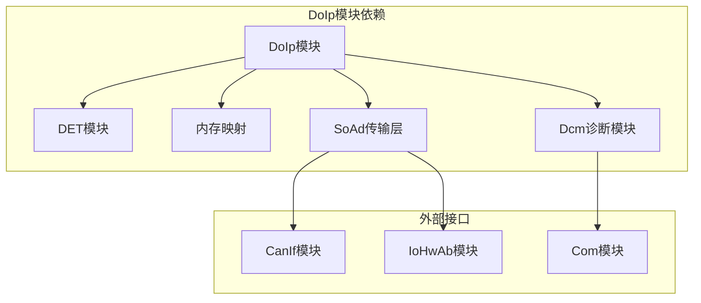
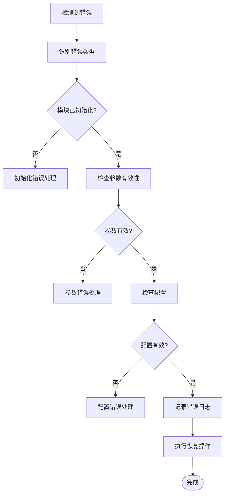

# 路由激活机制

<cite>
**本文档引用的文件**
- [DoIp.h](file://src/bsw/services/doip/include/DoIp.h)
- [DoIp.c](file://src/bsw/services/doip/src/DoIp.c)
- [DoIp_Cfg.h](file://src/bsw/services/doip/include/DoIp_Cfg.h)
- [DoIp_Lcfg.c](file://src/bsw/services/doip/src/DoIp_Lcfg.c)
- [DoIp_test.c](file://src/bsw/services/doip/src/DoIp_test.c)
- [spec.md](file://openspec/specs/bsw/spec.md)
- [bsw_config.json](file://config/bsw_config.json)
</cite>

## 目录
1. [简介](#简介)
2. [项目结构](#项目结构)
3. [核心组件](#核心组件)
4. [架构概览](#架构概览)
5. [详细组件分析](#详细组件分析)
6. [依赖关系分析](#依赖关系分析)
7. [性能考虑](#性能考虑)
8. [故障排除指南](#故障排除指南)
9. [结论](#结论)

## 简介

本文档详细阐述了DoIp（Diagnostic over Internet Protocol）路由激活机制，这是基于AutoSAR Classic Platform 4.4标准实现的诊断通信协议。该机制允许通过IP网络建立诊断路由路径，支持多种激活类型，包括默认激活、WWH-OBD激活和中央安全激活。

DoIp路由激活机制的核心功能是建立和管理诊断通信连接，通过逻辑地址映射实现ECU与诊断工具之间的可靠通信。系统支持多连接管理、自动保活检查和超时处理，确保诊断通信的稳定性和安全性。

## 项目结构

DoIp模块位于基础软件服务层中，采用AutoSAR标准的分层架构设计：

**图表来源**
- [spec.md:13-47](file://openspec/specs/bsw/spec.md#L13-L47)

**章节来源**
- [DoIp.h:1-233](file://src/bsw/services/doip/include/DoIp.h#L1-L233)
- [DoIp_Cfg.h:1-64](file://src/bsw/services/doip/include/DoIp_Cfg.h#L1-L64)

## 核心组件

### 路由激活类型枚举

DoIp模块定义了三种主要的路由激活类型：

| 类型标识 | 常量名称 | 十六进制值 | 描述 |
|---------|----------|------------|------|
| 默认激活 | DOIP_ROUTING_ACTIVATION_DEFAULT | 0x00 | 标准诊断激活，适用于一般诊断场景 |
| WWH-OBD激活 | DOIP_ROUTING_ACTIVATION_WWH_OBD | 0x01 | 符合WWH-OBD标准的激活类型 |
| 中央安全激活 | DOIP_ROUTING_ACTIVATION_CENTRAL_SECURITY | 0xE0 | 高安全级别的激活类型 |

### 路由激活配置结构

`DoIp_RoutingActivationConfigType`结构体定义了路由激活的配置参数：

**图表来源**
- [DoIp.h:126-150](file://src/bsw/services/doip/include/DoIp.h#L126-L150)

**章节来源**
- [DoIp.h:78-150](file://src/bsw/services/doip/include/DoIp.h#L78-L150)
- [DoIp_Lcfg.c:66-139](file://src/bsw/services/doip/src/DoIp_Lcfg.c#L66-L139)

## 架构概览

### 系统架构图

**图表来源**
- [DoIp.c:227-332](file://src/bsw/services/doip/src/DoIp.c#L227-L332)
- [DoIp.c:428-487](file://src/bsw/services/doip/src/DoIp.c#L428-L487)

### 状态转换图

**图表来源**
- [DoIp.c:62-71](file://src/bsw/services/doip/src/DoIp.c#L62-L71)
- [DoIp.c:566-610](file://src/bsw/services/doip/src/DoIp.c#L566-L610)

## 详细组件分析

### 路由激活请求处理

#### 请求解析流程

**图表来源**
- [DoIp.c:227-259](file://src/bsw/services/doip/src/DoIp.c#L227-L259)

#### 激活类型配置

系统支持以下激活类型的配置：

| 激活类型 | 源地址 | 目标地址 | 认证需求 | 确认需求 | 用途场景 |
|---------|--------|----------|----------|----------|----------|
| 默认激活 | 诊断工具 | ECU | 否 | 否 | 标准诊断通信 |
| WWH-OBD激活 | 诊断工具 | ECU | 可选 | 可选 | OBD诊断标准 |
| 中央安全激活 | 诊断工具 | ECU | 可选 | 可选 | 高安全诊断 |

**章节来源**
- [DoIp_Lcfg.c:66-139](file://src/bsw/services/doip/src/DoIp_Lcfg.c#L66-L139)
- [DoIp.h:81-85](file://src/bsw/services/doip/include/DoIp.h#L81-L85)

### 诊断消息处理

#### 数据封装流程

**图表来源**
- [DoIp.c:428-487](file://src/bsw/services/doip/src/DoIp.c#L428-L487)
- [DoIp.c:341-358](file://src/bsw/services/doip/src/DoIp.c#L341-L358)

**章节来源**
- [DoIp.c:428-557](file://src/bsw/services/doip/src/DoIp.c#L428-L557)

### 连接管理机制

#### 连接状态管理

DoIp模块维护每个连接的状态信息：

**图表来源**
- [DoIp.c:62-80](file://src/bsw/services/doip/src/DoIp.c#L62-L80)

**章节来源**
- [DoIp.c:62-80](file://src/bsw/services/doip/src/DoIp.c#L62-L80)

## 依赖关系分析

### 模块间依赖关系

**图表来源**
- [DoIp.c:28-31](file://src/bsw/services/doip/src/DoIp.c#L28-L31)

### 配置依赖关系

DoIp模块的配置依赖于多个配置文件：

| 配置文件 | 作用 | 关键参数 |
|---------|------|----------|
| DoIp_Cfg.h | 编译时配置 | 最大连接数、诊断长度限制 |
| DoIp_Lcfg.c | 运行时配置 | 连接配置、激活类型配置 |
| bsw_config.json | 系统配置 | MCU时钟频率、CAN配置 |

**章节来源**
- [DoIp_Cfg.h:15-63](file://src/bsw/services/doip/include/DoIp_Cfg.h#L15-L63)
- [DoIp_Lcfg.c:26-151](file://src/bsw/services/doip/src/DoIp_Lcfg.c#L26-L151)

## 性能考虑

### 实时性能指标

DoIp模块在性能方面具有以下特点：

| 指标 | 值 | 说明 |
|------|----|------|
| 主函数周期 | 10ms | 定时执行周期 |
| 最大诊断请求长度 | 4096字节 | 支持大数据传输 |
| 最大诊断响应长度 | 4096字节 | 支持大数据响应 |
| 最大连接数 | 4个 | 并发连接支持 |
| 最大路由激活类型 | 8种 | 配置灵活性 |

### 优化策略

1. **内存管理优化**
   - 使用静态缓冲区减少动态分配
   - 合理的缓冲区大小配置
   - 避免内存碎片

2. **处理效率优化**
   - 快速查找算法用于连接和激活类型匹配
   - 条件编译启用/禁用功能
   - 减少不必要的数据复制

3. **网络传输优化**
   - 批量处理诊断消息
   - 适当的超时配置
   - 保活机制避免连接中断

**章节来源**
- [DoIp_Cfg.h:27-33](file://src/bsw/services/doip/include/DoIp_Cfg.h#L27-L33)
- [DoIp.c:674-723](file://src/bsw/services/doip/src/DoIp.c#L674-L723)

## 故障排除指南

### 常见错误类型

DoIp模块定义了以下错误码：

| 错误码 | 常量名 | 描述 | 处理建议 |
|--------|--------|------|----------|
| 0x01 | DOIP_E_PARAM_POINTER | 参数指针为空 | 检查传入参数有效性 |
| 0x02 | DOIP_E_PARAM_CONFIG | 配置参数无效 | 验证配置文件完整性 |
| 0x03 | DOIP_E_UNINIT | 模块未初始化 | 先调用初始化函数 |
| 0x04 | DOIP_E_INVALID_PDU_ID | PDU ID无效 | 检查PDU标识符 |
| 0x05 | DOIP_E_INVALID_CONNECTION | 连接无效 | 验证连接参数 |
| 0x06 | DOIP_E_INVALID_ROUTING_ACTIVATION | 路由激活类型无效 | 检查激活类型配置 |

### 故障诊断流程

**图表来源**
- [DoIp.h:51-57](file://src/bsw/services/doip/include/DoIp.h#L51-L57)

### 测试验证

DoIp模块包含完整的单元测试覆盖：

| 测试类别 | 测试用例数量 | 覆盖范围 |
|----------|-------------|----------|
| 初始化测试 | 2个 | 基本初始化功能 |
| 路由激活测试 | 1个 | 激活功能验证 |
| 传输测试 | 2个 | 数据传输功能 |
| 错误处理测试 | 3个 | 异常情况处理 |
| 完整性测试 | 1个 | 功能完整性验证 |

**章节来源**
- [DoIp_test.c:110-287](file://src/bsw/services/doip/src/DoIp_test.c#L110-L287)

## 结论

DoIp路由激活机制为现代汽车诊断系统提供了强大的网络通信能力。通过支持多种激活类型和灵活的配置选项，该模块能够适应不同的诊断场景和安全要求。

### 主要优势

1. **标准化支持**：完全符合AutoSAR Classic Platform 4.4标准
2. **安全性**：支持多种安全级别的激活类型
3. **可靠性**：完善的错误检测和处理机制
4. **可扩展性**：支持多连接和灵活的配置管理
5. **性能优化**：高效的内存使用和处理机制

### 应用场景

- **标准诊断**：使用默认激活类型进行常规诊断
- **OBD诊断**：支持WWH-OBD标准的诊断需求
- **高级诊断**：使用中央安全激活进行高安全级别诊断
- **多路诊断**：同时管理多个并发诊断连接

该模块为车辆诊断系统提供了坚实的基础，支持从简单诊断到复杂安全诊断的各种应用场景。