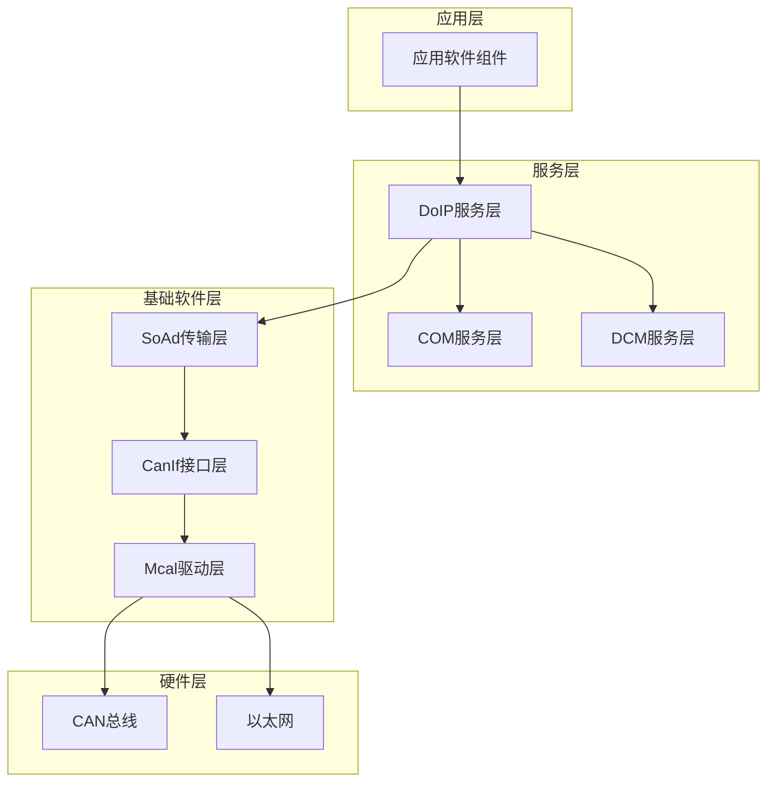
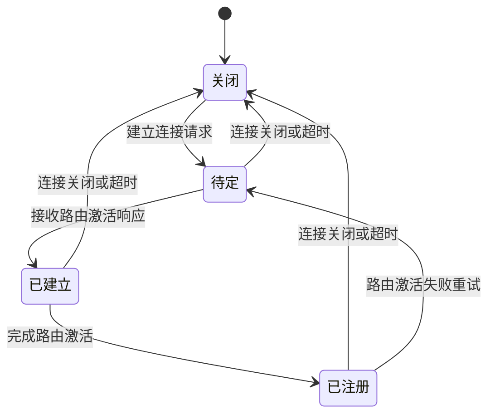
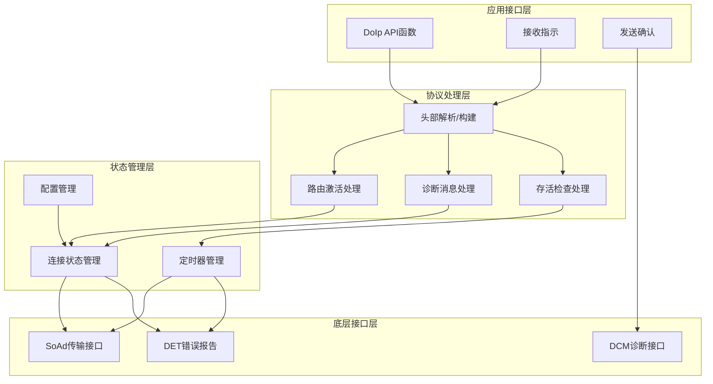
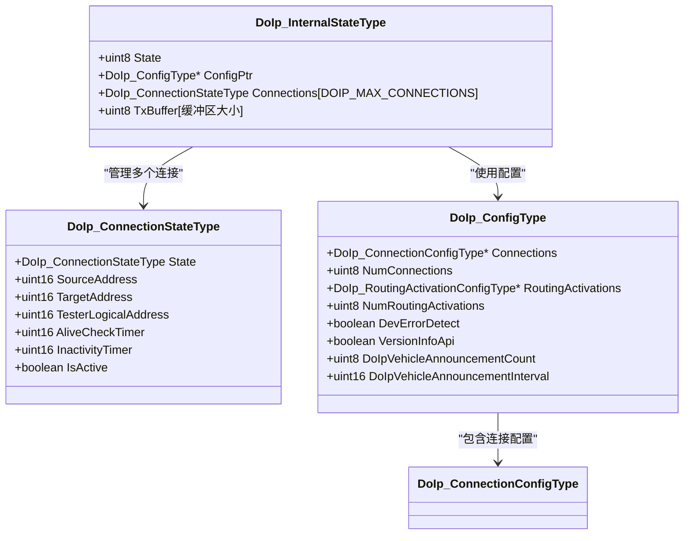
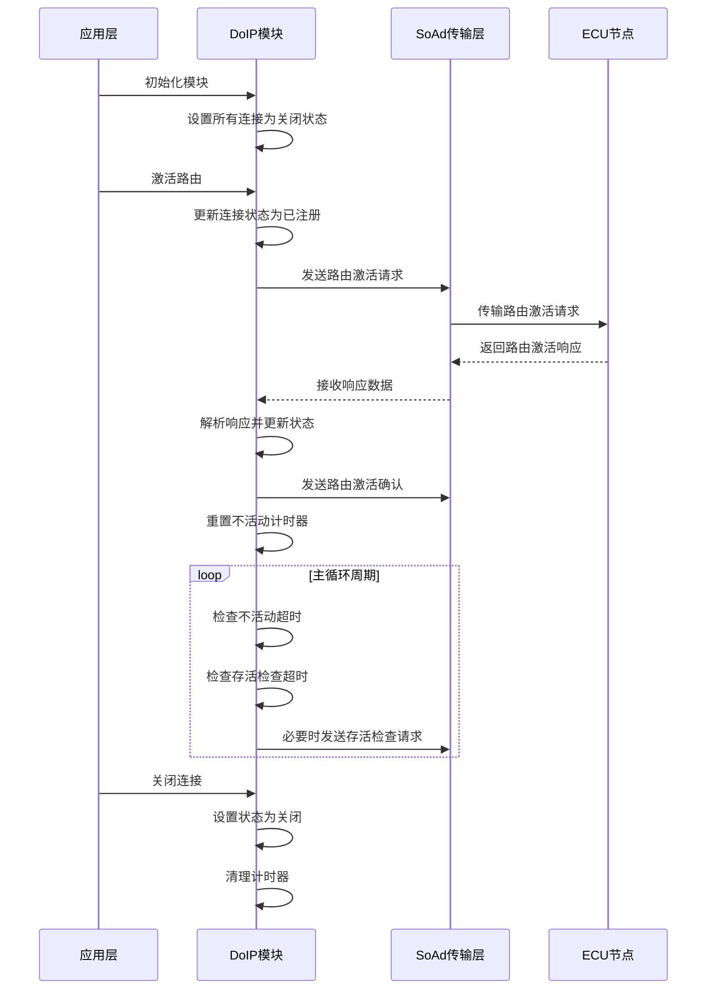
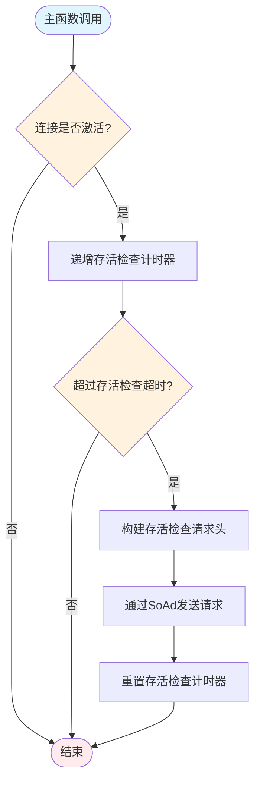
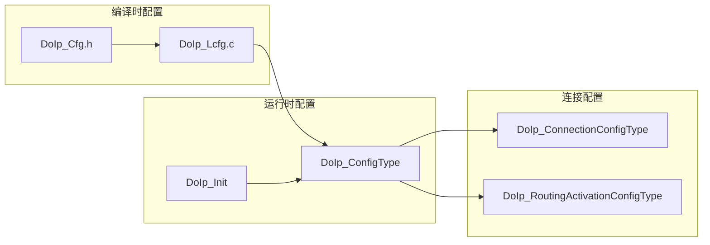
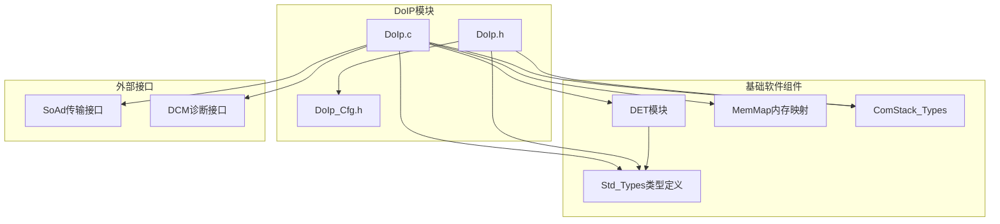
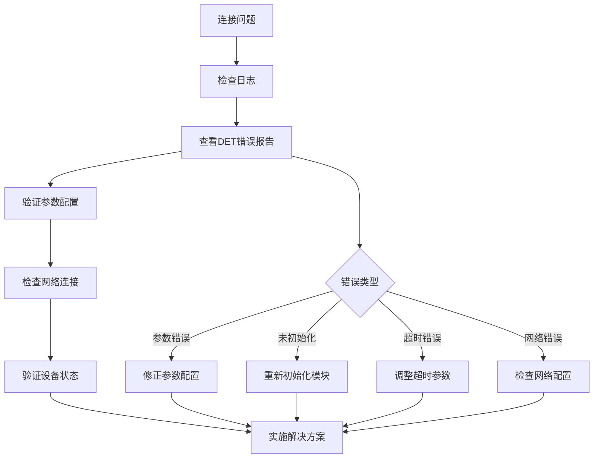

# 连接状态管理

<cite>
**本文档引用的文件**
- [DoIp.h](file://src/bsw/services/doip/include/DoIp.h)
- [DoIp_Cfg.h](file://src/bsw/services/doip/include/DoIp_Cfg.h)
- [DoIp.c](file://src/bsw/services/doip/src/DoIp.c)
- [DoIp_Lcfg.c](file://src/bsw/services/doip/src/DoIp_Lcfg.c)
- [DoIp_test.c](file://src/bsw/services/doip/src/DoIp_test.c)
- [Det.h](file://src/bsw/common/Det.h)
- [Det.c](file://src/bsw/common/Det.c)
</cite>

## 目录
1. [简介](#简介)
2. [项目结构](#项目结构)
3. [核心组件](#核心组件)
4. [架构概览](#架构概览)
5. [详细组件分析](#详细组件分析)
6. [依赖关系分析](#依赖关系分析)
7. [性能考虑](#性能考虑)
8. [故障诊断指南](#故障诊断指南)
9. [结论](#结论)

## 简介

本文档详细阐述了YuleTech AutoSAR BSW中Diagnostic over IP (DoIP)连接状态管理系统的实现。该系统遵循AutoSAR Classic Platform 4.x标准，提供了完整的诊断通信功能，包括连接建立、维护、超时检测和异常处理机制。文档重点分析了DoIp_ConnectionStateType连接状态枚举、DoIp_ConnectionConfigType连接配置结构以及连接生命周期管理的各个方面。

## 项目结构

DoIP模块位于服务层，采用AutoSAR标准的分层架构设计：

**图表来源**
- [DoIp.h:1-233](file://src/bsw/services/doip/include/DoIp.h#L1-L233)
- [DoIp.c:1-731](file://src/bsw/services/doip/src/DoIp.c#L1-L731)

**章节来源**
- [DoIp.h:1-233](file://src/bsw/services/doip/include/DoIp.h#L1-L233)
- [DoIp_Cfg.h:1-64](file://src/bsw/services/doip/include/DoIp_Cfg.h#L1-L64)

## 核心组件

### 连接状态枚举

DoIp_ConnectionStateType定义了四个核心连接状态：

**图表来源**
- [DoIp.h:71-76](file://src/bsw/services/doip/include/DoIp.h#L71-L76)
- [DoIp.c:242](file://src/bsw/services/doip/src/DoIp.c#L242)
- [DoIp.c:586](file://src/bsw/services/doip/src/DoIp.c#L586)

### 连接配置结构

DoIp_ConnectionConfigType是连接配置的核心数据结构，包含以下关键字段：

| 字段名 | 类型 | 描述 | 默认值 |
|--------|------|------|--------|
| ConnectionId | uint16 | 连接标识符 | - |
| SourceAddress | uint16 | 源逻辑地址 | - |
| TargetAddress | uint16 | 目标逻辑地址 | - |
| TesterLogicalAddress | uint16 | 测试仪逻辑地址 | - |
| AliveCheckTimeoutMs | uint16 | 存活检查超时(ms) | 500 |
| GeneralInactivityTimeoutMs | uint16 | 通用不活动超时(ms) | 5000 |
| AliveCheckEnabled | boolean | 是否启用存活检查 | TRUE |

**章节来源**
- [DoIp.h:115-123](file://src/bsw/services/doip/include/DoIp.h#L115-L123)
- [DoIp_Lcfg.c:26-63](file://src/bsw/services/doip/src/DoIp_Lcfg.c#L26-L63)

## 架构概览

DoIP模块采用分层架构设计，实现了完整的诊断通信栈：

**图表来源**
- [DoIp.c:369-487](file://src/bsw/services/doip/src/DoIp.c#L369-L487)
- [DoIp.c:495-557](file://src/bsw/services/doip/src/DoIp.c#L495-L557)
- [DoIp.c:674-723](file://src/bsw/services/doip/src/DoIp.c#L674-L723)

## 详细组件分析

### 连接状态管理器

连接状态管理器负责跟踪每个连接的当前状态和相关计时器：

**图表来源**
- [DoIp.c:62-80](file://src/bsw/services/doip/src/DoIp.c#L62-L80)
- [DoIp.h:141-150](file://src/bsw/services/doip/include/DoIp.h#L141-L150)

### 状态转换流程

连接状态转换遵循严格的时序逻辑：

**图表来源**
- [DoIp.c:369-398](file://src/bsw/services/doip/src/DoIp.c#L369-L398)
- [DoIp.c:566-610](file://src/bsw/services/doip/src/DoIp.c#L566-L610)
- [DoIp.c:674-723](file://src/bsw/services/doip/src/DoIp.c#L674-L723)

### 存活检查机制

存活检查是连接维护的关键机制，确保诊断链路的可用性：

**图表来源**
- [DoIp.c:699-718](file://src/bsw/services/doip/src/DoIp.c#L699-L718)

**章节来源**
- [DoIp.c:674-723](file://src/bsw/services/doip/src/DoIp.c#L674-L723)
- [DoIp_Lcfg.c:32-34](file://src/bsw/services/doip/src/DoIp_Lcfg.c#L32-L34)

### 配置管理

连接配置支持动态配置和编译时配置两种方式：

**图表来源**
- [DoIp_Cfg.h:15-63](file://src/bsw/services/doip/include/DoIp_Cfg.h#L15-L63)
- [DoIp_Lcfg.c:26-151](file://src/bsw/services/doip/src/DoIp_Lcfg.c#L26-L151)
- [DoIp.c:369-398](file://src/bsw/services/doip/src/DoIp.c#L369-L398)

**章节来源**
- [DoIp_Lcfg.c:26-151](file://src/bsw/services/doip/src/DoIp_Lcfg.c#L26-L151)
- [DoIp_Cfg.h:15-63](file://src/bsw/services/doip/include/DoIp_Cfg.h#L15-L63)

## 依赖关系分析

DoIP模块与多个基础软件组件存在紧密的依赖关系：

**图表来源**
- [DoIp.c:19-31](file://src/bsw/services/doip/src/DoIp.c#L19-L31)
- [DoIp.h:19-21](file://src/bsw/services/doip/include/DoIp.h#L19-L21)

**章节来源**
- [DoIp.c:19-31](file://src/bsw/services/doip/src/DoIp.c#L19-L31)
- [DoIp.h:19-21](file://src/bsw/services/doip/include/DoIp.h#L19-L21)

## 性能考虑

### 内存优化

DoIP模块采用了多种内存优化策略：

- **静态内存分配**: 所有连接状态和配置数据都使用静态内存分配
- **缓冲区复用**: 使用单一的发送缓冲区避免频繁的内存分配
- **配置常量**: 大部分配置在编译时确定，减少运行时开销

### 实时性能

- **固定周期**: 主函数以10ms固定周期执行，确保实时性
- **最小化延迟**: 关键路径操作（如头部解析）经过高度优化
- **中断安全**: 所有状态访问都是原子操作，避免竞态条件

### 错误处理性能

- **快速失败**: 参数验证在函数入口处进行，避免不必要的处理
- **错误码缓存**: DET错误码在编译时确定，减少运行时查找开销

## 故障诊断指南

### 常见连接问题及解决方案

| 问题类型 | 触发条件 | 诊断步骤 | 解决方案 |
|----------|----------|----------|----------|
| 连接超时 | 不活动超时达到上限 | 检查网络连通性和设备状态 | 增加超时时间或检查硬件 |
| 存活检查失败 | 连续多次存活检查超时 | 验证SoAd传输层工作状态 | 检查网络配置和传输层日志 |
| 路由激活失败 | 路由激活响应超时或拒绝 | 检查目标地址和认证配置 | 验证目标设备可达性和配置正确性 |
| 内存不足 | 缓冲区溢出或内存分配失败 | 监控内存使用情况 | 增大缓冲区或优化内存使用 |

### 诊断工具和方法

**章节来源**
- [DoIp_test.c:110-288](file://src/bsw/services/doip/src/DoIp_test.c#L110-L288)
- [Det.h:40-44](file://src/bsw/common/Det.h#L40-L44)

### 恢复策略

1. **自动恢复**: 对于临时性网络问题，系统会自动重试连接
2. **手动干预**: 对于配置错误，需要手动修正后重新初始化
3. **降级模式**: 在严重故障情况下，系统会进入降级模式继续基本功能
4. **故障隔离**: 单个连接故障不会影响其他连接的正常工作

## 结论

DoIP连接状态管理系统是一个高度模块化的AutoSAR兼容实现，具有以下特点：

- **标准化**: 完全符合AutoSAR Classic Platform 4.x标准
- **可靠性**: 提供完整的错误检测和处理机制
- **可扩展性**: 支持多连接管理和灵活的配置选项
- **实时性**: 采用固定周期调度确保实时响应
- **可维护性**: 清晰的代码结构和完善的单元测试覆盖

该系统为车辆诊断通信提供了坚实的基础，能够满足现代汽车电子系统的复杂需求。通过合理的配置和监控，可以确保诊断通信的稳定性和可靠性。