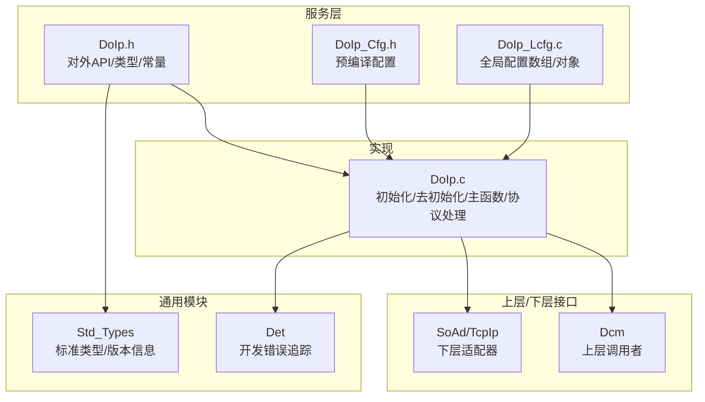
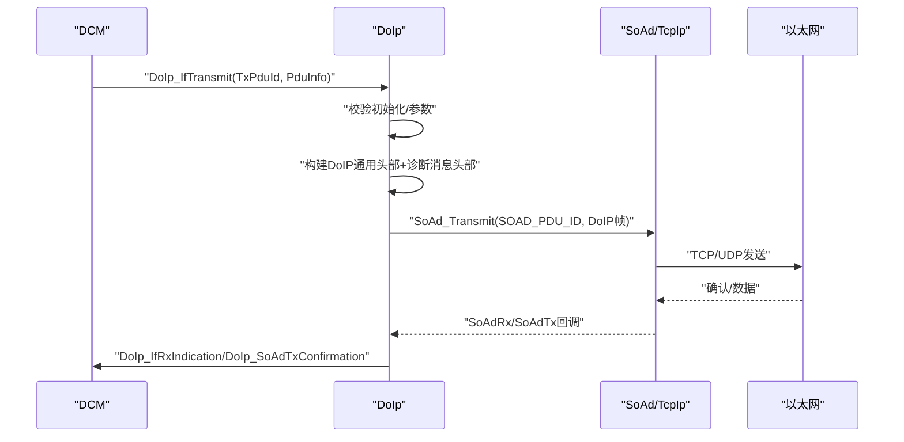
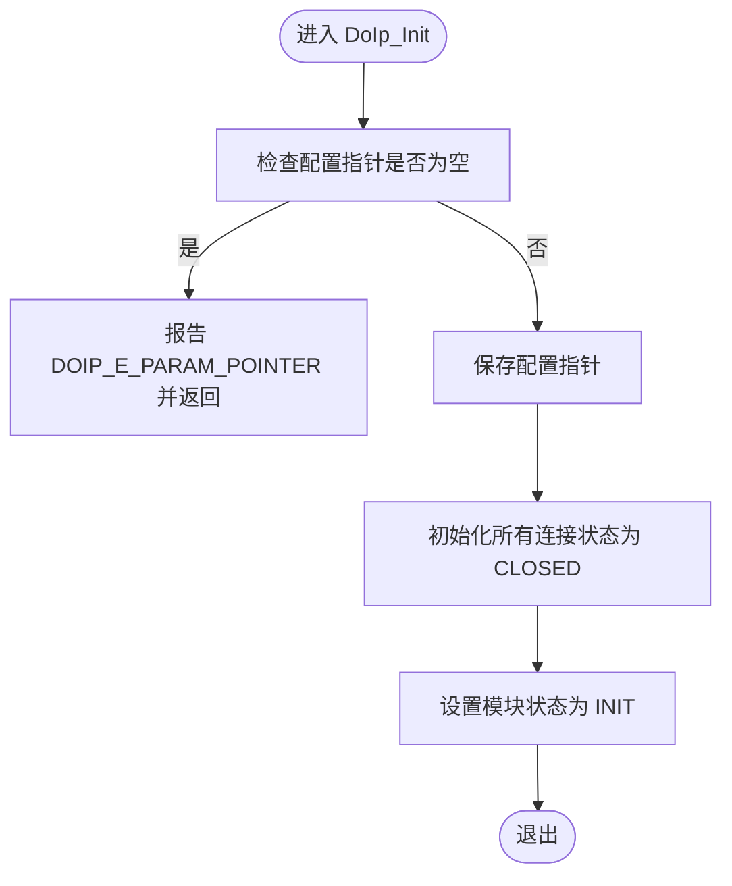
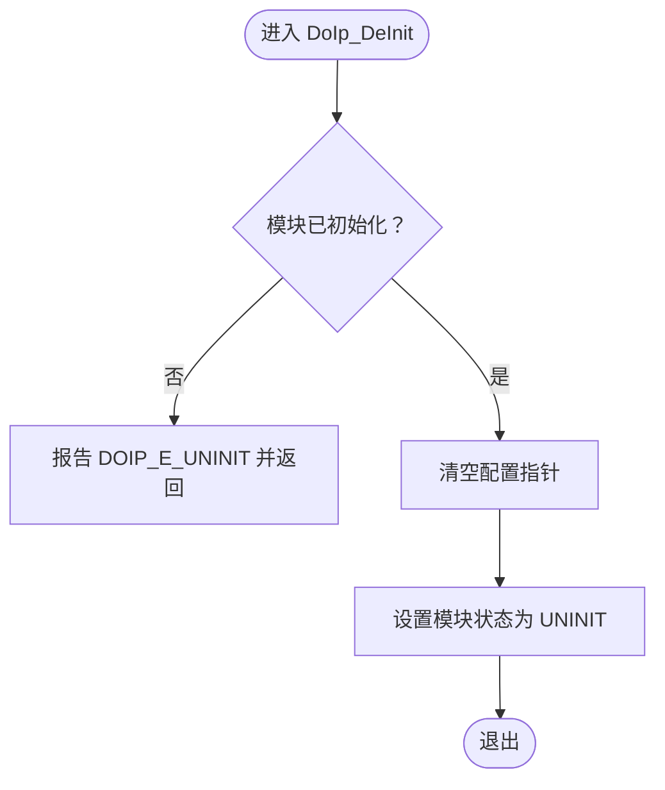
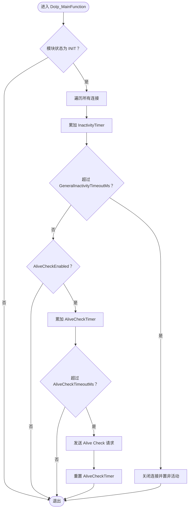
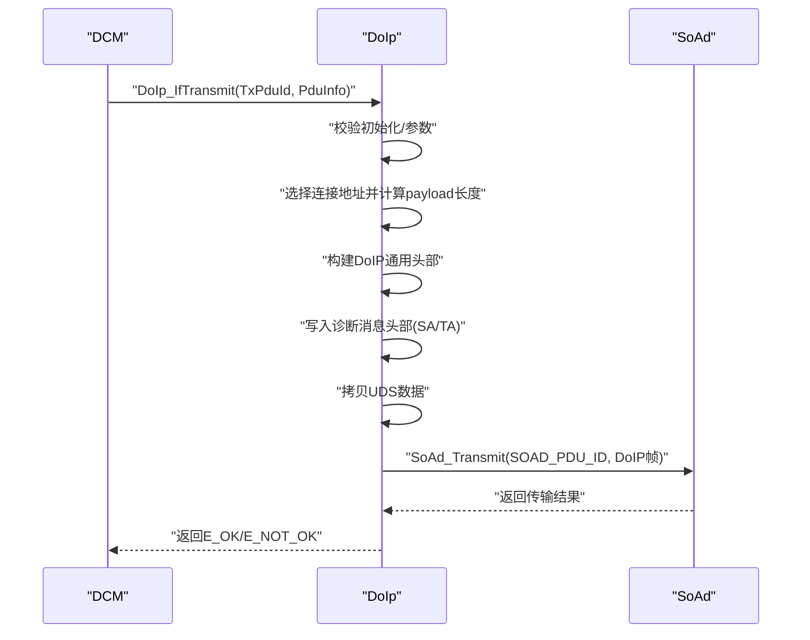
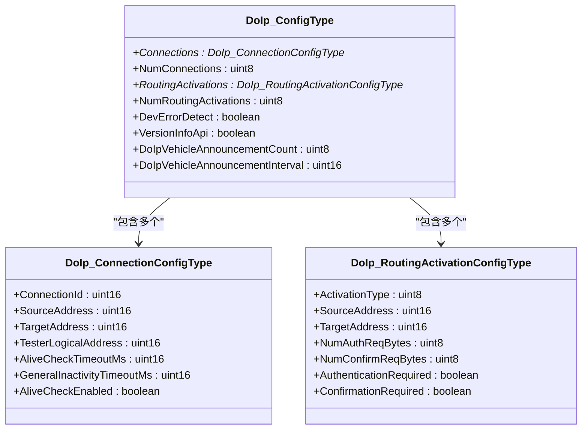
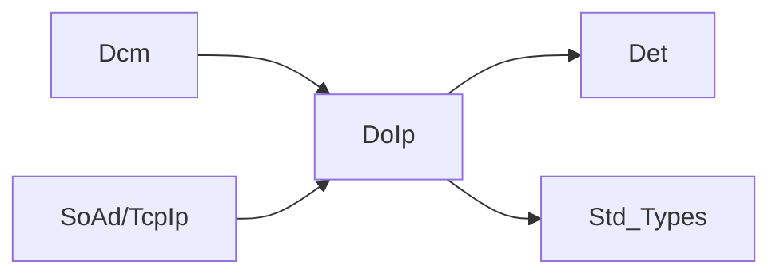

# 配置与API接口

<cite>
**本文引用的文件**
- [DoIp.h](file://src/bsw/services/doip/include/DoIp.h)
- [DoIp_Cfg.h](file://src/bsw/services/doip/include/DoIp_Cfg.h)
- [DoIp.c](file://src/bsw/services/doip/src/DoIp.c)
- [DoIp_Lcfg.c](file://src/bsw/services/doip/src/DoIp_Lcfg.c)
- [DoIp_test.c](file://src/bsw/services/doip/src/DoIp_test.c)
- [Det.h](file://src/bsw/services/det/include/Det.h)
- [Det.c](file://src/bsw/services/det/src/Det.c)
- [Std_Types.h](file://src/bsw/os/include/Std_Types.h)
- [DoIp_spec.md](file://openspec/changes/dev-doip-docan-module/specs/DoIp_spec.md)
- [api-reference.md](file://docs/api-reference.md)
</cite>

## 目录
1. [简介](#简介)
2. [项目结构](#项目结构)
3. [核心组件](#核心组件)
4. [架构总览](#架构总览)
5. [详细组件分析](#详细组件分析)
6. [依赖关系分析](#依赖关系分析)
7. [性能考虑](#性能考虑)
8. [故障排查指南](#故障排查指南)
9. [结论](#结论)
10. [附录](#附录)

## 简介
本文档面向DoIp（Diagnostic over IP）模块的配置与API接口，系统性阐述初始化流程、去初始化流程、版本信息获取、主函数周期处理以及所有公共API的参数规范、返回值语义与调用约束。同时解释配置结构体的层次关系与依赖关系，提供完整的API使用示例与最佳实践，并给出错误码定义与错误处理策略，重点说明DevErrorDetect与VersionInfoApi等配置项的作用与影响。

## 项目结构
DoIp模块位于服务层，遵循AutoSAR Classic Platform 4.x标准，主要文件组织如下：
- 头文件：对外API、配置宏、数据类型与常量定义
- 实现文件：DoIp模块逻辑、内部状态管理、协议解析与封装
- 链路配置：全局配置数组与最终配置对象
- 单元测试：覆盖初始化、路由激活、消息封装/转发、错误检测等场景

图表来源
- [DoIp.h:169-230](file://src/bsw/services/doip/include/DoIp.h#L169-L230)
- [DoIp_Cfg.h:15-62](file://src/bsw/services/doip/include/DoIp_Cfg.h#L15-L62)
- [DoIp.c:369-723](file://src/bsw/services/doip/src/DoIp.c#L369-L723)
- [DoIp_Lcfg.c:25-151](file://src/bsw/services/doip/src/DoIp_Lcfg.c#L25-L151)

章节来源
- [DoIp.h:13-233](file://src/bsw/services/doip/include/DoIp.h#L13-L233)
- [DoIp_Cfg.h:9-64](file://src/bsw/services/doip/include/DoIp_Cfg.h#L9-L64)
- [DoIp.c:1-731](file://src/bsw/services/doip/src/DoIp.c#L1-L731)
- [DoIp_Lcfg.c:1-159](file://src/bsw/services/doip/src/DoIp_Lcfg.c#L1-L159)

## 核心组件
- 对外API集合：初始化、去初始化、版本信息、传输、接收指示、路由激活、连接关闭、传输确认、主函数
- 配置结构体族：DoIp_ConfigType、DoIp_ConnectionConfigType、DoIp_RoutingActivationConfigType
- 内部状态：模块状态机、连接状态数组、发送缓冲区
- 协议支持：通用头部解析/构建、诊断消息封装、路由激活请求/响应处理、存活检查

章节来源
- [DoIp.h:169-230](file://src/bsw/services/doip/include/DoIp.h#L169-L230)
- [DoIp.c:61-80](file://src/bsw/services/doip/src/DoIp.c#L61-L80)
- [DoIp_spec.md:35-66](file://openspec/changes/dev-doip-docan-module/specs/DoIp_spec.md#L35-L66)

## 架构总览
DoIp在服务层充当“诊断通信适配器”，向上对接DCM（UDS），向下对接SoAd/TcpIp（以太网）。其职责包括：
- 解析来自SoAd的DoIP帧并分发到DCM
- 将DCM的UDS请求封装为DoIP帧并通过SoAd发送
- 维护连接状态、超时与存活检查
- 支持路由激活与连接管理

图表来源
- [DoIp.c:428-487](file://src/bsw/services/doip/src/DoIp.c#L428-L487)
- [DoIp.c:495-557](file://src/bsw/services/doip/src/DoIp.c#L495-L557)
- [DoIp.c:653-667](file://src/bsw/services/doip/src/DoIp.c#L653-L667)

## 详细组件分析

### 初始化流程 DoIp_Init
- 输入：指向DoIp_ConfigType的配置指针
- 参数验证：当启用DevErrorDetect且ConfigPtr为空时，上报DOIP_E_PARAM_POINTER
- 资源分配：保存配置指针；初始化所有连接状态为关闭，计时器清零
- 状态切换：模块状态从UNINIT迁移到INIT

图表来源
- [DoIp.c:369-398](file://src/bsw/services/doip/src/DoIp.c#L369-L398)

章节来源
- [DoIp.c:369-398](file://src/bsw/services/doip/src/DoIp.c#L369-L398)
- [DoIp_spec.md:209-222](file://openspec/changes/dev-doip-docan-module/specs/DoIp_spec.md#L209-L222)

### 去初始化流程 DoIp_DeInit
- 输入：无
- 参数验证：当启用DevErrorDetect且模块处于UNINIT时，上报DOIP_E_UNINIT
- 资源回收：清空配置指针，模块状态回到UNINIT

图表来源
- [DoIp.c:405-420](file://src/bsw/services/doip/src/DoIp.c#L405-L420)

章节来源
- [DoIp.c:405-420](file://src/bsw/services/doip/src/DoIp.c#L405-L420)
- [DoIp_spec.md:209-222](file://openspec/changes/dev-doip-docan-module/specs/DoIp_spec.md#L209-L222)

### 版本信息获取 DoIp_GetVersionInfo
- 功能：填充Std_VersionInfoType结构体，包含供应商ID、模块ID、主/次/补丁版本
- 条件：当启用VersionInfoApi时才提供该API
- 返回：通过传入的versioninfo指针写入版本信息

章节来源
- [DoIp.h:184-184](file://src/bsw/services/doip/include/DoIp.h#L184-L184)
- [DoIp_Cfg.h:16-16](file://src/bsw/services/doip/include/DoIp_Cfg.h#L16-L16)
- [DoIp_test.c:254-270](file://src/bsw/services/doip/src/DoIp_test.c#L254-L270)

### 主函数 DoIp_MainFunction
- 触发频率：由外部调度按DOIP_MAIN_FUNCTION_PERIOD_MS周期调用
- 功能：
  - 遍历所有活动连接，累计通用不活跃定时器
  - 若超过配置的GeneralInactivityTimeoutMs则关闭连接
  - 若启用AliveCheck且超过AliveCheckTimeoutMs则发送Alive Check请求
- 影响：维持连接生命周期与健康状态

图表来源
- [DoIp.c:674-723](file://src/bsw/services/doip/src/DoIp.c#L674-L723)

章节来源
- [DoIp.c:674-723](file://src/bsw/services/doip/src/DoIp.c#L674-L723)
- [DoIp_Cfg.h:33-33](file://src/bsw/services/doip/include/DoIp_Cfg.h#L33-L33)

### 传输接口 DoIp_IfTransmit
- 输入：TxPduId（用于标识）、PduInfoPtr（包含UDS数据）
- 参数验证：未初始化或PduInfoPtr为空时，按DevErrorDetect策略上报错误
- 处理流程：
  - 使用配置中的第一个连接地址作为源/目标
  - 构建DoIP通用头部（PayloadType=0x8001，长度=SA+TA+UDS长度）
  - 在缓冲区前部写入诊断消息头部（SA/TA），再拷贝UDS数据
  - 调用SoAd_Transmit发送
- 返回：E_OK/E_NOT_OK

图表来源
- [DoIp.c:428-487](file://src/bsw/services/doip/src/DoIp.c#L428-L487)

章节来源
- [DoIp.c:428-487](file://src/bsw/services/doip/src/DoIp.c#L428-L487)
- [DoIp_spec.md:177-184](file://openspec/changes/dev-doip-docan-module/specs/DoIp_spec.md#L177-L184)

### 接收指示 DoIp_IfRxIndication
- 输入：RxPduId、PduInfoPtr（包含原始DoIP帧）
- 参数验证：未初始化或PduInfoPtr为空时，按DevErrorDetect策略上报错误
- 处理流程：
  - 解析DoIP通用头部，校验协议版本与反码
  - 根据PayloadType分派：
    - 路由激活请求：查找激活类型并更新连接状态，发送正向响应
    - 诊断消息：提取SA/TA与UDS数据，转发给DCM
    - 存活检查响应：重置存活定时器
- 返回：无

章节来源
- [DoIp.c:495-557](file://src/bsw/services/doip/src/DoIp.c#L495-L557)
- [DoIp.c:227-288](file://src/bsw/services/doip/src/DoIp.c#L227-L288)

### 路由激活 DoIp_ActivateRouting
- 输入：SourceAddress、TargetAddress、ActivationType
- 参数验证：未初始化时报DOIP_E_UNINIT；找不到对应连接或激活类型时报相应错误
- 处理流程：根据ActivationType更新指定连接的状态与地址，标记为活动

章节来源
- [DoIp.c:566-610](file://src/bsw/services/doip/src/DoIp.c#L566-L610)
- [DoIp.c:199-219](file://src/bsw/services/doip/src/DoIp.c#L199-L219)

### 关闭连接 DoIp_CloseConnection
- 输入：ConnectionId
- 参数验证：未初始化时报DOIP_E_UNINIT；ConnectionId越界时报DOIP_E_INVALID_CONNECTION
- 处理流程：将连接状态设为CLOSED，清除活动标志与计时器

章节来源
- [DoIp.c:617-645](file://src/bsw/services/doip/src/DoIp.c#L617-L645)

### 传输确认 DoIp_SoAdTxConfirmation
- 输入：TxPduId、result
- 参数验证：未初始化时报DOIP_E_UNINIT
- 处理流程：将传输结果转发给DCM

章节来源
- [DoIp.c:653-667](file://src/bsw/services/doip/src/DoIp.c#L653-L667)

### 配置结构体与依赖关系
- DoIp_ConfigType
  - 包含连接数组指针与数量、路由激活数组指针与数量
  - DevErrorDetect、VersionInfoApi、车辆公告次数与间隔等行为开关
- DoIp_ConnectionConfigType
  - ConnectionId、SourceAddress、TargetAddress、TesterLogicalAddress
  - AliveCheckTimeoutMs、GeneralInactivityTimeoutMs、AliveCheckEnabled
- DoIp_RoutingActivationConfigType
  - ActivationType、SourceAddress、TargetAddress、认证/确认需求等

图表来源
- [DoIp.h:141-150](file://src/bsw/services/doip/include/DoIp.h#L141-L150)
- [DoIp.h:115-123](file://src/bsw/services/doip/include/DoIp.h#L115-L123)
- [DoIp.h:128-136](file://src/bsw/services/doip/include/DoIp.h#L128-L136)

章节来源
- [DoIp.h:141-150](file://src/bsw/services/doip/include/DoIp.h#L141-L150)
- [DoIp_Lcfg.c:26-151](file://src/bsw/services/doip/src/DoIp_Lcfg.c#L26-L151)

### 链路配置与默认值
- DoIp_Lcfg.c中定义了连接数组与路由激活数组，并构造全局DoIp_Config
- 默认配置示例展示了典型逻辑地址、超时与开关设置

章节来源
- [DoIp_Lcfg.c:26-151](file://src/bsw/services/doip/src/DoIp_Lcfg.c#L26-L151)

## 依赖关系分析
- 上层依赖：Dcm（UDS协议栈），通过DoIp_IfTransmit/DoIp_IfRxIndication交互
- 下层依赖：SoAd（TCP/UDP适配），通过SoAd_Transmit与回调
- 通用依赖：Det（开发错误检测）、Std_Types（标准类型/版本信息）

图表来源
- [DoIp.c:28-31](file://src/bsw/services/doip/src/DoIp.c#L28-L31)
- [Det.h:17-17](file://src/bsw/services/det/include/Det.h#L17-L17)
- [Std_Types.h:17-18](file://src/bsw/os/include/Std_Types.h#L17-L18)

章节来源
- [DoIp.c:28-31](file://src/bsw/services/doip/src/DoIp.c#L28-L31)
- [Det.h:11-76](file://src/bsw/services/det/include/Det.h#L11-L76)
- [Std_Types.h:11-117](file://src/bsw/os/include/Std_Types.h#L11-L117)

## 性能考虑
- 缓冲区大小：发送缓冲区包含通用头部、诊断消息头部与最大诊断数据长度，确保一次封装满足常见UDS报文
- 主函数周期：DOIP_MAIN_FUNCTION_PERIOD_MS为10ms，兼顾实时性与CPU占用
- 连接管理：通过计时器避免僵尸连接，降低网络与内存压力
- 错误路径短路：在未初始化或参数非法时尽早返回，减少无效开销

章节来源
- [DoIp.c:79-79](file://src/bsw/services/doip/src/DoIp.c#L79-L79)
- [DoIp_Cfg.h:33-33](file://src/bsw/services/doip/include/DoIp_Cfg.h#L33-L33)
- [DoIp_Cfg.h:27-28](file://src/bsw/services/doip/include/DoIp_Cfg.h#L27-L28)

## 故障排查指南
- 常见错误码与触发条件
  - DOIP_E_PARAM_POINTER：初始化时配置指针为空；传输/接收时PduInfoPtr为空
  - DOIP_E_UNINIT：在未初始化状态下调用API
  - DOIP_E_INVALID_CONNECTION/DOIP_E_INVALID_ROUTING_ACTIVATION：连接或激活类型不存在
  - DOIP_E_INVALID_PDU_ID/DOIP_E_INVALID_PARAMETER：其他参数非法
- DevErrorDetect与VersionInfoApi
  - DevErrorDetect=STD_ON：启用开发错误检测，调用相关API时进行参数校验并上报错误
  - VersionInfoApi=STD_ON：提供DoIp_GetVersionInfo能力
- 单元测试覆盖
  - 初始化有效性与空指针检测
  - 路由激活成功与失败路径
  - 传输封装与接收分发
  - 未初始化调用的错误上报
  - 传输确认回调正确转发

章节来源
- [DoIp.h:51-57](file://src/bsw/services/doip/include/DoIp.h#L51-L57)
- [DoIp_spec.md:209-225](file://openspec/changes/dev-doip-docan-module/specs/DoIp_spec.md#L209-L225)
- [DoIp_test.c:110-270](file://src/bsw/services/doip/src/DoIp_test.c#L110-L270)

## 结论
DoIp模块通过清晰的API边界与严格的配置/参数校验，实现了对UDS over IP的可靠封装。其主函数负责连接生命周期维护，链路配置灵活支持多连接与多种路由激活类型。结合DevErrorDetect与VersionInfoApi等配置项，既能满足开发调试阶段的错误捕获，也能在需要时提供版本信息查询能力。建议在集成时优先完善链路配置与超时参数，并在开发阶段开启DevErrorDetect以尽早暴露问题。

## 附录

### API参数规范与返回值
- DoIp_Init(ConfigPtr)
  - 参数：ConfigPtr（配置指针，不可为空）
  - 返回：无
  - 约束：DevErrorDetect=STD_ON时，ConfigPtr为空将上报错误
- DoIp_DeInit()
  - 参数：无
  - 返回：无
  - 约束：DevErrorDetect=STD_ON时，未初始化将上报错误
- DoIp_GetVersionInfo(versioninfo)
  - 参数：versioninfo（版本信息指针，不可为空）
  - 返回：无
  - 约束：VersionInfoApi=STD_ON时有效
- DoIp_IfTransmit(TxPduId, PduInfoPtr)
  - 参数：TxPduId（PDU标识）、PduInfoPtr（UDS数据）
  - 返回：E_OK/E_NOT_OK
  - 约束：未初始化或PduInfoPtr为空将上报错误
- DoIp_IfRxIndication(RxPduId, PduInfoPtr)
  - 参数：RxPduId、PduInfoPtr（原始DoIP帧）
  - 返回：无
  - 约束：未初始化或PduInfoPtr为空将上报错误
- DoIp_ActivateRouting(SourceAddress, TargetAddress, ActivationType)
  - 参数：源/目标逻辑地址、激活类型
  - 返回：E_OK/E_NOT_OK
  - 约束：未初始化将上报错误
- DoIp_CloseConnection(ConnectionId)
  - 参数：ConnectionId
  - 返回：E_OK/E_NOT_OK
  - 约束：未初始化或越界将上报错误
- DoIp_SoAdTxConfirmation(TxPduId, result)
  - 参数：TxPduId、result
  - 返回：无
  - 约束：未初始化将上报错误
- DoIp_MainFunction()
  - 参数：无
  - 返回：无
  - 约束：按DOIP_MAIN_FUNCTION_PERIOD_MS周期调用

章节来源
- [DoIp.h:169-230](file://src/bsw/services/doip/include/DoIp.h#L169-L230)
- [DoIp_spec.md:35-66](file://openspec/changes/dev-doip-docan-module/specs/DoIp_spec.md#L35-L66)

### 最佳实践
- 在应用启动阶段先调用DoIp_Init并传入完整配置，随后注册SoAd回调
- 合理设置AliveCheckTimeoutMs与GeneralInactivityTimeoutMs，平衡连接健壮性与网络负载
- 使用DoIp_GetVersionInfo在诊断工具或日志中记录模块版本
- 在开发阶段保持DevErrorDetect=STD_ON，发布版本可按需关闭
- 对于多连接场景，确保每个连接的SourceAddress/TargetAddress与ActivationType匹配

章节来源
- [DoIp_Lcfg.c:26-151](file://src/bsw/services/doip/src/DoIp_Lcfg.c#L26-L151)
- [DoIp_Cfg.h:15-62](file://src/bsw/services/doip/include/DoIp_Cfg.h#L15-L62)