# Dcm初始化与配置

<cite>
**本文档引用的文件**
- [Dcm.h](file://src/bsw/services/dcm/include/Dcm.h)
- [Dcm_Cfg.h](file://src/bsw/services/dcm/include/Dcm_Cfg.h)
- [Dcm.c](file://src/bsw/services/dcm/src/Dcm.c)
- [Dcm_test.c](file://src/bsw/services/dcm/src/Dcm_test.c)
- [bsw_config.json](file://config/bsw_config.json)
- [modules.md](file://docs/modules.md)
</cite>

## 目录
1. [简介](#简介)
2. [项目结构](#项目结构)
3. [核心组件](#核心组件)
4. [架构概览](#架构概览)
5. [详细组件分析](#详细组件分析)
6. [依赖关系分析](#依赖关系分析)
7. [性能考虑](#性能考虑)
8. [故障排除指南](#故障排除指南)
9. [结论](#结论)

## 简介

Dcm（Diagnostic Communication Manager）是YuleTech AutoSAR BSW平台中的诊断通信管理器模块，遵循AutoSAR Classic Platform 4.x标准。该模块实现了UDS（ISO 14229）和OBD-II诊断协议，提供完整的诊断通信服务，包括会话管理、安全访问控制、DID/RID处理和DTC管理等功能。

本技术文档专注于Dcm模块的初始化与配置机制，深入解析Dcm_Init初始化函数的实现原理、配置参数验证、内存分配和模块状态设置，以及Dcm_ConfigType配置结构体的详细说明。

## 项目结构

Dcm模块位于BSW（Basic Software）层的服务层中，采用标准的AutoSAR分层架构设计：

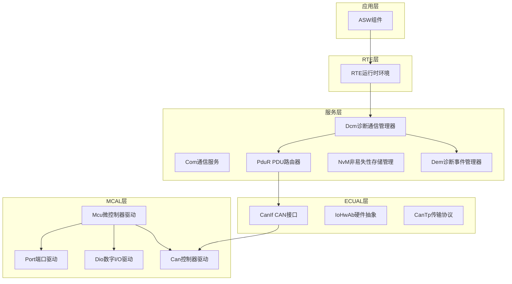

**图表来源**
- [modules.md:558-623](file://docs/modules.md#L558-L623)

**章节来源**
- [modules.md:282-290](file://docs/modules.md#L282-L290)

## 核心组件

### Dcm_ConfigType配置结构体

Dcm_ConfigType是Dcm模块的核心配置结构体，定义了模块的所有配置参数：

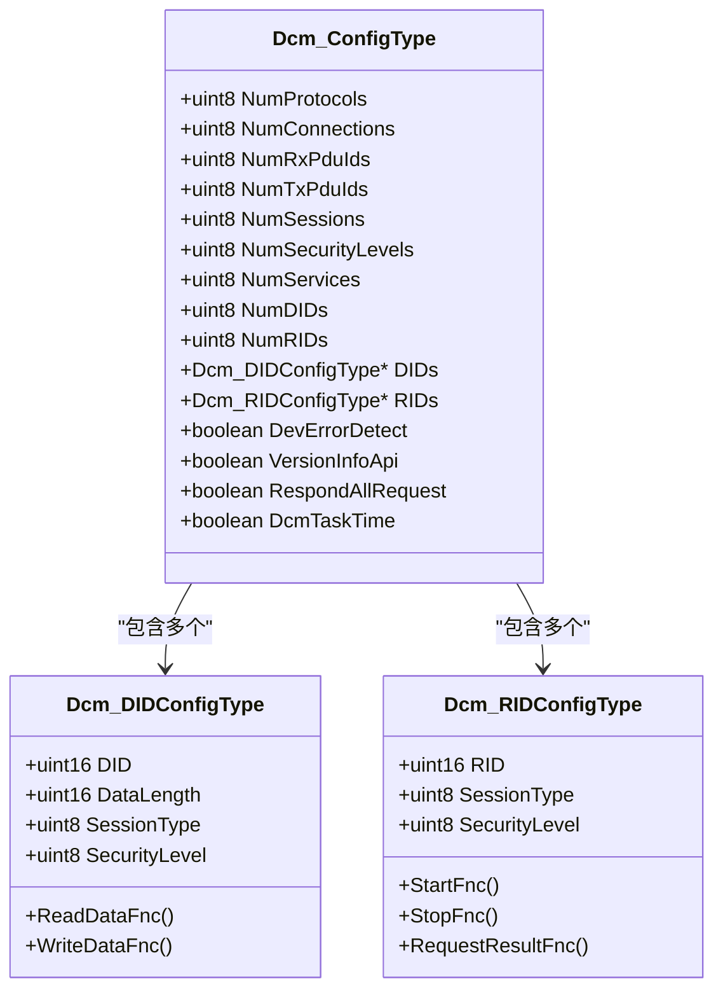

**图表来源**
- [Dcm.h:247-263](file://src/bsw/services/dcm/include/Dcm.h#L247-L263)
- [Dcm.h:208-227](file://src/bsw/services/dcm/include/Dcm.h#L208-L227)

### 关键配置参数说明

| 参数名称 | 类型 | 默认值 | 描述 |
|---------|------|--------|------|
| NumProtocols | uint8 | 2 | 协议数量（OBD_ON_CAN, UDS_ON_CAN, UDS_ON_FLEXRAY, UDS_ON_IP） |
| NumConnections | uint8 | 4 | 并发连接数 |
| NumRxPduIds | uint8 | 4 | 接收PDU ID数量 |
| NumTxPduIds | uint8 | 4 | 发送PDU ID数量 |
| NumSessions | uint8 | 4 | 会话类型数量 |
| NumSecurityLevels | uint8 | 3 | 安全级别数量 |
| NumServices | uint8 | 16 | 支持的UDS服务数量 |
| NumDIDs | uint8 | 32 | 数据标识符数量 |
| NumRIDs | uint8 | 8 | 功能标识符数量 |
| DIDs | Dcm_DIDConfigType* | NULL | DID配置数组指针 |
| RIDs | Dcm_RIDConfigType* | NULL | RID配置数组指针 |
| DevErrorDetect | boolean | TRUE | 开发错误检测开关 |
| VersionInfoApi | boolean | TRUE | 版本信息API开关 |
| RespondAllRequest | boolean | TRUE | 全部请求响应开关 |
| DcmTaskTime | boolean | TRUE | 任务时间统计开关 |

**章节来源**
- [Dcm.h:247-263](file://src/bsw/services/dcm/include/Dcm.h#L247-L263)
- [Dcm_Cfg.h:23-129](file://src/bsw/services/dcm/include/Dcm_Cfg.h#L23-L129)

## 架构概览

Dcm模块采用模块化设计，包含以下关键组件：

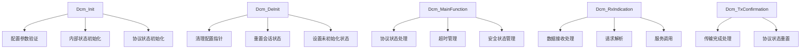

**图表来源**
- [Dcm.c:1120-1187](file://src/bsw/services/dcm/src/Dcm.c#L1120-L1187)
- [Dcm.c:1192-1245](file://src/bsw/services/dcm/src/Dcm.c#L1192-L1245)
- [Dcm.c:1271-1305](file://src/bsw/services/dcm/src/Dcm.c#L1271-L1305)

## 详细组件分析

### Dcm_Init初始化函数

Dcm_Init是Dcm模块的主要初始化入口函数，负责模块的完整初始化过程：

#### 初始化流程图

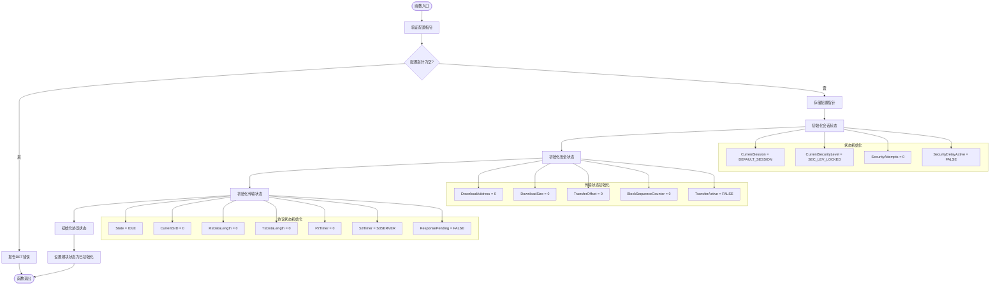

**图表来源**
- [Dcm.c:1120-1163](file://src/bsw/services/dcm/src/Dcm.c#L1120-L1163)

#### 初始化过程详解

1. **配置参数验证**：
   - 检查ConfigPtr是否为NULL
   - 在开发错误检测开启时，如果配置指针为空则报告DCM_E_PARAM_POINTER错误

2. **配置存储**：
   - 将传入的配置指针保存到Dcm_InternalState.ConfigPtr中
   - 作为后续所有配置访问的基础

3. **内部状态初始化**：
   - 设置当前会话为默认会话（DCM_DEFAULT_SESSION）
   - 设置当前安全级别为锁定状态（DCM_SEC_LEV_LOCKED）
   - 初始化安全尝试次数为0
   - 清除安全延迟状态

4. **传输状态初始化**：
   - 清空下载地址和大小
   - 重置传输偏移量和块序列计数器
   - 设置传输活动标志为FALSE

5. **协议状态初始化**：
   - 为每个协议实例初始化状态机
   - 设置初始状态为IDLE
   - 清空收发数据长度
   - 初始化定时器（P2Timer=0, S3Timer=S3SERVER）
   - 清除响应挂起标志

**章节来源**
- [Dcm.c:1120-1163](file://src/bsw/services/dcm/src/Dcm.c#L1120-L1163)

### Dcm_DeInit反初始化过程

Dcm_DeInit负责模块的清理和资源释放：

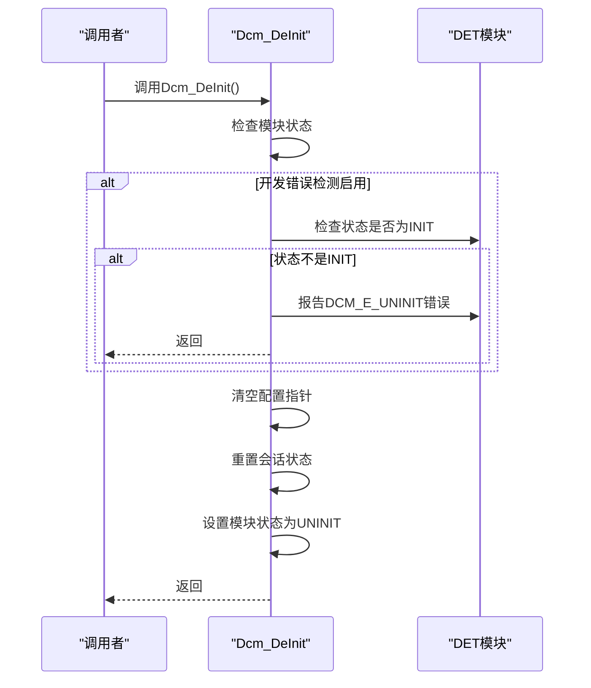

**图表来源**
- [Dcm.c:1168-1187](file://src/bsw/services/dcm/src/Dcm.c#L1168-L1187)

#### 反初始化流程

1. **状态检查**：
   - 在开发错误检测启用时，验证模块当前状态必须为INIT
   - 如果状态不正确，报告DCM_E_UNINIT错误

2. **资源清理**：
   - 清空配置指针（ConfigPtr = NULL）
   - 重置会话状态为默认会话
   - 重置安全级别为锁定状态

3. **状态设置**：
   - 将模块状态设置为DCM_STATE_UNINIT

**章节来源**
- [Dcm.c:1168-1187](file://src/bsw/services/dcm/src/Dcm.c#L1168-L1187)

### Dcm_MainFunction主循环

Dcm_MainFunction是模块的主处理循环，负责定时任务和状态管理：

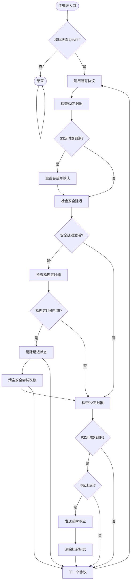

**图表来源**
- [Dcm.c:1192-1245](file://src/bsw/services/dcm/src/Dcm.c#L1192-L1245)

**章节来源**
- [Dcm.c:1192-1245](file://src/bsw/services/dcm/src/Dcm.c#L1192-L1245)

### 配置验证规则

Dcm模块实现了严格的配置验证机制：

#### 配置参数验证

| 验证类型 | 验证条件 | 错误代码 | 触发时机 |
|---------|---------|---------|---------|
| 配置指针验证 | ConfigPtr == NULL | DCM_E_PARAM_POINTER | Dcm_Init调用时 |
| 模块状态验证 | State != DCM_STATE_INIT | DCM_E_UNINIT | Dcm_DeInit调用时 |
| 回调函数验证 | ReadDataFnc/WriteDataFnc为NULL | DCM_E_CONDITIONS_NOT_CORRECT | DID操作时 |
| 参数指针验证 | PduInfoPtr == NULL | DCM_E_PARAM_POINTER | Rx/Tx回调时 |

#### 配置完整性检查

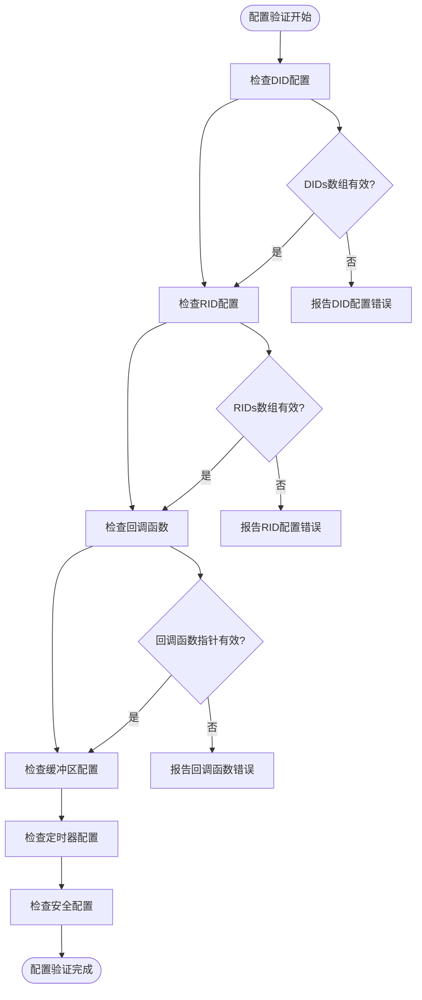

**图表来源**
- [Dcm_test.c:85-101](file://src/bsw/services/dcm/src/Dcm_test.c#L85-L101)

**章节来源**
- [Dcm_test.c:85-101](file://src/bsw/services/dcm/src/Dcm_test.c#L85-L101)

## 依赖关系分析

### 外部依赖

Dcm模块依赖于以下外部模块：

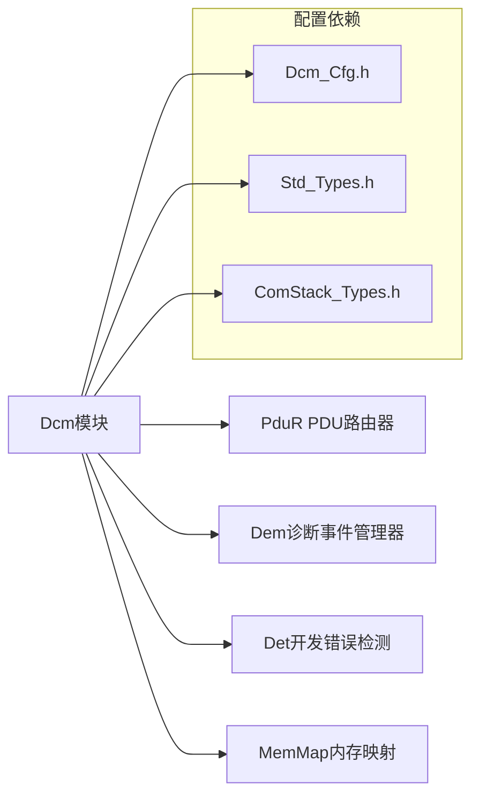

**图表来源**
- [Dcm.c:19-25](file://src/bsw/services/dcm/src/Dcm.c#L19-L25)

### 内部依赖关系

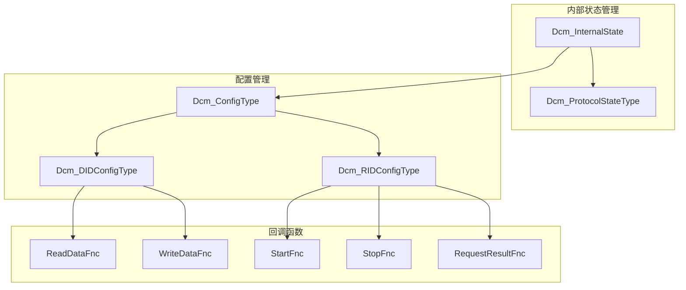

**图表来源**
- [Dcm.h:76-92](file://src/bsw/services/dcm/include/Dcm.h#L76-L92)
- [Dcm.h:208-227](file://src/bsw/services/dcm/include/Dcm.h#L208-L227)

**章节来源**
- [Dcm.h:76-92](file://src/bsw/services/dcm/include/Dcm.h#L76-L92)

## 性能考虑

### 内存使用优化

Dcm模块采用了多种内存优化策略：

1. **静态内存分配**：
   - 内部状态使用STATIC关键字声明，避免动态分配
   - 协议状态数组直接嵌入在内部状态结构体中

2. **缓冲区管理**：
   - RX/TX缓冲区大小可配置（DCM_RX_BUFFER_SIZE, DCM_TX_BUFFER_SIZE）
   - 支持最大4KB的请求和响应缓冲区

3. **状态机优化**：
   - 协议状态机使用紧凑的数据结构
   - 定时器使用32位无符号整数，支持长时间运行

### 处理效率优化

1. **查找算法优化**：
   - DID查找使用线性搜索，适合小规模配置
   - RID查找同样使用线性搜索

2. **回调函数优化**：
   - 回调函数指针检查在编译时可优化
   - 条件分支预测友好

## 故障排除指南

### 常见初始化错误

#### 错误代码对照表

| 错误代码 | 错误描述 | 可能原因 | 解决方案 |
|---------|---------|---------|---------|
| DCM_E_PARAM_POINTER | 参数指针错误 | 配置指针为NULL | 检查配置指针初始化 |
| DCM_E_UNINIT | 模块未初始化 | 在未初始化状态下调用 | 确保先调用Dcm_Init |
| DCM_E_INIT_FAILED | 初始化失败 | 配置验证失败 | 检查配置参数有效性 |
| DCM_E_PARAM | 参数错误 | 传入参数无效 | 验证输入参数范围 |

#### 配置验证失败排查

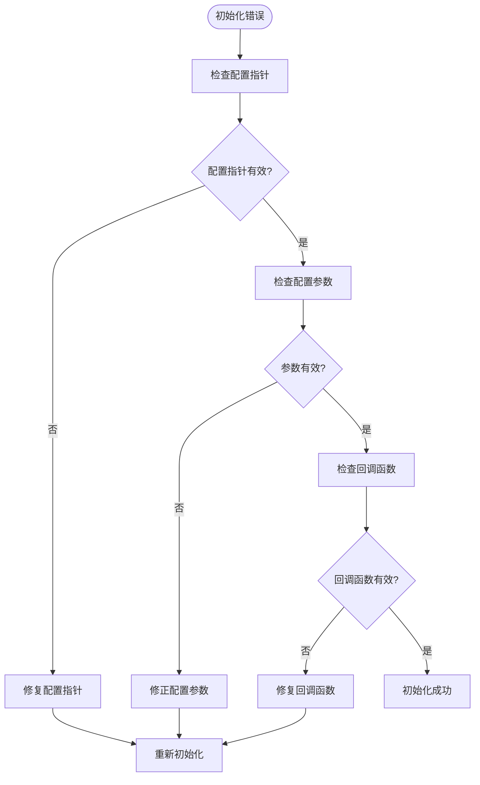

**图表来源**
- [Dcm_test.c:146-158](file://src/bsw/services/dcm/src/Dcm_test.c#L146-L158)

#### 最佳实践建议

1. **配置文件格式**：
   - 使用JSON格式存储配置参数
   - 包含版本信息和模块列表
   - 支持模块启用/禁用控制

2. **配置参数验证**：
   - 确保NumDIDs和NumRIDs与实际配置匹配
   - 验证回调函数指针的有效性
   - 检查缓冲区大小配置的合理性

3. **错误处理机制**：
   - 启用开发错误检测（DCM_DEV_ERROR_DETECT）
   - 实现适当的错误日志记录
   - 提供错误码的详细说明

**章节来源**
- [Dcm_test.c:146-158](file://src/bsw/services/dcm/src/Dcm_test.c#L146-L158)

### 启动和停止机制

Dcm模块的启动和停止机制相对简单，主要通过状态管理实现：

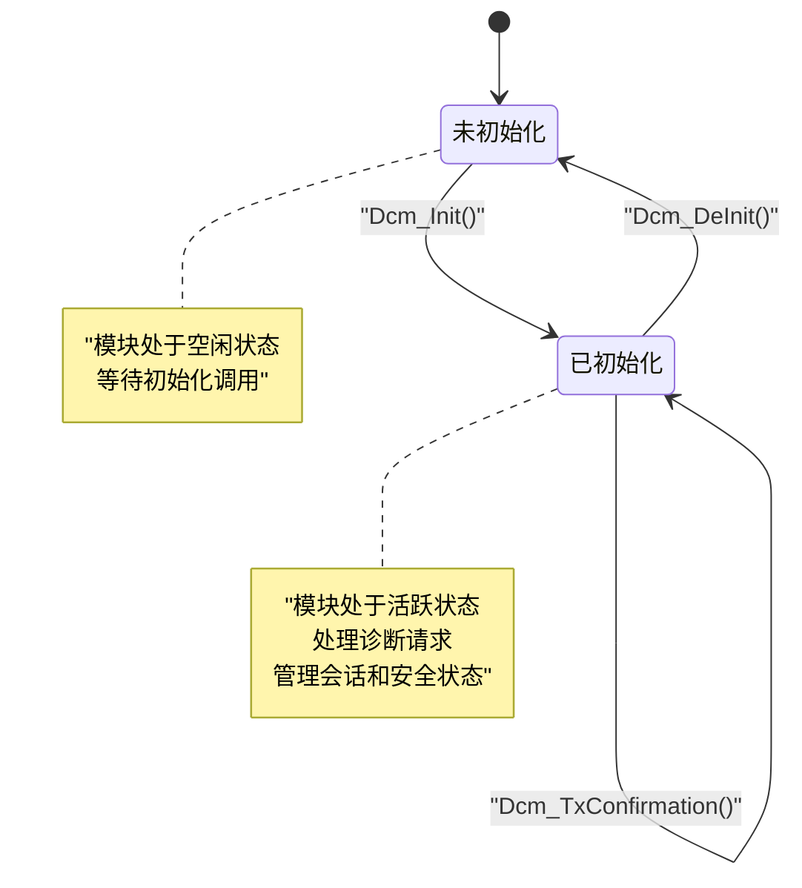

**图表来源**
- [Dcm.c:33-46](file://src/bsw/services/dcm/src/Dcm.c#L33-L46)

## 结论

Dcm初始化与配置模块展现了AutoSAR标准的良好实现，具有以下特点：

1. **完整的初始化流程**：从配置验证到状态初始化，确保模块的可靠启动
2. **严格的错误检测**：通过DET模块提供完善的错误报告机制
3. **灵活的配置管理**：支持多种配置参数，适应不同的应用场景
4. **高效的内存使用**：采用静态分配和优化的数据结构
5. **清晰的状态管理**：通过状态机实现模块生命周期的精确控制

该模块为整个诊断通信系统提供了坚实的基础，其设计原则和实现模式可以作为其他AutoSAR模块开发的参考模板。通过遵循本文档的配置指南和最佳实践，开发者可以快速、可靠地集成和使用Dcm模块。