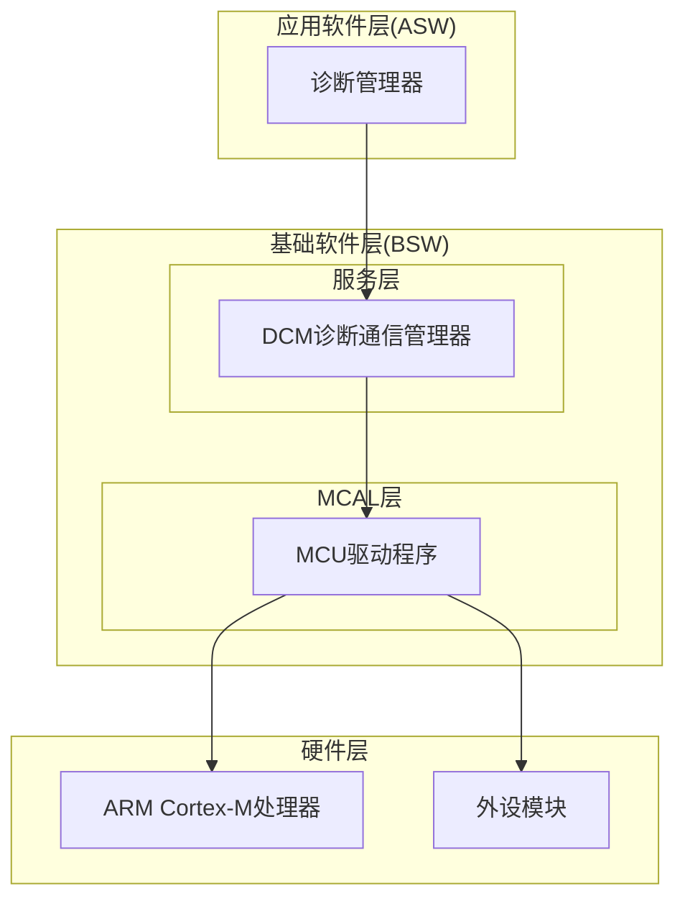
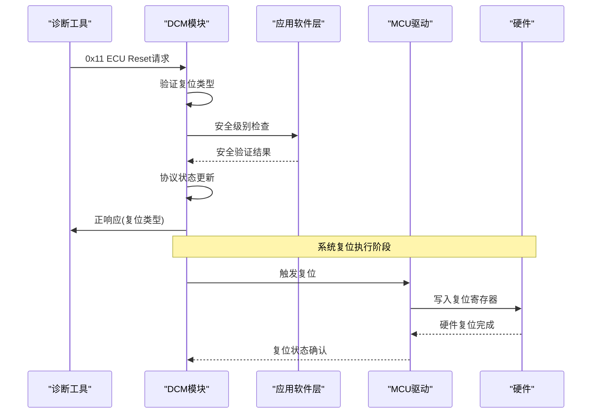
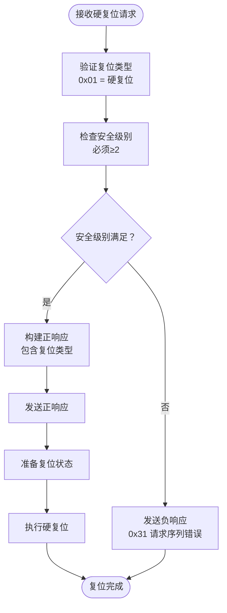
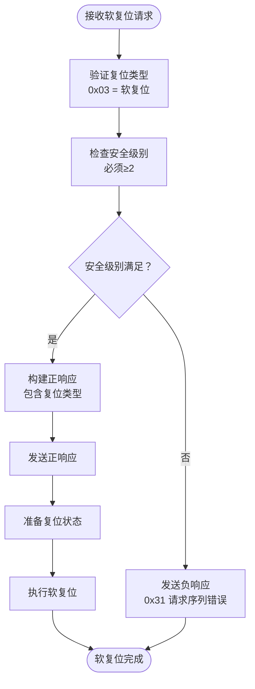
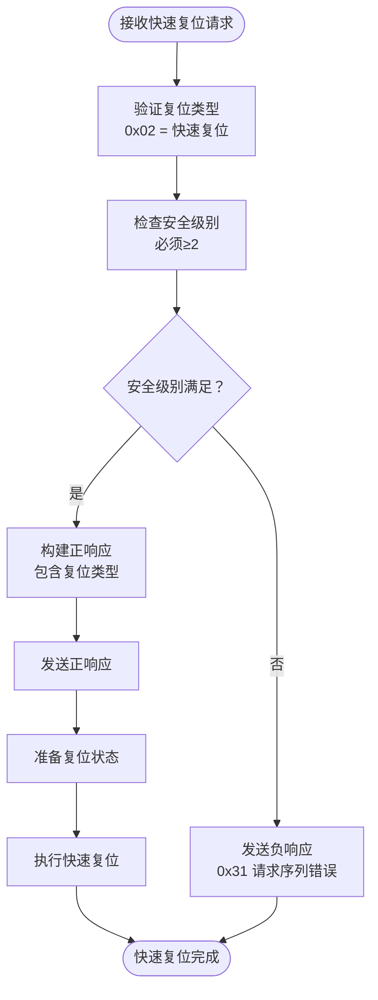
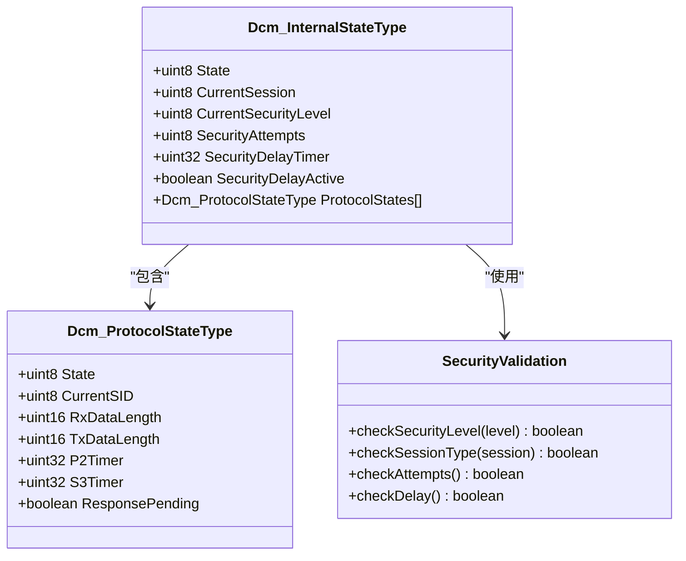
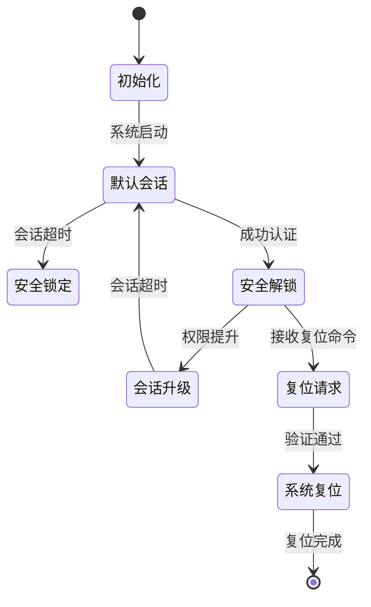
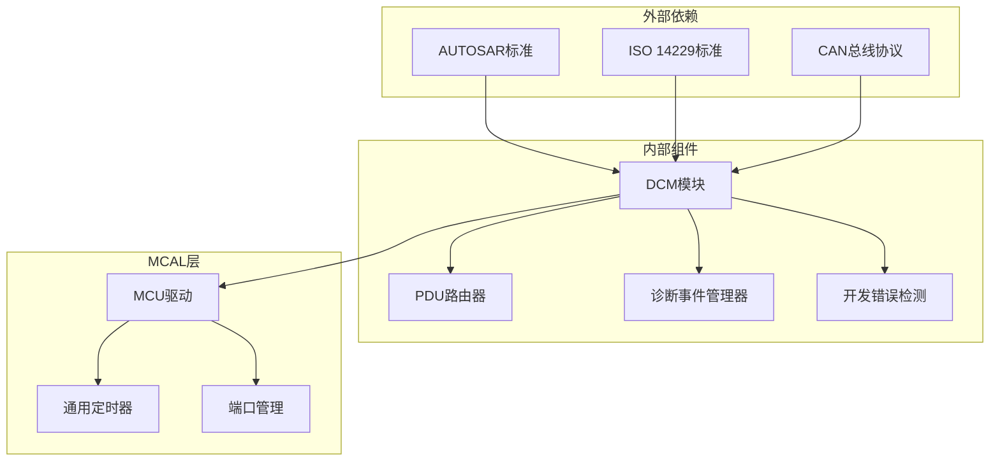
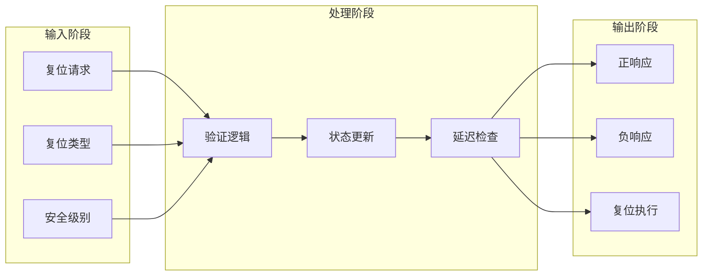
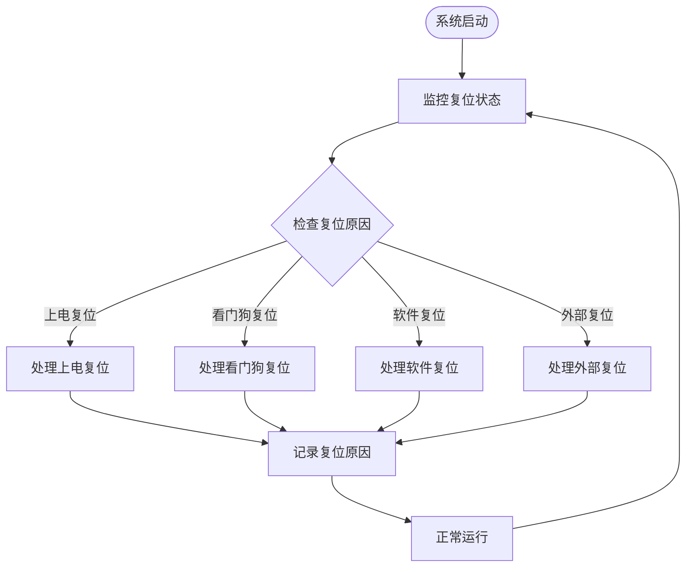

# ECU复位服务

<cite>
**本文档引用的文件**
- [Dcm.c](file://src/bsw/services/dcm/src/Dcm.c)
- [Dcm.h](file://src/bsw/services/dcm/include/Dcm.h)
- [Dcm_Cfg.h](file://src/bsw/services/dcm/include/Dcm_Cfg.h)
- [Mcu.h](file://src/bsw/mcal/mcu/include/Mcu.h)
- [Mcu.c](file://src/bsw/mcal/mcu/src/Mcu.c)
- [Swc_DiagnosticManager.c](file://src/asw/diagnostic_manager/src/Swc_DiagnosticManager.c)
</cite>

## 目录
1. [简介](#简介)
2. [项目结构](#项目结构)
3. [核心组件](#核心组件)
4. [架构概览](#架构概览)
5. [详细组件分析](#详细组件分析)
6. [依赖关系分析](#依赖关系分析)
7. [性能考虑](#性能考虑)
8. [故障排除指南](#故障排除指南)
9. [结论](#结论)

## 简介

ECU复位服务(0x11)是AUTOSAR DCM模块中的核心诊断服务之一，负责执行各种类型的系统复位操作。本文档深入分析了硬复位(0x01)、软复位(0x02)和快速复位(0x03)的实现机制，详细说明了复位请求的验证流程、复位延迟处理和系统状态保存机制。

该服务遵循ISO 14229标准，支持多种复位类型，并集成了完整的安全检查、错误处理和系统稳定性保证措施。通过与MCAL层的MCU驱动程序集成，实现了硬件级别的系统复位功能。

## 项目结构

ECU复位服务在整个AUTOSAR架构中位于以下层次：

**图表来源**
- [Dcm.c:1-50](file://src/bsw/services/dcm/src/Dcm.c#L1-L50)
- [Mcu.c:1-50](file://src/bsw/mcal/mcu/src/Mcu.c#L1-L50)

**章节来源**
- [Dcm.c:1-50](file://src/bsw/services/dcm/src/Dcm.c#L1-L50)
- [Mcu.c:1-50](file://src/bsw/mcal/mcu/src/Mcu.c#L1-L50)

## 核心组件

### DCM诊断通信管理器

DCM模块是ECU复位服务的核心实现组件，负责：
- 解析和验证UDS诊断请求
- 执行复位类型检查
- 发送正负响应消息
- 管理协议状态机

### MCU驱动程序

MCU驱动程序提供底层硬件复位功能：
- 硬件寄存器访问
- 复位原因检测
- 系统时钟管理
- 电源管理模式

### 诊断管理器

应用软件层的诊断管理器负责：
- 安全级别验证
- 会话状态管理
- 请求路由和转发

**章节来源**
- [Dcm.h:1-100](file://src/bsw/services/dcm/include/Dcm.h#L1-L100)
- [Mcu.h:1-100](file://src/bsw/mcal/mcu/include/Mcu.h#L1-L100)
- [Swc_DiagnosticManager.c:1-100](file://src/asw/diagnostic_manager/src/Swc_DiagnosticManager.c#L1-L100)

## 架构概览

ECU复位服务采用分层架构设计，确保功能模块的职责分离和可维护性：

**图表来源**
- [Dcm.c:285-324](file://src/bsw/services/dcm/src/Dcm.c#L285-L324)
- [Mcu.c:449-467](file://src/bsw/mcal/mcu/src/Mcu.c#L449-L467)

## 详细组件分析

### 复位服务实现机制

#### 硬复位(0x01)实现

硬复位是最彻底的系统复位方式，完全重置系统状态：

**图表来源**
- [Dcm.c:298-311](file://src/bsw/services/dcm/src/Dcm.c#L298-L311)

#### 软复位(0x03)实现

软复位保持系统状态，仅重新初始化必要的模块：

**图表来源**
- [Dcm.c:300-311](file://src/bsw/services/dcm/src/Dcm.c#L300-L311)

#### 快速复位(0x02)实现

快速复位是软复位的简化版本，用于快速重启系统：

**图表来源**
- [Dcm.c:299-311](file://src/bsw/services/dcm/src/Dcm.c#L299-L311)

### 复位请求验证流程

复位服务的验证流程包括多个层次的安全检查：

**图表来源**
- [Dcm.c:75-92](file://src/bsw/services/dcm/src/Dcm.c#L75-L92)
- [Dcm.c:60-92](file://src/bsw/services/dcm/src/Dcm.c#L60-L92)

### 复位延迟处理机制

系统实现了多层次的复位延迟保护机制：

| 延迟类型 | 触发条件 | 持续时间 | 功能 |
|---------|----------|----------|------|
| 安全尝试延迟 | 连续3次无效密钥 | 10秒 | 防止暴力破解 |
| 会话超时 | 测试者未在规定时间内发送请求 | 5秒 | 自动返回默认会话 |
| P2定时器 | 服务响应超时 | 50-5000ms | 处理长响应等待 |

**章节来源**
- [Dcm.c:345-412](file://src/bsw/services/dcm/src/Dcm.c#L345-L412)
- [Dcm.c:1203-1244](file://src/bsw/services/dcm/src/Dcm.c#L1203-L1244)

### 系统状态保存机制

复位服务在执行过程中维护关键系统状态：

**图表来源**
- [Dcm.c:1135-1187](file://src/bsw/services/dcm/src/Dcm.c#L1135-L1187)

**章节来源**
- [Dcm.c:1117-1187](file://src/bsw/services/dcm/src/Dcm.c#L1117-L1187)

## 依赖关系分析

### 组件间依赖关系

**图表来源**
- [Dcm.c:18-25](file://src/bsw/services/dcm/src/Dcm.c#L18-L25)
- [Mcu.c:16-21](file://src/bsw/mcal/mcu/src/Mcu.c#L16-L21)

### 数据流分析

复位服务的数据流包括输入验证、处理逻辑和输出响应三个阶段：

**图表来源**
- [Dcm.c:285-324](file://src/bsw/services/dcm/src/Dcm.c#L285-L324)

**章节来源**
- [Dcm.c:1044-1111](file://src/bsw/services/dcm/src/Dcm.c#L1044-L1111)

## 性能考虑

### 复位响应时间

系统设计考虑了不同复位类型的响应时间要求：

- **硬复位**: 完全系统重启，响应时间取决于硬件复位周期
- **软复位**: 模块级重启，响应时间通常小于100ms
- **快速复位**: 最快的重启方式，响应时间通常小于50ms

### 资源消耗优化

- **内存使用**: 复位状态存储在静态变量中，避免动态分配
- **CPU占用**: 复位处理完成后立即释放CPU资源
- **中断处理**: 复位过程中禁用不必要的中断

### 并发安全性

系统实现了多线程安全的复位处理：
- 使用原子操作保护复位状态
- 避免竞态条件的发生
- 提供复位完成通知机制

## 故障排除指南

### 常见错误及解决方案

| 错误代码 | 错误描述 | 可能原因 | 解决方案 |
|---------|----------|----------|----------|
| 0x31 | 请求序列错误 | 安全级别不足或会话不正确 | 提升安全级别或切换到正确会话 |
| 0x12 | 子功能不支持 | 复位类型无效 | 使用支持的复位类型(0x01-0x05) |
| 0x13 | 消息长度错误 | 请求数据格式不正确 | 检查请求格式和长度 |
| 0x35 | 无效密钥 | 认证失败 | 检查密钥生成和传输过程 |

### 复位状态监控

系统提供了多种复位状态监控机制：

**图表来源**
- [Mcu.c:217-241](file://src/bsw/mcal/mcu/src/Mcu.c#L217-L241)

**章节来源**
- [Mcu.c:411-444](file://src/bsw/mcal/mcu/src/Mcu.c#L411-L444)

### 复位服务测试

系统提供了完整的复位服务测试框架：

- **单元测试**: 验证各种复位类型的正确性
- **集成测试**: 测试复位服务与其他模块的交互
- **压力测试**: 验证复位服务在高负载下的稳定性
- **边界测试**: 测试复位服务的边界条件和异常情况

## 结论

ECU复位服务(0x11)是一个高度模块化的诊断服务，具有以下特点：

### 技术优势

1. **标准化实现**: 完全符合ISO 14229和AUTOSAR标准
2. **多层次安全**: 包含会话安全、权限控制和访问限制
3. **灵活配置**: 支持多种复位类型和自定义参数
4. **稳定可靠**: 提供完整的错误处理和恢复机制

### 设计亮点

1. **分层架构**: 清晰的模块划分和职责分离
2. **状态管理**: 完善的状态跟踪和转换机制
3. **性能优化**: 高效的资源利用和响应时间
4. **扩展性**: 易于添加新的复位类型和功能

### 应用价值

该复位服务为汽车电子系统提供了：
- **远程诊断能力**: 支持远程系统重启和故障恢复
- **维护便利性**: 简化的系统维护和调试流程
- **安全性保障**: 受控的系统重启和状态保护
- **可靠性提升**: 稳定的系统运行和快速故障恢复

通过深入分析和文档化，开发者可以更好地理解和使用ECU复位服务，为汽车电子系统的诊断和维护提供强有力的技术支持。