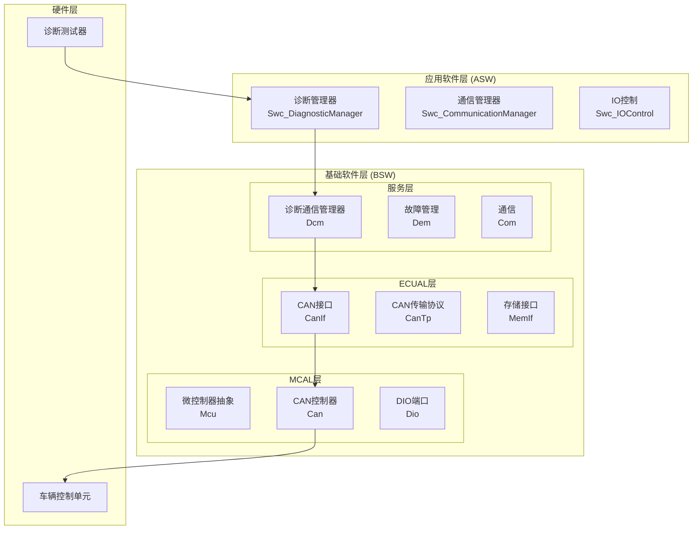
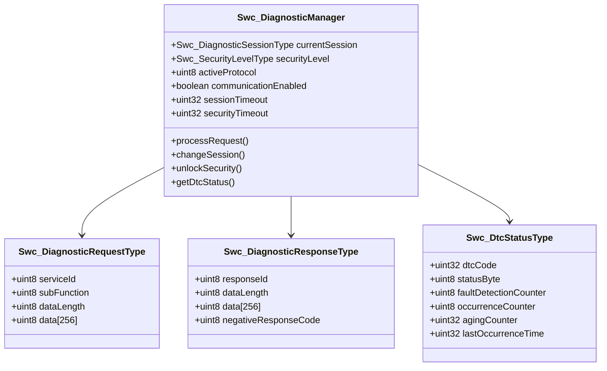
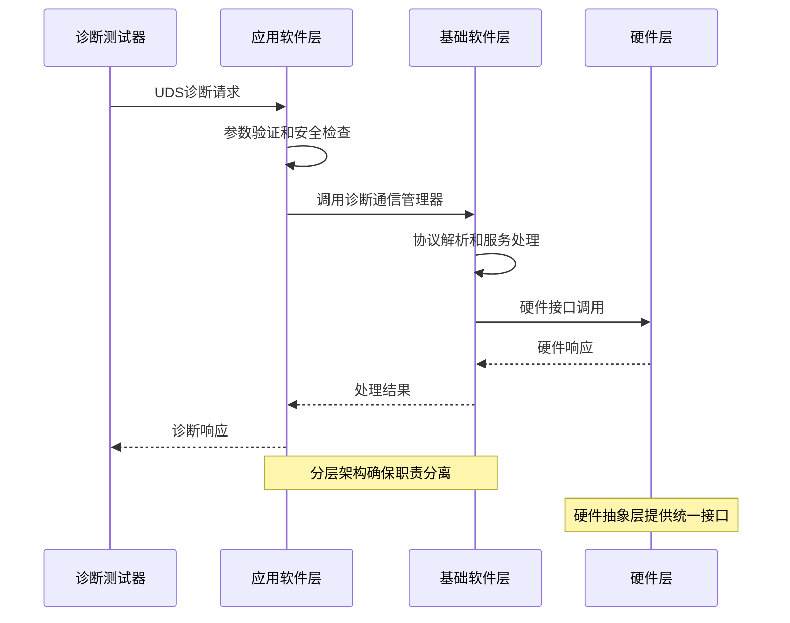
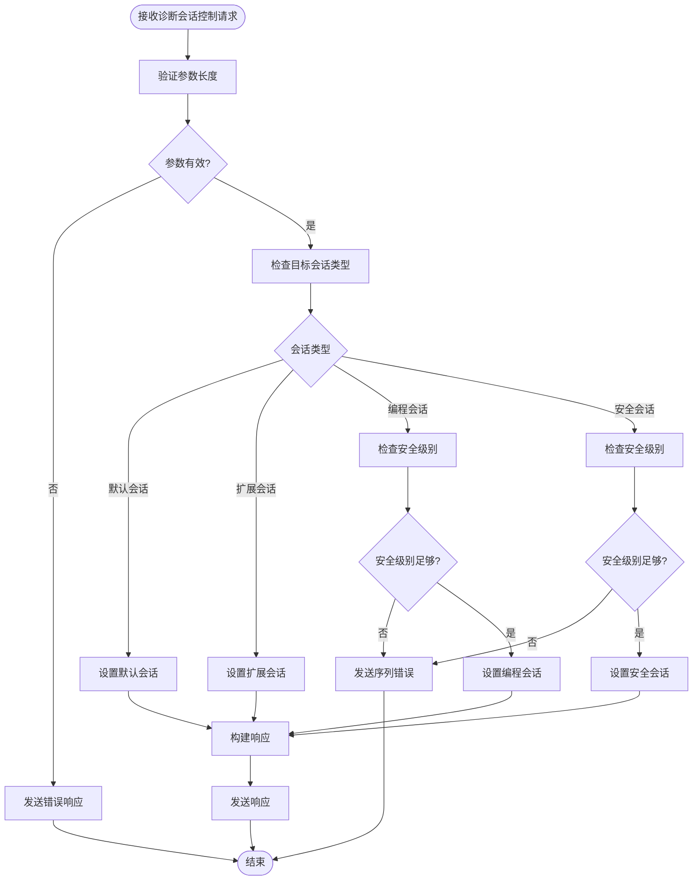
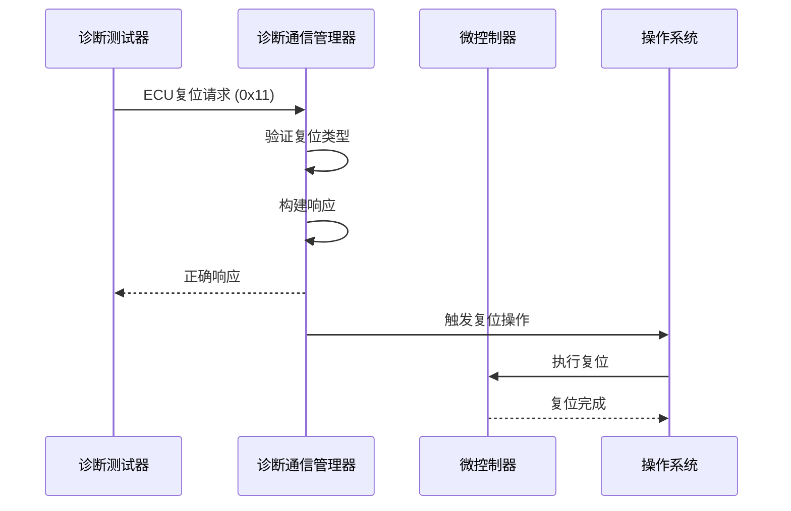
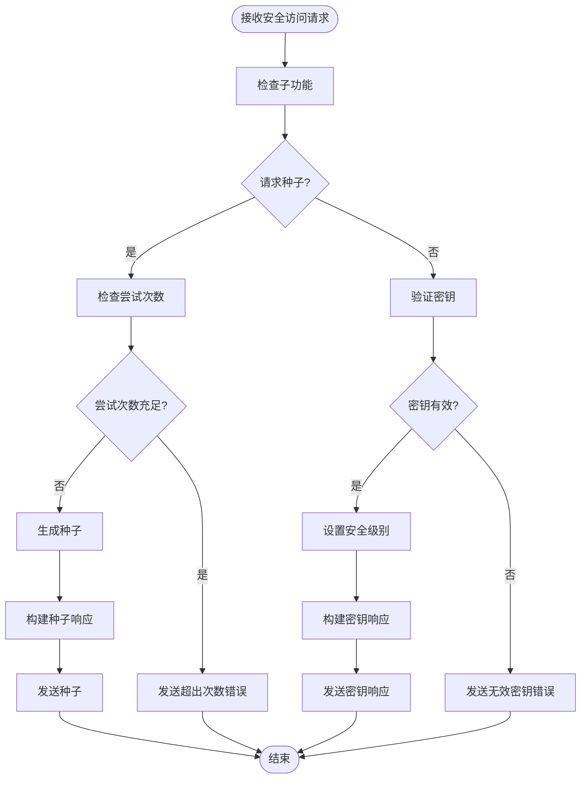
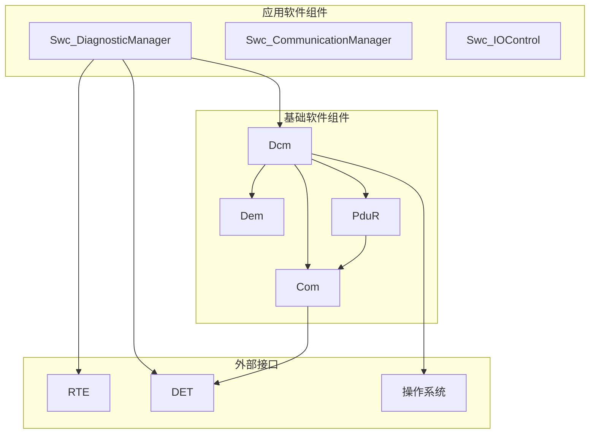
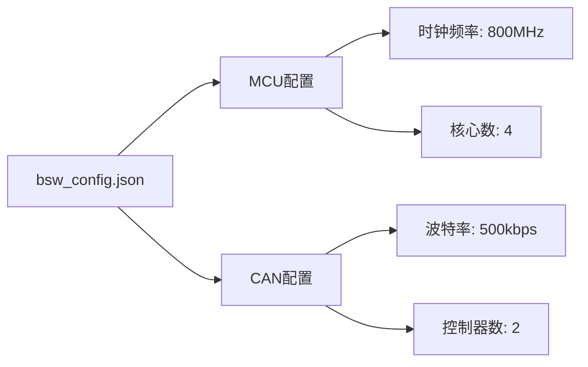

# UDS诊断服务实现

<cite>
**本文档引用的文件**
- [Swc_DiagnosticManager.h](file://src/asw/diagnostic_manager/include/Swc_DiagnosticManager.h)
- [Swc_DiagnosticManager.c](file://src/asw/diagnostic_manager/src/Swc_DiagnosticManager.c)
- [Dcm.h](file://src/bsw/services/dcm/include/Dcm.h)
- [Dcm.c](file://src/bsw/services/dcm/src/Dcm.c)
- [Dcm_Cfg.h](file://src/bsw/services/dcm/include/Dcm_Cfg.h)
- [bsw_config.json](file://config/bsw_config.json)
</cite>

## 目录
1. [项目概述](#项目概述)
2. [项目结构](#项目结构)
3. [核心组件](#核心组件)
4. [架构概览](#架构概览)
5. [详细组件分析](#详细组件分析)
6. [依赖关系分析](#依赖关系分析)
7. [性能考虑](#性能考虑)
8. [故障排除指南](#故障排除指南)
9. [结论](#结论)

## 项目概述

本项目实现了基于AutoSAR Classic平台的UDS（统一诊断服务）诊断通信管理功能。系统采用分层架构设计，包含应用软件组件（ASW）和基础软件组件（BSW），提供完整的诊断服务处理能力。

该实现支持多种UDS诊断服务，包括诊断会话控制、ECU复位、安全访问、通信控制、测试器存在等核心服务，以及DID（数据标识符）和RID（功能标识符）的读写处理机制。

## 项目结构

项目采用AutoSAR标准的分层架构，主要分为以下几个层次：

**图表来源**
- [Swc_DiagnosticManager.h:1-211](file://src/asw/diagnostic_manager/include/Swc_DiagnosticManager.h#L1-L211)
- [Dcm.h:1-379](file://src/bsw/services/dcm/include/Dcm.h#L1-L379)

**章节来源**
- [Swc_DiagnosticManager.h:1-211](file://src/asw/diagnostic_manager/include/Swc_DiagnosticManager.h#L1-L211)
- [Dcm.h:1-379](file://src/bsw/services/dcm/include/Dcm.h#L1-L379)

## 核心组件

### 诊断管理器组件

诊断管理器是应用软件层的核心组件，负责处理UDS诊断请求和生成响应。其主要职责包括：

- 诊断会话管理
- 安全访问控制
- DTC（故障码）管理
- 与RTE（运行时环境）的接口

**图表来源**
- [Swc_DiagnosticManager.h:28-87](file://src/asw/diagnostic_manager/include/Swc_DiagnosticManager.h#L28-L87)

### 诊断通信管理器

诊断通信管理器是BSW层的核心组件，遵循AutoSAR标准实现完整的UDS协议栈：

- 支持多种诊断服务
- 协议状态管理
- 错误处理和负响应
- 定时器管理

**章节来源**
- [Swc_DiagnosticManager.c:1-686](file://src/asw/diagnostic_manager/src/Swc_DiagnosticManager.c#L1-L686)
- [Dcm.c:1-1455](file://src/bsw/services/dcm/src/Dcm.c#L1-L1455)

## 架构概览

系统采用分层架构设计，确保各层职责清晰分离：

**图表来源**
- [Dcm.c:1046-1111](file://src/bsw/services/dcm/src/Dcm.c#L1046-L1111)
- [Swc_DiagnosticManager.c:471-531](file://src/asw/diagnostic_manager/src/Swc_DiagnosticManager.c#L471-L531)

## 详细组件分析

### 诊断会话控制服务 (0x10)

诊断会话控制服务用于管理系统的工作模式和会话级别。

#### 请求格式
- 服务ID: 0x10
- 数据长度: 至少1字节
- 参数: 会话类型（1字节）

#### 会话类型定义
| 会话类型 | 数值 | 描述 |
|---------|------|------|
| 默认会话 | 0x01 | 基础诊断功能 |
| 扩会展开会话 | 0x03 | 扩展诊断功能 |
| 编程会话 | 0x02 | ECU编程功能 |
| 安全系统会话 | 0x04 | 安全相关诊断 |

#### 处理流程

**图表来源**
- [Swc_DiagnosticManager.c:144-201](file://src/asw/diagnostic_manager/src/Swc_DiagnosticManager.c#L144-L201)
- [Dcm.c:238-280](file://src/bsw/services/dcm/src/Dcm.c#L238-L280)

**章节来源**
- [Swc_DiagnosticManager.c:144-201](file://src/asw/diagnostic_manager/src/Swc_DiagnosticManager.c#L144-L201)
- [Dcm.c:238-280](file://src/bsw/services/dcm/src/Dcm.c#L238-L280)

### ECU复位服务 (0x11)

ECU复位服务用于重新启动或关闭ECU。

#### 请求格式
- 服务ID: 0x11
- 数据长度: 至少1字节
- 参数: 复位类型（1字节）

#### 复位类型定义
| 复位类型 | 数值 | 描述 |
|---------|------|------|
| 硬复位 | 0x01 | 完全重启ECU |
| 点火开关复位 | 0x02 | 模拟点火开关动作 |
| 软复位 | 0x03 | 软件层面重启 |
| 快速断电启用 | 0x04 | 启用快速断电功能 |
| 快速断电禁用 | 0x05 | 禁用快速断电功能 |

#### 处理逻辑

**图表来源**
- [Dcm.c:285-324](file://src/bsw/services/dcm/src/Dcm.c#L285-L324)

**章节来源**
- [Dcm.c:285-324](file://src/bsw/services/dcm/src/Dcm.c#L285-L324)

### 安全访问服务 (0x27)

安全访问服务提供多级别的安全保护机制。

#### 请求格式
- 服务ID: 0x27
- 数据长度: 至少1字节
- 参数: 子功能（1字节）

#### 安全级别定义
| 安全级别 | 数值 | 描述 |
|---------|------|------|
| 锁定状态 | 0x00 | 无权限 |
| 客户级别 | 0x01 | 基础访问权限 |
| 工程级别 | 0x02 | 高级访问权限 |
| 制造商级别 | 0x03 | 最高访问权限 |

#### 安全流程

**图表来源**
- [Swc_DiagnosticManager.c:206-259](file://src/asw/diagnostic_manager/src/Swc_DiagnosticManager.c#L206-L259)
- [Dcm.c:329-413](file://src/bsw/services/dcm/src/Dcm.c#L329-L413)

**章节来源**
- [Swc_DiagnosticManager.c:206-259](file://src/asw/diagnostic_manager/src/Swc_DiagnosticManager.c#L206-L259)
- [Dcm.c:329-413](file://src/bsw/services/dcm/src/Dcm.c#L329-L413)

### 通信控制服务 (0x28)

通信控制服务用于启用或禁用特定类型的通信。

#### 请求格式
- 服务ID: 0x28
- 数据长度: 至少2字节
- 参数: 子功能 + 通信类型

#### 通信类型定义
| 通信类型 | 数值 | 描述 |
|---------|------|------|
| 诊断通信 | 0x01 | 诊断相关通信 |
| 生存期通信 | 0x02 | 运行时通信 |
| 所有通信 | 0x03 | 全部通信类型 |

**章节来源**
- [Dcm.c:415-453](file://src/bsw/services/dcm/src/Dcm.c#L415-L453)

### 测试器存在服务 (0x3E)

测试器存在服务用于保持诊断会话活跃状态。

#### 请求格式
- 服务ID: 0x3E
- 数据长度: 至少1字节
- 参数: 子功能（1字节）

#### 子功能定义
| 子功能 | 数值 | 描述 |
|-------|------|------|
| 激活 | 0x00 | 激活测试器存在 |
| 抑制 | 0x80 | 抑制响应（仅心跳） |

**章节来源**
- [Swc_DiagnosticManager.c:346-361](file://src/asw/diagnostic_manager/src/Swc_DiagnosticManager.c#L346-L361)
- [Dcm.c:418-452](file://src/bsw/services/dcm/src/Dcm.c#L418-L452)

### DTC管理服务

系统支持多种DTC（故障码）管理功能：

#### 读取DTC信息 (0x19)
支持多种子功能：
- 0x01: 按状态掩码报告DTC数量
- 0x02: 按状态掩码报告DTC列表
- 0x06: 按DTC号报告扩展数据记录
- 0x0A: 报告支持的DTC

#### 清除DTC信息 (0x14)
- 清除指定DTC
- 清除所有DTC（使用特殊代码0xFFFFFF）

**章节来源**
- [Swc_DiagnosticManager.c:264-341](file://src/asw/diagnostic_manager/src/Swc_DiagnosticManager.c#L264-L341)
- [Dcm.c:598-763](file://src/bsw/services/dcm/src/Dcm.c#L598-L763)

## 依赖关系分析

### 组件间依赖关系

**图表来源**
- [Swc_DiagnosticManager.c:15-17](file://src/asw/diagnostic_manager/src/Swc_DiagnosticManager.c#L15-L17)
- [Dcm.c:20-25](file://src/bsw/services/dcm/src/Dcm.c#L20-L25)

### 配置依赖

系统配置通过JSON文件进行管理：

**图表来源**
- [bsw_config.json:1-21](file://config/bsw_config.json#L1-L21)

**章节来源**
- [bsw_config.json:1-21](file://config/bsw_config.json#L1-L21)

## 性能考虑

### 内存管理
- 请求缓冲区大小：256字节
- 响应缓冲区大小：256字节
- 最大DTC数量：50个
- DCM缓冲区大小：4095字节

### 时间管理
- 会话超时：5000ms
- 安全超时：5000ms
- 主函数周期：10ms
- P2定时器：50ms
- P2*定时器：5000ms

### 并发处理
系统采用单线程架构，通过RTE实现任务调度，确保诊断请求的有序处理。

## 故障排除指南

### 常见错误代码

| 错误代码 | 含义 | 可能原因 | 解决方案 |
|---------|------|----------|----------|
| 0x11 | 服务不支持 | 请求的服务未实现 | 检查服务ID是否正确 |
| 0x12 | 子功能不支持 | 子功能超出范围 | 验证子功能参数 |
| 0x13 | 消息长度错误 | 数据长度不足 | 检查请求格式 |
| 0x24 | 请求序列错误 | 安全级别不足 | 先执行安全访问 |
| 0x31 | 请求超出范围 | DTC不存在或越界 | 验证DTC代码 |
| 0x33 | 安全访问被拒绝 | 权限不足 | 检查安全级别 |
| 0x35 | 无效密钥 | 密钥验证失败 | 重新生成密钥 |

### 调试建议

1. **日志记录**：启用DET（诊断事件跟踪）记录错误信息
2. **参数验证**：在每个服务入口处添加参数检查
3. **超时监控**：定期检查会话和安全超时状态
4. **内存检查**：监控缓冲区使用情况，防止溢出

**章节来源**
- [Dcm.h:161-203](file://src/bsw/services/dcm/include/Dcm.h#L161-L203)
- [Swc_DiagnosticManager.c:496-500](file://src/asw/diagnostic_manager/src/Swc_DiagnosticManager.c#L496-L500)

## 结论

本UDS诊断服务实现提供了完整的诊断通信功能，具有以下特点：

1. **标准化实现**：完全符合AutoSAR和ISO 14229标准
2. **模块化设计**：清晰的分层架构，职责分离明确
3. **安全性保障**：多级别的安全访问控制机制
4. **可扩展性**：支持DID和RID的动态配置
5. **可靠性**：完善的错误处理和超时管理

系统能够满足现代汽车诊断需求，为ECU的开发、测试和维护提供可靠的技术支撑。