# 否定响应码处理

<cite>
**本文档引用的文件**
- [Dcm.c](file://src/bsw/services/dcm/src/Dcm.c)
- [Dcm.h](file://src/bsw/services/dcm/include/Dcm.h)
- [Dcm_Cfg.h](file://src/bsw/services/dcm/include/Dcm_Cfg.h)
- [Swc_DiagnosticManager.c](file://src/asw/diagnostic_manager/src/Swc_DiagnosticManager.c)
- [Swc_DiagnosticManager.h](file://src/asw/diagnostic_manager/include/Swc_DiagnosticManager.h)
</cite>

## 目录
1. [简介](#简介)
2. [项目结构](#项目结构)
3. [核心组件](#核心组件)
4. [架构概览](#架构概览)
5. [详细组件分析](#详细组件分析)
6. [依赖关系分析](#依赖关系分析)
7. [性能考虑](#性能考虑)
8. [故障排除指南](#故障排除指南)
9. [结论](#结论)

## 简介

本文件详细阐述了YuleASR车载软件平台中否定响应码（Negative Response Code, NRC）的处理机制。NRC是UDS（统一诊断服务）协议中的关键概念，用于在诊断请求无法成功执行时向诊断工具返回错误信息。本文档涵盖了从通用拒绝到具体错误条件的完整处理流程，包括错误条件判断、响应生成、错误状态管理和系统稳定性保障措施。

该实现遵循AutoSAR Classic Platform 4.x标准，提供了完整的UDS诊断通信管理功能，支持多种诊断服务和安全访问机制。

## 项目结构

YuleASR项目采用分层架构设计，否定响应码处理主要位于BSW（基础软件）层的服务层中：

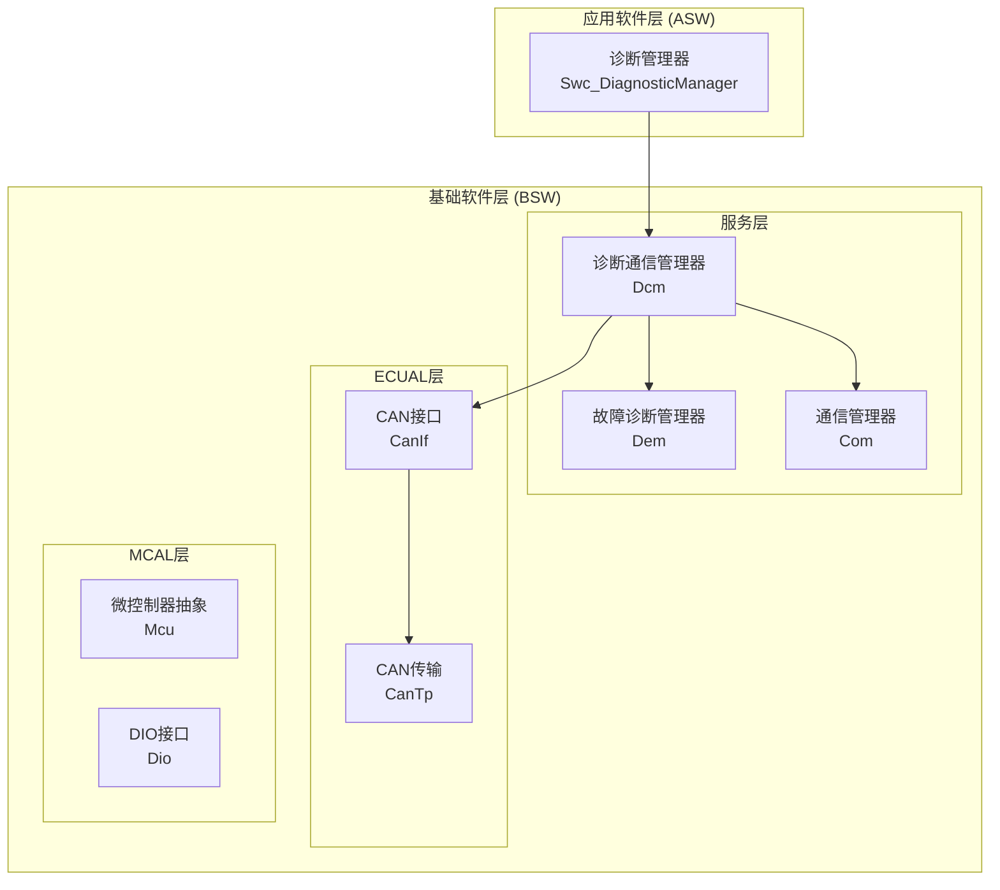

**图表来源**
- [Dcm.c:1-50](file://src/bsw/services/dcm/src/Dcm.c#L1-L50)
- [Swc_DiagnosticManager.c:1-50](file://src/asw/diagnostic_manager/src/Swc_DiagnosticManager.c#L1-L50)

**章节来源**
- [Dcm.c:1-1455](file://src/bsw/services/dcm/src/Dcm.c#L1-L1455)
- [Dcm.h:1-379](file://src/bsw/services/dcm/include/Dcm.h#L1-L379)

## 核心组件

### DCM模块（诊断通信管理器）

DCM模块是整个否定响应码处理的核心组件，负责：
- 接收和解析诊断请求
- 执行业务逻辑验证
- 生成适当的响应（正响应或负响应）
- 管理会话和安全状态

### 错误码定义系统

系统定义了完整的错误码枚举类型，涵盖所有可能的否定响应情况：

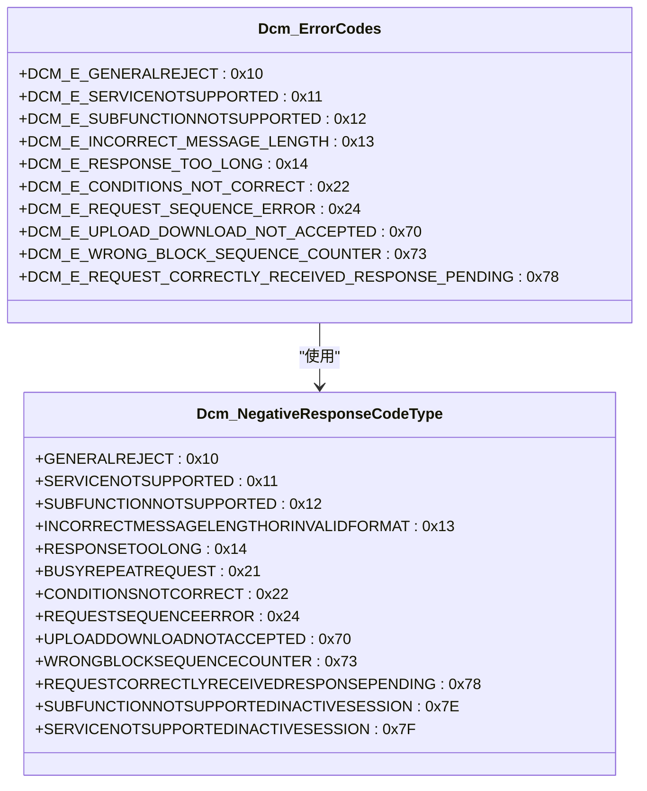

**图表来源**
- [Dcm.h:161-203](file://src/bsw/services/dcm/include/Dcm.h#L161-L203)

### 发送负响应函数

系统提供了专门的负响应发送函数，确保格式正确性和一致性：

**章节来源**
- [Dcm.c:212-233](file://src/bsw/services/dcm/src/Dcm.c#L212-L233)
- [Dcm.h:118-129](file://src/bsw/services/dcm/include/Dcm.h#L118-L129)

## 架构概览

否定响应码处理的整体架构如下：

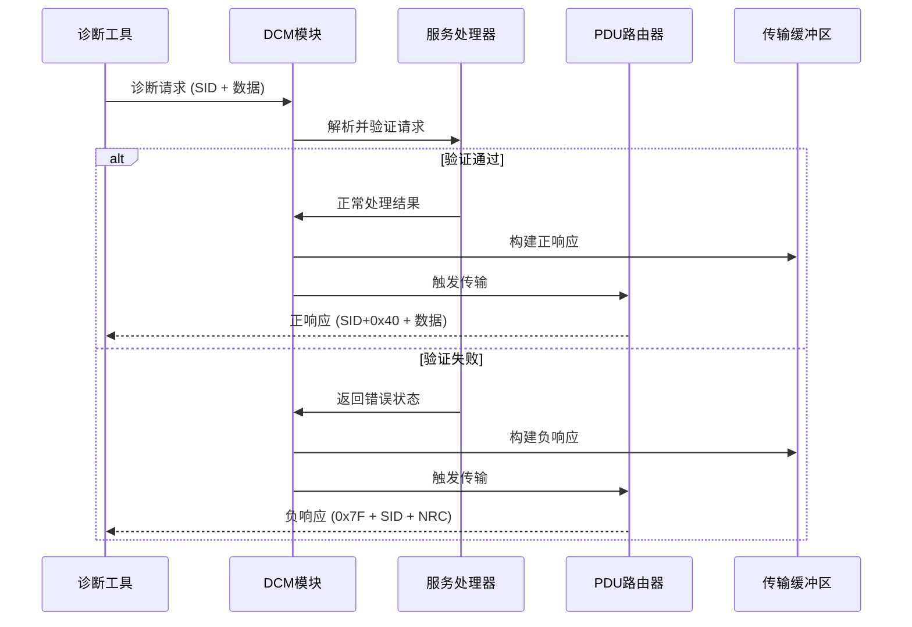

**图表来源**
- [Dcm.c:181-233](file://src/bsw/services/dcm/src/Dcm.c#L181-L233)
- [Dcm.c:1046-1111](file://src/bsw/services/dcm/src/Dcm.c#L1046-L1111)

## 详细组件分析

### 通用拒绝 (0x10)

通用拒绝是最常见的否定响应码，表示一般性拒绝但未指定具体原因。系统在以下情况下返回此错误：

- 未满足基本的安全要求
- 会话类型不匹配
- 服务不可用

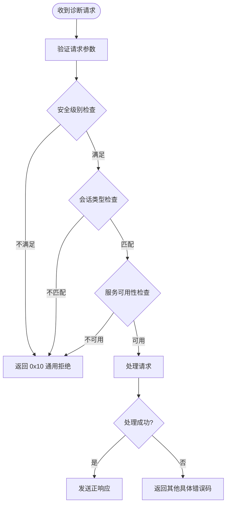

**图表来源**
- [Dcm.c:347-410](file://src/bsw/services/dcm/src/Dcm.c#L347-L410)
- [Dcm.c:508-516](file://src/bsw/services/dcm/src/Dcm.c#L508-L516)

### 服务不支持 (0x11)

当请求的服务ID不在支持列表中时返回此错误：

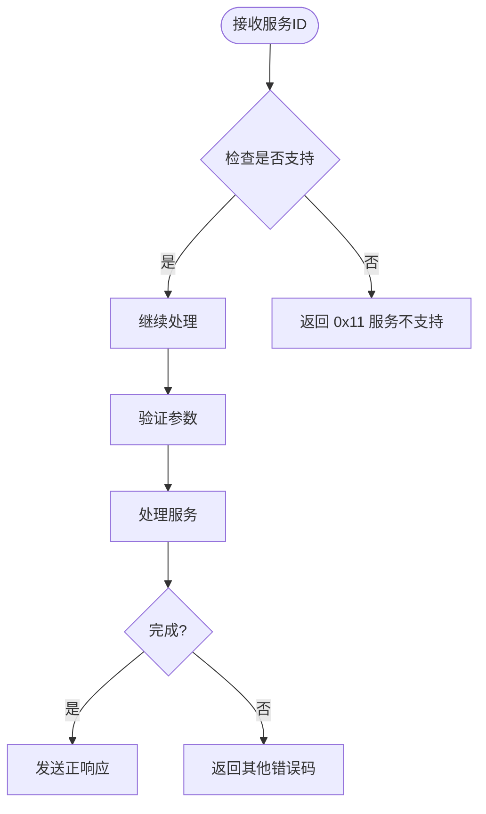

**图表来源**
- [Dcm.c:1106-1108](file://src/bsw/services/dcm/src/Dcm.c#L1106-L1108)
- [Swc_DiagnosticManager.c:524-527](file://src/asw/diagnostic_manager/src/Swc_DiagnosticManager.c#L524-L527)

### 子功能不支持 (0x12)

当服务存在但特定子功能不受支持时返回此错误：

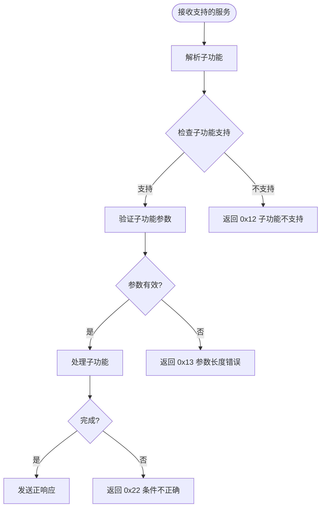

**图表来源**
- [Dcm.c:874-876](file://src/bsw/services/dcm/src/Dcm.c#L874-L876)
- [Swc_DiagnosticManager.c:186-189](file://src/asw/diagnostic_manager/src/Swc_DiagnosticManager.c#L186-L189)

### 请求消息长度错误 (0x13)

这是最常见的错误之一，当请求格式不符合协议规范时返回：

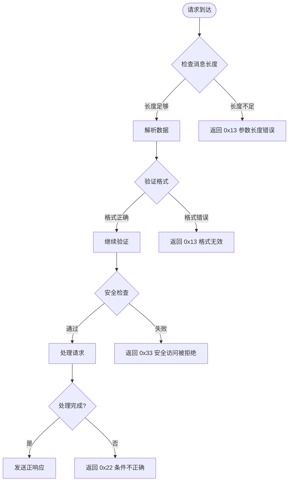

**图表来源**
- [Dcm.c:275-277](file://src/bsw/services/dcm/src/Dcm.c#L275-L277)
- [Dcm.c:409-411](file://src/bsw/services/dcm/src/Dcm.c#L409-L411)

### 条件不正确 (0x22)

当请求的执行条件不满足时返回此错误：

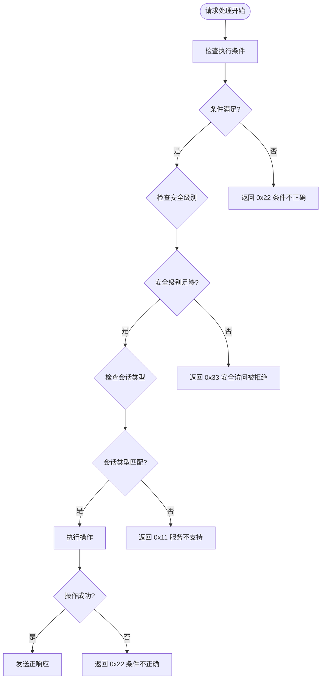

**图表来源**
- [Dcm.c:494-496](file://src/bsw/services/dcm/src/Dcm.c#L494-L496)
- [Dcm.c:832-835](file://src/bsw/services/dcm/src/Dcm.c#L832-L835)

### 安全访问被拒绝 (0x33)

当安全访问级别不足或安全流程未正确完成时返回：

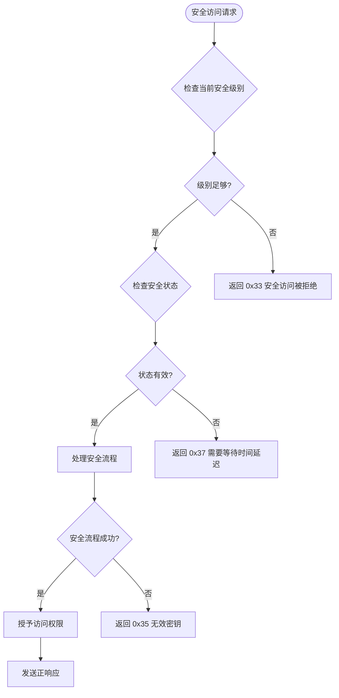

**图表来源**
- [Dcm.c:508-511](file://src/bsw/services/dcm/src/Dcm.c#L508-L511)
- [Dcm.c:396-400](file://src/bsw/services/dcm/src/Dcm.c#L396-L400)

### 超出范围 (0x31)

当请求的数据标识符或功能参数超出允许范围时返回：

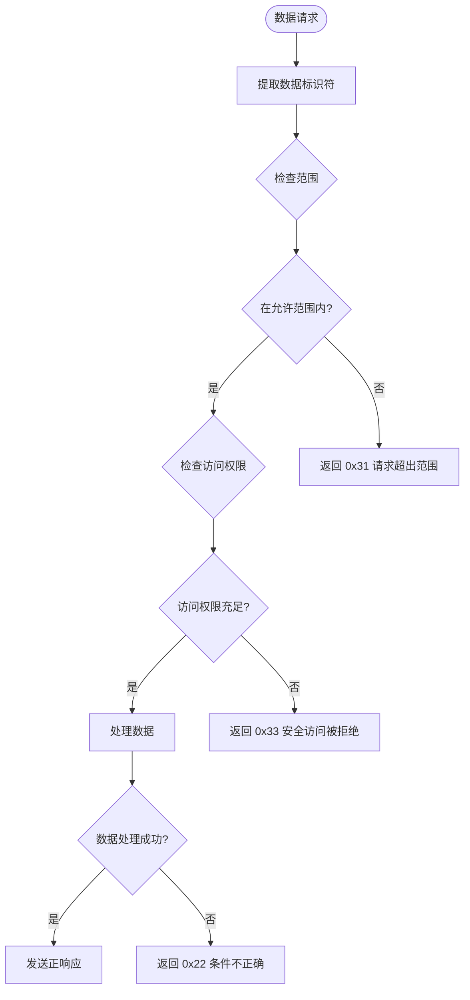

**图表来源**
- [Dcm.c:514-516](file://src/bsw/services/dcm/src/Dcm.c#L514-L516)
- [Dcm.c:889-892](file://src/bsw/services/dcm/src/Dcm.c#L889-L892)

### 无效密钥 (0x35)

当提供的安全密钥验证失败时返回：

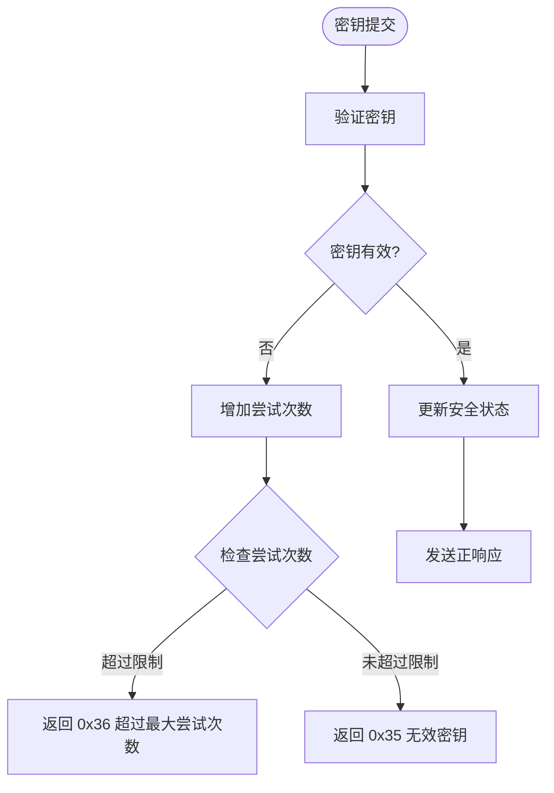

**图表来源**
- [Dcm.c:396-400](file://src/bsw/services/dcm/src/Dcm.c#L396-L400)
- [Swc_DiagnosticManager.c:255-258](file://src/asw/diagnostic_manager/src/Swc_DiagnosticManager.c#L255-L258)

### 超过最大尝试次数 (0x36)

当安全访问尝试次数超过配置限制时返回：

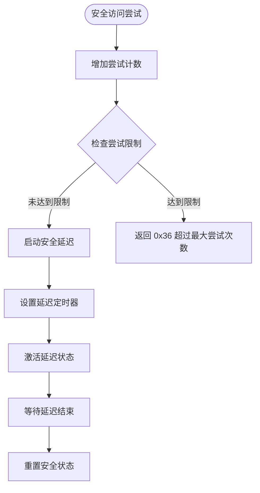

**图表来源**
- [Dcm.c:349-354](file://src/bsw/services/dcm/src/Dcm.c#L349-L354)
- [Dcm_Cfg.h:66-67](file://src/bsw/services/dcm/include/Dcm_Cfg.h#L66-L67)

### 需要等待时间延迟 (0x37)

当安全访问被临时阻止时返回：

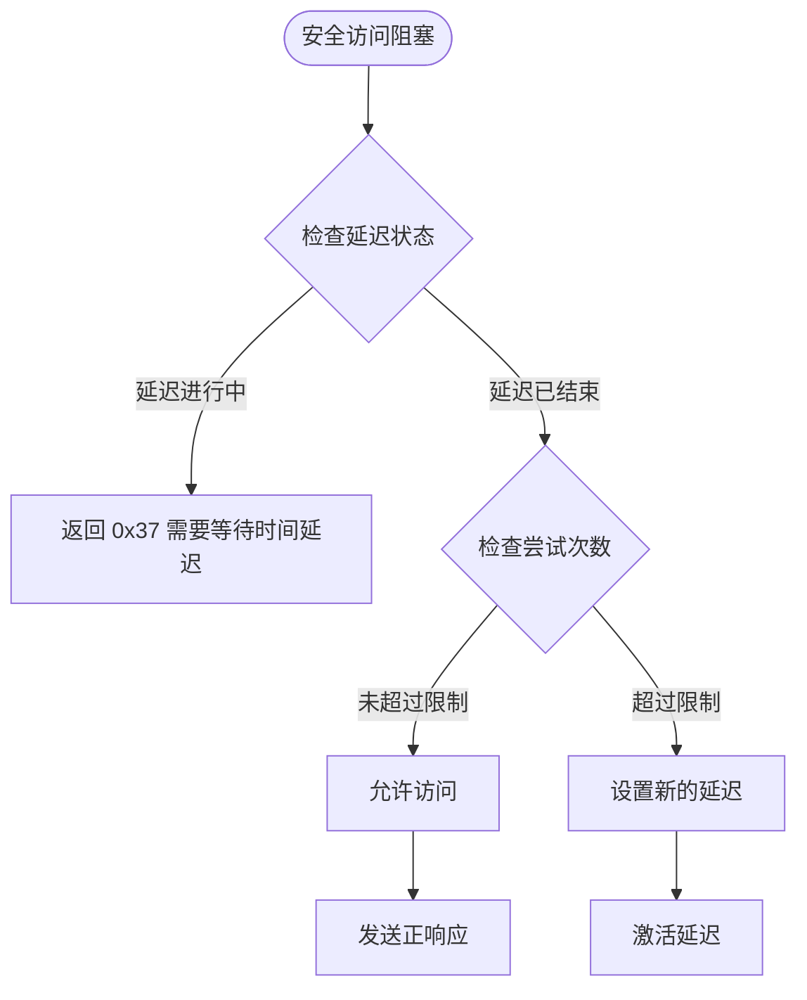

**图表来源**
- [Dcm.c:345-347](file://src/bsw/services/dcm/src/Dcm.c#L345-L347)
- [Dcm.c:1215-1227](file://src/bsw/services/dcm/src/Dcm.c#L1215-L1227)

### 上传下载未被接受 (0x70)

当数据传输过程中的特定条件不满足时返回：

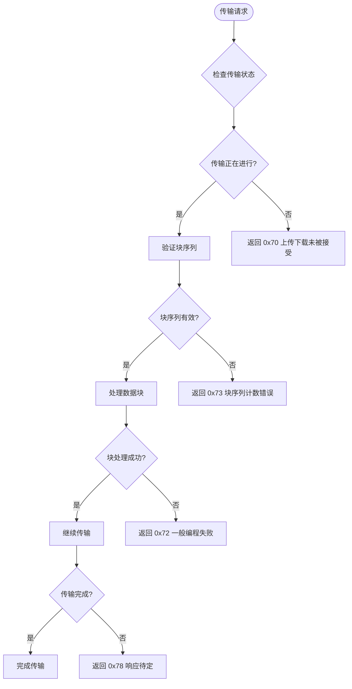

**图表来源**
- [Dcm.c:956-958](file://src/bsw/services/dcm/src/Dcm.c#L956-L958)
- [Dcm.c:1004-1006](file://src/bsw/services/dcm/src/Dcm.c#L1004-L1006)

### 响应待定 (0x78)

当需要长时间处理但系统仍可继续工作时返回：

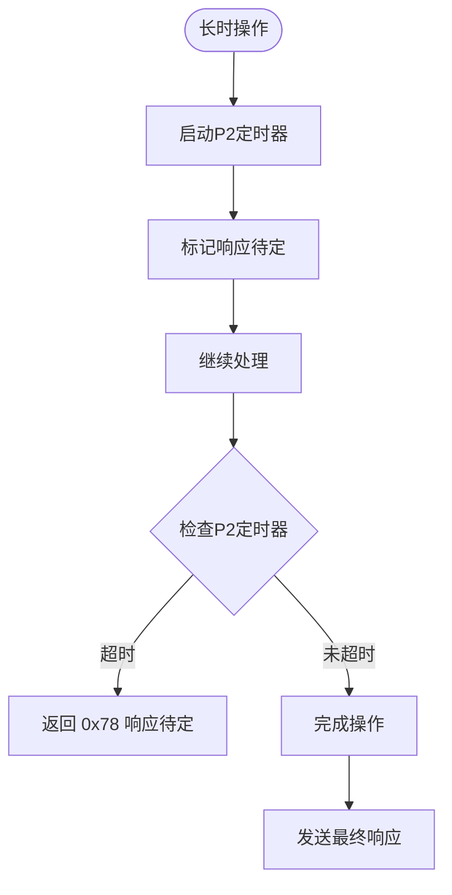

**图表来源**
- [Dcm.c:1235-1242](file://src/bsw/services/dcm/src/Dcm.c#L1235-L1242)
- [Dcm.h:182-183](file://src/bsw/services/dcm/include/Dcm.h#L182-L183)

## 依赖关系分析

否定响应码处理涉及多个组件之间的复杂交互：

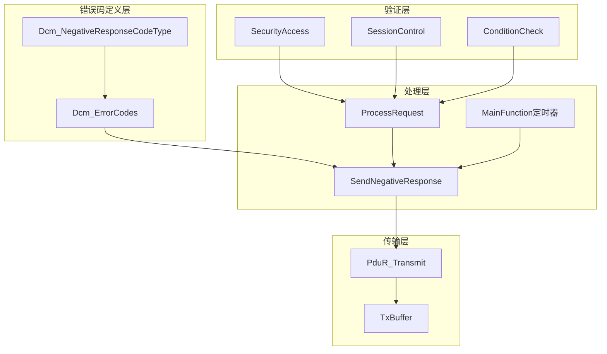

**图表来源**
- [Dcm.c:109-1111](file://src/bsw/services/dcm/src/Dcm.c#L109-L1111)
- [Dcm.h:161-203](file://src/bsw/services/dcm/include/Dcm.h#L161-L203)

### 关键依赖关系

1. **错误码映射关系**：系统使用统一的错误码枚举类型，确保错误处理的一致性
2. **状态管理依赖**：安全状态、会话状态和传输状态相互影响
3. **定时器依赖**：P2和S3定时器控制响应时机和会话保持
4. **缓冲区管理**：TX/RX缓冲区大小直接影响错误处理能力

**章节来源**
- [Dcm.c:1192-1245](file://src/bsw/services/dcm/src/Dcm.c#L1192-L1245)
- [Dcm_Cfg.h:77-115](file://src/bsw/services/dcm/include/Dcm_Cfg.h#L77-L115)

## 性能考虑

### 错误处理性能优化

系统在设计时充分考虑了性能因素：

1. **快速路径优化**：对于常见错误（如长度错误），系统提供快速返回路径
2. **内存管理**：使用静态缓冲区避免动态内存分配开销
3. **状态机设计**：通过状态机减少分支判断复杂度
4. **定时器优化**：集中处理多个定时器，避免重复计算

### 内存使用分析

- **RX缓冲区**：256字节，支持最大请求长度
- **TX缓冲区**：256字节，支持最大响应长度  
- **内部状态**：约100字节，包含会话、安全和传输状态
- **错误码存储**：枚举类型，占用1字节

### 处理延迟分析

系统通过以下机制保证低延迟：
- **中断驱动**：PDU接收通过回调机制处理
- **非阻塞传输**：发送操作不阻塞主循环
- **批量处理**：多个协议状态并行处理

## 故障排除指南

### 常见问题诊断

#### 问题1：频繁出现0x13错误
**症状**：诊断工具经常收到"请求消息长度错误"
**可能原因**：
- 请求格式不符合UDS标准
- 诊断工具发送的数据长度不正确
- 缓冲区溢出

**解决步骤**：
1. 检查请求数据格式
2. 验证数据长度字段
3. 确认缓冲区配置

#### 问题2：安全访问失败
**症状**：0x33或0x35错误频繁出现
**可能原因**：
- 密钥验证算法错误
- 安全级别配置不当
- 尝试次数限制过严

**解决步骤**：
1. 验证密钥生成算法
2. 检查安全级别映射
3. 调整尝试次数限制

#### 问题3：响应超时
**症状**：0x78错误，响应待定
**可能原因**：
- P2定时器设置过短
- 长时间操作未及时处理
- 系统负载过高

**解决步骤**：
1. 检查P2定时器配置
2. 优化长时操作处理
3. 分析系统负载

### 调试信息记录

系统提供了完整的调试支持：

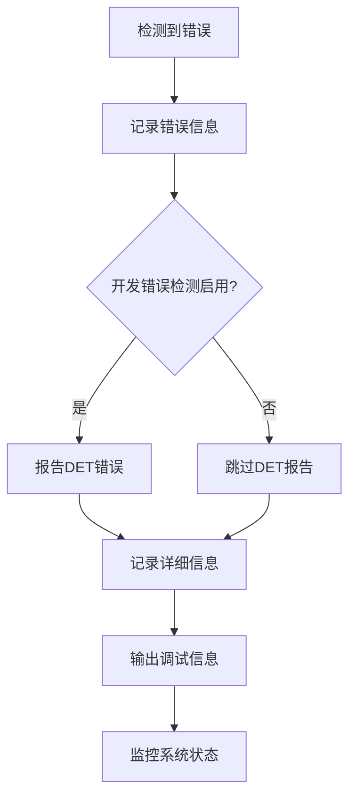

**图表来源**
- [Dcm.c:50-55](file://src/bsw/services/dcm/src/Dcm.c#L50-L55)
- [Dcm.h:67-76](file://src/bsw/services/dcm/include/Dcm.h#L67-L76)

**章节来源**
- [Dcm.c:50-55](file://src/bsw/services/dcm/src/Dcm.c#L50-L55)
- [Dcm_Cfg.h:15-18](file://src/bsw/services/dcm/include/Dcm_Cfg.h#L15-L18)

### 错误恢复机制

系统实现了多层次的错误恢复机制：

1. **自动恢复**：某些临时错误（如超时）可以自动恢复
2. **手动干预**：严重错误需要人工干预
3. **降级模式**：在错误状态下进入安全模式
4. **状态重置**：错误后自动重置到安全状态

## 结论

YuleASR项目的否定响应码处理系统展现了高度的专业性和完整性。通过标准化的错误码定义、严格的验证流程和完善的错误恢复机制，系统能够可靠地处理各种诊断场景中的错误情况。

### 主要优势

1. **标准化实现**：完全符合UDS和AutoSAR标准
2. **全面覆盖**：支持所有主要的否定响应码类型
3. **性能优化**：通过状态机和缓冲区管理确保高效处理
4. **可维护性**：清晰的代码结构和完整的注释
5. **可扩展性**：模块化设计便于功能扩展

### 技术亮点

- 统一的错误码枚举系统
- 实时的定时器管理
- 完善的安全访问控制
- 高效的缓冲区管理
- 全面的调试支持

该系统为车载诊断应用提供了坚实的技术基础，能够满足现代汽车电子系统的严格要求。