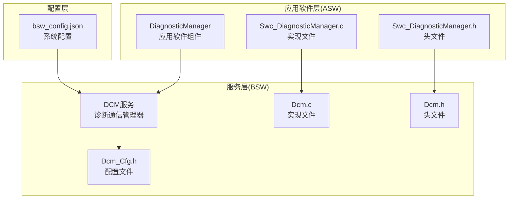
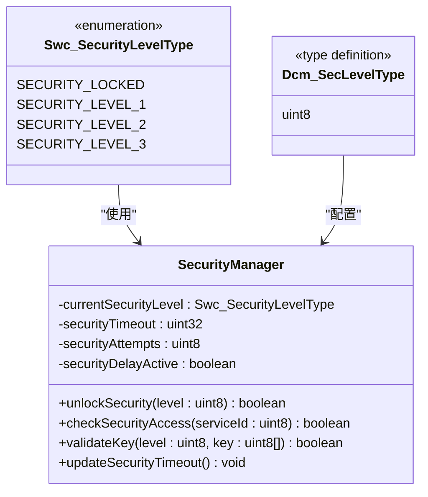
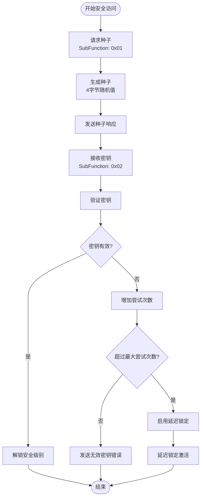
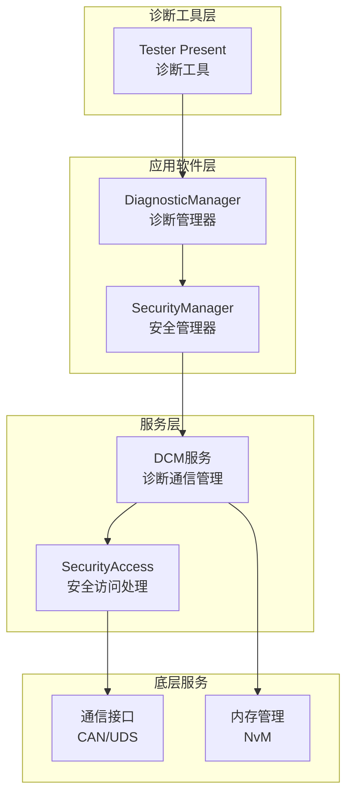
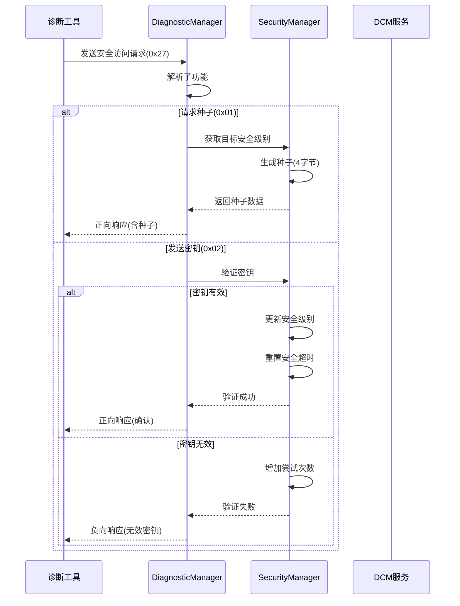
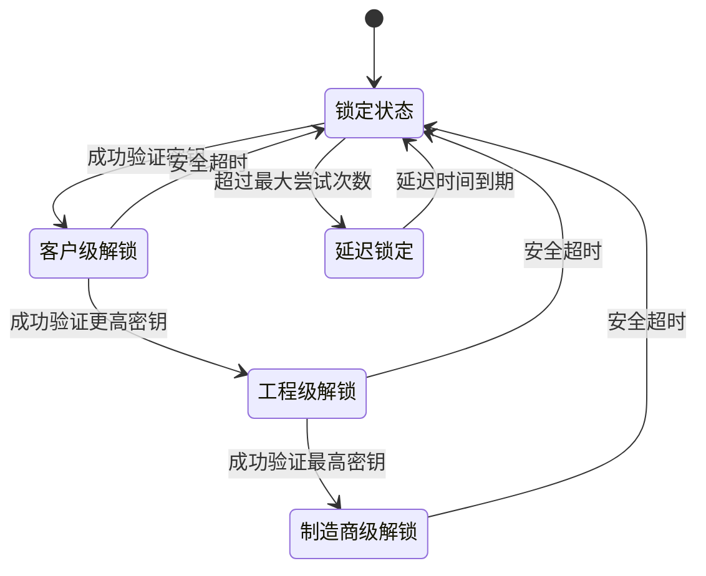
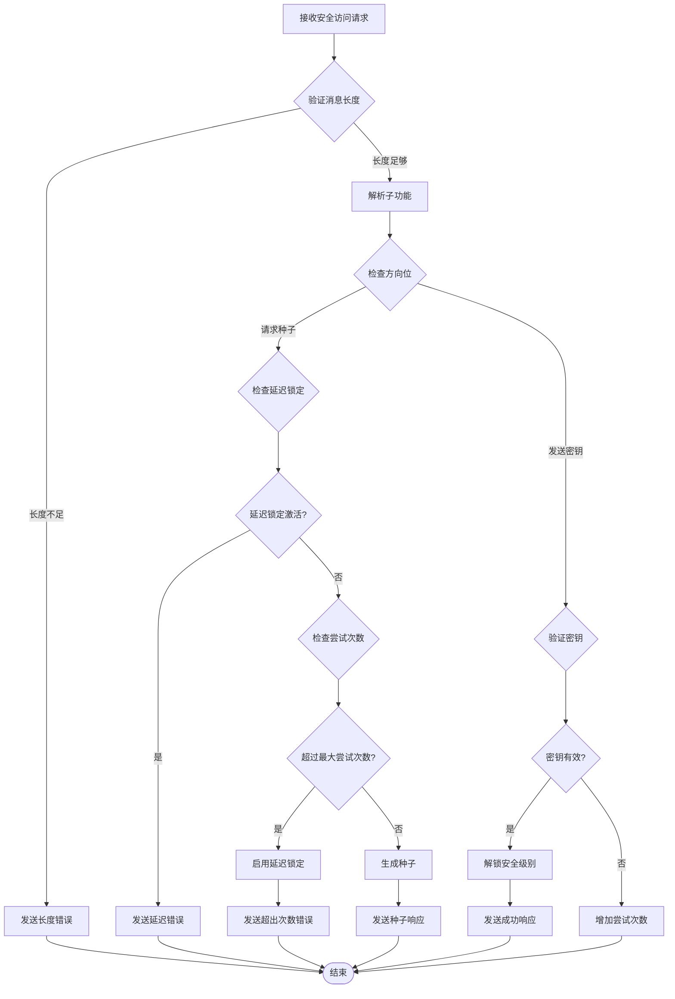
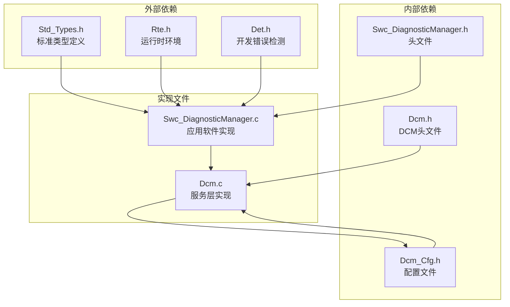

# 安全访问服务

<cite>
**本文档引用的文件**
- [Swc_DiagnosticManager.c](file://src/asw/diagnostic_manager/src/Swc_DiagnosticManager.c)
- [Swc_DiagnosticManager.h](file://src/asw/diagnostic_manager/include/Swc_DiagnosticManager.h)
- [Dcm.c](file://src/bsw/services/dcm/src/Dcm.c)
- [Dcm.h](file://src/bsw/services/dcm/include/Dcm.h)
- [Dcm_Cfg.h](file://src/bsw/services/dcm/include/Dcm_Cfg.h)
- [bsw_config.json](file://config/bsw_config.json)
- [modules.md](file://docs/modules.md)
</cite>

## 目录
1. [简介](#简介)
2. [项目结构](#项目结构)
3. [核心组件](#核心组件)
4. [架构概览](#架构概览)
5. [详细组件分析](#详细组件分析)
6. [依赖关系分析](#依赖关系分析)
7. [性能考虑](#性能考虑)
8. [故障排除指南](#故障排除指南)
9. [结论](#结论)

## 简介

安全访问服务(0x27)是汽车诊断通信管理系统中的关键安全机制，基于ISO 14229标准实现挑战-响应认证。该服务提供多级安全访问控制，支持种子密钥算法和挑战响应机制，确保只有授权的诊断工具才能访问受限的诊断功能。

本服务实现了完整的安全访问流程，包括：
- 多安全等级管理(锁定、客户级、工程级、制造商级)
- 种子密钥算法生成和验证
- 挑战响应机制
- 访问权限控制
- 尝试次数限制和锁定机制
- 安全状态管理和超时控制

## 项目结构

安全访问服务在YuleASR项目中采用分层架构设计，分为应用软件层(ASW)和服务层(BSW)两个主要部分：

**图表来源**
- [Swc_DiagnosticManager.c:1-50](file://src/asw/diagnostic_manager/src/Swc_DiagnosticManager.c#L1-L50)
- [Dcm.c:1-50](file://src/bsw/services/dcm/src/Dcm.c#L1-L50)
- [Dcm.h:1-50](file://src/bsw/services/dcm/include/Dcm.h#L1-L50)

**章节来源**
- [modules.md:450-460](file://docs/modules.md#L450-L460)

## 核心组件

### 安全等级管理

系统支持四级安全等级，从最低的锁定状态到最高的制造商级访问权限：

**图表来源**
- [Swc_DiagnosticManager.h:35-43](file://src/asw/diagnostic_manager/include/Swc_DiagnosticManager.h#L35-L43)
- [Dcm.h:141-144](file://src/bsw/services/dcm/include/Dcm.h#L141-L144)

### 种子密钥算法

种子密钥算法采用简单的固定密钥方案，实际部署中应使用更强的加密算法：

**图表来源**
- [Swc_DiagnosticManager.c:206-259](file://src/asw/diagnostic_manager/src/Swc_DiagnosticManager.c#L206-L259)
- [Dcm.c:329-413](file://src/bsw/services/dcm/src/Dcm.c#L329-L413)

**章节来源**
- [Swc_DiagnosticManager.c:84-86](file://src/asw/diagnostic_manager/src/Swc_DiagnosticManager.c#L84-L86)
- [Dcm_Cfg.h:118-124](file://src/bsw/services/dcm/include/Dcm_Cfg.h#L118-L124)

## 架构概览

安全访问服务在整个诊断通信架构中扮演着关键的安全中介角色：

**图表来源**
- [Swc_DiagnosticManager.c:1-50](file://src/asw/diagnostic_manager/src/Swc_DiagnosticManager.c#L1-L50)
- [Dcm.c:1-50](file://src/bsw/services/dcm/src/Dcm.c#L1-L50)

## 详细组件分析

### 应用软件组件实现

应用软件层的DiagnosticManager组件提供了完整的安全访问服务实现：

#### 安全访问请求处理流程

**图表来源**
- [Swc_DiagnosticManager.c:206-259](file://src/asw/diagnostic_manager/src/Swc_DiagnosticManager.c#L206-L259)
- [Swc_DiagnosticManager.c:366-389](file://src/asw/diagnostic_manager/src/Swc_DiagnosticManager.c#L366-L389)

#### 安全状态管理机制

**图表来源**
- [Swc_DiagnosticManager.c:117-139](file://src/asw/diagnostic_manager/src/Swc_DiagnosticManager.c#L117-L139)
- [Dcm.c:342-413](file://src/bsw/services/dcm/src/Dcm.c#L342-L413)

**章节来源**
- [Swc_DiagnosticManager.c:206-259](file://src/asw/diagnostic_manager/src/Swc_DiagnosticManager.c#L206-L259)
- [Swc_DiagnosticManager.c:366-389](file://src/asw/diagnostic_manager/src/Swc_DiagnosticManager.c#L366-L389)

### 服务层实现

BSW层的DCM服务提供了标准化的安全访问处理接口：

#### 安全访问服务配置

| 配置参数 | 值 | 描述 |
|---------|----|------|
| DCM_SEED_SIZE | 4 | 种子数据长度(字节) |
| DCM_KEY_SIZE | 4 | 密钥数据长度(字节) |
| DCM_MAX_SECURITY_ATTEMPTS | 3 | 最大尝试次数 |
| DCM_SECURITY_DELAY_TIME_MS | 10000 | 延迟锁定时间(ms) |
| DCM_NUM_SECURITY_LEVELS | 3 | 安全级别数量 |

#### 安全访问验证流程

**图表来源**
- [Dcm.c:329-413](file://src/bsw/services/dcm/src/Dcm.c#L329-L413)
- [Dcm_Cfg.h:118-124](file://src/bsw/services/dcm/include/Dcm_Cfg.h#L118-L124)

**章节来源**
- [Dcm.c:329-413](file://src/bsw/services/dcm/src/Dcm.c#L329-L413)
- [Dcm_Cfg.h:118-124](file://src/bsw/services/dcm/include/Dcm_Cfg.h#L118-L124)

### 访问权限控制

系统实现了基于服务ID的细粒度访问控制：

| 服务ID | 需要安全级别 | 功能描述 |
|--------|-------------|----------|
| 0x22 - 读取数据 | 安全级别1+ | 读取DID数据 |
| 0x2E - 写入数据 | 安全级别1+ | 写入DID数据 |
| 0x14 - 清除DTC | 安全级别1+ | 清除故障码 |
| 0x19 - 读取DTC | 安全级别1+ | 读取故障码信息 |
| 0x85 - 控制DTC设置 | 安全级别1+ | 控制DTC设置 |
| 0x11 - ECU复位 | 安全级别2+ | ECU硬件复位 |
| 0x28 - 通信控制 | 安全级别2+ | 诊断通信控制 |
| 0x31 - 例程控制 | 安全级别2+ | 例程功能控制 |
| 0x27 - 安全访问 | 任意级别 | 安全访问服务本身 |

**章节来源**
- [Swc_DiagnosticManager.c:394-409](file://src/asw/diagnostic_manager/src/Swc_DiagnosticManager.c#L394-L409)

## 依赖关系分析

安全访问服务涉及多个层次的依赖关系：

**图表来源**
- [Swc_DiagnosticManager.c:14-18](file://src/asw/diagnostic_manager/src/Swc_DiagnosticManager.c#L14-L18)
- [Dcm.c:18-22](file://src/bsw/services/dcm/src/Dcm.c#L18-L22)

**章节来源**
- [Swc_DiagnosticManager.c:14-18](file://src/asw/diagnostic_manager/src/Swc_DiagnosticManager.c#L14-L18)
- [Dcm.c:18-22](file://src/bsw/services/dcm/src/Dcm.c#L18-L22)

## 性能考虑

### 时间复杂度分析

安全访问服务的时间复杂度主要取决于以下操作：

1. **密钥验证**: O(n)，其中n为密钥长度(固定为4字节)
2. **安全级别检查**: O(1)，常数时间操作
3. **超时检查**: O(1)，定时器比较操作
4. **尝试次数管理**: O(1)，简单计数操作

### 内存使用优化

- 固定大小缓冲区(256字节)用于请求和响应处理
- 静态分配的安全密钥数组
- 最小化的状态变量存储
- 避免动态内存分配以提高实时性能

### 并发安全性

- 使用原子操作保护共享状态
- 避免长时间持有锁
- 定期超时检查防止死锁
- 中断安全的计数器操作

## 故障排除指南

### 常见问题及解决方案

#### 安全访问失败

**症状**: 诊断工具收到"无效密钥"或"超出尝试次数"错误

**可能原因**:
1. 密钥计算错误
2. 安全级别不匹配
3. 超时导致的安全状态重置
4. 配置参数不正确

**解决步骤**:
1. 验证安全级别配置
2. 检查密钥生成算法
3. 确认超时参数设置
4. 查看错误日志

#### 延迟锁定问题

**症状**: 系统进入延迟锁定状态无法进行安全访问

**诊断方法**:
1. 检查安全尝试计数器
2. 验证延迟定时器状态
3. 确认延迟时间配置

**恢复操作**:
等待延迟时间到期自动恢复，或手动重置安全状态

#### 超时相关问题

**症状**: 安全级别自动降级或访问被拒绝

**排查要点**:
1. 检查Tester Present消息频率
2. 验证安全超时参数设置
3. 确认系统时钟准确性

**章节来源**
- [Swc_DiagnosticManager.c:117-139](file://src/asw/diagnostic_manager/src/Swc_DiagnosticManager.c#L117-L139)
- [Dcm.c:342-413](file://src/bsw/services/dcm/src/Dcm.c#L342-L413)

## 结论

安全访问服务(0x27)为YuleASR诊断通信系统提供了完整的安全基础设施。通过多级安全管理和挑战-响应机制，系统能够有效保护敏感的诊断功能免受未授权访问。

### 主要优势

1. **多层次安全控制**: 支持从基本访问到制造商级别的多级安全
2. **标准化协议**: 完全符合ISO 14229标准
3. **灵活配置**: 支持自定义安全参数和策略
4. **实时性能**: 优化的算法和数据结构确保实时响应
5. **错误处理**: 完善的错误检测和恢复机制

### 安全最佳实践

1. **密钥管理**: 在生产环境中使用强加密算法生成随机密钥
2. **超时配置**: 根据应用场景合理设置超时参数
3. **日志记录**: 启用详细的审计日志跟踪安全事件
4. **定期更新**: 定期更换安全密钥和参数配置
5. **访问控制**: 实施最小权限原则和职责分离

该安全访问服务为汽车电子系统的诊断通信提供了坚实的安全基础，支持各种复杂的诊断场景和安全需求。