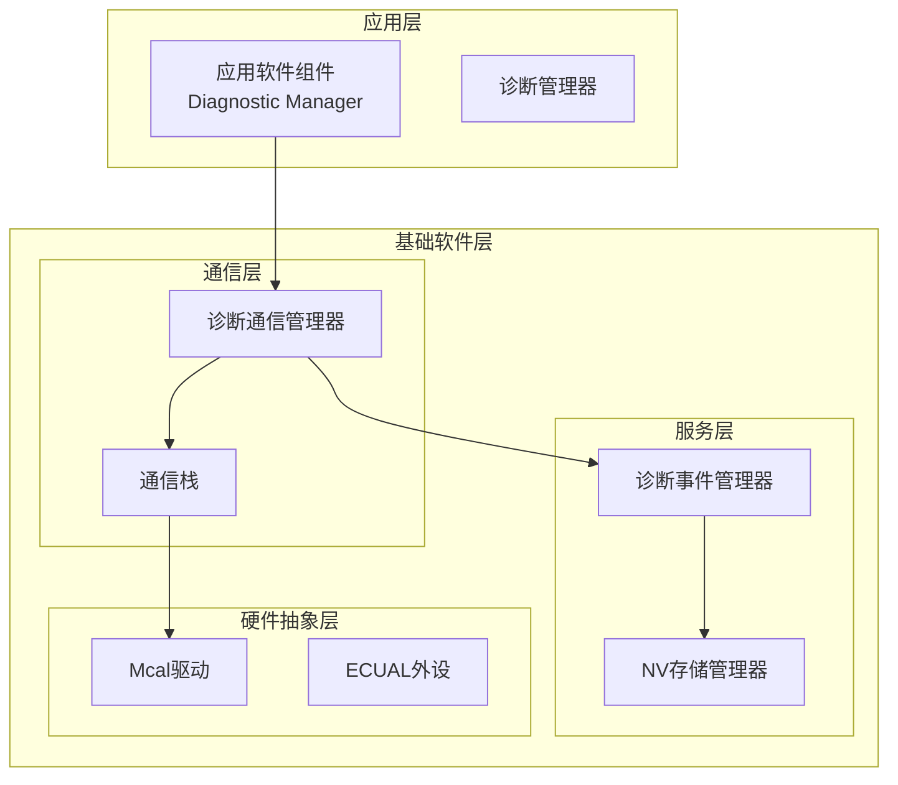
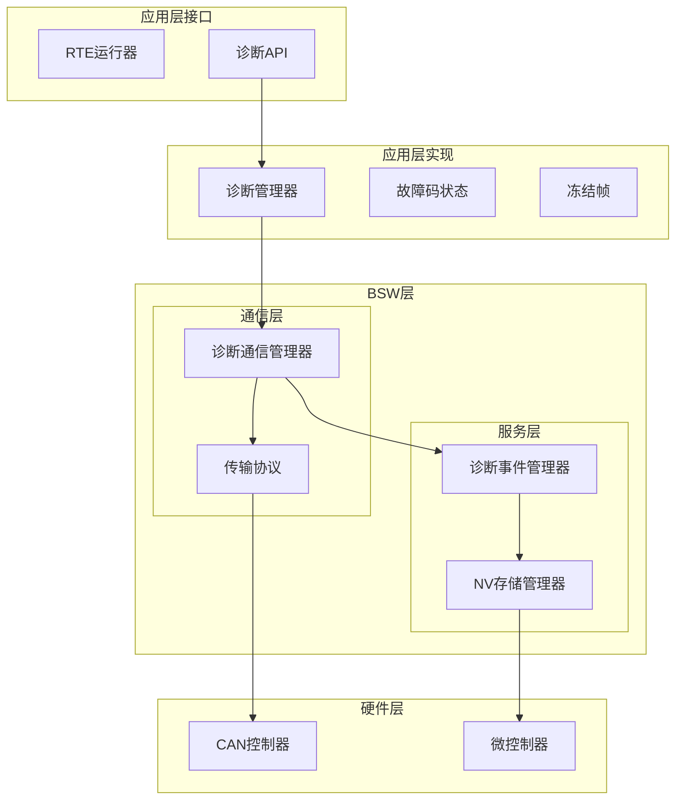
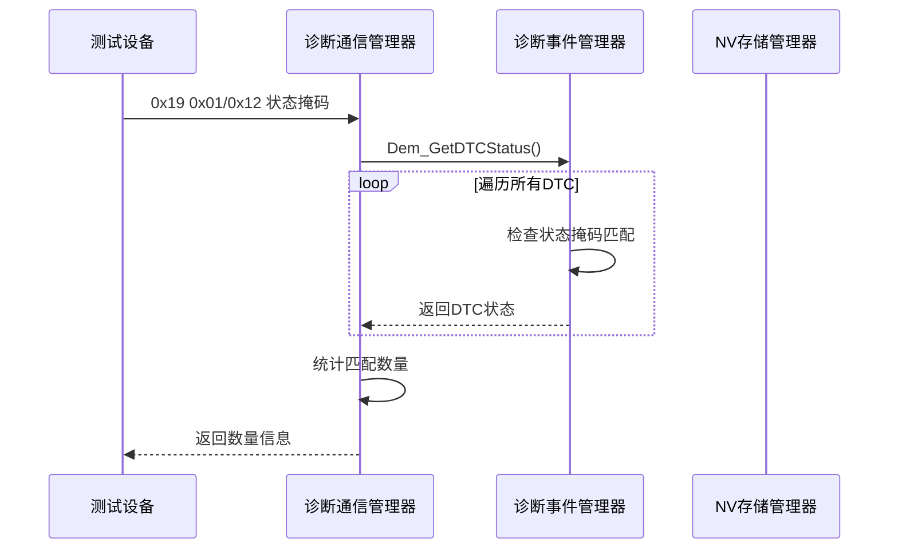
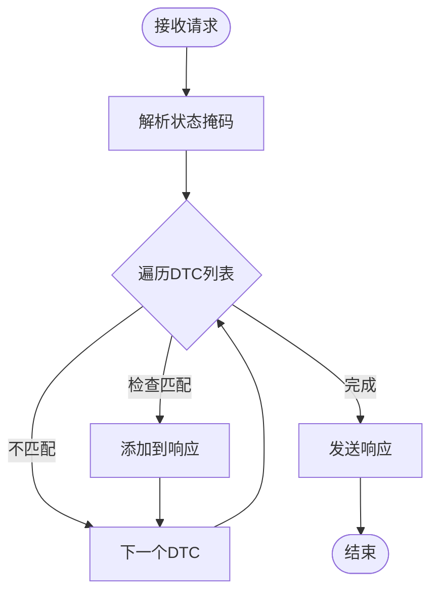
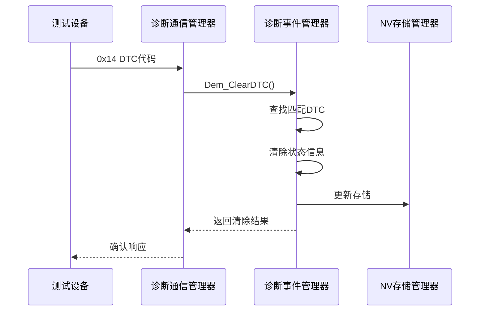
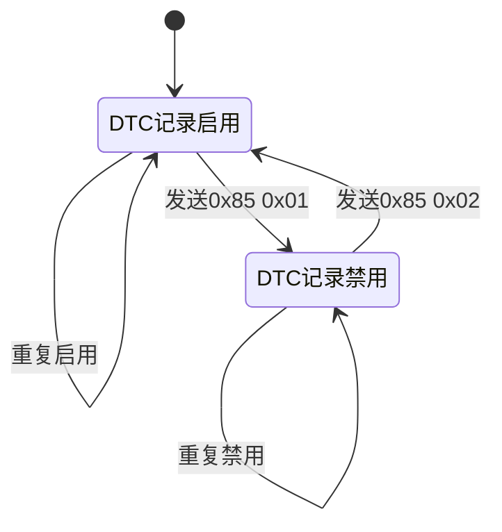
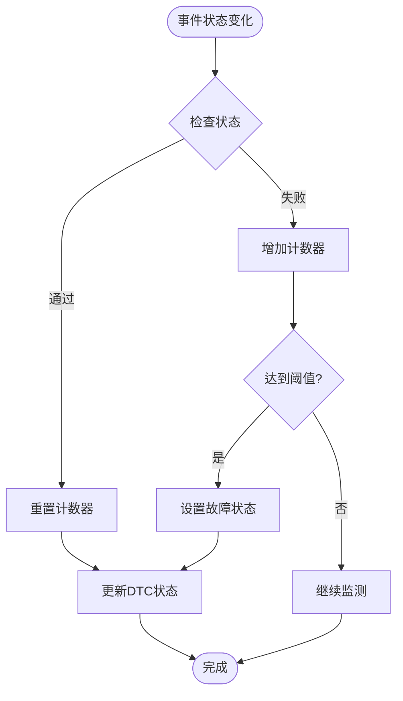
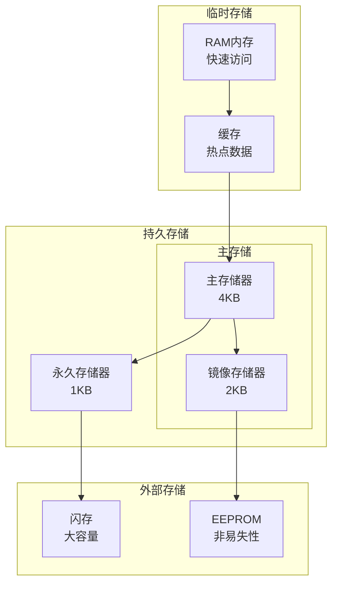
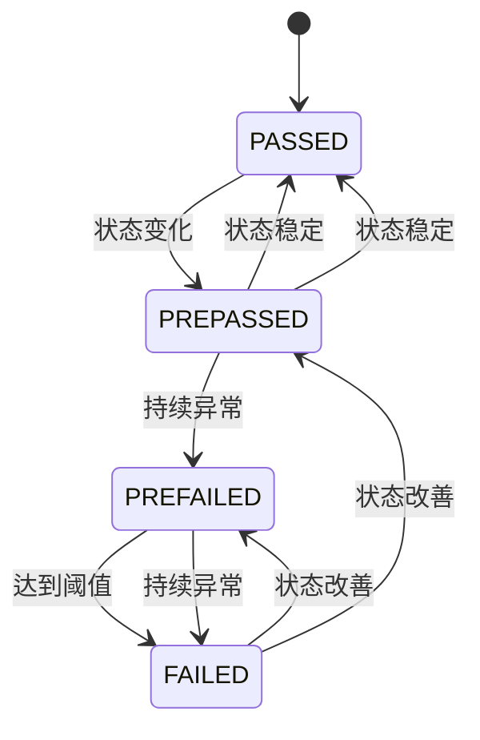
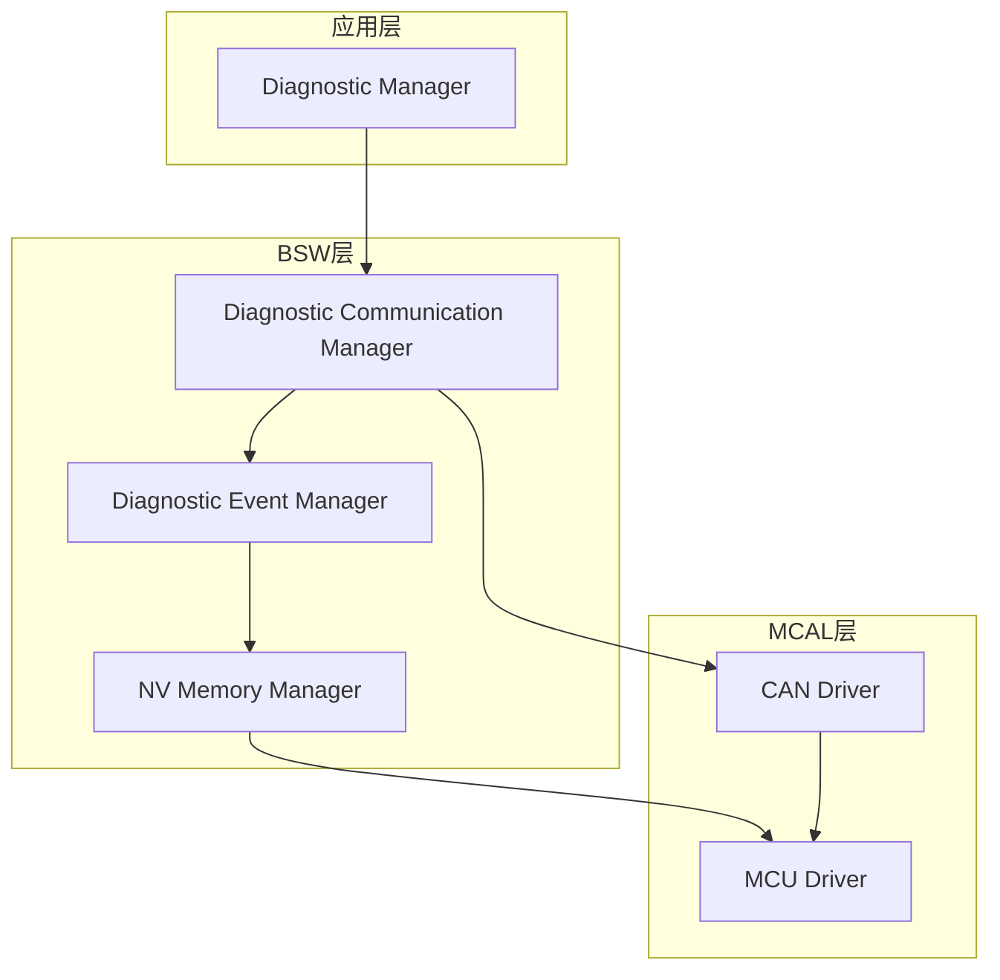

# 故障码管理服务

<cite>
**本文档引用的文件**
- [Swc_DiagnosticManager.h](file://src/asw/diagnostic_manager/include/Swc_DiagnosticManager.h)
- [Swc_DiagnosticManager.c](file://src/asw/diagnostic_manager/src/Swc_DiagnosticManager.c)
- [Dem.h](file://src/bsw/services/dem/include/Dem.h)
- [Dem.c](file://src/bsw/services/dem/src/Dem.c)
- [Dem_Cfg.h](file://src/bsw/services/dem/include/Dem_Cfg.h)
- [Dcm.h](file://src/bsw/services/dcm/include/Dcm.h)
- [Dcm.c](file://src/bsw/services/dcm/src/Dcm.c)
- [Dcm_Cfg.h](file://src/bsw/services/dcm/include/Dcm_Cfg.h)
- [NvM_Cfg.h](file://src/bsw/config/templates/NvM_Cfg.h)
</cite>

## 目录
1. [简介](#简介)
2. [项目结构](#项目结构)
3. [核心组件](#核心组件)
4. [架构概览](#架构概览)
5. [详细组件分析](#详细组件分析)
6. [依赖关系分析](#依赖关系分析)
7. [性能考虑](#性能考虑)
8. [故障排除指南](#故障排除指南)
9. [结论](#结论)

## 简介

故障码管理服务是车辆诊断系统中的关键组件，负责处理ISO 14229 UDS协议中的故障码相关服务。本服务实现了三个核心功能：读取故障码信息(0x19)、清除故障码(0x14)和控制DTC设置(0x85)，并提供完整的故障码状态管理、冻结帧数据处理和扩展数据收集功能。

该系统采用AutoSAR架构设计，分为应用层软件组件(Diagnostic Manager)和基础软件层服务(Diagnostic Event Manager、Diagnostic Communication Manager)，通过标准接口实现松耦合集成。

## 项目结构

项目采用分层架构设计，主要包含以下层次：

**图表来源**
- [Swc_DiagnosticManager.c:1-686](file://src/asw/diagnostic_manager/src/Swc_DiagnosticManager.c#L1-L686)
- [Dcm.c:1-1455](file://src/bsw/services/dcm/src/Dcm.c#L1-L1455)
- [Dem.c:1-1145](file://src/bsw/services/dem/src/Dem.c#L1-L1145)

**章节来源**
- [Swc_DiagnosticManager.h:1-211](file://src/asw/diagnostic_manager/include/Swc_DiagnosticManager.h#L1-L211)
- [Dcm.h:1-379](file://src/bsw/services/dcm/include/Dcm.h#L1-L379)
- [Dem.h:1-541](file://src/bsw/services/dem/include/Dem.h#L1-L541)

## 核心组件

### 应用层诊断管理器

应用层诊断管理器作为AutoSAR应用软件组件，提供以下核心功能：

- **会话管理**：支持默认、编程、扩展诊断会话模式
- **安全访问控制**：实现多级别安全访问机制
- **诊断请求处理**：统一处理各种诊断服务请求
- **状态监控**：实时监控诊断系统状态

### 基础软件层诊断事件管理器

基础软件层诊断事件管理器负责底层的故障码管理：

- **事件状态跟踪**：监控各个诊断事件的状态变化
- **故障检测计数器**：维护故障检测和确认计数
- **老化处理**：自动处理长时间未出现的故障码
- **存储管理**：与NV存储模块集成进行持久化存储

### 诊断通信管理器

诊断通信管理器实现ISO 14229 UDS协议规范：

- **协议解析**：解析和验证诊断服务请求
- **响应生成**：生成符合标准的诊断响应
- **超时管理**：处理P2和S3服务器定时器
- **缓冲区管理**：管理请求和响应缓冲区

**章节来源**
- [Swc_DiagnosticManager.c:418-686](file://src/asw/diagnostic_manager/src/Swc_DiagnosticManager.c#L418-L686)
- [Dem.c:390-471](file://src/bsw/services/dem/src/Dem.c#L390-L471)
- [Dcm.c:1120-1163](file://src/bsw/services/dcm/src/Dcm.c#L1120-L1163)

## 架构概览

系统采用分层架构，各层职责明确：

**图表来源**
- [Swc_DiagnosticManager.c:471-531](file://src/asw/diagnostic_manager/src/Swc_DiagnosticManager.c#L471-L531)
- [Dcm.c:1046-1111](file://src/bsw/services/dcm/src/Dcm.c#L1046-L1111)
- [Dem.c:937-940](file://src/bsw/services/dem/src/Dem.c#L937-L940)

## 详细组件分析

### 读取故障码信息服务(0x19)

读取故障码信息服务实现多种子功能：

#### 报告DTC数量服务(0x01/0x12)
该服务根据状态掩码统计匹配的故障码数量：

**图表来源**
- [Dcm.c:613-648](file://src/bsw/services/dcm/src/Dcm.c#L613-L648)
- [Dem.c:723-753](file://src/bsw/services/dem/src/Dem.c#L723-L753)

#### 报告DTC列表服务(0x02/0x13)
该服务返回匹配状态掩码的所有故障码详细信息：

**图表来源**
- [Dcm.c:650-689](file://src/bsw/services/dcm/src/Dcm.c#L650-L689)
- [Dem.c:723-753](file://src/bsw/services/dem/src/Dem.c#L723-L753)

#### 报告DTC扩展数据服务(0x06)
该服务提供故障码的扩展数据信息：

**章节来源**
- [Dcm.c:691-712](file://src/bsw/services/dcm/src/Dcm.c#L691-L712)
- [Dem.c:1084-1116](file://src/bsw/services/dem/src/Dem.c#L1084-L1116)

### 清除故障码服务(0x14)

清除故障码服务提供灵活的故障码清理功能：

#### 单个故障码清除
当指定具体DTC代码时，系统执行精确清除：

**图表来源**
- [Dcm.c:768-786](file://src/bsw/services/dcm/src/Dcm.c#L768-L786)
- [Dem.c:758-805](file://src/bsw/services/dem/src/Dem.c#L758-L805)

#### 全部故障码清除
当使用特殊代码(0xFFFFFF)时，系统清除所有故障码：

**章节来源**
- [Swc_DiagnosticManager.c:639-669](file://src/asw/diagnostic_manager/src/Swc_DiagnosticManager.c#L639-L669)

### 控制DTC设置服务(0x85)

控制DTC设置服务允许动态启用或禁用故障码记录：

#### 启用DTC设置

**图表来源**
- [Dem.c:1044-1079](file://src/bsw/services/dem/src/Dem.c#L1044-L1079)

#### 设置控制参数
服务支持以下控制参数：
- **组标识符**：指定要控制的DTC组
- **DTC类型**：控制特定类型的DTC记录
- **操作类型**：启用或禁用DTC记录更新

**章节来源**
- [Swc_DiagnosticManager.c:394-409](file://src/asw/diagnostic_manager/src/Swc_DiagnosticManager.c#L394-L409)

### 故障码状态管理

系统实现完整的故障码状态管理机制：

#### 状态字节定义
| 位 | 名称 | 描述 |
|---|---|---|
| 0 | TF | 测试失败 |
| 1 | TFTOC | 本次运行周期测试失败 |
| 2 | PDTC | 待确认DTC |
| 3 | CDTC | 已确认DTC |
| 4 | TNCSLC | 自上次清除以来未完成测试 |
| 5 | TFSLC | 自上次清除以来测试失败 |
| 6 | TNCTOC | 本次运行周期未完成测试 |
| 7 | WIR | 请求警告指示灯 |

#### 故障检测算法
系统采用基于计数器的故障检测机制：

**图表来源**
- [Dem.c:198-248](file://src/bsw/services/dem/src/Dem.c#L198-L248)
- [Dem.c:278-348](file://src/bsw/services/dem/src/Dem.c#L278-L348)

**章节来源**
- [Dem.h:114-138](file://src/bsw/services/dem/include/Dem.h#L114-L138)
- [Dem.c:278-348](file://src/bsw/services/dem/src/Dem.c#L278-L348)

### 冻结帧数据处理

冻结帧数据捕获和存储机制：

#### 冻结帧结构
冻结帧包含故障发生时刻的关键数据：

| 字段 | 大小(bytes) | 描述 |
|---|---|---|
| 记录号 | 1 | 冻结帧编号 |
| 数据项数量 | 1 | 包含的数据项数量 |
| DID列表 | N*2 | 数据标识符列表 |
| 数据内容 | M | 实际冻结数据 |

#### 数据捕获时机
冻结帧在以下情况下自动捕获：
- DTC首次变为已确认状态
- 手动预存储请求
- 特定诊断事件触发

**章节来源**
- [Dem.c:256-276](file://src/bsw/services/dem/src/Dem.c#L256-L276)
- [Dem.c:970-1002](file://src/bsw/services/dem/src/Dem.c#L970-L1002)

### 扩展数据收集

扩展数据记录机制：

#### 扩展数据记录类型
| 记录类型 | 描述 | 最大大小 |
|---|---|---|
| 0x01 | 故障发生时的传感器数据 | 128字节 |
| 0x02 | 故障发生时的系统状态 | 128字节 |
| 0x03 | 故障发生时的环境条件 | 128字节 |
| 0x04 | 故障发生时的操作参数 | 128字节 |

#### 数据收集策略
- **实时收集**：故障发生时立即捕获
- **批量存储**：定期整理和优化存储空间
- **优先级管理**：重要数据优先存储

**章节来源**
- [Dem.h:275-279](file://src/bsw/services/dem/include/Dem.h#L275-L279)
- [Dem.c:1084-1116](file://src/bsw/services/dem/src/Dem.c#L1084-L1116)

### DTC配置参数

系统支持丰富的配置参数：

#### 基本配置
| 参数 | 默认值 | 描述 |
|---|---|---|
| 事件数量 | 128 | 支持的最大诊断事件数 |
| DTC数量 | 64 | 支持的最大故障码数量 |
| 冻结帧记录数 | 8 | 可存储的冻结帧数量 |
| 扩展数据记录数 | 4 | 可存储的扩展数据记录数 |

#### 性能配置
| 参数 | 默认值 | 描述 |
|---|---|---|
| 老化阈值 | 40 | 运行周期老化阈值 |
| 最大存储大小 | 4KB | 主存储器大小 |
| 镜像存储大小 | 2KB | 镜像存储器大小 |
| 永久存储大小 | 1KB | 永久存储器大小 |

#### 安全配置
| 参数 | 默认值 | 描述 |
|---|---|---|
| 安全级别 | 3级 | 支持的安全级别数 |
| 最大尝试次数 | 3次 | 安全访问最大尝试次数 |
| 延迟时间 | 10秒 | 安全访问延迟时间 |

**章节来源**
- [Dem_Cfg.h:26-100](file://src/bsw/services/dem/include/Dem_Cfg.h#L26-L100)
- [Dcm_Cfg.h:15-124](file://src/bsw/services/dcm/include/Dcm_Cfg.h#L15-L124)

### 存储机制

系统采用多层存储架构：

**图表来源**
- [Dem_Cfg.h:140-142](file://src/bsw/services/dem/include/Dem_Cfg.h#L140-L142)
- [NvM_Cfg.h:36-52](file://src/bsw/config/templates/NvM_Cfg.h#L36-L52)

### 诊断事件记录

诊断事件记录系统：

#### 事件状态类型
| 状态 | 描述 | 用途 |
|---|---|---|
| PASSED | 通过 | 正常状态 |
| FAILED | 失败 | 故障状态 |
| PREPASSED | 预通过 | 临时状态 |
| PREFAILED | 预失败 | 临时状态 |
| FDC_THRESHOLD | 故障检测阈值 | 状态转换 |

#### 事件处理流程

**图表来源**
- [Dem.h:104-110](file://src/bsw/services/dem/include/Dem.h#L104-L110)
- [Dem.c:496-535](file://src/bsw/services/dem/src/Dem.c#L496-L535)

### 故障码分类规则

系统实现基于优先级的故障码分类：

#### 优先级等级
| 等级 | 数值范围 | 描述 |
|---|---|---|
| 低优先级 | 1-85 | 一般性故障，不影响车辆运行 |
| 中优先级 | 86-170 | 重要故障，建议尽快维修 |
| 高优先级 | 171-255 | 严重故障，应立即停机维修 |

#### 分类算法
故障码优先级根据以下因素确定：
- **故障影响程度**：对车辆安全性的影响
- **修复难度**：维修复杂度和成本
- **发生频率**：故障重复发生的概率
- **检测可靠性**：故障检测的准确性

### 诊断报告生成

系统自动生成详细的诊断报告：

#### 报告内容
- **故障码列表**：当前所有激活的故障码
- **状态信息**：每个故障码的详细状态
- **历史记录**：故障码的历史信息和趋势
- **建议措施**：针对故障的维修建议

#### 报告格式
系统支持多种报告格式：
- **文本格式**：人类可读的诊断报告
- **JSON格式**：机器可读的数据格式
- **CSV格式**：表格数据格式

**章节来源**
- [Swc_DiagnosticManager.c:264-316](file://src/asw/diagnostic_manager/src/Swc_DiagnosticManager.c#L264-L316)
- [Dem.c:937-940](file://src/bsw/services/dem/src/Dem.c#L937-L940)

## 依赖关系分析

系统组件间的依赖关系：

**图表来源**
- [Swc_DiagnosticManager.c:15-18](file://src/asw/diagnostic_manager/src/Swc_DiagnosticManager.c#L15-L18)
- [Dcm.c:21-25](file://src/bsw/services/dcm/src/Dcm.c#L21-L25)
- [Dem.c:21-24](file://src/bsw/services/dem/src/Dem.c#L21-L24)

**章节来源**
- [Swc_DiagnosticManager.h:18-20](file://src/asw/diagnostic_manager/include/Swc_DiagnosticManager.h#L18-L20)
- [Dcm.h:20-22](file://src/bsw/services/dcm/include/Dcm.h#L20-L22)
- [Dem.h:20-21](file://src/bsw/services/dem/include/Dem.h#L20-L21)

## 性能考虑

### 内存使用优化
- **静态分配**：关键数据结构采用静态内存分配
- **内存池管理**：使用内存池减少碎片化
- **数据压缩**：对存储的数据进行压缩处理

### 处理效率优化
- **中断处理**：关键操作使用中断处理提高响应速度
- **批处理**：批量处理多个诊断请求
- **缓存机制**：利用缓存减少重复计算

### 实时性保证
- **优先级调度**：基于优先级的任务调度
- **时间片轮转**：公平的时间片分配
- **硬实时约束**：满足严格的实时性要求

## 故障排除指南

### 常见问题及解决方案

#### 诊断服务无响应
**症状**：发送诊断请求后无任何响应
**可能原因**：
- 通信链路故障
- 会话模式不正确
- 安全访问未授权

**解决步骤**：
1. 检查CAN总线连接
2. 验证诊断会话设置
3. 执行安全访问流程

#### 故障码无法清除
**症状**：清除故障码请求成功但故障码仍然存在
**可能原因**：
- 故障条件仍然存在
- 存储器写入失败
- 系统保护机制

**解决步骤**：
1. 消除故障根本原因
2. 检查存储器状态
3. 重启诊断系统

#### 冻结帧数据缺失
**症状**：查询冻结帧数据返回空数据
**可能原因**：
- 冻结帧功能未启用
- 数据捕获时机不当
- 存储空间不足

**解决步骤**：
1. 启用冻结帧功能
2. 检查数据捕获条件
3. 清理存储空间

**章节来源**
- [Swc_DiagnosticManager.c:117-139](file://src/asw/diagnostic_manager/src/Swc_DiagnosticManager.c#L117-L139)
- [Dcm.c:1192-1245](file://src/bsw/services/dcm/src/Dcm.c#L1192-L1245)

## 结论

故障码管理服务提供了完整、可靠的诊断功能实现，具有以下特点：

### 技术优势
- **标准化实现**：完全符合ISO 14229 UDS协议标准
- **模块化设计**：清晰的分层架构便于维护和扩展
- **高性能实现**：优化的算法和数据结构确保实时性能
- **可靠性保障**：完善的错误处理和恢复机制

### 功能完整性
系统实现了所有核心诊断功能，包括故障码读取、清除和控制，以及高级功能如冻结帧数据处理和扩展数据收集。

### 应用价值
该服务为车辆诊断系统提供了坚实的基础，支持各种诊断场景，提高了车辆的可维护性和安全性。

通过合理的设计和实现，故障码管理服务能够满足现代汽车诊断系统的严格要求，为车辆制造商和维修服务商提供可靠的技术支持。