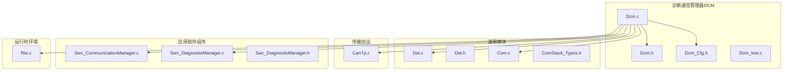
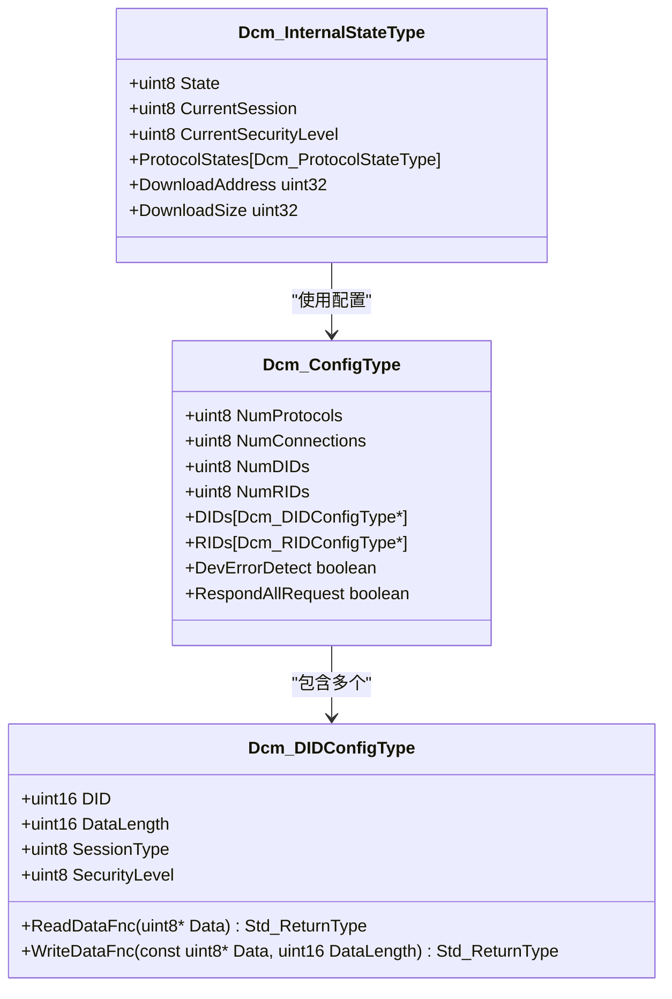
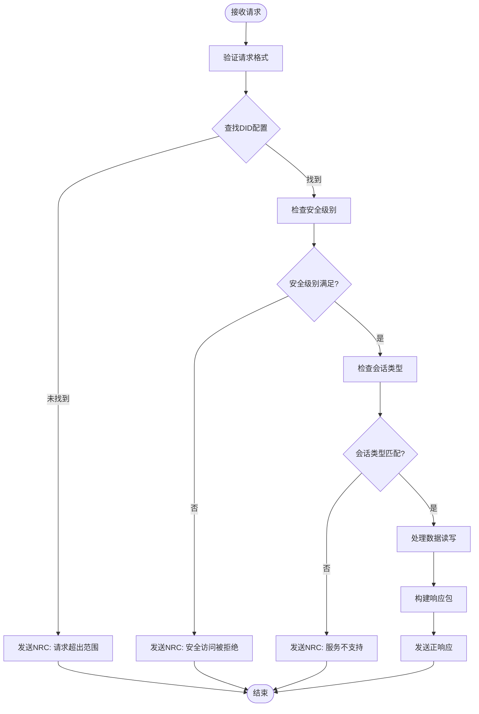
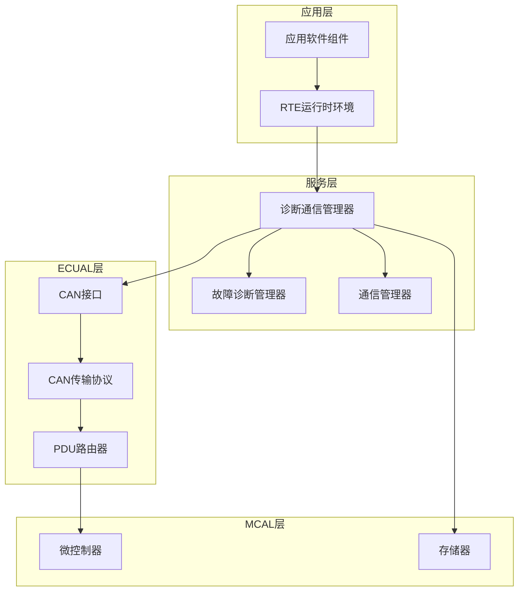
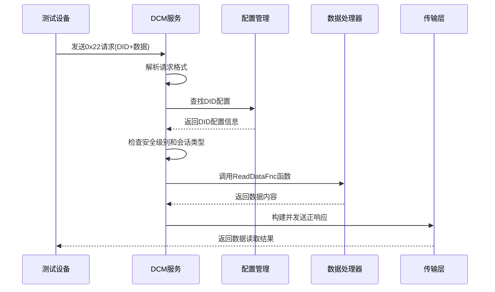
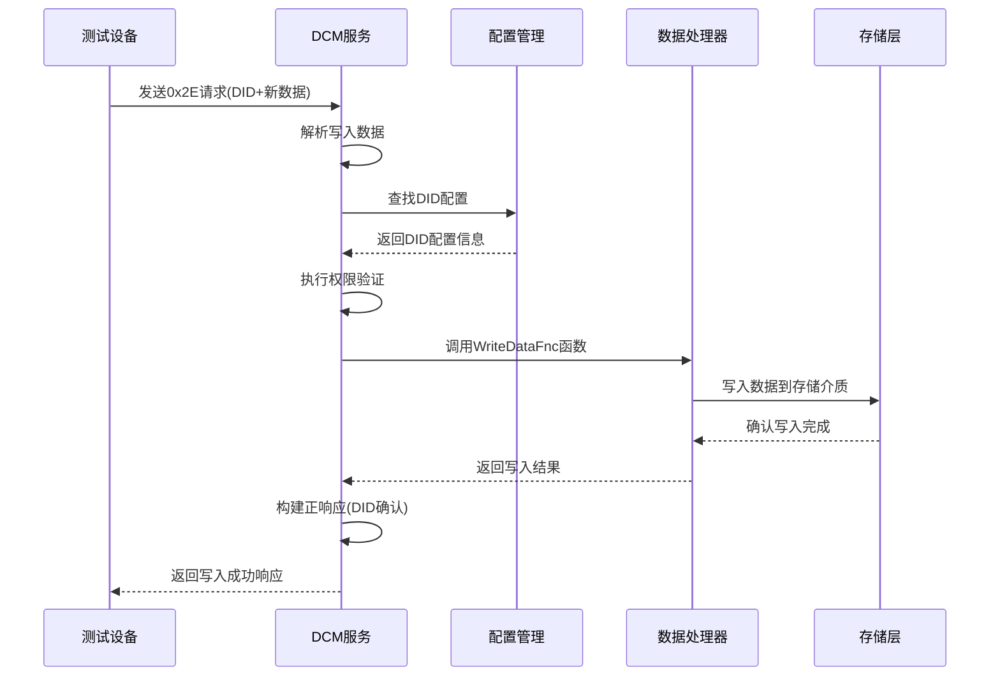
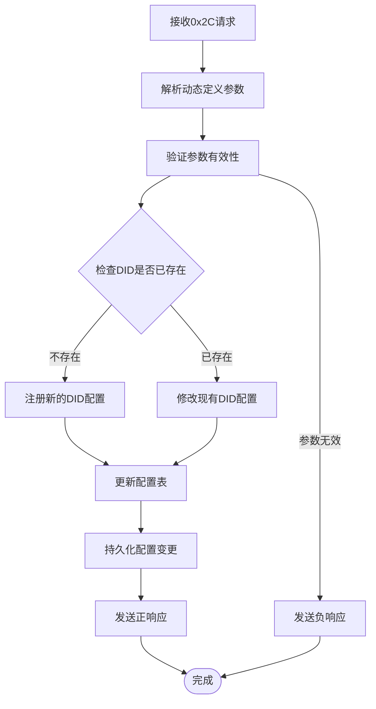
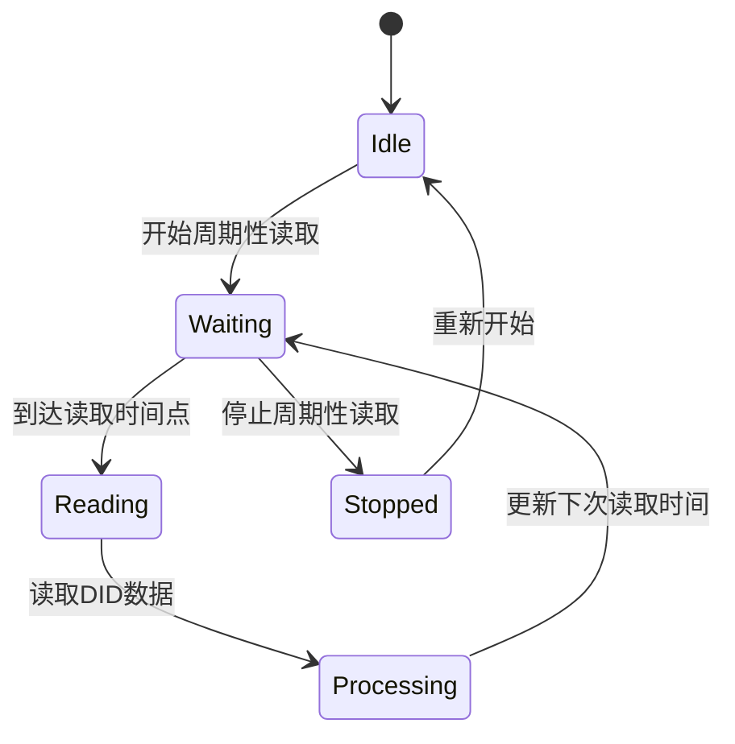
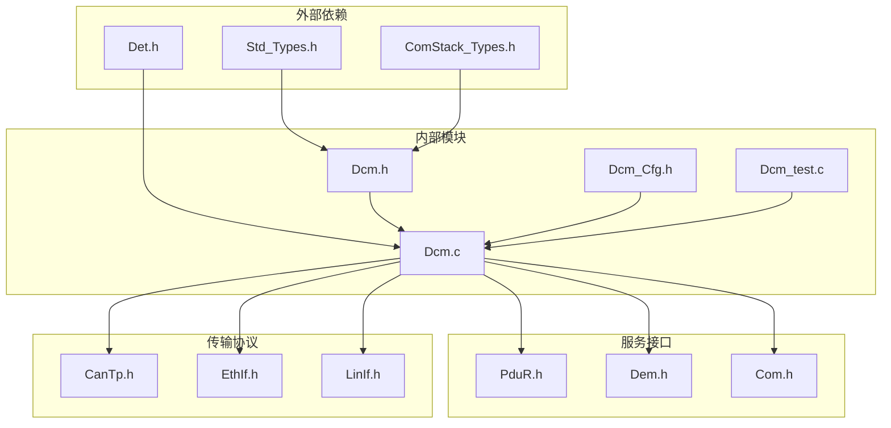
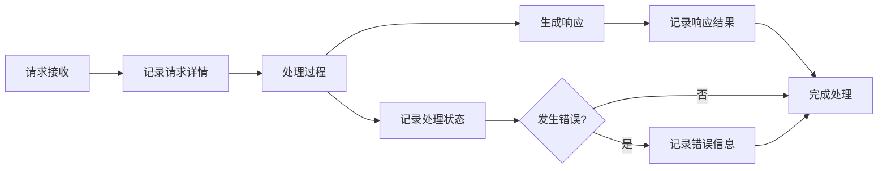

# 数据读写操作服务

<cite>
**本文档引用的文件**
- [Dcm.c](file://src/bsw/services/dcm/src/Dcm.c)
- [Dcm.h](file://src/bsw/services/dcm/include/Dcm.h)
- [Dcm_Cfg.h](file://src/bsw/services/dcm/include/Dcm_Cfg.h)
- [Dcm_test.c](file://src/bsw/services/dcm/src/Dcm_test.c)
- [Dcm_spec.md](file://openspec/changes/dev-dcm-dem-module/specs/Dcm_spec.md)
- [Det.c](file://src/bsw/services/det/src/Det.c)
- [Det.h](file://src/bsw/services/det/include/Det.h)
- [Com.c](file://src/bsw/services/com/src/Com.c)
- [ComStack_Types.h](file://src/bsw/ecual/include/ComStack_Types.h)
- [CanTp.c](file://src/bsw/ecual/cantp/src/CanTp.c)
- [Swc_CommunicationManager.c](file://src/asw/communication_manager/src/Swc_CommunicationManager.c)
- [Swc_DiagnosticManager.c](file://src/asw/diagnostic_manager/src/Swc_DiagnosticManager.c)
- [Swc_DiagnosticManager.h](file://src/asw/diagnostic_manager/include/Swc_DiagnosticManager.h)
- [Rte.c](file://src/bsw/rte/src/Rte.c)
</cite>

## 目录
1. [引言](#引言)
2. [项目结构](#项目结构)
3. [核心组件](#核心组件)
4. [架构概览](#架构概览)
5. [详细组件分析](#详细组件分析)
6. [依赖关系分析](#依赖关系分析)
7. [性能考虑](#性能考虑)
8. [故障排除指南](#故障排除指南)
9. [结论](#结论)

## 引言

本文件针对数据读写操作服务进行全面技术文档化，重点涵盖以下UDS服务的实现机制：

- **读取数据（0x22）**：通过数据标识符（DID）读取车辆系统中的数据
- **写入数据（0x2E）**：通过数据标识符对车辆系统进行数据写入
- **动态定义数据标识符（0x2C）**：在运行时动态注册或修改DID配置
- **周期性数据读取（0x2A）**：按设定周期定期读取指定DID的数据

文档将详细说明DID配置管理、数据长度处理和缓冲区管理策略，记录数据标识符的注册流程、访问权限控制和数据类型转换机制，并提供完整的错误处理、性能优化和调试方法。

## 项目结构

该数据读写操作服务位于AutoSAR基础软件层的服务层（Service Layer），具体分布在以下模块中：

**图表来源**
- [Dcm.c:1-1455](file://src/bsw/services/dcm/src/Dcm.c#L1-L1455)
- [Dcm.h:1-379](file://src/bsw/services/dcm/include/Dcm.h#L1-L379)
- [Dcm_Cfg.h:1-132](file://src/bsw/services/dcm/include/Dcm_Cfg.h#L1-L132)

**章节来源**
- [Dcm.c:1-1455](file://src/bsw/services/dcm/src/Dcm.c#L1-L1455)
- [Dcm.h:1-379](file://src/bsw/services/dcm/include/Dcm.h#L1-L379)
- [Dcm_Cfg.h:1-132](file://src/bsw/services/dcm/include/Dcm_Cfg.h#L1-L132)

## 核心组件

### 数据标识符（DID）配置模型

DID配置采用结构化设计，支持灵活的数据读写操作：

**图表来源**
- [Dcm.h:206-263](file://src/bsw/services/dcm/include/Dcm.h#L206-L263)
- [Dcm_spec.md:122-168](file://openspec/changes/dev-dcm-dem-module/specs/Dcm_spec.md#L122-L168)

### 缓冲区管理系统

系统采用双缓冲设计，确保数据读写的高效性和安全性：

**图表来源**
- [Dcm.c:458-524](file://src/bsw/services/dcm/src/Dcm.c#L458-L524)
- [Dcm.c:529-595](file://src/bsw/services/dcm/src/Dcm.c#L529-L595)

**章节来源**
- [Dcm.h:206-263](file://src/bsw/services/dcm/include/Dcm.h#L206-L263)
- [Dcm_Cfg.h:75-124](file://src/bsw/services/dcm/include/Dcm_Cfg.h#L75-L124)

## 架构概览

数据读写操作服务的整体架构采用分层设计，各组件职责明确：

**图表来源**
- [Dcm.c:1046-1111](file://src/bsw/services/dcm/src/Dcm.c#L1046-L1111)
- [Swc_DiagnosticManager.c:111-685](file://src/asw/diagnostic_manager/src/Swc_DiagnosticManager.c#L111-L685)

## 详细组件分析

### 读取数据服务（0x22）

读取数据服务实现了标准的UDS服务0x22，支持通过DID标识符获取车辆系统的实时数据。

#### 处理流程

**图表来源**
- [Dcm.c:458-524](file://src/bsw/services/dcm/src/Dcm.c#L458-L524)

#### 关键实现要点

1. **DID解析与验证**：
   - 从请求数据中提取2字节DID标识符
   - 使用大端序格式解析DID值
   - 通过Dcm_FindDID函数在配置表中查找对应项

2. **权限控制机制**：
   - 安全级别检查：当前安全级别必须≥DID配置的安全级别
   - 会话类型验证：DID配置的会话类型必须与当前会话匹配
   - 访问权限矩阵：基于DID配置的SessionType和SecurityLevel进行双重验证

3. **数据读取流程**：
   - 调用DID配置中的ReadDataFnc函数指针
   - 将读取到的数据放入响应缓冲区
   - 构建标准响应格式：SID+0x40 + DID + 数据内容

**章节来源**
- [Dcm.c:458-524](file://src/bsw/services/dcm/src/Dcm.c#L458-L524)
- [Dcm.h:206-215](file://src/bsw/services/dcm/include/Dcm.h#L206-L215)

### 写入数据服务（0x2E）

写入数据服务实现了标准的UDS服务0x2E，允许通过DID标识符向车辆系统写入数据。

#### 处理流程

**图表来源**
- [Dcm.c:529-595](file://src/bsw/services/dcm/src/Dcm.c#L529-L595)

#### 关键实现要点

1. **数据验证与转换**：
   - 验证请求数据长度≥2字节（DID字段）
   - 提取并验证目标DID的有效性
   - 对写入数据执行必要的类型转换和边界检查

2. **写入保护机制**：
   - 完整的权限验证流程（安全级别+会话类型）
   - 数据完整性检查和校验
   - 写入操作的原子性保证

3. **响应处理**：
   - 成功时返回原始DID标识
   - 失败时根据具体错误类型返回相应的负响应码（NRC）

**章节来源**
- [Dcm.c:529-595](file://src/bsw/services/dcm/src/Dcm.c#L529-L595)
- [Dcm.h:206-215](file://src/bsw/services/dcm/include/Dcm.h#L206-L215)

### 动态定义数据标识符（0x2C）

动态定义数据标识符服务（0x2C）允许在运行时动态注册或修改DID配置，提供了灵活的配置管理能力。

#### 实现架构

**图表来源**
- [Dcm.c:135-153](file://src/bsw/services/dcm/src/Dcm.c#L135-L153)

#### 配置管理策略

1. **DID生命周期管理**：
   - 支持DID的动态注册、修改和注销
   - 维护DID配置的版本控制和变更历史
   - 实施配置冲突检测和解决机制

2. **内存管理**：
   - 动态分配和释放DID配置内存
   - 实施内存池管理以提高效率
   - 防止内存泄漏和碎片化

3. **并发控制**：
   - 实施互斥锁保护配置表访问
   - 支持多任务环境下的线程安全
   - 提供配置变更的原子性保证

**章节来源**
- [Dcm.c:135-153](file://src/bsw/services/dcm/src/Dcm.c#L135-L153)
- [Dcm.h:206-215](file://src/bsw/services/dcm/include/Dcm.h#L206-L215)

### 周期性数据读取（0x2A）

周期性数据读取服务（0x2A）实现了按设定周期自动读取指定DID数据的功能，常用于数据监控和状态报告。

#### 周期性读取机制

**图表来源**
- [Dcm.c:1192-1244](file://src/bsw/services/dcm/src/Dcm.c#L1192-L1244)

#### 实现特性

1. **定时调度机制**：
   - 基于系统定时器的精确时间控制
   - 支持可配置的读取间隔和超时设置
   - 实施时间同步和漂移补偿

2. **数据缓存策略**：
   - 实施LRU（最近最少使用）缓存算法
   - 支持缓存失效和刷新机制
   - 优化内存使用和访问性能

3. **异常处理**：
   - 检测和处理读取失败情况
   - 实施重试机制和退避算法
   - 提供降级模式和容错处理

**章节来源**
- [Dcm.c:1192-1244](file://src/bsw/services/dcm/src/Dcm.c#L1192-L1244)
- [Dcm_Cfg.h:82-91](file://src/bsw/services/dcm/include/Dcm_Cfg.h#L82-L91)

## 依赖关系分析

数据读写操作服务涉及多个层次的依赖关系，形成了完整的功能链路：

**图表来源**
- [Dcm.h:18-25](file://src/bsw/services/dcm/include/Dcm.h#L18-L25)
- [Dcm.c:19-25](file://src/bsw/services/dcm/src/Dcm.c#L19-L25)

### 关键依赖关系

1. **配置依赖**：
   - Dcm_Cfg.h提供编译时常量配置
   - 运行时配置通过Dcm_ConfigType结构体传递
   - 支持配置的热更新和动态调整

2. **接口依赖**：
   - PduR接口负责PDU路由和传输
   - Dem接口提供诊断事件管理
   - Com接口支持信号数据转换

3. **平台依赖**：
   - MemMap.h提供内存映射支持
   - 平台特定的硬件抽象层接口
   - 跨平台兼容性保证

**章节来源**
- [Dcm.h:18-25](file://src/bsw/services/dcm/include/Dcm.h#L18-L25)
- [Dcm_Cfg.h:1-132](file://src/bsw/services/dcm/include/Dcm_Cfg.h#L1-L132)

## 性能考虑

### 缓冲区管理优化

系统采用多级缓冲策略来优化数据传输性能：

1. **双缓冲设计**：
   - 接收缓冲区：DCM_RX_BUFFER_SIZE=256字节
   - 发送缓冲区：DCM_TX_BUFFER_SIZE=256字节
   - 支持异步数据传输和处理

2. **内存池管理**：
   - 预分配固定大小的内存块
   - 减少动态内存分配开销
   - 防止内存碎片化

3. **数据复制优化**：
   - 使用内存块复制而非逐字节处理
   - 实施DMA传输以减少CPU占用
   - 支持零拷贝优化技术

### 并发处理优化

1. **多任务调度**：
   - DCM_MAIN_FUNCTION_PERIOD_MS=10ms的周期性处理
   - 支持优先级抢占式调度
   - 实施任务间通信和同步机制

2. **中断处理优化**：
   - 最小化中断处理时间
   - 实施中断合并和批处理
   - 支持嵌套向量中断控制器（NVIC）

### 错误处理与恢复

1. **错误检测机制**：
   - 实施全面的输入验证和边界检查
   - 支持运行时错误检测和报告
   - 提供详细的错误日志和诊断信息

2. **故障恢复策略**：
   - 自动重试机制和退避算法
   - 优雅降级和容错处理
   - 系统状态恢复和一致性保证

## 故障排除指南

### 常见问题诊断

#### 1. 数据读取失败

**症状表现**：
- 读取操作返回负响应码
- 响应超时或数据不完整
- 系统状态异常

**诊断步骤**：
1. 检查DID配置的有效性
2. 验证安全级别和会话类型
3. 确认数据长度和格式
4. 分析传输层连接状态

**解决方案**：
- 更新DID配置表
- 调整安全级别设置
- 优化数据传输参数
- 实施重试机制

#### 2. 数据写入异常

**症状表现**：
- 写入操作失败
- 数据不一致或损坏
- 系统崩溃或重启

**诊断步骤**：
1. 验证写入数据的完整性
2. 检查存储介质状态
3. 分析写入权限和约束
4. 监控系统资源使用

**解决方案**：
- 实施数据校验和修复
- 优化存储写入策略
- 加强错误处理机制
- 提供回滚和恢复功能

#### 3. 通信超时问题

**症状表现**：
- 请求无响应或延迟过高
- 传输中断或丢包
- 系统性能下降

**诊断步骤**：
1. 检查网络连接质量
2. 分析带宽使用情况
3. 监控传输协议状态
4. 评估系统负载情况

**解决方案**：
- 优化网络配置参数
- 实施流量控制和拥塞避免
- 升级硬件设备规格
- 调整传输协议参数

### 调试工具和技术

#### 1. 日志记录系统

**图表来源**
- [Det.c:47-57](file://src/bsw/services/det/src/Det.c#L47-L57)

#### 2. 性能监控工具

- **内存使用监控**：跟踪缓冲区使用情况和内存泄漏
- **CPU使用率分析**：监控任务执行时间和负载分布
- **通信性能统计**：记录传输延迟和吞吐量指标
- **错误计数器**：统计各类错误的发生频率和类型

#### 3. 调试接口

1. **开发错误检测（DET）**：
   - 启用详细的错误报告和诊断
   - 提供断点和单步调试支持
   - 支持运行时配置修改

2. **实时监控接口**：
   - 提供系统状态查询功能
   - 支持在线参数调整
   - 实施远程调试和诊断

**章节来源**
- [Det.c:47-57](file://src/bsw/services/det/src/Det.c#L47-L57)
- [Det.h:51-70](file://src/bsw/services/det/include/Det.h#L51-L70)

## 结论

数据读写操作服务通过标准化的UDS接口和灵活的配置管理机制，为车辆诊断系统提供了可靠的数据访问能力。系统采用分层架构设计，实现了良好的模块化和可维护性。

### 主要优势

1. **标准化实现**：完全符合ISO 14229标准，确保与其他诊断工具的兼容性
2. **灵活配置**：支持动态DID注册和配置管理，适应不同的应用场景
3. **高性能设计**：优化的缓冲区管理和并发处理机制，确保实时性能
4. **健壮性保障**：完善的错误处理和恢复机制，提高系统可靠性

### 技术特色

- **多层安全防护**：基于会话类型和安全级别的双重权限控制
- **智能缓冲管理**：自适应的缓冲区大小和内存池管理
- **优雅降级机制**：在异常情况下保持系统基本功能
- **全面诊断支持**：集成错误检测、日志记录和性能监控

### 未来发展方向

1. **扩展支持**：增加对更多UDS服务的支持和优化
2. **性能提升**：进一步优化内存使用和处理速度
3. **安全性增强**：实施更严格的安全验证和加密机制
4. **智能化管理**：引入机器学习算法优化配置和性能调优

通过持续的技术改进和优化，数据读写操作服务将继续为车辆诊断系统提供稳定、高效、安全的数据访问能力。