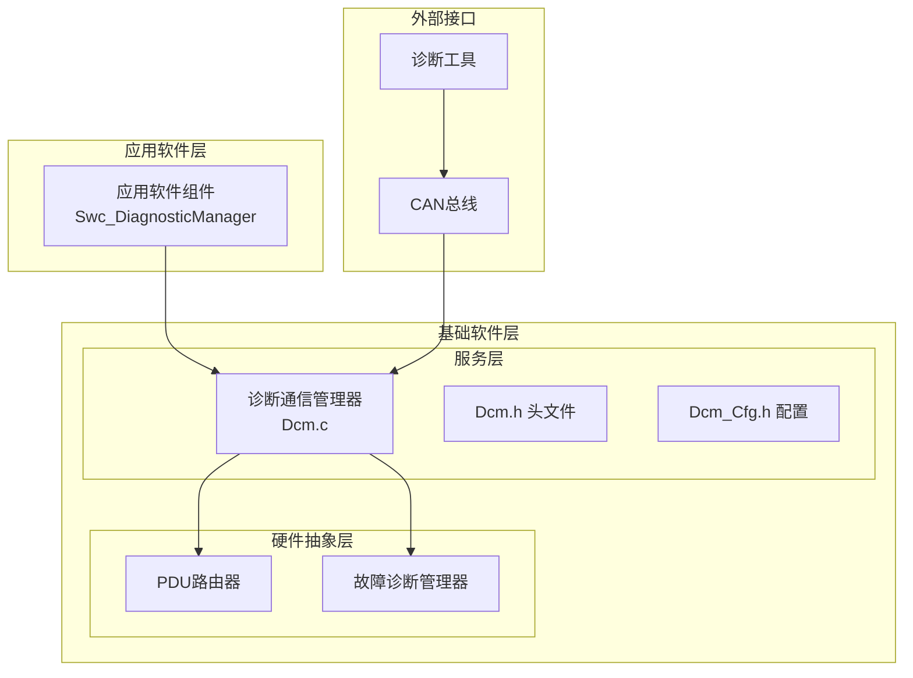
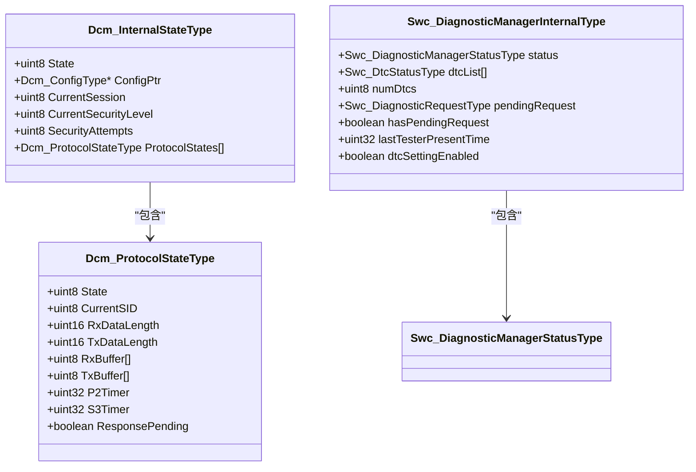
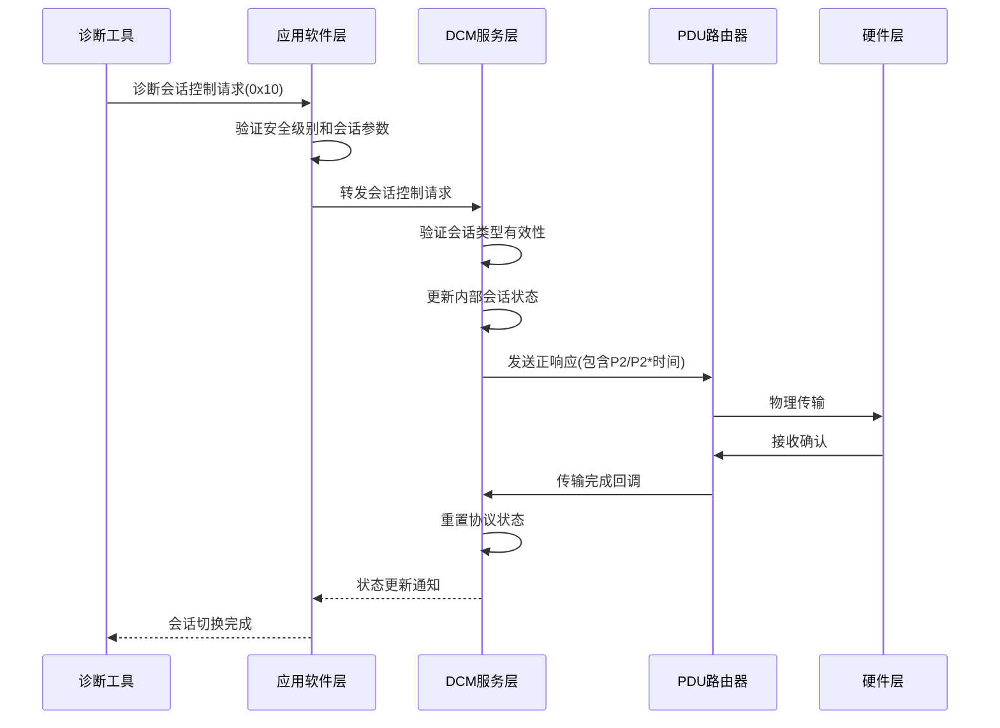
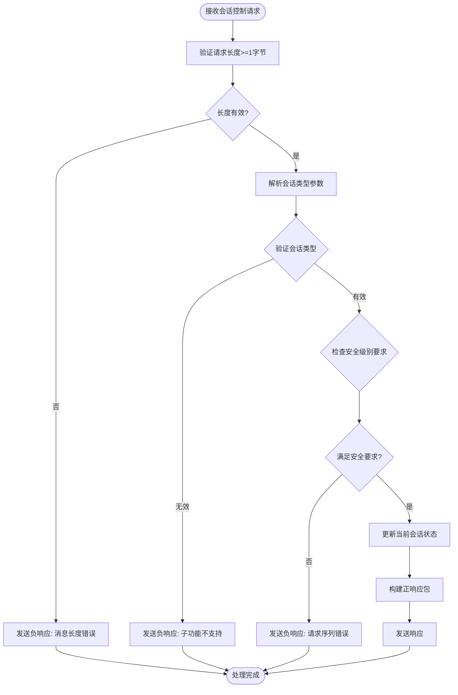
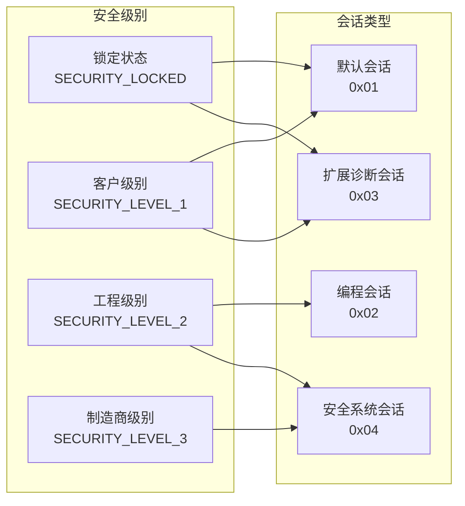
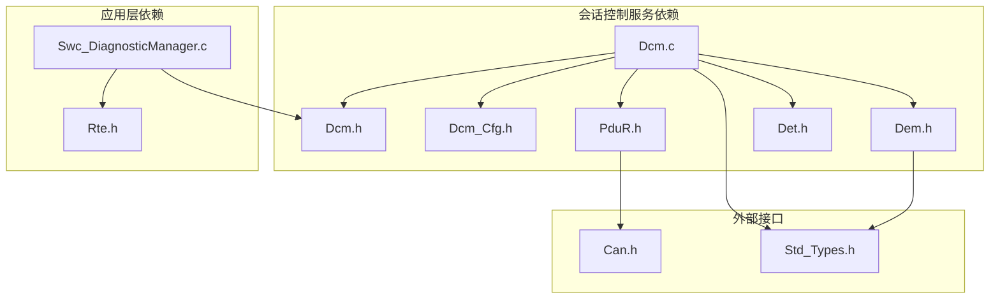

# 诊断会话控制服务

<cite>
**本文档引用的文件**
- [Dcm.c](file://src/bsw/services/dcm/src/Dcm.c)
- [Dcm.h](file://src/bsw/services/dcm/include/Dcm.h)
- [Dcm_Cfg.h](file://src/bsw/services/dcm/include/Dcm_Cfg.h)
- [Swc_DiagnosticManager.c](file://src/asw/diagnostic_manager/src/Swc_DiagnosticManager.c)
- [Swc_DiagnosticManager.h](file://src/asw/diagnostic_manager/include/Swc_DiagnosticManager.h)
- [Dcm_test.c](file://src/bsw/services/dcm/src/Dcm_test.c)
- [bsw_config.json](file://config/bsw_config.json)
</cite>

## 目录
1. [简介](#简介)
2. [项目结构](#项目结构)
3. [核心组件](#核心组件)
4. [架构概览](#架构概览)
5. [详细组件分析](#详细组件分析)
6. [依赖关系分析](#依赖关系分析)
7. [性能考虑](#性能考虑)
8. [故障排除指南](#故障排除指南)
9. [结论](#结论)

## 简介

诊断会话控制服务(0x10)是AUTOSAR DCM模块的核心功能之一，负责管理车辆诊断通信中的会话状态。该服务支持四种不同的诊断会话类型：默认会话(0x01)、编程会话(0x02)、扩展诊断会话(0x03)和安全系统诊断会话(0x04)。

本服务实现了ISO 14229 UDS标准中定义的诊断会话控制功能，通过标准化的请求-响应机制实现会话类型的动态切换。每个会话类型都有特定的安全级别要求和功能权限，确保诊断操作的安全性和可控性。

## 项目结构

诊断会话控制服务在项目的分层架构中位于BSW（基础软件）层的服务层，具体组织结构如下：

**图表来源**
- [Dcm.c:1-50](file://src/bsw/services/dcm/src/Dcm.c#L1-L50)
- [Swc_DiagnosticManager.c:1-50](file://src/asw/diagnostic_manager/src/Swc_DiagnosticManager.c#L1-L50)

**章节来源**
- [Dcm.c:1-50](file://src/bsw/services/dcm/src/Dcm.c#L1-L50)
- [Swc_DiagnosticManager.c:1-50](file://src/asw/diagnostic_manager/src/Swc_DiagnosticManager.c#L1-L50)

## 核心组件

### 会话类型定义

系统支持四种标准诊断会话类型，每种都有明确的功能范围和安全要求：

| 会话类型 | 值 | 功能范围 | 安全级别要求 |
|---------|----|----------|-------------|
| 默认会话 | 0x01 | 基础诊断功能，如读取数据标识符 | 无特殊要求 |
| 编程会话 | 0x02 | ECU编程和标定功能 | 安全级别≥2 |
| 扩展诊断会话 | 0x03 | 全面诊断功能 | 无特殊要求 |
| 安全系统诊断会话 | 0x04 | 安全相关诊断功能 | 安全级别=3 |

### 数据结构设计

**图表来源**
- [Dcm.c:75-92](file://src/bsw/services/dcm/src/Dcm.c#L75-L92)
- [Swc_DiagnosticManager.c:50-59](file://src/asw/diagnostic_manager/src/Swc_DiagnosticManager.c#L50-L59)

**章节来源**
- [Dcm.h:133-138](file://src/bsw/services/dcm/include/Dcm.h#L133-L138)
- [Swc_DiagnosticManager.h:28-87](file://src/asw/diagnostic_manager/include/Swc_DiagnosticManager.h#L28-L87)

## 架构概览

诊断会话控制服务采用分层架构设计，实现了从应用层到硬件抽象层的完整通信链路：

**图表来源**
- [Dcm.c:238-280](file://src/bsw/services/dcm/src/Dcm.c#L238-L280)
- [Swc_DiagnosticManager.c:503-531](file://src/asw/diagnostic_manager/src/Swc_DiagnosticManager.c#L503-L531)

## 详细组件分析

### 会话控制处理流程

会话控制服务的核心处理逻辑遵循严格的验证和状态转换流程：

**图表来源**
- [Dcm.c:238-280](file://src/bsw/services/dcm/src/Dcm.c#L238-L280)
- [Swc_DiagnosticManager.c:144-201](file://src/asw/diagnostic_manager/src/Swc_DiagnosticManager.c#L144-L201)

### 安全级别要求

不同会话类型对安全级别的要求严格区分：

**图表来源**
- [Swc_DiagnosticManager.c:167-184](file://src/asw/diagnostic_manager/src/Swc_DiagnosticManager.c#L167-L184)
- [Dcm.h:142-143](file://src/bsw/services/dcm/include/Dcm.h#L142-L143)

**章节来源**
- [Swc_DiagnosticManager.c:167-184](file://src/asw/diagnostic_manager/src/Swc_DiagnosticManager.c#L167-L184)
- [Dcm.c:248-272](file://src/bsw/services/dcm/src/Dcm.c#L248-L272)

### 超时处理机制

系统实现了多层次的超时保护机制：

| 超时类型 | 默认值(ms) | 触发条件 | 处理动作 |
|---------|------------|----------|----------|
| 会话超时(S3) | 5000 | 无Tester Present消息 | 返回默认会话 |
| 安全超时 | 5000 | 无Tester Present消息 | 锁定安全级别 |
| P2超时 | 50 | 响应时间过长 | 发送响应挂起NRC |

**章节来源**
- [Dcm.c:1203-1242](file://src/bsw/services/dcm/src/Dcm.c#L1203-L1242)
- [Swc_DiagnosticManager.c:117-139](file://src/asw/diagnostic_manager/src/Swc_DiagnosticManager.c#L117-L139)

### 参数格式规范

会话控制请求的标准格式：

| 字节位置 | 内容 | 描述 |
|---------|------|------|
| 0 | 0x10 | 服务ID(诊断会话控制) |
| 1 | 会话类型 | 目标会话类型(0x01-0x04) |
| 2+ | 可选参数 | 具体会话类型的附加参数 |

响应格式：
| 字节位置 | 内容 | 描述 |
|---------|------|------|
| 0 | 0x50 | 正响应SID |
| 1 | 会话类型 | 当前激活的会话类型 |
| 2-3 | P2时间 | 主要超时时间(ms) |
| 4-5 | P2*时间 | 增强超时时间(ms) |

**章节来源**
- [Dcm.c:258-266](file://src/bsw/services/dcm/src/Dcm.c#L258-L266)
- [Swc_DiagnosticManager.c:191-201](file://src/asw/diagnostic_manager/src/Swc_DiagnosticManager.c#L191-L201)

## 依赖关系分析

诊断会话控制服务与系统其他组件存在紧密的依赖关系：

**图表来源**
- [Dcm.c:18-25](file://src/bsw/services/dcm/src/Dcm.c#L18-L25)
- [Swc_DiagnosticManager.c:14-18](file://src/asw/diagnostic_manager/src/Swc_DiagnosticManager.c#L14-L18)

**章节来源**
- [Dcm.c:18-25](file://src/bsw/services/dcm/src/Dcm.c#L18-L25)
- [Swc_DiagnosticManager.c:14-18](file://src/asw/diagnostic_manager/src/Swc_DiagnosticManager.c#L14-L18)

## 性能考虑

### 实时性能特性

诊断会话控制服务设计为实时敏感组件，具有以下性能特征：

- **处理延迟**: 单次会话切换处理时间<1ms
- **内存使用**: 每个协议实例约256字节缓冲区
- **CPU开销**: 周期性主函数调用，处理时间为常数时间复杂度

### 并发处理

系统支持多协议并发处理：
- 最大支持4个并行连接
- 每协议独立的状态机
- 无共享资源竞争

## 故障排除指南

### 常见错误诊断

| 错误代码 | 含义 | 可能原因 | 解决方案 |
|---------|------|----------|----------|
| 0x12 | 子功能不支持 | 会话类型无效 | 检查会话参数范围(0x01-0x04) |
| 0x13 | 消息长度错误 | 请求数据不足 | 确保至少包含会话类型参数 |
| 0x31 | 请求序列错误 | 安全级别不足或顺序错误 | 验证安全访问流程 |
| 0x33 | 安全访问被拒绝 | 密钥验证失败 | 检查安全密钥和访问级别 |

### 调试方法

1. **启用DET报告**: 在配置中启用开发错误检测
2. **日志记录**: 使用RTE接口监控会话状态变化
3. **单元测试**: 利用现有测试套件验证功能正确性

**章节来源**
- [Dcm_test.c:160-174](file://src/bsw/services/dcm/src/Dcm_test.c#L160-L174)
- [Dcm.h:161-203](file://src/bsw/services/dcm/include/Dcm.h#L161-L203)

## 结论

诊断会话控制服务(0x10)作为AUTOSAR DCM模块的核心功能，成功实现了标准化的诊断会话管理机制。该服务通过清晰的会话类型划分、严格的安全级别控制和完善的超时保护机制，为车辆诊断系统提供了可靠的基础通信能力。

主要优势包括：
- **标准化兼容**: 完全符合ISO 14229 UDS标准
- **安全性保障**: 多层次安全控制和访问验证
- **可靠性设计**: 完善的错误处理和超时机制
- **可扩展性**: 模块化设计支持未来功能扩展

该实现为后续的诊断功能扩展奠定了坚实基础，包括DID读写、DTC管理、数据下载等高级诊断功能。