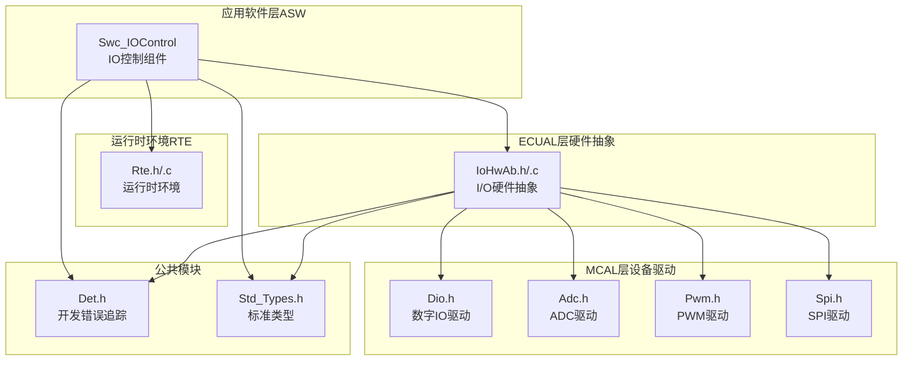
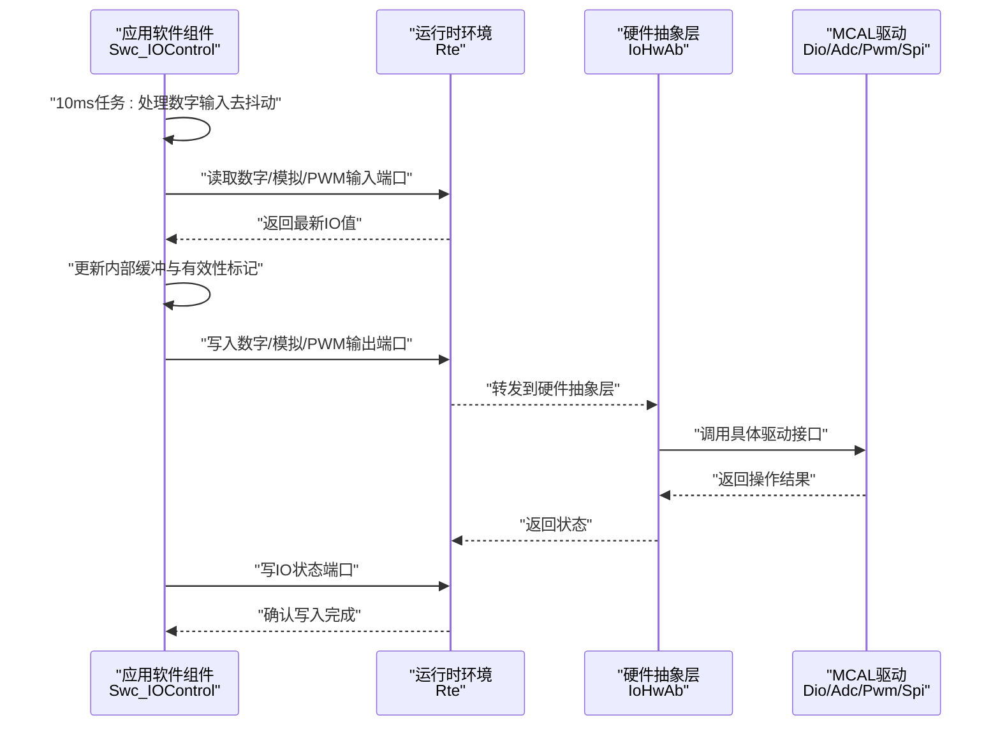
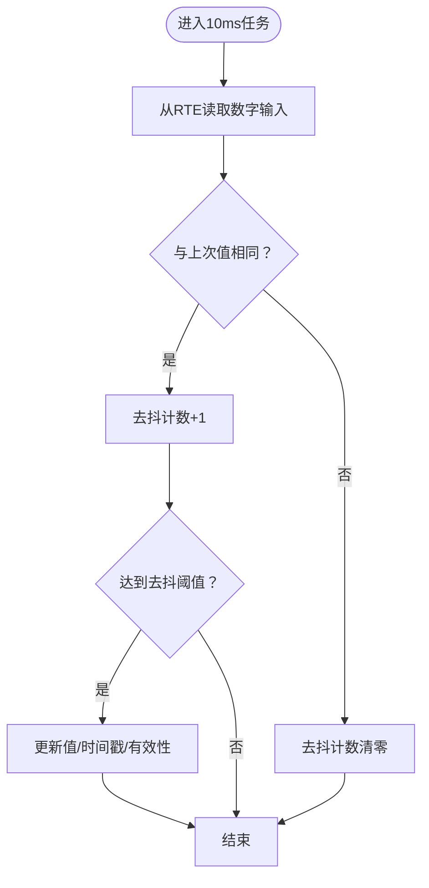
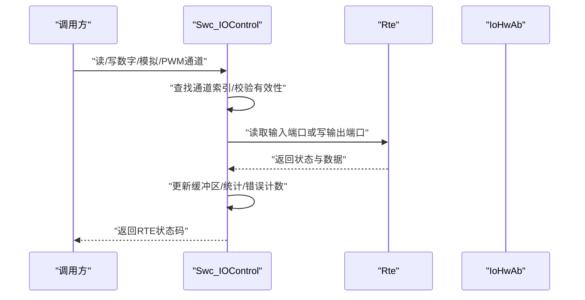
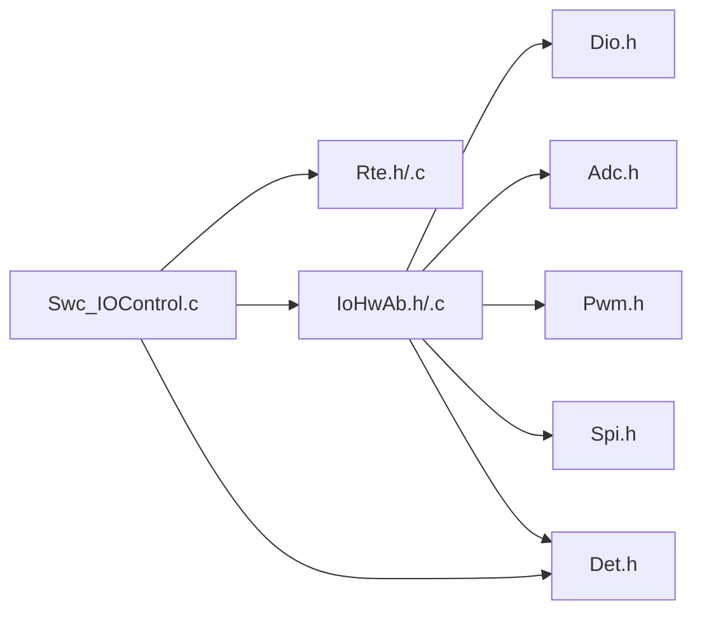

# 输入输出控制服务

<cite>
**本文档引用的文件**
- [Swc_IOControl.h](file://src/asw/io_control/include/Swc_IOControl.h)
- [Swc_IOControl.c](file://src/asw/io_control/src/Swc_IOControl.c)
- [IoHwAb.h](file://src/bsw/ecual/iohwab/include/IoHwAb.h)
- [IoHwAb.c](file://src/bsw/ecual/iohwab/src/IoHwAb.c)
- [IoHwAb_Cfg.h](file://src/bsw/ecual/iohwab/include/IoHwAb_Cfg.h)
- [IoHwAb_Cfg.h](file://src/bsw/config/templates/IoHwAb_Cfg.h)
- [Rte.h](file://src/bsw/rte/include/Rte.h)
- [Rte.c](file://src/bsw/rte/src/Rte.c)
- [Det.h](file://src/bsw/services/det/include/Det.h)
- [bsw_config.json](file://config/bsw_config.json)
- [architecture-rules.md](file://.harness/architecture-rules.md)
</cite>

## 目录
1. [简介](#简介)
2. [项目结构](#项目结构)
3. [核心组件](#核心组件)
4. [架构总览](#架构总览)
5. [详细组件分析](#详细组件分析)
6. [依赖关系分析](#依赖关系分析)
7. [性能考虑](#性能考虑)
8. [故障排查指南](#故障排查指南)
9. [结论](#结论)

## 简介
本文件针对输入输出控制服务（0x2F）提供完整技术文档，覆盖数字输入输出控制、模拟信号控制与PWM输入输出控制的实现机制，详述IO控制命令的解析、执行流程与状态反馈方式；同时文档化IO端口配置、控制模式选择与实时响应机制，并包含安全检查、错误处理与系统保护措施。内容基于仓库中的应用软件组件（ASW）与底层硬件抽象（ECUAL）实现进行分析与总结。

## 项目结构
输入输出控制服务位于应用软件层（ASW），通过运行器（runnable）周期性调度，与运行时环境（RTE）交互，最终由硬件抽象层（IoHwAb）对接MCAL驱动完成实际IO操作。关键文件组织如下：
- ASW层：Swc_IOControl（头文件与实现）
- ECUAL层：IoHwAb（硬件抽象接口与实现）
- RTE层：Rte（运行时环境接口与实现）
- 公共模块：Det（开发期错误追踪）、Std_Types（标准类型）
- 配置：IoHwAb_Cfg（编译期配置）、bsw_config.json（BSW模块配置）

图表来源
- [Swc_IOControl.c:1-719](file://src/asw/io_control/src/Swc_IOControl.c#L1-719)
- [IoHwAb.h:1-263](file://src/bsw/ecual/iohwab/include/IoHwAb.h#L1-263)
- [IoHwAb.c:1-386](file://src/bsw/ecual/iohwab/src/IoHwAb.c#L1-386)
- [Rte.h:1-441](file://src/bsw/rte/include/Rte.h#L1-441)
- [Rte.c:312-472](file://src/bsw/rte/src/Rte.c#L312-472)
- [Det.h:1-76](file://src/bsw/services/det/include/Det.h#L1-76)

章节来源
- [Swc_IOControl.h:1-258](file://src/asw/io_control/include/Swc_IOControl.h#L1-258)
- [Swc_IOControl.c:1-719](file://src/asw/io_control/src/Swc_IOControl.c#L1-719)
- [IoHwAb.h:1-263](file://src/bsw/ecual/iohwab/include/IoHwAb.h#L1-263)
- [IoHwAb.c:1-386](file://src/bsw/ecual/iohwab/src/IoHwAb.c#L1-386)
- [Rte.h:1-441](file://src/bsw/rte/include/Rte.h#L1-441)
- [Rte.c:312-472](file://src/bsw/rte/src/Rte.c#L312-472)
- [Det.h:1-76](file://src/bsw/services/det/include/Det.h#L1-76)

## 核心组件
- IO控制组件（Swc_IOControl）
  - 提供数字/模拟/PWM输入输出读写接口
  - 维护通道状态与统计信息
  - 周期性任务（10ms/50ms）处理输入与状态上报
- 硬件抽象层（IoHwAb）
  - 对接Dio/Adc/Pwm/Spi等MCAL驱动
  - 提供统一的I/O访问接口与错误检测
- 运行时环境（RTE）
  - 负责组件间端口连接与数据传输
  - 提供Rte_Read/Rte_Write等基础API

章节来源
- [Swc_IOControl.h:25-257](file://src/asw/io_control/include/Swc_IOControl.h#L25-257)
- [Swc_IOControl.c:22-719](file://src/asw/io_control/src/Swc_IOControl.c#L22-719)
- [IoHwAb.h:38-263](file://src/bsw/ecual/iohwab/include/IoHwAb.h#L38-263)
- [Rte.h:35-200](file://src/bsw/rte/include/Rte.h#L35-200)

## 架构总览
IO控制服务采用分层架构：ASW组件负责业务逻辑与状态管理，ECUAL层封装硬件差异，RTE层提供跨组件通信能力。数字输入采用去抖动处理，模拟与PWM输入在慢周期任务中更新，输出在调用时按需写入并通过RTE上报。

图表来源
- [Swc_IOControl.c:205-406](file://src/asw/io_control/src/Swc_IOControl.c#L205-406)
- [IoHwAb.c:97-246](file://src/bsw/ecual/iohwab/src/IoHwAb.c#L97-246)
- [Rte.c:425-472](file://src/bsw/rte/src/Rte.c#L425-472)

## 详细组件分析

### 数字输入输出控制
- 数字输入
  - 10ms周期任务中从RTE读取数字输入值
  - 采用简单计数去抖动策略，连续采样达到阈值后才更新有效值
  - 更新时间戳与有效性标志位
- 数字输出
  - 写入时按需创建输出通道（受最大数量限制）
  - 更新值、时间戳与有效性标志位
  - 通过RTE写入端口并记录统计与错误

图表来源
- [Swc_IOControl.c:205-231](file://src/asw/io_control/src/Swc_IOControl.c#L205-231)

章节来源
- [Swc_IOControl.c:205-231](file://src/asw/io_control/src/Swc_IOControl.c#L205-231)
- [Swc_IOControl.c:442-481](file://src/asw/io_control/src/Swc_IOControl.c#L442-481)

### 模拟信号控制
- 模拟输入
  - 50ms周期任务中从RTE读取模拟输入的原始值与物理值
  - 更新时间戳与有效性标志位
- 模拟输出
  - 写入时按需创建输出通道
  - 同步更新原始值与物理值
  - 通过RTE写入端口并记录统计与错误

章节来源
- [Swc_IOControl.c:236-252](file://src/asw/io_control/src/Swc_IOControl.c#L236-252)
- [Swc_IOControl.c:517-557](file://src/asw/io_control/src/Swc_IOControl.c#L517-557)

### PWM输入输出控制
- PWM输入
  - 50ms周期任务中从RTE读取占空比与频率
  - 更新时间戳与有效性标志位
- PWM输出
  - 写入时按需创建输出通道
  - 更新占空比与频率
  - 通过RTE写入端口并记录统计与错误

章节来源
- [Swc_IOControl.c:257-273](file://src/asw/io_control/src/Swc_IOControl.c#L257-273)
- [Swc_IOControl.c:596-638](file://src/asw/io_control/src/Swc_IOControl.c#L596-638)

### IO端口配置与控制模式
- 端口ID定义
  - IO状态端口、数字输入/输出端口、模拟输入/输出端口、PWM输入/输出端口均有明确ID
- 控制模式
  - 支持激活、非激活、故障、测试四种状态
  - 状态切换受初始化与有效性检查约束

章节来源
- [Swc_IOControl.h:115-122](file://src/asw/io_control/include/Swc_IOControl.h#L115-122)
- [Swc_IOControl.h:38-45](file://src/asw/io_control/include/Swc_IOControl.h#L38-45)
- [Swc_IOControl.c:643-678](file://src/asw/io_control/src/Swc_IOControl.c#L643-678)

### 实时响应机制
- 周期性任务
  - 10ms：处理数字输入去抖动
  - 50ms：处理模拟与PWM输入，并写IO状态端口
- 输出写入
  - 按需写入，成功后更新统计计数

章节来源
- [Swc_IOControl.c:368-406](file://src/asw/io_control/src/Swc_IOControl.c#L368-406)
- [Swc_IOControl.c:474-481](file://src/asw/io_control/src/Swc_IOControl.c#L474-481)
- [Swc_IOControl.c:550-557](file://src/asw/io_control/src/Swc_IOControl.c#L550-557)
- [Swc_IOControl.c:631-638](file://src/asw/io_control/src/Swc_IOControl.c#L631-638)

### IO控制命令解析与执行流程
- 解析
  - 通过RTE端口读取输入值或接收控制参数
- 执行
  - 根据通道类型与目标状态执行相应操作（读/写）
  - 更新内部缓冲区与统计信息
- 反馈
  - 通过RTE端口写回状态与输出值
  - 记录错误计数以支持诊断

图表来源
- [Swc_IOControl.c:411-437](file://src/asw/io_control/src/Swc_IOControl.c#L411-437)
- [Swc_IOControl.c:486-512](file://src/asw/io_control/src/Swc_IOControl.c#L486-512)
- [Swc_IOControl.c:562-591](file://src/asw/io_control/src/Swc_IOControl.c#L562-591)
- [Rte.c:425-472](file://src/bsw/rte/src/Rte.c#L425-472)

## 依赖关系分析
- 组件内聚与耦合
  - Swc_IOControl内部维护多类通道缓冲与统计，内聚度高
  - 与RTE耦合用于端口读写，与IoHwAb耦合用于硬件访问
- 外部依赖
  - IoHwAb依赖Dio/Adc/Pwm/Spi等MCAL驱动
  - 错误处理依赖Det模块

图表来源
- [Swc_IOControl.c:15-18](file://src/asw/io_control/src/Swc_IOControl.c#L15-18)
- [IoHwAb.c:9-15](file://src/bsw/ecual/iohwab/src/IoHwAb.c#L9-15)
- [Det.h:17-18](file://src/bsw/services/det/include/Det.h#L17-18)

章节来源
- [Swc_IOControl.c:15-18](file://src/asw/io_control/src/Swc_IOControl.c#L15-18)
- [IoHwAb.c:9-15](file://src/bsw/ecual/iohwab/src/IoHwAb.c#L9-15)
- [Det.h:17-18](file://src/bsw/services/det/include/Det.h#L17-18)

## 性能考虑
- 去抖动策略
  - 数字输入采用固定样本计数去抖，降低误触发概率，适合机械开关抖动场景
- 任务分层
  - 快速任务（10ms）处理高频变化的数字输入，慢任务（50ms）处理低频模拟/PWM输入，平衡实时性与资源消耗
- 缓冲与统计
  - 内部缓冲减少对RTE频繁访问，统计信息便于运行时监控与诊断

## 故障排查指南
- 常见错误码
  - 未初始化：调用前必须先初始化组件
  - 参数无效：通道ID不存在或指针为空
  - 未连接/无数据：RTE端口未正确连接或无可用数据
  - 超出范围/限制：通道数量超过上限
- 安全检查与保护
  - 指针与边界检查：所有API均进行空指针与数组越界检查
  - 状态机保护：仅在激活状态下允许输出写入
  - 错误上报：通过DET模块报告错误，便于调试与诊断

章节来源
- [Swc_IOControl.c:415-437](file://src/asw/io_control/src/Swc_IOControl.c#L415-437)
- [Swc_IOControl.c:489-512](file://src/asw/io_control/src/Swc_IOControl.c#L489-512)
- [Swc_IOControl.c:568-591](file://src/asw/io_control/src/Swc_IOControl.c#L568-591)
- [Swc_IOControl.c:648-658](file://src/asw/io_control/src/Swc_IOControl.c#L648-658)
- [architecture-rules.md:140-167](file://.harness/architecture-rules.md#L140-167)

## 结论
输入输出控制服务通过清晰的分层设计与严格的错误处理机制，实现了对数字、模拟与PWM信号的可靠控制。其周期性任务与去抖动策略确保了实时响应与稳定性，配合RTE与IoHwAb的解耦设计，满足了AutoSAR平台下的可移植性与可维护性要求。建议在集成阶段重点关注端口连接、通道配置与错误日志，以确保系统在不同硬件平台上的一致行为。