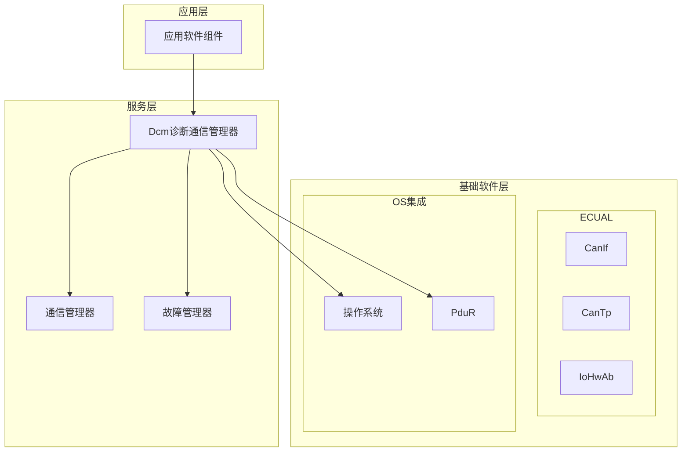
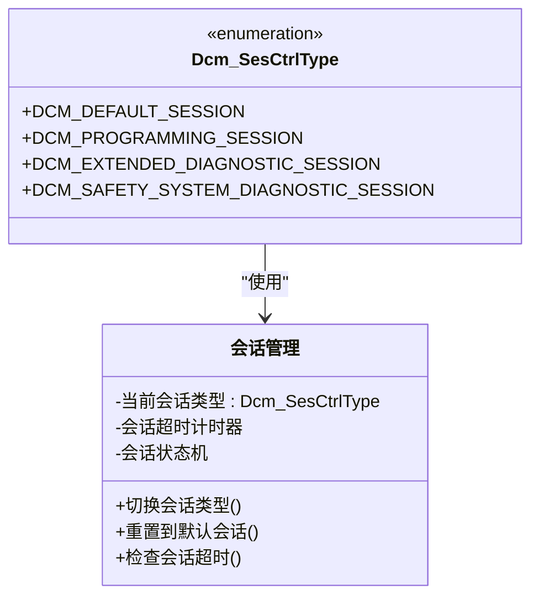
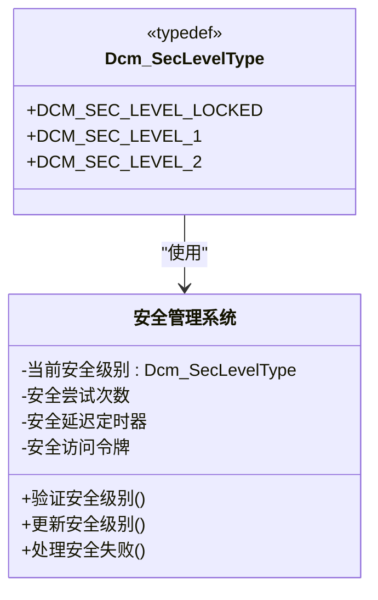
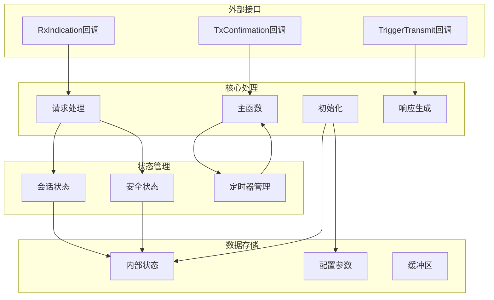
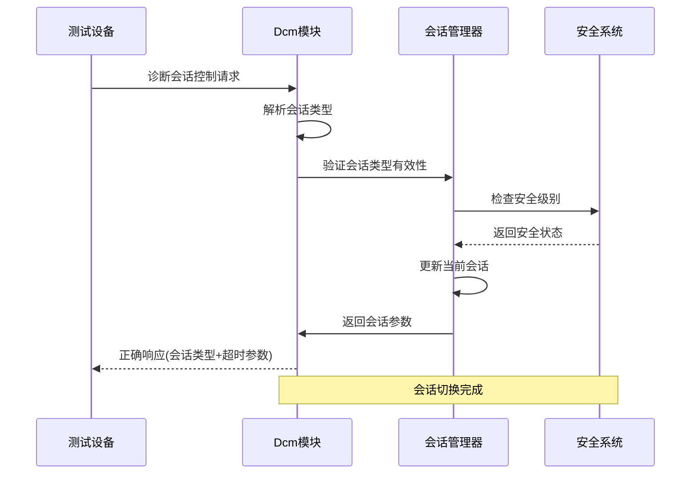
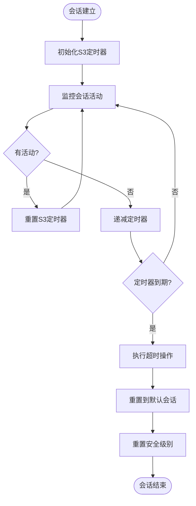
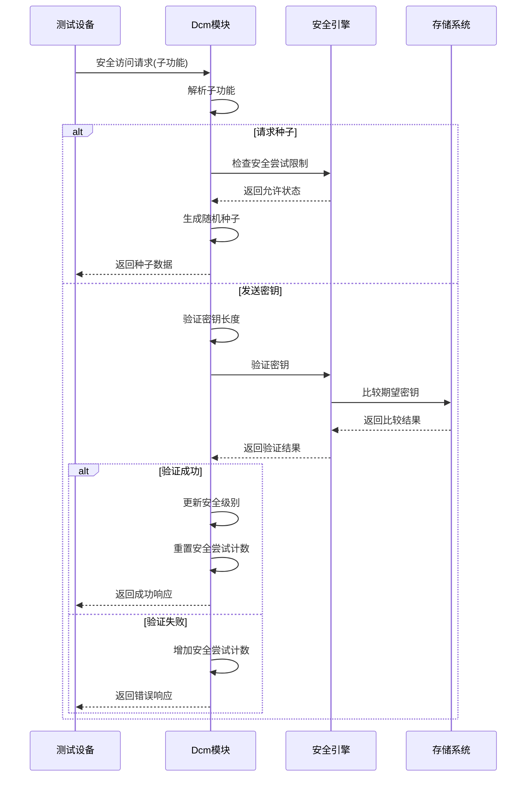
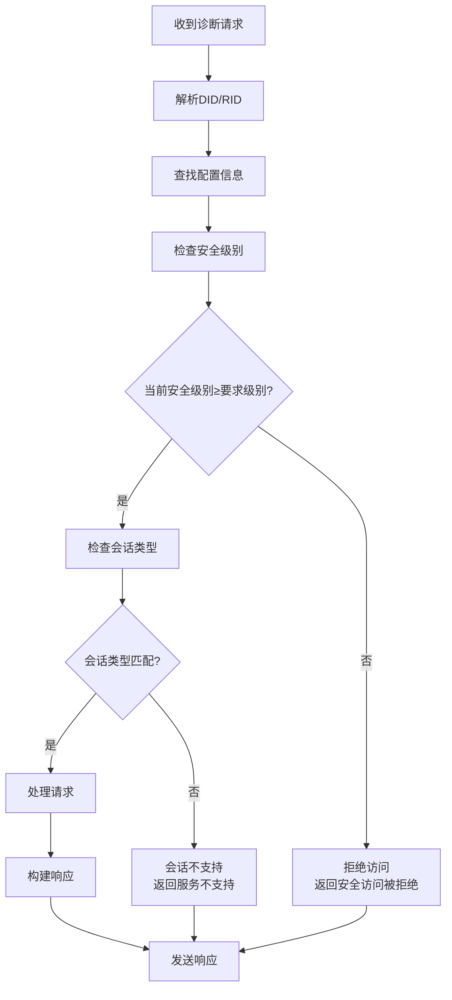
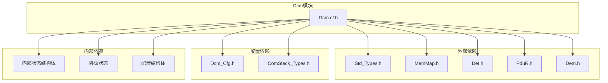

# 会话管理与安全控制

<cite>
**本文档引用的文件**
- [Dcm.h](file://src/bsw/services/dcm/include/Dcm.h)
- [Dcm.c](file://src/bsw/services/dcm/src/Dcm.c)
- [Dcm_Cfg.h](file://src/bsw/services/dcm/include/Dcm_Cfg.h)
- [api-reference.md](file://docs/api-reference.md)
</cite>

## 目录
1. [简介](#简介)
2. [项目结构](#项目结构)
3. [核心组件](#核心组件)
4. [架构概览](#架构概览)
5. [详细组件分析](#详细组件分析)
6. [依赖关系分析](#依赖关系分析)
7. [性能考虑](#性能考虑)
8. [故障排除指南](#故障排除指南)
9. [结论](#结论)

## 简介

Dcm会话管理与安全控制模块是YuleTech AutoSAR BSW中的关键组件，负责管理诊断通信会话和安全访问控制。该模块实现了AutoSAR Classic Platform 4.x标准，提供UDS（ISO 14229）和OBD-II诊断协议支持。

本模块的核心功能包括：
- 会话类型管理：默认会话、编程会话、扩展诊断会话、安全系统诊断会话
- 安全级别控制：多级安全访问保护
- 会话状态转换：基于时间的会话超时管理
- 权限验证：基于安全级别的访问控制

## 项目结构

Dcm模块位于服务层，采用AutoSAR分层架构设计：

**图表来源**
- [Dcm.h:1-50](file://src/bsw/services/dcm/include/Dcm.h#L1-L50)
- [Dcm.c:1-50](file://src/bsw/services/dcm/src/Dcm.c#L1-L50)

**章节来源**
- [Dcm.h:1-379](file://src/bsw/services/dcm/include/Dcm.h#L1-L379)
- [Dcm.c:1-1455](file://src/bsw/services/dcm/src/Dcm.c#L1-L1455)

## 核心组件

### 会话类型枚举

Dcm_SesCtrlType定义了四种诊断会话类型：

**图表来源**
- [Dcm.h:133-138](file://src/bsw/services/dcm/include/Dcm.h#L133-L138)
- [Dcm.c:76-92](file://src/bsw/services/dcm/src/Dcm.c#L76-L92)

### 安全级别管理

Dcm_SecLevelType提供了多级安全访问控制：

**图表来源**
- [Dcm.h:143](file://src/bsw/services/dcm/include/Dcm.h#L143)
- [Dcm_Cfg.h:59-61](file://src/bsw/services/dcm/include/Dcm_Cfg.h#L59-L61)

**章节来源**
- [Dcm.h:133-143](file://src/bsw/services/dcm/include/Dcm.h#L133-L143)
- [Dcm_Cfg.h:55-67](file://src/bsw/services/dcm/include/Dcm_Cfg.h#L55-L67)

## 架构概览

Dcm模块采用模块化设计，包含以下主要组件：

**图表来源**
- [Dcm.c:1117-1187](file://src/bsw/services/dcm/src/Dcm.c#L1117-L1187)
- [Dcm.c:1192-1245](file://src/bsw/services/dcm/src/Dcm.c#L1192-L1245)

## 详细组件分析

### 会话管理实现

#### 会话类型切换机制

会话切换通过诊断会话控制服务实现：

**图表来源**
- [Dcm.c:238-280](file://src/bsw/services/dcm/src/Dcm.c#L238-L280)
- [Dcm.c:256](file://src/bsw/services/dcm/src/Dcm.c#L256)

#### 会话超时处理机制

**图表来源**
- [Dcm.c:1203-1213](file://src/bsw/services/dcm/src/Dcm.c#L1203-L1213)
- [Dcm.c:1405-1422](file://src/bsw/services/dcm/src/Dcm.c#L1405-L1422)

**章节来源**
- [Dcm.c:238-280](file://src/bsw/services/dcm/src/Dcm.c#L238-L280)
- [Dcm.c:1203-1213](file://src/bsw/services/dcm/src/Dcm.c#L1203-L1213)

### 安全控制实现

#### 安全访问流程

**图表来源**
- [Dcm.c:329-413](file://src/bsw/services/dcm/src/Dcm.c#L329-L413)
- [Dcm.c:388-394](file://src/bsw/services/dcm/src/Dcm.c#L388-L394)

#### 安全级别检查机制

安全级别检查贯穿所有诊断服务：

**图表来源**
- [Dcm.c:458-524](file://src/bsw/services/dcm/src/Dcm.c#L458-L524)
- [Dcm.c:529-595](file://src/bsw/services/dcm/src/Dcm.c#L529-L595)

**章节来源**
- [Dcm.c:329-413](file://src/bsw/services/dcm/src/Dcm.c#L329-L413)
- [Dcm.c:458-595](file://src/bsw/services/dcm/src/Dcm.c#L458-L595)

### API接口实现

#### 会话管理API

| 函数名称 | 功能描述 | 参数 | 返回值 |
|---------|----------|------|--------|
| Dcm_GetSesCtrlType | 获取当前会话类型 | SesCtrlType指针 | Std_ReturnType |
| Dcm_ResetToDefaultSession | 重置到默认会话 | 无 | Std_ReturnType |

#### 安全管理API

| 函数名称 | 功能描述 | 参数 | 返回值 |
|---------|----------|------|--------|
| Dcm_GetSecurityLevel | 获取当前安全级别 | SecLevel指针 | Std_ReturnType |
| Dcm_GetActiveDiagnostic | 获取活动诊断状态 | 无 | boolean |
| Dcm_SetActiveDiagnostic | 设置活动诊断状态 | active布尔值 | void |

**章节来源**
- [Dcm.h:314-338](file://src/bsw/services/dcm/include/Dcm.h#L314-L338)
- [api-reference.md:284-292](file://docs/api-reference.md#L284-L292)

## 依赖关系分析

Dcm模块的依赖关系如下：

**图表来源**
- [Dcm.c:19-25](file://src/bsw/services/dcm/src/Dcm.c#L19-L25)
- [Dcm.h:20-22](file://src/bsw/services/dcm/include/Dcm.h#L20-L22)

**章节来源**
- [Dcm.c:19-25](file://src/bsw/services/dcm/src/Dcm.c#L19-L25)
- [Dcm.h:20-22](file://src/bsw/services/dcm/include/Dcm.h#L20-L22)

## 性能考虑

### 内存管理

Dcm模块采用静态内存分配策略，避免运行时内存分配开销：

- **内部状态存储**：使用静态全局变量存储会话和安全状态
- **缓冲区管理**：固定大小的RX/TX缓冲区，大小由配置参数控制
- **定时器优化**：使用32位定时器减少内存占用

### 处理效率

- **状态机设计**：采用简单的状态机减少分支判断开销
- **数组查找**：DID/RID查找使用线性搜索，复杂度O(n)
- **条件检查**：安全级别检查为常量时间操作

### 实时性能

- **主函数周期**：可配置的主函数周期(10ms默认)
- **超时处理**：定时器在主函数中统一处理，避免中断开销
- **协议并发**：支持多协议并行处理

## 故障排除指南

### 常见问题及解决方案

#### 会话切换失败

**症状**：调用Dcm_GetSesCtrlType返回错误码
**原因**：模块未初始化或参数为空
**解决方法**：
1. 确保先调用Dcm_Init初始化模块
2. 检查传入的指针参数是否有效
3. 验证配置参数正确性

#### 安全访问被拒绝

**症状**：安全访问请求返回安全访问被拒绝
**原因**：
1. 当前安全级别不足
2. 会话类型不匹配
3. 密钥验证失败

**解决方法**：
1. 检查安全级别配置
2. 确认会话类型设置正确
3. 验证密钥生成和验证逻辑

#### 会话超时问题

**症状**：会话自动重置到默认状态
**原因**：S3定时器到期
**解决方法**：
1. 确保定期发送测试就绪消息
2. 检查主函数调用频率
3. 调整超时参数配置

**章节来源**
- [Dcm.c:1345-1422](file://src/bsw/services/dcm/src/Dcm.c#L1345-L1422)
- [Dcm_Cfg.h:47-52](file://src/bsw/services/dcm/include/Dcm_Cfg.h#L47-L52)

## 结论

Dcm会话管理与安全控制模块提供了完整的诊断通信管理功能，具有以下特点：

**优势**：
- 符合AutoSAR标准，支持多种诊断协议
- 完善的安全访问控制机制
- 灵活的会话管理能力
- 实时性能优化设计

**应用场景**：
- 汽车诊断系统
- ECU编程和标定
- 故障诊断和维护
- 远程诊断服务

**扩展建议**：
- 实现活动诊断状态的完整功能
- 增强错误检测和报告机制
- 优化DID/RID查找算法
- 添加更多的安全审计功能

该模块为整个诊断系统的稳定运行提供了坚实的基础，其模块化设计便于维护和扩展。