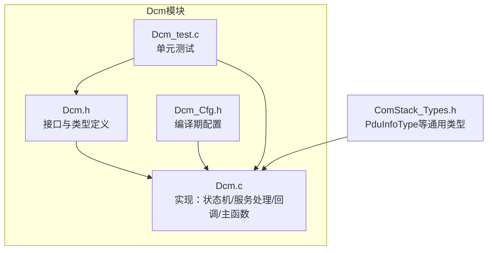
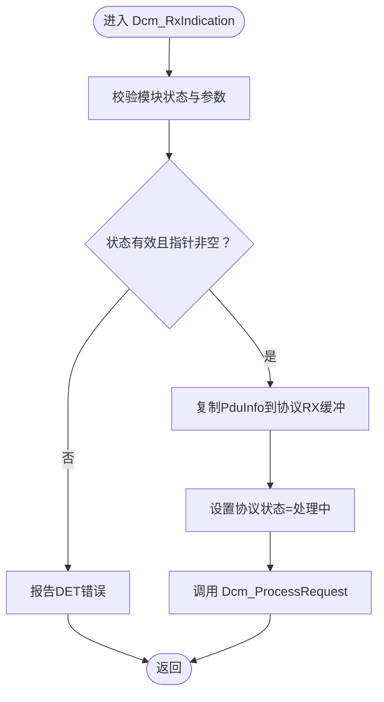
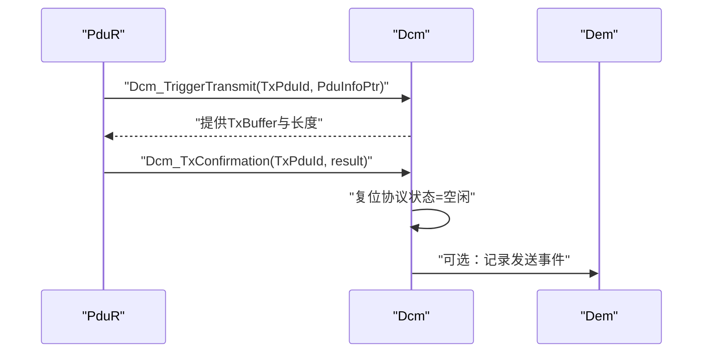
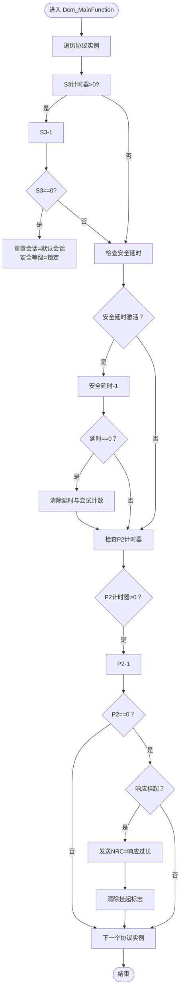
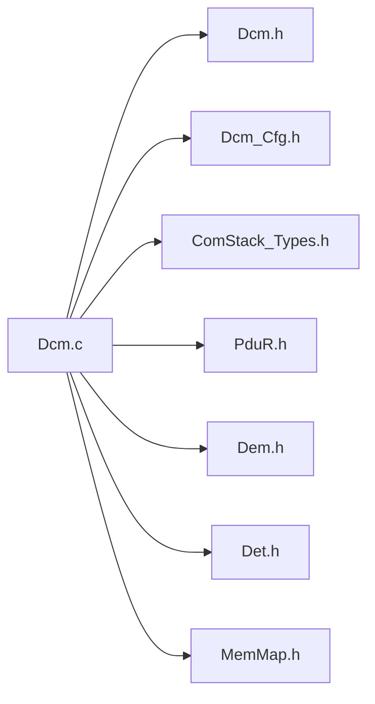

# 消息处理与回调机制

<cite>
**本文引用的文件**
- [Dcm.h](file://src/bsw/services/dcm/include/Dcm.h)
- [Dcm.c](file://src/bsw/services/dcm/src/Dcm.c)
- [Dcm_Cfg.h](file://src/bsw/services/dcm/include/Dcm_Cfg.h)
- [ComStack_Types.h](file://src/bsw/common/ComStack_Types.h)
- [Dcm_test.c](file://src/bsw/services/dcm/src/Dcm_test.c)
</cite>

## 目录
1. [简介](#简介)
2. [项目结构](#项目结构)
3. [核心组件](#核心组件)
4. [架构总览](#架构总览)
5. [详细组件分析](#详细组件分析)
6. [依赖关系分析](#依赖关系分析)
7. [性能考量](#性能考量)
8. [故障排查指南](#故障排查指南)
9. [结论](#结论)
10. [附录](#附录)

## 简介
本文件聚焦于Dcm（诊断通信管理）模块的消息处理与回调机制，围绕以下主题展开：
- Dcm_MsgContextType消息上下文结构体的设计与使用：请求/响应数据缓冲区、PDU ID、负响应码（NRC）管理等
- 回调机制：Dcm_RxIndication接收指示、Dcm_TxConfirmation发送确认、Dcm_TriggerTransmit触发传输
- 主函数Dcm_MainFunction的周期性处理：定时器管理、状态机更新、事件处理
- 消息处理流程图、回调注册方式、错误处理策略

## 项目结构
Dcm模块位于BSW服务层，遵循AutoSAR Classic平台标准，提供UDS（ISO 14229）与OBD-II协议支持。关键文件组织如下：
- 头文件：接口定义、类型与配置
- 实现文件：协议状态机、服务处理、回调与主函数
- 类型定义：PduInfoType等通信栈通用类型
- 测试文件：单元测试覆盖初始化、会话控制、DID读取、超时与DET错误上报



**图表来源**
- [Dcm.h:1-379](file://src/bsw/services/dcm/include/Dcm.h#L1-L379)
- [Dcm.c:1-1455](file://src/bsw/services/dcm/src/Dcm.c#L1-L1455)
- [Dcm_Cfg.h:1-132](file://src/bsw/services/dcm/include/Dcm_Cfg.h#L1-L132)
- [ComStack_Types.h:1-170](file://src/bsw/common/ComStack_Types.h#L1-L170)
- [Dcm_test.c:1-274](file://src/bsw/services/dcm/src/Dcm_test.c#L1-L274)

**章节来源**
- [Dcm.h:1-379](file://src/bsw/services/dcm/include/Dcm.h#L1-L379)
- [Dcm.c:1-1455](file://src/bsw/services/dcm/src/Dcm.c#L1-L1455)
- [Dcm_Cfg.h:1-132](file://src/bsw/services/dcm/include/Dcm_Cfg.h#L1-L132)
- [ComStack_Types.h:1-170](file://src/bsw/common/ComStack_Types.h#L1-L170)
- [Dcm_test.c:1-274](file://src/bsw/services/dcm/src/Dcm_test.c#L1-L274)

## 核心组件
- 消息上下文与协议状态
  - Dcm_MsgContextType：封装请求/响应缓冲、长度、PDU ID、NRC与上下文状态
  - Dcm_ProtocolStateType：每个协议实例的运行时状态（当前SID、收发缓冲、计时器、响应挂起标志）
  - Dcm_InternalStateType：模块内部状态（会话、安全等级、传输状态、协议状态数组）

- 回调接口
  - Dcm_RxIndication：接收指示，拷贝PduR传入的数据到协议RX缓冲并进入处理流程
  - Dcm_TxConfirmation：发送完成回调，复位协议状态
  - Dcm_TriggerTransmit：触发传输回调，向PduR提供TX缓冲与长度

- 主函数
  - Dcm_MainFunction：周期性处理S3/P2定时器、安全延时、响应挂起等

**章节来源**
- [Dcm.h:230-242](file://src/bsw/services/dcm/include/Dcm.h#L230-L242)
- [Dcm.c:60-92](file://src/bsw/services/dcm/src/Dcm.c#L60-L92)
- [Dcm.c:1248-1340](file://src/bsw/services/dcm/src/Dcm.c#L1248-L1340)
- [Dcm.c:1192-1245](file://src/bsw/services/dcm/src/Dcm.c#L1192-L1245)

## 架构总览
Dcm通过回调与PduR交互，内部维护多协议实例的状态机，按UDS/OBD服务进行分发处理。

```mermaid
graph TB
PduR["PduR<br/>传输路由"]
DCM["Dcm<br/>诊断通信管理"]
DEM["Dem<br/>诊断事件管理"]
DET["Det<br/>开发错误检测"]
MEM["MemMap.h<br/>内存映射宏"]
PduR <- --> DCM
DCM --> DEM
DCM --> DET
DCM --> MEM
```

**图表来源**
- [Dcm.c:19-25](file://src/bsw/services/dcm/src/Dcm.c#L19-L25)
- [Dcm.h:20-22](file://src/bsw/services/dcm/include/Dcm.h#L20-L22)

## 详细组件分析

### 消息上下文结构体 Dcm_MsgContextType
设计要点
- 请求缓冲区：reqData、reqDataLen
- 响应缓冲区：resData、resDataLen、resMaxDataLen
- 通信标识：dcmRxPduId（用于回调与路由）
- 负响应码：nrc（NRC）
- 扩展信息：msgAddInfo
- 上下文状态：msgContextState（用于跟踪处理阶段）

使用场景
- 在服务处理前由上层填充请求缓冲
- 服务处理后写入响应缓冲并通过回调触发发送
- 发送完成后由TxConfirmation复位状态

复杂度与性能
- 缓冲大小由配置决定（见Dcm_Cfg.h），避免溢出同时兼顾实时性
- 长度字段分离便于快速判断与边界检查

**章节来源**
- [Dcm.h:230-242](file://src/bsw/services/dcm/include/Dcm.h#L230-L242)
- [Dcm_Cfg.h:114-115](file://src/bsw/services/dcm/include/Dcm_Cfg.h#L114-L115)

### 接收指示回调 Dcm_RxIndication
职责
- 参数校验（DET）
- 将PduR传入的PduInfo复制到对应协议实例的RX缓冲
- 设置协议状态为“处理中”，随后调用Dcm_ProcessRequest进行服务分发

流程图



**图表来源**
- [Dcm.c:1268-1305](file://src/bsw/services/dcm/src/Dcm.c#L1268-L1305)

**章节来源**
- [Dcm.c:1268-1305](file://src/bsw/services/dcm/src/Dcm.c#L1268-L1305)

### 发送确认回调 Dcm_TxConfirmation
职责
- 参数校验（DET）
- 复位对应协议实例的TX状态与长度，回到空闲态

序列图（一次典型发送流程）



**图表来源**
- [Dcm.c:1307-1340](file://src/bsw/services/dcm/src/Dcm.c#L1307-L1340)
- [Dcm.c:1248-1266](file://src/bsw/services/dcm/src/Dcm.c#L1248-L1266)

**章节来源**
- [Dcm.c:1248-1266](file://src/bsw/services/dcm/src/Dcm.c#L1248-L1266)

### 触发传输回调 Dcm_TriggerTransmit
职责
- 参数校验（DET）
- 将协议实例的TxBuffer与TxDataLength回填给PduR

注意
- 该回调在发送前由PduR触发，确保DCM已准备好响应数据

**章节来源**
- [Dcm.c:1307-1340](file://src/bsw/services/dcm/src/Dcm.c#L1307-L1340)

### 主函数 Dcm_MainFunction 的周期性处理
职责
- 遍历所有协议实例，执行定时器与状态更新
- 处理S3会话超时（切换回默认会话）
- 处理安全尝试延时
- 处理P2超时与“响应过长”挂起

流程图



**图表来源**
- [Dcm.c:1192-1245](file://src/bsw/services/dcm/src/Dcm.c#L1192-L1245)

**章节来源**
- [Dcm.c:1192-1245](file://src/bsw/services/dcm/src/Dcm.c#L1192-L1245)

### 服务处理与消息上下文
- Dcm_ProcessRequest根据SID分派到具体服务处理函数
- 典型服务：会话控制、ECU复位、安全访问、测试员常在、读写DID、DTC查询、例行程序控制、数据下载/传输/退出
- 每个服务处理函数负责参数校验、权限检查（会话/安全级别）、调用用户配置的DID/RID回调或底层功能，并通过统一的正/负响应发送函数上报

消息上下文与服务处理的关系
- 请求侧：Dcm_RxIndication将PduInfo写入协议RX缓冲，服务处理从缓冲提取数据
- 响应侧：服务处理将响应写入协议TX缓冲，触发PduR发送；发送完成后TxConfirmation复位状态

**章节来源**
- [Dcm.c:1046-1111](file://src/bsw/services/dcm/src/Dcm.c#L1046-L1111)
- [Dcm.c:181-233](file://src/bsw/services/dcm/src/Dcm.c#L181-L233)

## 依赖关系分析
- 内部依赖
  - Dcm.c包含Dcm.h与Dcm_Cfg.h，使用ComStack_Types.h中的PduInfoType
  - 使用Det.h进行DET错误上报
  - 使用Dem.h与PduR.h进行事件与传输集成
- 外部依赖
  - PduR：触发传输与发送确认
  - Dem：DTC信息查询
  - Det：错误检测与报告
  - MemMap.h：内存映射宏（代码段/数据段）



**图表来源**
- [Dcm.c:19-25](file://src/bsw/services/dcm/src/Dcm.c#L19-L25)
- [Dcm.h:20-22](file://src/bsw/services/dcm/include/Dcm.h#L20-L22)

**章节来源**
- [Dcm.c:19-25](file://src/bsw/services/dcm/src/Dcm.c#L19-L25)
- [Dcm.h:20-22](file://src/bsw/services/dcm/include/Dcm.h#L20-L22)

## 性能考量
- 缓冲大小与超时
  - RX/TX缓冲大小（见Dcm_Cfg.h）需满足最大请求/响应长度，避免溢出
  - 定时器周期（主函数周期）与P2/S3/P2*超时（见Dcm_Cfg.h）影响响应及时性与会话保持
- 服务处理复杂度
  - DID/RID查找为线性扫描，数量较多时建议优化索引或缓存
- 中断与任务调度
  - 主函数周期性执行，建议与OS任务周期匹配，避免抖动

[本节为通用指导，不直接分析具体文件]

## 故障排查指南
常见错误与定位
- 初始化/去初始化错误
  - Dcm_Init传入NULL配置或未初始化即调用回调会触发DET错误
  - Dcm_DeInit在未初始化状态下调用会触发DET错误
- 回调参数错误
  - RxIndication/TriggerTransmit传入NULL指针会触发DET错误
- 会话与安全
  - 未满足安全级别或会话类型导致的服务拒绝
  - 安全尝试次数过多触发延时
- 超时问题
  - TesterPresent未按时到达导致S3超时回退到默认会话
  - P2超时触发“响应过长”NRC

单元测试参考
- 测试覆盖了初始化、会话控制、DID读取、超时与DET错误上报等关键路径

**章节来源**
- [Dcm_test.c:135-274](file://src/bsw/services/dcm/src/Dcm_test.c#L135-L274)
- [Dcm.c:1120-1187](file://src/bsw/services/dcm/src/Dcm.c#L1120-L1187)
- [Dcm.c:1268-1340](file://src/bsw/services/dcm/src/Dcm.c#L1268-L1340)

## 结论
Dcm模块通过清晰的消息上下文与协议状态机，结合标准化的回调接口与主函数定时处理，实现了对UDS/OBD服务的完整支持。其设计强调：
- 明确的缓冲与长度管理，降低溢出风险
- 统一的正/负响应发送流程
- 可配置的定时器与安全策略
- 完备的DET错误处理与单元测试验证

[本节为总结性内容，不直接分析具体文件]

## 附录

### 关键API与回调一览
- 初始化/去初始化：Dcm_Init、Dcm_DeInit
- 版本信息：Dcm_GetVersionInfo
- 会话与安全：Dcm_GetSecurityLevel、Dcm_GetSesCtrlType、Dcm_ResetToDefaultSession
- 回调接口：Dcm_RxIndication、Dcm_TxConfirmation、Dcm_TriggerTransmit
- 主函数：Dcm_MainFunction

**章节来源**
- [Dcm.h:282-376](file://src/bsw/services/dcm/include/Dcm.h#L282-L376)
- [Dcm.c:1117-1447](file://src/bsw/services/dcm/src/Dcm.c#L1117-L1447)