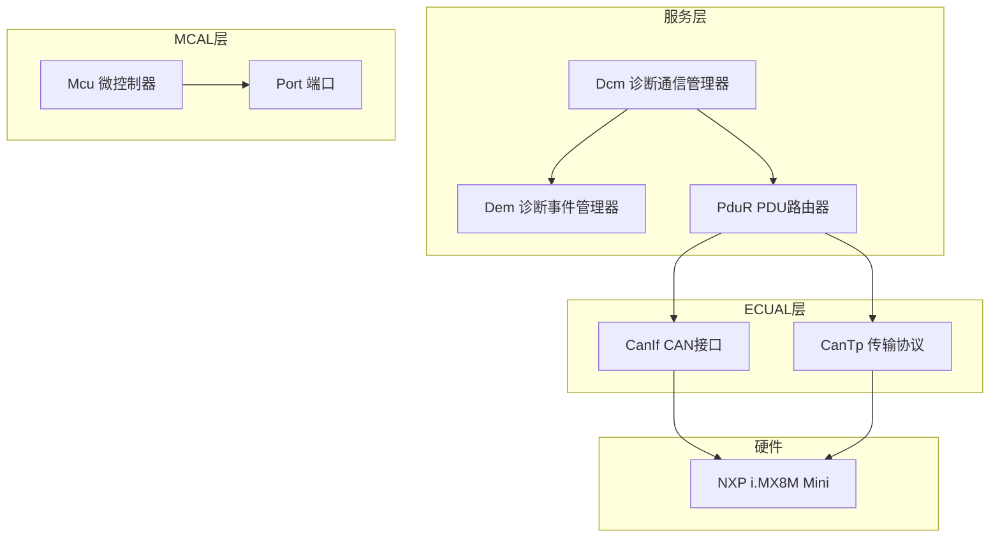
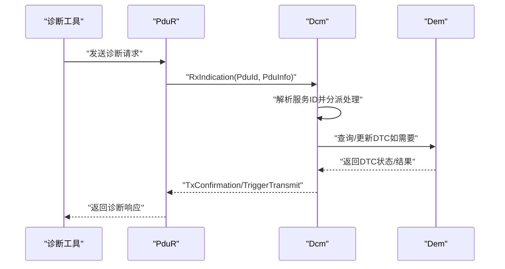
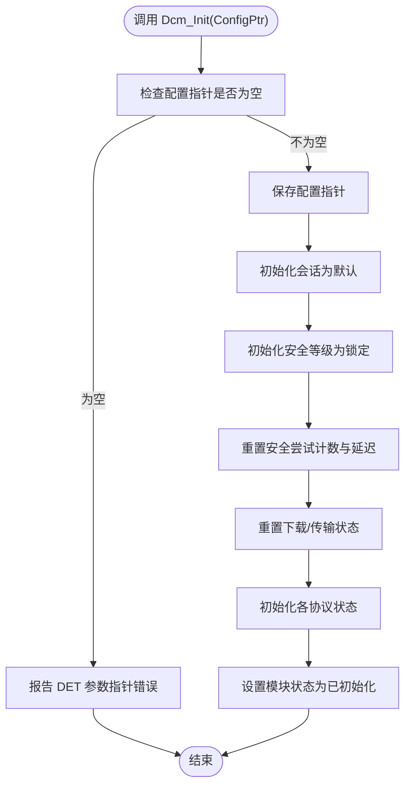
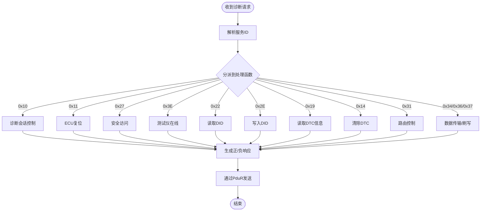
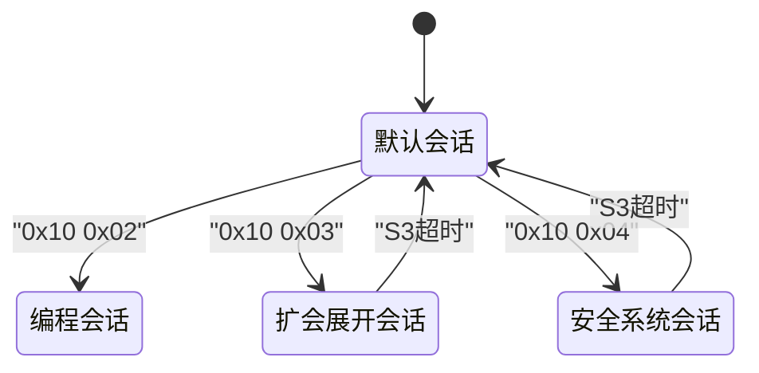
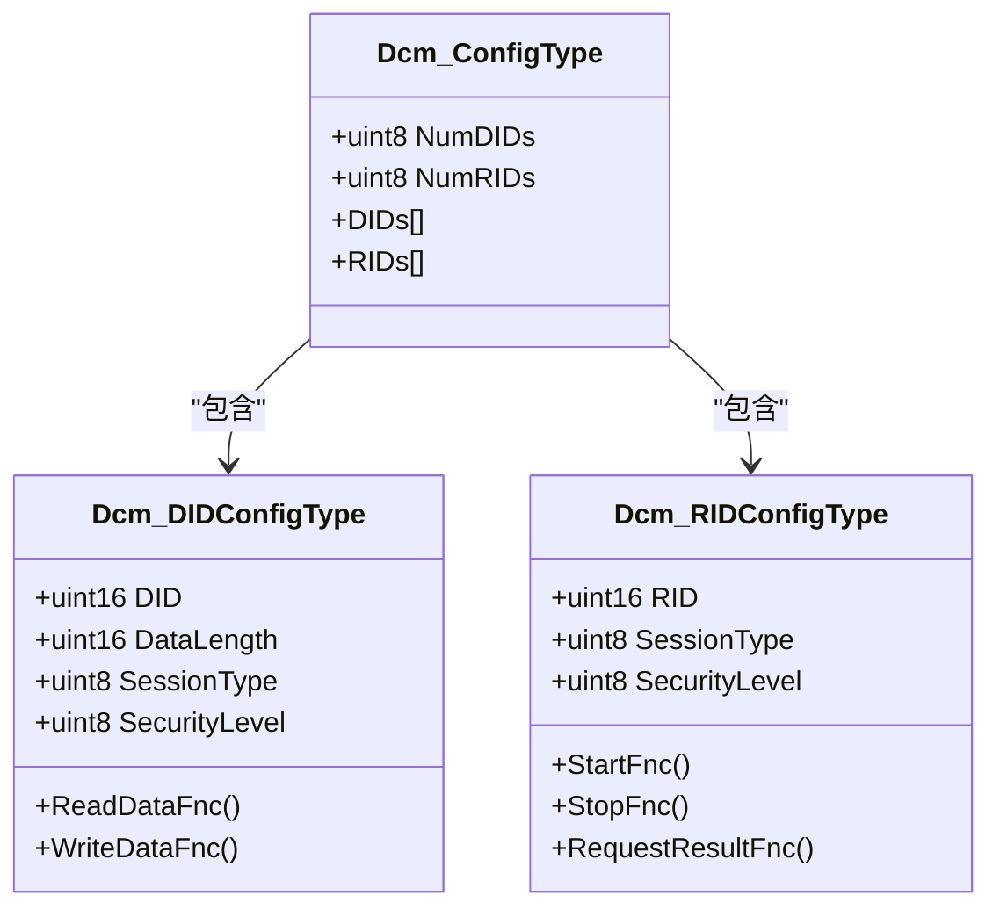
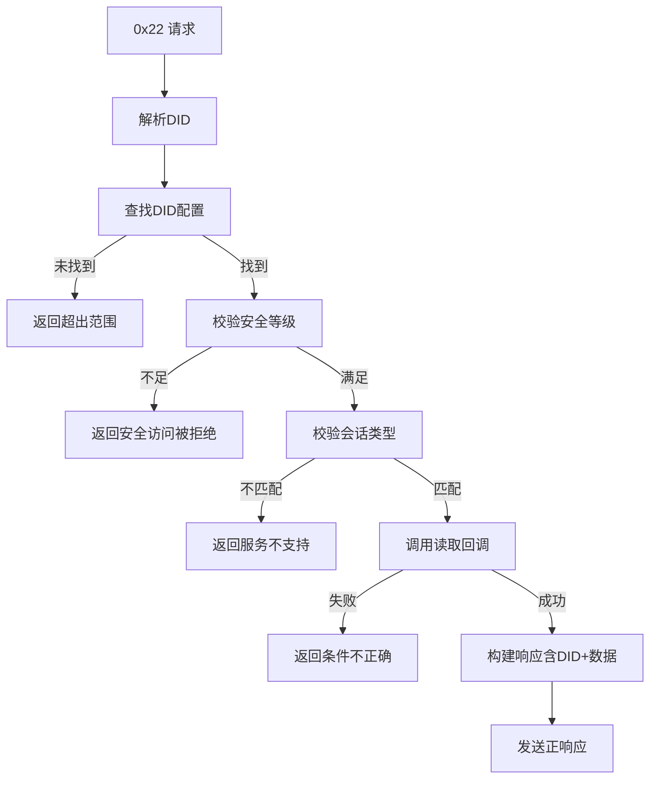
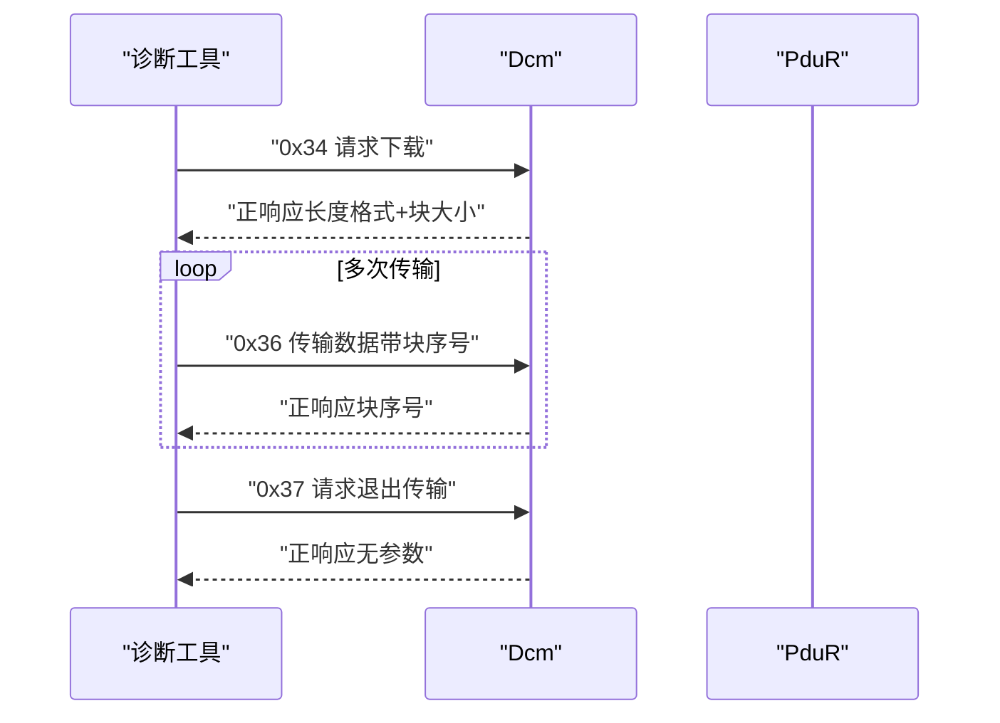
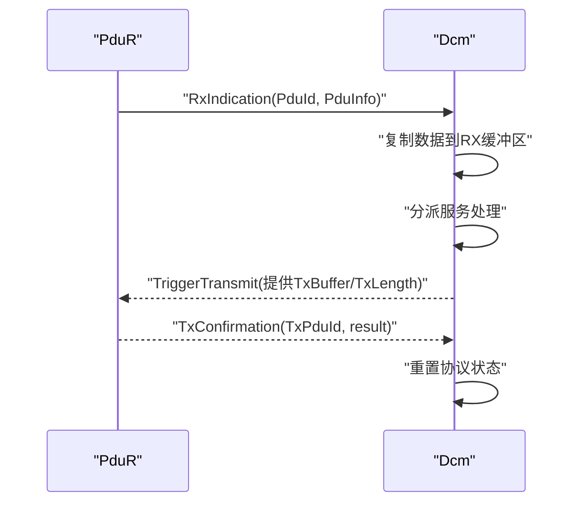
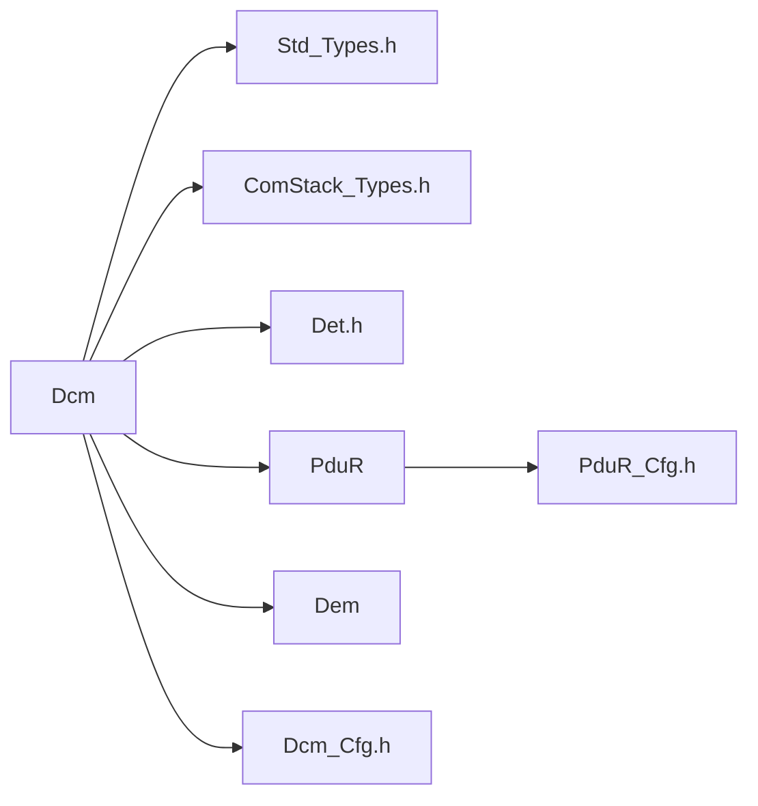

# 诊断通信管理器（Dcm）

<cite>
**本文档引用的文件**
- [Dcm.h](file://src/bsw/services/dcm/include/Dcm.h)
- [Dcm.c](file://src/bsw/services/dcm/src/Dcm.c)
- [Dcm_Cfg.h](file://src/bsw/services/dcm/include/Dcm_Cfg.h)
- [Dcm_test.c](file://src/bsw/services/dcm/src/Dcm_test.c)
- [Std_Types.h](file://src/bsw/common/Std_Types.h)
- [ComStack_Types.h](file://src/bsw/common/ComStack_Types.h)
- [Det.h](file://src/bsw/common/Det.h)
- [Dem.h](file://src/bsw/services/dem/include/Dem.h)
- [modules.md](file://docs/modules.md)
- [development-guide.md](file://docs/development-guide.md)
- [PduR_Cfg.h](file://src/bsw/config/templates/PduR_Cfg.h)
</cite>

## 目录
1. [简介](#简介)
2. [项目结构](#项目结构)
3. [核心组件](#核心组件)
4. [架构总览](#架构总览)
5. [详细组件分析](#详细组件分析)
6. [依赖关系分析](#依赖关系分析)
7. [性能考虑](#性能考虑)
8. [故障排除指南](#故障排除指南)
9. [结论](#结论)
10. [附录](#附录)

## 简介
诊断通信管理器（Dcm）是遵循AutoSAR Classic Platform 4.x标准的服务层模块，负责实现UDS（统一诊断服务）协议与OBD-II诊断协议。该模块提供诊断会话管理、安全访问控制、DID/RID数据读写、DTC信息查询与清除、以及数据下载/上传等核心诊断功能。Dcm通过PduR进行PDU路由，并与Dem协作管理诊断事件与故障码。

## 项目结构
Dcm模块位于服务层，采用AutoSAR分层架构：
- 头文件：Dcm.h（公共接口）、Dcm_Cfg.h（编译期配置）
- 实现文件：Dcm.c（核心逻辑）
- 测试文件：Dcm_test.c（单元测试）
- 依赖类型：Std_Types.h、ComStack_Types.h、Det.h
- 集成接口：Dem.h（DTC管理）、PduR（PDU路由）

**图表来源**
- [modules.md:340-376](file://docs/modules.md#L340-L376)
- [PduR_Cfg.h:33-49](file://src/bsw/config/templates/PduR_Cfg.h#L33-L49)

**章节来源**
- [modules.md:282-298](file://docs/modules.md#L282-L298)
- [PduR_Cfg.h:1-72](file://src/bsw/config/templates/PduR_Cfg.h#L1-L72)

## 核心组件
Dcm模块的核心组件包括：
- 诊断服务处理：会话控制、ECU复位、安全访问、测试仪在线、DID读写、DTC信息、程序刷写等
- 会话与安全：默认/编程/扩展诊断会话、安全等级管理、尝试次数限制与延迟
- 数据结构：DID配置、RID配置、消息上下文、内部状态
- 回调接口：RxIndication、TxConfirmation、TriggerTransmit、MainFunction

关键数据类型与配置：
- 会话类型：默认、编程、扩展诊断、安全系统诊断
- 安全等级：锁定、等级1、等级2
- 协议类型：OBD-on-CAN、UDS-on-CAN、UDS-on-FlexRay、UDS-on-IP
- 缓冲区大小：RX/TX均为256字节
- 时间参数：P2最大、P2*最大、S3服务器超时

**章节来源**
- [Dcm.h:133-156](file://src/bsw/services/dcm/include/Dcm.h#L133-L156)
- [Dcm.h:208-263](file://src/bsw/services/dcm/include/Dcm.h#L208-L263)
- [Dcm_Cfg.h:39-52](file://src/bsw/services/dcm/include/Dcm_Cfg.h#L39-L52)
- [Dcm_Cfg.h:114-123](file://src/bsw/services/dcm/include/Dcm_Cfg.h#L114-L123)

## 架构总览
Dcm的运行时架构：
- 初始化阶段：加载配置、初始化协议状态、会话与安全状态
- 请求处理：RxIndication接收PDU → 解析服务ID → 分派到对应服务处理函数 → 生成正/负响应
- 周期处理：MainFunction维护S3超时、P2超时、安全尝试延迟
- 传输接口：通过PduR进行发送（TriggerTransmit提供TX数据），接收完成后回调TxConfirmation

**图表来源**
- [Dcm.c:1271-1340](file://src/bsw/services/dcm/src/Dcm.c#L1271-L1340)
- [Dcm.c:1192-1245](file://src/bsw/services/dcm/src/Dcm.c#L1192-L1245)
- [Dem.h:1-200](file://src/bsw/services/dem/include/Dem.h#L1-L200)

## 详细组件分析

### 初始化流程（Dcm_Init）
初始化过程包括：
- 参数校验（DET错误检测）
- 存储配置指针
- 初始化当前会话为默认会话
- 初始化安全等级为锁定
- 清零安全尝试计数与延迟标志
- 初始化下载/传输状态（禁用）
- 初始化各协议状态（空闲、计时器、响应挂起标志）

**图表来源**
- [Dcm.c:1120-1163](file://src/bsw/services/dcm/src/Dcm.c#L1120-L1163)

**章节来源**
- [Dcm.c:1120-1163](file://src/bsw/services/dcm/src/Dcm.c#L1120-L1163)

### 服务请求解析与响应生成
Dcm根据服务ID分派到具体处理函数：
- 诊断会话控制（0x10）：切换会话并返回P2/P2*时间
- ECU复位（0x11）：执行复位类型选择
- 安全访问（0x27）：种子密钥流程，支持尝试次数限制与延迟
- 测试仪在线（0x3E）：刷新S3计时器
- 读取数据标识符（0x22）：查找DID配置、校验安全等级与会话类型后读取
- 写入数据标识符（0x2E）：同上但执行写入
- 读取DTC信息（0x19）：支持多种子功能（数量、DTC列表、扩展数据等）
- 清除诊断信息（0x14）：清除DTC
- 路由控制（0x31）：启动/停止/查询诊断例程
- 请求下载（0x34）、传输数据（0x36）、请求退出传输（0x37）：刷写流程

**图表来源**
- [Dcm.c:1046-1111](file://src/bsw/services/dcm/src/Dcm.c#L1046-L1111)
- [Dcm.c:238-413](file://src/bsw/services/dcm/src/Dcm.c#L238-L413)
- [Dcm.c:458-595](file://src/bsw/services/dcm/src/Dcm.c#L458-L595)
- [Dcm.c:598-763](file://src/bsw/services/dcm/src/Dcm.c#L598-L763)
- [Dcm.c:789-899](file://src/bsw/services/dcm/src/Dcm.c#L789-L899)
- [Dcm.c:905-1041](file://src/bsw/services/dcm/src/Dcm.c#L905-L1041)

**章节来源**
- [Dcm.c:1046-1111](file://src/bsw/services/dcm/src/Dcm.c#L1046-L1111)
- [Dcm.c:238-413](file://src/bsw/services/dcm/src/Dcm.c#L238-L413)
- [Dcm.c:458-595](file://src/bsw/services/dcm/src/Dcm.c#L458-L595)
- [Dcm.c:598-763](file://src/bsw/services/dcm/src/Dcm.c#L598-L763)
- [Dcm.c:789-899](file://src/bsw/services/dcm/src/Dcm.c#L789-L899)
- [Dcm.c:905-1041](file://src/bsw/services/dcm/src/Dcm.c#L905-L1041)

### 会话管理与安全访问
- 会话类型：默认、编程、扩展诊断、安全系统诊断
- 安全等级：锁定、等级1、等级2
- 安全访问流程：
  - 子功能高位为0：请求种子，生成固定种子序列
  - 子功能高位为1：提交密钥，与期望密钥比较
  - 尝试次数超过上限触发延迟，延迟结束后允许重试
- S3超时：测试仪在线服务刷新S3计时器；S3到期自动回到默认会话并重置安全等级

**图表来源**
- [Dcm.c:238-280](file://src/bsw/services/dcm/src/Dcm.c#L238-L280)
- [Dcm.c:418-453](file://src/bsw/services/dcm/src/Dcm.c#L418-L453)
- [Dcm.c:1192-1245](file://src/bsw/services/dcm/src/Dcm.c#L1192-L1245)

**章节来源**
- [Dcm.c:238-280](file://src/bsw/services/dcm/src/Dcm.c#L238-L280)
- [Dcm.c:329-413](file://src/bsw/services/dcm/src/Dcm.c#L329-L413)
- [Dcm.c:418-453](file://src/bsw/services/dcm/src/Dcm.c#L418-L453)
- [Dcm.c:1192-1245](file://src/bsw/services/dcm/src/Dcm.c#L1192-L1245)

### DID与RID配置与处理
- DID配置：包含DID值、数据长度、会话类型、安全等级及读写回调函数
- RID配置：包含RID、会话类型、安全等级及开始/停止/查询结果回调函数
- 查找机制：通过DID/RID值在配置表中定位，若未找到返回“超出范围”
- 权限校验：当前安全等级必须满足配置要求，否则返回“安全访问被拒绝”

**图表来源**
- [Dcm.h:208-227](file://src/bsw/services/dcm/include/Dcm.h#L208-L227)
- [Dcm.h:247-263](file://src/bsw/services/dcm/include/Dcm.h#L247-L263)

**章节来源**
- [Dcm.h:208-227](file://src/bsw/services/dcm/include/Dcm.h#L208-L227)
- [Dcm.h:247-263](file://src/bsw/services/dcm/include/Dcm.h#L247-L263)
- [Dcm.c:135-176](file://src/bsw/services/dcm/src/Dcm.c#L135-L176)

### 诊断服务ID处理逻辑
- 读取PID（0x22）：解析DID → 查找配置 → 安全校验 → 会话校验 → 调用读取回调 → 返回正响应
- 写入PID（0x2E）：解析DID → 查找配置 → 安全校验 → 会话校验 → 调用写入回调 → 返回正响应
- 冻结帧与故障码（0x19）：支持按状态掩码统计/列出DTC，扩展数据记录查询
- 清除故障码（0x14）：清除DTC（简化实现）
- 多路复用：通过DID配置数组支持多个数据标识符

**图表来源**
- [Dcm.c:458-524](file://src/bsw/services/dcm/src/Dcm.c#L458-L524)

**章节来源**
- [Dcm.c:458-524](file://src/bsw/services/dcm/src/Dcm.c#L458-L524)
- [Dcm.c:598-763](file://src/bsw/services/dcm/src/Dcm.c#L598-L763)

### 异步服务与数据传输
- 异步服务：通过MainFunction周期性处理P2超时、S3超时、安全延迟
- 数据传输（刷写）：请求下载（0x34）→ 传输数据（0x36）→ 请求退出传输（0x37）
- 传输状态：地址、大小、偏移、块序号、活跃标志

**图表来源**
- [Dcm.c:905-1041](file://src/bsw/services/dcm/src/Dcm.c#L905-L1041)

**章节来源**
- [Dcm.c:905-1041](file://src/bsw/services/dcm/src/Dcm.c#L905-L1041)

### 回调接口与集成
- RxIndication：接收PDU后复制到RX缓冲区并进入处理状态
- TxConfirmation：传输完成后重置协议状态
- TriggerTransmit：提供TX缓冲区与长度给PduR
- MainFunction：周期性处理超时与安全延迟

**图表来源**
- [Dcm.c:1271-1340](file://src/bsw/services/dcm/src/Dcm.c#L1271-L1340)

**章节来源**
- [Dcm.c:1271-1340](file://src/bsw/services/dcm/src/Dcm.c#L1271-L1340)

## 依赖关系分析
Dcm模块的依赖关系：
- 内部依赖：Std_Types.h、ComStack_Types.h、Det.h
- 外部依赖：PduR（PDU路由）、Dem（DTC管理）
- 配置依赖：Dcm_Cfg.h（编译期配置）、PduR_Cfg.h（PDU ID映射）

**图表来源**
- [Dcm.h:20-22](file://src/bsw/services/dcm/include/Dcm.h#L20-L22)
- [Dcm.c:19-24](file://src/bsw/services/dcm/src/Dcm.c#L19-L24)
- [PduR_Cfg.h:33-49](file://src/bsw/config/templates/PduR_Cfg.h#L33-L49)

**章节来源**
- [Dcm.h:20-22](file://src/bsw/services/dcm/include/Dcm.h#L20-L22)
- [Dcm.c:19-24](file://src/bsw/services/dcm/src/Dcm.c#L19-L24)
- [PduR_Cfg.h:33-49](file://src/bsw/config/templates/PduR_Cfg.h#L33-L49)

## 性能考虑
- 缓冲区大小：RX/TX均为256字节，适合典型诊断报文
- 超时参数：P2最大50ms、P2*最大5000ms、S3服务器5000ms
- 主函数周期：10ms，确保及时处理超时与安全延迟
- 传输块大小：1024字节，平衡吞吐与内存占用
- 错误检测：启用DET可快速定位错误，建议在开发阶段保持开启

## 故障排除指南
常见错误与处理：
- 未初始化调用：RxIndication/TriggerTransmit/TxConfirmation在未初始化状态下调用将报告DET错误
- 参数指针为空：Init/TriggerTransmit等接口参数为空时报告DET错误
- 服务不支持：未知服务ID或子功能不支持返回“服务不支持”负响应
- 安全访问被拒绝：当前安全等级不足返回“安全访问被拒绝”
- 请求超出范围：DID/RID不在配置范围内返回“超出范围”
- 条件不正确：读写回调失败或DTC查询失败返回“条件不正确”
- 超出最大响应长度：P2超时触发“响应过长”负响应

调试建议：
- 启用DET错误检测，结合日志输出定位问题
- 使用单元测试验证关键路径（会话切换、DID读写、安全访问）
- 通过GDB单步跟踪协议状态变化

**章节来源**
- [Dcm.c:1271-1340](file://src/bsw/services/dcm/src/Dcm.c#L1271-L1340)
- [Dcm_test.c:146-158](file://src/bsw/services/dcm/src/Dcm_test.c#L146-L158)
- [Dcm_test.c:220-238](file://src/bsw/services/dcm/src/Dcm_test.c#L220-L238)

## 结论
Dcm模块实现了完整的UDS诊断协议栈，具备会话管理、安全访问、DID/RID处理、DTC管理与数据传输能力。其模块化设计便于扩展与维护，配合PduR与Dem形成完整的诊断解决方案。通过合理的配置与严格的错误处理，Dcm能够稳定地服务于车载诊断需求。

## 附录

### UDS服务与NRC对照
- 服务支持：诊断会话控制、ECU复位、安全访问、测试仪在线、读写DID、读取DTC信息、清除DTC、路由控制、请求下载/传输数据/请求退出传输
- NRC错误：包含服务不支持、子功能不支持、消息长度无效、响应过长、忙重复请求、条件不正确、请求越界、安全访问被拒绝、密钥无效、超出尝试次数、等待时间未过期等

**章节来源**
- [Dcm.h:78-129](file://src/bsw/services/dcm/include/Dcm.h#L78-L129)
- [Dcm.h:161-203](file://src/bsw/services/dcm/include/Dcm.h#L161-L203)