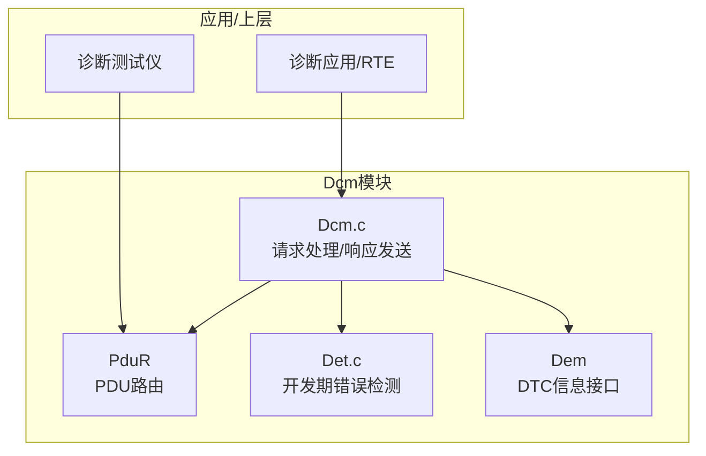
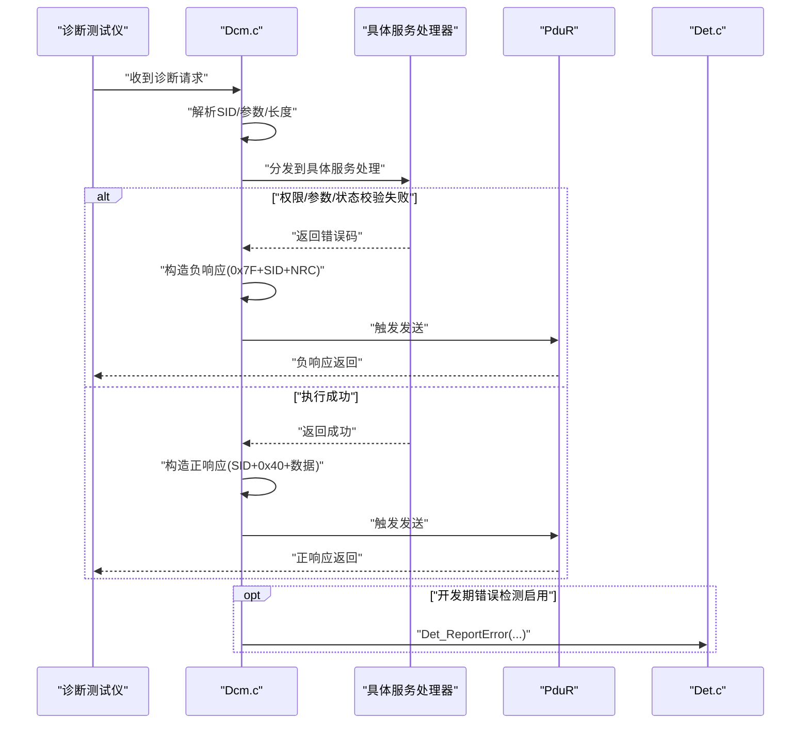
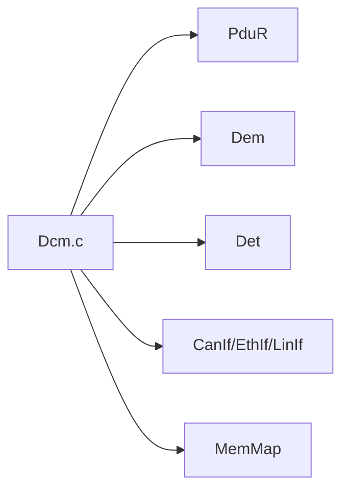

# 负响应码与错误处理

<cite>
**本文档引用的文件**
- [Dcm.h](file://src/bsw/services/dcm/include/Dcm.h)
- [Dcm.c](file://src/bsw/services/dcm/src/Dcm.c)
- [Dcm_Cfg.h](file://src/bsw/services/dcm/include/Dcm_Cfg.h)
- [Dcm_spec.md](file://openspec/changes/dev-dcm-dem-module/specs/Dcm_spec.md)
- [Det.c](file://src/bsw/common/Det.c)
- [Det.h](file://src/bsw/common/Det.h)
- [Dcm_test.c](file://src/bsw/services/dcm/src/Dcm_test.c)
</cite>

## 目录
1. [简介](#简介)
2. [项目结构](#项目结构)
3. [核心组件](#核心组件)
4. [架构总览](#架构总览)
5. [详细组件分析](#详细组件分析)
6. [依赖关系分析](#依赖关系分析)
7. [性能考虑](#性能考虑)
8. [故障排查指南](#故障排查指南)
9. [结论](#结论)

## 简介
本文件面向Dcm（诊断通信管理器）模块的负响应码与错误处理，系统性梳理了AutoSAR Classic平台下的UDS协议错误码体系、触发条件、处理流程与传播机制，并提供开发期错误检测（DET）与客户端处理建议。内容覆盖：
- 完整负响应码枚举与语义
- 各类错误条件的触发时机与处理逻辑
- 错误码生成规则、传播路径与客户端处理建议
- DEV错误检测的实现要点（参数校验、边界检查、状态一致性）
- 最佳实践、调试技巧与常见问题排查

## 项目结构
Dcm模块位于服务层，负责UDS/OBD诊断协议处理、会话管理、安全访问控制、DID/RID管理以及数据传输等。错误处理贯穿于请求解析、权限校验、业务执行与响应发送的全链路。

图表来源
- [Dcm.c:1046-1111](file://src/bsw/services/dcm/src/Dcm.c#L1046-L1111)
- [Dcm.h:279-379](file://src/bsw/services/dcm/include/Dcm.h#L279-L379)

章节来源
- [Dcm.h:1-379](file://src/bsw/services/dcm/include/Dcm.h#L1-L379)
- [Dcm.c:1-1455](file://src/bsw/services/dcm/src/Dcm.c#L1-L1455)

## 核心组件
- 负响应码类型：定义在头文件中，覆盖通用拒绝、服务不支持、子功能不支持、消息长度错误、请求超范围、安全访问拒绝、密钥无效、尝试次数过多、时间延迟未过期、上传下载不被接受、传输暂停、编程失败、块序号错误、请求已接收待响应、活动会话下服务/子功能不支持、以及多种运行条件相关错误等。
- 请求处理函数：按服务ID分发到具体处理函数，如会话控制、ECU复位、安全访问、测试员存在、读写DID、读取DTC信息、例行程序控制、请求下载/传输数据/退出等。
- 响应发送：正响应与负响应均通过统一发送函数构建并经PduR转发。
- 开发期错误检测（DET）：在配置开启时对非法调用、空指针、参数错误等情况进行报告。

章节来源
- [Dcm.h:158-203](file://src/bsw/services/dcm/include/Dcm.h#L158-L203)
- [Dcm.c:1046-1111](file://src/bsw/services/dcm/src/Dcm.c#L1046-L1111)
- [Dcm.c:212-233](file://src/bsw/services/dcm/src/Dcm.c#L212-L233)
- [Dcm_spec.md:169-190](file://openspec/changes/dev-dcm-dem-module/specs/Dcm_spec.md#L169-L190)

## 架构总览
Dcm的错误处理遵循“请求解析—权限校验—业务执行—响应发送”的流水线。错误在任一阶段发生即生成对应负响应码并通过PduR返回给诊断测试仪。

图表来源
- [Dcm.c:1046-1111](file://src/bsw/services/dcm/src/Dcm.c#L1046-L1111)
- [Dcm.c:212-233](file://src/bsw/services/dcm/src/Dcm.c#L212-L233)
- [Dcm_spec.md:169-190](file://openspec/changes/dev-dcm-dem-module/specs/Dcm_spec.md#L169-L190)

## 详细组件分析

### 负响应码枚举与语义
- 通用拒绝：用于一般性拒绝场景。
- 服务不支持：请求的服务SID不在当前实现或会话允许范围内。
- 子功能不支持：请求的子功能超出支持范围。
- 消息长度错误/格式无效：请求长度不足或格式不符合协议。
- 响应过长：服务器无法在规定时间内完成响应。
- 条件不正确：业务前置条件不满足（如读写DID时底层读写函数返回失败）。
- 请求序列错误：数据传输阶段顺序错误（如未按序发送块）。
- 无子网组件响应：网络或子系统无响应。
- 执行请求动作失败：底层执行失败。
- 请求超范围：请求的DID/RID不存在或越界。
- 安全访问拒绝：安全级别不足。
- 密钥无效：安全访问阶段提供的密钥不匹配。
- 尝试次数过多：超过最大尝试次数后触发锁定。
- 时间延迟未过期：安全访问尝试间隔未满足要求。
- 上传/下载不被接受、传输暂停、编程失败、块序号错误、请求已正确接收待响应、活动会话下服务/子功能不支持。
- 运行条件相关：转速过高/过低、发动机运行/未运行、运行时间过短、温度过高/过低、车速过高/过低、油门踏板位置异常、变速箱不在空档/前进档、刹车开关未闭合、档杆不在P档、变矩器离合器锁死、电压过高/过低等。

章节来源
- [Dcm.h:161-203](file://src/bsw/services/dcm/include/Dcm.h#L161-L203)

### 错误码生成规则与传播机制
- 生成规则
  - 正响应：SID + 0x40 + 数据
  - 负响应：固定字节0x7F + 原始SID + NRC
- 传播路径
  - 由具体服务处理器根据校验结果选择合适的NRC
  - 统一通过发送函数写入协议缓冲区并触发PduR传输
  - 客户端（诊断测试仪）收到0x7F开头的响应后，解析SID与NRC进行处理

章节来源
- [Dcm.c:181-233](file://src/bsw/services/dcm/src/Dcm.c#L181-L233)

### 典型服务的错误处理流程

#### 会话控制（0x10）
- 触发条件
  - 参数长度不足：发送消息长度错误
  - 子功能不支持：发送子功能不支持
- 处理逻辑
  - 验证子功能值是否在允许范围内
  - 更新当前会话并返回正响应（含P2/P2*）

章节来源
- [Dcm.c:238-280](file://src/bsw/services/dcm/src/Dcm.c#L238-L280)

#### ECU复位（0x11）
- 触发条件
  - 参数长度不足：发送消息长度错误
  - 子功能不支持：发送子功能不支持
- 处理逻辑
  - 验证复位类型并返回正响应（含复位类型）
  - 实际复位操作由上层MCU模块执行（示例注释）

章节来源
- [Dcm.c:285-324](file://src/bsw/services/dcm/src/Dcm.c#L285-L324)

#### 安全访问（0x27）
- 触发条件
  - 请求种子阶段
    - 安全尝试次数过多：发送尝试次数过多，并启动安全延迟计时
    - 安全延迟未过期：发送时间延迟未过期
    - 参数长度不足：发送消息长度错误
  - 发送密钥阶段
    - 密钥长度不足：发送消息长度错误
    - 密钥无效：发送密钥无效
- 处理逻辑
  - 种子请求：生成种子并返回正响应
  - 密钥校验：校验通过则提升安全级别并清零尝试次数；失败则增加尝试次数并返回负响应

章节来源
- [Dcm.c:329-413](file://src/bsw/services/dcm/src/Dcm.c#L329-L413)

#### 测试员存在（0x3E）
- 触发条件
  - 参数长度不足：发送消息长度错误
  - 子功能不支持：发送子功能不支持
- 处理逻辑
  - 更新S3定时器保持会话活跃
  - subFunction=0x00时返回正响应，0x80时不返回响应（抑制）

章节来源
- [Dcm.c:418-453](file://src/bsw/services/dcm/src/Dcm.c#L418-L453)

#### 读取数据（0x22）
- 触发条件
  - 参数长度不足：发送消息长度错误
  - DID不存在：发送请求超范围
  - 安全级别不足：发送安全访问拒绝
  - 会话类型不匹配：发送服务不支持
  - 底层读取失败：发送条件不正确
- 处理逻辑
  - 查找DID配置
  - 校验安全级别与会话类型
  - 调用注册的读取函数，成功则返回正响应，失败则返回负响应

章节来源
- [Dcm.c:458-524](file://src/bsw/services/dcm/src/Dcm.c#L458-L524)

#### 写入数据（0x2E）
- 触发条件
  - 参数长度不足：发送消息长度错误
  - DID不存在：发送请求超范围
  - 安全级别不足：发送安全访问拒绝
  - 会话类型不匹配：发送服务不支持
  - 底层写入失败：发送条件不正确
- 处理逻辑
  - 查找DID配置
  - 校验安全级别与会话类型
  - 调用注册的写入函数，成功则返回正响应（仅DID），失败则返回负响应

章节来源
- [Dcm.c:529-595](file://src/bsw/services/dcm/src/Dcm.c#L529-L595)

#### 例行程序控制（0x31）
- 触发条件
  - 参数长度不足：发送消息长度错误
  - RID不存在：发送请求超范围
  - 安全级别不足：发送安全访问拒绝
  - 会话类型不匹配：发送服务不支持
  - 子功能不支持：发送子功能不支持
  - 底层执行失败：发送条件不正确
- 处理逻辑
  - 查找RID配置
  - 校验安全级别与会话类型
  - 分派Start/Stop/RequestResult并返回相应响应

章节来源
- [Dcm.c:791-899](file://src/bsw/services/dcm/src/Dcm.c#L791-L899)

#### 请求下载（0x34）
- 触发条件
  - 参数长度不足：发送消息长度错误
  - 地址/大小字段长度不匹配：发送消息长度错误
- 处理逻辑
  - 解析地址与大小，初始化传输状态并返回正响应（含最大块长）

章节来源
- [Dcm.c:905-967](file://src/bsw/services/dcm/src/Dcm.c#L905-L967)

#### 传输数据（0x36）
- 触发条件
  - 传输未开始：发送请求序列错误
  - 参数长度不足：发送消息长度错误
  - 块序号错误：发送块序号错误
- 处理逻辑
  - 校验块序号连续性，更新偏移量并返回正响应（含块序号）

章节来源
- [Dcm.c:972-1014](file://src/bsw/services/dcm/src/Dcm.c#L972-L1014)

#### 请求传输退出（0x37）
- 触发条件
  - 传输未开始：发送请求序列错误
- 处理逻辑
  - 结束传输会话并返回正响应（无参数）

章节来源
- [Dcm.c:1019-1041](file://src/bsw/services/dcm/src/Dcm.c#L1019-L1041)

### 开发期错误检测（DET）
当配置开启时，以下API在非法状态下会通过Det_ReportError上报错误：
- Dcm_Init：ConfigPtr为空指针
- Dcm_DeInit：模块未初始化
- Dcm_RxIndication：模块未初始化或PduInfoPtr为空指针
- Dcm_TxConfirmation：模块未初始化
- Dcm_TriggerTransmit：模块未初始化或PduInfoPtr为空指针

章节来源
- [Dcm_spec.md:169-190](file://openspec/changes/dev-dcm-dem-module/specs/Dcm_spec.md#L169-L190)
- [Dcm.c:1120-1187](file://src/bsw/services/dcm/src/Dcm.c#L1120-L1187)
- [Dcm.c:1271-1340](file://src/bsw/services/dcm/src/Dcm.c#L1271-L1340)

### 客户端处理建议
- 对于通用拒绝（0x10）、服务不支持（0x11）、子功能不支持（0x12）、消息长度错误（0x13）：通常表示请求格式或上下文不正确，建议重试前先确认协议版本、会话状态与安全级别。
- 对于请求超范围（0x31）、安全访问拒绝（0x33）：需检查DID/RID是否存在、当前会话是否允许以及安全级别是否足够。
- 对于密钥无效（0x35）、尝试次数过多（0x36）、时间延迟未过期（0x37）：遵循安全策略，等待冷却时间或重新请求种子。
- 对于请求序列错误（0x24）、块序号错误（0x73）：确保严格按序发送数据块，必要时从头重传。
- 对于上传/下载不被接受（0x70）、传输暂停（0x71）、编程失败（0x72）：检查目标存储介质与容量、擦写状态及电源稳定性。
- 对于活动会话下服务/子功能不支持（0x7E/0x7F）：切换到合适会话后再重试。
- 对于运行条件相关错误（如转速、温度、车速、档位、刹车等）：满足物理条件后再发起请求。

章节来源
- [Dcm.h:161-203](file://src/bsw/services/dcm/include/Dcm.h#L161-L203)

## 依赖关系分析
- 上层依赖：应用/RTE、PduR（消息路由）、Dem（DTC信息）
- 下层依赖：CanIf/EthIf/LinIf（通信接口）、MemMap（内存段）
- 同层依赖：Det（开发期错误检测）

图表来源
- [Dcm.h:279-379](file://src/bsw/services/dcm/include/Dcm.h#L279-L379)
- [Dcm_spec.md:259-275](file://openspec/changes/dev-dcm-dem-module/specs/Dcm_spec.md#L259-L275)

章节来源
- [Dcm.h:279-379](file://src/bsw/services/dcm/include/Dcm.h#L279-L379)
- [Dcm_spec.md:259-275](file://openspec/changes/dev-dcm-dem-module/specs/Dcm_spec.md#L259-L275)

## 性能考虑
- 缓冲区大小：RX/TX缓冲区大小受配置限制，避免过大导致内存压力，过小导致截断。
- 定时器管理：S3/P2定时器用于会话保活与响应等待，需在主函数周期内及时更新。
- 传输状态：数据下载/上传采用块序号与偏移量跟踪，合理设置块大小以平衡吞吐与可靠性。
- DET开销：开发期错误检测在调试阶段非常有用，但在生产阶段可关闭以减少开销。

章节来源
- [Dcm_Cfg.h:77-115](file://src/bsw/services/dcm/include/Dcm_Cfg.h#L77-L115)
- [Dcm.c:1192-1245](file://src/bsw/services/dcm/src/Dcm.c#L1192-L1245)

## 故障排查指南
- 常见错误与定位
  - 参数错误：检查请求长度、格式与字段含义
  - 权限不足：确认当前会话与安全级别
  - 业务失败：检查底层读写/执行函数返回值
  - 传输异常：核对块序号、偏移量与块大小
- 调试技巧
  - 使用单元测试框架验证各服务路径
  - 在关键路径打印或断点捕获NRC生成点
  - 利用DET错误日志定位非法调用
- 单元测试参考
  - 初始化与版本信息
  - 会话控制、读写DID、测试员存在
  - 未初始化时的DET错误上报

章节来源
- [Dcm_test.c:135-274](file://src/bsw/services/dcm/src/Dcm_test.c#L135-L274)
- [Dcm_spec.md:169-190](file://openspec/changes/dev-dcm-dem-module/specs/Dcm_spec.md#L169-L190)

## 结论
Dcm模块通过标准化的负响应码与严格的错误处理流程，实现了对UDS/OBD诊断请求的可靠响应。结合DET开发期错误检测与完善的单元测试，能够在开发与集成阶段快速定位问题，保障诊断通信的稳定性与安全性。建议在实际部署中：
- 明确各服务的错误码映射与客户端处理策略
- 严格遵循请求序列与会话/安全策略
- 在生产环境评估DET开关的成本与收益
- 建立基于NRC的自动化诊断与告警机制