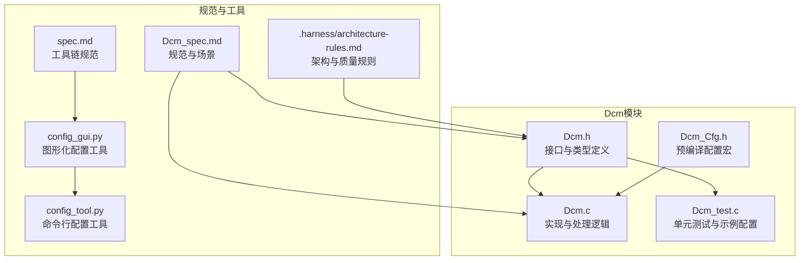
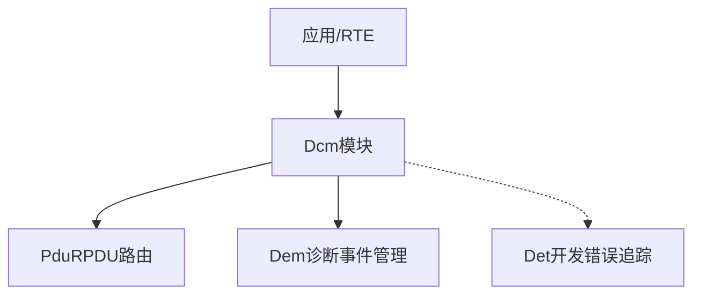
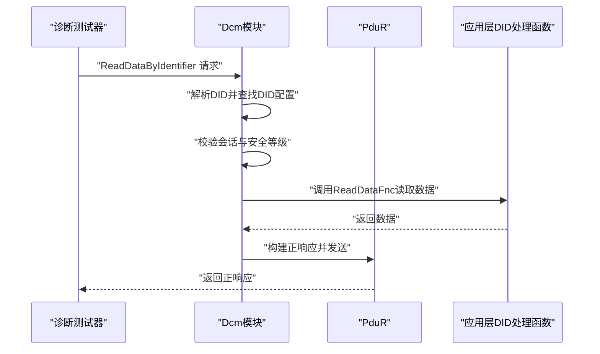
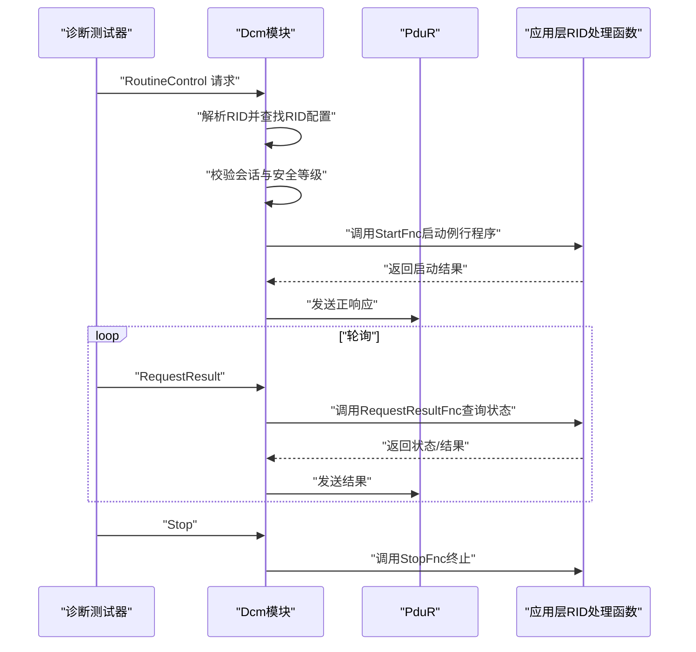
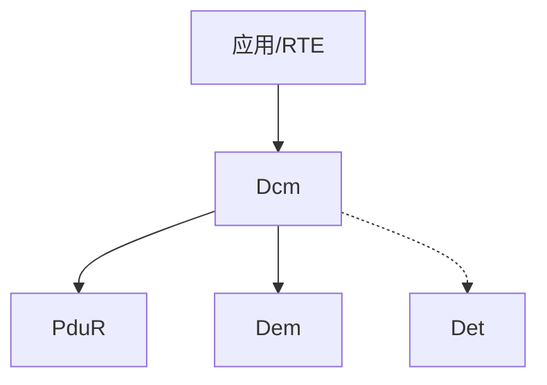

# 配置API与接口规范

<cite>
**本文引用的文件**
- [Dcm.h](file://src/bsw/services/dcm/include/Dcm.h)
- [Dcm_Cfg.h](file://src/bsw/services/dcm/include/Dcm_Cfg.h)
- [Dcm.c](file://src/bsw/services/dcm/src/Dcm.c)
- [Dcm_test.c](file://src/bsw/services/dcm/src/Dcm_test.c)
- [Dcm_spec.md](file://openspec/changes/dev-dcm-dem-module/specs/Dcm_spec.md)
- [config_gui.py](file://tools/config/gui/config_gui.py)
- [config_tool.py](file://tools/config/src/config_tool.py)
- [architecture-rules.md](file://.harness/architecture-rules.md)
- [spec.md](file://openspec/specs/toolchain/spec.md)
</cite>

## 目录
1. [简介](#简介)
2. [项目结构](#项目结构)
3. [核心组件](#核心组件)
4. [架构总览](#架构总览)
5. [详细组件分析](#详细组件分析)
6. [依赖关系分析](#依赖关系分析)
7. [性能考量](#性能考量)
8. [故障排查指南](#故障排查指南)
9. [结论](#结论)
10. [附录](#附录)

## 简介
本文件面向Dcm配置API与接口规范模块，系统化阐述Dcm_DIDConfigType与Dcm_RIDConfigType配置结构体的设计原理、字段语义与使用方法；详解DID读写函数指针与RID函数指针的实现约束；文档化Dcm_ConfigType全局配置结构体的字段含义与配置方法；解释DevErrorDetect开发错误检测开关的作用与配置路径；并提供配置文件生成工具使用指南、配置验证规则与接口规范最佳实践，辅以完整配置示例与常见配置模式，帮助开发者在AutoSAR Classic Platform 4.x环境下正确、安全地完成Dcm模块的配置与集成。

## 项目结构
围绕Dcm模块的配置与接口规范，相关文件分布如下：
- 接口与类型定义：src/bsw/services/dcm/include/Dcm.h
- 预编译配置宏：src/bsw/services/dcm/include/Dcm_Cfg.h
- 实现与处理逻辑：src/bsw/services/dcm/src/Dcm.c
- 单元测试与示例配置：src/bsw/services/dcm/src/Dcm_test.c
- 规范与场景说明：openspec/changes/dev-dcm-dem-module/specs/Dcm_spec.md
- 配置工具GUI与CLI：tools/config/gui/config_gui.py、tools/config/src/config_tool.py
- 工具链与质量规则：openspec/specs/toolchain/spec.md、.harness/architecture-rules.md

图表来源
- [Dcm.h:1-379](file://src/bsw/services/dcm/include/Dcm.h#L1-L379)
- [Dcm_Cfg.h:1-132](file://src/bsw/services/dcm/include/Dcm_Cfg.h#L1-L132)
- [Dcm.c:1-1455](file://src/bsw/services/dcm/src/Dcm.c#L1-L1455)
- [Dcm_test.c:1-274](file://src/bsw/services/dcm/src/Dcm_test.c#L1-L274)
- [Dcm_spec.md:1-283](file://openspec/changes/dev-dcm-dem-module/specs/Dcm_spec.md#L1-L283)
- [config_gui.py:1-419](file://tools/config/gui/config_gui.py#L1-L419)
- [config_tool.py:1-158](file://tools/config/src/config_tool.py#L1-L158)
- [spec.md:1-417](file://openspec/specs/toolchain/spec.md#L1-L417)
- [.harness/architecture-rules.md:89-233](file://.harness/architecture-rules.md#L89-L233)

章节来源
- [Dcm.h:1-379](file://src/bsw/services/dcm/include/Dcm.h#L1-L379)
- [Dcm_Cfg.h:1-132](file://src/bsw/services/dcm/include/Dcm_Cfg.h#L1-L132)
- [Dcm.c:1-1455](file://src/bsw/services/dcm/src/Dcm.c#L1-L1455)
- [Dcm_test.c:1-274](file://src/bsw/services/dcm/src/Dcm_test.c#L1-L274)
- [Dcm_spec.md:1-283](file://openspec/changes/dev-dcm-dem-module/specs/Dcm_spec.md#L1-L283)
- [config_gui.py:1-419](file://tools/config/gui/config_gui.py#L1-L419)
- [config_tool.py:1-158](file://tools/config/src/config_tool.py#L1-L158)
- [spec.md:1-417](file://openspec/specs/toolchain/spec.md#L1-L417)
- [.harness/architecture-rules.md:89-233](file://.harness/architecture-rules.md#L89-L233)

## 核心组件
本节聚焦Dcm配置API与接口规范的关键数据结构与全局配置对象，明确其字段含义、约束与使用方式。

- Dcm_DIDConfigType
  - 字段含义
    - DID：数据标识符（16位），用于唯一标识ECU内部数据项
    - DataLength：数据长度（16位），指示该DID对应的数据字节数
    - SessionType：会话类型（8位），限制该DID可在哪些诊断会话中访问
    - SecurityLevel：安全等级（8位），访问该DID所需的最低安全级别
    - ReadDataFnc：读取函数指针，返回值遵循Std_ReturnType约定
    - WriteDataFnc：写入函数指针，返回值遵循Std_ReturnType约定
  - 设计要点
    - 通过SessionType与SecurityLevel实现访问控制
    - 通过函数指针解耦应用层数据读写逻辑
    - DataLength与实际读写函数返回数据长度需一致，避免缓冲区溢出

- Dcm_RIDConfigType
  - 字段含义
    - RID：请求标识符（16位），用于标识特定的诊断例行程序
    - SessionType：会话类型（8位），限制该RID可在哪些诊断会话中执行
    - SecurityLevel：安全等级（8位），执行该RID所需的最低安全级别
    - StartFnc：启动函数指针，负责启动例行程序
    - StopFnc：停止函数指针，负责终止例行程序
    - RequestResultFnc：查询结果函数指针，用于轮询或查询例行程序状态
  - 设计要点
    - 例行程序通常涉及长时间运行的任务，需配合状态机与定时器
    - 函数指针返回值遵循Std_ReturnType约定，便于统一错误处理

- Dcm_ConfigType（全局配置）
  - 字段含义
    - NumProtocols、NumConnections、NumRxPduIds、NumTxPduIds：协议与PDU相关数量
    - NumSessions、NumSecurityLevels、NumServices：会话、安全与服务数量
    - NumDIDs、NumRIDs：DID与RID数量
    - DIDs：DID配置数组指针
    - RIDs：RID配置数组指针
    - DevErrorDetect：开发错误检测开关
    - VersionInfoApi：版本信息API可用性
    - RespondAllRequest：是否响应所有请求
    - DcmTaskTime：任务时间统计开关
  - 使用方式
    - 在应用层定义静态常量配置数组，并初始化Dcm_ConfigType
    - 将Dcm_ConfigType实例传递给Dcm_Init进行初始化
    - 通过Dcm_MainFunction周期性调度，维持会话与超时管理

- DevErrorDetect开发错误检测开关
  - 作用：当开启时，DCM在关键API入口处进行参数与状态检查，若不合法则通过Det_ReportError上报错误码
  - 配置方法：在Dcm_Cfg.h中设置DCM_DEV_ERROR_DETECT宏为STD_ON/STD_OFF
  - 影响范围：Dcm_Init、Dcm_DeInit、Dcm_RxIndication、Dcm_TxConfirmation、Dcm_TriggerTransmit等

章节来源
- [Dcm.h:205-263](file://src/bsw/services/dcm/include/Dcm.h#L205-L263)
- [Dcm.h:265-379](file://src/bsw/services/dcm/include/Dcm.h#L265-L379)
- [Dcm_Cfg.h:15-132](file://src/bsw/services/dcm/include/Dcm_Cfg.h#L15-L132)
- [Dcm_spec.md:122-168](file://openspec/changes/dev-dcm-dem-module/specs/Dcm_spec.md#L122-L168)

## 架构总览
Dcm模块作为服务层模块，遵循AutoSAR Classic Platform 4.x标准，向上与应用/RTE交互，向下与PduR、Dem等模块协作。其配置通过Dcm_ConfigType集中管理，DID/RID通过函数指针与应用层解耦。

图表来源
- [Dcm_spec.md:259-276](file://openspec/changes/dev-dcm-dem-module/specs/Dcm_spec.md#L259-L276)
- [Dcm.h:276-379](file://src/bsw/services/dcm/include/Dcm.h#L276-L379)

## 详细组件分析

### Dcm_DIDConfigType与DID读写流程
- 设计原理
  - 通过DID映射到具体的数据项，结合会话与安全等级实现访问控制
  - 通过函数指针将读写操作委托给应用层，实现配置与实现解耦
- 处理流程（读取）
  - Dcm根据请求中的DID查找DID配置
  - 校验当前会话与安全等级是否满足要求
  - 调用ReadDataFnc读取数据，组装正响应并经PduR发送
- 处理流程（写入）
  - 查找RID配置，校验会话与安全等级
  - 调用WriteDataFnc写入数据，返回正响应

图表来源
- [Dcm.c:458-524](file://src/bsw/services/dcm/src/Dcm.c#L458-L524)
- [Dcm.h:205-215](file://src/bsw/services/dcm/include/Dcm.h#L205-L215)

章节来源
- [Dcm.c:458-595](file://src/bsw/services/dcm/src/Dcm.c#L458-L595)
- [Dcm.h:205-215](file://src/bsw/services/dcm/include/Dcm.h#L205-L215)

### Dcm_RIDConfigType与例行程序控制流程
- 设计原理
  - 通过StartFnc、StopFnc、RequestResultFnc三类函数指针分别控制例行程序的启动、停止与结果查询
  - 结合会话与安全等级实现访问控制
- 处理流程
  - Dcm根据请求中的RID查找RID配置
  - 校验会话与安全等级
  - 调用StartFnc启动例行程序，后续通过RequestResultFnc轮询状态，必要时调用StopFnc终止

图表来源
- [Dcm.c:791-860](file://src/bsw/services/dcm/src/Dcm.c#L791-L860)
- [Dcm.h:218-227](file://src/bsw/services/dcm/include/Dcm.h#L218-L227)

章节来源
- [Dcm.c:791-860](file://src/bsw/services/dcm/src/Dcm.c#L791-L860)
- [Dcm.h:218-227](file://src/bsw/services/dcm/include/Dcm.h#L218-L227)

### Dcm_ConfigType全局配置结构体
- 字段说明
  - NumProtocols/NumConnections/NumRxPduIds/NumTxPduIds：协议与PDU资源规模
  - NumSessions/NumSecurityLevels/NumServices：会话、安全与服务规模
  - NumDIDs/NumRIDs：DID与RID数量
  - DIDs/RIDs：指向DID/RID配置数组的指针
  - DevErrorDetect/VersionInfoApi/RespondAllRequest/DcmTaskTime：功能开关
- 配置方法
  - 在应用层定义DID/RID配置数组
  - 初始化Dcm_ConfigType各字段，确保数量与数组大小一致
  - 将Dcm_ConfigType实例传递给Dcm_Init

章节来源
- [Dcm.h:244-263](file://src/bsw/services/dcm/include/Dcm.h#L244-L263)
- [Dcm_test.c:81-101](file://src/bsw/services/dcm/src/Dcm_test.c#L81-L101)

### DevErrorDetect开发错误检测开关
- 作用
  - 在关键API入口进行参数与状态检查，非法情况上报DET错误码
- 开关位置
  - Dcm_Cfg.h中DCM_DEV_ERROR_DETECT宏控制
- 影响API
  - Dcm_Init：ConfigPtr为空时报DCM_E_PARAM_POINTER
  - Dcm_DeInit：模块未初始化时报DCM_E_UNINIT
  - Dcm_RxIndication/Dcm_TxConfirmation/Dcm_TriggerTransmit：未初始化时报DCM_E_UNINIT

章节来源
- [Dcm_Cfg.h:15](file://src/bsw/services/dcm/include/Dcm_Cfg.h#L15)
- [Dcm_spec.md:169-190](file://openspec/changes/dev-dcm-dem-module/specs/Dcm_spec.md#L169-L190)
- [Dcm.c:50-55](file://src/bsw/services/dcm/src/Dcm.c#L50-L55)

### 配置文件生成工具使用指南
- 图形化配置工具（PyQt5）
  - 功能：模块树、配置表单、验证面板、差异对比、生成代码
  - 使用步骤：新建/打开配置 -> 选择模块并填写参数 -> 验证配置 -> 生成代码
  - 生成路径：tools/generator/src/code_generator.py
- 命令行配置工具
  - 功能：加载/保存配置、参数校验
  - 使用：运行config_tool.py生成默认配置，再由GUI工具进行可视化编辑与验证

章节来源
- [config_gui.py:138-419](file://tools/config/gui/config_gui.py#L138-L419)
- [config_tool.py:48-158](file://tools/config/src/config_tool.py#L48-L158)
- [spec.md:33-181](file://openspec/specs/toolchain/spec.md#L33-L181)

### 配置验证规则与接口规范最佳实践
- 配置验证规则
  - 数量与数组一致性：NumDIDs/NumRIDs与数组长度一致
  - 会话与安全等级：SessionType与SecurityLevel需在有效范围内
  - 函数指针完整性：DID的ReadDataFnc/WriteDataFnc或RID的StartFnc/StopFnc/RequestResultFnc需按需提供
  - 开关有效性：DevErrorDetect/VersionInfoApi/RespondAllRequest/DcmTaskTime按需求设置
- 接口规范最佳实践
  - 返回值约定：所有函数指针返回Std_ReturnType，成功为E_OK，失败为E_NOT_OK
  - 空指针检查：函数指针不可为NULL，除非该功能可选
  - 数据长度匹配：DID的DataLength与ReadDataFnc返回数据长度一致
  - 错误处理：开启DevErrorDetect，确保DET错误码上报
  - 单元测试：参考Dcm_test.c中的测试用例，覆盖初始化、读写、会话切换、版本信息等场景

章节来源
- [Dcm_spec.md:169-190](file://openspec/changes/dev-dcm-dem-module/specs/Dcm_spec.md#L169-L190)
- [Dcm_test.c:135-274](file://src/bsw/services/dcm/src/Dcm_test.c#L135-L274)
- [.harness/architecture-rules.md:89-233](file://.harness/architecture-rules.md#L89-L233)

### 完整配置示例与常见配置模式
- 示例一：最小化DID配置
  - 定义DID数组：包含一个DID（如0xF18C），设置DataLength、SessionType、SecurityLevel
  - 提供ReadDataFnc，返回固定或动态数据
  - 初始化Dcm_ConfigType：设置NumDIDs=1，DIDs指向数组，DevErrorDetect=TRUE
- 示例二：扩展会话与安全
  - 在DID/RID配置中设置更高的SecurityLevel，配合SecurityAccess服务解锁
  - 在Extended会话下提供敏感数据读写
- 示例三：例行程序（RID）
  - 定义RID数组，提供StartFnc/StopFnc/RequestResultFnc
  - 在RoutineControl场景中启动、轮询、停止例行程序

章节来源
- [Dcm_test.c:81-101](file://src/bsw/services/dcm/src/Dcm_test.c#L81-L101)
- [Dcm_spec.md:193-256](file://openspec/changes/dev-dcm-dem-module/specs/Dcm_spec.md#L193-L256)

## 依赖关系分析
- 上层依赖
  - 应用/RTE：通过Dcm接口发起诊断请求
- 下层依赖
  - PduR：消息收发与传输确认回调
  - Dem：DTC信息读取与清除
  - Det：开发错误检测
- 同层依赖
  - Com/PduR：通信与PDU路由
  - NvM：未来持久化诊断数据（规划）

图表来源
- [Dcm_spec.md:259-276](file://openspec/changes/dev-dcm-dem-module/specs/Dcm_spec.md#L259-L276)

章节来源
- [Dcm_spec.md:259-276](file://openspec/changes/dev-dcm-dem-module/specs/Dcm_spec.md#L259-L276)

## 性能考量
- 缓冲区与尺寸
  - DCM_RX_BUFFER_SIZE/DCM_TX_BUFFER_SIZE影响消息处理吞吐
  - DCM_BUFFER_SIZE/DCM_MAX_REQUEST_SIZE/DCM_MAX_RESPONSE_SIZE限制单次请求/响应大小
- 任务周期
  - DCM_MAIN_FUNCTION_PERIOD_MS决定周期性任务（会话、安全、定时器）的执行频率
- 会话与安全
  - 合理设置会话超时（P2ServerMax、S3Server）与安全尝试次数，平衡安全性与可用性

章节来源
- [Dcm_Cfg.h:77-116](file://src/bsw/services/dcm/include/Dcm_Cfg.h#L77-L116)
- [Dcm_Cfg.h:84-92](file://src/bsw/services/dcm/include/Dcm_Cfg.h#L84-L92)

## 故障排查指南
- 常见错误与定位
  - DCM_E_UNINIT：未初始化即调用API（如Dcm_RxIndication/Dcm_TxConfirmation/Dcm_TriggerTransmit）
  - DCM_E_PARAM_POINTER：Dcm_Init传入空指针
  - DCM_E_PARAM/DCM_E_INVALID_VALUE：参数非法或配置不一致
  - DCM_E_INTERFACE_TIMEOUT/DCM_E_INTERFACE_RETURN_VALUE/DCM_E_INTERFACE_BUFFER_OVERFLOW：底层接口异常
- 排查步骤
  - 确认DevErrorDetect已开启以便捕获DET错误
  - 核对DID/RID配置数量与数组长度一致
  - 校验函数指针非空且返回值符合Std_ReturnType约定
  - 检查会话与安全等级是否满足访问要求
  - 使用单元测试覆盖关键场景（初始化、读写、会话切换、版本信息）

章节来源
- [Dcm_spec.md:169-190](file://openspec/changes/dev-dcm-dem-module/specs/Dcm_spec.md#L169-L190)
- [Dcm_test.c:146-238](file://src/bsw/services/dcm/src/Dcm_test.c#L146-L238)

## 结论
通过对Dcm配置API与接口规范的系统化梳理，本文明确了DID/RID配置结构体的设计原则、函数指针实现约束、全局配置对象的字段含义与配置方法，并给出了DevErrorDetect开关的作用与配置路径。结合配置工具使用指南、配置验证规则与接口规范最佳实践，以及完整的配置示例与常见模式，开发者可以在AutoSAR Classic Platform 4.x环境下高效、安全地完成Dcm模块的配置与集成。

## 附录
- 关键API与回调
  - Dcm_Init/Dcm_DeInit/Dcm_MainFunction/Dcm_GetVersionInfo
  - Dcm_RxIndication/Dcm_TxConfirmation/Dcm_TriggerTransmit
- 相关规范与参考
  - AutoSAR Classic Platform 4.x标准
  - MISRA C:2012（工具链与静态分析规则）