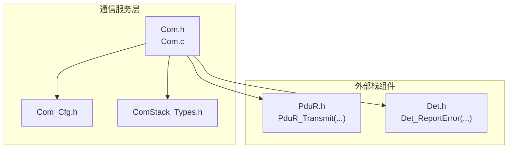
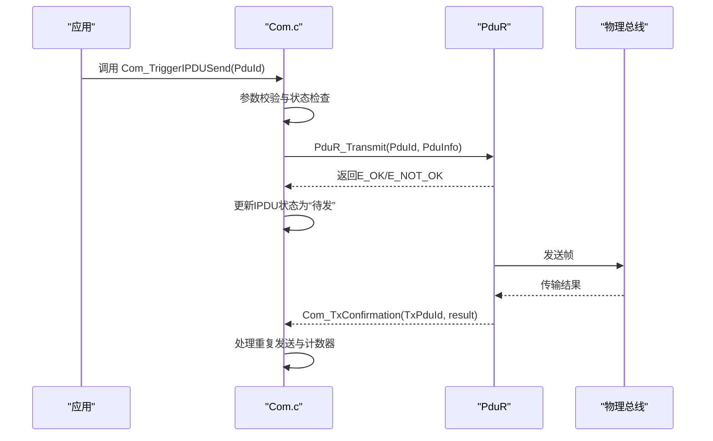
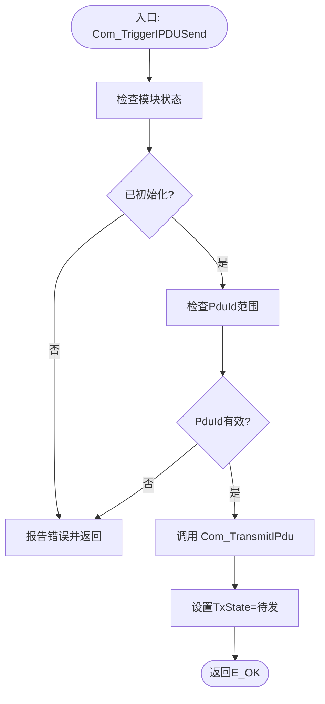
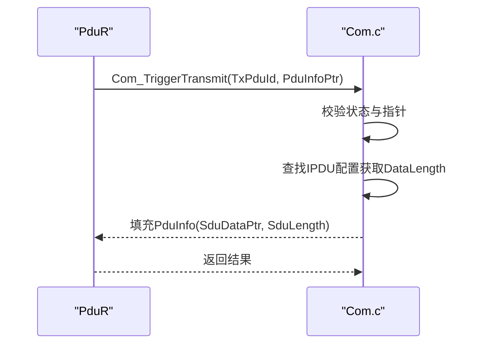
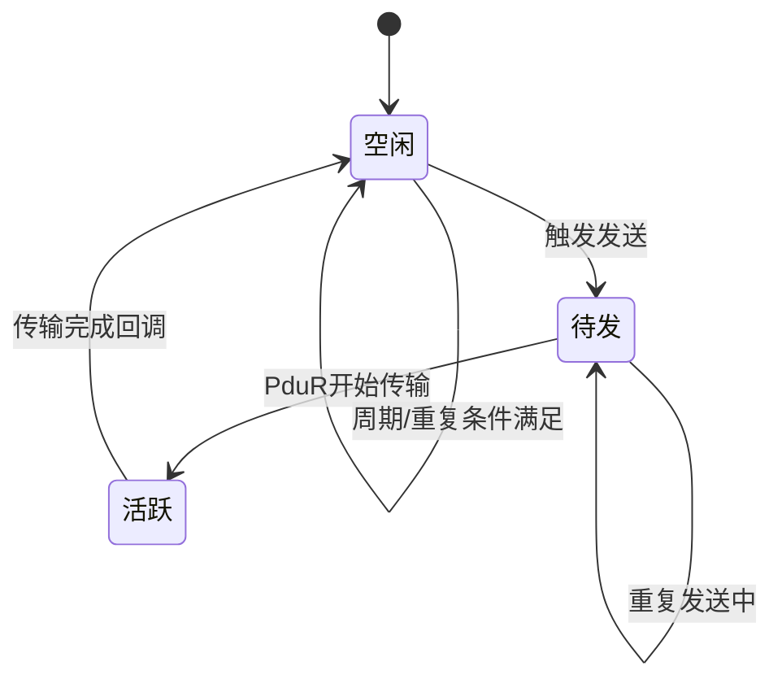
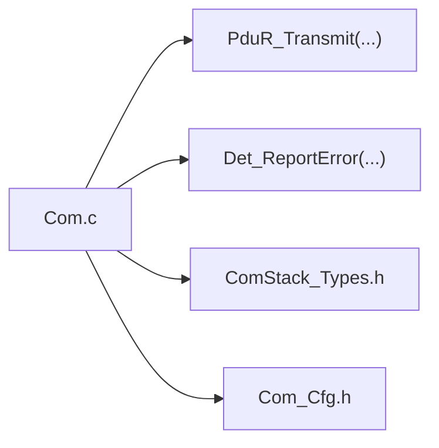

# I-PDU管理

<cite>
**本文引用的文件**
- [Com.h](file://src/bsw/services/com/include/Com.h)
- [Com_Cfg.h](file://src/bsw/services/com/include/Com_Cfg.h)
- [Com.c](file://src/bsw/services/com/src/Com.c)
- [Com_test.c](file://src/bsw/services/com/src/Com_test.c)
- [ComStack_Types.h](file://src/bsw/ecual/include/ComStack_Types.h)
</cite>

## 目录
1. [简介](#简介)
2. [项目结构](#项目结构)
3. [核心组件](#核心组件)
4. [架构总览](#架构总览)
5. [详细组件分析](#详细组件分析)
6. [依赖关系分析](#依赖关系分析)
7. [性能考虑](#性能考虑)
8. [故障排查指南](#故障排查指南)
9. [结论](#结论)
10. [附录](#附录)

## 简介
本文件针对I-PDU（内部协议数据单元）管理子功能进行系统化技术文档编制，重点覆盖以下内容：
- Com_TriggerIPDUSend与Com_TriggerTransmit函数的实现机制：包括PDU ID验证、缓冲区管理、传输状态跟踪与回调处理。
- Com_IPduConfigType配置结构体的设计原理：PduId、DataLength、RepeatingEnabled等字段的作用与影响。
- I-PDU传输模式控制：COM_DIRECT、COM_PERIODIC、COM_MIXED等模式的切换逻辑与参数配置要点。
- I-PDU组向量管理：Com_IpduGroupVector的位操作与组控制功能。
- 配置优化建议、传输性能调优与故障诊断方法。

## 项目结构
I-PDU管理位于BSW服务层的COM模块中，采用头文件声明接口、源文件实现业务逻辑、配置头文件定义编译期常量的方式组织。关键文件如下：
- 接口与类型定义：Com.h、ComStack_Types.h
- 模块配置：Com_Cfg.h
- 核心实现：Com.c
- 单元测试：Com_test.c

**图表来源**
- [Com.h:20-23](file://src/bsw/services/com/include/Com.h#L20-L23)
- [Com.c:19-24](file://src/bsw/services/com/src/Com.c#L19-L24)
- [Com_Cfg.h:15-18](file://src/bsw/services/com/include/Com_Cfg.h#L15-L18)

**章节来源**
- [Com.h:14-23](file://src/bsw/services/com/include/Com.h#L14-L23)
- [Com_Cfg.h:15-34](file://src/bsw/services/com/include/Com_Cfg.h#L15-L34)
- [Com.c:19-24](file://src/bsw/services/com/src/Com.c#L19-L24)

## 核心组件
- COM模块状态与运行时状态
  - 模块状态：未初始化/已初始化
  - IPDU运行时状态：空闲、待发、活跃；重复计数、时间计数器、更新标记、组启用标志
  - 信号运行时状态：更新标记、过滤通过标记、上一次值
  - 内部缓冲区：每个IPDU对应的数据缓冲区与阴影缓冲区
  - 组向量：按位控制IPDU分组启用/禁用

- 关键数据结构
  - Com_IPduConfigType：描述单个IPDU的PduId、DataLength、重复发送使能与周期参数
  - Com_ConfigType：聚合信号与IPDU配置数组及数量
  - Com_IpduGroupVector：按字节存储的位向量，用于IPDU分组控制

- 回调与接口
  - Com_TriggerIPDUSend：触发指定PDU发送
  - Com_TriggerTransmit：PduR回调，提供当前PDU数据
  - Com_TxConfirmation：传输完成确认
  - Com_RxIndication：接收指示
  - Com_MainFunctionTx/Rx：周期性处理任务

**章节来源**
- [Com.c:71-100](file://src/bsw/services/com/src/Com.c#L71-L100)
- [Com.h:211-227](file://src/bsw/services/com/include/Com.h#L211-L227)
- [Com.h:195-196](file://src/bsw/services/com/include/Com.h#L195-L196)
- [Com.c:101-124](file://src/bsw/services/com/src/Com.c#L101-L124)

## 架构总览
COM模块通过PduR进行实际传输，内部维护IPDU缓冲区与状态机，周期性地根据配置决定是否触发发送或重复发送。错误检测在开发阶段可启用，便于定位问题。

**图表来源**
- [Com.c:766-787](file://src/bsw/services/com/src/Com.c#L766-L787)
- [Com.c:335-358](file://src/bsw/services/com/src/Com.c#L335-L358)
- [Com.c:792-826](file://src/bsw/services/com/src/Com.c#L792-L826)

**章节来源**
- [Com.c:335-358](file://src/bsw/services/com/src/Com.c#L335-L358)
- [Com.c:766-787](file://src/bsw/services/com/src/Com.c#L766-L787)
- [Com.c:792-826](file://src/bsw/services/com/src/Com.c#L792-L826)

## 详细组件分析

### Com_TriggerIPDUSend 实现机制
- 功能概述：触发指定PduId的I-PDU立即发送。
- PDU ID验证：检查模块初始化状态与PduId范围。
- 缓冲区管理：直接从内部IPDU缓冲区读取数据长度与指针。
- 传输状态跟踪：调用内部发送函数后，将IPDU状态置为“待发”。
- 错误处理：未初始化或非法PduId时报告DET错误码。

**图表来源**
- [Com.c:766-787](file://src/bsw/services/com/src/Com.c#L766-L787)
- [Com.c:335-358](file://src/bsw/services/com/src/Com.c#L335-L358)

**章节来源**
- [Com.c:766-787](file://src/bsw/services/com/src/Com.c#L766-L787)
- [Com.c:335-358](file://src/bsw/services/com/src/Com.c#L335-L358)

### Com_TriggerTransmit 实现机制
- 功能概述：PduR回调，提供当前PDU的数据指针与长度。
- 参数校验：模块状态与PduInfo指针非空检查。
- 数据提供：从内部IPDU缓冲区填充PduInfo，长度来自配置。
- 返回值：成功则返回E_OK，失败返回E_NOT_OK。

**图表来源**
- [Com.c:728-761](file://src/bsw/services/com/src/Com.c#L728-L761)

**章节来源**
- [Com.c:728-761](file://src/bsw/services/com/src/Com.c#L728-L761)

### Com_IPduConfigType 配置结构体设计
- 字段说明
  - PduId：I-PDU标识符，用于匹配信号所属的IPDU容器
  - DataLength：IPDU数据长度，决定传输与拷贝边界
  - RepeatingEnabled：是否启用重复发送
  - NumRepetitions：重复次数上限
  - TimeBetweenRepetitions：重复间隔（单位由主函数周期决定）
  - TimePeriod：周期性发送周期（0表示不周期发送）

- 设计原则
  - 以配置驱动行为：通过配置决定是否周期发送、是否重复发送以及重复策略
  - 与运行时状态解耦：配置只读，运行时状态独立维护

**章节来源**
- [Com.h:211-219](file://src/bsw/services/com/include/Com.h#L211-L219)
- [Com.c:378-396](file://src/bsw/services/com/src/Com.c#L378-L396)

### I-PDU传输模式控制
- 支持模式
  - COM_DIRECT：直接触发，无周期与重复
  - COM_PERIODIC：周期性发送，受TimePeriod控制
  - COM_MIXED：混合模式，结合周期与重复发送
  - COM_NONE：禁用发送

- 切换逻辑
  - 当前实现中，Com_SwitchIpduTxMode存在占位实现，未提供具体切换逻辑
  - 周期与重复发送由Com_MainFunctionTx统一调度

- 参数配置要点
  - TimePeriod与TimeBetweenRepetitions需与主函数周期一致，避免精度损失
  - RepeatingEnabled与NumRepetitions配合使用，确保重复发送可控

**章节来源**
- [Com.h:132-137](file://src/bsw/services/com/include/Com.h#L132-L137)
- [Com.c:1153-1157](file://src/bsw/services/com/src/Com.c#L1153-L1157)
- [Com.c:898-941](file://src/bsw/services/com/src/Com.c#L898-L941)

### I-PDU组向量管理
- Com_IpduGroupVector：按位存储的IPDU分组向量，每个bit代表一个IPDU组
- 位操作
  - 清空：将所有字节置零
  - 设置：对目标组bit置1
  - 清除：对目标组bit清零
- 组控制
  - Com_IpduGroupControl：批量启用/禁用所有IPDU的组启用标志
  - 当前实现中，组向量参数未被使用，仅对全局GroupEnabled进行赋值

**章节来源**
- [Com.h:195-196](file://src/bsw/services/com/include/Com.h#L195-L196)
- [Com.c:994-1027](file://src/bsw/services/com/src/Com.c#L994-L1027)
- [Com.c:1019-1027](file://src/bsw/services/com/src/Com.c#L1019-L1027)

### 传输状态跟踪与回调
- 状态机
  - TxState：空闲/待发/活跃
  - Updated：IPDU数据是否更新
  - GroupEnabled：组启用标志
  - TimeCounter：周期/重复计数器
  - RepetitionCount：重复计数

- 回调处理
  - Com_TxConfirmation：收到传输结果后，若成功且重复使能，则递增重复计数并重置计时器
  - Com_RxIndication：接收数据后，拷贝到缓冲区并标记更新

**图表来源**
- [Com.c:792-826](file://src/bsw/services/com/src/Com.c#L792-L826)
- [Com.c:898-941](file://src/bsw/services/com/src/Com.c#L898-L941)

**章节来源**
- [Com.c:792-826](file://src/bsw/services/com/src/Com.c#L792-L826)
- [Com.c:898-941](file://src/bsw/services/com/src/Com.c#L898-L941)

## 依赖关系分析
- 外部依赖
  - PduR：提供传输接口与回调
  - Det：开发期错误检测
  - ComStack_Types：PduIdType、PduInfoType等通用类型

- 内部耦合
  - Com.c内部通过静态函数封装信号打包/解包、过滤算法、IPDU配置查找等
  - 运行时状态与配置分离，降低耦合度

**图表来源**
- [Com.c:19-24](file://src/bsw/services/com/src/Com.c#L19-L24)
- [Com.h:20-23](file://src/bsw/services/com/include/Com.h#L20-L23)

**章节来源**
- [Com.c:19-24](file://src/bsw/services/com/src/Com.c#L19-L24)
- [Com.h:20-23](file://src/bsw/services/com/include/Com.h#L20-L23)

## 性能考虑
- 缓冲区管理
  - 使用固定大小的IPDU缓冲区，避免动态分配带来的抖动
  - Shadow缓冲区支持信号组打包，减少频繁拷贝

- 主函数周期
  - 主函数周期与IPDU周期/重复间隔应保持整数倍关系，避免累积误差

- 传输路径
  - Com_TriggerIPDUSend与Com_TriggerTransmit均为O(1)操作，瓶颈主要在PduR与物理总线

- 过滤与打包
  - 信号过滤在发送侧执行，减少无效传输
  - 打包/解包按位操作，注意端序差异带来的性能影响

[本节为通用指导，无需特定文件引用]

## 故障排查指南
- 常见错误码
  - COM_E_UNINIT：模块未初始化即调用API
  - COM_E_PARAM_IPDU：PduId越界
  - COM_E_PARAM_POINTER：指针为空
  - COM_E_INVALID_SIGNAL_ID：信号ID无效

- 定位步骤
  - 初始化检查：确认Com_Init已调用且配置指针有效
  - 参数检查：核对PduId与信号ID范围
  - 回调检查：确认Com_TxConfirmation与Com_RxIndication被正确调用
  - 组控制检查：确认组向量设置与GroupEnabled状态符合预期

- 单元测试参考
  - 测试覆盖了初始化、发送、接收、版本查询、触发发送等场景
  - 可基于测试用例扩展边界条件与异常路径

**章节来源**
- [Com.h:89-102](file://src/bsw/services/com/include/Com.h#L89-L102)
- [Com_test.c:111-394](file://src/bsw/services/com/src/Com_test.c#L111-L394)

## 结论
COM模块的I-PDU管理以配置驱动为核心，通过清晰的状态机与回调机制实现可靠的数据收发。Com_TriggerIPDUSend与Com_TriggerTransmit分别承担触发与数据提供职责，配合周期与重复调度实现多种传输模式。当前实现中，传输模式切换接口为占位实现，建议后续完善以支持COM_MIXED等模式的细粒度控制。通过合理的配置与主函数周期设置，可在保证实时性的前提下获得稳定的传输性能。

[本节为总结性内容，无需特定文件引用]

## 附录
- 配置优化建议
  - 合理设置COM_NUM_IPDUS与COM_MAX_IPDU_BUFFER_SIZE，避免内存浪费与溢出
  - 将高优先级IPDU置于较小PduId范围内，便于快速索引
  - 对高频IPDU启用周期发送并合理设置TimePeriod，降低CPU占用

- 传输性能调优
  - 将TimePeriod与主函数周期对齐，减少计数器误差
  - 控制重复次数与间隔，避免拥塞
  - 使用过滤算法减少无效信号传输

- 故障诊断方法
  - 开启COM_DEV_ERROR_DETECT，利用DET错误码快速定位问题
  - 在Com_TxConfirmation中记录传输结果与重复计数，辅助分析丢包与延迟
  - 使用单元测试覆盖边界条件，如NULL指针、越界ID、未初始化调用等

**章节来源**
- [Com_Cfg.h:23-34](file://src/bsw/services/com/include/Com_Cfg.h#L23-L34)
- [Com.c:410-453](file://src/bsw/services/com/src/Com.c#L410-L453)