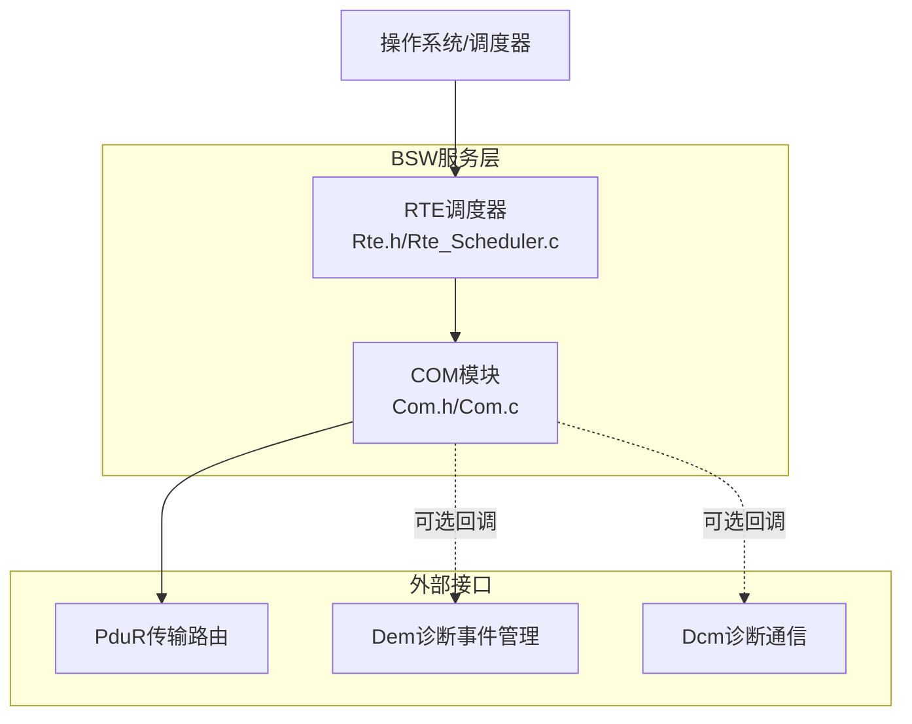
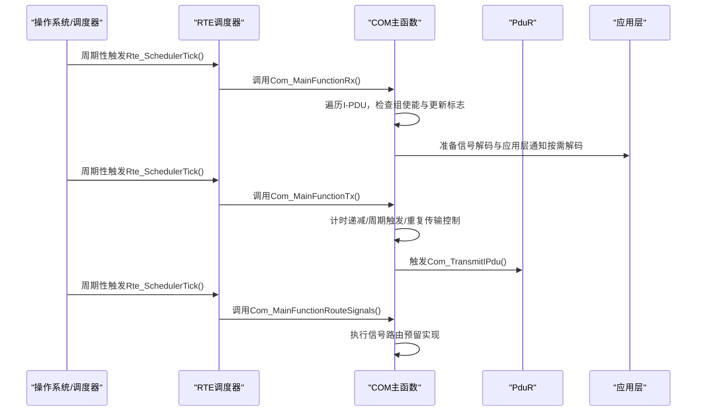
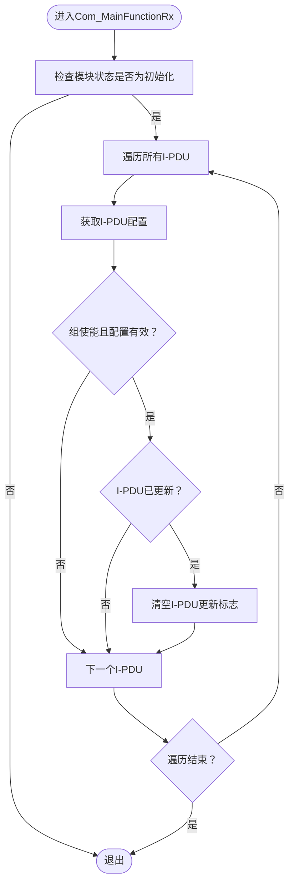
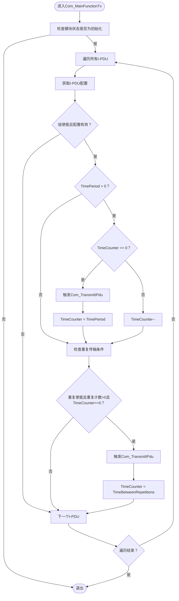
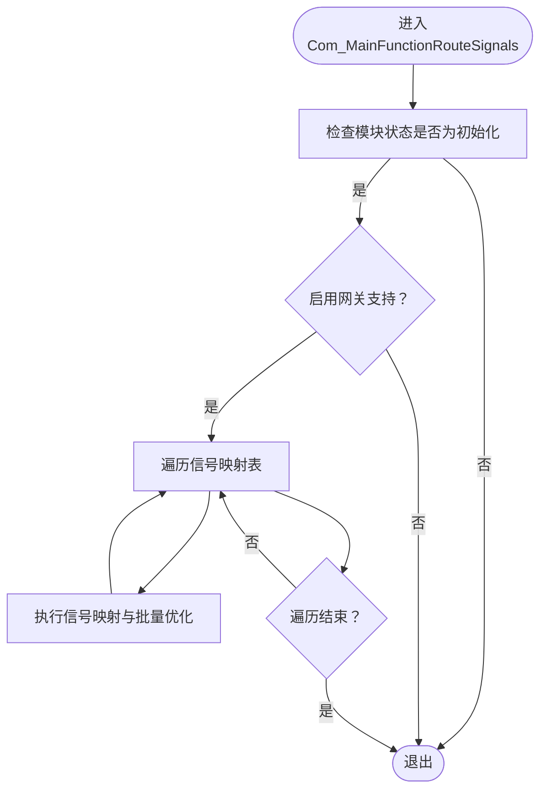
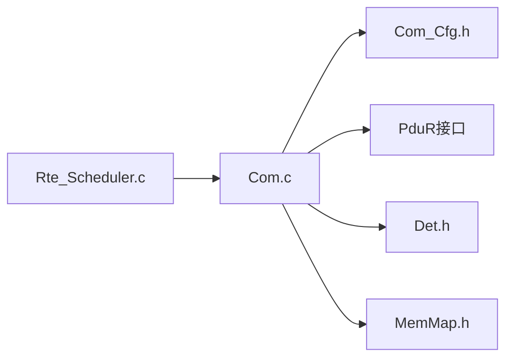

# 主函数处理

<cite>
**本文引用的文件**
- [Com.h](file://src/bsw/services/com/include/Com.h)
- [Com.c](file://src/bsw/services/com/src/Com.c)
- [Com_Cfg.h](file://src/bsw/services/com/include/Com_Cfg.h)
- [Rte.h](file://src/bsw/rte/include/Rte.h)
- [Rte_Scheduler.c](file://src/bsw/rte/src/Rte_Scheduler.c)
</cite>

## 目录
1. [简介](#简介)
2. [项目结构](#项目结构)
3. [核心组件](#核心组件)
4. [架构总览](#架构总览)
5. [详细组件分析](#详细组件分析)
6. [依赖关系分析](#依赖关系分析)
7. [性能考虑](#性能考虑)
8. [故障排查指南](#故障排查指南)
9. [结论](#结论)
10. [附录](#附录)

## 简介
本文件面向COM（通信服务）模块的“主函数处理”能力，聚焦以下三个主函数：
- Com_MainFunctionRx：接收主函数，负责轮询处理已接收的I-PDU，进行信号解码与应用层通知准备
- Com_MainFunctionTx：传输主函数，负责周期性调度与重复传输控制，维护I-PDU状态机
- Com_MainFunctionRouteSignals：信号路由主函数，预留用于跨IPDU/跨网段的信号映射与批量传输优化

文档将从实现机制、轮询逻辑、定时调度、任务优先级、错误处理、性能优化与实时性保障等方面进行系统化说明，并给出调用频率建议、集成指南与性能监控方法。

## 项目结构
COM模块位于Bsw层的服务层，对外提供AUTOSAR风格的通信接口；其主函数由上层调度器（如RTE或OS）周期性调用，以实现非阻塞的轮询式处理。

图表来源
- [Com.h:476-498](file://src/bsw/services/com/include/Com.h#L476-L498)
- [Com.c:866-960](file://src/bsw/services/com/src/Com.c#L866-L960)
- [Rte.h:313-345](file://src/bsw/rte/include/Rte.h#L313-L345)
- [Rte_Scheduler.c:529-558](file://src/bsw/rte/src/Rte_Scheduler.c#L529-L558)

章节来源
- [Com.h:476-498](file://src/bsw/services/com/include/Com.h#L476-L498)
- [Com.c:866-960](file://src/bsw/services/com/src/Com.c#L866-L960)
- [Rte.h:313-345](file://src/bsw/rte/include/Rte.h#L313-L345)
- [Rte_Scheduler.c:529-558](file://src/bsw/rte/src/Rte_Scheduler.c#L529-L558)

## 核心组件
- COM内部状态与缓冲区
  - 模块状态：初始化/未初始化
  - I-PDU运行时状态：发送状态、重复计数、时间计数器、更新标志、组使能标志
  - 信号运行时状态：更新标志、滤波通过标志、上次值
  - IPDU缓冲区与影子缓冲区
  - I-PDU组向量（位图）
- 关键类型
  - Com_IPduStateType、Com_SignalStateType、Com_InternalStateType
  - 配置类型：Com_ConfigType、Com_SignalConfigType、Com_IPduConfigType
- 主函数原型
  - Com_MainFunctionRx、Com_MainFunctionTx、Com_MainFunctionRouteSignals

章节来源
- [Com.c:71-124](file://src/bsw/services/com/src/Com.c#L71-L124)
- [Com.h:188-227](file://src/bsw/services/com/include/Com.h#L188-L227)

## 架构总览
COM主函数在每个调度周期内执行如下职责：
- 接收主函数：遍历所有I-PDU，检查组使能与更新标志，准备解码与应用层通知（实际解码按需在Com_ReceiveSignal中完成）
- 传输主函数：对每个I-PDU执行周期性计时与重复传输控制，必要时触发Com_TransmitIPdu
- 路由主函数：预留信号网关映射与批量传输优化（当前为空实现）

图表来源
- [Com.c:866-960](file://src/bsw/services/com/src/Com.c#L866-L960)
- [Rte_Scheduler.c:529-558](file://src/bsw/rte/src/Rte_Scheduler.c#L529-L558)

## 详细组件分析

### 接收主函数 Com_MainFunctionRx
- 轮询处理逻辑
  - 遍历所有I-PDU，获取配置信息
  - 检查I-PDU组使能标志与更新标志
  - 若I-PDU被标记为已更新，则清空更新标志，为后续按需解码做准备
- 信号解码与应用层通知
  - 实际解码在Com_ReceiveSignal中按需执行
  - 应用层可调用Com_ReceiveSignal获取解码后的信号值
- 错误处理
  - 仅在模块处于初始化状态下执行
  - 对指针参数进行有效性检查（由上层调用保证）

图表来源
- [Com.c:866-893](file://src/bsw/services/com/src/Com.c#L866-L893)

章节来源
- [Com.c:866-893](file://src/bsw/services/com/src/Com.c#L866-L893)

### 传输主函数 Com_MainFunctionTx
- 定时调度机制
  - 对每个I-PDU检查TimePeriod配置
  - 当TimeCounter为0时，触发一次传输，并重置TimeCounter为TimePeriod
  - 否则，每周期递减TimeCounter
- 重复传输控制
  - 若RepeatingEnabled为真且重复计数大于0且TimeCounter为0，则触发传输并设置TimeCounter为TimeBetweenRepetitions
  - 重复完成后重置重复计数
- 状态同步
  - 传输确认回调Com_TxConfirmation中，根据结果更新重复计数与状态机
- 传输队列管理
  - 通过Com_TransmitIPdu统一发起PduR传输请求，避免直接耦合底层硬件

图表来源
- [Com.c:898-941](file://src/bsw/services/com/src/Com.c#L898-L941)

章节来源
- [Com.c:898-941](file://src/bsw/services/com/src/Com.c#L898-L941)
- [Com.c:792-826](file://src/bsw/services/com/src/Com.c#L792-L826)

### 信号路由主函数 Com_MainFunctionRouteSignals
- 功能概述
  - 预留用于信号网关映射与批量传输优化
  - 支持条件编译开关（COM_GATEWAY_SUPPORT），默认为空实现
- 批量传输优化
  - 可在此阶段聚合多个信号到同一IPDU，减少传输次数
- 系统资源管理
  - 通过组使能与更新标志控制处理范围，避免无效工作

图表来源
- [Com.c:946-960](file://src/bsw/services/com/src/Com.c#L946-L960)
- [Com_Cfg.h:116-122](file://src/bsw/services/com/include/Com_Cfg.h#L116-L122)

章节来源
- [Com.c:946-960](file://src/bsw/services/com/src/Com.c#L946-L960)
- [Com_Cfg.h:116-122](file://src/bsw/services/com/include/Com_Cfg.h#L116-L122)

## 依赖关系分析
- COM主函数依赖
  - 配置头文件：Com_Cfg.h提供I-PDU数量、信号数量、组数量、主函数周期等
  - 上层调度器：Rte_Scheduler.c提供周期性调度框架
  - 传输路由：PduR接口用于实际传输
  - 诊断与错误检测：Det.h用于开发期错误检测
- 内部依赖
  - Com_InternalState集中存储模块状态、缓冲区与运行时状态
  - Com_TransmitIPdu封装传输请求，统一状态机入口

图表来源
- [Com.c:19-24](file://src/bsw/services/com/src/Com.c#L19-L24)
- [Com_Cfg.h:15-18](file://src/bsw/services/com/include/Com_Cfg.h#L15-L18)
- [Rte_Scheduler.c:529-558](file://src/bsw/rte/src/Rte_Scheduler.c#L529-L558)

章节来源
- [Com.c:19-24](file://src/bsw/services/com/src/Com.c#L19-L24)
- [Com_Cfg.h:15-18](file://src/bsw/services/com/include/Com_Cfg.h#L15-L18)
- [Rte_Scheduler.c:529-558](file://src/bsw/rte/src/Rte_Scheduler.c#L529-L558)

## 性能考虑
- 处理效率优化
  - 使用组使能标志快速跳过禁用组，减少无意义遍历
  - 更新标志驱动按需解码，避免不必要的解码开销
  - 统一通过Com_TransmitIPdu发起传输，便于缓存与批处理
- 实时性保证
  - 主函数周期固定（配置项COM_MAIN_FUNCTION_PERIOD_MS），确保调度一致性
  - 传输主函数采用计数器递减方式，避免阻塞等待
- 资源占用
  - 缓冲区大小与信号数量在配置中限定，避免动态分配
  - 运行时状态集中管理，降低内存碎片风险

章节来源
- [Com_Cfg.h:109-112](file://src/bsw/services/com/include/Com_Cfg.h#L109-L112)
- [Com.c:866-960](file://src/bsw/services/com/src/Com.c#L866-L960)

## 故障排查指南
- 常见问题与定位
  - 主函数未执行：检查上层调度器是否正确创建并激活任务，周期是否合理
  - 传输不触发：确认I-PDU组使能、TimePeriod配置、TimeCounter状态与重复条件
  - 解码异常：确认Com_ReceiveSignal调用时机与缓冲区内容
  - 重复传输异常：检查Com_TxConfirmation回调中的重复计数更新逻辑
- 错误检测
  - 开发期可通过COM_DEV_ERROR_DETECT宏启用DET报告，定位参数非法、未初始化等问题
- 回调链路
  - Com_RxIndication：接收数据后复制到缓冲区并标记更新
  - Com_TxConfirmation：传输完成后更新状态机与重复计数

章节来源
- [Com.c:831-861](file://src/bsw/services/com/src/Com.c#L831-L861)
- [Com.c:792-826](file://src/bsw/services/com/src/Com.c#L792-L826)
- [Com_Cfg.h:15-18](file://src/bsw/services/com/include/Com_Cfg.h#L15-L18)

## 结论
COM主函数处理通过三类主函数实现了接收、传输与路由的分层处理：
- 接收主函数负责轮询与按需解码，降低CPU占用
- 传输主函数通过计数器与重复控制实现稳定的周期性与重复传输
- 路由主函数预留了信号网关与批量优化空间
结合上层调度器的周期性调用与配置化的主函数周期，COM主函数在保证实时性的前提下具备良好的扩展性与可维护性。

## 附录

### 主函数调用频率建议
- 建议周期：COM_MAIN_FUNCTION_PERIOD_MS（默认10ms），与上层调度器tick保持一致
- 接收主函数：与传输主函数同周期，或根据I-PDU更新频率适当调整
- 传输主函数：建议固定周期，确保计数器与重复控制稳定
- 路由主函数：按需调用或关闭（当未使用网关功能时）

章节来源
- [Com_Cfg.h:109-112](file://src/bsw/services/com/include/Com_Cfg.h#L109-L112)
- [Rte_Scheduler.c:529-558](file://src/bsw/rte/src/Rte_Scheduler.c#L529-L558)

### 集成指南
- 初始化
  - 在系统启动阶段调用Com_Init传入配置指针
  - 确保配置头文件中I-PDU与信号数量定义正确
- 调度器集成
  - 将Com_MainFunctionRx、Com_MainFunctionTx、Com_MainFunctionRouteSignals分别注册为任务入口
  - 设置任务优先级与周期，确保传输主函数优先于接收主函数（若存在依赖）
- 回调集成
  - Com_RxIndication：在PduR接收回调中调用，将数据复制到缓冲区并标记更新
  - Com_TxConfirmation：在PduR传输确认回调中调用，更新重复计数与状态机

章节来源
- [Com.h:441-463](file://src/bsw/services/com/include/Com.h#L441-L463)
- [Com.c:831-861](file://src/bsw/services/com/src/Com.c#L831-L861)
- [Com.c:792-826](file://src/bsw/services/com/src/Com.c#L792-L826)

### 性能监控方法
- 计数器与标志
  - 通过Com_GetTxIpduCounter/Com_GetRxIpduCounter（若提供）统计传输与接收次数
  - 观察I-PDU组向量与更新标志，评估处理负载
- 调度器监控
  - 使用Rte_SchedulerGetTickCount监控调度节拍，确保主函数周期稳定
- 诊断与错误
  - 启用COM_DEV_ERROR_DETECT，通过DET报告定位异常

章节来源
- [Com.h:61-68](file://src/bsw/services/com/include/Com.h#L61-L68)
- [Com_Cfg.h:15-18](file://src/bsw/services/com/include/Com_Cfg.h#L15-L18)
- [Rte_Scheduler.c:579-582](file://src/bsw/rte/src/Rte_Scheduler.c#L579-L582)