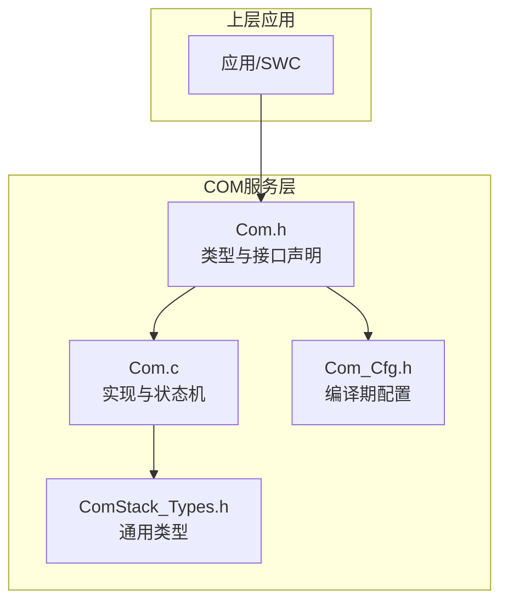
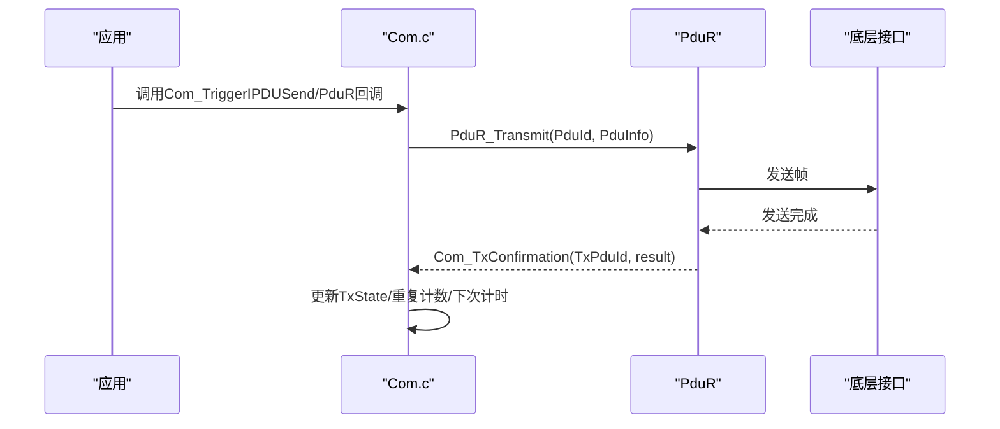
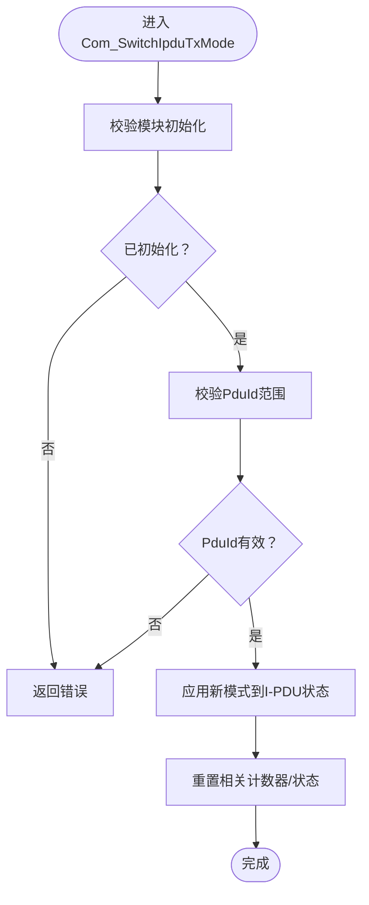
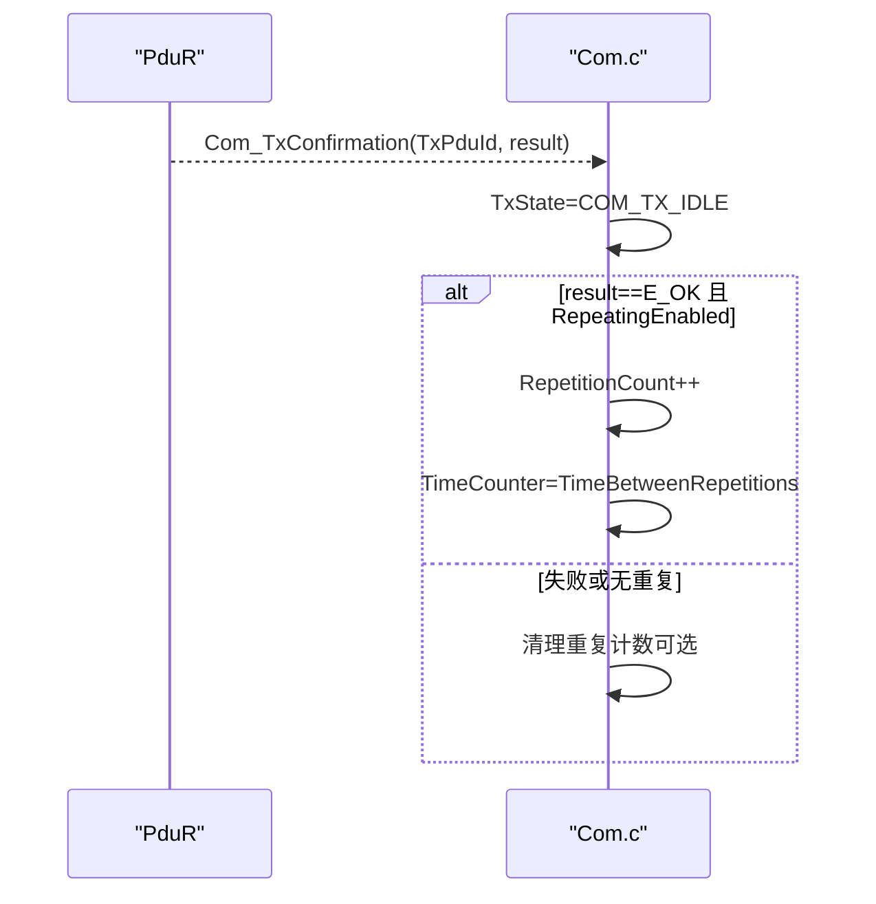
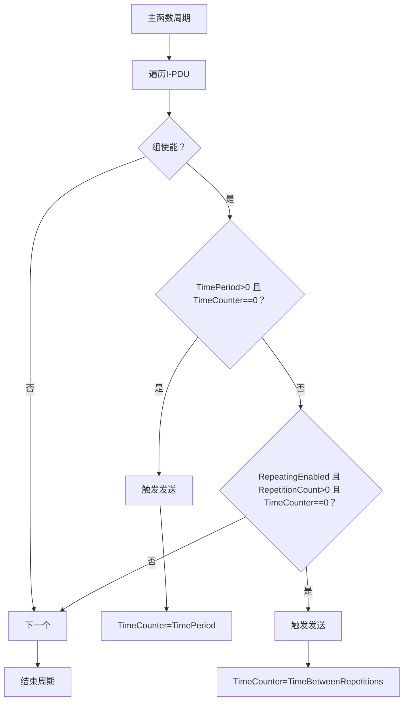
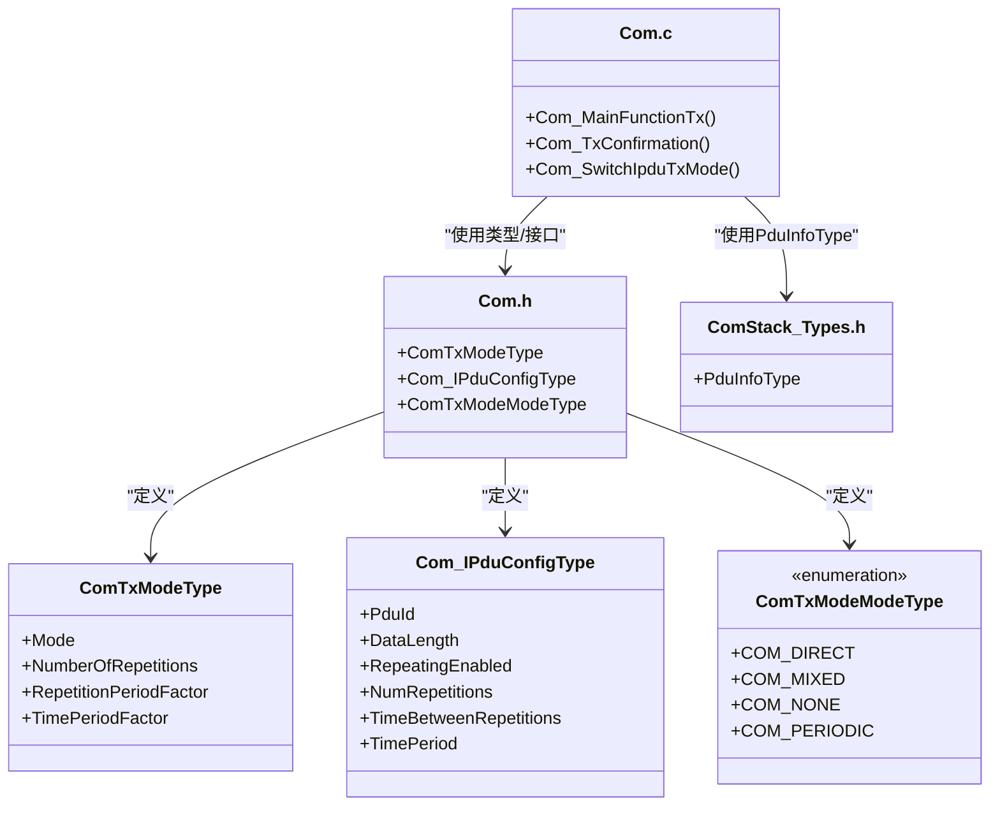

# 传输控制

<cite>
**本文引用的文件列表**
- [Com.h](file://src/bsw/services/com/include/Com.h)
- [Com.c](file://src/bsw/services/com/src/Com.c)
- [Com_Cfg.h](file://src/bsw/services/com/include/Com_Cfg.h)
- [ComStack_Types.h](file://src/bsw/ecual/include/ComStack_Types.h)
- [Com_spec.md](file://openspec/changes/dev-com-module/specs/Com_spec.md)
</cite>

## 目录
1. [简介](#简介)
2. [项目结构](#项目结构)
3. [核心组件](#核心组件)
4. [架构总览](#架构总览)
5. [详细组件分析](#详细组件分析)
6. [依赖关系分析](#依赖关系分析)
7. [性能考量](#性能考量)
8. [故障排查指南](#故障排查指南)
9. [结论](#结论)
10. [附录](#附录)

## 简介
本文件面向传输控制子功能，聚焦于ComTxModeType传输模式结构体与Com_SwitchIpduTxMode函数的实现与使用，系统化阐述：
- ComTxModeType中Mode模式选择、NumberOfRepetitions重复次数、RepetitionPeriodFactor重复周期因子、TimePeriodFactor时间周期因子的配置与作用
- Com_SwitchIpduTxMode的实现现状与可扩展点（当前为占位实现）
- 各种传输模式（COM_DIRECT直接传输、COM_PERIODIC周期性传输、COM_MIXED混合模式）的工作原理与性能特征
- 传输确认机制（Com_TxConfirmation回调）与错误恢复策略
- 传输模式选择指南、性能调优建议与可靠性保障措施

## 项目结构
COM模块位于BSW服务层，对外提供信号与I-PDU的收发、路由与状态查询等能力；传输控制相关的核心类型与接口集中在COM头文件中，运行时状态与主函数在源文件中实现。

图表来源
- [Com.h:1-508](file://src/bsw/services/com/include/Com.h#L1-L508)
- [Com.c:1-1184](file://src/bsw/services/com/src/Com.c#L1-L1184)
- [Com_Cfg.h:1-124](file://src/bsw/services/com/include/Com_Cfg.h#L1-L124)
- [ComStack_Types.h:1-170](file://src/bsw/ecual/include/ComStack_Types.h#L1-L170)

章节来源
- [Com.h:1-508](file://src/bsw/services/com/include/Com.h#L1-L508)
- [Com.c:1-1184](file://src/bsw/services/com/src/Com.c#L1-L1184)
- [Com_Cfg.h:1-124](file://src/bsw/services/com/include/Com_Cfg.h#L1-L124)
- [ComStack_Types.h:1-170](file://src/bsw/ecual/include/ComStack_Types.h#L1-L170)

## 核心组件
- ComTxModeType：传输模式配置结构体，包含Mode、NumberOfRepetitions、RepetitionPeriodFactor、TimePeriodFactor四个字段，用于描述一次发送的模式与重复策略。
- Com_IPduConfigType：I-PDU配置，包含PduId、DataLength、RepeatingEnabled、NumRepetitions、TimeBetweenRepetitions、TimePeriod等字段，驱动周期与重复行为。
- ComTxModeModeType枚举：COM_DIRECT、COM_MIXED、COM_NONE、COM_PERIODIC四种模式标识。
- Com_SwitchIpduTxMode：传输模式切换接口（当前为占位实现，需按需求扩展）。
- Com_TxConfirmation：传输完成回调，负责更新状态并处理重复计数与调度。

章节来源
- [Com.h:187-227](file://src/bsw/services/com/include/Com.h#L187-L227)
- [Com.h:132-138](file://src/bsw/services/com/include/Com.h#L132-L138)
- [Com.c:792-826](file://src/bsw/services/com/src/Com.c#L792-L826)
- [Com.c:1153-1157](file://src/bsw/services/com/src/Com.c#L1153-L1157)

## 架构总览
COM模块通过主函数周期性扫描各I-PDU的配置，结合内部状态机执行发送、重复与周期调度；传输完成后由PduR回调Com_TxConfirmation，驱动重复计数与下一次调度。

图表来源
- [Com.c:335-358](file://src/bsw/services/com/src/Com.c#L335-L358)
- [Com.c:792-826](file://src/bsw/services/com/src/Com.c#L792-L826)

## 详细组件分析

### ComTxModeType结构体与字段语义
- Mode：传输模式选择，支持COM_DIRECT、COM_MIXED、COM_NONE、COM_PERIODIC。
- NumberOfRepetitions：重复次数上限。
- RepetitionPeriodFactor：重复周期因子（与主函数周期或系统节拍的关系取决于具体实现）。
- TimePeriodFactor：时间周期因子（用于周期性发送的调度）。

章节来源
- [Com.h:187-193](file://src/bsw/services/com/include/Com.h#L187-L193)
- [Com_spec.md:159-167](file://openspec/changes/dev-com-module/specs/Com_spec.md#L159-L167)

### 传输模式工作原理
- COM_DIRECT（直接传输）
  - 触发即发送，不进行周期或重复调度。适用于事件驱动的即时消息。
- COM_PERIODIC（周期性传输）
  - 基于I-PDU配置中的TimePeriod进行周期调度；当TimeCounter归零时触发发送，并重置计数器为TimePeriod。
- COM_MIXED（混合模式）
  - 结合“按需触发+周期补充”的策略：在满足触发条件时立即发送，同时保留周期性调度作为补充。具体行为需根据实际配置与业务场景细化。
- COM_NONE（禁用）
  - 不进行任何自动发送，仅由外部显式触发。

章节来源
- [Com.h:132-138](file://src/bsw/services/com/include/Com.h#L132-L138)
- [Com.c:898-941](file://src/bsw/services/com/src/Com.c#L898-L941)

### Com_SwitchIpduTxMode函数实现现状与扩展建议
- 当前实现：占位实现，未做任何操作。
- 扩展方向（建议）：
  - 参数校验：检查PduId有效性与模块初始化状态。
  - 模式切换：将目标I-PDU的运行时模式切换到新Mode，并重置相关计数器与状态。
  - 配置联动：若存在Per-IPDU的ComTxModeType配置表，则在切换时同步更新对应字段（NumberOfRepetitions、RepetitionPeriodFactor、TimePeriodFactor）。
  - 幂等性：避免重复切换导致的状态抖动。
  - 回调通知：必要时通知上层或下游模块（如PduR）进行链路适配。

图表来源
- [Com.c:1153-1157](file://src/bsw/services/com/src/Com.c#L1153-L1157)

章节来源
- [Com.c:1153-1157](file://src/bsw/services/com/src/Com.c#L1153-L1157)

### 传输确认机制与错误恢复
- Com_TxConfirmation回调：
  - 将TxState置为COM_TX_IDLE，表示本次传输结束。
  - 若底层返回E_OK且I-PDU配置开启重复（RepeatingEnabled），则递增重复计数并在TimeBetweenRepetitions到达后再次触发发送。
  - 若重复次数达到NumRepetitions，清空重复计数，停止后续重复。
- 错误恢复策略（基于现有实现）：
  - 传输失败（result != E_OK）：保持TxState为COM_TX_IDLE，等待下一轮调度或上层重试。
  - 重复失败：重复计数不会前进，直到下一次成功或达到上限。
  - 可结合配置项COM_RETRY_FAILED_TRANSMIT_REQUESTS启用重试策略（见编译期配置）。

图表来源
- [Com.c:792-826](file://src/bsw/services/com/src/Com.c#L792-L826)

章节来源
- [Com.c:792-826](file://src/bsw/services/com/src/Com.c#L792-L826)
- [Com_Cfg.h:15-18](file://src/bsw/services/com/include/Com_Cfg.h#L15-L18)

### 主函数周期调度与重复机制
- Com_MainFunctionTx：
  - 遍历所有I-PDU，检查组使能与TimeCounter。
  - 当TimeCounter归零且TimePeriod>0时，触发Com_TransmitIPdu并重置TimeCounter为TimePeriod。
  - 若开启重复（RepeatingEnabled）且重复计数>0且TimeCounter==0，再次触发Com_TransmitIPdu并设置TimeCounter为TimeBetweenRepetitions。
- 计数器语义：
  - TimeCounter：周期倒计时，归零触发发送。
  - RepetitionCount：重复计数，达到NumRepetitions后停止重复。

图表来源
- [Com.c:898-941](file://src/bsw/services/com/src/Com.c#L898-L941)

章节来源
- [Com.c:898-941](file://src/bsw/services/com/src/Com.c#L898-L941)

## 依赖关系分析
- 类型依赖：Com.h定义ComTxModeType、Com_IPduConfigType等核心类型；ComStack_Types.h提供PduInfoType等通用类型。
- 实现依赖：Com.c依赖PduR接口进行发送；依赖Det进行错误上报；依赖Com_Cfg.h进行编译期配置。
- 接口依赖：Com_SwitchIpduTxMode对外暴露，但当前实现为空，需与I-PDU状态表配合完善。

图表来源
- [Com.h:187-227](file://src/bsw/services/com/include/Com.h#L187-L227)
- [Com.c:898-941](file://src/bsw/services/com/src/Com.c#L898-L941)
- [ComStack_Types.h:56-60](file://src/bsw/ecual/include/ComStack_Types.h#L56-L60)

章节来源
- [Com.h:187-227](file://src/bsw/services/com/include/Com.h#L187-L227)
- [Com.c:898-941](file://src/bsw/services/com/src/Com.c#L898-L941)
- [ComStack_Types.h:56-60](file://src/bsw/ecual/include/ComStack_Types.h#L56-L60)

## 性能考量
- 主函数周期：COM_MAIN_FUNCTION_TX_PERIOD_MS决定调度粒度，影响响应延迟与CPU占用。
- 缓冲区大小：COM_MAX_IPDU_BUFFER_SIZE限制单个I-PDU的数据长度，过大可能导致内存压力与发送时延。
- 重复策略：合理设置NumRepetitions与TimeBetweenRepetitions，避免过度重复造成带宽浪费。
- 过滤与打包：信号过滤（FilterAlgorithm）与打包（Pack/Unpack）会影响CPU开销，应按需启用。
- 错误重试：COM_RETRY_FAILED_TRANSMIT_REQUESTS可提升鲁棒性，但会增加重试开销。

章节来源
- [Com_Cfg.h:109-116](file://src/bsw/services/com/include/Com_Cfg.h#L109-L116)
- [Com_Cfg.h:33](file://src/bsw/services/com/include/Com_Cfg.h#L33)
- [Com_Cfg.h:18](file://src/bsw/services/com/include/Com_Cfg.h#L18)

## 故障排查指南
- 初始化错误（COM_E_UNINIT）
  - 现象：在未初始化状态下调用API。
  - 处理：确保先调用Com_Init，再进行其他操作。
- 参数错误（COM_E_PARAM、COM_E_PARAM_POINTER、COM_E_PARAM_IPDU）
  - 现象：传入空指针、越界PduId或无效信号ID。
  - 处理：核对传参合法性与配置宏值。
- 传输失败（Com_TxConfirmation result != E_OK）
  - 现象：底层发送返回失败。
  - 处理：检查链路状态、缓冲区可用性与PduR配置；必要时启用重试策略。
- 重复异常
  - 现象：重复计数未前进或提前终止。
  - 处理：确认I-PDU配置的RepeatingEnabled、NumRepetitions与TimeBetweenRepetitions是否正确。

章节来源
- [Com.h:89-103](file://src/bsw/services/com/include/Com.h#L89-L103)
- [Com.c:792-826](file://src/bsw/services/com/src/Com.c#L792-L826)

## 结论
- ComTxModeType提供了灵活的传输模式与重复策略配置入口，结合I-PDU配置可实现直接、周期与混合等多种发送模式。
- Com_SwitchIpduTxMode目前为占位实现，建议按需扩展以支持动态模式切换。
- Com_TxConfirmation与主函数调度共同构成可靠的传输确认与重复机制。
- 在工程实践中，应结合系统周期、带宽与可靠性要求，合理配置重复次数与周期因子，并通过错误检测与重试策略提升整体鲁棒性。

## 附录
- 传输模式选择指南
  - 事件驱动且低频：COM_DIRECT
  - 定时上报类数据：COM_PERIODIC
  - 事件驱动+周期兜底：COM_MIXED
  - 临时禁用自动发送：COM_NONE
- 性能调优建议
  - 优化主函数周期与I-PDU分组，减少不必要的扫描。
  - 合理设置TimePeriod与TimeBetweenRepetitions，避免过密或过疏。
  - 使用信号过滤减少无效传输。
- 可靠性保障
  - 开启COM_DEV_ERROR_DETECT与COM_RETRY_FAILED_TRANSMIT_REQUESTS。
  - 对关键I-PDU配置Deadline Monitoring（ReceptionDM）以增强健壮性。