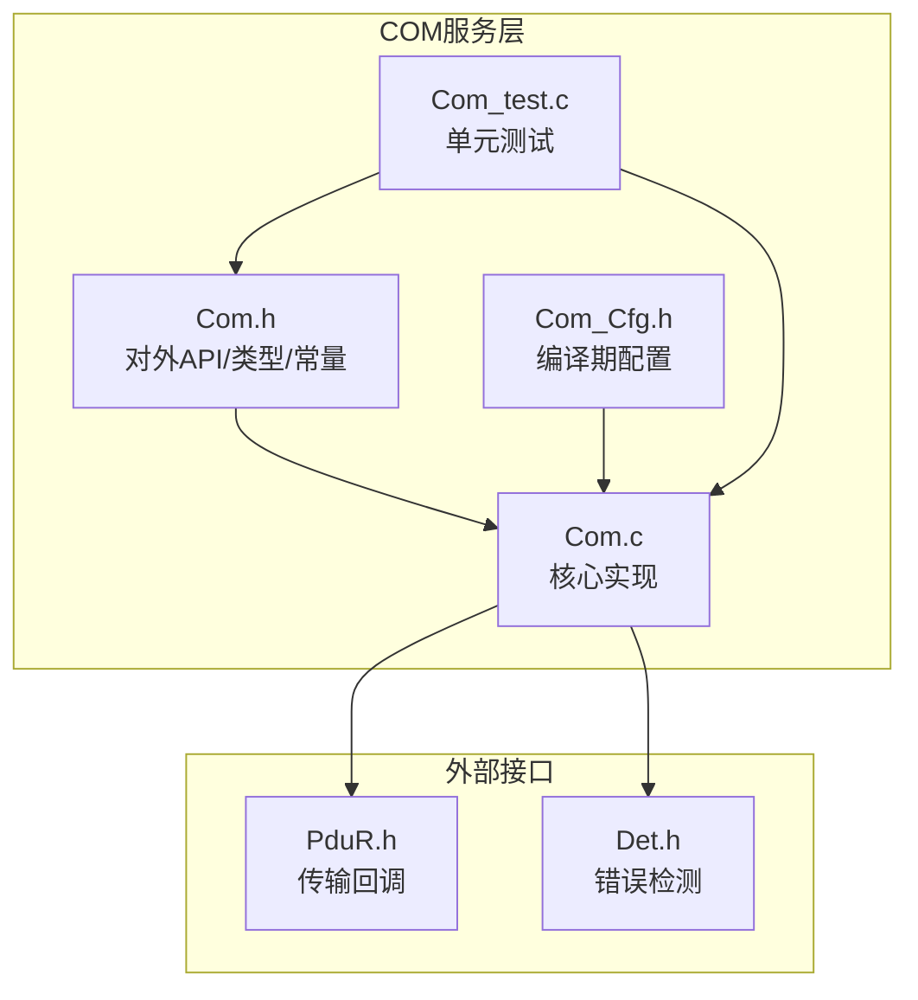
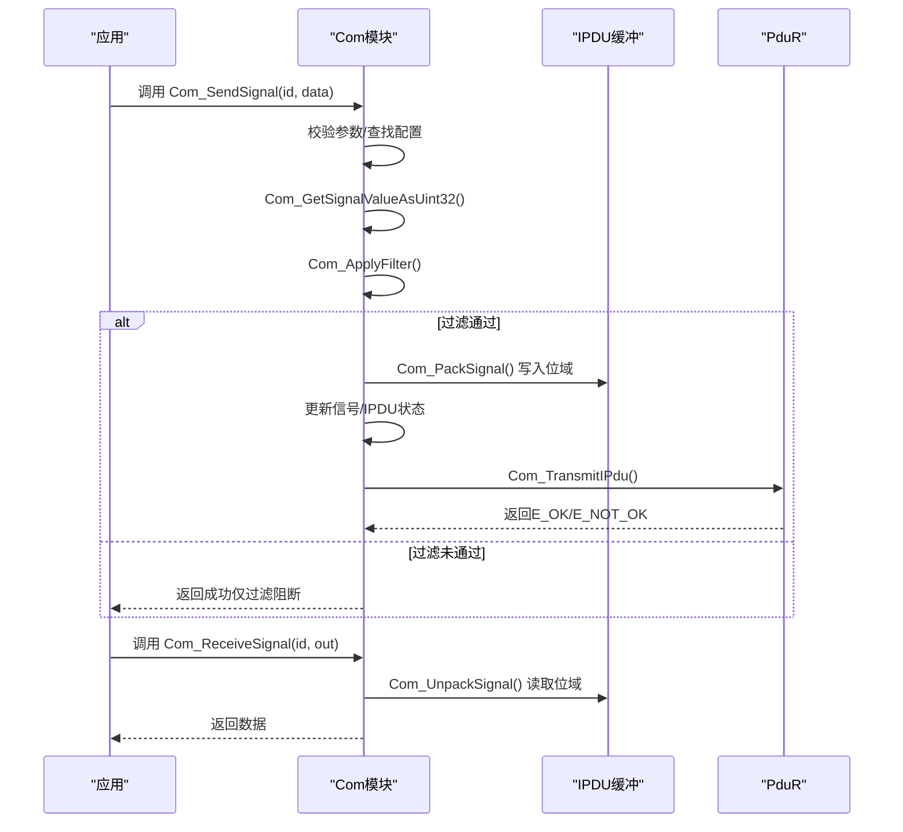
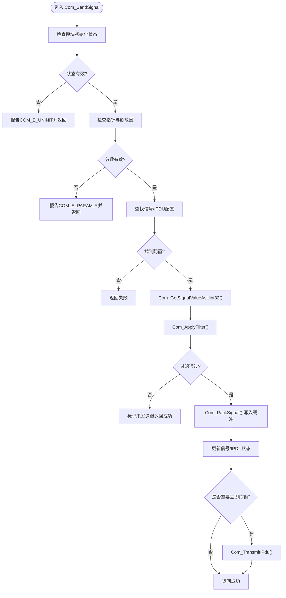
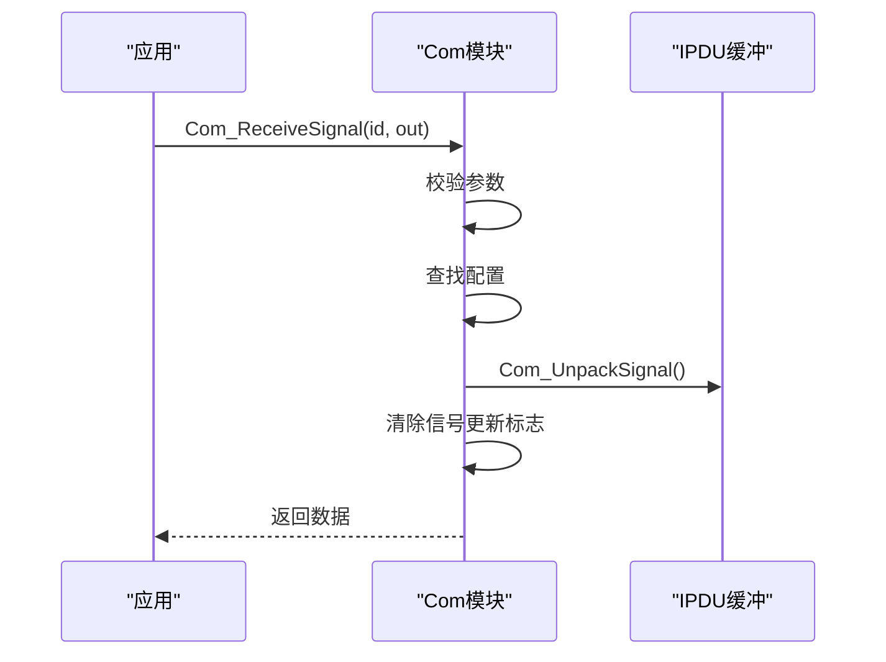
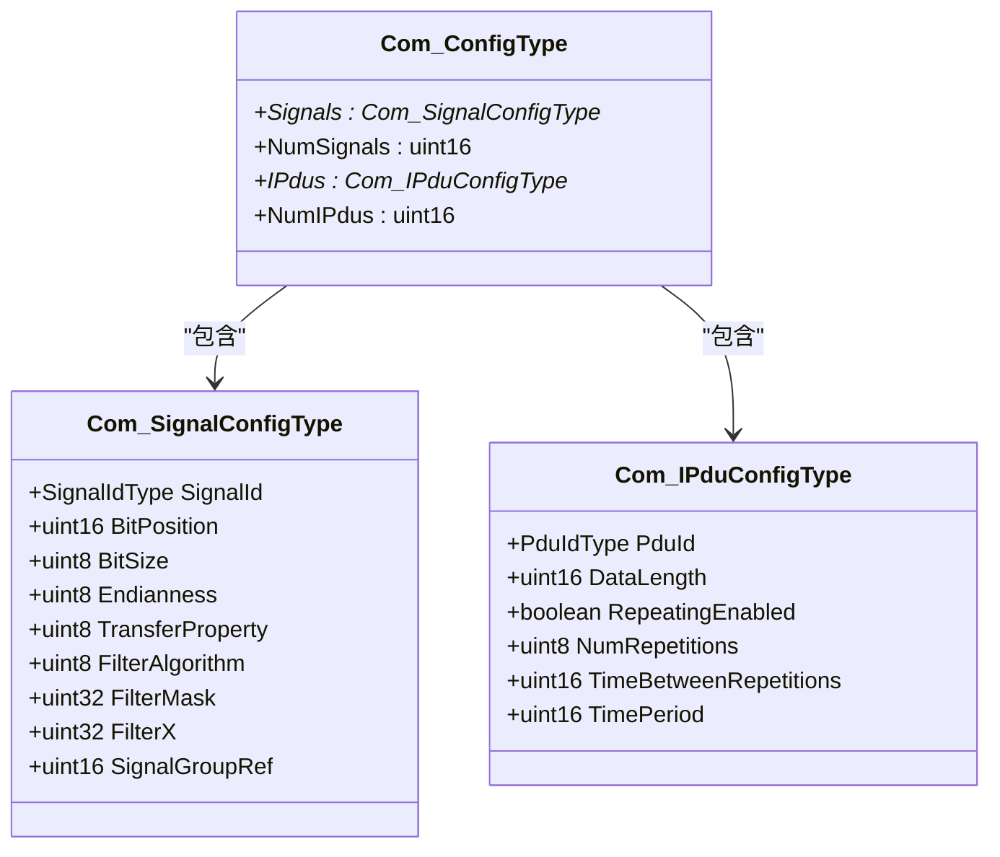
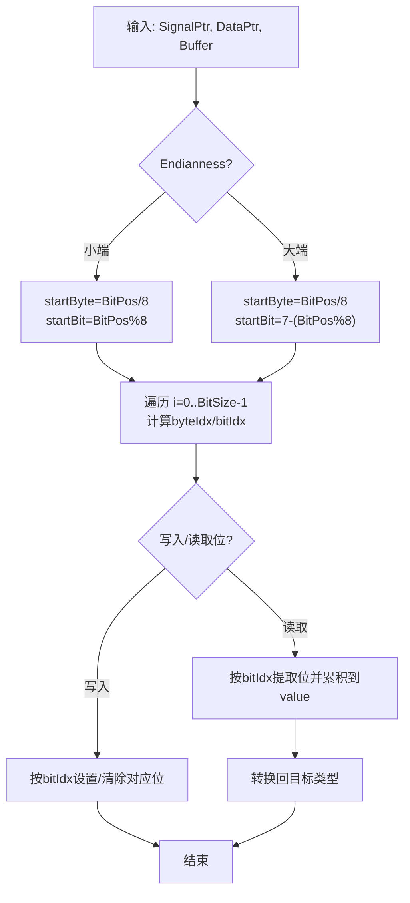
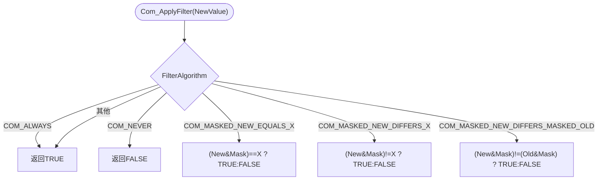
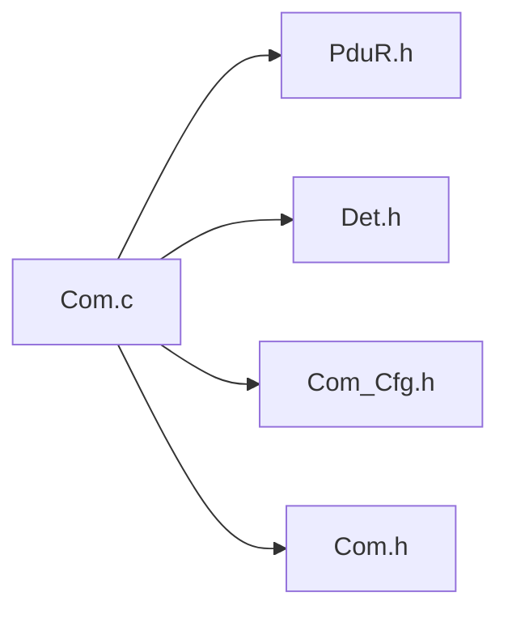

# 信号管理

<cite>
**本文引用的文件**
- [Com.h](file://src/bsw/services/com/include/Com.h)
- [Com.c](file://src/bsw/services/com/src/Com.c)
- [Com_Cfg.h](file://src/bsw/services/com/include/Com_Cfg.h)
- [Com_Cfg.h（模板）](file://src/bsw/config/templates/Com_Cfg.h)
- [Com_test.c](file://src/bsw/services/com/src/Com_test.c)
- [main.c（CAN示例）](file://examples/can_demo/main.c)
</cite>

## 目录
1. [简介](#简介)
2. [项目结构](#项目结构)
3. [核心组件](#核心组件)
4. [架构总览](#架构总览)
5. [详细组件分析](#详细组件分析)
6. [依赖关系分析](#依赖关系分析)
7. [性能考量](#性能考量)
8. [故障排查指南](#故障排查指南)
9. [结论](#结论)
10. [附录](#附录)

## 简介
本文件面向信号管理子功能，系统性阐述Com_SendSignal与Com_ReceiveSignal的实现机制，覆盖以下主题：
- 信号ID验证与查找
- 数据缓冲区管理（IPDU缓冲、影子缓冲）
- 端序转换（大端/小端）与位域操作
- 信号状态管理（COM_E_OK、COM_SIG_ERROR、COM_SIG_WAITING等）
- 信号过滤算法（COM_ALWAYS、COM_NEVER、COM_MASKED_NEW_EQUALS_X等）
- 配置结构体Com_SignalConfigType的设计原理与字段作用
- 最佳实践、性能优化建议与常见配置错误的解决方案

## 项目结构
Com模块位于“src/bsw/services/com”，包含头文件与实现文件，并提供单元测试与配置模板：
- 头文件：Com.h（对外API、类型定义、常量）、Com_Cfg.h（编译期配置）
- 实现：Com.c（核心逻辑：打包/解包、过滤、发送/接收、主函数）
- 测试：Com_test.c（基于mock的单元测试）
- 示例：examples/can_demo/main.c（展示与底层通信栈的集成）

图表来源
- [Com.h:1-508](file://src/bsw/services/com/include/Com.h#L1-L508)
- [Com.c:1-1184](file://src/bsw/services/com/src/Com.c#L1-L1184)
- [Com_Cfg.h:1-124](file://src/bsw/services/com/include/Com_Cfg.h#L1-L124)
- [Com_test.c:1-394](file://src/bsw/services/com/src/Com_test.c#L1-L394)

章节来源
- [Com.h:1-508](file://src/bsw/services/com/include/Com.h#L1-L508)
- [Com.c:1-1184](file://src/bsw/services/com/src/Com.c#L1-L1184)
- [Com_Cfg.h:1-124](file://src/bsw/services/com/include/Com_Cfg.h#L1-L124)
- [Com_test.c:1-394](file://src/bsw/services/com/src/Com_test.c#L1-L394)

## 核心组件
- 对外API：Com_SendSignal、Com_ReceiveSignal、Com_TriggerIPDUSend、Com_RxIndication、Com_TxConfirmation、Com_MainFunctionRx/Tx等
- 内部状态：Com_InternalState（模块状态、IPDU状态数组、信号状态数组、IPDU缓冲、影子缓冲、组向量）
- 关键类型：Com_SignalConfigType、Com_IPduConfigType、Com_ConfigType
- 过滤算法：多种COM_*过滤模式
- 端序与位域：大端/小端处理、按位打包/解包

章节来源
- [Com.h:243-501](file://src/bsw/services/com/include/Com.h#L243-L501)
- [Com.c:89-124](file://src/bsw/services/com/src/Com.c#L89-L124)
- [Com.c:116-123](file://src/bsw/services/com/src/Com.c#L116-L123)

## 架构总览
Com模块通过PduR进行I-PDU的收发，内部维护IPDU缓冲与信号状态，实现信号的打包/解包、过滤与状态管理。

图表来源
- [Com.c:478-546](file://src/bsw/services/com/src/Com.c#L478-L546)
- [Com.c:551-590](file://src/bsw/services/com/src/Com.c#L551-L590)
- [Com.c:134-190](file://src/bsw/services/com/src/Com.c#L134-L190)
- [Com.c:195-238](file://src/bsw/services/com/src/Com.c#L195-L238)
- [Com.c:243-279](file://src/bsw/services/com/src/Com.c#L243-L279)
- [Com.c:335-358](file://src/bsw/services/com/src/Com.c#L335-L358)

## 详细组件分析

### Com_SendSignal 实现机制
- 参数校验：初始化状态检查、指针非空检查、信号ID边界检查
- 查找配置：根据SignalId定位Com_SignalConfigType；根据SignalGroupRef定位Com_IPduConfigType
- 值提取：Com_GetSignalValueAsUint32将输入数据转换为uint32
- 过滤：Com_ApplyFilter依据FilterAlgorithm决定是否写入缓冲
- 打包：Com_PackSignal将值按BitPosition/BitSize/Endianness写入IPDU缓冲
- 状态更新：标记信号已更新、记录LastValue、标记IPDU已更新
- 触发传输：当TransferProperty为触发类时调用Com_TransmitIPdu

图表来源
- [Com.c:478-546](file://src/bsw/services/com/src/Com.c#L478-L546)
- [Com.c:284-306](file://src/bsw/services/com/src/Com.c#L284-L306)
- [Com.c:243-279](file://src/bsw/services/com/src/Com.c#L243-L279)
- [Com.c:134-190](file://src/bsw/services/com/src/Com.c#L134-L190)
- [Com.c:335-358](file://src/bsw/services/com/src/Com.c#L335-L358)

章节来源
- [Com.c:478-546](file://src/bsw/services/com/src/Com.c#L478-L546)
- [Com.c:284-306](file://src/bsw/services/com/src/Com.c#L284-L306)
- [Com.c:243-279](file://src/bsw/services/com/src/Com.c#L243-L279)
- [Com.c:134-190](file://src/bsw/services/com/src/Com.c#L134-L190)
- [Com.c:335-358](file://src/bsw/services/com/src/Com.c#L335-L358)

### Com_ReceiveSignal 实现机制
- 参数校验：初始化状态、指针非空、信号ID范围
- 查找配置：定位Com_SignalConfigType
- 解包：Com_UnpackSignal从IPDU缓冲按BitPosition/BitSize/Endianness读取
- 清除更新标志：将信号的Updated标志清零
- 返回：返回COM_SERVICE_OK

图表来源
- [Com.c:551-590](file://src/bsw/services/com/src/Com.c#L551-L590)
- [Com.c:195-238](file://src/bsw/services/com/src/Com.c#L195-L238)

章节来源
- [Com.c:551-590](file://src/bsw/services/com/src/Com.c#L551-L590)
- [Com.c:195-238](file://src/bsw/services/com/src/Com.c#L195-L238)

### Com_SignalConfigType 配置结构体设计
字段说明：
- SignalId：信号唯一标识
- BitPosition：起始位位置（字节内位偏移参与计算）
- BitSize：位宽
- Endianness：端序（Little/Big/Opaque）
- TransferProperty：传输属性（触发/变化/无/周期）
- FilterAlgorithm：过滤算法
- FilterMask/FilterX：过滤掩码与参考值
- SignalGroupRef：所属IPDU索引（用于缓冲定位）

图表来源
- [Com.h:198-227](file://src/bsw/services/com/include/Com.h#L198-L227)

章节来源
- [Com.h:198-227](file://src/bsw/services/com/include/Com.h#L198-L227)

### 端序转换与位域操作
- 小端（Little Endian）：起始字节由BitPosition/8确定，起始位为BitPosition%8；逐位从低位到高位写入或读取
- 大端（Big Endian）：起始位为7-(BitPosition%8)，逐位从高位到低位写入或读取
- 位域写入/读取：通过位掩码与移位操作完成，支持8/16/32位原生类型转换

图表来源
- [Com.c:134-190](file://src/bsw/services/com/src/Com.c#L134-L190)
- [Com.c:195-238](file://src/bsw/services/com/src/Com.c#L195-L238)
- [Com.c:284-306](file://src/bsw/services/com/src/Com.c#L284-L306)
- [Com.c:311-330](file://src/bsw/services/com/src/Com.c#L311-L330)

章节来源
- [Com.c:134-190](file://src/bsw/services/com/src/Com.c#L134-L190)
- [Com.c:195-238](file://src/bsw/services/com/src/Com.c#L195-L238)
- [Com.c:284-306](file://src/bsw/services/com/src/Com.c#L284-L306)
- [Com.c:311-330](file://src/bsw/services/com/src/Com.c#L311-L330)

### 信号状态管理
- 模块状态：COM_UNINIT/COM_INIT
- 信号状态：Updated、FilterPassed、LastValue
- IPDU状态：TxState、RepetitionCount、TimeCounter、Updated、GroupEnabled
- 服务返回码：COM_SERVICE_OK/COM_SERVICE_NOT_OK
- 信号状态码：COM_E_OK、COM_SIG_ERROR、COM_SIG_WAITING、COM_SIG_TIMEOUT、COM_SIG_VALID、COM_SIG_INVALID

章节来源
- [Com.h:104-131](file://src/bsw/services/com/include/Com.h#L104-L131)
- [Com.c:29-41](file://src/bsw/services/com/src/Com.c#L29-L41)
- [Com.c:81-99](file://src/bsw/services/com/src/Com.c#L81-L99)

### 信号过滤算法
支持的过滤模式：
- COM_ALWAYS：总是通过
- COM_NEVER：从不通过
- COM_MASKED_NEW_EQUALS_X：(New & Mask) == X
- COM_MASKED_NEW_DIFFERS_X：(New & Mask) != X
- COM_MASKED_NEW_DIFFERS_MASKED_OLD：(New & Mask) != (Old & Mask)
- 其他：默认通过

图表来源
- [Com.c:243-279](file://src/bsw/services/com/src/Com.c#L243-L279)

章节来源
- [Com.c:243-279](file://src/bsw/services/com/src/Com.c#L243-L279)
- [Com.h:145-154](file://src/bsw/services/com/include/Com.h#L145-L154)

### 数据缓冲区管理
- IPDU缓冲：二维数组Com_InternalState.IPduBuffer[NumIPdus][MaxSize]，按IPDU索引访问
- 影子缓冲：Com_InternalState.ShadowBuffer，用于信号组发送/接收
- 接收路径：Com_RxIndication将PduR提供的数据复制到IPDU缓冲，并标记Updated
- 发送路径：Com_SendSignal/Com_SendSignalGroup将数据写入缓冲后触发传输

章节来源
- [Com.c:89-99](file://src/bsw/services/com/src/Com.c#L89-L99)
- [Com.c:831-861](file://src/bsw/services/com/src/Com.c#L831-L861)
- [Com.c:595-626](file://src/bsw/services/com/src/Com.c#L595-L626)
- [Com.c:631-655](file://src/bsw/services/com/src/Com.c#L631-L655)

### 传输与主函数
- Com_TransmitIPdu：封装PduInfo并调用PduR_Transmit，更新IPDU状态
- Com_MainFunctionTx：周期性处理IPDU计时器与重复发送
- Com_MainFunctionRx：处理接收后的更新标志
- Com_TriggerIPDUSend：显式触发某IPDU发送

章节来源
- [Com.c:335-358](file://src/bsw/services/com/src/Com.c#L335-L358)
- [Com.c:898-941](file://src/bsw/services/com/src/Com.c#L898-L941)
- [Com.c:866-893](file://src/bsw/services/com/src/Com.c#L866-L893)
- [Com.c:766-787](file://src/bsw/services/com/src/Com.c#L766-L787)

## 依赖关系分析
- 外部依赖：PduR（传输/接收回调）、Det（错误检测）
- 内部耦合：Com.c内部函数相互协作（打包/解包、过滤、传输）
- 配置依赖：Com_Cfg.h定义的宏（端序、传输模式、数量限制等）

图表来源
- [Com.c:19-24](file://src/bsw/services/com/src/Com.c#L19-L24)
- [Com.h:20-22](file://src/bsw/services/com/include/Com.h#L20-L22)

章节来源
- [Com.c:19-24](file://src/bsw/services/com/src/Com.c#L19-L24)
- [Com.h:20-22](file://src/bsw/services/com/include/Com.h#L20-L22)

## 性能考量
- 位域操作复杂度：O(BitSize)，在高频信号场景下应避免过长位域链
- 过滤开销：过滤算法为常数时间，但需注意FilterMask/FilterX的合理性
- 缓冲访问：IPDU缓冲为静态数组，访问成本低；注意避免越界
- 主函数周期：COM_MAIN_FUNCTION_PERIOD_MS影响调度粒度与CPU占用
- 传输策略：周期性传输与重复次数需平衡实时性与带宽

[本节为通用指导，无需特定文件来源]

## 故障排查指南
- 初始化相关错误
  - COM_E_UNINIT：在未初始化状态下调用API
  - COM_E_PARAM_POINTER：传入NULL指针
  - COM_E_PARAM_SIGNAL/COM_E_INVALID_SIGNAL_ID：信号ID越界
  - COM_E_PARAM_IPDU：IPDU ID越界
- 传输问题
  - PduR返回失败：检查Com_TransmitIPdu返回值与IPDU配置
  - 未触发传输：确认TransferProperty是否为触发类
- 过滤问题
  - COM_MASKED_NEW_EQUALS_X/COM_MASKED_NEW_DIFFERS_X：核对FilterMask与FilterX
  - COM_MASKED_NEW_DIFFERS_MASKED_OLD：确认上一次值是否正确保存
- 位域问题
  - 大/小端混用：确保SignalConfigType.Endianness与实际帧一致
  - BitPosition/BitSize越界：确保总长度不超过IPDU DataLength

章节来源
- [Com.h:89-103](file://src/bsw/services/com/include/Com.h#L89-L103)
- [Com.c:478-546](file://src/bsw/services/com/src/Com.c#L478-L546)
- [Com.c:551-590](file://src/bsw/services/com/src/Com.c#L551-L590)
- [Com.c:243-279](file://src/bsw/services/com/src/Com.c#L243-L279)

## 结论
Com模块通过清晰的配置结构与严格的位域/端序处理，提供了可靠的信号打包/解包与过滤能力。结合PduR的传输回调与主函数驱动，实现了高效的I-PDU收发。遵循本文最佳实践与排错建议，可显著提升系统的稳定性与性能。

[本节为总结，无需特定文件来源]

## 附录

### 信号配置最佳实践
- 端序一致性：确保SignalConfigType.Endianness与物理帧一致
- 位域连续性：尽量将相关信号按位域连续布置，减少跨字节操作
- 过滤策略：合理设置FilterAlgorithm、FilterMask与FilterX，避免误判
- 传输属性：根据实时性需求选择COM_TRIGGERED/COM_TRIGGERED_ON_CHANGE/COM_PENDING
- 缓冲大小：确保COM_MAX_IPDU_BUFFER_SIZE满足最大IPDU长度

章节来源
- [Com_Cfg.h:91-98](file://src/bsw/services/com/include/Com_Cfg.h#L91-L98)
- [Com_Cfg.h:109-111](file://src/bsw/services/com/include/Com_Cfg.h#L109-L111)

### 单元测试要点（参考）
- Com_Init/DeInit：验证初始化与去初始化流程
- Com_SendSignal：验证触发PduR传输、过滤阻断、无效参数
- Com_ReceiveSignal：验证解包与更新标志清除
- Com_TriggerIPDUSend：验证显式触发
- 版本信息：Com_GetVersionInfo

章节来源
- [Com_test.c:111-165](file://src/bsw/services/com/src/Com_test.c#L111-L165)
- [Com_test.c:167-217](file://src/bsw/services/com/src/Com_test.c#L167-L217)
- [Com_test.c:219-241](file://src/bsw/services/com/src/Com_test.c#L219-L241)
- [Com_test.c:302-333](file://src/bsw/services/com/src/Com_test.c#L302-L333)
- [Com_test.c:273-300](file://src/bsw/services/com/src/Com_test.c#L273-L300)

### 示例集成（参考）
- CAN示例展示了底层通信栈的初始化与主循环，可作为Com模块集成的参考

章节来源
- [main.c（CAN示例）:63-118](file://examples/can_demo/main.c#L63-L118)