# 信号组处理

<cite>
**本文档引用的文件**
- [Com.h](file://src/bsw/services/com/include/Com.h)
- [Com_Cfg.h](file://src/bsw/services/com/include/Com_Cfg.h)
- [Com.c](file://src/bsw/services/com/src/Com.c)
- [Com_test.c](file://src/bsw/services/com/src/Com_test.c)
- [Com_spec.md](file://openspec/changes/dev-com-module/specs/Com_spec.md)
- [modules.md](file://docs/modules.md)
- [development-guide.md](file://docs/development-guide.md)
</cite>

## 目录
1. [简介](#简介)
2. [项目结构](#项目结构)
3. [核心组件](#核心组件)
4. [架构概览](#架构概览)
5. [详细组件分析](#详细组件分析)
6. [依赖关系分析](#依赖关系分析)
7. [性能考虑](#性能考虑)
8. [故障排除指南](#故障排除指南)
9. [结论](#结论)
10. [附录](#附录)

## 简介

本文档深入解析YuleTech AutoSAR BSW平台中Com模块的信号组处理子功能，重点阐述Com_SendSignalGroup和Com_ReceiveSignalGroup函数的实现机制。该功能是AUTOSAR Classic Platform 4.x服务层的核心通信能力，为应用软件组件（通过RTE）与底层PDU传输层（通过PduR）之间提供基于信号的通信抽象。

信号组处理功能允许将多个相关的信号原子性地打包到同一个I-PDU中进行传输，确保信号间的时序一致性和完整性。该实现支持批量信号处理、组内信号同步和依赖关系管理，为复杂的车载网络通信提供了强大的基础设施。

## 项目结构

Com模块在YuleTech AutoSAR BSW平台中的组织结构如下：

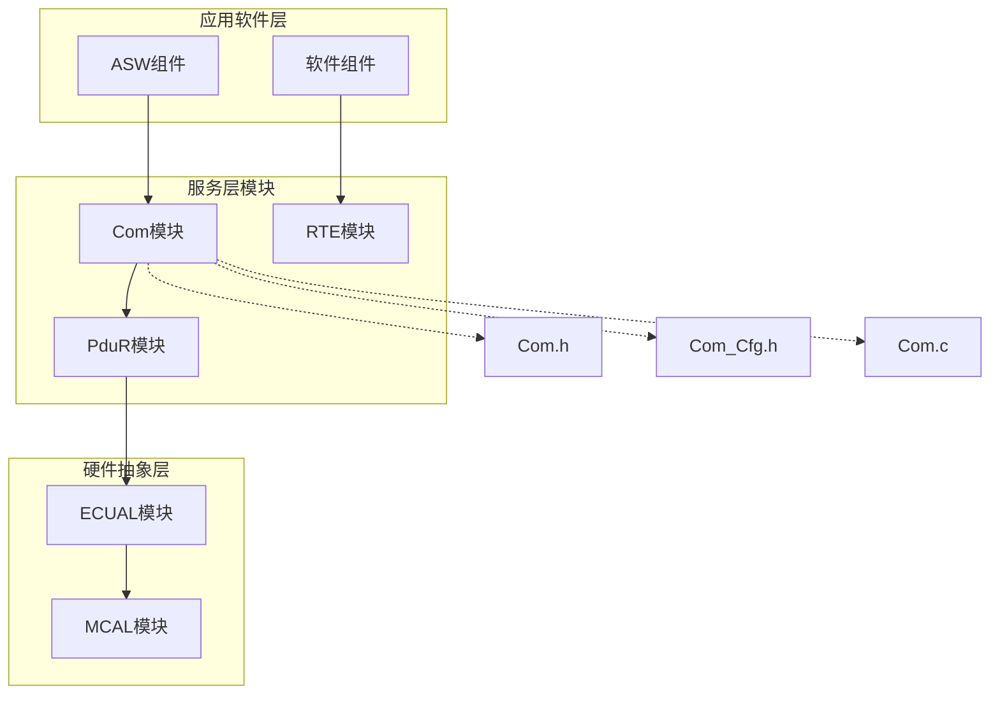

**图表来源**
- [modules.md:340-376](file://docs/modules.md#L340-L376)
- [Com_spec.md:312-324](file://openspec/changes/dev-com-module/specs/Com_spec.md#L312-L324)

**章节来源**
- [modules.md:227-246](file://docs/modules.md#L227-L246)
- [Com_spec.md:11-28](file://openspec/changes/dev-com-module/specs/Com_spec.md#L11-L28)

## 核心组件

### 信号组配置结构体设计

Com模块采用分层的数据结构来管理信号组配置：

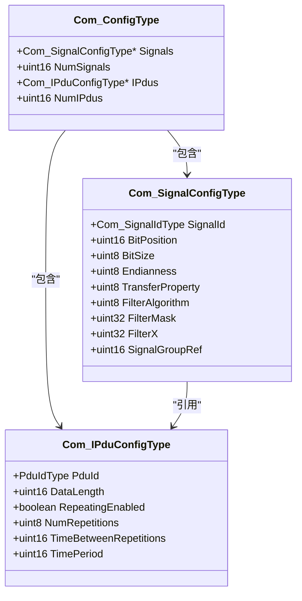

**图表来源**
- [Com.h:221-227](file://src/bsw/services/com/include/Com.h#L221-L227)
- [Com.h:198-219](file://src/bsw/services/com/include/Com.h#L198-L219)

### 信号组ID验证机制

Com模块实现了严格的信号组ID验证机制：

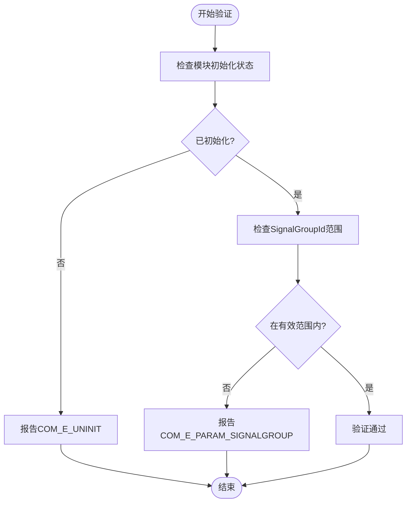

**图表来源**
- [Com.c:599-611](file://src/bsw/services/com/src/Com.c#L599-L611)

**章节来源**
- [Com.h:53-56](file://src/bsw/services/com/include/Com.h#L53-L56)
- [Com.h:96](file://src/bsw/services/com/include/Com.h#L96)
- [Com.c:595-626](file://src/bsw/services/com/src/Com.c#L595-L626)

## 架构概览

Com模块的信号组处理架构采用分层设计，确保了良好的模块化和可维护性：

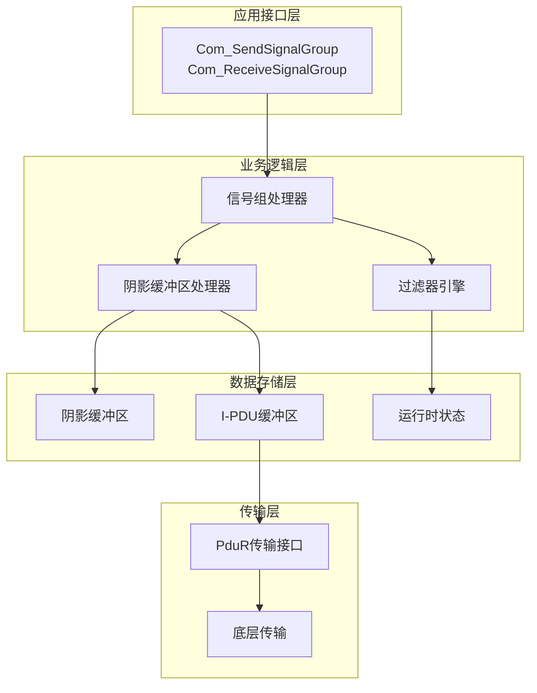

**图表来源**
- [Com.c:69-99](file://src/bsw/services/com/src/Com.c#L69-L99)
- [Com_spec.md:234-309](file://openspec/changes/dev-com-module/specs/Com_spec.md#L234-L309)

## 详细组件分析

### Com_SendSignalGroup函数实现

Com_SendSignalGroup函数负责将阴影缓冲区中的信号组数据发送到网络：

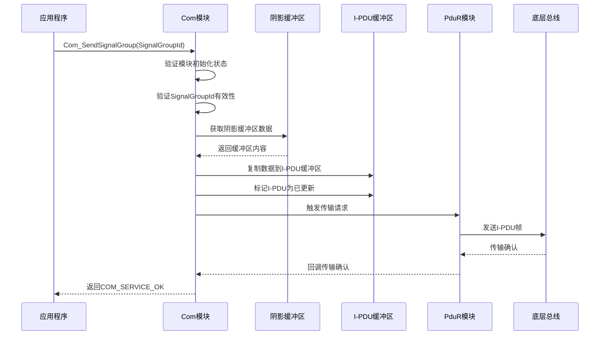

**图表来源**
- [Com.c:595-626](file://src/bsw/services/com/src/Com.c#L595-L626)

#### 关键实现细节

1. **参数验证**：确保模块已初始化且SignalGroupId在有效范围内
2. **数据复制**：将阴影缓冲区完整内容复制到对应的I-PDU缓冲区
3. **状态更新**：标记相应的I-PDU为已更新状态
4. **传输触发**：通过PduR_Transmit接口触发实际的网络传输

**章节来源**
- [Com.c:595-626](file://src/bsw/services/com/src/Com.c#L595-L626)
- [Com_test.c:243-257](file://src/bsw/services/com/src/Com_test.c#L243-L257)

### Com_ReceiveSignalGroup函数实现

Com_ReceiveSignalGroup函数负责从网络接收信号组数据并存储到阴影缓冲区：

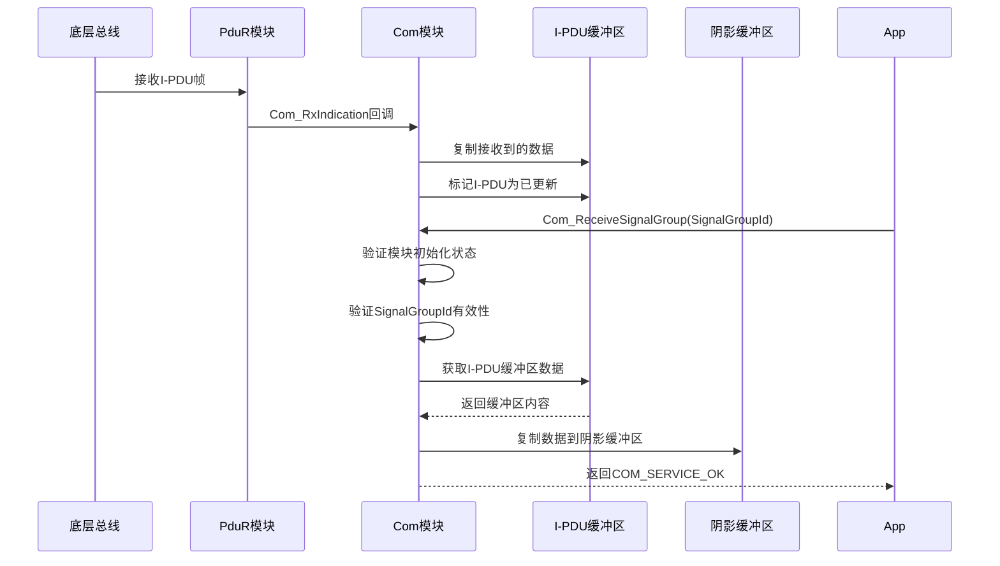

**图表来源**
- [Com.c:631-655](file://src/bsw/services/com/src/Com.c#L631-L655)

#### 关键实现细节

1. **接收流程**：通过Com_RxIndication回调接收网络数据
2. **数据存储**：将接收到的I-PDU数据复制到I-PDU缓冲区
3. **延迟解包**：实际的信号解包在Com_ReceiveSignal调用时进行
4. **缓冲区管理**：将I-PDU缓冲区内容复制到阴影缓冲区供应用读取

**章节来源**
- [Com.c:631-655](file://src/bsw/services/com/src/Com.c#L631-L655)

### 信号组配置结构体设计原理

#### SignalGroupRef引用机制

Com模块采用SignalGroupRef字段实现信号到I-PDU/信号组的引用关系：

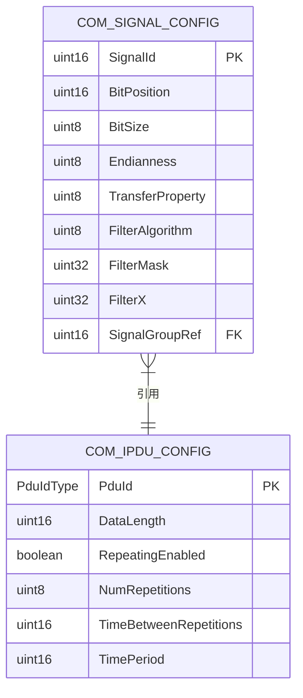

**图表来源**
- [Com.h:198-219](file://src/bsw/services/com/include/Com.h#L198-L219)
- [Com.h:130-142](file://src/bsw/services/com/include/Com.h#L130-L142)

#### 组内信号排序规则

Com模块遵循以下信号排序规则：

1. **按BitPosition升序排列**：确保信号在I-PDU中的物理布局符合位域定义
2. **按SignalId顺序**：提供稳定的信号标识符映射
3. **按Endianness分组**：相同字节序的信号相邻存储

**章节来源**
- [Com.h:198-219](file://src/bsw/services/com/include/Com.h#L198-L219)
- [Com_Cfg.h:35-49](file://src/bsw/services/com/include/Com_Cfg.h#L35-L49)

### 传输策略详解

#### 组内信号优先级处理

Com模块支持多种传输属性来处理信号优先级：

| 传输属性 | 描述 | 行为特征 |
|---------|------|----------|
| COM_TRIGGERED | 触发式传输 | 信号更新时立即触发传输 |
| COM_TRIGGERED_ON_CHANGE | 变化触发 | 仅当信号值变化时触发传输 |
| COM_TRIGGERED_ON_CHANGE_WITHOUT_REPETITION | 无重复变化触发 | 变化触发但不重复传输 |
| COM_PENDING | 待处理传输 | 需要显式触发才传输 |

#### 批量发送优化

Com模块通过阴影缓冲区实现批量发送优化：

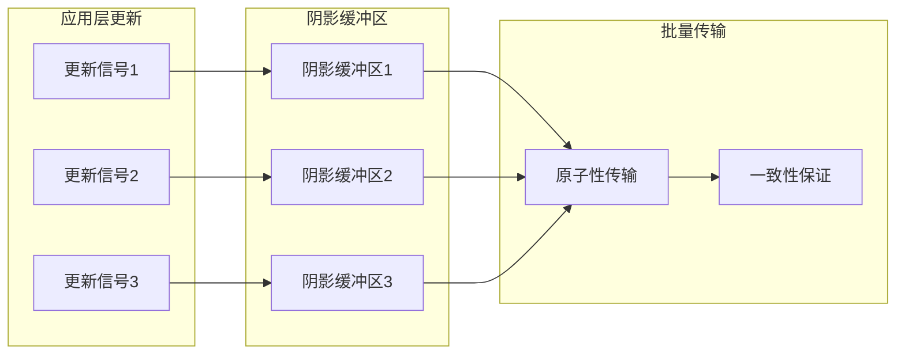

**图表来源**
- [Com_spec.md:273-289](file://openspec/changes/dev-com-module/specs/Com_spec.md#L273-L289)

#### 错误传播机制

Com模块实现了完整的错误传播机制：

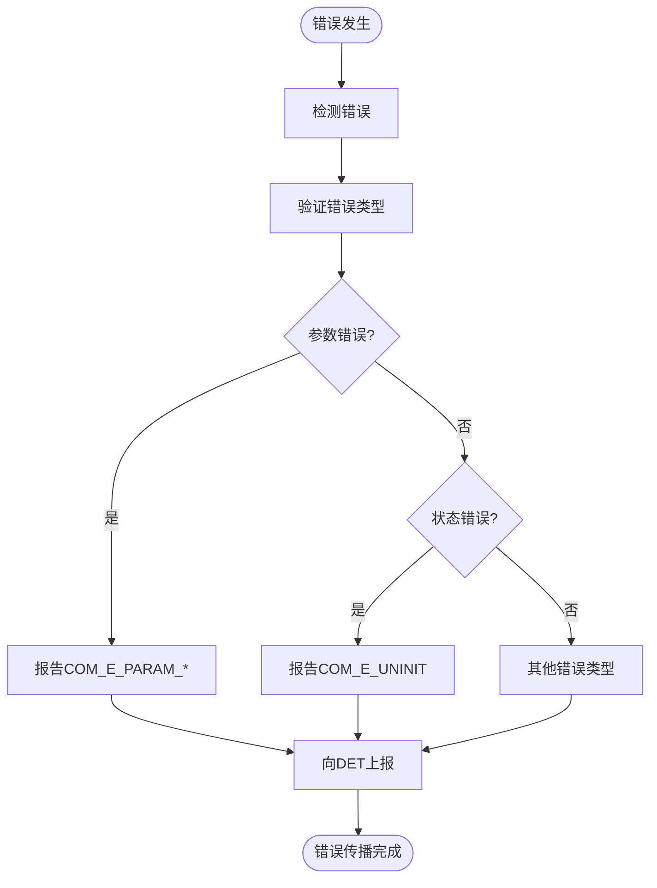

**图表来源**
- [Com.c:45-50](file://src/bsw/services/com/src/Com.c#L45-L50)

**章节来源**
- [Com.h:89-103](file://src/bsw/services/com/include/Com.h#L89-L103)
- [Com.c:45-50](file://src/bsw/services/com/src/Com.c#L45-L50)

### 信号组状态管理

#### COM_E_UPDATE_DETECTED状态

COM_E_UPDATE_DETECTED状态用于指示信号更新检测：

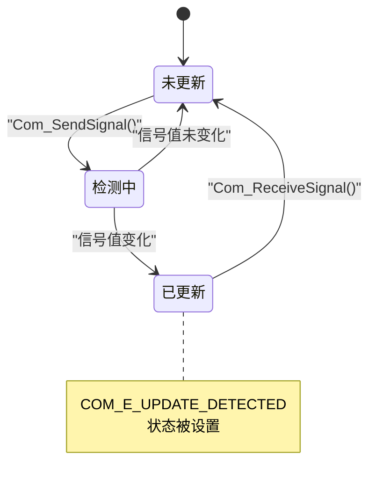

#### COM_E_SKIPPED_TRANSMISSION状态

COM_E_SKIPPED_TRANSMISSION状态表示传输被跳过：

| 触发条件 | 状态含义 | 处理方式 |
|---------|----------|----------|
| 过滤器阻止 | 信号被过滤 | 返回COM_SERVICE_OK但不传输 |
| 重复传输抑制 | 同一值重复传输 | 跳过传输请求 |
| 周期性传输间隔 | 未到传输时间 | 延迟到下次传输周期 |

**章节来源**
- [Com.h:104-127](file://src/bsw/services/com/include/Com.h#L104-L127)
- [Com.c:538-542](file://src/bsw/services/com/src/Com.c#L538-L542)

## 依赖关系分析

### 模块耦合度分析

Com模块的依赖关系体现了清晰的分层架构：

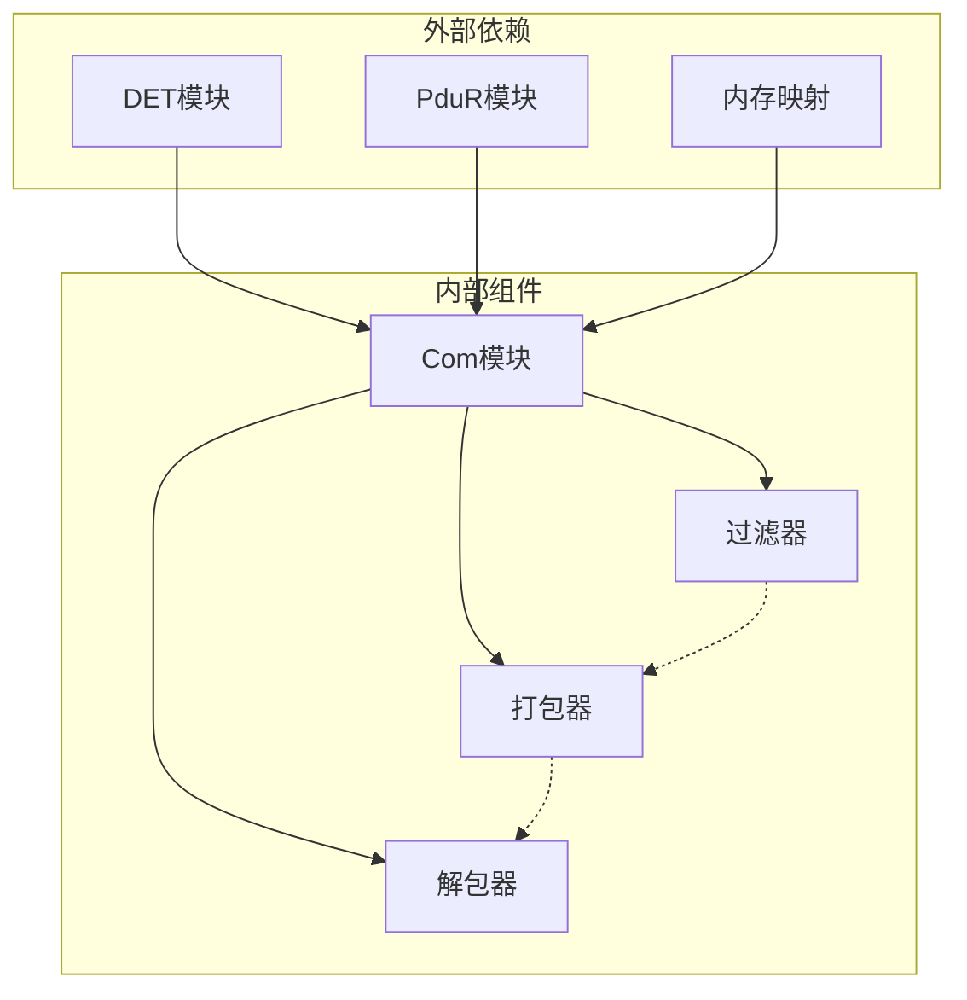

**图表来源**
- [Com_spec.md:312-324](file://openspec/changes/dev-com-module/specs/Com_spec.md#L312-L324)

### 直接和间接依赖

| 依赖类型 | 依赖对象 | 作用 |
|---------|----------|------|
| 直接依赖 | PduR_Transmit | I-PDU传输接口 |
| 直接依赖 | Det_ReportError | 错误检测上报 |
| 直接依赖 | MemMap.h | 内存分区管理 |
| 间接依赖 | Os模块 | 主函数调度 |
| 间接依赖 | RTE模块 | 应用接口 |

**章节来源**
- [Com_spec.md:312-324](file://openspec/changes/dev-com-module/specs/Com_spec.md#L312-L324)

## 性能考虑

### 内存使用优化

Com模块采用了多项内存优化技术：

1. **静态内存分配**：所有运行时状态使用静态内存，避免动态分配开销
2. **缓冲区复用**：阴影缓冲区和I-PDU缓冲区复用内存空间
3. **位域操作**：直接对位域进行操作，减少数据转换开销

### 处理效率优化

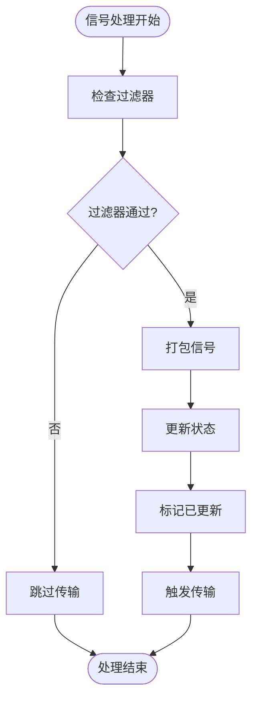

**图表来源**
- [Com.c:515-537](file://src/bsw/services/com/src/Com.c#L515-L537)

### 并发处理考虑

Com模块支持多信号组并发处理：

- **独立缓冲区**：每个I-PDU拥有独立的缓冲区，支持并行处理
- **状态隔离**：各I-PDU的状态相互独立，避免竞态条件
- **原子性操作**：信号组传输保证原子性，防止部分更新

## 故障排除指南

### 常见错误诊断

#### 参数验证错误

| 错误代码 | 触发条件 | 解决方案 |
|---------|----------|----------|
| COM_E_UNINIT | 模块未初始化调用 | 确保先调用Com_Init() |
| COM_E_PARAM_POINTER | 传入NULL指针 | 检查传入参数的有效性 |
| COM_E_INVALID_SIGNAL_GROUP_ID | SignalGroupId超出范围 | 验证信号组ID配置正确性 |

#### 传输问题诊断

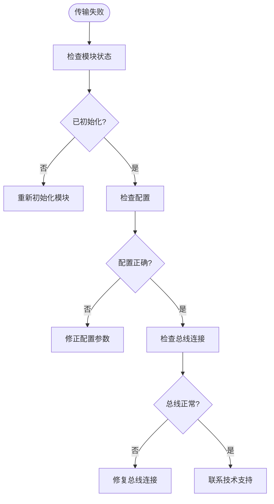

**图表来源**
- [Com_test.c:122-134](file://src/bsw/services/com/src/Com_test.c#L122-L134)

### 调试技巧

1. **启用DET错误检测**：在开发阶段始终启用COM_DEV_ERROR_DETECT
2. **使用单元测试**：参考Com_test.c中的测试用例进行功能验证
3. **内存监控**：定期检查缓冲区使用情况，避免内存泄漏
4. **日志记录**：在关键路径添加调试信息，便于问题定位

**章节来源**
- [Com_test.c:122-134](file://src/bsw/services/com/src/Com_test.c#L122-L134)
- [development-guide.md:431-494](file://docs/development-guide.md#L431-L494)

## 结论

Com模块的信号组处理功能为YuleTech AutoSAR BSW平台提供了强大而灵活的通信基础设施。通过精心设计的架构和实现，该功能实现了以下关键优势：

1. **原子性传输**：信号组内的所有信号以原子方式传输，确保数据一致性
2. **高效处理**：通过阴影缓冲区和批量处理机制，显著提升传输效率
3. **灵活配置**：支持多种传输属性和过滤算法，适应不同的应用场景
4. **可靠错误处理**：完善的错误检测和传播机制，确保系统的稳定性

该实现充分体现了AUTOSAR标准的要求，为车载网络通信提供了坚实的技术基础。通过遵循本文档的最佳实践和配置建议，开发者可以充分利用Com模块的功能，构建高性能的车载通信系统。

## 附录

### 配置最佳实践

#### 信号组配置建议

1. **合理规划信号组大小**：建议每个信号组包含3-8个相关信号
2. **优化信号排序**：按照BitPosition升序排列，提高打包效率
3. **选择合适的传输属性**：根据信号重要性和实时性要求选择传输模式

#### 性能优化技巧

1. **使用过滤器**：为频繁变化的信号配置适当的过滤算法
2. **批量处理**：利用阴影缓冲区实现批量信号更新
3. **内存对齐**：确保信号在I-PDU中的位域对齐，减少处理开销

#### 依赖关系设计建议

1. **明确信号依赖**：在配置中明确信号间的依赖关系
2. **避免循环依赖**：确保信号组配置不存在循环引用
3. **合理分组**：将功能相关的信号放在同一信号组中

**章节来源**
- [Com_Cfg.h:205-231](file://src/bsw/services/com/include/Com_Cfg.h#L205-L231)
- [Com_spec.md:204-231](file://openspec/changes/dev-com-module/specs/Com_spec.md#L204-L231)