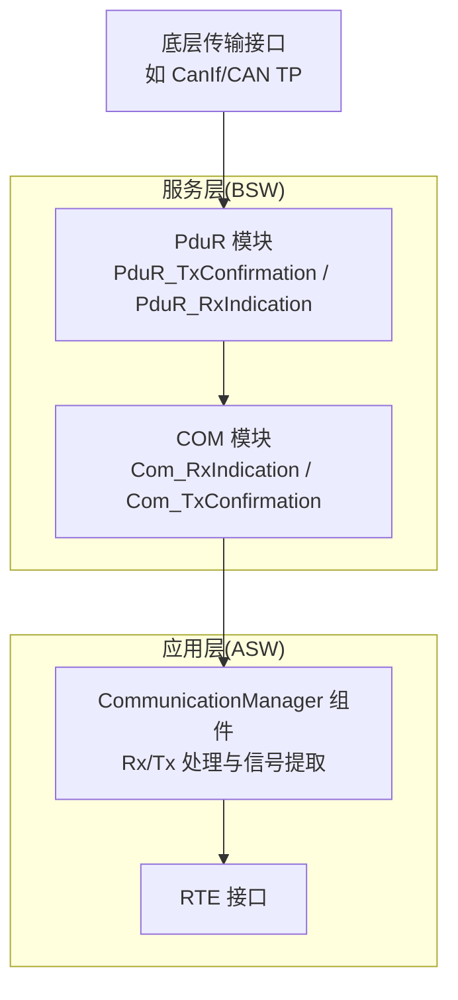
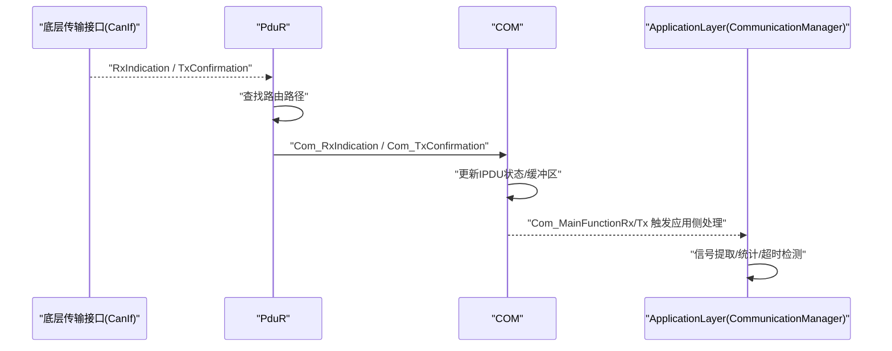
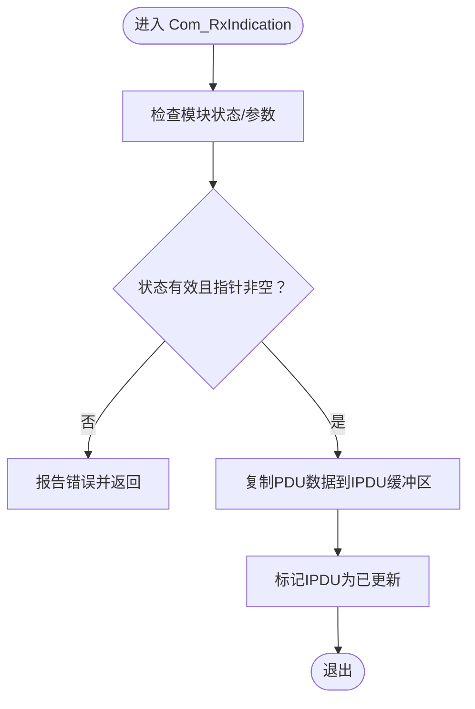
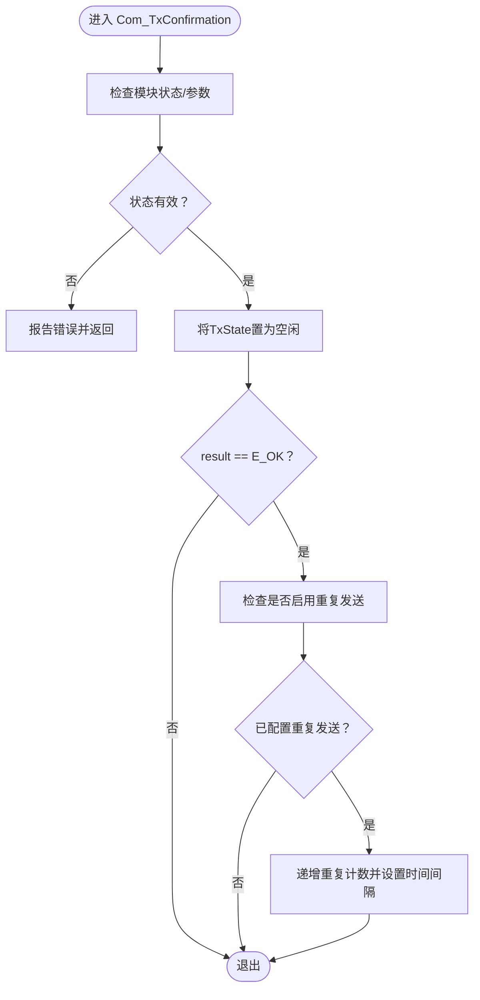
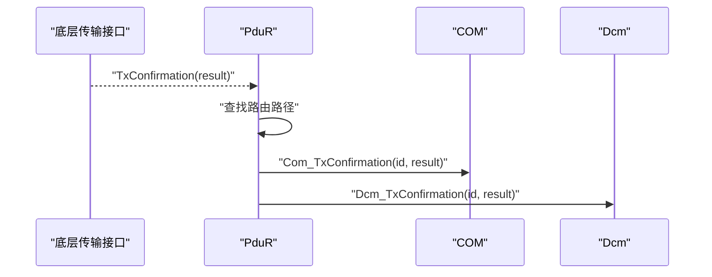
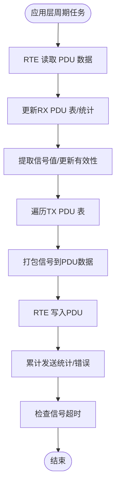

# 回调处理

<cite>
**本文引用的文件**
- [Com.h](file://src/bsw/services/com/include/Com.h)
- [Com.c](file://src/bsw/services/com/src/Com.c)
- [PduR.h](file://src/bsw/services/pdur/include/PduR.h)
- [PduR.c](file://src/bsw/services/pdur/src/PduR.c)
- [Com_Cfg.h](file://src/bsw/services/com/include/Com_Cfg.h)
- [Swc_CommunicationManager.h](file://src/asw/communication_manager/include/Swc_CommunicationManager.h)
- [Swc_CommunicationManager.c](file://src/asw/communication_manager/src/Swc_CommunicationManager.c)
</cite>

## 目录
1. [简介](#简介)
2. [项目结构](#项目结构)
3. [核心组件](#核心组件)
4. [架构总览](#架构总览)
5. [详细组件分析](#详细组件分析)
6. [依赖关系分析](#依赖关系分析)
7. [性能考虑](#性能考虑)
8. [故障排查指南](#故障排查指南)
9. [结论](#结论)
10. [附录](#附录)

## 简介
本文件聚焦于AUTOSAR Classic平台中“回调处理”子功能，系统性阐述COM服务层的两个关键回调接口：Com_RxIndication（接收指示）与Com_TxConfirmation（传输确认）。内容覆盖以下方面：
- 接收指示处理流程：数据包复制、信号提取、状态更新与应用层通知
- 传输确认处理流程：成功确认、重复发送、超时与资源释放
- 调用时机、参数传递与错误处理机制
- 回调注册、优先级管理与异常处理策略
- 最佳实践、性能优化建议与常见问题调试方法

## 项目结构
回调处理涉及的服务层与应用层组件如下：
- 服务层（BSW）
  - COM模块：提供Com_RxIndication与Com_TxConfirmation等回调接口
  - PduR模块：作为上层回调的分发器，将底层传输层的指示转发给COM等上层模块
- 应用层（ASW）
  - CommunicationManager组件：在应用层对PDU进行信号提取、统计与状态维护，并通过RTE与COM交互

**图表来源**
- [Com.c:831-861](file://src/bsw/services/com/src/Com.c#L831-L861)
- [Com.c:792-826](file://src/bsw/services/com/src/Com.c#L792-L826)
- [PduR.c:524-571](file://src/bsw/services/pdur/src/PduR.c#L524-L571)
- [Swc_CommunicationManager.c:87-132](file://src/asw/communication_manager/src/Swc_CommunicationManager.c#L87-L132)

**章节来源**
- [Com.h:444-463](file://src/bsw/services/com/include/Com.h#L444-L463)
- [PduR.h:256-276](file://src/bsw/services/pdur/include/PduR.h#L256-L276)

## 核心组件
- COM模块回调接口
  - Com_RxIndication：接收来自PduR的数据包指示，复制到内部IPDU缓冲区并标记更新
  - Com_TxConfirmation：接收来自PduR的传输确认，更新IPDU状态并处理重复发送
- PduR模块回调接口
  - PduR_TxConfirmation：从底层传输层收到确认后，按路由路径转发至COM/Dcm等上层模块
  - PduR_RxIndication：从底层接收数据后，按路由路径转发至COM/Dcm等上层模块
- 应用层CommunicationManager
  - 通过RTE读取/写入PDU数据，执行信号提取与统计，周期性检查信号超时

**章节来源**
- [Com.c:831-861](file://src/bsw/services/com/src/Com.c#L831-L861)
- [Com.c:792-826](file://src/bsw/services/com/src/Com.c#L792-L826)
- [PduR.c:524-571](file://src/bsw/services/pdur/src/PduR.c#L524-L571)
- [Swc_CommunicationManager.c:87-132](file://src/asw/communication_manager/src/Swc_CommunicationManager.c#L87-L132)

## 架构总览
回调处理的关键交互链路如下：
- 底层传输接口（如CanIf）产生数据或完成传输事件
- PduR根据配置的路由路径将事件向上层转发
- COM接收回调，更新内部状态并触发后续处理
- 应用层CommunicationManager通过RTE感知变化并进行业务处理

**图表来源**
- [PduR.c:524-571](file://src/bsw/services/pdur/src/PduR.c#L524-L571)
- [Com.c:831-861](file://src/bsw/services/com/src/Com.c#L831-L861)
- [Com.c:792-826](file://src/bsw/services/com/src/Com.c#L792-L826)
- [Swc_CommunicationManager.c:87-132](file://src/asw/communication_manager/src/Swc_CommunicationManager.c#L87-L132)

## 详细组件分析

### Com_RxIndication 接收回调
- 调用时机
  - 当底层传输层完成接收并将数据上报给PduR后，PduR根据路由路径调用Com_RxIndication
- 参数传递
  - RxPduId：接收的PDU标识
  - PduInfoPtr：指向PDU数据与长度的指针
- 处理逻辑
  - 参数校验（开发错误检测）
  - 将接收到的数据复制到COM内部IPDU缓冲区
  - 标记对应IPDU为“已更新”，以便后续Com_MainFunctionRx处理
- 错误处理
  - 若模块未初始化或指针为空，依据开发错误检测策略报告错误并返回

**图表来源**
- [Com.c:831-861](file://src/bsw/services/com/src/Com.c#L831-L861)

**章节来源**
- [Com.c:831-861](file://src/bsw/services/com/src/Com.c#L831-L861)
- [Com.h:444-451](file://src/bsw/services/com/include/Com.h#L444-L451)

### Com_TxConfirmation 接收回调
- 调用时机
  - 当底层传输层完成发送并将结果上报给PduR后，PduR根据路由路径调用Com_TxConfirmation
- 参数传递
  - TxPduId：发送的PDU标识
  - result：传输结果（E_OK表示成功）
- 处理逻辑
  - 参数校验（开发错误检测）
  - 将对应IPDU的传输状态置为“空闲”
  - 若传输成功且配置了重复发送，则递增重复计数并设置下次重复的时间计数
- 错误处理
  - 若模块未初始化，依据开发错误检测策略报告错误并返回

**图表来源**
- [Com.c:792-826](file://src/bsw/services/com/src/Com.c#L792-L826)

**章节来源**
- [Com.c:792-826](file://src/bsw/services/com/src/Com.c#L792-L826)
- [Com.h:455-463](file://src/bsw/services/com/include/Com.h#L455-L463)

### PduR 回调转发机制
- PduR_TxConfirmation
  - 查找目标路由路径，将底层传输层的确认结果转发给上层模块（如COM/Dcm）
- PduR_RxIndication
  - 查找目标路由路径，将底层接收的数据转发给上层模块（如COM/Dcm）

**图表来源**
- [PduR.c:524-571](file://src/bsw/services/pdur/src/PduR.c#L524-L571)

**章节来源**
- [PduR.c:524-571](file://src/bsw/services/pdur/src/PduR.c#L524-L571)
- [PduR.h:256-276](file://src/bsw/services/pdur/include/PduR.h#L256-L276)

### 应用层回调处理（CommunicationManager）
- Rx处理
  - 通过RTE读取PDU数据，更新内部RX PDU表
  - 提取信号值、更新时间戳与有效性标志，累计接收统计
- Tx处理
  - 从内部TX PDU表打包信号数据，写回RTE以供上层发送
  - 统计发送次数与错误
- 周期性任务
  - 定期检查信号超时，更新通信状态并通过RTE对外发布

**图表来源**
- [Swc_CommunicationManager.c:87-132](file://src/asw/communication_manager/src/Swc_CommunicationManager.c#L87-L132)
- [Swc_CommunicationManager.c:137-169](file://src/asw/communication_manager/src/Swc_CommunicationManager.c#L137-L169)
- [Swc_CommunicationManager.c:174-188](file://src/asw/communication_manager/src/Swc_CommunicationManager.c#L174-L188)

**章节来源**
- [Swc_CommunicationManager.c:87-132](file://src/asw/communication_manager/src/Swc_CommunicationManager.c#L87-L132)
- [Swc_CommunicationManager.c:137-169](file://src/asw/communication_manager/src/Swc_CommunicationManager.c#L137-L169)
- [Swc_CommunicationManager.c:174-188](file://src/asw/communication_manager/src/Swc_CommunicationManager.c#L174-L188)
- [Swc_CommunicationManager.h:125-179](file://src/asw/communication_manager/include/Swc_CommunicationManager.h#L125-L179)

## 依赖关系分析
- COM对PduR的依赖
  - COM通过PduR进行PDU传输与触发，TxConfirmation/RxIndication由PduR回调
- PduR对底层传输层的依赖
  - PduR根据配置的路由路径将事件转发至上层模块
- 应用层对COM/RTE的依赖
  - CommunicationManager通过RTE与COM交互，读取/写入PDU数据

**图表来源**
- [PduR.c:524-571](file://src/bsw/services/pdur/src/PduR.c#L524-L571)
- [Com.c:831-861](file://src/bsw/services/com/src/Com.c#L831-L861)
- [Swc_CommunicationManager.c:87-132](file://src/asw/communication_manager/src/Swc_CommunicationManager.c#L87-L132)

**章节来源**
- [Com.h:444-463](file://src/bsw/services/com/include/Com.h#L444-L463)
- [PduR.h:256-276](file://src/bsw/services/pdur/include/PduR.h#L256-L276)

## 性能考虑
- 缓冲区与拷贝
  - 接收时仅复制有效长度，避免越界与多余内存操作
- 更新标志位
  - 使用IPDU“已更新”标志位，减少不必要的信号解包与处理
- 重复发送与周期调度
  - 通过时间计数器与重复计数器控制重复发送节奏，降低CPU占用
- 开发错误检测
  - 在开发阶段开启错误检测可快速定位问题，但需注意运行时开销

[本节为通用指导，无需特定文件引用]

## 故障排查指南
- 常见问题与定位
  - 回调未触发：检查PduR路由配置与底层传输层回调是否正确上报
  - 接收数据不更新：确认Com_RxIndication被调用、IPDU缓冲区复制成功、更新标志位被清零
  - 发送未完成：确认Com_TxConfirmation被调用、重复计数与时间计数正确更新
  - 应用层无信号：检查RTE端口读写、CommunicationManager的信号提取逻辑
- 调试建议
  - 启用开发错误检测，观察错误码与调用序列
  - 在关键路径添加日志或断点，跟踪回调参数与内部状态变化
  - 对比配置文件（如Com_Cfg.h）与实际行为，确保路由与传输模式一致

**章节来源**
- [Com_Cfg.h:15-18](file://src/bsw/services/com/include/Com_Cfg.h#L15-L18)
- [Com.c:831-861](file://src/bsw/services/com/src/Com.c#L831-L861)
- [Com.c:792-826](file://src/bsw/services/com/src/Com.c#L792-L826)

## 结论
COM模块的回调处理机制清晰地划分了接收与发送两条路径：接收侧负责数据复制与状态标记，发送侧负责状态恢复与重复发送控制；PduR作为中间层负责回调的路由与分发；应用层通过RTE与COM协作完成信号提取与统计。遵循本文的最佳实践与排错方法，可有效提升系统的稳定性与可维护性。

[本节为总结性内容，无需特定文件引用]

## 附录
- 关键配置项
  - COM_NUM_IPDUS、COM_MAX_IPDU_BUFFER_SIZE：决定IPDU数量与缓冲区大小
  - COM_MAIN_FUNCTION_PERIOD_MS：主函数周期，影响接收/发送处理频率
  - COM_DEV_ERROR_DETECT：开发错误检测开关
- 相关API参考
  - Com_RxIndication、Com_TxConfirmation、Com_MainFunctionRx、Com_MainFunctionTx

**章节来源**
- [Com_Cfg.h:23-33](file://src/bsw/services/com/include/Com_Cfg.h#L23-L33)
- [Com_Cfg.h:109-111](file://src/bsw/services/com/include/Com_Cfg.h#L109-L111)
- [Com.h:444-498](file://src/bsw/services/com/include/Com.h#L444-L498)