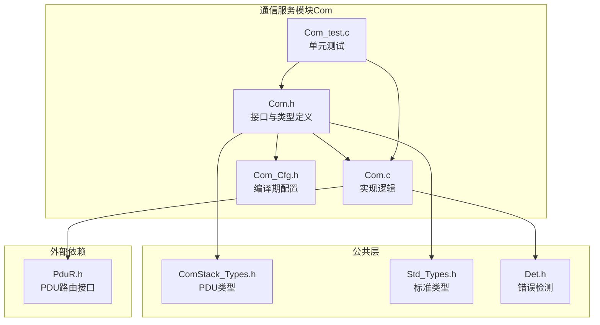
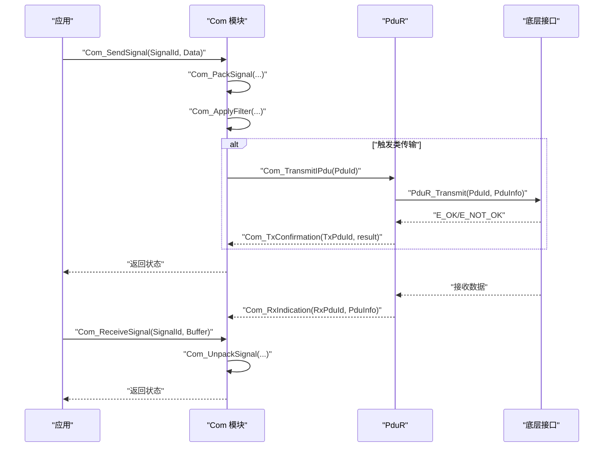
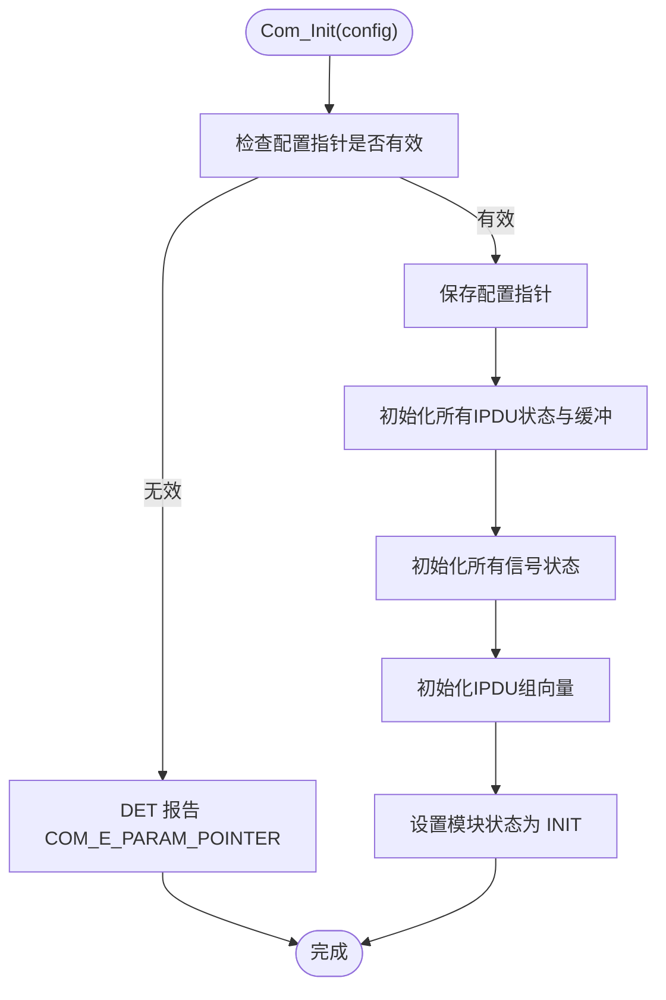
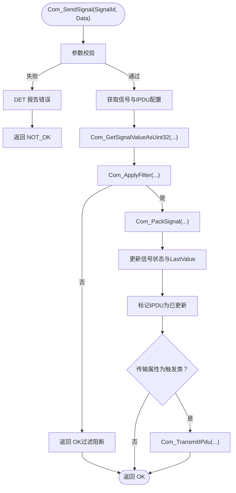
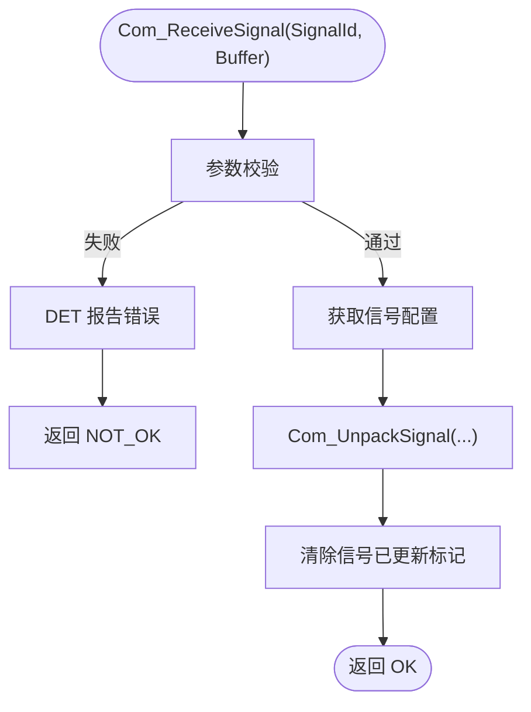
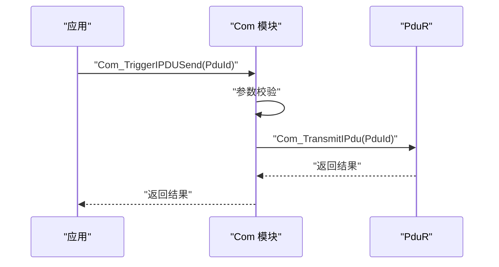
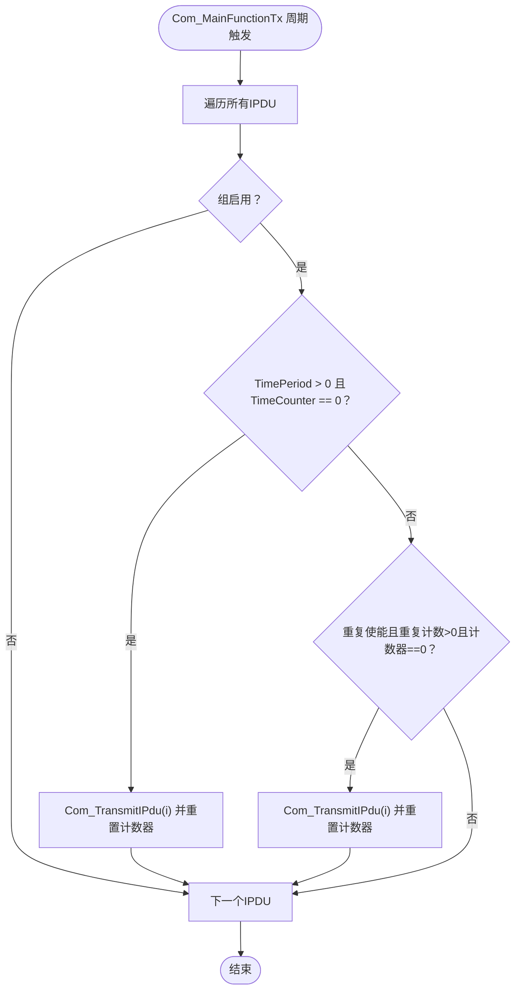
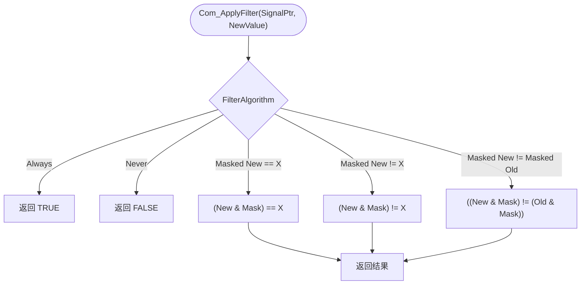
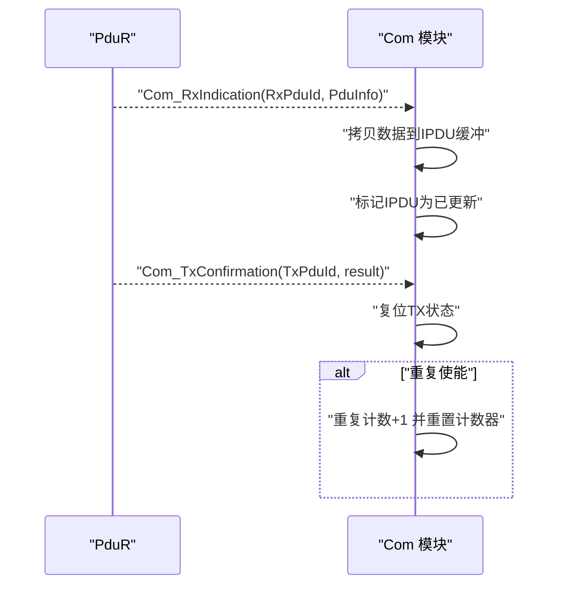
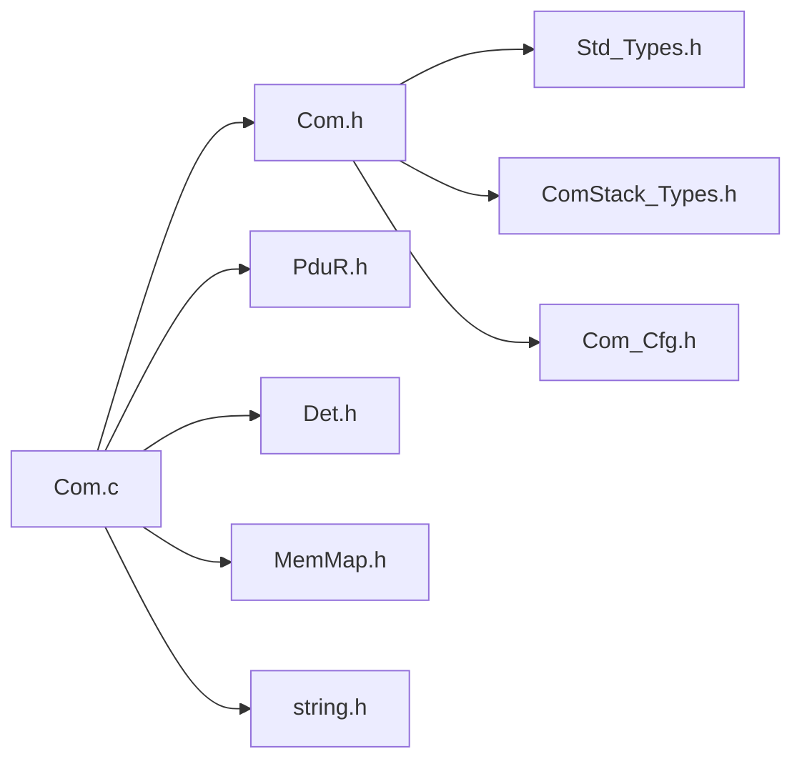

# 通信服务 (Com)

<cite>
**本文引用的文件列表**
- [Com.h](file://src/bsw/services/com/include/Com.h)
- [Com_Cfg.h](file://src/bsw/services/com/include/Com_Cfg.h)
- [Com.c](file://src/bsw/services/com/src/Com.c)
- [Com_test.c](file://src/bsw/services/com/src/Com_test.c)
- [ComStack_Types.h](file://src/bsw/ecual/include/ComStack_Types.h)
- [Std_Types.h](file://src/bsw/os/include/Std_Types.h)
- [Det.h](file://src/bsw/services/det/include/Det.h)
- [Com_Cfg.h（模板）](file://src/bsw/config/templates/Com_Cfg.h)
- [PduR_Cfg.h（模板）](file://src/bsw/config/templates/PduR_Cfg.h)
- [main.c（CAN示例）](file://examples/can_demo/main.c)
</cite>

## 目录
1. [简介](#简介)
2. [项目结构](#项目结构)
3. [核心组件](#核心组件)
4. [架构总览](#架构总览)
5. [详细组件分析](#详细组件分析)
6. [依赖关系分析](#依赖关系分析)
7. [性能考量](#性能考量)
8. [故障排查指南](#故障排查指南)
9. [结论](#结论)
10. [附录](#附录)

## 简介
本文件面向通信服务模块（Com）的技术文档，聚焦于信号发送与接收、I-PDU管理、信号组处理与传输模式控制。文档将系统阐述：
- 初始化流程 Com_Init 的内部状态与缓冲区建立
- 信号处理机制：Com_SendSignal 与 Com_ReceiveSignal 的打包/解包、过滤与更新标记
- I-PDU 触发流程：Com_TriggerIPDUSend 的触发路径与与PduR交互
- 配置结构体设计：Com_SignalConfigType 与 Com_IPduConfigType 的字段语义与约束
- 传输模式（直接、周期性、混合、无）、过滤算法（始终、从不、掩码比较等）与端序处理
- 错误码与状态管理、回调机制（Com_RxIndication、Com_TxConfirmation）
- 配置参数说明、性能优化建议与常见问题解决方案

## 项目结构
Com 模块位于 BSW 层的服务子目录中，采用头文件声明接口、源文件实现逻辑，并通过配置头文件进行编译期配置。典型文件组织如下：
- 接口头文件：Com.h
- 配置头文件：Com_Cfg.h
- 实现文件：Com.c
- 单元测试：Com_test.c
- 公共类型：ComStack_Types.h、Std_Types.h
- 错误检测：Det.h
- 配置模板：Com_Cfg.h（模板）、PduR_Cfg.h（模板）

图表来源
- [Com.h:1-508](file://src/bsw/services/com/include/Com.h#L1-L508)
- [Com.c:1-1184](file://src/bsw/services/com/src/Com.c#L1-L1184)
- [Com_Cfg.h:1-124](file://src/bsw/services/com/include/Com_Cfg.h#L1-L124)
- [ComStack_Types.h:1-170](file://src/bsw/ecual/include/ComStack_Types.h#L1-L170)
- [Std_Types.h:1-117](file://src/bsw/os/include/Std_Types.h#L1-L117)
- [Det.h:1-76](file://src/bsw/services/det/include/Det.h#L1-L76)

章节来源
- [Com.h:1-508](file://src/bsw/services/com/include/Com.h#L1-L508)
- [Com.c:1-1184](file://src/bsw/services/com/src/Com.c#L1-L1184)
- [Com_Cfg.h:1-124](file://src/bsw/services/com/include/Com_Cfg.h#L1-L124)

## 核心组件
- 模块状态与运行时数据
  - 内部状态：模块初始化标志、配置指针、各IPDU运行时状态、信号运行时状态、IPDU缓冲区、阴影缓冲区、IPDU组向量
  - 关键类型：Com_InternalStateType、Com_IPduStateType、Com_SignalStateType
- 接口函数族
  - 初始化/去初始化：Com_Init、Com_DeInit
  - 信号处理：Com_SendSignal、Com_ReceiveSignal、Com_SendSignalGroup、Com_ReceiveSignalGroup、Com_UpdateShadowSignal、Com_ReceiveShadowSignal、Com_InvalidateSignal、Com_InvalidateSignalGroup
  - I-PDU触发与回调：Com_TriggerIPDUSend、Com_TriggerTransmit、Com_RxIndication、Com_TxConfirmation
  - 周期与主函数：Com_MainFunctionRx、Com_MainFunctionTx、Com_MainFunctionRouteSignals
  - 组控制与DM：Com_IpduGroupControl、Com_ReceptionDMControl、Com_EnableReceptionDM、Com_DisableReceptionDM
- 配置结构体
  - Com_ConfigType：包含信号配置数组与数量、IPDU配置数组与数量
  - Com_SignalConfigType：信号位位置、大小、端序、传输属性、过滤算法、掩码、阈值、所属IPDU引用
  - Com_IPduConfigType：PDU标识、长度、重复使能、重复次数、重复间隔、周期

章节来源
- [Com.h:187-227](file://src/bsw/services/com/include/Com.h#L187-L227)
- [Com.c:89-124](file://src/bsw/services/com/src/Com.c#L89-L124)

## 架构总览
Com 模块在 AUTOSAR 经典平台下工作，与 PduR 进行数据交换，通过回调完成接收与发送确认。其核心数据流如下：
- 发送路径：应用调用 Com_SendSignal -> 打包到IPDU缓冲 -> 若传输属性为触发类则触发 Com_TransmitIPdu -> 通过 PduR_Transmit 提交
- 接收路径：PduR 回调 Com_RxIndication -> 将收到的数据拷贝至IPDU缓冲 -> 应用调用 Com_ReceiveSignal -> 解包到用户缓冲
- 周期性：Com_MainFunctionTx 根据IPDU配置的周期与重复参数推进计数器并触发传输

图表来源
- [Com.c:478-590](file://src/bsw/services/com/src/Com.c#L478-L590)
- [Com.c:728-761](file://src/bsw/services/com/src/Com.c#L728-L761)
- [Com.c:792-826](file://src/bsw/services/com/src/Com.c#L792-L826)
- [Com.c:831-861](file://src/bsw/services/com/src/Com.c#L831-L861)

## 详细组件分析

### 初始化流程 Com_Init
- 输入：Com_ConfigType 指针
- 功能：
  - 存储配置指针
  - 初始化所有IPDU的状态（空闲、计数器清零、未更新、默认启用）
  - 清空每个IPDU缓冲区
  - 初始化所有信号状态（未更新、过滤未通过、上一次值清零）
  - 初始化IPDU组向量（默认启用全部组）
  - 设置模块状态为已初始化
- 错误处理：当 COM_DEV_ERROR_DETECT 开启且输入为空指针时，上报 COM_E_PARAM_POINTER

图表来源
- [Com.c:405-453](file://src/bsw/services/com/src/Com.c#L405-L453)

章节来源
- [Com.c:405-453](file://src/bsw/services/com/src/Com.c#L405-L453)

### 信号发送 Com_SendSignal
- 输入：信号ID、信号数据指针
- 流程：
  - 参数校验（初始化状态、指针有效性、信号ID范围）
  - 获取信号配置与所属IPDU配置
  - 将用户数据转换为uint32（按位宽选择）
  - 应用过滤算法（始终、从不、掩码比较等）
  - 若过滤通过，将信号打包进对应IPDU缓冲
  - 更新信号状态（已更新、过滤通过、记录新值）
  - 标记IPDU为已更新
  - 若传输属性为触发类（触发或变化触发），立即触发 Com_TransmitIPdu
- 返回：COM_SERVICE_OK 或 COM_SERVICE_NOT_OK（过滤阻断也视为成功）

图表来源
- [Com.c:478-546](file://src/bsw/services/com/src/Com.c#L478-L546)
- [Com.c:134-190](file://src/bsw/services/com/src/Com.c#L134-L190)
- [Com.c:243-279](file://src/bsw/services/com/src/Com.c#L243-L279)

章节来源
- [Com.c:478-546](file://src/bsw/services/com/src/Com.c#L478-L546)

### 信号接收 Com_ReceiveSignal
- 输入：信号ID、输出缓冲指针
- 流程：
  - 参数校验（初始化状态、指针有效性、信号ID范围）
  - 获取信号配置
  - 从对应IPDU缓冲解包到用户缓冲
  - 清除信号“已更新”标记
- 返回：COM_SERVICE_OK

图表来源
- [Com.c:551-590](file://src/bsw/services/com/src/Com.c#L551-L590)
- [Com.c:195-238](file://src/bsw/services/com/src/Com.c#L195-L238)

章节来源
- [Com.c:551-590](file://src/bsw/services/com/src/Com.c#L551-L590)

### I-PDU 触发 Com_TriggerIPDUSend
- 输入：PDU ID
- 流程：
  - 参数校验（初始化状态、PDU ID范围）
  - 直接调用 Com_TransmitIPdu
- 返回：E_OK/E_NOT_OK

图表来源
- [Com.c:766-787](file://src/bsw/services/com/src/Com.c#L766-L787)
- [Com.c:335-358](file://src/bsw/services/com/src/Com.c#L335-L358)

章节来源
- [Com.c:766-787](file://src/bsw/services/com/src/Com.c#L766-L787)

### 传输模式与周期控制
- 传输模式枚举：直接（COM_DIRECT）、周期性（COM_PERIODIC）、混合（COM_MIXED）、无（COM_NONE）
- IPDU配置中的周期与重复参数：
  - TimePeriod：周期计数器，0表示禁用
  - RepeatingEnabled/NumRepetitions/TimeBetweenRepetitions：重复使能、重复次数、重复间隔
- 主函数 Com_MainFunctionTx：
  - 遍历所有IPDU，若组启用
  - 当 TimeCounter 为0 且 TimePeriod > 0，则触发 Com_TransmitIPdu 并重置计数器
  - 若重复使能且重复计数>0且计数器为0，则触发 Com_TransmitIPdu 并重置计数器

图表来源
- [Com.c:898-941](file://src/bsw/services/com/src/Com.c#L898-L941)

章节来源
- [Com.c:898-941](file://src/bsw/services/com/src/Com.c#L898-L941)

### 过滤算法与端序处理
- 过滤算法（FilterAlgorithm）：
  - 始终（COM_ALWAYS）、从不（COM_NEVER）
  - 掩码比较：等于/不等于/屏蔽后的新旧值不同
  - 默认：其他情况视为通过
- 端序（Endianness）：
  - 小端（COM_LITTLE_ENDIAN）与大端（COM_BIG_ENDIAN）
  - 打包/解包时根据位起始位置与端序逐位写入/读取
- 数据类型转换：
  - Com_GetSignalValueAsUint32：按位宽选择读取
  - Com_SetSignalValueFromUint32：按位宽选择写回

图表来源
- [Com.c:243-279](file://src/bsw/services/com/src/Com.c#L243-L279)

章节来源
- [Com.c:134-190](file://src/bsw/services/com/src/Com.c#L134-L190)
- [Com.c:195-238](file://src/bsw/services/com/src/Com.c#L195-L238)
- [Com.c:243-279](file://src/bsw/services/com/src/Com.c#L243-L279)
- [Com.c:284-330](file://src/bsw/services/com/src/Com.c#L284-L330)

### 回调机制与状态管理
- Com_RxIndication：接收到来自PduR的数据后，复制到对应IPDU缓冲并标记更新
- Com_TxConfirmation：接收发送确认后，复位TX状态；若配置了重复，推进重复计数并重置计数器
- 状态查询：Com_GetStatus 返回模块初始化状态

图表来源
- [Com.c:831-861](file://src/bsw/services/com/src/Com.c#L831-L861)
- [Com.c:792-826](file://src/bsw/services/com/src/Com.c#L792-L826)

章节来源
- [Com.c:792-826](file://src/bsw/services/com/src/Com.c#L792-L826)
- [Com.c:831-861](file://src/bsw/services/com/src/Com.c#L831-L861)
- [Com.c:965-968](file://src/bsw/services/com/src/Com.c#L965-L968)

### 配置结构体设计原理
- Com_SignalConfigType 字段
  - SignalId：信号唯一标识
  - BitPosition/BitSize：信号在IPDU中的位起始与位宽
  - Endianness：端序（小端/大端/不透明）
  - TransferProperty：传输属性（触发、变化触发、无等）
  - FilterAlgorithm/FilterMask/FilterX：过滤策略与参数
  - SignalGroupRef：所属IPDU（信号组即IPDU）
- Com_IPduConfigType 字段
  - PduId/DataLength：PDU标识与数据长度
  - RepeatingEnabled/NumRepetitions/TimeBetweenRepetitions：重复相关
  - TimePeriod：周期
- Com_ConfigType 字段
  - Signals/NumSignals、IPdus/NumIPdus：配置数组与数量

章节来源
- [Com.h:198-227](file://src/bsw/services/com/include/Com.h#L198-L227)

### 配置参数说明
- 编译期开关
  - COM_DEV_ERROR_DETECT：开启/关闭开发错误检测
  - COM_VERSION_INFO_API：是否提供版本信息查询
  - COM_ENABLE_MDT_FOR_CYCLIC_TRANSMISSION：周期传输MDT支持
  - COM_RETRY_FAILED_TRANSMIT_REQUESTS：重试失败的传输请求
- 数量与缓冲
  - COM_NUM_SIGNALS、COM_NUM_GROUP_SIGNALS、COM_NUM_IPDUS、COM_NUM_IPDU_GROUPS
  - COM_MAX_IPDU_BUFFER_SIZE：最大IPDU缓冲大小
- 信号与IPDU定义
  - COM_SIGNAL_*、COM_IPDU_*、COM_IPDU_GROUP_* 定义
- 传输模式与信号类型
  - COM_TX_MODE_*、COM_SIGNAL_TYPE_*、COM_LITTLE_ENDIAN/COM_BIG_ENDIAN/COM_OPAQUE
- 主函数周期
  - COM_MAIN_FUNCTION_PERIOD_MS、COM_MAIN_FUNCTION_RX_PERIOD_MS、COM_MAIN_FUNCTION_TX_PERIOD_MS
- 网关支持
  - COM_GATEWAY_SUPPORT、COM_NUM_SIGNAL_GW_MAPPINGS

章节来源
- [Com_Cfg.h:15-124](file://src/bsw/services/com/include/Com_Cfg.h#L15-L124)
- [Com_Cfg.h（模板）:18-127](file://src/bsw/config/templates/Com_Cfg.h#L18-L127)

## 依赖关系分析
- 头文件依赖
  - Com.h 依赖 Std_Types.h、Com_Cfg.h、ComStack_Types.h
  - Com.c 依赖 Com.h、Com_Cfg.h、PduR.h、Det.h、MemMap.h、string.h
- 类型与常量
  - PduIdType、PduInfoType 来自 ComStack_Types.h
  - Std_ReturnType、boolean、uint8/uint16/uint32 等来自 Std_Types.h
  - 错误码与状态常量来自 Com.h
- 外部接口
  - PduR_Transmit：用于触发传输
  - Det_ReportError：开发错误检测上报

图表来源
- [Com.h:18-24](file://src/bsw/services/com/include/Com.h#L18-L24)
- [Com.c:18-25](file://src/bsw/services/com/src/Com.c#L18-L25)

章节来源
- [Com.h:18-24](file://src/bsw/services/com/include/Com.h#L18-L24)
- [Com.c:18-25](file://src/bsw/services/com/src/Com.c#L18-L25)

## 性能考量
- 缓冲区与内存
  - IPDU缓冲区与阴影缓冲区大小由 COM_MAX_IPDU_BUFFER_SIZE 控制，应结合实际IPDU长度合理配置，避免浪费或溢出
  - 信号状态数组与IPDU状态数组线性增长，注意信号与IPDU数量上限
- 打包/解包复杂度
  - 位级操作为O(B)，B为信号位宽；对大量短位宽信号可考虑批量处理减少函数调用开销
- 过滤与重复
  - 过滤算法为常数时间判断；重复计数与周期计数在主函数中轮询，建议合理设置主函数周期与TimePeriod，避免频繁触发
- 错误检测
  - 开启 COM_DEV_ERROR_DETECT 会增加分支判断与DET调用，生产版本可关闭以降低开销

[本节为通用性能建议，无需特定文件来源]

## 故障排查指南
- 常见错误码与定位
  - COM_E_UNINIT：模块未初始化调用接口（如 Com_SendSignal 前未 Com_Init）
  - COM_E_PARAM_POINTER：传入空指针（如 Com_Init(NULL)、Com_SendSignal(SignalId, NULL)）
  - COM_E_INVALID_SIGNAL_ID/COM_E_INVALID_SIGNAL_GROUP_ID/COM_E_INVALID_IPDU_ID：ID越界
  - COM_E_PARAM：参数非法（例如 Com_Init 的配置指针）
- 排查步骤
  - 确认 Com_Init 已被调用且配置指针有效
  - 检查信号ID与IPDU ID是否在允许范围内
  - 检查 Com_Cfg.h 中的数量与缓冲大小配置是否满足需求
  - 在接收路径，确认 Com_RxIndication 是否被正确回调，且PduInfo指针与长度有效
  - 在发送路径，确认 Com_TransmitIPdu 是否被触发（触发类传输），以及PduR回调 Com_TxConfirmation 是否返回成功
- 单元测试参考
  - Com_test.c 提供了初始化、发送/接收、触发、版本信息等测试用例，可作为行为验证的参考

章节来源
- [Com.h:89-131](file://src/bsw/services/com/include/Com.h#L89-L131)
- [Com_test.c:111-394](file://src/bsw/services/com/src/Com_test.c#L111-L394)

## 结论
Com 模块提供了完整的信号打包/解包、过滤、I-PDU管理与周期/触发传输控制能力，接口清晰、配置灵活。通过合理的配置与主函数调度，可在多种总线环境中稳定运行。建议在集成阶段重点关注：
- 配置一致性（信号位域、IPDU长度、传输模式）
- 回调链路完整性（PduR回调与Com回调）
- 错误检测与日志策略（开发阶段开启，生产阶段评估）

[本节为总结，无需特定文件来源]

## 附录

### API 一览与用途
- Com_Init/Com_DeInit：模块生命周期管理
- Com_SendSignal/Com_ReceiveSignal：单信号发送/接收
- Com_SendSignalGroup/Com_ReceiveSignalGroup：信号组发送/接收
- Com_TriggerIPDUSend/Com_TriggerTransmit：I-PDU触发与数据提供
- Com_RxIndication/Com_TxConfirmation：接收与发送确认回调
- Com_MainFunctionRx/Com_MainFunctionTx/Com_MainFunctionRouteSignals：接收/发送/信号路由主函数
- Com_IpduGroupControl/Com_ReceptionDMControl：组控制与DM控制

章节来源
- [Com.h:243-501](file://src/bsw/services/com/include/Com.h#L243-L501)

### 示例参考
- CAN 示例展示了如何在主循环中调用底层模块的主函数，配合 Com 模块进行数据收发

章节来源
- [main.c（CAN示例）:63-118](file://examples/can_demo/main.c#L63-L118)