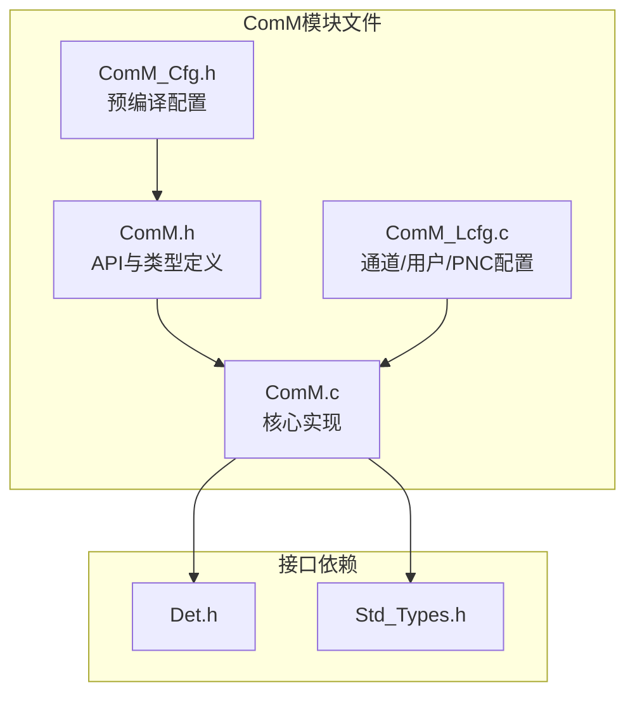
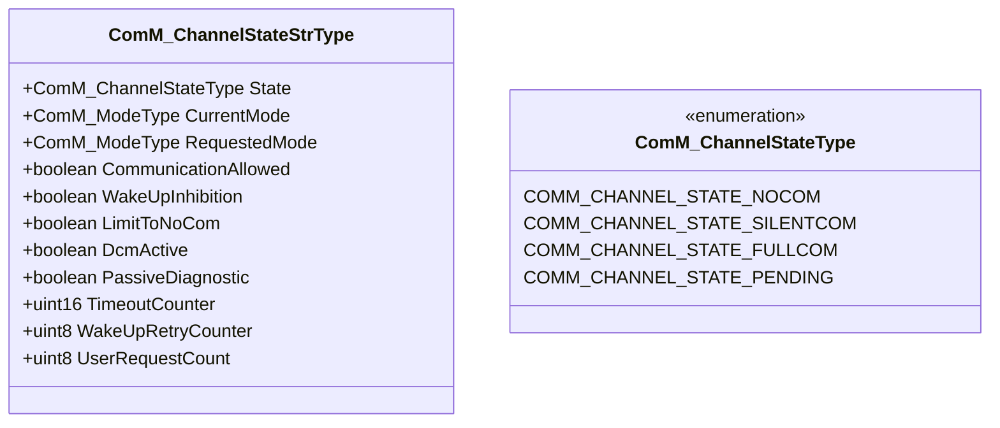
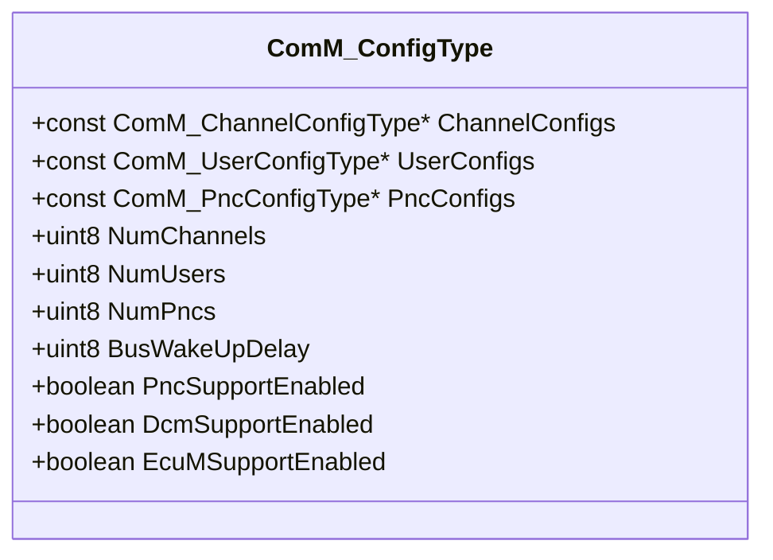
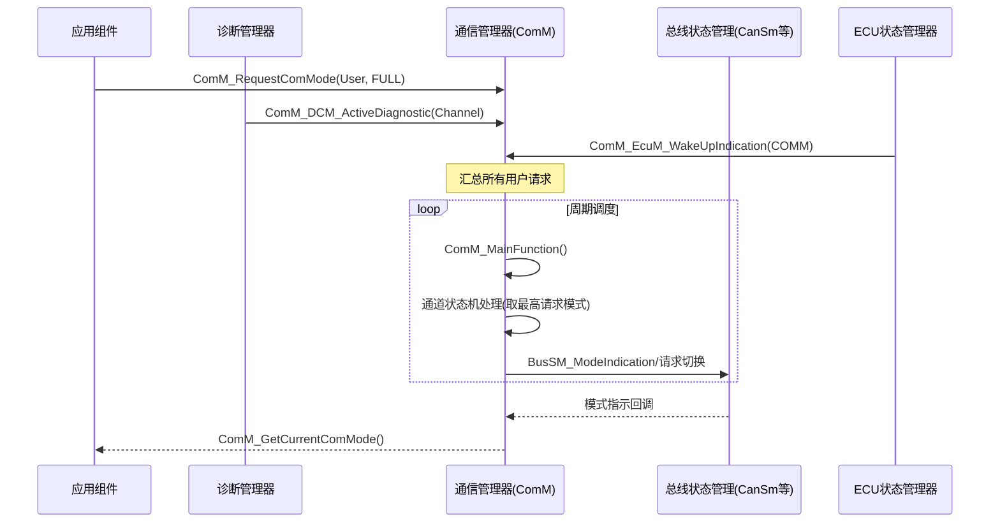
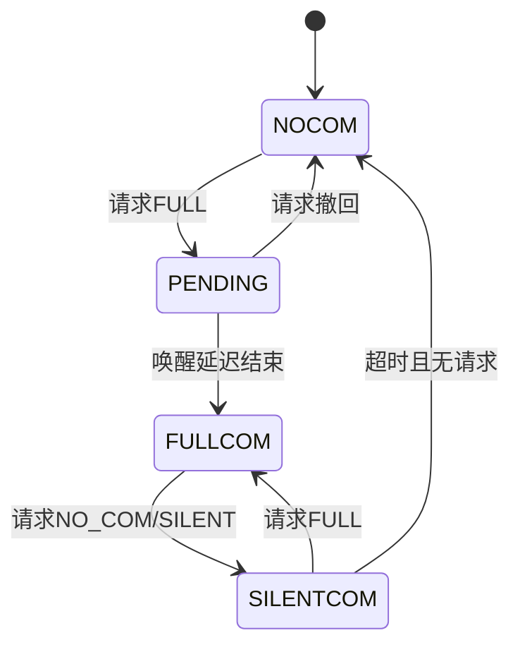
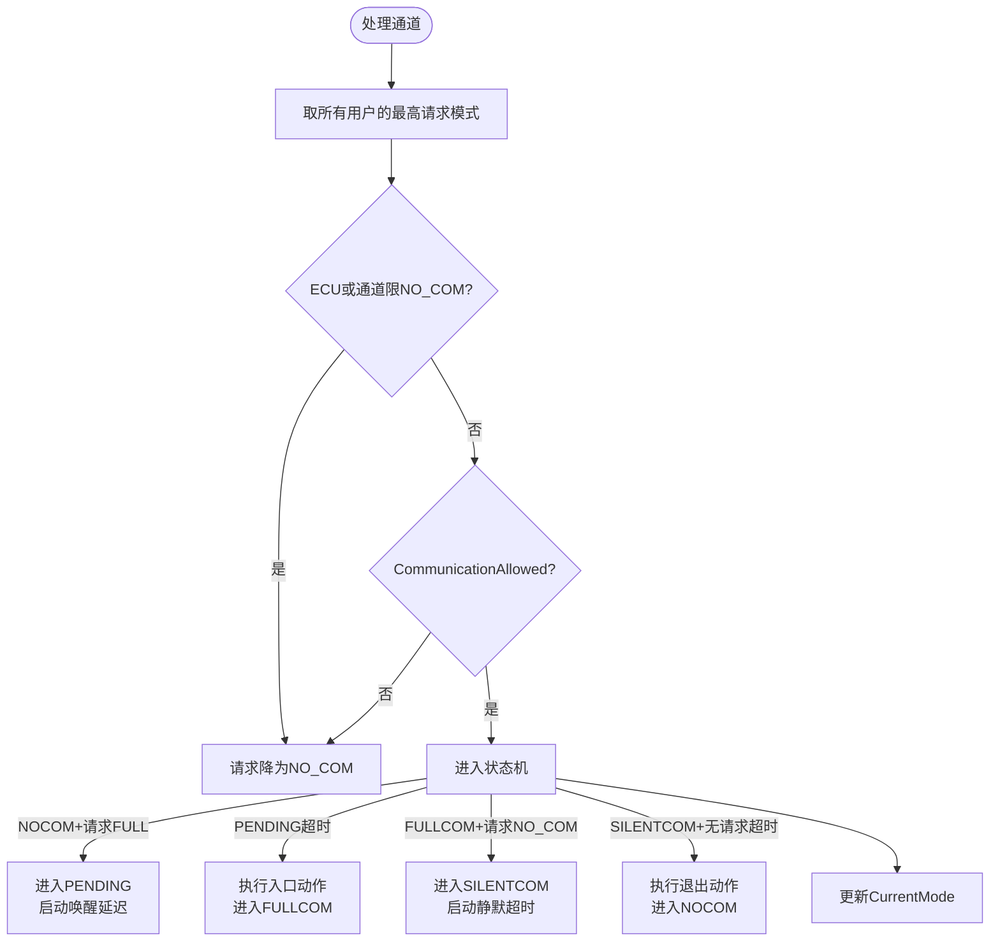

# 通信管理器（ComM）

<cite>
**本文档引用的文件**
- [ComM.h](file://src/bsw/services/comm/include/ComM.h)
- [ComM_Cfg.h](file://src/bsw/services/comm/include/ComM_Cfg.h)
- [ComM.c](file://src/bsw/services/comm/src/ComM.c)
- [ComM_Lcfg.c](file://src/bsw/services/comm/src/ComM_Lcfg.c)
- [Det.h](file://src/bsw/services/det/include/Det.h)
- [Std_Types.h](file://src/bsw/os/include/Std_Types.h)
</cite>

## 目录
1. [简介](#简介)
2. [项目结构](#项目结构)
3. [核心组件](#核心组件)
4. [架构概览](#架构概览)
5. [详细组件分析](#详细组件分析)
6. [依赖关系分析](#依赖关系分析)
7. [性能考虑](#性能考虑)
8. [故障排除指南](#故障排除指南)
9. [结论](#结论)
10. [附录](#附录)

## 简介

通信管理器（ComM）是遵循AUTOSAR经典平台4.0.3标准的通信模式管理模块，位于服务层。ComM统一管理ECU所有通信通道（CAN/ETH/LIN/FR）的通信模式（无通信/静默通信/全通信），汇总各用户（应用组件、Dcm、Dem、Nvm等）的通信请求，通过通道状态机驱动底层BusSM完成模式切换。

ComM还提供Partial Network Cluster（PNC）管理、总线唤醒处理、Dcm诊断模式集成、Nvm抑制状态存储等功能。模块ID为0x12U（COMM_MODULE_ID），软件版本1.0.0。

## 项目结构

ComM模块在项目中的文件组织如下：



**图表来源**
- [ComM.h:20-27](file://src/bsw/services/comm/include/ComM.h#L20-L27)
- [ComM.c:27-31](file://src/bsw/services/comm/src/ComM.c#L27-L31)

### 文件清单

| 文件 | 路径 | 职责 |
|------|------|------|
| ComM.h | include/ComM.h | API、模式/状态枚举、配置类型 |
| ComM_Cfg.h | include/ComM_Cfg.h | 预编译配置（4通道/8用户/2PNC） |
| ComM.c | src/ComM.c | 通道状态机、PNC状态机、集成接口 |
| ComM_Lcfg.c | src/ComM_Lcfg.c | 链接期配置表 |

**章节来源**
- [ComM.h:1-215](file://src/bsw/services/comm/include/ComM.h#L1-L215)

## 核心组件

### 通信模式（ComM_ModeType）

| 模式 | 值 | 说明 |
|------|----|----|
| COMM_NO_COMMUNICATION | 0x00U | 无通信 |
| COMM_SILENT_COMMUNICATION | 0x01U | 静默通信（仅接收） |
| COMM_FULL_COMMUNICATION | 0x02U | 全通信 |

### 通道状态（ComM_ChannelStateType）



**图表来源**
- [ComM.c:63-75](file://src/bsw/services/comm/src/ComM.c#L63-L75)
- [ComM.h:72-77](file://src/bsw/services/comm/include/ComM.h#L72-L77)

### 用户请求（ComM_UserRequestType）

每个用户维护请求状态：RequestedMode（请求的模式）+ Active（请求激活标志）。用户包括：DCM、DEM、NVM、ECUM、SWC0/SWC1、DIAG、APPL。

### 配置结构（ComM_ConfigType）



**章节来源**
- [ComM.h:117-128](file://src/bsw/services/comm/include/ComM.h#L117-L128)

## 架构概览

ComM在通信管理架构中的枢纽位置：



**图表来源**
- [ComM.c:107-150](file://src/bsw/services/comm/src/ComM.c#L107-L150)

### 通道状态机



**章节来源**
- [ComM.c:441-510](file://src/bsw/services/comm/src/ComM.c#L441-L510)

## 详细组件分析

### 初始化（ComM_Init）

初始化流程：
1. 校验配置指针
2. 初始化所有通道状态（NOCOM、超时清零、唤醒抑制清除）
3. 初始化用户请求（RequestedMode=NO_COM、Active=FALSE）
4. 初始化PNC状态（PNC_SUPPORT开启时）
5. 设置模块状态为INITIALIZED

**章节来源**
- [ComM.c:93-145](file://src/bsw/services/comm/src/ComM.c#L93-L145)

### 模式请求（ComM_RequestComMode）

```mermaid
flowchart TD
Start([ComM_RequestComMode]) --> Init{已初始化?}
Init -->|否| E1[报COMM_E_NOT_INIT]
Init -->|是| User{用户有效?}
User -->|否| E2[报COMM_E_PARAM_USER]
User -->|是| Mode{模式合法?}
Mode -->|否| E3[报COMM_E_WRONG_PARAMETERS]
Mode -->|是| Store[记录用户请求模式]
Store --> Active[Active = (模式 != NO_COM)]
Active --> OK([返回E_OK])
```

**章节来源**
- [ComM.c:186-220](file://src/bsw/services/comm/src/ComM.c#L186-L220)

### 通道状态机处理（ComM_ProcessChannelStateMachine）

核心仲裁逻辑：



**关键规则**：
- 请求仲裁取用户请求的最高模式（FULL > SILENT > NO_COM）
- DCM激活时强制FULL（诊断优先）
- PassiveDiagnostic时最低SILENT
- 唤醒延迟用WakeUpDelay配置

**章节来源**
- [ComM.c:441-497](file://src/bsw/services/comm/src/ComM.c#L441-L497)

### 抑制管理

ComM提供多级通信抑制：
- **ComM_LimitChannelToNoComMode**：单通道限NO_COM
- **ComM_LimitECUToNoComMode**：ECU全局限NO_COM
- **ComM_PreventWakeUp**：禁止唤醒
- **ComM_GetInhibitionStatus**：查询抑制状态（WAKEUP/LIMIT_TO_NO_COM位组合）

**章节来源**
- [ComM.c:365-440](file://src/bsw/services/comm/src/ComM.c#L365-L440)

### PNC状态机（ComM_ProcessPncStateMachine）

PNC（部分网络集群）管理：
- NO_COMMUNICATION→REQUESTED：有请求激活
- REQUESTED→READY_SLEEP：请求释放
- READY_SLEEP→PREPARE_SLEEP：所有请求完成
- PREPARE_SLEEP→NO_COMMUNICATION：超时

PNC激活时通过ComM_HandlePncChannelRequests对关联通道发起FULL请求。

**章节来源**
- [ComM.c:560-650](file://src/bsw/services/comm/src/ComM.c#L560-L650)

### 外部集成接口

| 接口 | 方向 | 说明 |
|------|------|------|
| ComM_BusSM_ModeIndication | BusSM→ComM | 通道模式指示 |
| ComM_EcuM_WakeUpIndication | EcuM→ComM | ECU唤醒事件 |
| ComM_DCM_ActiveDiagnostic | Dcm→ComM | 诊断激活 |
| ComM_Nvm_StartUpError | Nvm→ComM | 存储启动错误 |
| ComM_Nm_NetworkMode 等 | Nm→ComM | NM模式通知（T3占位桩） |

**章节来源**
- [ComM.h:145-190](file://src/bsw/services/comm/include/ComM.h#L145-L190)
- [ComM.c:700-707](file://src/bsw/services/comm/src/ComM.c#L700-L707)

## 依赖关系分析

```mermaid
graph TB
subgraph "请求方"
SWC[应用组件]
Dcm[诊断管理器]
EcuM[ECU状态管理器]
Nvm[NVRAM管理器]
Nm[Nm网络管理]
end
subgraph "ComM"
ComM[通信管理器]
Cfg[ComM_Cfg]
Lcfg[ComM_Lcfg]
end
subgraph "被驱动方"
BusSM[CanSm/CanNm/EthSM等]
end
subgraph "基础"
Det[Det]
Std[Std_Types]
end
SWC --> ComM
Dcm --> ComM
EcuM --> ComM
Nvm --> ComM
Nm --> ComM
ComM --> Cfg
ComM --> Lcfg
ComM --> BusSM
ComM --> Det
ComM --> Std
```

**图表来源**
- [ComM.c:27-31](file://src/bsw/services/comm/src/ComM.c#L27-L31)

### 关键依赖特性

1. **多源请求汇聚**：SWC/Dcm/EcuM/Nvm均可发起请求
2. **BusSM驱动**：通过BusSM模式指示与请求接口驱动底层状态管理
3. **配置驱动**：通道/用户/PNC映射由ComM_Lcfg.c提供（UserConfig的ChannelMap/PncMap）
4. **Nm桩接口**：ComM_Nm_NetworkMode等为T3兼容桩，NM集成留待后续

**章节来源**
- [ComM_Cfg.h:19-31](file://src/bsw/services/comm/include/ComM_Cfg.h#L19-L31)

## 性能考虑

### 资源占用

- **通道状态**：ComM_ChannelStateStrType约16字节×4通道
- **用户请求**：约4字节×8用户
- **PNC状态**：约8字节×2
- **代码体积**：约8KB

### 实时性

- **请求处理O(1)**：ComM_RequestComMode为直接赋值
- **主函数复杂度**：O(通道数×用户数)，最高请求模式查询为双重循环（4×8）
- **PNC处理**：O(PNC数×用户数×PNC映射)

### 优化建议

1. 用户-通道映射表预计算最高请求，避免每次遍历
2. PNC请求状态用位图合并，减少循环
3. 唤醒延迟与静默超时定时器使用tick递减（当前实现）

**章节来源**
- [ComM_Cfg.h:25-30](file://src/bsw/services/comm/include/ComM_Cfg.h#L25-L30)

## 故障排除指南

### 错误代码

| 错误代码 | 含义 | 可能原因 | 解决方案 |
|----------|------|----------|----------|
| COMM_E_NOT_INIT (0x01U) | 未初始化 | 未调用ComM_Init | 检查初始化顺序 |
| COMM_E_WRONG_PARAMETERS (0x02U) | 参数错误 | 非法模式值 | 校验模式 |
| COMM_E_PARAM_POINTER (0x05U) | 指针无效 | NULL传参 | 检查参数 |
| COMM_E_PARAM_CHANNEL (0x06U) | 通道无效 | 通道号越界 | 校验通道 |
| COMM_E_PARAM_USER (0x07U) | 用户无效 | 用户号越界 | 校验用户 |
| COMM_E_PARAM_PNC (0x08U) | PNC无效 | PNC号越界 | 校验PNC |

### 调试建议

1. **通道无法进入FULL**：检查所有用户的请求模式、DcmActive、CommunicationAllowed、LimitToNoCom
2. **唤醒后立即睡眠**：检查WakeUpInhibition与唤醒延迟配置
3. **PNC不生效**：确认用户PncMap配置、PNC请求是否激活
4. **诊断会话中断通信**：检查DCM_ActiveDiagnostic/InactiveDiagnostic配对调用
5. **抑制状态异常**：用ComM_GetInhibitionStatus诊断位组合

**章节来源**
- [ComM.h:48-57](file://src/bsw/services/comm/include/ComM.h#L48-L57)

## 结论

通信管理器（ComM）是AUTOSAR通信管理的中枢：

1. **统一模式管理**：三模式（NO/SILENT/FULL）覆盖全部通信场景
2. **请求汇聚仲裁**：多用户请求取最高模式，DCM诊断优先
3. **PNC部分网络**：支持部分网络集群的独立管理
4. **深度集成**：与EcuM/Dcm/Nvm/Nm/BusSM全链路集成

该模块为ECU通信模式管理提供了完整、可配置的解决方案。

## 附录

### API参考

- **生命周期**：ComM_Init(), ComM_DeInit()
- **模式请求**：ComM_RequestComMode(), ComM_GetMaxComMode(), ComM_GetRequestedComMode(), ComM_GetCurrentComMode()
- **通道管理**：ComM_CommunicationAllowed(), ComM_MainFunction()
- **PNC管理**：ComM_RequestPncMode(), ComM_GetPncMode(), ComM_MainFunctionPnc()
- **抑制管理**：ComM_GetInhibitionStatus(), ComM_LimitChannelToNoComMode(), ComM_LimitECUToNoComMode(), ComM_PreventWakeUp()
- **集成接口**：ComM_EcuM_WakeUpIndication(), ComM_DCM_ActiveDiagnostic(), ComM_BusSM_ModeIndication() 等

### 配置最佳实践

1. 用户请求优先级冲突时明确DCM优先级（诊断必须FULL）
2. 唤醒延迟（COMM_BUS_WAKEUP_DELAY=50ms）配合CAN收发器唤醒时间
3. Nvm抑制状态存储开启时注意COMM_T_MAX_NVM_STORE限制
4. PNC用于功能域隔离，减少非必要通信唤醒
