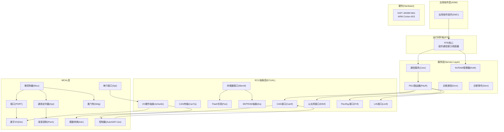
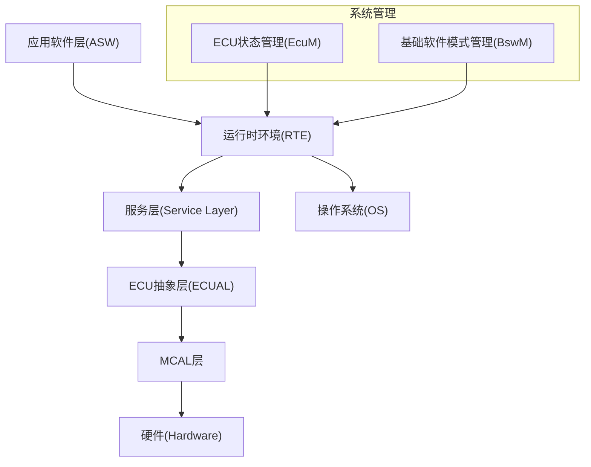
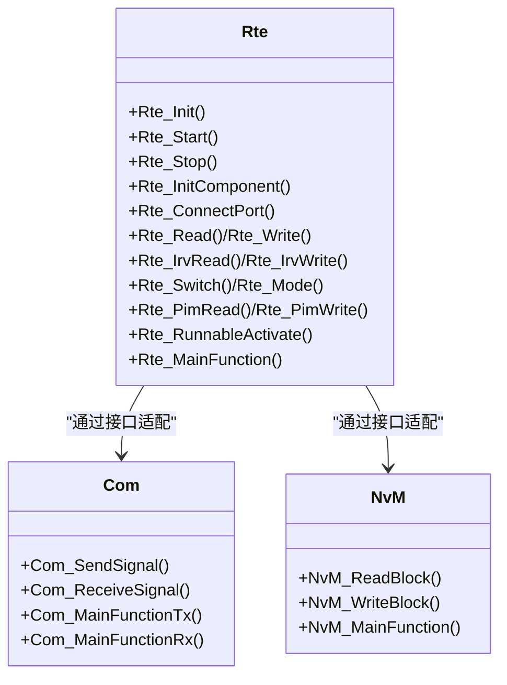
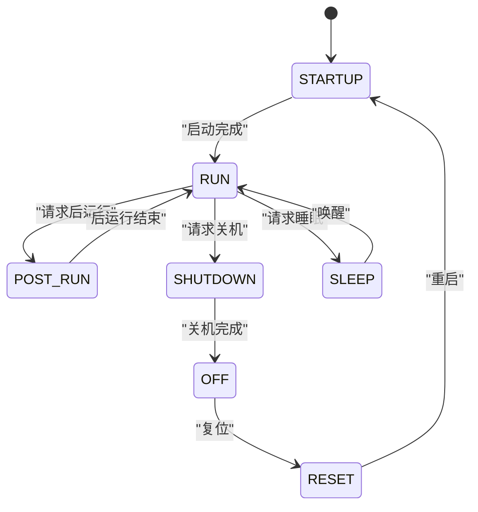
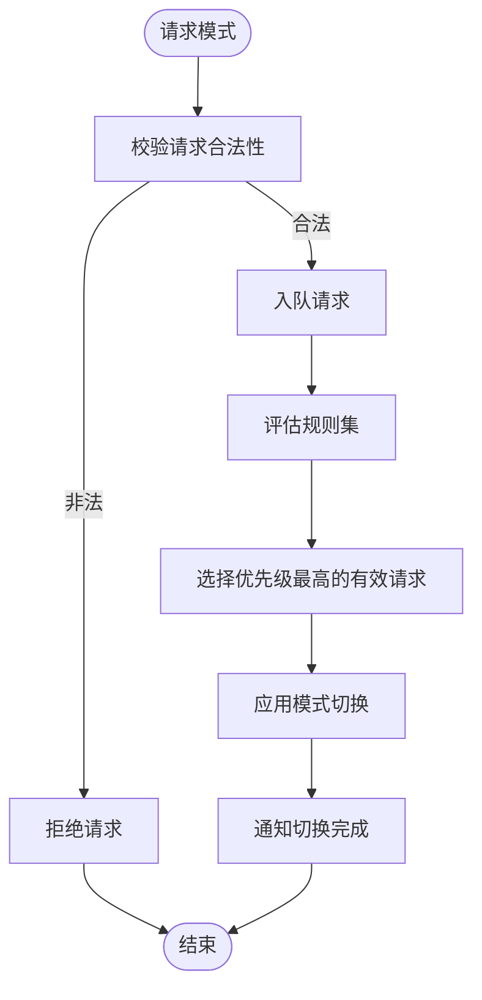
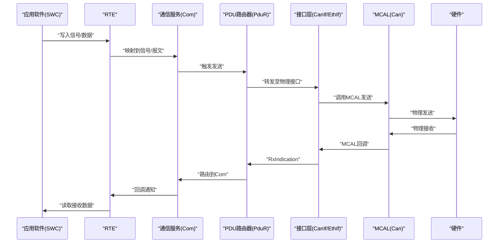
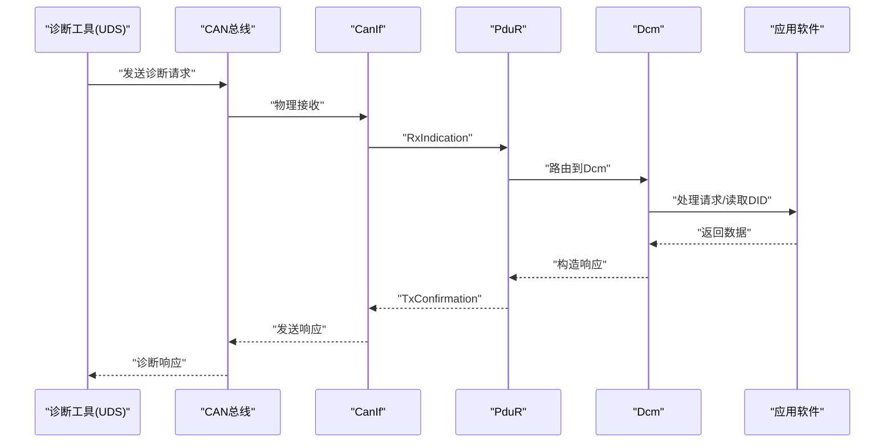
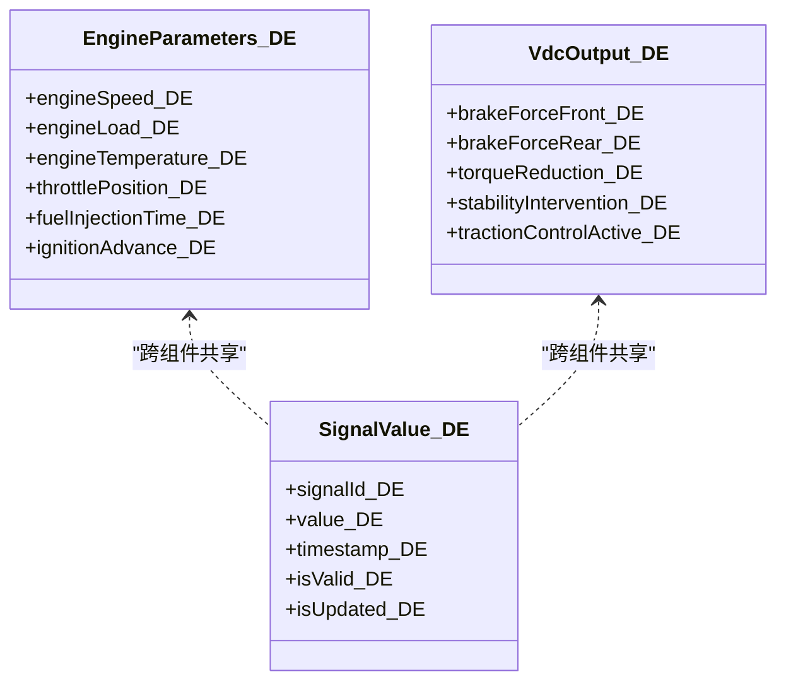
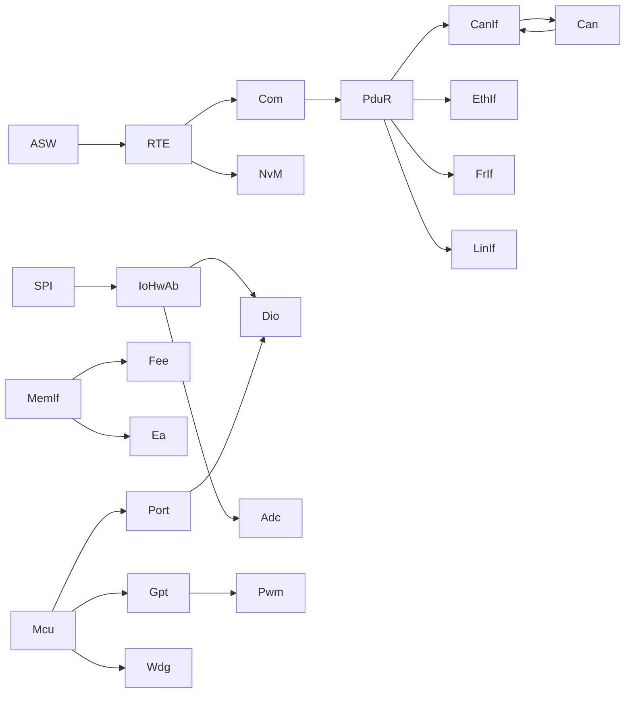

# 架构总览

<cite>
**本文引用的文件**
- [README.md](file://README.md)
- [架构文档](file://docs/architecture.md)
- [OpenSpec: Yule BSW 基础软件规范](file://openspec/specs/bsw/spec.md)
- [Rte.h](file://src/bsw/rte/include/Rte.h)
- [Rte.c](file://src/bsw/rte/src/Rte.c)
- [EcuM.h](file://src/bsw/services/ecum/include/EcuM.h)
- [BswM.h](file://src/bsw/services/bswm/include/BswM.h)
- [asw_interfaces.h](file://src/asw/asw_interfaces.h)
- [Os.h](file://src/bsw/os/include/Os.h)
- [Det.h](file://src/bsw/services/det/include/Det.h)
- [Com.h](file://src/bsw/services/com/include/Com.h)
- [PduR.h](file://src/bsw/services/pdur/include/PduR.h)
- [NvM.h](file://src/bsw/services/nvm/include/NvM.h)
- [main.c](file://examples/can_demo/main.c)
- [platform_config.h](file://platform/cortex-m/platform_config.h)
</cite>

## 目录
1. [引言](#引言)
2. [项目结构](#项目结构)
3. [核心组件](#核心组件)
4. [架构总览](#架构总览)
5. [详细组件分析](#详细组件分析)
6. [依赖分析](#依赖分析)
7. [性能考虑](#性能考虑)
8. [故障排查指南](#故障排查指南)
9. [结论](#结论)
10. [附录](#附录)

## 引言
本文件面向YuleTech AutoSAR BSW平台，系统性阐述基于AutoSAR Classic Platform 4.x的分层架构设计与实现。文档聚焦从硬件抽象层(MCAL)到应用软件层(ASW)的完整数据流与控制流，深入解析运行时环境(RTE)在组件间通信中的核心作用，以及基础软件管理模式(BSWM)与ECU管理模式(ECUM)在系统生命周期与状态管理中的职责。同时，结合OpenSpec规范与实际代码实现，给出架构决策的技术考量、性能影响与扩展性设计建议，并提供系统边界图与组件交互图，帮助开发者快速理解整体布局与接口契约。

## 项目结构
YuleTech BSW平台采用AutoSAR Classic分层架构，自底向上分为：
- 硬件层(Hardware)：NXP i.MX8M Mini等目标硬件
- MCAL层：微控制器驱动与外设驱动(如Mcu、Port、Dio、Can、Spi、Gpt、Pwm、Adc、Wdg)
- ECUAL层：ECU抽象层(如CanIf、CanTp、EthIf、FrIf、LinIf、IoHwAb、MemIf、Fee、Ea)
- 服务层(Service Layer)：通信服务(Com)、PDU路由器(PduR)、非易失存储管理(NvM)、诊断通信(Dcm)/诊断事件(Dem)
- 集成层(Integration Layer)：ECU状态管理(EcuM)、基础软件模式管理(BswM)
- OS层：基于FreeRTOS的任务调度与资源管理
- 应用软件层(ASW)：由客户实现的软件组件(SWC)，通过RTE与BSW交互

图表来源
- [架构文档](file://docs/architecture.md)
- [README.md](file://README.md)

章节来源
- [README.md: 48-84:48-84](file://README.md#L48-L84)
- [架构文档: 27-87:27-87](file://docs/architecture.md#L27-L87)

## 核心组件
本节概述各层关键模块及其职责，重点说明接口契约与依赖关系。

- MCAL层
  - Mcu：时钟、复位、低功耗模式管理
  - Port/Dio：引脚配置与读写
  - Can/Spi/Gpt/Pwm/Adc/Wdg：外设驱动
- ECUAL层
  - CanIf/CanTp/EthIf/FrIf/LinIf：网络接口与传输协议
  - IoHwAb/MemIf/Fee/Ea：硬件抽象与存储抽象
- 服务层
  - Com：信号路由与发送/接收管理
  - PduR：PDU路由与上下层桥接
  - NvM：非易失存储块管理与冗余策略
  - Dcm/Dem：诊断通信与事件管理
- 集成层
  - EcuM：ECU启动/运行/休眠/关机状态管理
  - BswM：基础软件模式请求与规则引擎
- OS层
  - Os：任务、中断、资源、事件、报警管理
- 应用软件层(ASW)
  - SWC：由客户实现的功能组件，通过RTE接口与BSW交互

章节来源
- [架构文档: 90-263:90-263](file://docs/architecture.md#L90-L263)
- [OpenSpec: 51-271:51-271](file://openspec/specs/bsw/spec.md#L51-L271)

## 架构总览
AutoSAR Classic 4.x分层架构的核心原则是“上层调用下层、同层通过服务层路由”。RTE作为组件间通信的桥梁，屏蔽了底层差异；EcuM与BswM负责系统级状态与模式管理；OS提供确定性调度与资源控制；MCAL/ECUAL/Service层共同构成BSW能力面。

图表来源
- [架构文档: 25-87:25-87](file://docs/architecture.md#L25-L87)
- [EcuM.h: 13-220:13-220](file://src/bsw/services/ecum/include/EcuM.h#L13-L220)
- [BswM.h: 1-185:1-185](file://src/bsw/services/bswm/include/BswM.h#L1-L185)

## 详细组件分析

### 组件A：RTE(运行时环境)
RTE在组件间通信中承担核心角色，提供：
- 组件生命周期管理：初始化、启动、停止
- 端口连接与数据读写
- 模式管理与切换
- 互运行变量(IRV)与每实例内存(PIM)访问
- 事件驱动与周期性可运行体调度
- 与COM/NvM等接口的适配

图表来源
- [Rte.h: 76-348:76-348](file://src/bsw/rte/include/Rte.h#L76-L348)
- [Rte.c: 46-200:46-200](file://src/bsw/rte/src/Rte.c#L46-L200)
- [Com.h: 243-501:243-501](file://src/bsw/services/com/include/Com.h#L243-L501)
- [NvM.h: 191-354:191-354](file://src/bsw/services/nvm/include/NvM.h#L191-L354)

章节来源
- [Rte.h: 76-348:76-348](file://src/bsw/rte/include/Rte.h#L76-L348)
- [Rte.c: 46-200:46-200](file://src/bsw/rte/src/Rte.c#L46-L200)

### 组件B：EcuM(ECU状态管理)
EcuM负责ECU全生命周期的状态机管理，典型阶段包括启动、运行、后运行、关机、睡眠、复位等，并提供唤醒事件管理与主函数周期处理。

图表来源
- [EcuM.h: 73-206:73-206](file://src/bsw/services/ecum/include/EcuM.h#L73-L206)

章节来源
- [EcuM.h: 13-220:13-220](file://src/bsw/services/ecum/include/EcuM.h#L13-L220)

### 组件C：BswM(基础软件模式管理)
BswM通过规则引擎协调不同用户(如通信、诊断、存储、应用等)对基础软件模式的请求，实现模式的统一调度与状态维护。

图表来源
- [BswM.h: 141-179:141-179](file://src/bsw/services/bswm/include/BswM.h#L141-L179)

章节来源
- [BswM.h: 1-185:1-185](file://src/bsw/services/bswm/include/BswM.h#L1-L185)

### 组件D：通信路径与数据流
从ASW到硬件的典型数据流包括发送与接收两条主线，均通过RTE与服务层完成路由与适配。

图表来源
- [架构文档: 269-323:269-323](file://docs/architecture.md#L269-L323)
- [Com.h: 441-463:441-463](file://src/bsw/services/com/include/Com.h#L441-L463)
- [PduR.h: 261-276:261-276](file://src/bsw/services/pdur/include/PduR.h#L261-L276)

章节来源
- [架构文档: 265-358:265-358](file://docs/architecture.md#L265-L358)

### 组件E：诊断数据流
诊断工具通过UDS协议经Dcm处理，再经PduR路由到CanIf/CAN，实现诊断请求与响应的闭环。

图表来源
- [架构文档: 325-358:325-358](file://docs/architecture.md#L325-L358)

章节来源
- [架构文档: 208-231:208-231](file://docs/architecture.md#L208-L231)

### 组件F：ASW接口契约
ASW侧通过统一的数据元素与结构体定义，确保与RTE/COM/NvM等接口的一致性，便于跨组件数据交换与类型安全。

图表来源
- [asw_interfaces.h: 38-167:38-167](file://src/asw/asw_interfaces.h#L38-L167)

章节来源
- [asw_interfaces.h: 1-314:1-314](file://src/asw/asw_interfaces.h#L1-L314)

## 依赖分析
- 依赖方向
  - 上层可调用下层
  - 下层不可调用上层
  - 同层通信需经服务层路由
- 关键耦合点
  - RTE与COM/NvM的接口适配
  - PduR作为服务层枢纽，连接上层与下层
  - EcuM/BswM与RTE协作进行系统状态与模式管理
  - OS为RTE/服务层提供调度与同步原语

图表来源
- [架构文档: 69-87:69-87](file://docs/architecture.md#L69-L87)
- [OpenSpec: 137-187:137-187](file://openspec/specs/bsw/spec.md#L137-L187)

章节来源
- [架构文档: 69-87:69-87](file://docs/architecture.md#L69-L87)
- [OpenSpec: 137-187:137-187](file://openspec/specs/bsw/spec.md#L137-L187)

## 性能考虑
- 中断与调度延迟
  - 中断响应延迟：< 10μs
  - 任务调度延迟：< 50μs
  - CAN报文处理：< 100μs
- 内存与缓存
  - 通过MemMap进行内存分区，代码/数据分离
  - Cortex-M系列具备不同缓存线大小，需结合平台配置优化
- 通信效率
  - COM/PduR采用零拷贝与静态缓冲区设计
  - PduR路由表与路径组减少查找开销
- 诊断与存储
  - NvM支持多种冗余与CRC策略，平衡可靠性与性能
- OS集成
  - 基于FreeRTOS的任务/事件/资源模型，提供确定性与时序保障

章节来源
- [OpenSpec: 240-246:240-246](file://openspec/specs/bsw/spec.md#L240-L246)
- [platform_config.h: 48-68:48-68](file://platform/cortex-m/platform_config.h#L48-L68)

## 故障排查指南
- 错误检测与报告
  - DET提供统一的开发期错误上报与版本查询接口
  - 各模块通过DET宏在RTE中启用错误检测
- 常见问题定位
  - 初始化顺序：先MCAL/ECUAL，再服务层，最后RTE与ASW
  - 端口连接：确认Rte_ConnectPort与组件端口映射正确
  - 模式切换：检查BswM规则与EcuM状态机一致性
  - 通信链路：验证PduR路由路径与CanIf控制器模式
- 日志与调试
  - 启用DEBUG与SysTick辅助时序分析
  - 使用示例工程(main.c)验证CanIf回调与主函数循环

章节来源
- [Det.h: 59-70:59-70](file://src/bsw/services/det/include/Det.h#L59-L70)
- [Rte.c: 36-41:36-41](file://src/bsw/rte/src/Rte.c#L36-L41)
- [main.c: 37-58:37-58](file://examples/can_demo/main.c#L37-L58)

## 结论
YuleTech AutoSAR BSW平台严格遵循Classic 4.x分层架构，通过RTE实现组件间解耦，通过EcuM/BswM实现系统级状态与模式管理，通过OS提供确定性调度，通过MCAL/ECUAL/Service层构建完整的BSW能力面。该架构在保证可移植性与可扩展性的前提下，兼顾性能与时序约束，适合在NXP i.MX8M Mini等平台上开展车载应用开发。

## 附录
- 示例工程：can_demo展示了Can/CanIf/Com的典型使用方式与回调处理
- 平台配置：platform_config.h提供了Cortex-M系列的特性与寄存器抽象

章节来源
- [main.c: 63-118:63-118](file://examples/can_demo/main.c#L63-L118)
- [platform_config.h: 12-307:12-307](file://platform/cortex-m/platform_config.h#L12-L307)