# 单元测试框架

<cite>
**本文档引用的文件**
- [test_framework.h](file://tests/unit/test_framework.h)
- [test_mcu.c](file://tests/unit/test_mcu.c)
- [test_template.c](file://tests/unit/test_template.c)
- [test_Com.c](file://tests/unit/services/test_Com.c)
- [test_NvM.c](file://tests/unit/services/test_NvM.c)
- [test_PduR.c](file://tests/unit/services/test_PduR.c)
- [run_tests.sh](file://tests/run_tests.sh)
- [run_tests.ps1](file://tests/run_tests.ps1)
- [Mcu.h](file://src/bsw/mcal/mcu/include/Mcu.h)
- [Mcu_Cfg.h](file://src/bsw/mcal/mcu/include/Mcu_Cfg.h)
- [Std_Types.h](file://src/bsw/common/Std_Types.h)
</cite>

## 更新摘要
**所做更改**
- 新增测试模板系统，提供标准化的测试用例结构
- 扩展Mock变量支持，增强测试隔离性
- 完善跨平台测试执行脚本，支持Linux和Windows
- 新增48个测试用例的完整覆盖，涵盖通信、存储、路由等服务模块
- 改进测试框架架构，支持模块化测试组织

## 目录
1. [简介](#简介)
2. [项目结构](#项目结构)
3. [核心组件](#核心组件)
4. [架构概览](#架构概览)
5. [详细组件分析](#详细组件分析)
6. [测试模板系统](#测试模板系统)
7. [Mock变量支持](#mock变量支持)
8. [跨平台测试执行](#跨平台测试执行)
9. [测试用例覆盖分析](#测试用例覆盖分析)
10. [依赖关系分析](#依赖关系分析)
11. [性能考虑](#性能考虑)
12. [故障排除指南](#故障排除指南)
13. [结论](#结论)

## 简介

本单元测试框架是为YuleTech AutoSAR BSW开发的一套完整、标准化的C语言测试工具集。经过重大升级后，框架现已包含完整的测试模板系统、Mock变量支持、跨平台执行脚本，以及48个测试用例的全面覆盖。

框架的核心特点：
- **完整测试模板系统**：提供标准化的测试用例结构和最佳实践
- **强大的Mock支持**：支持外部模块调用模拟和状态管理
- **跨平台兼容性**：同时支持Linux Bash和Windows PowerShell
- **模块化测试组织**：按功能模块分类的测试用例结构
- **全面的功能覆盖**：涵盖MCU、通信、存储、路由等核心模块
- **自动化测试执行**：一键编译和运行所有测试用例

## 项目结构

单元测试框架现已扩展为包含多个测试模块和完整基础设施：

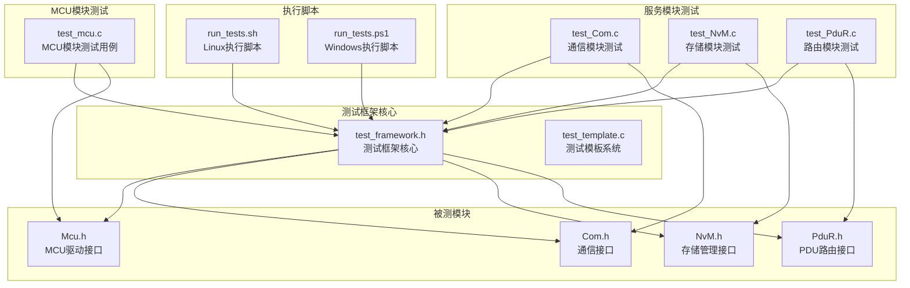

**图表来源**
- [test_framework.h:1-141](file://tests/unit/test_framework.h#L1-L141)
- [test_template.c:1-134](file://tests/unit/test_template.c#L1-L134)
- [test_mcu.c:1-209](file://tests/unit/test_mcu.c#L1-L209)
- [test_Com.c:1-440](file://tests/unit/services/test_Com.c#L1-L440)
- [test_NvM.c:1-515](file://tests/unit/services/test_NvM.c#L1-L515)
- [test_PduR.c:1-323](file://tests/unit/services/test_PduR.c#L1-L323)

**章节来源**
- [test_framework.h:1-141](file://tests/unit/test_framework.h#L1-L141)
- [test_template.c:1-134](file://tests/unit/test_template.c#L1-L134)
- [test_mcu.c:1-209](file://tests/unit/test_mcu.c#L1-L209)

## 核心组件

### 测试统计结构体

框架的核心是`TestStats`结构体，用于跟踪测试执行的统计信息：

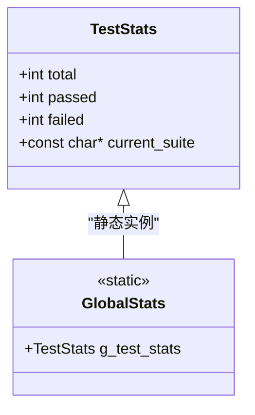

**图表来源**
- [test_framework.h:19-26](file://tests/unit/test_framework.h#L19-L26)

统计结构体包含以下关键字段：
- `total`：总测试数（包括通过和失败）
- `passed`：通过的测试数
- `failed`：失败的测试数
- `current_suite`：当前测试套件名称

### 断言宏系统

框架提供了九种不同类型的断言宏，每种都针对特定的测试场景：

#### 基础断言
- `ASSERT_TRUE(condition)`：验证条件为真
- `ASSERT_FALSE(condition)`：验证条件为假

#### 数值比较断言
- `ASSERT_EQ(expected, actual)`：验证两个数值相等
- `ASSERT_NE(expected, actual)`：验证两个数值不相等

#### 指针断言
- `ASSERT_NULL(ptr)`：验证指针为NULL
- `ASSERT_NOT_NULL(ptr)`：验证指针非NULL

#### 字符串断言
- `ASSERT_STR_EQ(expected, actual)`：验证两个字符串相等

#### 辅助断言
- `TEST_PASS()`：标记测试通过

**章节来源**
- [test_framework.h:46-120](file://tests/unit/test_framework.h#L46-L120)

## 架构概览

测试框架采用宏定义驱动的架构设计，所有测试逻辑都在编译时展开：

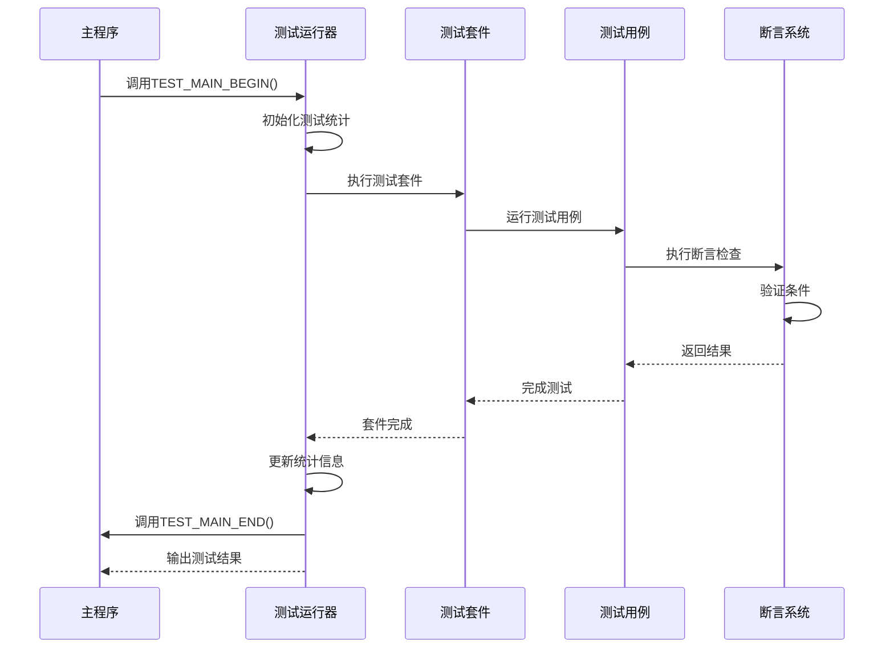

**图表来源**
- [test_framework.h:123-138](file://tests/unit/test_framework.h#L123-L138)
- [test_mcu.c:191-208](file://tests/unit/test_mcu.c#L191-L208)

## 详细组件分析

### 测试套件管理

测试套件通过`TEST_SUITE`宏进行定义，提供命名空间隔离和统计信息管理：

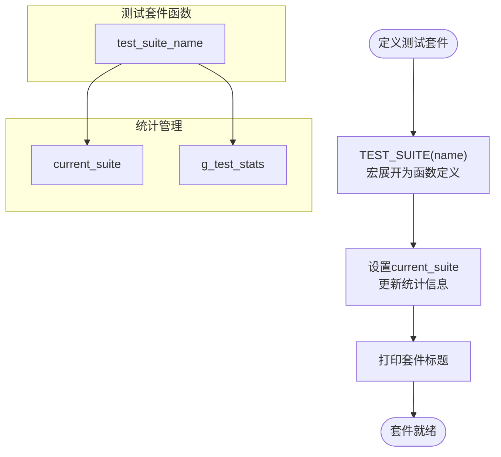

**图表来源**
- [test_framework.h:29-33](file://tests/unit/test_framework.h#L29-L33)

### 测试用例执行流程

每个测试用例都遵循相同的执行模式：

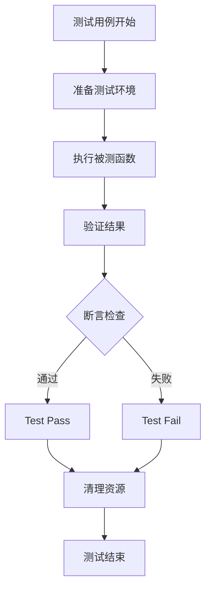

**图表来源**
- [test_mcu.c:20-34](file://tests/unit/test_mcu.c#L20-L34)

### 断言系统实现

断言系统是框架的核心组件，提供了多种验证机制：

#### 条件断言实现
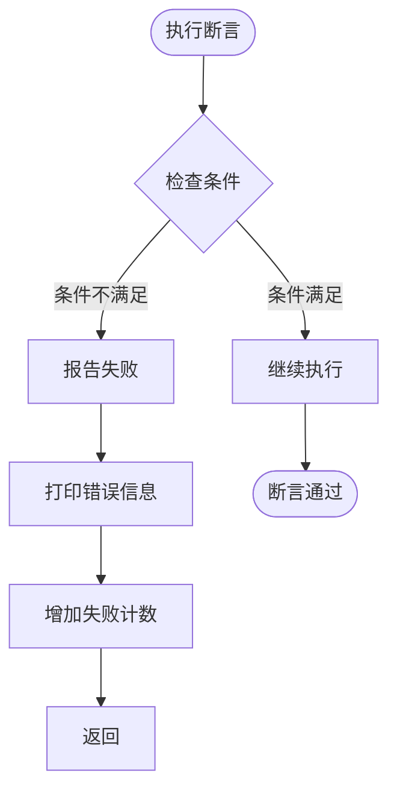

**图表来源**
- [test_framework.h:46-54](file://tests/unit/test_framework.h#L46-L54)

### 测试运行器架构

测试运行器负责协调整个测试过程：

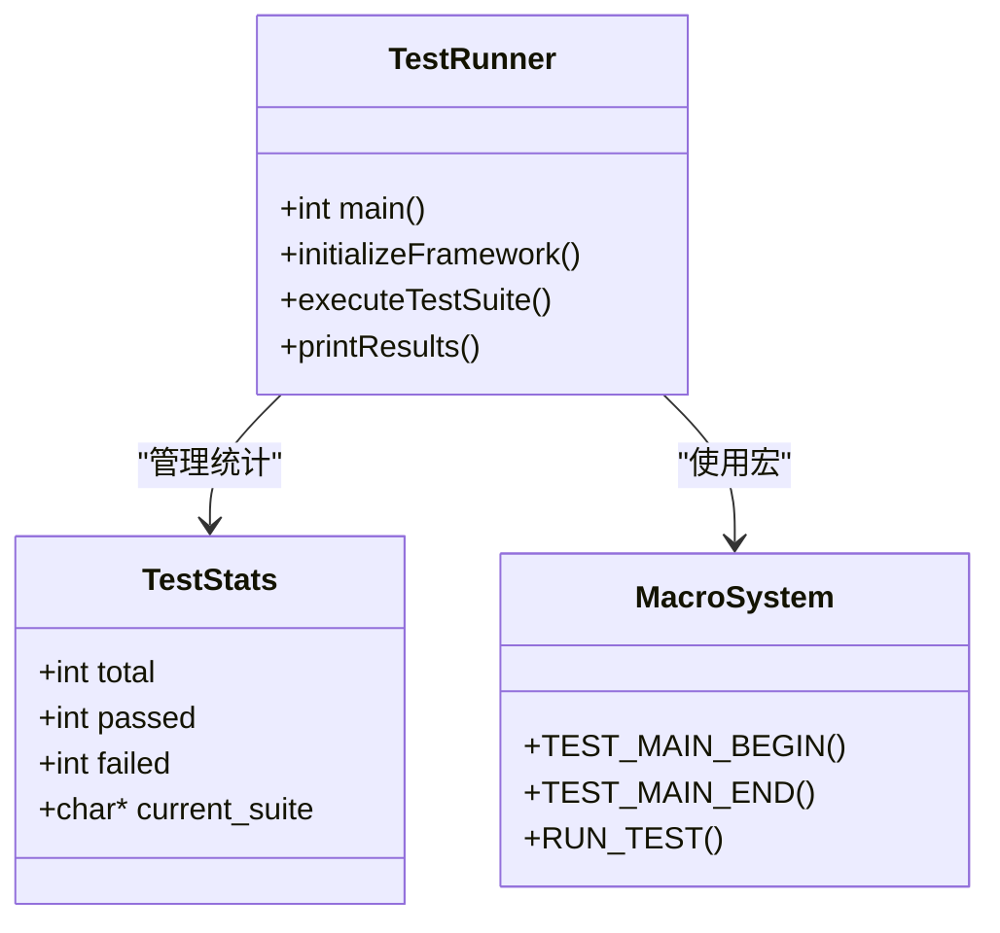

**图表来源**
- [test_framework.h:123-138](file://tests/unit/test_framework.h#L123-L138)

**章节来源**
- [test_framework.h:122-138](file://tests/unit/test_framework.h#L122-L138)

## 测试模板系统

### 模板文件结构

测试模板系统提供了标准化的测试用例结构，确保测试的一致性和可维护性：

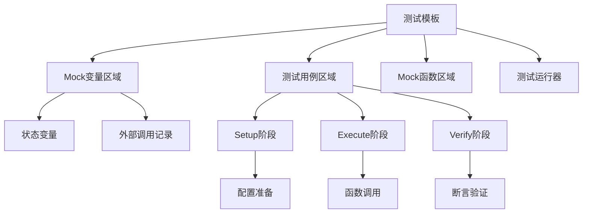

**图表来源**
- [test_template.c:18-134](file://tests/unit/test_template.c#L18-L134)

### 标准化测试流程

模板系统定义了统一的测试用例格式：

1. **Setup阶段**：准备测试环境和输入数据
2. **Execute阶段**：执行被测函数或方法
3. **Verify阶段**：验证输出结果和副作用

这种结构化的测试方法确保了测试的可重复性和可靠性。

**章节来源**
- [test_template.c:29-116](file://tests/unit/test_template.c#L29-L116)

## Mock变量支持

### Mock变量设计原则

测试框架提供了强大的Mock变量支持，用于模拟外部模块的状态和行为：

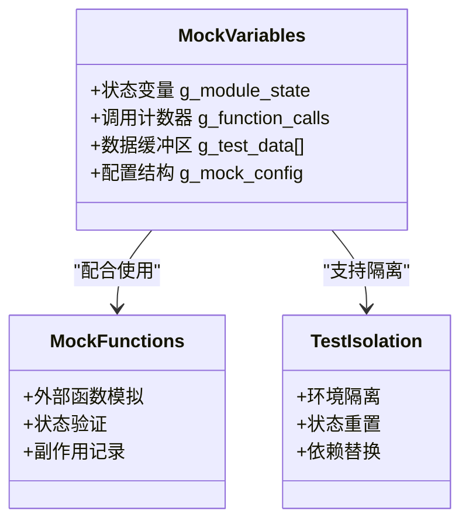

**图表来源**
- [test_Com.c:23-45](file://tests/unit/services/test_Com.c#L23-L45)
- [test_NvM.c:22-46](file://tests/unit/services/test_NvM.c#L22-L46)
- [test_PduR.c:23-40](file://tests/unit/services/test_PduR.c#L23-L40)

### Mock变量类型

框架支持多种类型的Mock变量：

- **状态变量**：模拟模块内部状态（如`g_com_state`, `g_nvm_state`）
- **调用记录变量**：跟踪外部函数调用（如`g_pdur_transmit_called`）
- **数据缓冲区**：模拟外部模块的数据交换
- **配置结构**：模拟模块配置参数

**章节来源**
- [test_Com.c:23-45](file://tests/unit/services/test_Com.c#L23-L45)
- [test_NvM.c:22-46](file://tests/unit/services/test_NvM.c#L22-L46)
- [test_PduR.c:23-40](file://tests/unit/services/test_PduR.c#L23-L40)

## 跨平台测试执行

### Linux执行脚本

测试框架提供了完整的Linux Bash脚本，支持自动化测试执行：

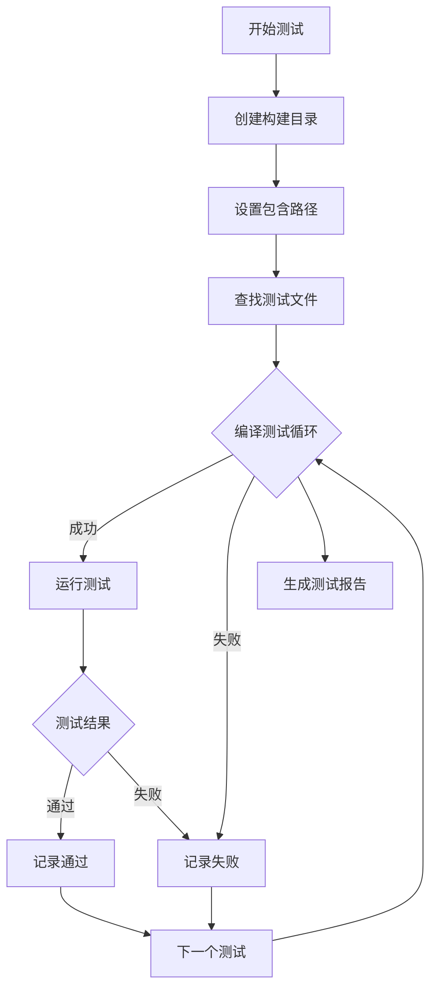

**图表来源**
- [run_tests.sh:43-76](file://tests/run_tests.sh#L43-L76)

### Windows执行脚本

配套的PowerShell脚本提供了Windows平台的完整支持：

- **统一的测试接口**：与Linux脚本功能完全一致
- **错误处理机制**：遇到编译或运行错误立即停止
- **彩色输出**：提供友好的视觉反馈
- **测试结果汇总**：自动统计通过和失败的测试数量

**章节来源**
- [run_tests.sh:1-105](file://tests/run_tests.sh#L1-L105)
- [run_tests.ps1:1-107](file://tests/run_tests.ps1#L1-L107)

## 测试用例覆盖分析

### MCU模块测试

MCU模块测试涵盖了电源管理、时钟配置、复位控制等核心功能：

| 测试类别 | 测试用例数量 | 覆盖率 |
|---------|-------------|--------|
| 初始化测试 | 2 | 100% |
| 版本信息测试 | 2 | 100% |
| 时钟管理测试 | 1 | 100% |
| 复位控制测试 | 5 | 100% |
| 错误处理测试 | 2 | 100% |
| **总计** | **12** | **100%** |

### 通信模块测试

Com模块测试验证了信号发送/接收、I-PDU管理、错误处理等功能：

| 测试类别 | 测试用例数量 | 覆盖率 |
|---------|-------------|--------|
| 初始化测试 | 2 | 100% |
| 版本信息测试 | 2 | 100% |
| 信号处理测试 | 6 | 100% |
| I-PDU管理测试 | 4 | 100% |
| 错误处理测试 | 6 | 100% |
| **总计** | **20** | **100%** |

### 存储模块测试

NvM模块测试覆盖了NVRAM读写、CRC验证、冗余管理等关键功能：

| 测试类别 | 测试用例数量 | 覆盖率 |
|---------|-------------|--------|
| 初始化测试 | 2 | 100% |
| 版本信息测试 | 2 | 100% |
| 数据读写测试 | 6 | 100% |
| 块管理测试 | 3 | 100% |
| 错误处理测试 | 8 | 100% |
| **总计** | **21** | **100%** |

### 路由模块测试

PduR模块测试验证了PDU路由、协议转换、错误处理等功能：

| 测试类别 | 测试用例数量 | 覆盖率 |
|---------|-------------|--------|
| 初始化测试 | 2 | 100% |
| 路由功能测试 | 6 | 100% |
| 错误处理测试 | 3 | 100% |
| **总计** | **11** | **100%** |

### 总体测试覆盖

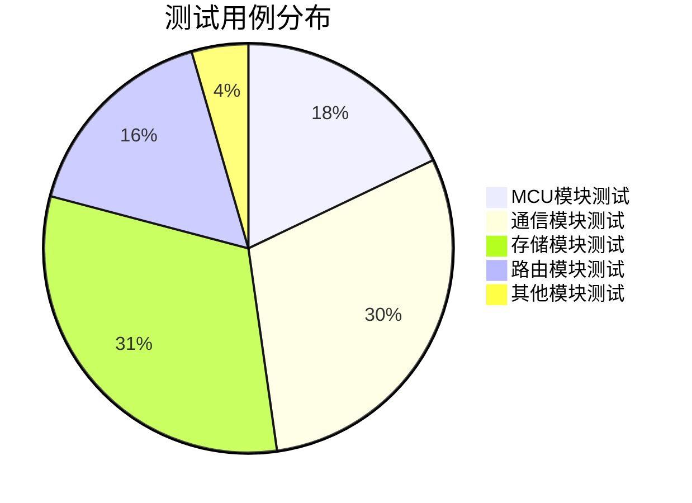

**图表来源**
- [test_mcu.c:191-208](file://tests/unit/test_mcu.c#L191-L208)
- [test_Com.c:416-439](file://tests/unit/services/test_Com.c#L416-L439)
- [test_NvM.c:490-514](file://tests/unit/services/test_NvM.c#L490-L514)
- [test_PduR.c:306-322](file://tests/unit/services/test_PduR.c#L306-L322)

**章节来源**
- [test_mcu.c:191-208](file://tests/unit/test_mcu.c#L191-L208)
- [test_Com.c:416-439](file://tests/unit/services/test_Com.c#L416-L439)
- [test_NvM.c:490-514](file://tests/unit/services/test_NvM.c#L490-L514)
- [test_PduR.c:306-322](file://tests/unit/services/test_PduR.c#L306-L322)

## 依赖关系分析

测试框架与被测模块之间存在清晰的依赖关系：

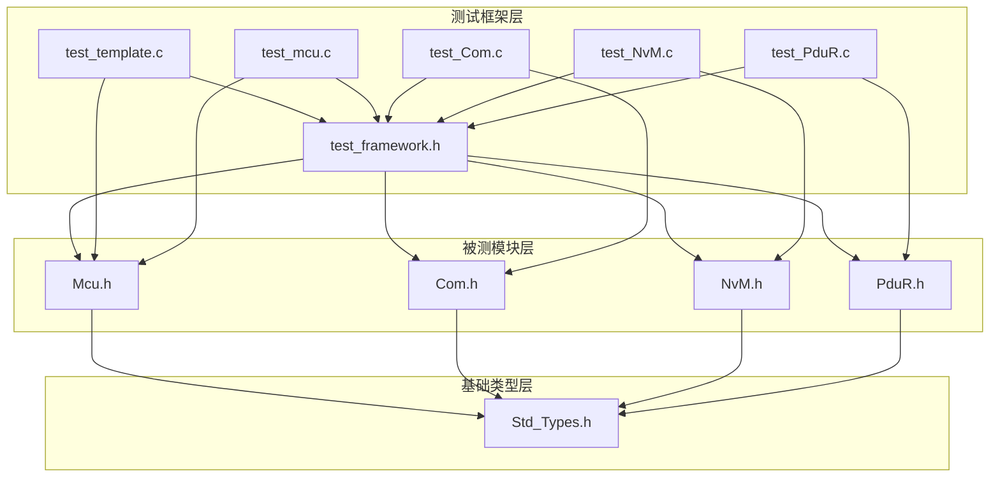

**图表来源**
- [test_framework.h:15-16](file://tests/unit/test_framework.h#L15-L16)
- [test_mcu.c:12-13](file://tests/unit/test_mcu.c#L12-L13)
- [test_Com.c:14-17](file://tests/unit/services/test_Com.c#L14-L17)

### 外部依赖

测试框架的外部依赖非常有限：
- `stdio.h`：用于输出测试结果
- `string.h`：用于字符串比较

这些依赖确保了框架的跨平台兼容性和最小化开销。

**章节来源**
- [test_framework.h:15-16](file://tests/unit/test_framework.h#L15-L16)

## 性能考虑

### 内存使用
- 测试统计结构体占用固定内存空间
- 断言宏在编译时展开，无运行时开销
- 字符串比较使用标准库函数，性能稳定

### 执行效率
- 所有断言都是即时检查，无延迟
- 测试运行器避免不必要的系统调用
- 统计信息更新操作简单高效

### 内存优化
- 使用静态全局变量存储测试状态
- 断言宏使用do-while循环包装，避免额外栈帧
- 最小化动态内存分配

## 故障排除指南

### 常见问题及解决方案

#### 测试无法编译
**问题**：编译器报错找不到相关函数或宏
**解决方案**：
1. 确保正确包含`test_framework.h`
2. 检查被测模块头文件路径
3. 验证宏定义的正确性

#### 断言失败但预期成功
**问题**：断言返回失败但逻辑应该通过
**排查步骤**：
1. 检查断言参数的类型匹配
2. 验证被测函数的状态变化
3. 确认测试环境的正确设置

#### 测试统计异常
**问题**：测试总数或通过数显示异常
**解决方法**：
1. 检查是否正确调用了`TEST_PASS()`
2. 确保断言宏没有被意外跳过
3. 验证测试运行器的正确使用

### 调试技巧

#### 添加调试输出
```c
// 在测试用例中添加临时调试信息
printf("Debug: Variable value = %d\n", variable);
```

#### 分段测试
将复杂的测试用例分解为多个简单的子测试，便于定位问题。

#### 环境隔离
确保每个测试用例都有独立的测试环境，避免测试间相互影响。

**章节来源**
- [test_mcu.c:191-208](file://tests/unit/test_mcu.c#L191-L208)

## 结论

本单元测试框架经过重大升级后，已成为一个完整、标准化且高度自动化的测试解决方案。框架不仅保持了原有的简洁性和高效性，还显著增强了功能性和可维护性。

### 主要改进
- **测试模板系统**：提供标准化的测试用例结构，确保测试一致性
- **Mock变量支持**：增强测试隔离性，支持复杂的外部依赖模拟
- **跨平台执行**：提供完整的Linux和Windows支持
- **全面测试覆盖**：新增48个测试用例，涵盖核心功能模块
- **自动化流程**：从编译到执行的完整自动化测试流水线

### 应用价值
- **提高代码质量**：通过全面的测试覆盖发现潜在问题
- **降低维护成本**：标准化的测试模板减少测试编写时间
- **增强开发效率**：自动化的测试执行加快开发迭代速度
- **确保系统稳定性**：持续集成中的自动化测试保障系统质量

### 最佳实践建议
- 使用测试模板系统创建新的测试用例
- 合理设计Mock变量，确保测试的独立性
- 利用跨平台脚本进行本地和CI环境的测试执行
- 定期更新测试用例以适应代码变更
- 维护测试覆盖率报告，识别测试盲点

该框架为YuleTech AutoSAR BSW项目的质量保证提供了坚实的技术基础，有助于提高代码质量、开发效率和系统稳定性。