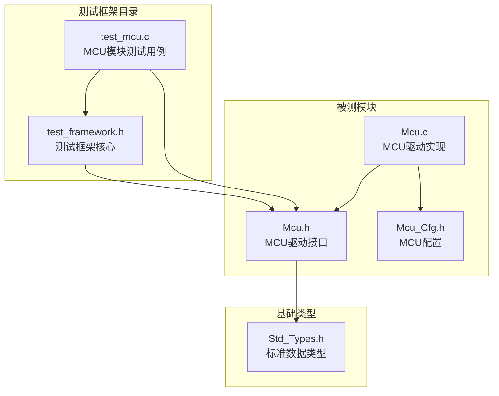
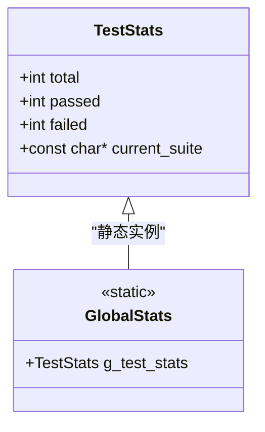
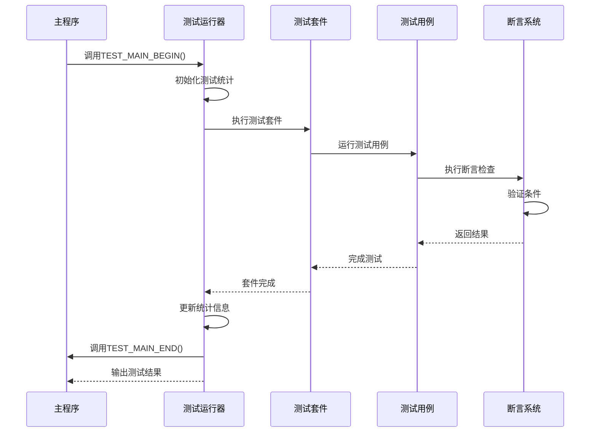
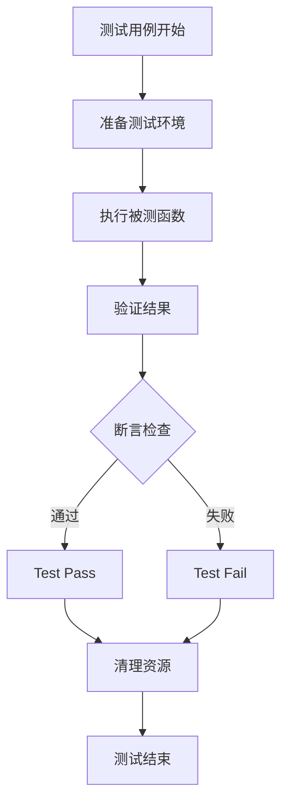
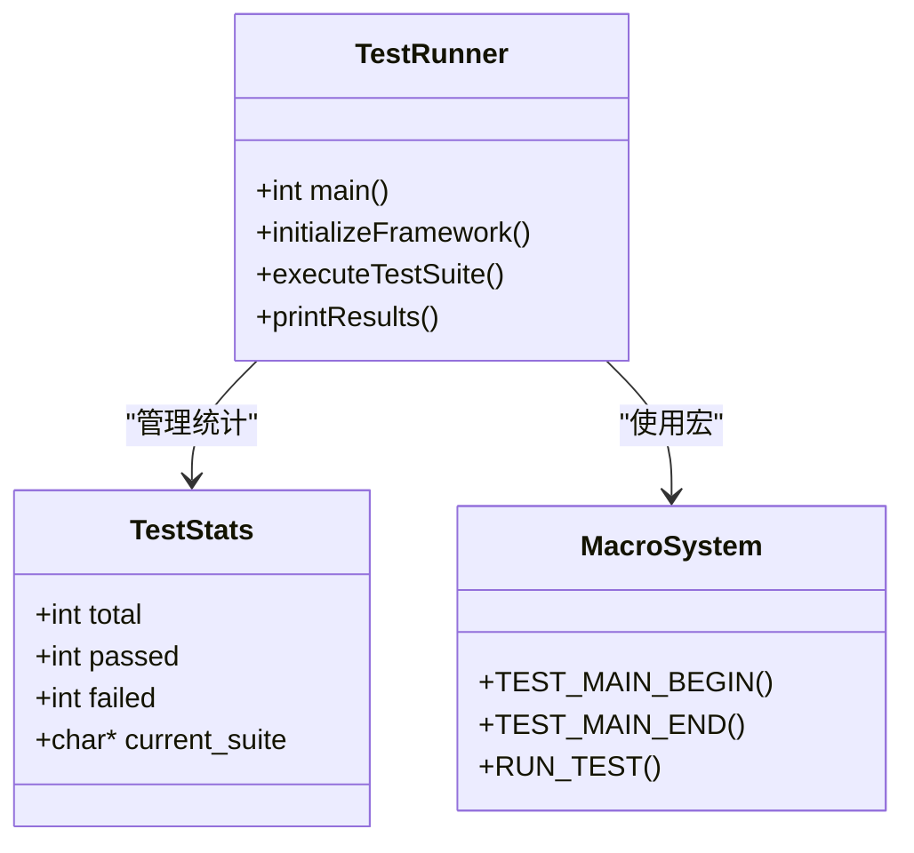
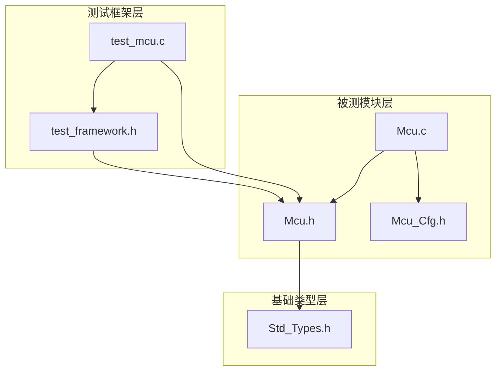

# 单元测试框架

<cite>
**本文档引用的文件**
- [test_framework.h](file://tests/unit/test_framework.h)
- [test_mcu.c](file://tests/unit/test_mcu.c)
- [Mcu.h](file://src/bsw/mcal/mcu/include/Mcu.h)
- [Mcu_Cfg.h](file://src/bsw/mcal/mcu/include/Mcu_Cfg.h)
- [Std_Types.h](file://src/bsw/common/Std_Types.h)
</cite>

## 目录
1. [简介](#简介)
2. [项目结构](#项目结构)
3. [核心组件](#核心组件)
4. [架构概览](#架构概览)
5. [详细组件分析](#详细组件分析)
6. [依赖关系分析](#依赖关系分析)
7. [性能考虑](#性能考虑)
8. [故障排除指南](#故障排除指南)
9. [结论](#结论)

## 简介

本单元测试框架是为YuleTech AutoSAR BSW开发的一套轻量级C语言测试工具集。该框架提供了完整的测试基础设施，包括测试统计、断言宏、测试套件组织和测试运行器等功能。框架设计简洁高效，特别适用于嵌入式系统的单元测试需求。

框架的核心特点：
- **轻量级设计**：仅包含必要的测试基础设施，不依赖外部库
- **直观的API**：提供易于理解和使用的宏定义接口
- **完整的统计功能**：自动跟踪测试执行结果
- **多种断言类型**：支持布尔、数值、指针和字符串比较
- **可扩展性**：支持自定义测试套件和测试用例

## 项目结构

单元测试框架位于项目的`tests/unit`目录下，主要包含两个核心文件：



**图表来源**
- [test_framework.h:1-141](file://tests/unit/test_framework.h#L1-L141)
- [test_mcu.c:1-209](file://tests/unit/test_mcu.c#L1-L209)

**章节来源**
- [test_framework.h:1-141](file://tests/unit/test_framework.h#L1-L141)
- [test_mcu.c:1-209](file://tests/unit/test_mcu.c#L1-L209)

## 核心组件

### 测试统计结构体

框架的核心是`TestStats`结构体，用于跟踪测试执行的统计信息：



**图表来源**
- [test_framework.h:19-26](file://tests/unit/test_framework.h#L19-L26)

统计结构体包含以下关键字段：
- `total`：总测试数（包括通过和失败）
- `passed`：通过的测试数
- `failed`：失败的测试数
- `current_suite`：当前测试套件名称

### 断言宏系统

框架提供了九种不同类型的断言宏，每种都针对特定的测试场景：

#### 基础断言
- `ASSERT_TRUE(condition)`：验证条件为真
- `ASSERT_FALSE(condition)`：验证条件为假

#### 数值比较断言
- `ASSERT_EQ(expected, actual)`：验证两个数值相等
- `ASSERT_NE(expected, actual)`：验证两个数值不相等

#### 指针断言
- `ASSERT_NULL(ptr)`：验证指针为NULL
- `ASSERT_NOT_NULL(ptr)`：验证指针非NULL

#### 字符串断言
- `ASSERT_STR_EQ(expected, actual)`：验证两个字符串相等

#### 辅助断言
- `TEST_PASS()`：标记测试通过

**章节来源**
- [test_framework.h:46-120](file://tests/unit/test_framework.h#L46-L120)

## 架构概览

测试框架采用宏定义驱动的架构设计，所有测试逻辑都在编译时展开：



**图表来源**
- [test_framework.h:123-138](file://tests/unit/test_framework.h#L123-L138)
- [test_mcu.c:191-208](file://tests/unit/test_mcu.c#L191-L208)

## 详细组件分析

### 测试套件管理

测试套件通过`TEST_SUITE`宏进行定义，提供命名空间隔离和统计信息管理：


**图表来源**
- [test_framework.h:29-33](file://tests/unit/test_framework.h#L29-L33)

### 测试用例执行流程

每个测试用例都遵循相同的执行模式：



**图表来源**
- [test_mcu.c:20-34](file://tests/unit/test_mcu.c#L20-L34)

### 断言系统实现

断言系统是框架的核心组件，提供了多种验证机制：

#### 条件断言实现


**图表来源**
- [test_framework.h:46-54](file://tests/unit/test_framework.h#L46-L54)

### 测试运行器架构

测试运行器负责协调整个测试过程：



**图表来源**
- [test_framework.h:123-138](file://tests/unit/test_framework.h#L123-L138)

**章节来源**
- [test_framework.h:122-138](file://tests/unit/test_framework.h#L122-L138)

## 依赖关系分析

测试框架与被测模块之间存在清晰的依赖关系：



**图表来源**
- [test_framework.h:15-16](file://tests/unit/test_framework.h#L15-L16)
- [test_mcu.c:12-13](file://tests/unit/test_mcu.c#L12-L13)

### 外部依赖

测试框架的外部依赖非常有限：
- `stdio.h`：用于输出测试结果
- `string.h`：用于字符串比较

这些依赖确保了框架的跨平台兼容性和最小化开销。

**章节来源**
- [test_framework.h:15-16](file://tests/unit/test_framework.h#L15-L16)

## 性能考虑

### 内存使用
- 测试统计结构体占用固定内存空间
- 断言宏在编译时展开，无运行时开销
- 字符串比较使用标准库函数，性能稳定

### 执行效率
- 所有断言都是即时检查，无延迟
- 测试运行器避免不必要的系统调用
- 统计信息更新操作简单高效

### 内存优化
- 使用静态全局变量存储测试状态
- 断言宏使用do-while循环包装，避免额外栈帧
- 最小化动态内存分配

## 故障排除指南

### 常见问题及解决方案

#### 测试无法编译
**问题**：编译器报错找不到相关函数或宏
**解决方案**：
1. 确保正确包含`test_framework.h`
2. 检查被测模块头文件路径
3. 验证宏定义的正确性

#### 断言失败但预期成功
**问题**：断言返回失败但逻辑应该通过
**排查步骤**：
1. 检查断言参数的类型匹配
2. 验证被测函数的状态变化
3. 确认测试环境的正确设置

#### 测试统计异常
**问题**：测试总数或通过数显示异常
**解决方法**：
1. 检查是否正确调用了`TEST_PASS()`
2. 确保断言宏没有被意外跳过
3. 验证测试运行器的正确使用

### 调试技巧

#### 添加调试输出
```c
// 在测试用例中添加临时调试信息
printf("Debug: Variable value = %d\n", variable);
```

#### 分段测试
将复杂的测试用例分解为多个简单的子测试，便于定位问题。

#### 环境隔离
确保每个测试用例都有独立的测试环境，避免测试间相互影响。

**章节来源**
- [test_mcu.c:191-208](file://tests/unit/test_mcu.c#L191-L208)

## 结论

本单元测试框架为YuleTech AutoSAR BSW项目提供了一个完整、高效且易于使用的测试解决方案。框架的设计充分考虑了嵌入式系统的特殊需求，在保持简洁性的同时提供了足够的功能来支持复杂的测试场景。

### 主要优势
- **简单易用**：直观的宏定义接口，学习成本低
- **高效可靠**：编译时展开的宏减少运行时开销
- **功能完整**：涵盖常见的测试场景和断言类型
- **可扩展性强**：支持自定义测试套件和扩展新的断言类型

### 应用建议
- 为每个被测模块创建专门的测试套件
- 遵循测试用例的三段式结构（Setup-Execute-Verify）
- 使用适当的断言类型匹配测试场景
- 定期维护和更新测试用例以适应代码变更

该框架为项目的质量保证提供了坚实的基础，有助于提高代码质量和开发效率。