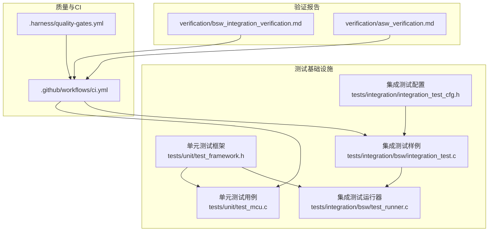
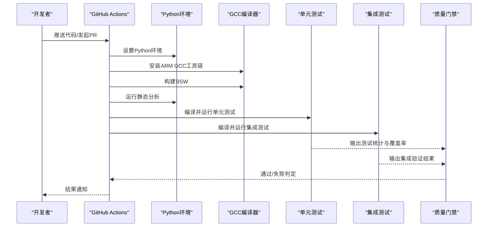
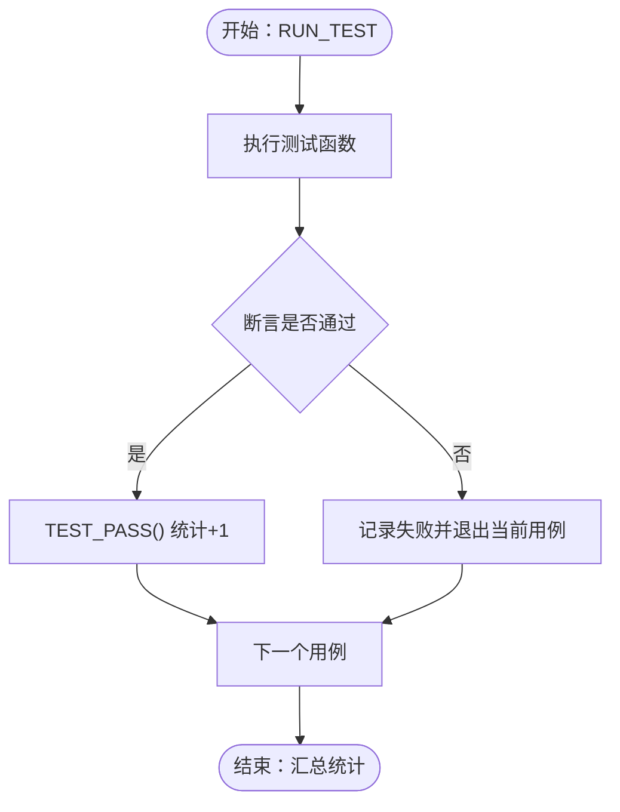
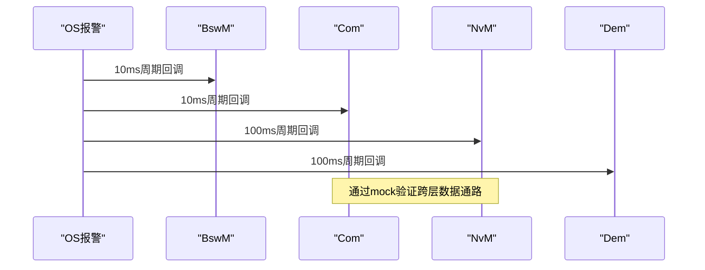
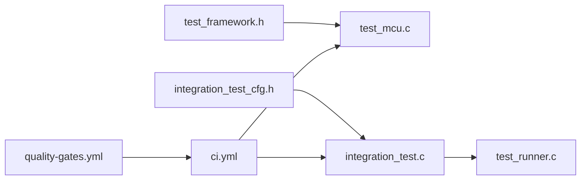

# 测试最佳实践

<cite>
**本文引用的文件**
- [ci.yml](file://.github/workflows/ci.yml)
- [test_framework.h](file://tests/unit/test_framework.h)
- [test_mcu.c](file://tests/unit/test_mcu.c)
- [integration_test.c](file://tests/integration/bsw/integration_test.c)
- [integration_test_cfg.h](file://tests/integration/integration_test_cfg.h)
- [test_runner.c](file://tests/integration/bsw/test_runner.c)
- [bsw_integration_verification.md](file://verification/bsw_integration_verification.md)
- [asw_verification.md](file://verification/asw_verification.md)
- [quality-gates.yml](file://.harness/quality-gates.yml)
- [README.md](file://README.md)
</cite>

## 目录
1. [引言](#引言)
2. [项目结构](#项目结构)
3. [核心组件](#核心组件)
4. [架构总览](#架构总览)
5. [详细组件分析](#详细组件分析)
6. [依赖分析](#依赖分析)
7. [性能考量](#性能考量)
8. [故障排查指南](#故障排查指南)
9. [结论](#结论)
10. [附录](#附录)

## 引言
本文件面向YuleTech BSW平台的测试开发，系统化总结测试用例设计原则、测试数据管理、测试环境配置与测试结果分析方法，帮助团队编写可维护、可重复执行的测试代码，并建立完善的缺陷跟踪与测试改进流程。文档结合仓库中现有的单元测试框架、集成测试样例与质量门禁配置，给出可落地的实践建议。

## 项目结构
YuleTech BSW平台的测试体系由以下层次构成：
- 单元测试：位于tests/unit，包含自研轻量测试框架与具体模块的单元测试用例。
- 集成测试：位于tests/integration/bsw，采用mock与配置覆盖跨层交互。
- 质量门禁：位于.harness/quality-gates.yml，定义静态分析、MISRA、复杂度、代码风格、覆盖率等质量指标。
- 持续集成：位于.github/workflows/ci.yml，定义CI流水线步骤与测试执行。
- 验证报告：位于verification/，提供各层验证结果与覆盖率统计。

**图表来源**
- [test_framework.h:1-141](file://tests/unit/test_framework.h#L1-L141)
- [test_mcu.c:1-209](file://tests/unit/test_mcu.c#L1-L209)
- [integration_test.c:1-1229](file://tests/integration/bsw/integration_test.c#L1-L1229)
- [integration_test_cfg.h:1-101](file://tests/integration/integration_test_cfg.h#L1-L101)
- [test_runner.c:1-40](file://tests/integration/bsw/test_runner.c#L1-L40)
- [quality-gates.yml:1-274](file://.harness/quality-gates.yml#L1-L274)
- [ci.yml:1-144](file://.github/workflows/ci.yml#L1-L144)
- [bsw_integration_verification.md:1-193](file://verification/bsw_integration_verification.md#L1-L193)
- [asw_verification.md:1-251](file://verification/asw_verification.md#L1-L251)

**章节来源**
- [README.md: 项目结构与测试相关章节:153-199](file://README.md#L153-L199)
- [ci.yml: 测试作业与步骤:61-89](file://.github/workflows/ci.yml#L61-L89)
- [quality-gates.yml: 覆盖率与质量门禁:123-145](file://.harness/quality-gates.yml#L123-L145)

## 核心组件
- 自研单元测试框架：提供测试套件、用例声明、断言宏与测试统计，便于在裸机或仿真环境下运行。
- 单元测试用例：以模块为粒度，覆盖初始化、错误路径、边界条件与版本查询等场景。
- 集成测试样例：通过mock与配置，验证跨层（MCAL→ECUAL→Service→RTE）的数据通路与调度行为。
- 质量门禁：明确静态分析、MISRA、复杂度、代码风格与覆盖率阈值，作为CI门禁。
- CI流水线：统一安装依赖、编译构建、运行静态分析与单元测试，形成可重复的测试执行环境。

**章节来源**
- [test_framework.h: 断言与统计宏:46-120](file://tests/unit/test_framework.h#L46-L120)
- [test_mcu.c: 用例组织与断言使用:19-83](file://tests/unit/test_mcu.c#L19-L83)
- [integration_test.c: 跨层mock与配置:164-514](file://tests/integration/bsw/integration_test.c#L164-L514)
- [integration_test_cfg.h: 测试配置常量:24-100](file://tests/integration/integration_test_cfg.h#L24-L100)
- [test_runner.c: 集成测试入口:27-39](file://tests/integration/bsw/test_runner.c#L27-L39)
- [quality-gates.yml: 覆盖率与质量门禁:123-145](file://.harness/quality-gates.yml#L123-L145)
- [ci.yml: 测试作业:61-89](file://.github/workflows/ci.yml#L61-L89)

## 架构总览
下图展示从CI到测试执行与结果反馈的整体流程，以及测试框架与被测模块的关系。

**图表来源**
- [ci.yml: CI作业与步骤:1-144](file://.github/workflows/ci.yml#L1-L144)
- [quality-gates.yml: 质量门禁与覆盖率:123-145](file://.harness/quality-gates.yml#L123-L145)
- [test_framework.h: 测试统计与断言:18-120](file://tests/unit/test_framework.h#L18-L120)

## 详细组件分析

### 单元测试框架与用例实践
- 测试套件与用例声明：通过宏定义组织测试套件与用例，确保命名规范与可发现性。
- 断言策略：提供布尔、数值、字符串、空指针等断言宏，统一失败输出与统计。
- 测试统计：全局统计总用例数、通过数、失败数，便于CI汇总。
- 用例示例：以MCU模块为例，覆盖初始化、去初始化、版本查询、无效输入等场景。

**图表来源**
- [test_framework.h: 断言与统计宏:46-120](file://tests/unit/test_framework.h#L46-L120)
- [test_mcu.c: 用例组织与断言:19-83](file://tests/unit/test_mcu.c#L19-L83)

**章节来源**
- [test_framework.h: 宏定义与统计结构:18-141](file://tests/unit/test_framework.h#L18-L141)
- [test_mcu.c: 用例设计与断言使用:19-83](file://tests/unit/test_mcu.c#L19-L83)

### 集成测试设计与跨层验证
- 跨层mock：对MCAL、ECUAL、Service、OS等模块进行最小化mock，隔离外部依赖，聚焦端到端行为。
- 配置裁剪：通过集成测试配置头文件减少测试规模，提升执行效率。
- 主函数调度：利用OS报警回调驱动各子系统的主函数，模拟真实调度周期。
- 验证点：CAN信号收发、NvM启动恢复、诊断请求、模式切换、OS定时调度等。

**图表来源**
- [integration_test.c: OS报警与子系统回调:493-514](file://tests/integration/bsw/integration_test.c#L493-L514)
- [integration_test_cfg.h: 测试配置常量:77-87](file://tests/integration/integration_test_cfg.h#L77-L87)

**章节来源**
- [integration_test.c: 跨层mock与配置:164-514](file://tests/integration/bsw/integration_test.c#L164-L514)
- [integration_test_cfg.h: 测试配置常量:24-100](file://tests/integration/integration_test_cfg.h#L24-L100)
- [test_runner.c: 集成测试入口:27-39](file://tests/integration/bsw/test_runner.c#L27-L39)

### 测试数据管理与环境配置
- 集成测试配置：通过头文件集中管理信号、PDU、NvM块、CAN消息等测试数据规模与ID映射。
- mock变量：集中定义于集成测试文件，便于在用例中直接读写，提高可维护性。
- CI环境：统一安装ARM GCC与Python依赖，确保测试在不同环境中一致执行。

**章节来源**
- [integration_test_cfg.h: 测试配置常量:24-100](file://tests/integration/integration_test_cfg.h#L24-L100)
- [integration_test.c: mock变量与配置:85-160](file://tests/integration/bsw/integration_test.c#L85-L160)
- [ci.yml: 环境与依赖安装:26-36](file://.github/workflows/ci.yml#L26-L36)

### 测试结果分析与报告
- 验证报告：提供各层模块验证结果、覆盖率统计与问题清单，支撑回归与改进。
- 覆盖率门禁：质量门禁中定义MCAL、Service等层级的覆盖率阈值，作为CI强制要求。
- CI汇总：单元测试与静态分析结果在CI中统一呈现，便于快速定位问题。

**章节来源**
- [bsw_integration_verification.md: 集成验证结果:15-193](file://verification/bsw_integration_verification.md#L15-L193)
- [asw_verification.md: ASW覆盖率与问题:221-241](file://verification/asw_verification.md#L221-L241)
- [quality-gates.yml: 覆盖率阈值:128-144](file://.harness/quality-gates.yml#L128-L144)
- [ci.yml: 测试作业与报告上传:77-89](file://.github/workflows/ci.yml#L77-L89)

## 依赖分析
- 测试框架依赖：单元测试用例依赖自研测试框架提供的断言与统计能力。
- 集成测试依赖：依赖各模块头文件与配置，通过mock替换真实硬件与系统资源。
- 质量门禁依赖：覆盖率与静态分析工具作为CI门禁，影响合并权限。
- CI依赖：统一的Python与GCC环境，保证测试可重复执行。

**图表来源**
- [test_framework.h:1-141](file://tests/unit/test_framework.h#L1-L141)
- [test_mcu.c:1-209](file://tests/unit/test_mcu.c#L1-L209)
- [integration_test_cfg.h:1-101](file://tests/integration/integration_test_cfg.h#L1-L101)
- [integration_test.c:1-1229](file://tests/integration/bsw/integration_test.c#L1-L1229)
- [test_runner.c:1-40](file://tests/integration/bsw/test_runner.c#L1-L40)
- [quality-gates.yml:1-274](file://.harness/quality-gates.yml#L1-L274)
- [ci.yml:1-144](file://.github/workflows/ci.yml#L1-L144)

**章节来源**
- [test_framework.h: 包含关系与宏:15-16](file://tests/unit/test_framework.h#L15-L16)
- [integration_test.c: 头文件包含:12-71](file://tests/integration/bsw/integration_test.c#L12-L71)
- [ci.yml: 作业依赖:10-14](file://.github/workflows/ci.yml#L10-L14)

## 性能考量
- 单元测试性能：通过最小化断言与简单mock，缩短执行时间；建议按模块拆分并并行运行。
- 集成测试性能：裁剪配置规模（信号、PDU、块数量），仅保留关键路径；利用OS定时器模拟真实调度。
- 静态分析与覆盖率：在CI中前置静态分析与覆盖率检查，避免长耗时测试阻塞流水线。
- 资源隔离：集成测试中对内存与通道进行上限控制，防止用例间相互干扰。

[本节为通用性能建议，不直接分析具体文件]

## 故障排查指南
- 断言失败定位：单元测试框架在断言失败时输出失败原因与期望/实际值，结合用例上下文快速定位。
- 集成测试调试：通过配置头文件调整测试规模，逐步缩小问题范围；检查mock变量状态与回调触发。
- 静态分析与MISRA：依据质量门禁规则逐条修正，优先解决错误级别问题。
- CI失败排查：检查构建日志、静态分析报告与测试统计，确认环境与依赖是否正确安装。

**章节来源**
- [test_framework.h: 断言失败输出:46-120](file://tests/unit/test_framework.h#L46-L120)
- [integration_test_cfg.h: 测试规模裁剪:24-41](file://tests/integration/integration_test_cfg.h#L24-L41)
- [quality-gates.yml: 静态分析与MISRA:42-74](file://.harness/quality-gates.yml#L42-L74)
- [ci.yml: CI步骤与报告:38-59](file://.github/workflows/ci.yml#L38-L59)

## 结论
YuleTech BSW平台已具备完善的测试基础设施：自研单元测试框架、可扩展的集成测试样例、严格的覆盖率与静态分析门禁，以及自动化的CI流水线。建议在此基础上进一步完善系统集成测试、SIL仿真与缺陷跟踪闭环，持续提升测试覆盖面与质量稳定性。

[本节为总结性内容，不直接分析具体文件]

## 附录

### 测试命名规范与断言使用策略
- 命名规范：模块名_功能_场景，如test_mcu_init_valid_config。
- 断言策略：优先使用精确断言（数值、字符串、指针），在错误路径使用ASSERT_TRUE/ASSERT_FALSE表达条件判断。
- 错误处理：对NULL指针与非法参数进行显式校验，避免崩溃并记录DET错误。

**章节来源**
- [test_mcu.c: 用例命名与断言:19-83](file://tests/unit/test_mcu.c#L19-L83)
- [test_framework.h: 断言宏:46-120](file://tests/unit/test_framework.h#L46-L120)

### 测试覆盖率要求与回归策略
- 覆盖率阈值：MCAL语句≥90%、分支≥85%，Service语句≥85%、分支≥80%，Utility语句≥80%、分支≥75%。
- 回归策略：每次提交触发单元测试与覆盖率检查；集成测试在预推送阶段执行，确保关键路径稳定。

**章节来源**
- [quality-gates.yml: 覆盖率阈值:128-144](file://.harness/quality-gates.yml#L128-L144)
- [quality-gates.yml: 预提交与预推送门禁:212-242](file://.harness/quality-gates.yml#L212-L242)

### 持续集成中的测试自动化实践
- 步骤拆分：构建、静态分析、单元测试、集成测试、文档生成与发布包打包。
- 环境统一：固定Python与GCC版本，确保跨平台一致性。
- 结果汇总：上传分析报告与测试统计，便于追溯与审计。

**章节来源**
- [ci.yml: CI作业与步骤:1-144](file://.github/workflows/ci.yml#L1-L144)

### 缺陷跟踪与测试改进流程
- 缺陷分类：按严重程度与影响面分级，纳入质量门禁忽略模式与问题清单。
- 改进闭环：新增边界用例→执行回归→更新验证报告→修订质量门禁（必要时）。

**章节来源**
- [asw_verification.md: 问题与建议:226-238](file://verification/asw_verification.md#L226-L238)
- [quality-gates.yml: 忽略模式:260-274](file://.harness/quality-gates.yml#L260-L274)