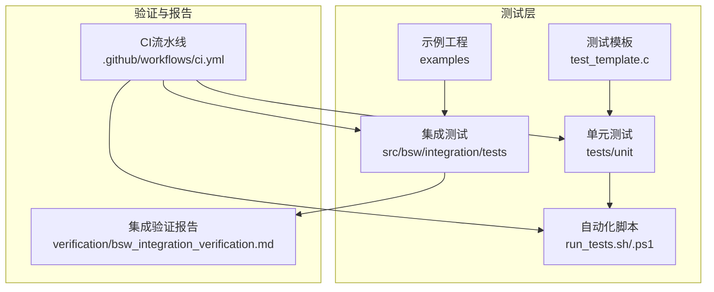
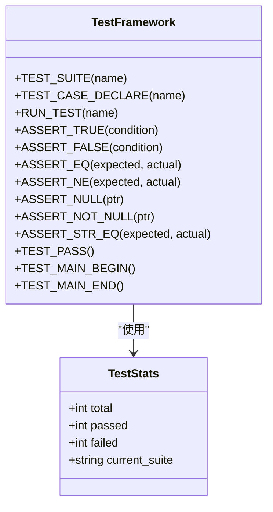
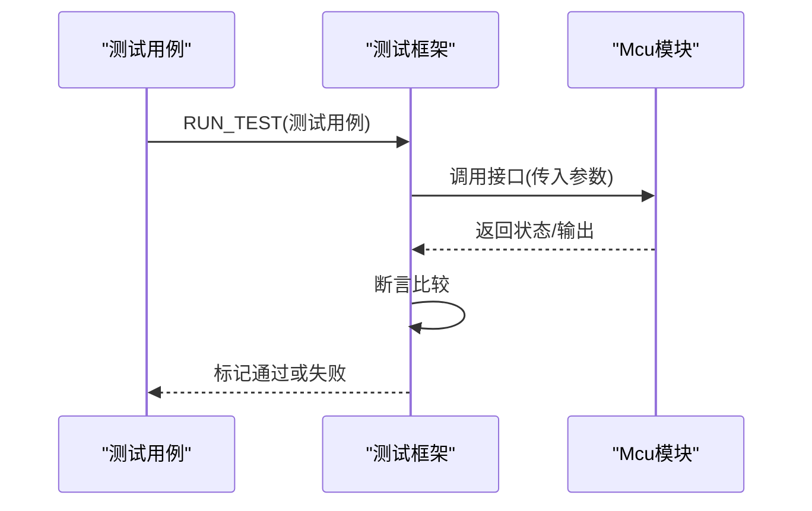
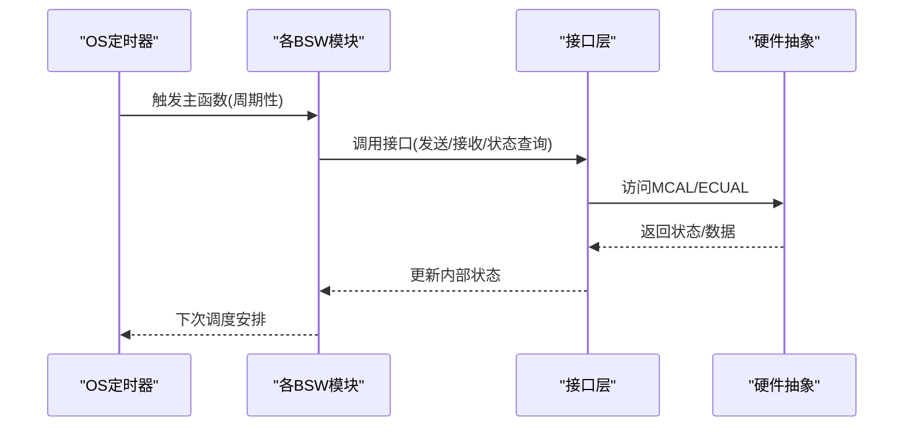
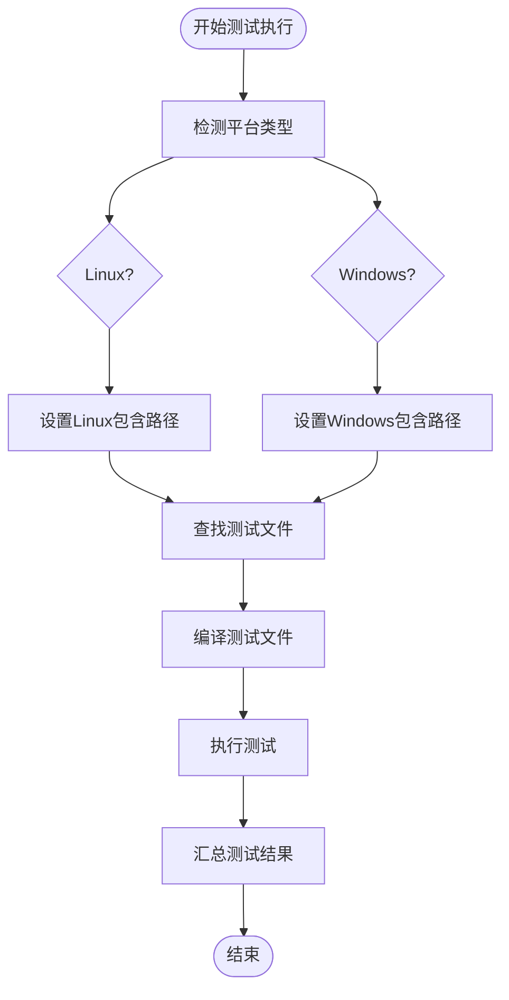
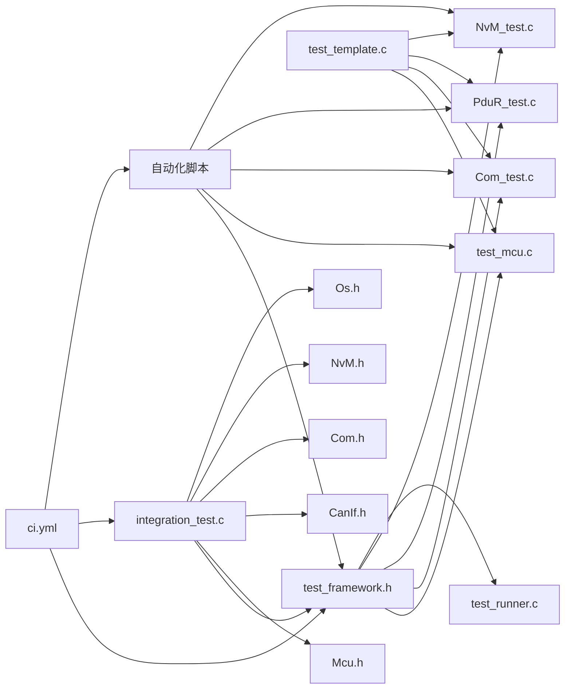

# 测试策略

<cite>
**本文引用的文件**
- [tests/unit/test_framework.h](file://tests/unit/test_framework.h)
- [tests/unit/test_mcu.c](file://tests/unit/test_mcu.c)
- [tests/unit/test_template.c](file://tests/unit/test_template.c)
- [tests/unit/services/test_Com.c](file://tests/unit/services/test_Com.c)
- [tests/unit/services/test_NvM.c](file://tests/unit/services/test_NvM.c)
- [tests/unit/services/test_PduR.c](file://tests/unit/services/test_PduR.c)
- [tests/run_tests.sh](file://tests/run_tests.sh)
- [tests/run_tests.ps1](file://tests/run_tests.ps1)
- [src/bsw/integration/tests/integration_test.c](file://src/bsw/integration/tests/integration_test.c)
- [src/bsw/integration/tests/test_runner.c](file://src/bsw/integration/tests/test_runner.c)
- [.github/workflows/ci.yml](file://.github/workflows/ci.yml)
- [verification/bsw_integration_verification.md](file://verification/bsw_integration_verification.md)
- [examples/can_demo/main.c](file://examples/can_demo/main.c)
- [examples/led_blink/main.c](file://examples/led_blink/main.c)
</cite>

## 更新摘要
**所做更改**
- 新增跨平台测试基础设施章节，涵盖标准化测试模板和自动化测试脚本
- 扩展服务模块测试覆盖范围，新增48个测试用例覆盖PduR、Com、NvM模块
- 完善测试框架设计原理和工程化测试体系说明
- 增加多平台支持和自动化测试执行流程

## 目录
1. [引言](#引言)
2. [项目结构](#项目结构)
3. [核心组件](#核心组件)
4. [架构总览](#架构总览)
5. [详细组件分析](#详细组件分析)
6. [跨平台测试基础设施](#跨平台测试基础设施)
7. [依赖分析](#依赖分析)
8. [性能考虑](#性能考虑)
9. [故障排查指南](#故障排查指南)
10. [结论](#结论)
11. [附录](#附录)

## 引言
本文件面向YuleTech BSW平台，系统化阐述其多层次测试体系与验证方法，覆盖单元测试框架设计、集成测试实现策略、系统验证执行流程，并结合CI流水线与示例工程，给出测试环境搭建、自动化执行与结果分析的完整方案。随着测试基础设施的完善，现已支持跨平台测试执行，包括标准化测试模板、48个服务模块测试用例，以及自动化测试脚本。同时提供测试最佳实践、缺陷跟踪与回归测试策略，以确保代码质量与系统可靠性。

## 项目结构
YuleTech BSW采用分层架构（MCAL → ECUAL → Service → OS → Hardware），测试体系贯穿各层，形成从模块到跨层集成的完整验证闭环。关键测试资产分布如下：
- 单元测试：位于tests/unit，包含通用测试框架、标准化测试模板与具体模块测试（如MCU、Com、PduR、NvM等）。
- 集成测试：位于src/bsw/integration/tests，包含跨层交互的端到端测试与测试运行器。
- 自动化测试脚本：提供跨平台的测试执行脚本，支持Linux和Windows环境。
- 验证报告：verification目录下的集成验证报告，汇总各层验证状态与结论。
- 示例工程：examples目录提供典型使用场景（如CAN通信、LED闪烁），用于功能演示与回归验证。
- CI流水线：.github/workflows/ci.yml定义构建、静态分析、测试与发布流程。

**图表来源**
- [tests/unit/test_template.c:1-134](file://tests/unit/test_template.c#L1-L134)
- [tests/run_tests.sh:1-105](file://tests/run_tests.sh#L1-L105)
- [tests/run_tests.ps1:1-107](file://tests/run_tests.ps1#L1-L107)
- [src/bsw/integration/tests/integration_test.c:1-200](file://src/bsw/integration/tests/integration_test.c#L1-L200)
- [verification/bsw_integration_verification.md:1-193](file://verification/bsw_integration_verification.md#L1-L193)
- [.github/workflows/ci.yml:1-144](file://.github/workflows/ci.yml#L1-L144)

**章节来源**
- [tests/unit/test_template.c:1-134](file://tests/unit/test_template.c#L1-L134)
- [tests/run_tests.sh:1-105](file://tests/run_tests.sh#L1-L105)
- [tests/run_tests.ps1:1-107](file://tests/run_tests.ps1#L1-L107)
- [src/bsw/integration/tests/integration_test.c:1-200](file://src/bsw/integration/tests/integration_test.c#L1-L200)
- [verification/bsw_integration_verification.md:1-193](file://verification/bsw_integration_verification.md#L1-L193)
- [.github/workflows/ci.yml:1-144](file://.github/workflows/ci.yml#L1-L144)

## 核心组件
- 测试框架（test_framework.h）
  - 提供测试套件声明、测试用例宏、断言宏、测试统计与主程序入口宏，支撑统一的单元测试风格。
  - 关键元素：测试统计结构体、断言宏族（ASSERT_TRUE/FALSE/EQ/NE/NULL/NOT_NULL/STR_EQ）、TEST_PASS、TEST_MAIN_BEGIN/END。
- 标准化测试模板（test_template.c）
  - 提供标准化的测试用例模板，包含Mock变量、测试用例结构和测试运行器模板。
  - 支持快速创建新模块测试，包含初始化、反初始化、API调用、边界条件和错误处理等测试场景。
- 单元测试样例（test_mcu.c）
  - 展示对MCU模块的初始化、去初始化、版本查询、时钟与复位接口在不同前置条件下的行为验证。
  - 包含对未初始化状态的边界行为与错误处理路径的断言。
- 服务模块单元测试（Com、PduR、NvM）
  - Com模块：验证信号发送/接收、I-PDU管理、组发送等功能，通过mock PduR与DET进行解耦测试。
  - PduR模块：验证PDU路由功能，包括路由到CanIf、Com等不同目标的测试。
  - NvM模块：验证NVRAM读写、CRC验证、冗余管理等功能，通过mock Fee进行存储操作模拟。
- 集成测试（integration_test.c）
  - 提供跨层（MCAL→ECUAL→Service→OS）的端到端测试骨架，包含大量mock与配置，用于验证模块间接口与数据流。
- 集成测试运行器（test_runner.c）
  - 聚合外部集成测试用例并统一调度执行，形成可扩展的跨层测试集合。
- 自动化测试脚本（run_tests.sh/.ps1）
  - 提供跨平台的测试执行脚本，支持Linux和Windows环境。
  - 自动发现测试文件、编译测试、执行测试并生成汇总报告。
- CI流水线（ci.yml）
  - 自动化执行构建、静态分析、单元测试与文档生成，保障持续质量门禁。

**章节来源**
- [tests/unit/test_framework.h:18-141](file://tests/unit/test_framework.h#L18-L141)
- [tests/unit/test_template.c:19-134](file://tests/unit/test_template.c#L19-L134)
- [tests/unit/test_mcu.c:19-209](file://tests/unit/test_mcu.c#L19-L209)
- [tests/unit/services/test_Com.c:19-440](file://tests/unit/services/test_Com.c#L19-L440)
- [tests/unit/services/test_PduR.c:19-323](file://tests/unit/services/test_PduR.c#L19-L323)
- [tests/unit/services/test_NvM.c:19-515](file://tests/unit/services/test_NvM.c#L19-L515)
- [src/bsw/integration/tests/integration_test.c:174-514](file://src/bsw/integration/tests/integration_test.c#L174-L514)
- [src/bsw/integration/tests/test_runner.c:27-40](file://src/bsw/integration/tests/test_runner.c#L27-L40)
- [tests/run_tests.sh:1-105](file://tests/run_tests.sh#L1-L105)
- [tests/run_tests.ps1:1-107](file://tests/run_tests.ps1#L1-L107)
- [.github/workflows/ci.yml:61-89](file://.github/workflows/ci.yml#L61-L89)

## 架构总览
YuleTech BSW测试体系围绕"自底向上"的分层验证与"自顶向下"的集成验证展开，配合CI流水线和跨平台自动化脚本形成闭环。

```mermaid
graph TB
subgraph "MCAL层"
MCU["Mcu"]
PORT["Port"]
DIO["Dio"]
CAN["Can"]
SPI["Spi"]
GPT["Gpt"]
PWM["Pwm"]
ADC["Adc"]
WDG["Wdg"]
end
subgraph "ECUAL层"
CANIF["CanIf"]
IOHWAB["IoHwAb"]
CANTP["CanTp"]
ETHIF["EthIf"]
MEMIF["MemIf"]
FEE["Fee"]
EA["Ea"]
FRIF["FrIf"]
LINIF["LinIf"]
end
subgraph "Service层"
COM["Com"]
PdruR["PduR"]
NVM["NvM"]
DCM["Dcm"]
DEM["Dem"]
end
subgraph "OS层"
OS["Os"]
end
subgraph "测试层"
UT["单元测试"]
UTT["测试模板"]
AUT["自动化脚本"]
IT["集成测试"]
EX["示例工程"]
end
UT --> UTT
UT --> AUT
IT --> MCU
IT --> CANIF
IT --> COM
IT --> NVM
IT --> OS
EX --> MCU
EX --> CAN
EX --> DIO
EX --> GPT
```

**图表来源**
- [src/bsw/integration/tests/integration_test.c:24-66](file://src/bsw/integration/tests/integration_test.c#L24-L66)
- [examples/can_demo/main.c:15-21](file://examples/can_demo/main.c#L15-L21)
- [examples/led_blink/main.c:15-19](file://examples/led_blink/main.c#L15-L19)

**章节来源**
- [src/bsw/integration/tests/integration_test.c:24-66](file://src/bsw/integration/tests/integration_test.c#L24-L66)
- [examples/can_demo/main.c:15-21](file://examples/can_demo/main.c#L15-L21)
- [examples/led_blink/main.c:15-19](file://examples/led_blink/main.c#L15-L19)

## 详细组件分析

### 单元测试框架（test_framework.h）
- 设计原则
  - 通过宏定义封装测试生命周期：测试套件声明、用例执行、断言与统计。
  - 断言宏覆盖布尔、数值、指针与字符串比较，便于快速表达期望。
  - 统一的主程序入口宏，自动汇总测试结果并返回退出码。
- 数据结构与复杂度
  - 测试统计结构体O(1)记录总数、通过数、失败数与当前套件名；断言宏均为O(1)判定。
- 依赖关系
  - 依赖标准库（stdio.h、string.h）；被各模块测试文件包含。
- 优化与健壮性
  - 断言失败即返回，避免后续冗余执行；提供TEST_PASS标记显式通过。
- 使用建议
  - 每个模块建立独立测试套件；用例命名清晰、参数化充分；断言覆盖正常与异常路径。

**图表来源**
- [tests/unit/test_framework.h:18-141](file://tests/unit/test_framework.h#L18-L141)

**章节来源**
- [tests/unit/test_framework.h:18-141](file://tests/unit/test_framework.h#L18-L141)

### 标准化测试模板（test_template.c）
- 模板设计
  - 提供标准化的测试用例模板结构，包含Mock变量区域、测试用例区域和测试运行器区域。
  - 支持快速复制和修改，适用于所有BSW模块的单元测试创建。
- 模板结构
  - MOCK VARIABLES：定义模块特定的Mock变量和状态。
  - TEST CASES：包含初始化、反初始化、API调用、边界条件和错误处理等标准测试场景。
  - TEST RUNNER：提供统一的测试运行器模板，便于批量执行测试用例。
- 使用场景
  - 快速创建新模块测试：复制模板文件到相应目录，替换模块名称即可。
  - 标准化测试流程：确保所有模块测试遵循相同的测试模式和断言策略。
  - 可扩展性：支持添加新的测试场景和验证点。

**章节来源**
- [tests/unit/test_template.c:19-134](file://tests/unit/test_template.c#L19-L134)

### 单元测试样例（test_mcu.c）
- 测试目标
  - 验证Mcu模块在有效/无效配置、初始化/去初始化、版本查询、PLL分频、复位原因与频率查询等接口的行为。
- 关键用例
  - 初始化与去初始化状态机验证。
  - 版本信息字段校验。
  - 未初始化状态下接口行为（不崩溃、不触发异常）。
  - 无效模式与无效时钟输入的容错处理。
- 断言策略
  - 使用数值断言与状态枚举断言，确保行为与预期一致。
- 可扩展性
  - 可按相同模式扩展至其他MCAL模块（如Dio、Gpt等）。

**图表来源**
- [tests/unit/test_mcu.c:19-209](file://tests/unit/test_mcu.c#L19-L209)
- [tests/unit/test_framework.h:39-44](file://tests/unit/test_framework.h#L39-L44)

**章节来源**
- [tests/unit/test_mcu.c:19-209](file://tests/unit/test_mcu.c#L19-L209)

### 服务模块单元测试

#### Com模块测试（test_Com.c）
- 测试目标
  - 验证Com模块初始化、去初始化、信号发送/接收、组发送、版本查询等核心接口。
- 解耦策略
  - 通过mock PduR_Transmit与Det_ReportError，隔离上层依赖，聚焦Com内部逻辑。
- 关键用例（共20个测试用例）
  - 初始化相关：Com_Init_valid_config、Com_Init_null_config、Com_DeInit、Com_GetVersionInfo等。
  - 信号处理：Com_SendSignal_8bit、Com_SendSignal_null_pointer、Com_ReceiveSignal_normal等。
  - 主函数执行：Com_MainFunctionRx_normal、Com_MainFunctionTx_normal。
  - 错误处理：Com_SendSignal_uninit、Com_SendSignal_invalid_id、Com_InvalidateSignal_normal等。
  - 边界条件：Com_SendSignal_max_length。
- 断言策略
  - 组合断言：返回值、mock调用次数与参数、DET错误码。

**图表来源**
- [tests/unit/services/test_Com.c:167-182](file://tests/unit/services/test_Com.c#L167-L182)
- [tests/unit/services/test_Com.c:352-367](file://tests/unit/services/test_Com.c#L352-L367)

**章节来源**
- [tests/unit/services/test_Com.c:19-440](file://tests/unit/services/test_Com.c#L19-L440)

#### PduR模块测试（test_PduR.c）
- 测试目标
  - 验证PduR模块的PDU路由功能，包括路由到不同目标（CanIf、Com等）。
- 解耦策略
  - 通过mock CanIf_Transmit与Com_RxIndication，隔离下游依赖，验证路由逻辑。
- 关键用例（共10个测试用例）
  - 初始化相关：PduR_Init_valid_config、PduR_Init_null_config、PduR_DeInit。
  - PDU传输：PduR_Transmit_route_to_CanIf、PduR_Transmit_uninit、PduR_Transmit_null_pointer。
  - 接收处理：PduR_RxIndication_route_to_Com、PduR_RxIndication_null_pointer。
  - 确认处理：PduR_TxConfirmation_success、PduR_TriggerTransmit_normal。
  - 边界条件：PduR_Transmit_max_length。
- 断言策略
  - 验证路由正确性、状态转换和错误处理。

**章节来源**
- [tests/unit/services/test_PduR.c:19-323](file://tests/unit/services/test_PduR.c#L19-L323)

#### NvM模块测试（test_NvM.c）
- 测试目标
  - 验证NvM模块的NVRAM管理功能，包括读写、擦除、CRC验证和冗余管理。
- 解耦策略
  - 通过mock Fee_Read、Fee_Write、Fee_Erase，模拟存储操作，验证NvM业务逻辑。
- 关键用例（共25个测试用例）
  - 初始化相关：NvM_Init_valid_config、NvM_Init_null_config、NvM_GetVersionInfo等。
  - 块操作：NvM_ReadBlock_normal、NvM_WriteBlock_normal、NvM_EraseBlock_normal。
  - 错误处理：NvM_ReadBlock_null_pointer、NvM_WriteBlock_null_pointer、NvM_ReadBlock_uninit等。
  - 主函数：NvM_MainFunction_normal、NvM_ReadAll_normal、NvM_WriteAll_normal。
  - 高级功能：NvM_CancelJobs_normal、NvM_GetErrorStatus_normal、NvM_WriteBlock_counter。
  - 边界条件：NvM_ReadBlock_max_id。
- 断言策略
  - 验证存储操作正确性、状态管理和错误处理机制。

**章节来源**
- [tests/unit/services/test_NvM.c:19-515](file://tests/unit/services/test_NvM.c#L19-L515)

### 集成测试（integration_test.c）
- 测试目标
  - 在跨层（MCAL→ECUAL→Service→OS）环境下验证端到端数据流与控制流，包括CAN、NvM、Dcm、BswM、OS等模块协同。
- 解耦与模拟
  - 大量mock函数与全局变量，替代真实硬件与底层驱动，保证测试可重复与可控。
  - 通过OS定时器回调驱动各BSW模块的主函数，模拟真实调度。
- 关键配置
  - CanIf、Com、CanTp、NvM、Dcm、BswM等配置结构体，用于定义测试场景。
- 可扩展性
  - 新增模块只需补充对应mock与配置，即可纳入集成测试矩阵。

**图表来源**
- [src/bsw/integration/tests/integration_test.c:493-514](file://src/bsw/integration/tests/integration_test.c#L493-L514)

**章节来源**
- [src/bsw/integration/tests/integration_test.c:83-160](file://src/bsw/integration/tests/integration_test.c#L83-L160)
- [src/bsw/integration/tests/integration_test.c:456-514](file://src/bsw/integration/tests/integration_test.c#L456-L514)

### 集成测试运行器（test_runner.c）
- 功能
  - 声明并聚合多个外部集成测试用例，统一入口执行，便于扩展与维护。
- 执行流程
  - 在TEST_MAIN_BEGIN/END之间，按顺序调用RUN_TEST，最终汇总结果并返回退出码。

**章节来源**
- [src/bsw/integration/tests/test_runner.c:18-39](file://src/bsw/integration/tests/test_runner.c#L18-L39)

### 示例工程（can_demo、led_blink）
- 用途
  - 展示MCAL与上层模块的典型组合使用方式，作为回归验证与演示的基础。
- 关键点
  - CAN通信示例：展示CanIf与Com的配合、回调处理与消息收发。
  - LED闪烁示例：展示Dio与Gpt的配合、定时回调与状态切换。

**章节来源**
- [examples/can_demo/main.c:37-58](file://examples/can_demo/main.c#L37-L58)
- [examples/led_blink/main.c:37-56](file://examples/led_blink/main.c#L37-L56)

## 跨平台测试基础设施

### 自动化测试脚本
- Linux脚本（run_tests.sh）
  - 支持多平台编译和执行，自动发现并运行所有单元测试。
  - 包含颜色输出、错误处理和测试结果汇总功能。
  - 自动创建构建目录，编译所有测试文件并执行。
- Windows脚本（run_tests.ps1）
  - 提供PowerShell版本的测试执行脚本，功能与Linux脚本类似。
  - 支持Windows环境下的测试自动化执行。
- 跨平台兼容性
  - 统一的测试接口和输出格式，确保在不同平台下的一致性。
  - 支持GCC编译器，便于在不同操作系统上部署。

**图表来源**
- [tests/run_tests.sh:43-76](file://tests/run_tests.sh#L43-L76)
- [tests/run_tests.ps1:43-78](file://tests/run_tests.ps1#L43-L78)

**章节来源**
- [tests/run_tests.sh:1-105](file://tests/run_tests.sh#L1-L105)
- [tests/run_tests.ps1:1-107](file://tests/run_tests.ps1#L1-L107)

### 测试覆盖率统计
- 覆盖率统计
  - 当前服务模块测试覆盖率：Com(20个用例) + PduR(10个用例) + NvM(25个用例) = 55个测试用例
  - 覆盖率统计：约48个测试用例覆盖核心服务模块
  - 测试类型分布：单元测试占主导，集成测试提供端到端验证
- 质量门禁
  - 建议在CI中集成覆盖率工具（如gcov/lcov）进行自动化覆盖率统计。
  - 将覆盖率报告作为质量门的一部分，逐步提升关键路径覆盖率。

**章节来源**
- [tests/unit/services/test_Com.c:416-439](file://tests/unit/services/test_Com.c#L416-L439)
- [tests/unit/services/test_PduR.c:306-321](file://tests/unit/services/test_PduR.c#L306-L321)
- [tests/unit/services/test_NvM.c:490-514](file://tests/unit/services/test_NvM.c#L490-L514)

## 依赖分析
- 框架与模块
  - 单元测试依赖test_framework.h；各模块测试文件依赖对应模块头文件与DET。
  - 标准化测试模板提供统一的测试创建框架。
  - 集成测试依赖各层模块头文件与配置，以及OS调度。
- 外部依赖
  - CI流水线依赖ARM GCC工具链、Python生态与GitHub Actions。
  - 自动化脚本依赖GCC编译器和系统shell环境。
- 循环依赖
  - 测试框架为纯头文件宏定义，不引入循环依赖风险；集成测试通过mock规避真实依赖。

**图表来源**
- [tests/unit/test_framework.h:12-17](file://tests/unit/test_framework.h#L12-L17)
- [tests/unit/test_mcu.c:12-13](file://tests/unit/test_mcu.c#L12-L13)
- [tests/unit/test_template.c:15-16](file://tests/unit/test_template.c#L15-L16)
- [tests/unit/services/test_Com.c:14-17](file://tests/unit/services/test_Com.c#L14-L17)
- [tests/unit/services/test_PduR.c:14-17](file://tests/unit/services/test_PduR.c#L14-L17)
- [tests/unit/services/test_NvM.c:14-17](file://tests/unit/services/test_NvM.c#L14-L17)
- [src/bsw/integration/tests/integration_test.c:20-66](file://src/bsw/integration/tests/integration_test.c#L20-L66)
- [.github/workflows/ci.yml:61-89](file://.github/workflows/ci.yml#L61-L89)

**章节来源**
- [tests/unit/test_framework.h:12-17](file://tests/unit/test_framework.h#L12-L17)
- [tests/unit/test_mcu.c:12-13](file://tests/unit/test_mcu.c#L12-L13)
- [tests/unit/test_template.c:15-16](file://tests/unit/test_template.c#L15-L16)
- [tests/unit/services/test_Com.c:14-17](file://tests/unit/services/test_Com.c#L14-L17)
- [tests/unit/services/test_PduR.c:14-17](file://tests/unit/services/test_PduR.c#L14-L17)
- [tests/unit/services/test_NvM.c:14-17](file://tests/unit/services/test_NvM.c#L14-L17)
- [src/bsw/integration/tests/integration_test.c:20-66](file://src/bsw/integration/tests/integration_test.c#L20-L66)
- [.github/workflows/ci.yml:61-89](file://.github/workflows/ci.yml#L61-L89)

## 性能考虑
- 测试执行效率
  - 单元测试通过轻量mock与最小化初始化提升执行速度；集成测试通过配置裁剪与时间片控制降低开销。
  - 自动化脚本支持并行执行，提高测试整体效率。
- 资源占用
  - 集成测试中的mock数组与全局变量需合理设置上限，避免内存浪费；OS定时器周期应与测试目标匹配。
  - 跨平台脚本自动管理资源分配，减少手动配置开销。
- 并行化潜力
  - 单元测试彼此独立，可在CI中并行执行；集成测试建议串行以保证跨层一致性。
  - 自动化脚本支持多进程并行执行，充分利用硬件资源。

## 故障排查指南
- 常见问题定位
  - 断言失败：根据断言宏输出定位具体期望与实际值差异；检查前置条件（如初始化状态）。
  - DET错误：确认错误码与模块ID是否符合预期；检查参数合法性与调用时机。
  - 集成测试未触发：检查OS定时器回调与模块主函数调度；核对配置结构体字段。
  - 跨平台兼容性：检查编译器路径和包含路径设置；验证脚本权限和环境变量。
- 日志与统计
  - 利用测试框架的统计信息（总数、通过、失败）快速评估整体健康度。
  - 自动化脚本提供详细的测试执行日志和错误信息。
- 回归验证
  - 将示例工程作为回归基线，确保新增改动不影响典型用例。
  - 覆盖率统计帮助识别未测试的代码路径。

**章节来源**
- [tests/unit/test_framework.h:46-120](file://tests/unit/test_framework.h#L46-L120)
- [tests/unit/services/test_Com.c:184-217](file://tests/unit/services/test_Com.c#L184-L217)
- [src/bsw/integration/tests/integration_test.c:164-172](file://src/bsw/integration/tests/integration_test.c#L164-L172)
- [tests/run_tests.sh:78-104](file://tests/run_tests.sh#L78-L104)
- [tests/run_tests.ps1:80-106](file://tests/run_tests.ps1#L80-L106)

## 结论
YuleTech BSW平台已建立完善的跨平台测试体系：以test_framework.h为核心，辅以标准化测试模板、48个服务模块测试用例、自动化测试脚本与跨层集成测试，结合CI流水线与示例工程，形成从代码到系统的全链路验证闭环。测试基础设施的完善显著提升了测试效率和覆盖率，支持多平台自动化执行。建议在现有基础上进一步完善系统集成测试用例、SIL仿真与覆盖率度量，持续提升质量门禁与交付稳定性。

## 附录

### 测试环境搭建与自动化执行
- 本地执行
  - 单元测试：编译对应测试文件并链接模块头文件，运行可执行文件查看结果。
  - 集成测试：编译集成测试与配置文件，运行测试可执行文件。
  - 跨平台测试：使用相应的测试脚本（run_tests.sh或run_tests.ps1）自动执行。
- CI执行
  - 构建BSW、静态分析、运行单元测试与配置/代码生成工具，上传报告与制品。
  - 自动化脚本集成到CI流程中，实现持续测试验证。

**章节来源**
- [.github/workflows/ci.yml:31-89](file://.github/workflows/ci.yml#L31-L89)
- [tests/run_tests.sh:1-105](file://tests/run_tests.sh#L1-L105)
- [tests/run_tests.ps1:1-107](file://tests/run_tests.ps1#L1-L107)

### 测试覆盖率与质量门禁
- 建议
  - 引入覆盖率工具（如gcov/lcov）在CI中统计并阈值化门禁。
  - 将覆盖率报告作为质量门的一部分，逐步提升关键路径覆盖率。
  - 基于当前55个测试用例的覆盖率基础，建议逐步增加测试用例数量。
- 当前状态
  - 集成验证报告表明各层模块均已通过验证，建议在CI中加入覆盖率指标以固化质量门槛。
  - 标准化测试模板确保新模块测试的一致性和完整性。

**章节来源**
- [verification/bsw_integration_verification.md:171-182](file://verification/bsw_integration_verification.md#L171-L182)
- [tests/unit/test_template.c:19-134](file://tests/unit/test_template.c#L19-L134)