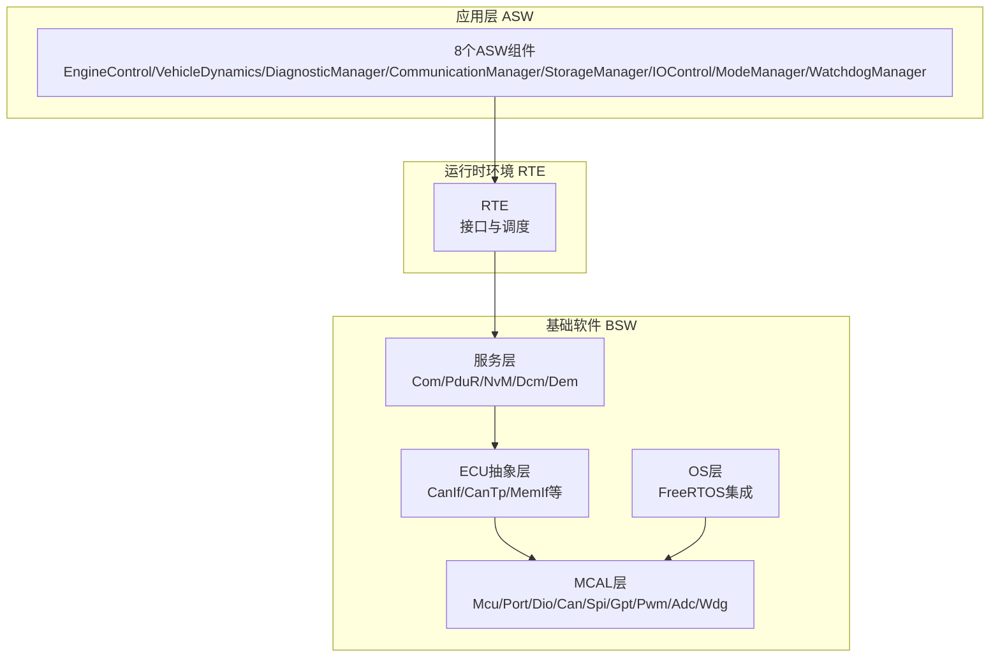
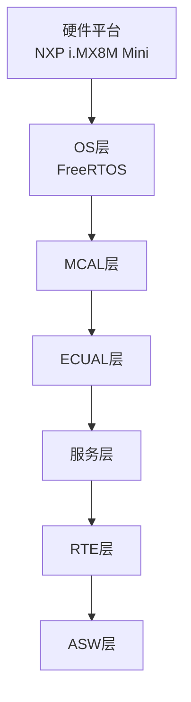
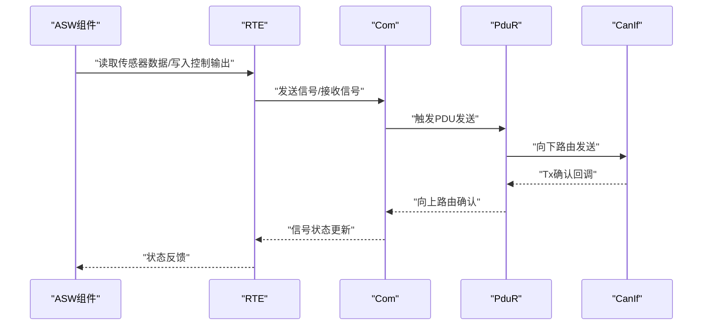
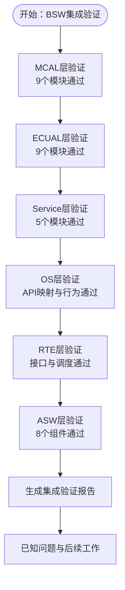
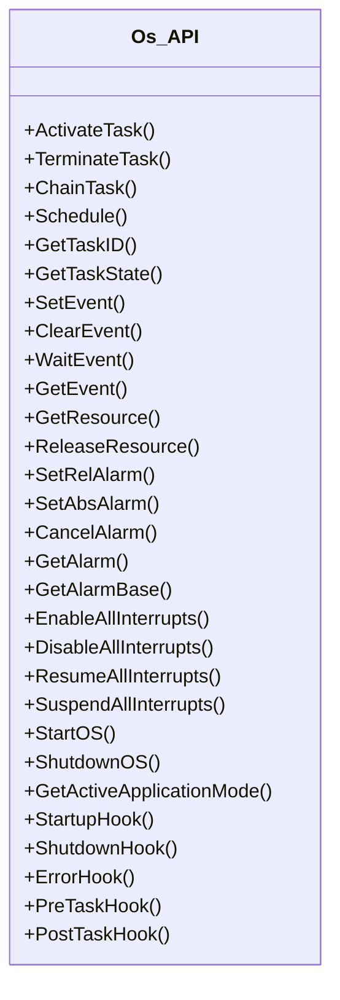
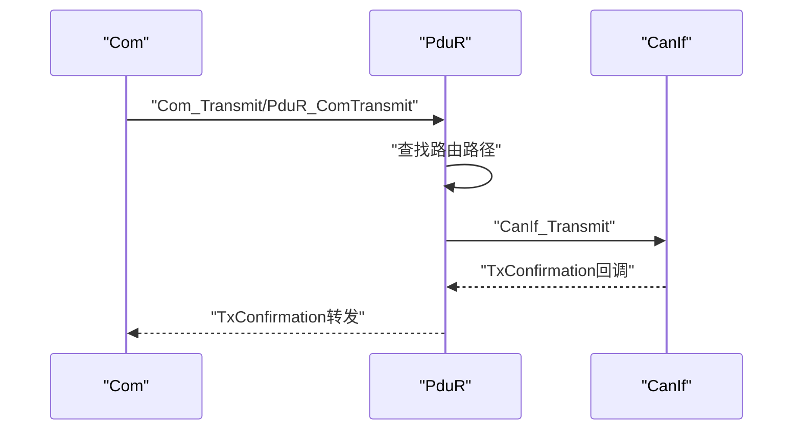
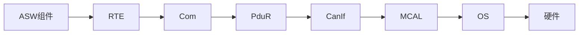
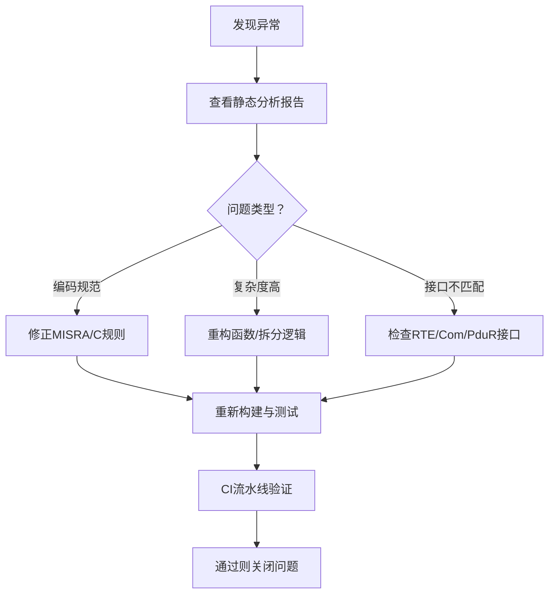

# 系统验证

<cite>
**本文引用的文件**
- [asw_verification.md](file://verification/asw_verification.md)
- [bsw_integration_verification.md](file://verification/bsw_integration_verification.md)
- [os_verification.md](file://verification/os_verification.md)
- [pdur_verification.md](file://verification/pdur_verification.md)
- [spec.md](file://openspec/specs/bsw/spec.md)
- [spec.md](file://openspec/specs/toolchain/spec.md)
- [Os.h](file://src/bsw/os/include/Os.h)
- [PduR.h](file://src/bsw/services/pdur/include/PduR.h)
- [bsw_config.json](file://config/bsw_config.json)
- [ci.yml](file://.github/workflows/ci.yml)
- [asw_interfaces.h](file://src/asw/asw_interfaces.h)
- [integration_test.c](file://tests/integration/bsw/integration_test.c)
- [Com.h](file://src/bsw/services/com/include/Com.h)
- [Swc_EngineControl.c](file://src/asw/engine_control/src/Swc_EngineControl.c)
- [main.c](file://examples/can_demo/main.c)
- [static_analysis.py](file://tools/analysis/static_analysis.py)
- [rte_generator.py](file://tools/rte_generator/rte_generator.py)
</cite>

## 目录
1. [简介](#简介)
2. [项目结构](#项目结构)
3. [核心组件](#核心组件)
4. [架构总览](#架构总览)
5. [详细组件分析](#详细组件分析)
6. [依赖关系分析](#依赖关系分析)
7. [性能考量](#性能考量)
8. [故障排查指南](#故障排查指南)
9. [结论](#结论)
10. [附录](#附录)

## 简介
本技术文档面向YuleTech BSW平台的系统验证，围绕多层次验证体系展开：ASW验证（应用层软件组件）、BSW集成验证（基础软件各层协同）、OS验证（实时操作系统行为）、PDU路由验证（数据传输与路由）。文档提供验证目标、范围、流程、环境与工具链、自动化执行与结果评估的完整指导，并结合仓库中的验证报告、规范与实现代码进行深入解读。

## 项目结构
YuleTech BSW平台采用AutoSAR Classic Platform 4.x分层架构，包含MCAL、ECUAL、Service、OS、RTE与ASW六层。验证覆盖贯穿各层，形成从模块到系统的闭环验证能力。

图示来源
- [spec.md:15-47](file://openspec/specs/bsw/spec.md#L15-L47)

章节来源
- [spec.md:11-47](file://openspec/specs/bsw/spec.md#L11-L47)

## 核心组件
- ASW（应用层软件）：包含8个组件，负责具体车辆功能实现，通过RTE与BSW交互。
- BSW（基础软件）：覆盖MCAL、ECUAL、Service、OS四层，提供硬件抽象、通信、存储、诊断、内存管理与实时调度。
- OS（实时操作系统）：基于FreeRTOS实现AutoSAR OS API，提供任务、事件、资源、报警、中断与钩子等能力。
- PDU路由（PduR）：实现PDU在不同模块间的路由与转发，支持向上/向下路由、确认回调与FIFO队列。

章节来源
- [bsw_integration_verification.md:15-25](file://verification/bsw_integration_verification.md#L15-L25)
- [os_verification.md:1-164](file://verification/os_verification.md#L1-L164)
- [pdur_verification.md:1-129](file://verification/pdur_verification.md#L1-L129)

## 架构总览
YuleTech BSW平台严格遵循AutoSAR Classic Platform 4.x分层架构，验证报告明确各层模块完成度与架构符合度，确保从硬件到应用的完整链路。

图示来源
- [bsw_integration_verification.md:136-155](file://verification/bsw_integration_verification.md#L136-L155)

章节来源
- [bsw_integration_verification.md:136-155](file://verification/bsw_integration_verification.md#L136-L155)

## 详细组件分析

### ASW验证（应用层软件组件）
- 验证目标：确保8个ASW组件的功能、性能与接口一致性满足AutoSAR Classic Platform 4.x标准。
- 验证范围：EngineControl、VehicleDynamics、DiagnosticManager、CommunicationManager、StorageManager、IOControl、ModeManager、WatchdogManager。
- 验证结果：全部通过，具备良好的代码质量与覆盖率。
- 关键验证维度：
  - 功能验证：状态机、计算逻辑、接口调用正确性。
  - 性能验证：循环执行时间、内存占用、并发管理。
  - 接口验证：RTE接口数据类型、方向与命名规范。
  - 代码质量：MISRA-C:2012符合、静态分析无严重缺陷、覆盖率达标。
- 代表性组件：EngineControl（10ms/100ms循环、燃油喷射与点火正时计算、温度补偿、故障检测）、WatchdogManager（实体注册/注销、Alive监控、Checkpoint机制、超时检测）。

图示来源
- [asw_verification.md:37-199](file://verification/asw_verification.md#L37-L199)
- [asw_interfaces.h:1-314](file://src/asw/asw_interfaces.h#L1-L314)
- [Com.h:240-501](file://src/bsw/services/com/include/Com.h#L240-L501)

章节来源
- [asw_verification.md:22-241](file://verification/asw_verification.md#L22-L241)
- [asw_interfaces.h:1-314](file://src/asw/asw_interfaces.h#L1-L314)
- [Swc_EngineControl.c:357-394](file://src/asw/engine_control/src/Swc_EngineControl.c#L357-L394)

### BSW集成验证（基础软件各层协同）
- 验证目标：确认MCAL、ECUAL、Service、OS、RTE、ASW六层模块按规范实现且相互协作。
- 验证结果：33个模块全部完成，分层依赖方向符合AutoSAR规范，DET与内存分区支持完备。
- 关键验证维度：
  - 模块完成度：MCAL/ECUAL/Service/OS/RTE/ASW各层均100%完成。
  - 代码规范：命名、宏定义、类型命名、DET、MemMap分区、文件头注释、分层约束均通过。
  - 架构符合度：自ASW到OS逐层依赖，符合AutoSAR分层原则。
- 已知问题与后续工作：OS为单核实现、部分RTE回调为占位、缺少完整集成测试用例。

图示来源
- [bsw_integration_verification.md:15-118](file://verification/bsw_integration_verification.md#L15-L118)

章节来源
- [bsw_integration_verification.md:15-193](file://verification/bsw_integration_verification.md#L15-L193)

### OS验证（实时操作系统）
- 验证目标：确认基于FreeRTOS的OS实现符合AutoSAR OS API规范，提供任务、事件、资源、报警、中断与钩子等能力。
- 验证结果：头文件、源文件、命名规范、DET与MemMap分区均通过；API映射与行为验证通过。
- 关键验证维度：
  - 任务管理：ActivateTask/TerminateTask/ChainTask/Schedule/GetTaskID/GetTaskState。
  - 事件管理：SetEvent/ClearEvent/WaitEvent/GetEvent。
  - 资源管理：GetResource/ReleaseResource与嵌套检测。
  - 报警管理：SetRelAlarm/SetAbsAlarm/CancelAlarm/GetAlarm/GetAlarmBase与周期性报警。
  - 中断管理：EnableAllInterrupts/DisableAllInterrupts/ResumeAllInterrupts/SuspendAllInterrupts。
  - OS控制：StartOS/ShutdownOS/GetActiveApplicationMode。
  - 钩子函数：StartupHook/ShutdownHook/ErrorHook/PreTaskHook/PostTaskHook。
- 设计决策：采用FreeRTOS事件组映射事件、互斥量实现资源、软件定时器实现报警、任务挂起实现终止等。

图示来源
- [Os.h:154-210](file://src/bsw/os/include/Os.h#L154-L210)
- [os_verification.md:30-163](file://verification/os_verification.md#L30-L163)

章节来源
- [os_verification.md:1-164](file://verification/os_verification.md#L1-L164)
- [Os.h:1-213](file://src/bsw/os/include/Os.h#L1-L213)

### PDU路由验证（数据传输与路由）
- 验证目标：确认PduR模块实现符合AutoSAR 4.x标准，支持初始化、反初始化、路由查找、上下行路由、发送确认、FIFO队列与主函数处理。
- 验证结果：功能验证全部通过，代码质量良好，接口兼容性满足要求。
- 关键验证维度：
  - 初始化与反初始化：配置指针存储、状态初始化与清理、DET正常工作。
  - 路由表查找：根据PDU ID与模块类型正确匹配路径。
  - 向下/向上路由：COM/DCM与CanIf之间的正确转发与确认。
  - FIFO队列：初始化、Push/Pop、满/空检测。
  - 主函数：延迟路由、队列轮询与状态检查。
  - 性能评估：路由查找O(n)、FIFO O(1)，满足实时性要求。
- 接口兼容性：与PduR头文件、CanIf下层模块、COM/DCM上层模块接口匹配。

图示来源
- [pdur_verification.md:9-61](file://verification/pdur_verification.md#L9-L61)
- [PduR.h:168-280](file://src/bsw/services/pdur/include/PduR.h#L168-L280)

章节来源
- [pdur_verification.md:1-129](file://verification/pdur_verification.md#L1-L129)
- [PduR.h:1-282](file://src/bsw/services/pdur/include/PduR.h#L1-L282)

## 依赖关系分析
- 分层依赖：ASW → RTE → Service → ECUAL → MCAL → OS → 硬件。
- 模块间接口：Com作为信号路由枢纽，PduR负责PDU跨模块转发，RTE桥接ASW与BSW。
- 配置与生成：工具链支持ARXML解析与代码生成，配置工具支持模块选择与依赖解析。

图示来源
- [bsw_integration_verification.md:136-155](file://verification/bsw_integration_verification.md#L136-L155)
- [spec.md:13-31](file://openspec/specs/toolchain/spec.md#L13-L31)

章节来源
- [bsw_integration_verification.md:136-155](file://verification/bsw_integration_verification.md#L136-L155)
- [spec.md:13-31](file://openspec/specs/toolchain/spec.md#L13-L31)

## 性能考量
- 性能目标（来自规范）：
  - 中断响应延迟：<10μs
  - 任务调度延迟：<50μs
  - CAN报文处理：<100μs
  - Flash写操作：按芯片规格
- 实际验证：
  - ASW组件性能：10ms/100ms循环执行时间满足要求。
  - OS报警精度：受FreeRTOS tick精度限制，最小周期为1ms。
  - PduR性能：路由查找O(n)、FIFO O(1)，满足实时性要求。
- 优化建议：
  - PduR：考虑路由路径缓存与优先级路由算法。
  - OS：多核支持与栈监控、保护机制完善。

章节来源
- [spec.md:238-246](file://openspec/specs/bsw/spec.md#L238-L246)
- [asw_verification.md:48-111](file://verification/asw_verification.md#L48-L111)
- [os_verification.md:150-156](file://verification/os_verification.md#L150-L156)
- [pdur_verification.md:101-112](file://verification/pdur_verification.md#L101-L112)

## 故障排查指南
- 静态分析与代码质量：
  - 使用静态分析工具进行MISRA-C检查、圈复杂度分析与代码风格检查，生成报告并定位问题。
  - 关注错误、警告与信息级别的问题，优先修复错误类问题。
- 集成测试与Mock：
  - 集成测试中提供大量Mock（Can、Fee、Gpt、OS、MemIf、Dcm、BswM、Com、PduR、RTE等），用于隔离验证各模块行为。
  - 通过回调函数跟踪模块交互，便于定位问题。
- 配置与工具链：
  - 使用配置工具生成ARXML与代码，确保模块依赖与资源占用预估准确。
  - 代码生成器支持增量生成，减少重复工作。
- CI流水线：
  - GitHub Actions流水线包含构建、静态分析、单元测试与文档生成，确保持续质量门禁。

图示来源
- [static_analysis.py:302-322](file://tools/analysis/static_analysis.py#L302-L322)
- [integration_test.c:83-160](file://tests/integration/bsw/integration_test.c#L83-L160)
- [ci.yml:38-59](file://.github/workflows/ci.yml#L38-L59)

章节来源
- [static_analysis.py:302-379](file://tools/analysis/static_analysis.py#L302-L379)
- [integration_test.c:83-160](file://tests/integration/bsw/integration_test.c#L83-L160)
- [ci.yml:38-59](file://.github/workflows/ci.yml#L38-L59)

## 结论
YuleTech BSW平台已完成ASW与BSW全栈验证，涵盖功能、性能、接口一致性与代码质量，验证报告明确各层模块完成度与架构符合度。平台具备良好的可移植性与可维护性，满足AutoSAR Classic Platform 4.x标准要求，可进入系统集成测试与发布准备阶段。

## 附录

### 验证计划制定与执行流程
- 验证计划：
  - 明确验证目标与范围（ASW/BSW/OS/PDU路由）。
  - 制定测试策略（单元测试、集成测试、系统测试）。
  - 定义通过标准（覆盖率、性能指标、接口一致性）。
- 执行流程：
  - 环境搭建：工具链安装、配置工具使用、ARXML生成。
  - 自动化执行：CI流水线执行构建、静态分析、单元测试。
  - 结果评估：汇总报告、问题跟踪、回归验证。
- 验证报告编写：
  - 包含验证摘要、详细结果、问题与建议、结论与批准。

章节来源
- [asw_verification.md:22-241](file://verification/asw_verification.md#L22-L241)
- [bsw_integration_verification.md:171-193](file://verification/bsw_integration_verification.md#L171-L193)
- [os_verification.md:159-164](file://verification/os_verification.md#L159-L164)
- [pdur_verification.md:122-129](file://verification/pdur_verification.md#L122-L129)

### 验证环境搭建与工具链
- 工具链组成：配置工具（可视化配置与模块依赖解析）、代码生成器（ARXML解析与增量生成）、构建工具（交叉编译与CI集成）、调试诊断工具（日志分析、实时监控、诊断通信）。
- 配置示例：bsw_config.json展示模块启用、参数与资源配置。
- 代码生成：RTE生成器根据JSON配置生成RTE接口代码，支持多种接口类型（SenderReceiver/NvBlock/ClientServer/ModeSwitch）。

章节来源
- [spec.md:13-31](file://openspec/specs/toolchain/spec.md#L13-L31)
- [bsw_config.json:1-21](file://config/bsw_config.json#L1-L21)
- [rte_generator.py:674-700](file://tools/rte_generator/rte_generator.py#L674-L700)

### 示例与演示
- CAN通信演示：examples/can_demo展示了Mcu/Port/Can/CanIf/Com/PduR的典型使用方式与回调处理。
- ASW组件示例：Swc_EngineControl.c展示10ms/100ms循环、状态机与输出计算。

章节来源
- [main.c:37-58](file://examples/can_demo/main.c#L37-L58)
- [Swc_EngineControl.c:357-394](file://src/asw/engine_control/src/Swc_EngineControl.c#L357-L394)