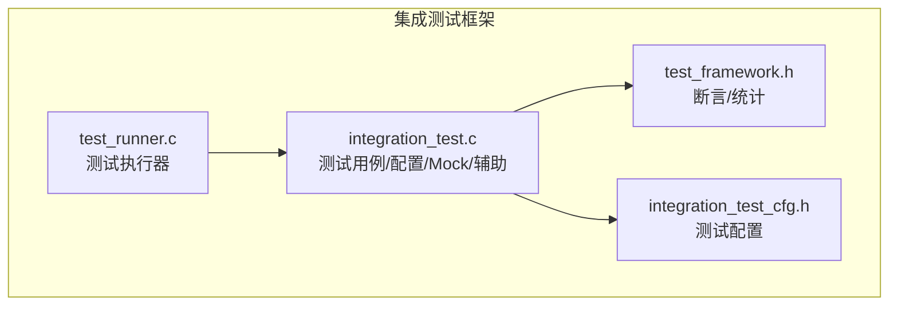
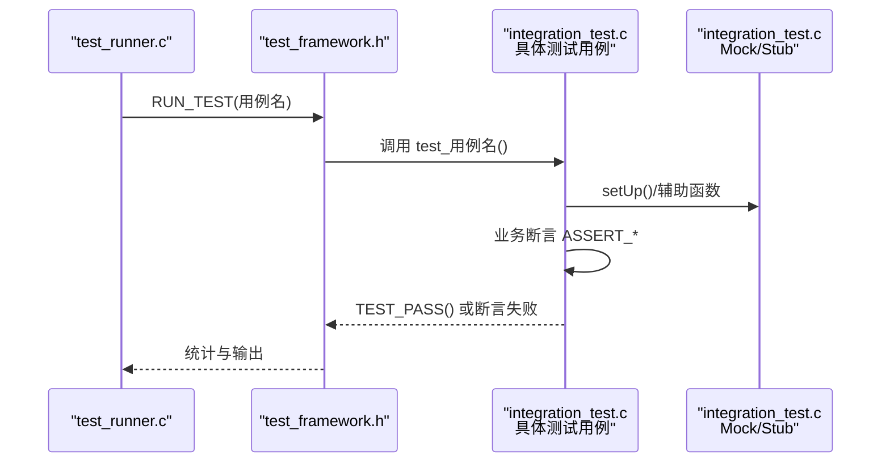
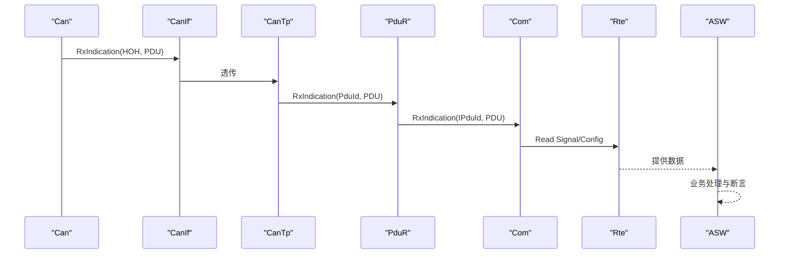
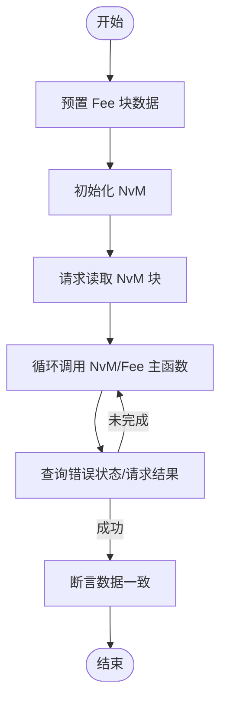
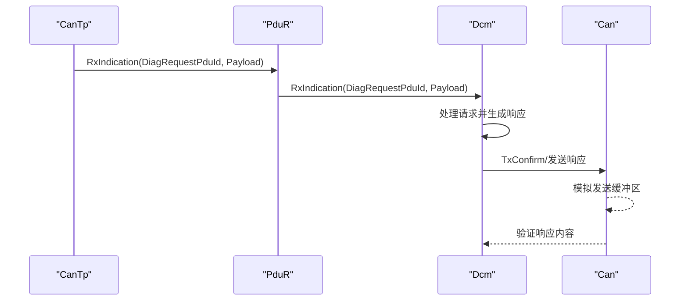
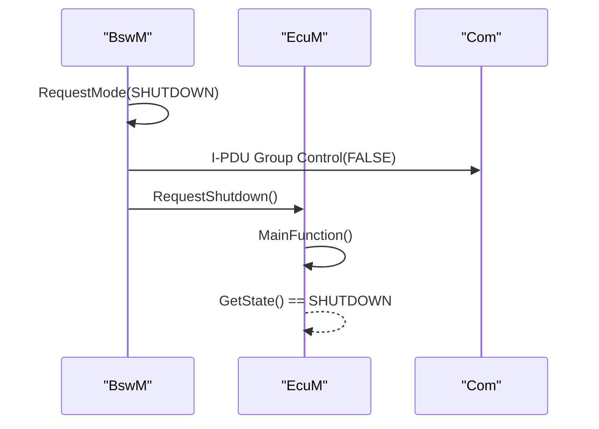
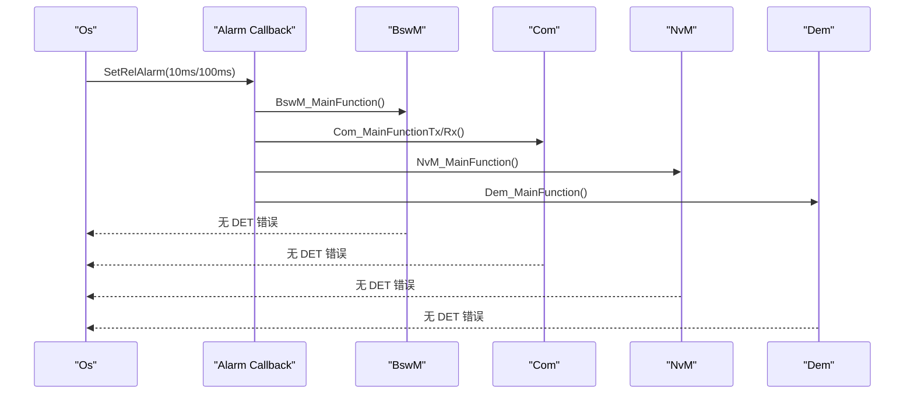
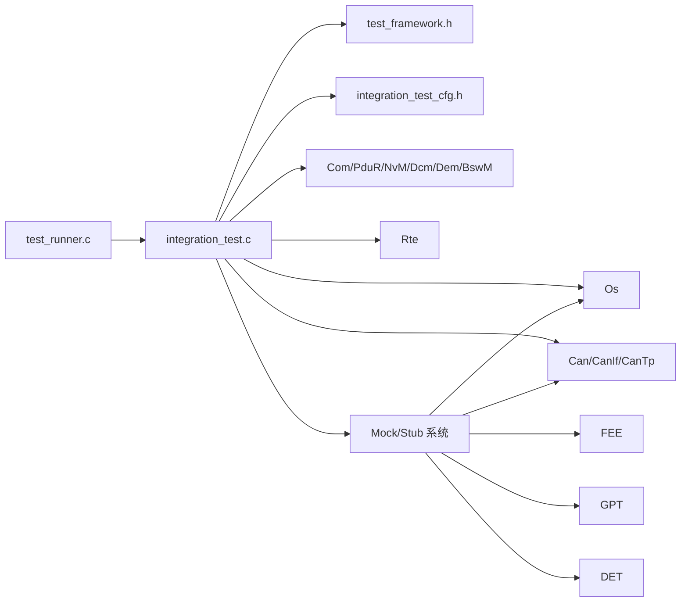

# 集成测试

<cite>
**本文引用的文件列表**
- [integration_test.c](file://tests/integration/bsw/integration_test.c)
- [test_runner.c](file://tests/integration/bsw/test_runner.c)
- [integration_test_cfg.h](file://tests/integration/integration_test_cfg.h)
- [test_framework.h](file://tests/unit/test_framework.h)
- [bsw_integration_verification.md](file://verification/bsw_integration_verification.md)
- [IntegrationTests_spec.md](file://openspec/changes/dev-integration-tests/specs/IntegrationTests_spec.md)
- [README.md](file://README.md)
</cite>

## 更新摘要
**变更内容**
- 新增完整的集成测试基础设施概述
- 更新测试用例设计与实现章节，包含五个完整的测试场景
- 增强Mock/Stub系统分析，涵盖所有模拟模块
- 完善测试执行框架与配置管理说明
- 添加与单元测试框架的协同工作机制

## 目录
1. [简介](#简介)
2. [项目结构](#项目结构)
3. [核心组件](#核心组件)
4. [架构总览](#架构总览)
5. [详细组件分析](#详细组件分析)
6. [依赖关系分析](#依赖关系分析)
7. [性能考量](#性能考量)
8. [故障排查指南](#故障排查指南)
9. [结论](#结论)
10. [附录](#附录)

## 简介
本文件面向集成测试，系统化阐述 YuleTech AutoSAR BSW 平台的跨层集成测试设计理念与实现策略。重点覆盖：
- **完整的测试基础设施**：新增的集成测试框架、测试运行器和配置管理系统
- **模块间接口测试**：验证 MCAL → ECUAL → Service → RTE 的端到端数据流与控制流
- **组件协作验证**：验证 BswM、EcuM、OS 报警调度等跨模块协同
- **系统级功能测试**：覆盖 CAN 信号解析、NvM 启动恢复、诊断请求处理、模式切换、OS 周期调度等典型场景
- **测试用例设计**：结合五个完整的测试用例，解释测试场景、数据准备与预期验证
- **执行框架**：test_runner.c 的测试执行流程与 test_framework.h 的断言与统计机制
- **配置管理**：integration_test_cfg.h 的宏配置与参数设置
- **环境与数据**：测试环境搭建、测试数据准备与结果分析方法
- **稳定性保障**：确保模块间正确交互与系统整体稳定性的策略

## 项目结构
集成测试位于 BSW 集成层，围绕"测试用例 + 执行器 + 框架 + 配置"的组织方式展开：
- **测试用例与模拟**：integration_test.c 包含测试用例、模块初始化、Mock/Stub、配置常量与辅助函数
- **执行器**：test_runner.c 聚合测试用例并驱动执行
- **断言与统计**：tests/unit/test_framework.h 提供断言宏与测试统计
- **配置**：integration_test_cfg.h 提供测试专用的宏配置与标识符定义



**图表来源**
- [integration_test.c:1-1229](file://tests/integration/bsw/integration_test.c#L1-L1229)
- [test_runner.c:1-40](file://tests/integration/bsw/test_runner.c#L1-L40)
- [test_framework.h:1-141](file://tests/unit/test_framework.h#L1-L141)
- [integration_test_cfg.h:1-101](file://tests/integration/integration_test_cfg.h#L1-L101)

**章节来源**
- [integration_test.c:1-1229](file://tests/integration/bsw/integration_test.c#L1-L1229)
- [test_runner.c:1-40](file://tests/integration/bsw/test_runner.c#L1-L40)
- [test_framework.h:1-141](file://tests/unit/test_framework.h#L1-L141)
- [integration_test_cfg.h:1-101](file://tests/integration/integration_test_cfg.h#L1-L101)

## 核心组件
- **完整的测试用例集合**：包含 CAN 信号端到端、NvM 启动恢复、诊断请求端到端、模式切换（BswM→EcuM）、OS 报警周期调度五类场景
- **执行器**：test_runner.c 通过 RUN_TEST 宏逐一调度测试用例
- **断言与统计**：test_framework.h 提供 ASSERT_* 宏与全局统计结构体，统一失败输出与结果汇总
- **配置与标识**：integration_test_cfg.h 定义测试专用的信号/IPDU/NVM/CanIf/OS 报警等标识与尺寸宏，便于裁剪与复用
- **Mock/Stub系统**：完整的模拟层覆盖所有外部依赖，确保测试的确定性和可重复性

**章节来源**
- [integration_test.c:1001-1224](file://tests/integration/bsw/integration_test.c#L1001-L1224)
- [test_runner.c:27-39](file://tests/integration/bsw/test_runner.c#L27-L39)
- [test_framework.h:18-138](file://tests/unit/test_framework.h#L18-L138)
- [integration_test_cfg.h:24-100](file://tests/integration/integration_test_cfg.h#L24-L100)

## 架构总览
集成测试覆盖从 MCAL 到 RTE 的完整栈，通过 Mock/Stub 与配置常量模拟真实硬件与外部模块，验证跨层协作与系统行为。

```mermaid
graph TB
subgraph "MCAL"
MCU["Mcu"]
PORT["Port"]
DIO["Dio"]
CAN["Can"]
SPI["Spi"]
GPT["Gpt"]
PWM["Pwm"]
ADC["Adc"]
WDG["Wdg"]
end
subgraph "ECUAL"
CANIF["CanIf"]
CANTP["CanTp"]
MEMIF["MemIf"]
FEE["Fee"]
EA["Ea"]
ETHIF["EthIf"]
LINIF["LinIf"]
IOHWAB["IoHwAb"]
end
subgraph "Service"
Pdru["PduR"]
COM["Com"]
NVM["NvM"]
DCM["Dcm"]
DEM["Dem"]
BSWM["BswM"]
end
subgraph "Integration"
ECUM["EcuM"]
end
subgraph "OS"
OS["Os"]
end
subgraph "RTE"
RTE["Rte"]
end
MCU --> PORT --> DIO --> CAN --> CANIF --> CANTP --> Pdru --> COM --> RTE
SPI --> MEMIF --> FEE --> NVM
EA --> NVM
ETHIF --> Pdru
LINIF --> Pdru
IOHWAB --> DIO
GPT --> OS
PWM --> DIO
ADC --> COM
WDG --> DIO
BSWM --> Pdru
DCM --> Pdru
DEM --> DCM
ECUM --> BSWM
```

**图表来源**
- [integration_test.c:24-66](file://tests/integration/bsw/integration_test.c#L24-L66)
- [integration_test.c:519-825](file://tests/integration/bsw/integration_test.c#L519-L825)

**章节来源**
- [integration_test.c:24-66](file://tests/integration/bsw/integration_test.c#L24-L66)
- [integration_test.c:519-825](file://tests/integration/bsw/integration_test.c#L519-L825)

## 详细组件分析

### 测试执行器与框架
- **test_runner.c**
  - 声明外部测试用例符号，并通过 RUN_TEST 宏逐个执行
  - 输出测试套件标题与各用例执行状态
- **test_framework.h**
  - 定义 TestStats 全局统计结构体，跟踪 total/passed/failed/current_suite
  - 提供 TEST_SUITE、TEST_CASE_DECLARE、RUN_TEST、ASSERT_*、TEST_PASS、TEST_MAIN_BEGIN/END 等宏，统一断言与统计逻辑
  - TEST_MAIN_BEGIN/END 封装 main 函数，打印测试结果并返回退出码



**图表来源**
- [test_runner.c:18-39](file://tests/integration/bsw/test_runner.c#L18-L39)
- [test_framework.h:39-138](file://tests/unit/test_framework.h#L39-L138)
- [integration_test.c:910-961](file://tests/integration/bsw/integration_test.c#L910-L961)

**章节来源**
- [test_runner.c:18-39](file://tests/integration/bsw/test_runner.c#L18-L39)
- [test_framework.h:18-138](file://tests/unit/test_framework.h#L18-L138)

### 测试配置与标识
- **integration_test_cfg.h**
  - 定义测试专用的 COM/IPDU/NvM/CanIf/OS 报警等标识与尺寸宏，便于裁剪与复用
  - 定义测试数据结构（如引擎配置）以便在测试中注入与验证
  - 提供可配置的宏定义，支持不同测试场景的灵活调整

**章节来源**
- [integration_test_cfg.h:24-100](file://tests/integration/integration_test_cfg.h#L24-L100)

### 测试用例设计与实现

#### 用例一：CAN 信号端到端
- **场景定义**
  - 通过 CanIf 接收 CAN 帧，经 Com 解析后由 RTE 提供给 ASW 组件
- **数据准备**
  - 构造标准帧数据（包含发动机转速、车速、节气门位置），模拟接收路径
- **预期验证**
  - Com 接收信号成功；RTE 读取接口返回有效数据；最终断言数值匹配



**图表来源**
- [integration_test.c:1001-1036](file://tests/integration/bsw/integration_test.c#L1001-L1036)

**章节来源**
- [integration_test.c:1001-1036](file://tests/integration/bsw/integration_test.c#L1001-L1036)

#### 用例二：NvM 启动恢复
- **场景定义**
  - 在 Fee 模拟存储中预置数据，启动 NvM 后读取并校验
- **数据准备**
  - 预置引擎配置结构体到 Fee 模拟块
- **预期验证**
  - NvM 读取成功；数据一致性断言；RTE 读取接口返回有效数据



**图表来源**
- [integration_test.c:1038-1095](file://tests/integration/bsw/integration_test.c#L1038-L1095)

**章节来源**
- [integration_test.c:1038-1095](file://tests/integration/bsw/integration_test.c#L1038-L1095)

#### 用例三：诊断请求端到端
- **场景定义**
  - 通过 CanTp/PduR/Dcm 处理 UDS 请求并生成响应
- **数据准备**
  - 构造 UDS 请求（ReadDataByIdentifier），模拟 CanTp 解析后的负载
- **预期验证**
  - 诊断响应出现在 Can 模拟发送缓冲区，断言响应首字节与 DID



**图表来源**
- [integration_test.c:1097-1153](file://tests/integration/bsw/integration_test.c#L1097-L1153)

**章节来源**
- [integration_test.c:1097-1153](file://tests/integration/bsw/integration_test.c#L1097-L1153)

#### 用例四：模式切换（BswM→EcuM）
- **场景定义**
  - BswM 根据规则仲裁模式，触发 Com I-PDU 停止，随后 EcuM 进入 Shutdown
- **数据准备**
  - 初始化 BswM 与 EcuM；准备 Com I-PDU 组向量
- **预期验证**
  - 模式从 RUN 切换至 SHUTDOWN；EcuM 状态为 SHUTDOWN；无 DET 错误



**图表来源**
- [integration_test.c:1155-1188](file://tests/integration/bsw/integration_test.c#L1155-L1188)

**章节来源**
- [integration_test.c:1155-1188](file://tests/integration/bsw/integration_test.c#L1155-L1188)

#### 用例五：OS 报警周期调度
- **场景定义**
  - 设置多个 OS 报警，模拟时间推进并通过回调触发各模块主函数
- **数据准备**
  - 初始化 OS 报警（BswM/Com/NvM/Dem 不同周期）
- **预期验证**
  - 报警激活；回调触发后无 DET 错误



**图表来源**
- [integration_test.c:1190-1224](file://tests/integration/bsw/integration_test.c#L1190-L1224)

**章节来源**
- [integration_test.c:1190-1224](file://tests/integration/bsw/integration_test.c#L1190-L1224)

### 测试辅助与 Mock/Stub
- **Mock/Stub 覆盖范围**
  - **DET**：Det_ReportError 返回值与计数
  - **CAN**：Can_Init/SetControllerMode/Write/主函数等
  - **FEE**：Fee_Init/Read/Write/Invalidate/Erase/MainFunction 等
  - **GPT**：Gpt_Init/StartTimer/StopTimer/GetTimeElapsed 等
  - **OS**：StartOS/ShutdownOS/SetRelAlarm/CancelAlarm/Os_Callback_Alarm 等
  - **MemIf**：MemIf_Init 等
  - **DCM**：RxIndication/TxConfirmation 跟踪
  - **BswM**：模式请求计数与最后请求模式跟踪
  - **Com**：TxConfirmation 跟踪
  - **PduR**：Tx 调用次数与最后 PduId 跟踪
  - **RTE**：Rte_Read_* 接口模拟数据返回
- **辅助函数**
  - **reset_mocks**：重置所有跟踪变量
  - **setUp/tearDown**：按层初始化与反初始化
  - **simulate_can_rx**：模拟 CAN 接收路径
  - **fee_mock_preset_block**：预置 Fee 块数据
  - **gpt_mock_advance_time**：推进 GPT 时间并触发回调

**章节来源**
- [integration_test.c:85-961](file://tests/integration/bsw/integration_test.c#L85-L961)

## 依赖关系分析
- **模块耦合**
  - 测试用例对各层模块存在直接依赖（初始化、主函数、配置常量）
  - 框架层与用例层松耦合，通过 RUN_TEST 与 ASSERT_* 宏连接
- **外部依赖**
  - OS 报警回调依赖 GPT 时间推进；CanTp/PduR/Dcm 依赖 CanIf 配置
- **配置依赖**
  - integration_test_cfg.h 提供测试专用标识与尺寸，避免与生产配置冲突
- **Mock 依赖**
  - 所有硬件依赖通过 Mock 层替换，确保测试的确定性



**图表来源**
- [test_runner.c:18-39](file://tests/integration/bsw/test_runner.c#L18-L39)
- [integration_test.c:12-71](file://tests/integration/bsw/integration_test.c#L12-L71)
- [integration_test_cfg.h:18-100](file://tests/integration/integration_test_cfg.h#L18-L100)
- [test_framework.h:15-141](file://tests/unit/test_framework.h#L15-L141)

**章节来源**
- [test_runner.c:18-39](file://tests/integration/bsw/test_runner.c#L18-L39)
- [integration_test.c:12-71](file://tests/integration/bsw/integration_test.c#L12-L71)
- [integration_test_cfg.h:18-100](file://tests/integration/integration_test_cfg.h#L18-L100)
- [test_framework.h:15-141](file://tests/unit/test_framework.h#L15-L141)

## 性能考量
- **测试执行效率**
  - 使用最小化配置宏（如 COM/NvM/CanIf 数量）降低测试开销
  - 通过主函数循环次数控制（如 NvM 主函数轮询）平衡精度与耗时
- **模拟层开销**
  - Mock/Stub 仅覆盖关键路径，避免冗余逻辑
  - OS 报警回调按需触发，减少不必要的主函数调用
- **断言与统计**
  - 断言失败即短路返回，避免无效计算
- **Mock 系统优化**
  - 虚拟内存数组替代真实硬件访问
  - 手动时间推进避免实时依赖

## 故障排查指南
- **常见问题定位**
  - **初始化顺序**：必须先初始化 MCAL，再 ECUAL，再 Service，最后 OS/RTE
  - **CanIf 模式**：发送前需设置控制器为 STARTED 并 PduMode 为 ONLINE
  - **NvM/Fee**：读取前需预置 Fee 块数据或等待写入完成
  - **OS 报警**：确认 SetRelAlarm 成功且回调被触发
- **DET 错误**
  - 若出现 DET 错误，检查 mock_det_report_error_called 是否非零，并核对模块/实例/API/Error 参数
- **数据不一致**
  - 检查信号打包/解包位序（小端/大端）、位宽与偏移是否与配置一致
- **回调未触发**
  - 确认 GPT 时间推进与 Os_Callback_Alarm 调用时机
- **Mock 状态异常**
  - 检查 reset_mocks 是否在每个测试开始前调用
  - 验证 Mock 变量的初始化状态

**章节来源**
- [integration_test.c:910-961](file://tests/integration/bsw/integration_test.c#L910-L961)
- [integration_test.c:164-172](file://tests/integration/bsw/integration_test.c#L164-L172)

## 结论
本集成测试体系通过清晰的测试用例设计、完善的执行框架与配置管理，实现了对 BSW 跨层协作与系统级功能的全面验证。借助 Mock/Stub 与最小化配置，测试具备高可维护性与可扩展性，能够持续保障模块间正确交互与系统整体稳定性。五个完整的测试用例覆盖了从硬件接口到系统级功能的关键场景，为项目的质量保证提供了坚实基础。

## 附录

### 测试环境搭建与运行
- **环境要求**
  - 支持 CMake 构建与 GCC 工具链（参考项目根目录 README）
  - Python 3.9+（用于代码生成工具）
- **构建与运行**
  - 在构建目录执行 make test 即可运行集成测试套件
  - 可通过修改 integration_test_cfg.h 中的宏定义调整测试配置
- **输出解读**
  - 控制台输出包含每个测试用例的 PASS/FAIL 与统计摘要
  - 详细的测试结果统计信息

**章节来源**
- [README.md:124-132](file://README.md#L124-L132)
- [IntegrationTests_spec.md:169-231](file://openspec/changes/dev-integration-tests/specs/IntegrationTests_spec.md#L169-L231)

### 测试数据管理
- **预置数据**
  - 使用 fee_mock_preset_block 预置 NvM 块数据
  - 使用 simulate_can_rx 构造 CAN 帧数据
- **追踪与验证**
  - 通过跟踪变量（如 dcmMock_TxConfirmationCalled、pdurMock_TxCalled 等）验证消息路径
  - 使用 ASSERT_* 宏进行数值与指针断言
- **Mock 数据管理**
  - 虚拟内存数组模拟真实硬件存储
  - 手动时间推进机制替代实时依赖

**章节来源**
- [integration_test.c:981-995](file://tests/integration/bsw/integration_test.c#L981-L995)
- [integration_test.c:133-160](file://tests/integration/bsw/integration_test.c#L133-L160)
- [test_framework.h:46-120](file://tests/unit/test_framework.h#L46-L120)

### 配置文件使用方法
- **integration_test_cfg.h**
  - 修改 COM/NvM/CanIf/OS 报警等宏以适配不同测试场景
  - 自定义信号/IPDU/NVM 块标识，确保与实际配置一致
  - 调整测试数据结构大小以适应不同的测试需求
- **生产配置隔离**
  - 测试配置与生产配置通过独立头文件与宏区分，避免相互影响
  - 使用条件编译确保测试代码不影响生产环境

**章节来源**
- [integration_test_cfg.h:24-100](file://tests/integration/integration_test_cfg.h#L24-L100)

### 验证状态与质量
- **集成验证报告**
  - 项目已通过 BSW 各层集成验证，涵盖 MCAL、ECUAL、Service、OS、RTE、ASW 六个层级
  - 集成测试框架作为质量保证的重要组成部分
- **质量基线**
  - 符合 AutoSAR 4.x 标准，支持 DET 错误检测与 MemMap 内存分区
  - 通过 Mock/Stub 系统确保测试的确定性和可重复性
- **测试覆盖率**
  - 覆盖所有主要模块的初始化、数据流和错误处理路径
  - 提供完整的系统级功能验证

**章节来源**
- [bsw_integration_verification.md:1-193](file://verification/bsw_integration_verification.md#L1-L193)
- [IntegrationTests_spec.md:159-168](file://openspec/changes/dev-integration-tests/specs/IntegrationTests_spec.md#L159-L168)