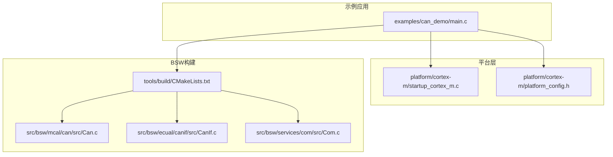
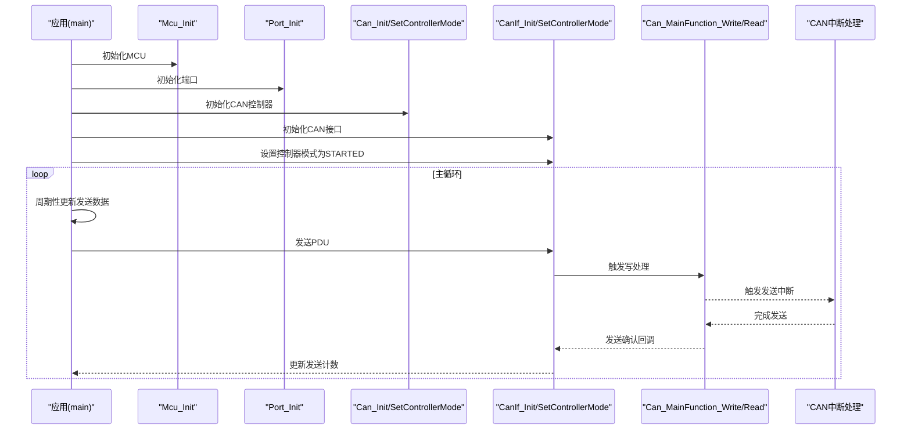
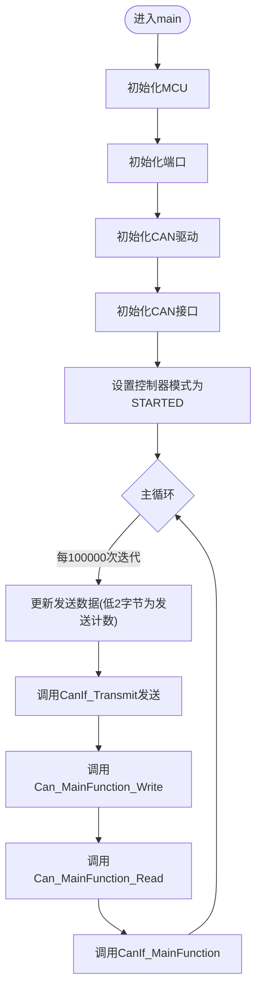
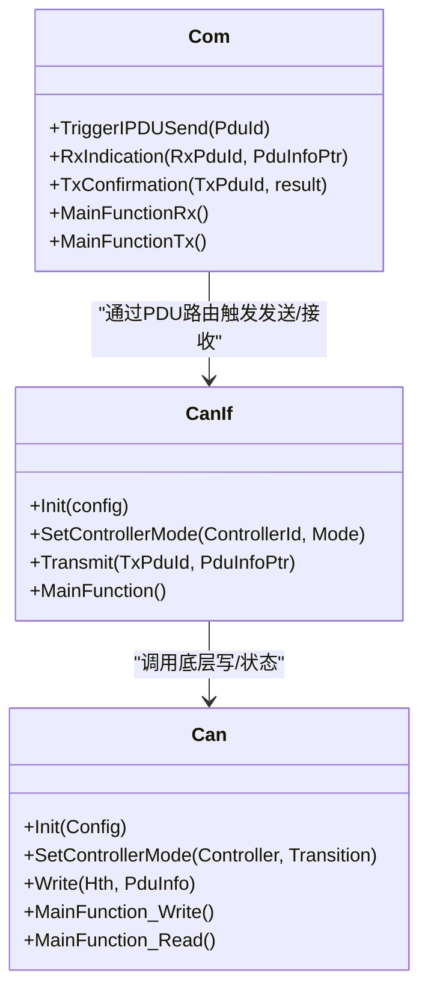
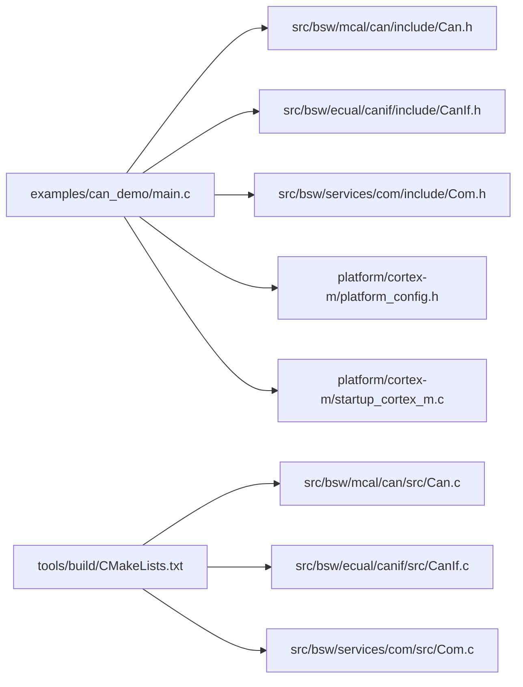

# CAN通信示例

<cite>
**本文引用的文件**
- [examples/can_demo/main.c](file://examples/can_demo/main.c)
- [examples/README.md](file://examples/README.md)
- [tools/build/CMakeLists.txt](file://tools/build/CMakeLists.txt)
- [config/bsw_config.json](file://config/bsw_config.json)
- [platform/cortex-m/platform_config.h](file://platform/cortex-m/platform_config.h)
- [platform/cortex-m/startup_cortex_m.c](file://platform/cortex-m/startup_cortex_m.c)
- [src/bsw/mcal/can/include/Can.h](file://src/bsw/mcal/can/include/Can.h)
- [src/bsw/ecual/canif/include/CanIf.h](file://src/bsw/ecual/canif/include/CanIf.h)
- [src/bsw/services/com/include/Com.h](file://src/bsw/services/com/include/Com.h)
- [src/bsw/config/templates/Can_Cfg.h](file://src/bsw/config/templates/Can_Cfg.h)
- [src/bsw/config/templates/CanIf_Cfg.h](file://src/bsw/config/templates/CanIf_Cfg.h)
- [generated/Can_Cfg.h](file://generated/Can_Cfg.h)
</cite>

## 目录
1. [简介](#简介)
2. [项目结构](#项目结构)
3. [核心组件](#核心组件)
4. [架构总览](#架构总览)
5. [详细组件分析](#详细组件分析)
6. [依赖关系分析](#依赖关系分析)
7. [性能考虑](#性能考虑)
8. [故障排除指南](#故障排除指南)
9. [结论](#结论)
10. [附录](#附录)

## 简介
本教程面向希望在基于AutoSAR BSW的嵌入式平台上实现CAN总线通信的开发者。示例展示了从MCAL层的CAN驱动到ECUAL层的CAN接口，再到服务层的通信模块的完整调用链路，涵盖CAN控制器初始化、消息发送、接收与回显等关键流程。文档将逐段解析示例代码的主流程与回调机制，说明配置参数（如波特率、控制器数量）对系统行为的影响，并提供构建、下载烧录、调试以及常见问题排查的实操指南。

## 项目结构
示例位于 examples/can_demo，采用CMake构建系统，通过工具链集成BSW各层级源码。平台层提供Cortex-M通用启动与配置，MCAL层提供CAN驱动接口，ECUAL层提供CAN接口抽象，服务层提供通信路由与信号处理。

**图表来源**
- [examples/can_demo/main.c:63-118](file://examples/can_demo/main.c#L63-L118)
- [platform/cortex-m/startup_cortex_m.c:243-266](file://platform/cortex-m/startup_cortex_m.c#L243-L266)
- [tools/build/CMakeLists.txt:42-78](file://tools/build/CMakeLists.txt#L42-L78)

**章节来源**
- [examples/README.md:30-55](file://examples/README.md#L30-L55)
- [tools/build/CMakeLists.txt:1-107](file://tools/build/CMakeLists.txt#L1-L107)

## 核心组件
- 应用入口与控制流：示例在 main 中完成MCU、端口、CAN、CAN接口的初始化，并设置控制器模式为“已启动”。主循环周期性更新发送数据并通过CAN接口发送，同时调用各层主函数进行后台处理。
- 回调与数据路径：接收回调中验证ID后复制数据，修改首字节并回发；发送确认回调用于统计发送计数。
- 配置参数：默认波特率为500kbps，控制器数量为2；可通过配置模板与生成配置调整。

**章节来源**
- [examples/can_demo/main.c:37-58](file://examples/can_demo/main.c#L37-L58)
- [examples/can_demo/main.c:63-118](file://examples/can_demo/main.c#L63-L118)
- [generated/Can_Cfg.h:11-12](file://generated/Can_Cfg.h#L11-L12)
- [src/bsw/config/templates/Can_Cfg.h:37-42](file://src/bsw/config/templates/Can_Cfg.h#L37-L42)

## 架构总览
下图展示了示例应用与各层之间的交互关系，以及典型的消息发送与接收流程。

**图表来源**
- [examples/can_demo/main.c:65-90](file://examples/can_demo/main.c#L65-L90)
- [examples/can_demo/main.c:93-115](file://examples/can_demo/main.c#L93-L115)
- [src/bsw/mcal/can/include/Can.h:235-241](file://src/bsw/mcal/can/include/Can.h#L235-L241)
- [platform/cortex-m/startup_cortex_m.c:175-178](file://platform/cortex-m/startup_cortex_m.c#L175-L178)

## 详细组件分析

### 应用主流程与回调
- 初始化阶段：依次调用MCU、端口、CAN驱动、CAN接口初始化；随后设置控制器模式为“已启动”，使能中断处理。
- 主循环：以固定周期更新发送缓冲区的前两个字节作为计数器，调用CAN接口发送；同时调用Can、CanIf的主函数进行后台处理。
- 接收回调：当收到目标ID的消息时，复制数据到接收缓冲区，修改首字节后立即回发；发送确认回调用于统计发送次数。

**图表来源**
- [examples/can_demo/main.c:63-118](file://examples/can_demo/main.c#L63-L118)

**章节来源**
- [examples/can_demo/main.c:63-118](file://examples/can_demo/main.c#L63-L118)

### CAN接口与驱动接口
- CAN接口（CanIf）：提供统一的PDU发送/接收接口，支持设置控制器模式、读取/设置波特率、动态设置发送ID等；内部维护HRH/HTH与PDU配置映射。
- CAN驱动（Can）：提供底层硬件对象管理、控制器状态切换、主函数（写/读/总线错误/唤醒）等；支持多控制器与多波特率配置。

**图表来源**
- [src/bsw/ecual/canif/include/CanIf.h:276-305](file://src/bsw/ecual/canif/include/CanIf.h#L276-L305)
- [src/bsw/mcal/can/include/Can.h:197-241](file://src/bsw/mcal/can/include/Can.h#L197-L241)
- [src/bsw/services/com/include/Com.h:429-463](file://src/bsw/services/com/include/Com.h#L429-L463)

**章节来源**
- [src/bsw/ecual/canif/include/CanIf.h:268-400](file://src/bsw/ecual/canif/include/CanIf.h#L268-L400)
- [src/bsw/mcal/can/include/Can.h:188-266](file://src/bsw/mcal/can/include/Can.h#L188-L266)
- [src/bsw/services/com/include/Com.h:238-501](file://src/bsw/services/com/include/Com.h#L238-L501)

### 配置参数与消息ID
- 消息ID：发送ID为0x100，接收ID为0x200；接收回调仅对匹配ID的数据进行处理与回显。
- 数据缓冲区：发送缓冲区大小为8字节，接收缓冲区同样为8字节；发送计数器与接收计数器分别记录发送/接收次数。
- 波特率与控制器：默认波特率为500kbps，控制器数量为2；可通过配置模板与生成配置进行调整。

**章节来源**
- [examples/can_demo/main.c:22-28](file://examples/can_demo/main.c#L22-L28)
- [examples/can_demo/main.c:37-58](file://examples/can_demo/main.c#L37-L58)
- [generated/Can_Cfg.h:11-12](file://generated/Can_Cfg.h#L11-L12)
- [src/bsw/config/templates/Can_Cfg.h:37-42](file://src/bsw/config/templates/Can_Cfg.h#L37-L42)

## 依赖关系分析
示例应用直接依赖MCAL层的Can与CanIf，以及服务层的Com；平台层提供启动向量与中断处理。构建系统通过CMake聚合所有BSW源码并编译为静态库。

**图表来源**
- [examples/can_demo/main.c:15-21](file://examples/can_demo/main.c#L15-L21)
- [tools/build/CMakeLists.txt:42-78](file://tools/build/CMakeLists.txt#L42-L78)

**章节来源**
- [tools/build/CMakeLists.txt:14-40](file://tools/build/CMakeLists.txt#L14-L40)
- [platform/cortex-m/startup_cortex_m.c:139-238](file://platform/cortex-m/startup_cortex_m.c#L139-L238)

## 性能考虑
- 主函数调用频率：示例在主循环中调用Can、CanIf的主函数，确保后台处理及时执行；在高负载场景下可评估调用频率与中断优先级。
- 发送周期：当前发送周期为约100000次迭代更新一次数据，可根据实际需求调整以平衡CPU占用与通信速率。
- 缓冲区管理：发送/接收缓冲区均为8字节，满足标准帧长度；扩展时需确保PDU长度与硬件对象配置一致。

[本节为通用指导，无需列出具体文件来源]

## 故障排除指南
- 无法收发消息
  - 检查CAN控制器是否正确初始化且模式为“已启动”。
  - 确认波特率配置一致（示例默认500kbps），并在生成配置中核对。
  - 核对硬件连接：确保CAN收发器供电与终端电阻正确接入。
- 波特率错误
  - 在配置模板与生成配置中统一波特率值，避免运行时切换导致不一致。
  - 若使用外部工具校准，确保分频参数与采样点设置符合物理层规范。
- 终端电阻与硬件连接
  - 总线两端应各接120Ω终端电阻；短距离通信可考虑使用差分阻抗匹配。
  - 检查CAN_H/CAN_L连线与地线完整性，避免共模干扰。
- 调试建议
  - 使用GDB加载目标镜像，设置断点观察CanIf回调与发送确认回调。
  - 通过串口或日志输出发送/接收计数变化，验证回显逻辑。

**章节来源**
- [examples/README.md:149-160](file://examples/README.md#L149-L160)
- [generated/Can_Cfg.h:11](file://generated/Can_Cfg.h#L11-L11)
- [src/bsw/config/templates/Can_Cfg.h:37-42](file://src/bsw/config/templates/Can_Cfg.h#L37-L42)

## 结论
该示例清晰展示了AutoSAR BSW在CAN通信中的分层架构与调用流程：应用层负责业务逻辑与定时，接口层屏蔽硬件差异，驱动层负责底层寄存器与中断，服务层提供信号与PDU路由。通过合理的配置参数与严格的初始化顺序，可稳定实现消息的发送、接收与回显。建议在实际项目中结合硬件手册完善引脚配置与电源设计，并根据需求扩展至更复杂的通信场景。

[本节为总结性内容，无需列出具体文件来源]

## 附录

### 构建与下载烧录步骤
- 环境准备：安装ARM GCC工具链与CMake 3.20+。
- 构建命令：
  - 进入示例目录并创建构建目录，执行CMake与Make。
- 下载烧录：在构建目录执行“make flash”进行烧录。
- 调试：使用GDB连接调试服务器，加载目标镜像并设置断点。

**章节来源**
- [examples/README.md:64-83](file://examples/README.md#L64-L83)

### 扩展实现建议
- 多ID过滤：利用CAN接口的软件过滤或硬件滤光配置，支持多ID接收。
- 信号映射：通过COM模块将信号映射到I-PDU，实现更高层的抽象与复用。
- 错误处理：在回调中增加错误计数与状态上报，便于诊断。
- 功耗优化：在空闲时段降低系统频率或进入睡眠模式，减少CAN控制器唤醒次数。

[本节为概念性建议，无需列出具体文件来源]