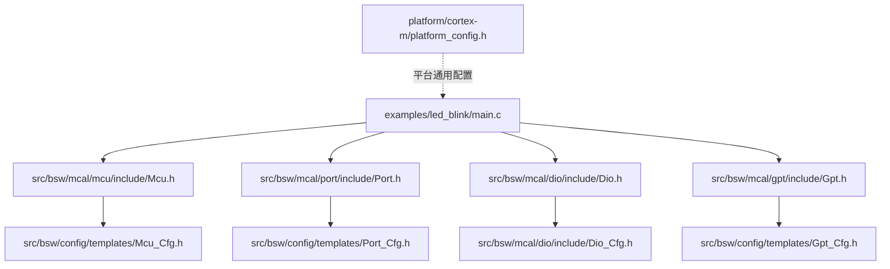
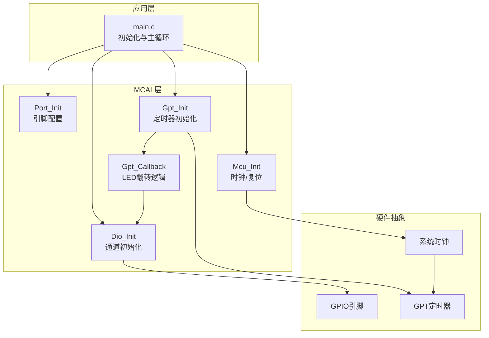
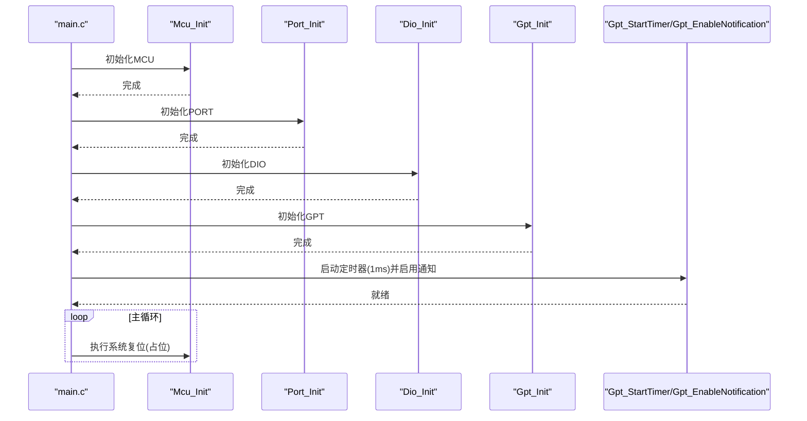
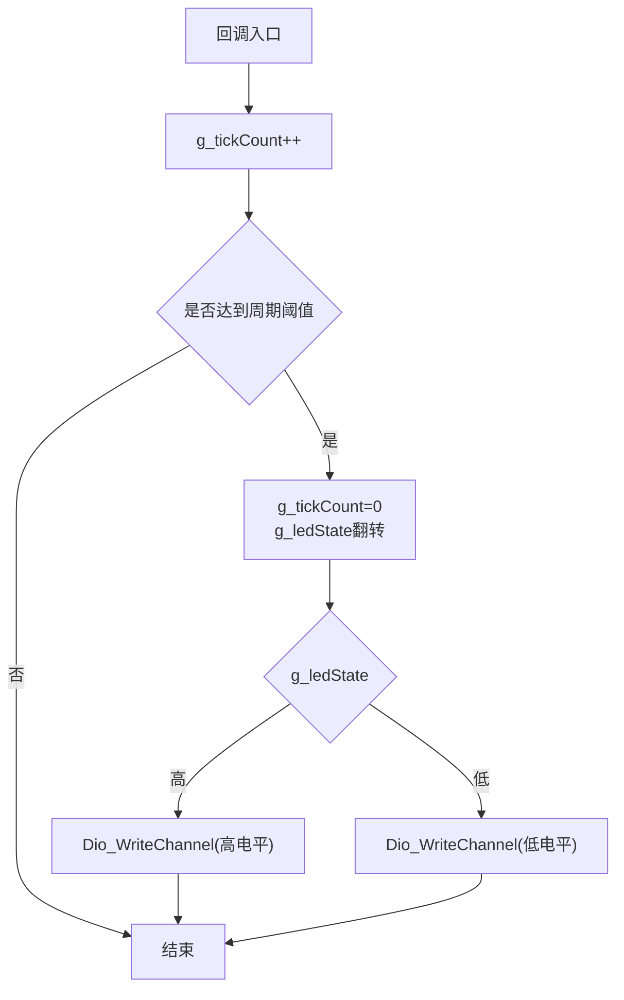
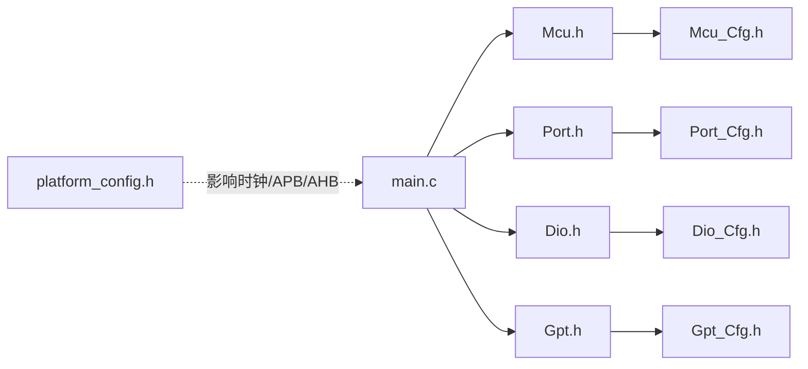
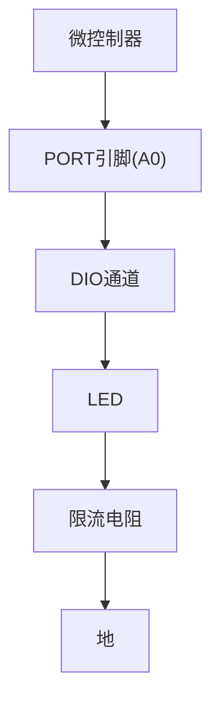

# LED闪烁示例

<cite>
**本文引用的文件**
- [examples/led_blink/main.c](file://examples/led_blink/main.c)
- [src/bsw/mcal/mcu/include/Mcu.h](file://src/bsw/mcal/mcu/include/Mcu.h)
- [src/bsw/mcal/port/include/Port.h](file://src/bsw/mcal/port/include/Port.h)
- [src/bsw/mcal/dio/include/Dio.h](file://src/bsw/mcal/dio/include/Dio.h)
- [src/bsw/mcal/gpt/include/Gpt.h](file://src/bsw/mcal/gpt/include/Gpt.h)
- [src/bsw/config/templates/Mcu_Cfg.h](file://src/bsw/config/templates/Mcu_Cfg.h)
- [src/bsw/config/templates/Port_Cfg.h](file://src/bsw/config/templates/Port_Cfg.h)
- [src/bsw/config/templates/Gpt_Cfg.h](file://src/bsw/config/templates/Gpt_Cfg.h)
- [src/bsw/mcal/dio/include/Dio_Cfg.h](file://src/bsw/mcal/dio/include/Dio_Cfg.h)
- [platform/cortex-m/platform_config.h](file://platform/cortex-m/platform_config.h)
- [examples/README.md](file://examples/README.md)
</cite>

## 目录
1. [简介](#简介)
2. [项目结构](#项目结构)
3. [核心组件](#核心组件)
4. [架构总览](#架构总览)
5. [详细组件分析](#详细组件分析)
6. [依赖关系分析](#依赖关系分析)
7. [性能考虑](#性能考虑)
8. [故障排查指南](#故障排查指南)
9. [结论](#结论)
10. [附录](#附录)

## 简介
本教程围绕LED闪烁示例展开，系统讲解从MCU初始化、端口配置、DIO通道控制到GPT定时器回调的完整实现流程。通过分析示例工程中的main.c以及各驱动层接口，帮助读者理解AutoSAR BSW在Cortex-M平台上的典型应用模式，并提供可移植的修改建议（如更换LED引脚、调整闪烁频率）与调试方法。

## 项目结构
LED闪烁示例位于examples/led_blink目录中，核心入口为main.c；同时涉及MCAL层的Mcu、Port、Dio、Gpt四个驱动模块及其配置模板。

**图表来源**
- [examples/led_blink/main.c:61-99](file://examples/led_blink/main.c#L61-L99)
- [src/bsw/mcal/mcu/include/Mcu.h:148](file://src/bsw/mcal/mcu/include/Mcu.h#L148)
- [src/bsw/mcal/port/include/Port.h:119](file://src/bsw/mcal/port/include/Port.h#L119)
- [src/bsw/mcal/dio/include/Dio.h:112](file://src/bsw/mcal/dio/include/Dio.h#L112)
- [src/bsw/mcal/gpt/include/Gpt.h:178](file://src/bsw/mcal/gpt/include/Gpt.h#L178)
- [src/bsw/config/templates/Mcu_Cfg.h:63-66](file://src/bsw/config/templates/Mcu_Cfg.h#L63-L66)
- [src/bsw/config/templates/Port_Cfg.h:28-29](file://src/bsw/config/templates/Port_Cfg.h#L28-L29)
- [src/bsw/config/templates/Gpt_Cfg.h:66](file://src/bsw/config/templates/Gpt_Cfg.h#L66)
- [src/bsw/mcal/dio/include/Dio_Cfg.h:29-36](file://src/bsw/mcal/dio/include/Dio_Cfg.h#L29-L36)
- [platform/cortex-m/platform_config.h:102-119](file://platform/cortex-m/platform_config.h#L102-L119)

**章节来源**
- [examples/led_blink/main.c:1-100](file://examples/led_blink/main.c#L1-L100)
- [examples/README.md:7-29](file://examples/README.md#L7-L29)

## 核心组件
- MCU驱动：负责系统时钟、复位管理等底层初始化。
- PORT驱动：配置引脚方向、模式、上下拉等属性。
- DIO驱动：提供对通道/端口的读写能力，用于直接控制LED。
- GPT驱动：提供通用定时器功能，支持周期性通知回调。

上述组件在示例中以顺序初始化的方式协同工作：先完成MCU时钟与系统运行环境准备，再配置端口与DIO，最后启动GPT定时器并启用通知回调以实现LED闪烁。

**章节来源**
- [examples/led_blink/main.c:63-89](file://examples/led_blink/main.c#L63-L89)
- [src/bsw/mcal/mcu/include/Mcu.h:148](file://src/bsw/mcal/mcu/include/Mcu.h#L148)
- [src/bsw/mcal/port/include/Port.h:119](file://src/bsw/mcal/port/include/Port.h#L119)
- [src/bsw/mcal/dio/include/Dio.h:112](file://src/bsw/mcal/dio/include/Dio.h#L112)
- [src/bsw/mcal/gpt/include/Gpt.h:178](file://src/bsw/mcal/gpt/include/Gpt.h#L178)

## 架构总览
下图展示了LED闪烁示例的软件架构与数据流：MCU初始化为系统提供时钟基础；PORT/DIO负责GPIO引脚的物理控制；GPT提供毫秒级节拍并通过回调切换LED状态。

**图表来源**
- [examples/led_blink/main.c:61-99](file://examples/led_blink/main.c#L61-L99)
- [src/bsw/mcal/mcu/include/Mcu.h:148](file://src/bsw/mcal/mcu/include/Mcu.h#L148)
- [src/bsw/mcal/port/include/Port.h:119](file://src/bsw/mcal/port/include/Port.h#L119)
- [src/bsw/mcal/dio/include/Dio.h:112](file://src/bsw/mcal/dio/include/Dio.h#L112)
- [src/bsw/mcal/gpt/include/Gpt.h:178](file://src/bsw/mcal/gpt/include/Gpt.h#L178)

## 详细组件分析

### 主函数与初始化流程
- 初始化顺序与职责
  - MCU初始化：为后续外设提供稳定的时钟与系统环境。
  - PORT初始化：根据配置设置引脚方向与模式（示例中传入空配置，表示使用预编译配置）。
  - DIO初始化：建立通道映射与访问接口。
  - GPT初始化：加载通道配置，准备定时器资源。
  - 启动定时器并启用通知：以1ms为节拍触发回调，实现LED闪烁。
  - 主循环：执行系统复位以进入安全状态或作为后台任务占位。

- 关键API与参数说明
  - Mcu_Init：传入配置结构指针，示例中使用NULL以采用默认配置。
  - Port_Init：同样传入空配置，实际引脚属性由Port_Cfg.h定义。
  - Dio_Init：无外部配置参数。
  - Gpt_Init：传入空配置，实际通道参数由Gpt_Cfg.h定义。
  - Gpt_StartTimer：启动通道0，周期为1000个tick（对应1ms）。
  - Gpt_EnableNotification：启用该通道的通知回调。

- 变量与状态
  - g_tickCount：自回调触发以来的计数，用于累计达到目标周期。
  - g_ledState：LED当前状态（高电平/低电平），用于翻转控制。

**图表来源**
- [examples/led_blink/main.c:61-99](file://examples/led_blink/main.c#L61-L99)
- [src/bsw/mcal/mcu/include/Mcu.h:148](file://src/bsw/mcal/mcu/include/Mcu.h#L148)
- [src/bsw/mcal/port/include/Port.h:119](file://src/bsw/mcal/port/include/Port.h#L119)
- [src/bsw/mcal/dio/include/Dio.h:112](file://src/bsw/mcal/dio/include/Dio.h#L112)
- [src/bsw/mcal/gpt/include/Gpt.h:178](file://src/bsw/mcal/gpt/include/Gpt.h#L178)

**章节来源**
- [examples/led_blink/main.c:61-99](file://examples/led_blink/main.c#L61-L99)

### GPT回调与LED翻转逻辑
- 回调触发条件：GPT通道0每1ms产生一次中断通知。
- 计数与翻转：g_tickCount递增，当达到BLINK_PERIOD_MS（示例中为500）时清零并翻转g_ledState。
- 输出控制：根据g_ledState的值调用Dio_WriteChannel写入高/低电平。

**图表来源**
- [examples/led_blink/main.c:37-56](file://examples/led_blink/main.c#L37-L56)
- [src/bsw/mcal/dio/include/Dio.h:112](file://src/bsw/mcal/dio/include/Dio.h#L112)

**章节来源**
- [examples/led_blink/main.c:37-56](file://examples/led_blink/main.c#L37-L56)

### 配置要点与参数映射
- LED引脚定义
  - LED_PORT、LED_CHANNEL、LED_PIN分别来自Dio_Cfg.h中的端口与通道编号。
  - 默认配置指向Port A的第0号引脚（A0）。
- 闪烁周期
  - BLINK_PERIOD_MS为周期（单位：毫秒），示例中为500ms，即1Hz闪烁。
- GPT通道与时钟
  - GPT通道0的tick频率为1000Hz（1ms），与示例中的1ms启动参数一致。
  - 系统时钟频率由Mcu_Cfg.h定义，示例中为800MHz（具体取决于目标平台）。

**章节来源**
- [examples/led_blink/main.c:20-26](file://examples/led_blink/main.c#L20-L26)
- [src/bsw/mcal/dio/include/Dio_Cfg.h:46-55](file://src/bsw/mcal/dio/include/Dio_Cfg.h#L46-L55)
- [src/bsw/config/templates/Gpt_Cfg.h:66](file://src/bsw/config/templates/Gpt_Cfg.h#L66)
- [src/bsw/config/templates/Mcu_Cfg.h:63-66](file://src/bsw/config/templates/Mcu_Cfg.h#L63-L66)

## 依赖关系分析
- 组件耦合
  - main.c直接依赖Mcu、Port、Dio、Gpt的公共接口头文件。
  - 各驱动内部通过各自的配置头文件（如Mcu_Cfg.h、Port_Cfg.h、Gpt_Cfg.h、Dio_Cfg.h）进行参数化。
- 外部依赖
  - 平台配置platform_config.h提供系统时钟、AHB/APB分频等通用参数，影响GPT的节拍精度与外设时序。
- 可能的环路
  - 示例中未见循环包含，初始化顺序清晰，避免了驱动间的直接耦合。

**图表来源**
- [examples/led_blink/main.c:15-18](file://examples/led_blink/main.c#L15-L18)
- [src/bsw/mcal/mcu/include/Mcu.h:123](file://src/bsw/mcal/mcu/include/Mcu.h#L123)
- [src/bsw/mcal/port/include/Port.h:98](file://src/bsw/mcal/port/include/Port.h#L98)
- [src/bsw/mcal/dio/include/Dio.h:21](file://src/bsw/mcal/dio/include/Dio.h#L21)
- [src/bsw/mcal/gpt/include/Gpt.h:163](file://src/bsw/mcal/gpt/include/Gpt.h#L163)
- [src/bsw/config/templates/Mcu_Cfg.h:63-66](file://src/bsw/config/templates/Mcu_Cfg.h#L63-L66)
- [src/bsw/config/templates/Port_Cfg.h:28-29](file://src/bsw/config/templates/Port_Cfg.h#L28-L29)
- [src/bsw/mcal/dio/include/Dio_Cfg.h:29-36](file://src/bsw/mcal/dio/include/Dio_Cfg.h#L29-L36)
- [src/bsw/config/templates/Gpt_Cfg.h:66](file://src/bsw/config/templates/Gpt_Cfg.h#L66)
- [platform/cortex-m/platform_config.h:102-119](file://platform/cortex-m/platform_config.h#L102-L119)

**章节来源**
- [examples/led_blink/main.c:15-18](file://examples/led_blink/main.c#L15-L18)

## 性能考虑
- 中断开销：GPT回调在1ms间隔触发，需确保回调内仅执行必要操作（计数与翻转），避免阻塞主循环。
- 时钟分频：GPT的tick频率与系统时钟分频相关，过高的tick频率会增加中断频率与功耗。
- 电源管理：若系统支持睡眠模式，可在非活动时段降低GPT频率或关闭通知以节能。

## 故障排查指南
- LED不亮
  - 检查LED连接极性与限流电阻。
  - 确认Port引脚方向为输出且初始电平正确。
  - 验证Dio_WriteChannel调用路径是否被执行。
- 闪烁频率异常
  - 检查BLINK_PERIOD_MS与GPT StartTimer的tick值是否匹配。
  - 确认系统时钟频率与GPT配置一致。
- 回调未触发
  - 确认Gpt_EnableNotification已调用。
  - 检查NVIC中断优先级与全局中断使能。
- 复位循环
  - 示例中主循环调用系统复位，属于占位行为；若期望持续运行，应移除或替换为后台任务。

**章节来源**
- [examples/README.md:149-160](file://examples/README.md#L149-L160)
- [examples/led_blink/main.c:92-96](file://examples/led_blink/main.c#L92-L96)

## 结论
LED闪烁示例以简洁的初始化序列与回调机制展示了MCAL层的协作模式：MCU提供时钟基础，PORT/DIO负责GPIO控制，GPT提供定时节拍。通过配置模板与宏定义，用户可以灵活地调整LED引脚与闪烁频率，满足不同硬件平台的需求。

## 附录

### 修改LED引脚与闪烁频率
- 更换LED引脚
  - 在Dio_Cfg.h中选择目标端口与通道编号，更新LED_PORT、LED_CHANNEL与LED_PIN的宏定义。
  - 确保Port_Cfg.h中对应引脚的方向与模式符合输出需求。
- 调整闪烁频率
  - 修改BLINK_PERIOD_MS为期望的周期（毫秒）。
  - 若需要更细粒度的时间基准，可在Gpt_Cfg.h中调整通道tick频率，并相应修改Gpt_StartTimer的参数。

**章节来源**
- [examples/led_blink/main.c:20-26](file://examples/led_blink/main.c#L20-L26)
- [src/bsw/mcal/dio/include/Dio_Cfg.h:46-55](file://src/bsw/mcal/dio/include/Dio_Cfg.h#L46-L55)
- [src/bsw/config/templates/Gpt_Cfg.h:66](file://src/bsw/config/templates/Gpt_Cfg.h#L66)

### 编译与构建步骤
- 使用CMake与ARM GCC工具链在examples/led_blink目录下生成并构建工程，随后通过flash目标烧录至目标板。

**章节来源**
- [examples/README.md:64-83](file://examples/README.md#L64-L83)

### 硬件连接示意（概念）

[此图为概念示意，无需图表来源]