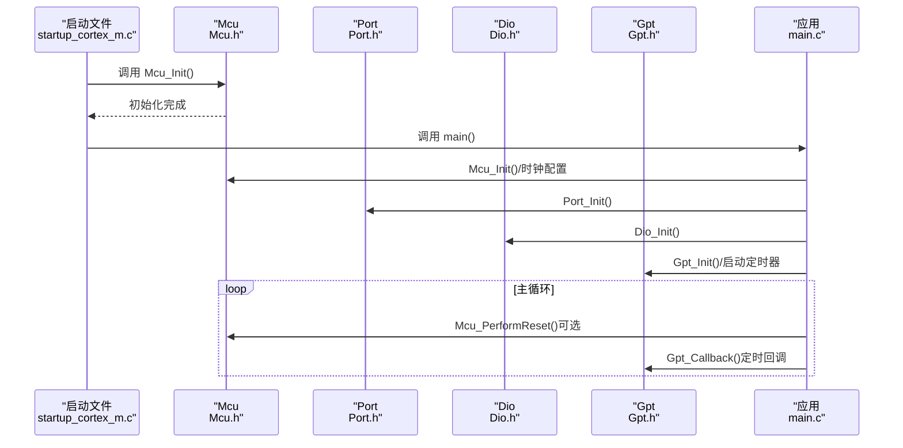
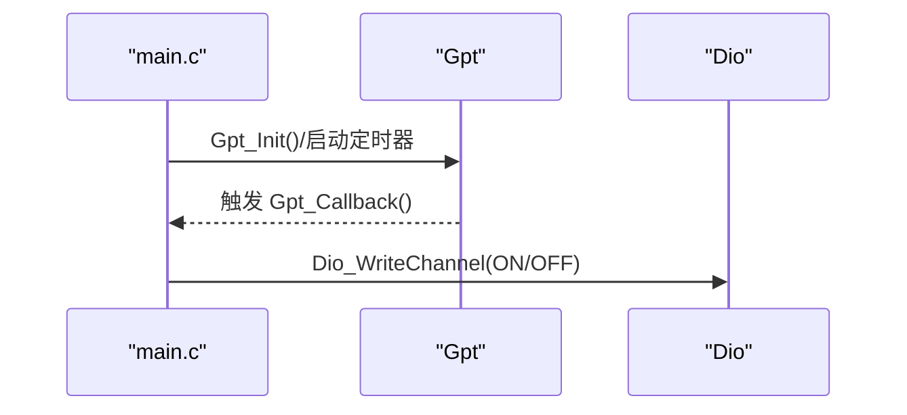
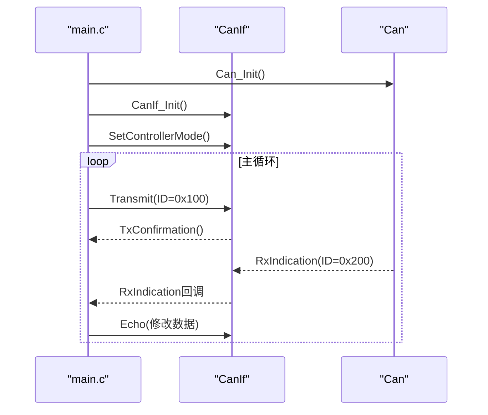
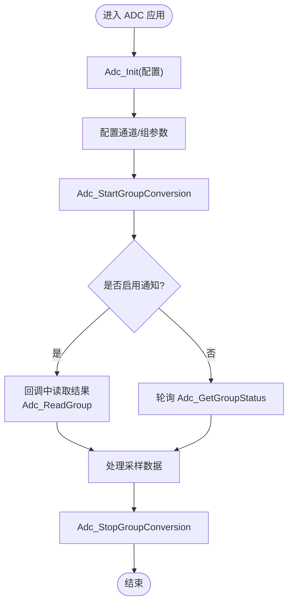
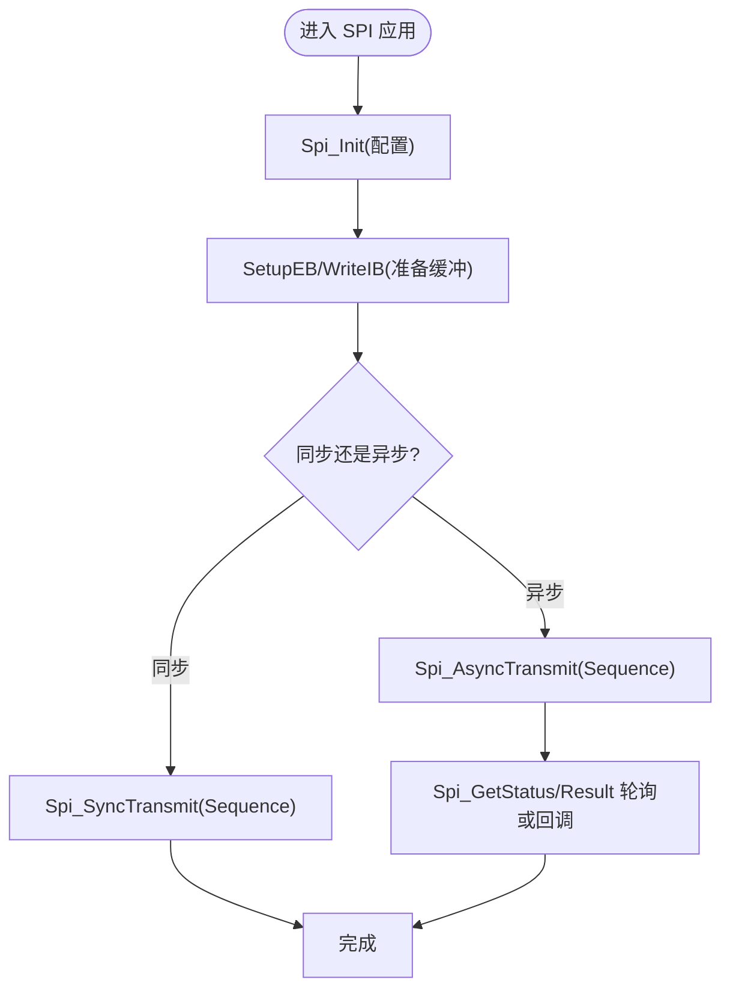
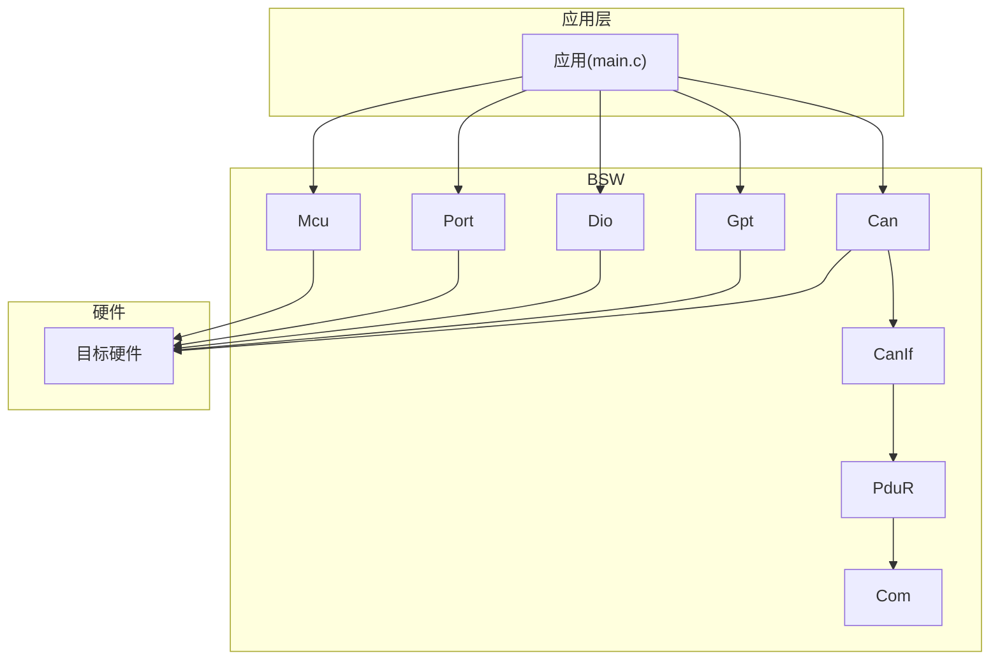

# 创建新示例项目

<cite>
**本文引用的文件**
- [README.md](file://README.md)
- [examples/README.md](file://examples/README.md)
- [examples/led_blink/main.c](file://examples/led_blink/main.c)
- [examples/can_demo/main.c](file://examples/can_demo/main.c)
- [platform/cortex-m/platform_config.h](file://platform/cortex-m/platform_config.h)
- [platform/cortex-m/startup_cortex_m.c](file://platform/cortex-m/startup_cortex_m.c)
- [docs/development-guide.md](file://docs/development-guide.md)
- [docs/modules.md](file://docs/modules.md)
- [src/bsw/services/det/include/Det.h](file://src/bsw/services/det/include/Det.h)
- [src/bsw/os/include/Std_Types.h](file://src/bsw/os/include/Std_Types.h)
- [src/bsw/mcal/adc/include/Adc.h](file://src/bsw/mcal/adc/include/Adc.h)
- [src/bsw/mcal/spi/include/Spi.h](file://src/bsw/mcal/spi/include/Spi.h)
- [src/bsw/mcal/dio/include/Dio.h](file://src/bsw/mcal/dio/include/Dio.h)
- [src/bsw/mcal/port/include/Port.h](file://src/bsw/mcal/port/include/Port.h)
- [src/bsw/mcal/mcu/include/Mcu.h](file://src/bsw/mcal/mcu/include/Mcu.h)
- [config/bsw_config.json](file://config/bsw_config.json)
</cite>

## 目录
1. [简介](#简介)
2. [项目结构](#项目结构)
3. [核心组件](#核心组件)
4. [架构总览](#架构总览)
5. [详细组件分析](#详细组件分析)
6. [依赖分析](#依赖分析)
7. [性能考虑](#性能考虑)
8. [故障排查指南](#故障排查指南)
9. [结论](#结论)
10. [附录](#附录)

## 简介
本指南面向希望基于现有示例创建自定义项目的工程师与开发者，提供从零开始搭建新示例项目的完整流程，涵盖目录结构、main.c模板、CMakeLists.txt配置、常见硬件外设（ADC采样、SPI通信、I2C设备等）示例模板、BSW模块的正确包含与初始化顺序、项目结构最佳实践与命名规范、代码组织原则与注释标准、调试技巧、自定义源文件与头文件路径配置、项目打包与版本管理以及文档编写建议。内容以仓库中的示例与文档为基础，确保与实际代码一致。

## 项目结构
新示例项目应遵循如下推荐结构，便于维护与扩展：
- examples/<your_example>/：示例工程根目录
  - main.c：应用入口与初始化逻辑
  - CMakeLists.txt：构建配置
  - include/：可选的自定义头文件
  - src/：可选的自定义源文件
  - build/：构建产物（不纳入版本控制）

构建与运行流程要点：
- 使用 CMake 与 ARM GCC 工具链进行交叉编译
- 示例工程提供最小化构建步骤与调试方法，可直接参考

章节来源
- [examples/README.md:84-129](file://examples/README.md#L84-L129)
- [README.md:111-132](file://README.md#L111-L132)

## 核心组件
- 平台支撑：Cortex-M 平台配置与启动文件
  - platform_config.h：内核选择、内存映射、时钟分频、NVIC优先级、SysTick、编译器适配与汇编指令封装
  - startup_cortex_m.c：向量表、默认异常处理、Reset_Handler（完成数据/BSS段复制、调用 Mcu_Init 与 main）
- BSW 核心模块（示例中常用）
  - Mcu：微控制器初始化与时钟配置
  - Port：端口引脚方向与模式配置
  - Dio：数字IO读写
  - Gpt：通用定时器与回调
  - Can/CanIf/Com：CAN通信栈（示例中演示）
- 标准类型与错误检测
  - Std_Types.h：标准类型与返回码
  - Det.h：开发期错误追踪

章节来源
- [platform/cortex-m/platform_config.h:12-307](file://platform/cortex-m/platform_config.h#L12-L307)
- [platform/cortex-m/startup_cortex_m.c:12-267](file://platform/cortex-m/startup_cortex_m.c#L12-L267)
- [src/bsw/os/include/Std_Types.h:11-117](file://src/bsw/os/include/Std_Types.h#L11-L117)
- [src/bsw/services/det/include/Det.h:11-76](file://src/bsw/services/det/include/Det.h#L11-L76)

## 架构总览
下图展示了示例项目从启动到应用层的典型调用序列，体现 BSW 初始化顺序与中断/轮询处理的配合：

图表来源
- [platform/cortex-m/startup_cortex_m.c:243-266](file://platform/cortex-m/startup_cortex_m.c#L243-L266)
- [examples/led_blink/main.c:61-99](file://examples/led_blink/main.c#L61-L99)
- [src/bsw/mcal/mcu/include/Mcu.h:148](file://src/bsw/mcal/mcu/include/Mcu.h#L148)
- [src/bsw/mcal/port/include/Port.h:119](file://src/bsw/mcal/port/include/Port.h#L119)
- [src/bsw/mcal/dio/include/Dio.h:101](file://src/bsw/mcal/dio/include/Dio.h#L101)

## 详细组件分析

### 示例：LED 闪烁（GPIO + 定时器）
- 功能要点
  - 使用 Mcu、Port、Dio、Gpt 实现 LED 闪烁
  - Gpt 回调中切换 Dio 输出电平
- 初始化顺序
  - 先 Mcu，再 Port，然后 Dio，最后 Gpt
- 关键接口
  - Gpt_Callback：定时触发翻转 LED
  - Dio_WriteChannel：写入通道电平

图表来源
- [examples/led_blink/main.c:37-56](file://examples/led_blink/main.c#L37-L56)
- [examples/led_blink/main.c:79-96](file://examples/led_blink/main.c#L79-L96)

章节来源
- [examples/led_blink/main.c:15-99](file://examples/led_blink/main.c#L15-L99)

### 示例：CAN 通信（发送 + 接收 + 回显）
- 功能要点
  - 初始化 Can、CanIf，并设置控制器模式
  - 周期性发送消息，接收后回显并修改数据
- 关键接口
  - CanIf_RxIndication：接收回调
  - CanIf_TxConfirmation：发送确认
  - CanIf_Transmit：发送
  - Can_MainFunction_*：轮询处理

图表来源
- [examples/can_demo/main.c:37-58](file://examples/can_demo/main.c#L37-L58)
- [examples/can_demo/main.c:63-118](file://examples/can_demo/main.c#L63-L118)

章节来源
- [examples/can_demo/main.c:15-119](file://examples/can_demo/main.c#L15-L119)

### ADC 采样模板（MCAL 驱动）
- 适用场景
  - 模数转换、传感器采集、校准与滤波
- 配置要点
  - 通道采样时间、分辨率、触发源、连续/单次模式
  - 组读取、流式缓冲、通知回调
- 关键接口
  - Adc_Init/DeInit
  - Adc_StartGroupConversion/StopGroupConversion
  - Adc_ReadGroup/Adc_GetGroupStatus
  - Adc_Enable/DisableGroupNotification

图表来源
- [src/bsw/mcal/adc/include/Adc.h:265-327](file://src/bsw/mcal/adc/include/Adc.h#L265-L327)

章节来源
- [src/bsw/mcal/adc/include/Adc.h:13-384](file://src/bsw/mcal/adc/include/Adc.h#L13-L384)

### SPI 通信模板（MCAL 驱动）
- 适用场景
  - 与外部设备（如 Flash、传感器、显示器）通信
- 配置要点
  - Job/Sequence/Channel 参数（波特率、CS极性、时序）
  - 同步/异步传输模式
- 关键接口
  - Spi_Init/DeInit
  - Spi_AsyncTransmit/Spi_SyncTransmit
  - Spi_GetStatus/GetJobResult/GetSequenceResult
  - Spi_MainFunction_Handling/Driving

图表来源
- [src/bsw/mcal/spi/include/Spi.h:254-356](file://src/bsw/mcal/spi/include/Spi.h#L254-L356)

章节来源
- [src/bsw/mcal/spi/include/Spi.h:13-362](file://src/bsw/mcal/spi/include/Spi.h#L13-L362)

### I2C 设备模板（概念说明）
- 说明
  - 本仓库未提供 I2c.h 头文件，但可参考 SPI/ADC 的配置与接口风格进行扩展
  - 建议沿用相同命名规范、配置结构体、错误码与 DET 集成方式
- 关键点
  - 时钟频率、地址模式、传输速率
  - 读写接口、错误处理与超时控制

章节来源
- [src/bsw/mcal/spi/include/Spi.h:13-362](file://src/bsw/mcal/spi/include/Spi.h#L13-L362)

### BSW 模块包含与初始化顺序最佳实践
- 包含顺序（示例）
  - Mcu → Port → Dio/Gpt/Can/Spi/Adc → 其他模块
- 初始化顺序
  - 先底层硬件（Mcu/Port），再上层模块（Dio/Gpt/CanIf/Com 等）
  - 定时器类模块在应用回调中启用通知
- DET 与版本信息
  - 按模块开启 DEV_ERROR_DETECT，必要时调用 GetVersionInfo

章节来源
- [examples/led_blink/main.c:61-99](file://examples/led_blink/main.c#L61-L99)
- [examples/can_demo/main.c:63-118](file://examples/can_demo/main.c#L63-L118)
- [src/bsw/services/det/include/Det.h:59](file://src/bsw/services/det/include/Det.h#L59)
- [src/bsw/os/include/Std_Types.h:23-35](file://src/bsw/os/include/Std_Types.h#L23-L35)

## 依赖分析
- 模块依赖（垂直方向）
  - RTE → Service Layer → ECUAL Layer → MCAL Layer → Hardware
- 水平依赖（示例）
  - Com ↔ PduR（PDU 路由）
  - PduR ↔ CanIf（CAN 传输）
  - NvM ↔ MemIf（存储访问）
  - Dcm ↔ PduR/Dem（诊断与事件）
- 配置来源
  - 模块通过各自的 _Cfg.h 配置，部分模块支持 bsw_config.json 的全局参数

图表来源
- [docs/modules.md:340-375](file://docs/modules.md#L340-L375)
- [examples/led_blink/main.c:15-99](file://examples/led_blink/main.c#L15-L99)
- [examples/can_demo/main.c:15-119](file://examples/can_demo/main.c#L15-L119)

章节来源
- [docs/modules.md:340-375](file://docs/modules.md#L340-L375)
- [config/bsw_config.json:1-21](file://config/bsw_config.json#L1-L21)

## 性能考虑
- 时钟与分频
  - 合理设置 SYSTEM_CLOCK_FREQ、AHB/APB 分频，避免过高的总线频率导致干扰
- 中断与轮询
  - 高频定时器回调中尽量减少阻塞操作，将耗时任务放入后台处理
- 内存分区
  - 使用 MemMap.h 进行代码/变量分区，避免跨段访问带来的性能损耗
- 代码复杂度
  - 单函数圈复杂度控制在合理范围，提升可维护性与可测性

## 故障排查指南
- LED 不闪烁
  - 检查 Port 配置、Dio 通道映射、Gpt 中断与回调
- CAN 不工作
  - 检查 Can/CanIf 初始化、波特率、控制器模式、终端电阻
- ADC 结果异常
  - 检查采样时间、分辨率、通道配置、缓冲区设置
- SPI 传输失败
  - 检查 CS 极性、时序参数、同步/异步模式、缓冲区长度

章节来源
- [examples/README.md:149-160](file://examples/README.md#L149-L160)
- [examples/led_blink/main.c:37-56](file://examples/led_blink/main.c#L37-L56)
- [examples/can_demo/main.c:37-58](file://examples/can_demo/main.c#L37-L58)

## 结论
通过本指南，您可以基于现有示例快速创建新项目：先建立目录与 CMakeLists.txt，编写 main.c 模板，按“Mcu → Port → 其他模块”的顺序初始化，结合各外设驱动接口完成功能开发；同时遵循命名规范、代码组织与注释标准，利用 DET 与调试工具定位问题，最终形成可维护、可扩展的示例工程。

## 附录

### 项目结构最佳实践与命名规范
- 目录结构
  - examples/<your_example>/：示例工程根目录
  - include/：自定义头文件
  - src/：自定义源文件
  - build/：构建产物（不纳入版本控制）
- 命名规范
  - 文件名：PascalCase（如 CanIf.c、PduR.c）
  - 头文件：PascalCase（如 CanIf.h、PduR_Cfg.h）
  - 配置文件：PascalCase + _Cfg（如 CanIf_Cfg.h）
  - 函数名：模块名_函数名（如 CanIf_Init）
  - 宏定义：模块名_描述（如 CANIF_E_UNINIT）
  - 类型名：模块名_类型名_Type（如 PduR_SrcPduConfigType）
  - 变量名：camelCase（如 canIfStatus）

章节来源
- [docs/development-guide.md:86-139](file://docs/development-guide.md#L86-L139)

### 代码组织原则与注释标准
- 文件头注释：项目、平台、外设、依赖、版本、日期、作者
- 函数注释：brief、param、return、pre、post
- 代码结构：Includes → Local Constants → Local Macros → Local Types → Local Variables → Local Functions → Global Functions
- 内存分区：使用 MemMap.h 对变量/代码进行分区声明与结束

章节来源
- [docs/development-guide.md:140-278](file://docs/development-guide.md#L140-L278)

### 调试技巧
- 启用 DET 错误检测，定位参数与状态错误
- 使用 GDB 进行断点、变量查看与单步执行
- 在关键路径打印日志（条件编译）

章节来源
- [docs/development-guide.md:431-492](file://docs/development-guide.md#L431-L492)

### 添加自定义源文件与头文件路径配置
- 将自定义源文件加入 SOURCES
- 在 include_directories 中添加自定义 include 路径
- 如需链接库，使用 target_link_libraries

章节来源
- [examples/README.md:115-128](file://examples/README.md#L115-L128)

### 项目打包、版本管理与文档编写
- 版本管理
  - 使用 Git 进行版本控制，遵循提交信息规范
- 文档编写
  - 参考现有文档风格，补充模块说明、API 参考与开发指南
- 打包与发布
  - 使用 CMake 生成构建产物，按需导出二进制与文档

章节来源
- [README.md:134-152](file://README.md#L134-L152)
- [docs/development-guide.md:673-684](file://docs/development-guide.md#L673-L684)