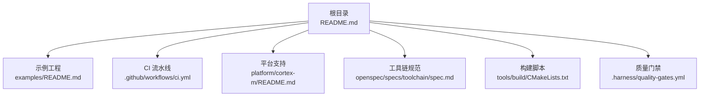
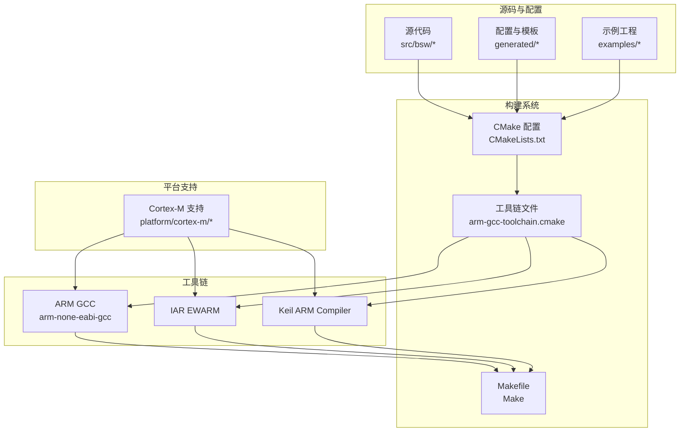
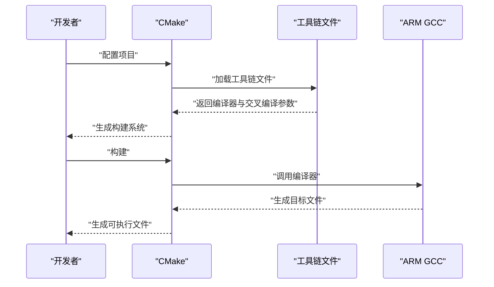
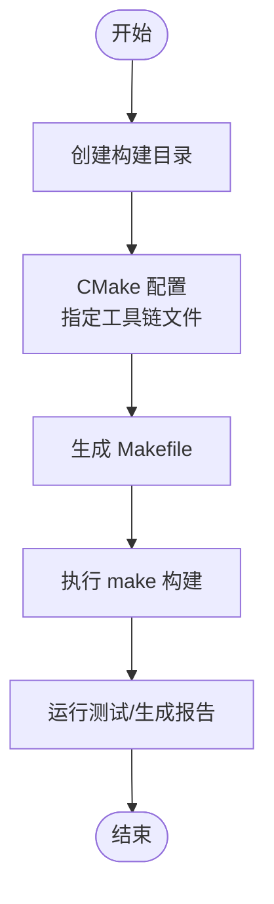
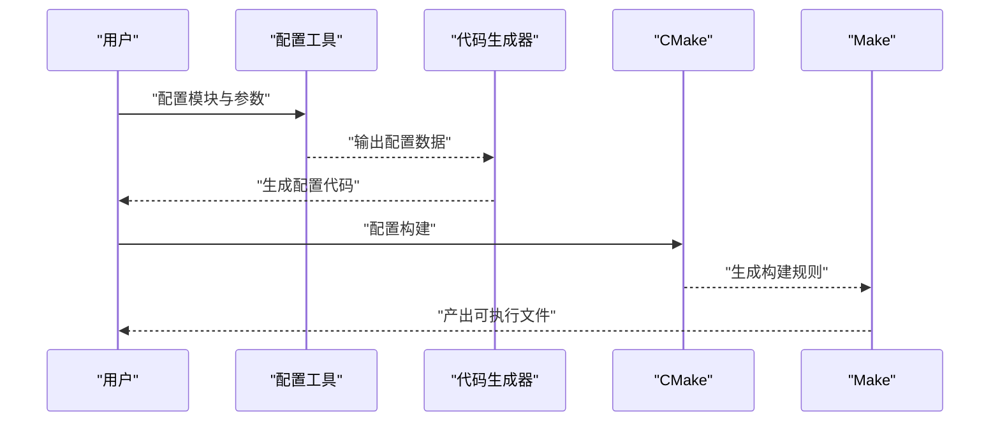
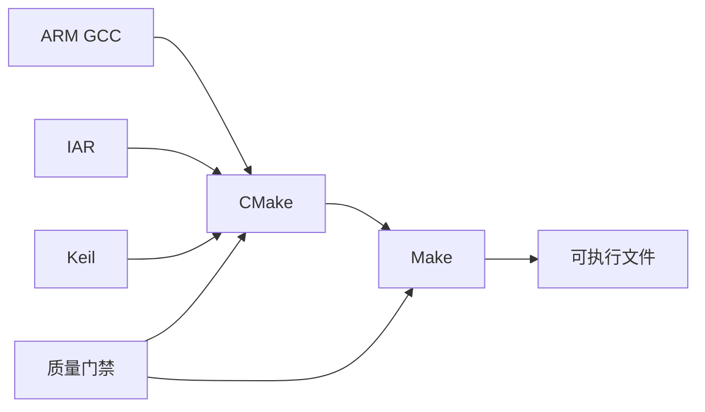

# 构建环境配置

<cite>
**本文引用的文件**
- [README.md](file://README.md)
- [.github/workflows/ci.yml](file://.github/workflows/ci.yml)
- [examples/README.md](file://examples/README.md)
- [platform/cortex-m/README.md](file://platform/cortex-m/README.md)
- [openspec/specs/toolchain/spec.md](file://openspec/specs/toolchain/spec.md)
- [tools/generator/src/code_generator.py](file://tools/generator/src/code_generator.py)
- [tools/build/CMakeLists.txt](file://tools/build/CMakeLists.txt)
- [.harness/quality-gates.yml](file://.harness/quality-gates.yml)
</cite>

## 目录
1. [简介](#简介)
2. [项目结构](#项目结构)
3. [核心组件](#核心组件)
4. [架构总览](#架构总览)
5. [详细组件分析](#详细组件分析)
6. [依赖关系分析](#依赖关系分析)
7. [性能考虑](#性能考虑)
8. [故障排查指南](#故障排查指南)
9. [结论](#结论)
10. [附录](#附录)

## 简介
本指南面向希望在多操作系统环境下搭建并维护 YuleTech AutoSAR BSW 平台构建环境的工程师。内容覆盖 ARM GCC 工具链、CMake 和 Make 的安装与配置，环境变量与路径设置，工具链验证方法；提供跨平台安装步骤与配置示例；解释 Makefile 工作原理与构建选项；给出 Eclipse、VS Code、Keil 的项目导入建议；说明构建脚本用法与自定义配置；阐述交叉编译原理与目标平台配置；并提供常见构建错误的诊断与解决思路。

## 项目结构
该仓库采用“分层+模块化”的组织方式，构建相关的关键位置包括：
- 根级构建与示例：根 README 提供 CMake 配置与 Make 构建流程示例
- 示例工程：examples 目录包含 LED 闪烁与 CAN 通信示例，展示 Makefile 构建与 IDE 导入
- Cortex-M 平台支持：platform/cortex-m 提供通用 Cortex-M 支持与编译参数示例
- 工具链规范：openspec/specs/toolchain/spec.md 定义了 Yule Toolchain 的工具链架构与能力边界
- CI 流水线：.github/workflows/ci.yml 展示了 GitHub Actions 中的工具链安装与构建步骤
- 质量门禁：.harness/quality-gates.yml 定义了本地与推送前的构建与测试命令

**图表来源**
- [README.md:95-132](file://README.md#L95-L132)
- [.github/workflows/ci.yml:31-36](file://.github/workflows/ci.yml#L31-L36)
- [examples/README.md:21-82](file://examples/README.md#L21-L82)
- [platform/cortex-m/README.md:141-172](file://platform/cortex-m/README.md#L141-L172)
- [openspec/specs/toolchain/spec.md:271-348](file://openspec/specs/toolchain/spec.md#L271-L348)
- [tools/build/CMakeLists.txt](file://tools/build/CMakeLists.txt)
- [.harness/quality-gates.yml:212-234](file://.harness/quality-gates.yml#L212-L234)

**章节来源**
- [README.md:95-132](file://README.md#L95-L132)
- [examples/README.md:21-82](file://examples/README.md#L21-L82)
- [platform/cortex-m/README.md:141-172](file://platform/cortex-m/README.md#L141-L172)
- [openspec/specs/toolchain/spec.md:271-348](file://openspec/specs/toolchain/spec.md#L271-L348)
- [.github/workflows/ci.yml:31-36](file://.github/workflows/ci.yml#L31-L36)
- [.harness/quality-gates.yml:212-234](file://. harness/quality-gates.yml#L212-L234)

## 核心组件
- ARM GCC 工具链
  - 在 CI 中通过包管理器安装，使用 arm-none-eabi-gcc 编译器
  - 平台支持文档中给出了针对不同编译器（GCC/IAR/Keil）的典型编译参数
- CMake 构建系统
  - 根 README 提供了通过 CMake 配置并指定工具链文件的示例
  - CI 中使用 CMake 指定工具链文件进行配置
- Make 构建系统
  - examples/README.md 展示了示例工程的 Make 构建流程
  - 质量门禁中定义了本地 make 清理与构建命令
- 交叉编译与目标平台
  - 平台支持文档明确了针对不同 Cortex-M 核心的编译参数与宏定义
  - 工具链规范明确了支持的编译器与平台范围

**章节来源**
- [.github/workflows/ci.yml:26-29](file://.github/workflows/ci.yml#L26-L29)
- [platform/cortex-m/README.md:143-172](file://platform/cortex-m/README.md#L143-L172)
- [README.md:111-122](file://README.md#L111-L122)
- [examples/README.md:21-82](file://examples/README.md#L21-L82)
- [.harness/quality-gates.yml:212-234](file://.harness/quality-gates.yml#L212-L234)
- [openspec/specs/toolchain/spec.md:277-284](file://openspec/specs/toolchain/spec.md#L277-L284)

## 架构总览
下图展示了从源码到可执行产物的构建路径，以及工具链、构建系统与平台支持之间的关系。

**图表来源**
- [README.md:111-122](file://README.md#L111-L122)
- [examples/README.md:21-82](file://examples/README.md#L21-L82)
- [platform/cortex-m/README.md:143-172](file://platform/cortex-m/README.md#L143-L172)
- [openspec/specs/toolchain/spec.md:277-284](file://openspec/specs/toolchain/spec.md#L277-L284)

## 详细组件分析

### ARM GCC 工具链安装与验证
- 安装方式
  - Ubuntu/Debian: 通过包管理器安装 ARM GCC
  - Windows/macOS: 通过官方发布渠道或包管理器安装
- 验证方法
  - 检查编译器版本与路径
  - 使用最小示例进行编译验证（参考平台支持中的编译参数）
- 环境变量
  - 设置 ARM_GCC_PATH 或确保工具链在 PATH 中
  - 在 CI 中通过包管理器安装后直接使用

**章节来源**
- [.github/workflows/ci.yml:26-29](file://.github/workflows/ci.yml#L26-L29)
- [platform/cortex-m/README.md:143-153](file://platform/cortex-m/README.md#L143-L153)
- [examples/README.md:66-69](file://examples/README.md#L66-L69)

### CMake 配置与工具链文件
- 配置步骤
  - 创建构建目录并进入
  - 使用 CMake 指定工具链文件进行配置
- 工具链文件
  - 通过 CMAKE_TOOLCHAIN_FILE 指向 arm-gcc-toolchain.cmake
- 适用场景
  - 根 README 与 CI 中均展示了该流程

**图表来源**
- [README.md:111-122](file://README.md#L111-L122)
- [.github/workflows/ci.yml:35-36](file://.github/workflows/ci.yml#L35-L36)

**章节来源**
- [README.md:111-122](file://README.md#L111-L122)
- [.github/workflows/ci.yml:35-36](file://.github/workflows/ci.yml#L35-L36)

### Make 构建系统与 Makefile 工作原理
- 示例工程的 Make 构建流程
  - 进入示例目录，创建 build 并配置
  - 使用 make 进行构建
- 本地构建命令
  - 质量门禁中定义了 make clean 与 make 的本地构建命令
- 构建选项
  - 平台支持文档提供了针对不同编译器的典型编译参数（CPU、Thumb、FPU、浮点 ABI、宏定义等）

**图表来源**
- [examples/README.md:21-82](file://examples/README.md#L21-L82)
- [.harness/quality-gates.yml:212-234](file://.harness/quality-gates.yml#L212-L234)
- [platform/cortex-m/README.md:143-172](file://platform/cortex-m/README.md#L143-L172)

**章节来源**
- [examples/README.md:21-82](file://examples/README.md#L21-L82)
- [.harness/quality-gates.yml:212-234](file://.harness/quality-gates.yml#L212-L234)
- [platform/cortex-m/README.md:143-172](file://platform/cortex-m/README.md#L143-L172)

### IDE 集成指南（Eclipse/VS Code/Keil）
- Eclipse
  - 将示例工程作为 Makefile 项目导入
- VS Code
  - 使用 Cortex-Debug 扩展进行调试
- Keil
  - 使用 uVision 项目向导导入
- 注意事项
  - 确保 ARM GCC 工具链已正确安装并在 PATH 中
  - 在 IDE 中配置正确的编译器与工具链参数（参考平台支持文档中的编译参数）

**章节来源**
- [examples/README.md:142-147](file://examples/README.md#L142-L147)

### 构建脚本使用与自定义配置
- 代码生成器
  - 通过配置文件生成 BSW 配置代码（例如 Mcu/Can 配置）
  - 支持模板渲染与增量生成
- 构建脚本
  - 工具链规范中提供了生成的 Makefile 示例与 CI 集成示例
- 自定义配置
  - 在配置工具中完成模块选择与参数配置后，生成相应配置代码
  - 将生成的配置纳入构建流程

**图表来源**
- [openspec/specs/toolchain/spec.md:158-230](file://openspec/specs/toolchain/spec.md#L158-L230)
- [tools/generator/src/code_generator.py:86-119](file://tools/generator/src/code_generator.py#L86-L119)
- [openspec/specs/toolchain/spec.md:291-317](file://openspec/specs/toolchain/spec.md#L291-L317)

**章节来源**
- [openspec/specs/toolchain/spec.md:158-230](file://openspec/specs/toolchain/spec.md#L158-L230)
- [tools/generator/src/code_generator.py:86-119](file://tools/generator/src/code_generator.py#L86-L119)
- [openspec/specs/toolchain/spec.md:291-317](file://openspec/specs/toolchain/spec.md#L291-L317)

### 交叉编译原理与目标平台配置
- 交叉编译要点
  - 指定目标 CPU、指令集（Thumb）、FPU 类型与浮点 ABI
  - 定义必要的宏（如目标核心类型）
- 目标平台配置
  - 不同 Cortex-M 核心（M0/M3/M4/M7/M33/M55 等）对应不同的编译参数
  - 平台支持文档提供了针对各编译器的参数示例

**章节来源**
- [platform/cortex-m/README.md:143-172](file://platform/cortex-m/README.md#L143-L172)
- [openspec/specs/toolchain/spec.md:277-284](file://openspec/specs/toolchain/spec.md#L277-L284)

## 依赖关系分析
- 构建链路依赖
  - ARM GCC/IAR/Keil 依赖于正确的工具链文件与编译参数
  - CMake 依赖工具链文件与构建脚本
  - Make 依赖 CMake 生成的构建规则
- 质量门禁
  - 本地与推送前的构建、静态分析、单元测试与覆盖率检查由质量门禁统一管理

**图表来源**
- [openspec/specs/toolchain/spec.md:277-284](file://openspec/specs/toolchain/spec.md#L277-L284)
- [.harness/quality-gates.yml:212-234](file://.harness/quality-gates.yml#L212-L234)

**章节来源**
- [openspec/specs/toolchain/spec.md:277-284](file://openspec/specs/toolchain/spec.md#L277-L284)
- [.harness/quality-gates.yml:212-234](file://.harness/quality-gates.yml#L212-L234)

## 性能考虑
- 构建性能
  - 使用并行构建（如 make -j$(nproc)）提升编译速度
  - 在 CI 中复用缓存与依赖安装，减少重复工作
- 代码生成与解析
  - 工具链规范中定义了 ARXML 解析与代码生成的性能目标，建议在本地开发时关注生成时间与资源占用

**章节来源**
- [README.md:120-121](file://README.md#L120-L121)
- [openspec/specs/toolchain/spec.md:386-393](file://openspec/specs/toolchain/spec.md#L386-L393)

## 故障排查指南
- 工具链未找到
  - 确认 ARM GCC 已安装且在 PATH 中
  - 在 CI 中可通过包管理器安装
- CMake 配置失败
  - 检查工具链文件路径是否正确
  - 确认 CMake 版本满足要求
- 构建失败
  - 使用质量门禁中的本地构建命令进行复现
  - 检查编译参数与目标平台配置是否匹配
- 示例工程无法构建
  - 按示例 README 的步骤执行，确认环境变量与工具链路径

**章节来源**
- [.github/workflows/ci.yml:26-29](file://.github/workflows/ci.yml#L26-L29)
- [README.md:111-122](file://README.md#L111-L122)
- [.harness/quality-gates.yml:212-234](file://.harness/quality-gates.yml#L212-L234)
- [examples/README.md:21-82](file://examples/README.md#L21-L82)

## 结论
本指南围绕 ARM GCC、CMake 与 Make 的安装配置、环境变量与路径设置、工具链验证、跨平台安装步骤、Makefile 工作原理、IDE 集成、构建脚本使用与自定义配置、交叉编译原理与目标平台配置，以及常见错误诊断进行了系统梳理。结合平台支持文档与工具链规范，可在多操作系统环境下稳定地搭建并维护 YuleTech AutoSAR BSW 平台的构建环境。

## 附录
- 快速命令参考
  - 创建构建目录并配置：参见根 README 的构建步骤
  - 示例工程构建：参见 examples/README 的示例
  - 本地构建命令：参见质量门禁中的 make 命令
- 参考文档
  - 平台支持文档中的编译参数与目标平台配置
  - 工具链规范中的工具链架构与生成器示例

**章节来源**
- [README.md:111-122](file://README.md#L111-L122)
- [examples/README.md:21-82](file://examples/README.md#L21-L82)
- [.harness/quality-gates.yml:212-234](file://.harness/quality-gates.yml#L212-L234)
- [platform/cortex-m/README.md:143-172](file://platform/cortex-m/README.md#L143-L172)
- [openspec/specs/toolchain/spec.md:271-348](file://openspec/specs/toolchain/spec.md#L271-L348)