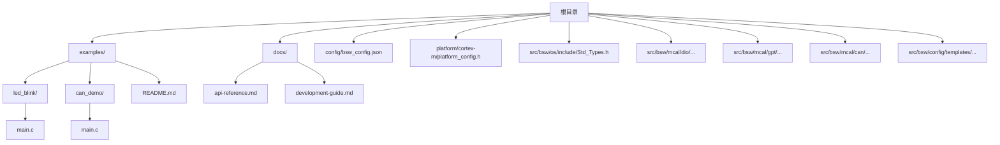
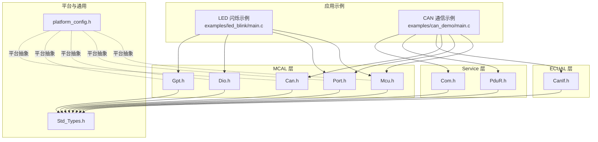
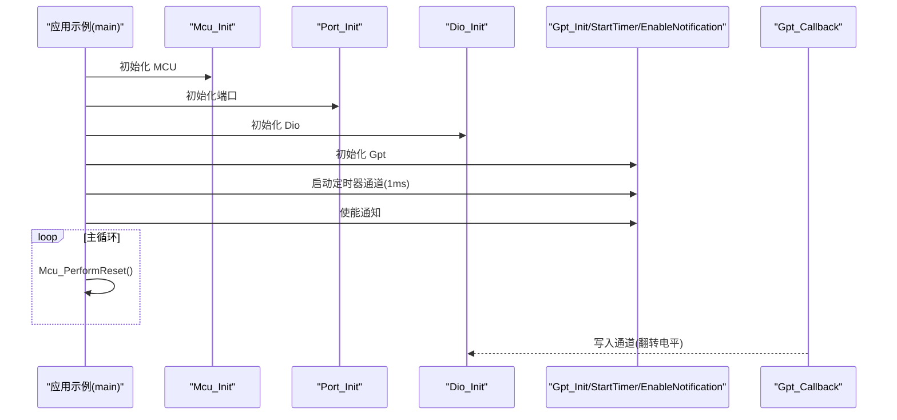
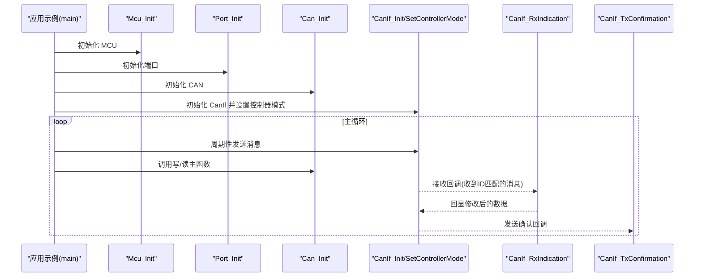
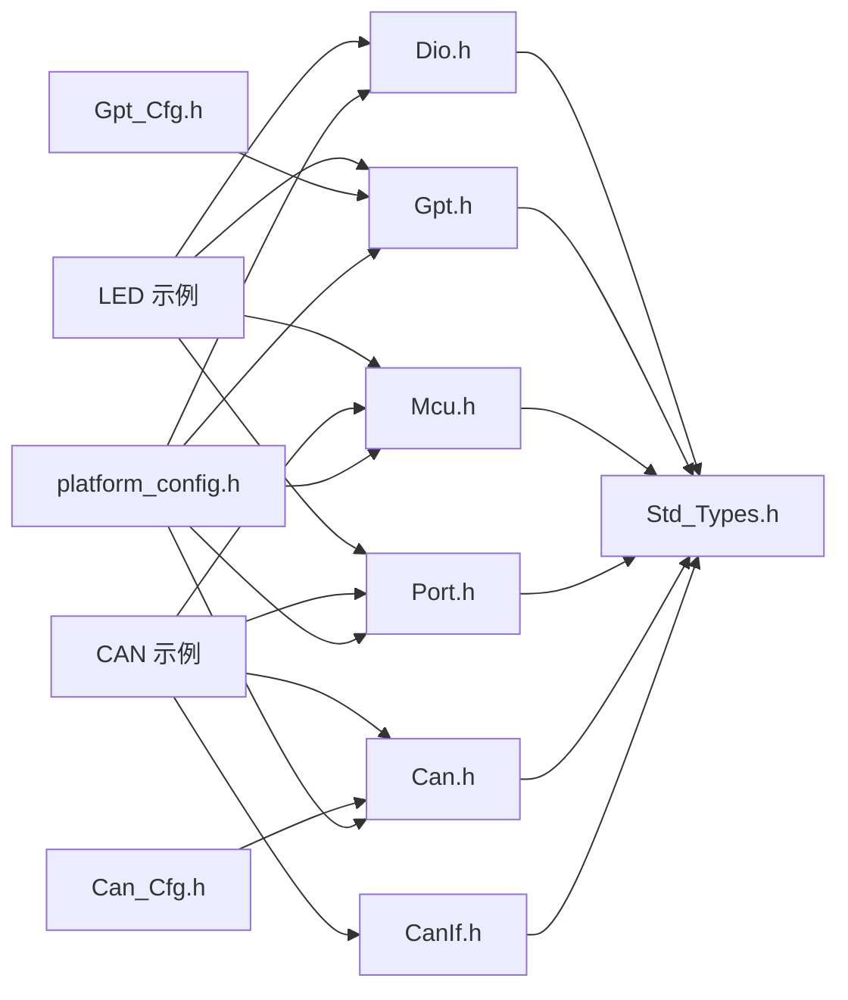

# 示例与教程

<cite>
**本文引用的文件**
- [examples/README.md](file://examples/README.md)
- [examples/led_blink/main.c](file://examples/led_blink/main.c)
- [examples/can_demo/main.c](file://examples/can_demo/main.c)
- [README.md](file://README.md)
- [docs/api-reference.md](file://docs/api-reference.md)
- [docs/development-guide.md](file://docs/development-guide.md)
- [config/bsw_config.json](file://config/bsw_config.json)
- [platform/cortex-m/platform_config.h](file://platform/cortex-m/platform_config.h)
- [src/bsw/os/include/Std_Types.h](file://src/bsw/os/include/Std_Types.h)
- [src/bsw/mcal/dio/include/Dio.h](file://src/bsw/mcal/dio/include/Dio.h)
- [src/bsw/mcal/dio/include/Dio_Cfg.h](file://src/bsw/mcal/dio/include/Dio_Cfg.h)
- [src/bsw/mcal/dio/src/Dio.c](file://src/bsw/mcal/dio/src/Dio.c)
- [src/bsw/mcal/gpt/include/Gpt.h](file://src/bsw/mcal/gpt/include/Gpt.h)
- [src/bsw/mcal/gpt/include/Gpt_Cfg.h](file://src/bsw/mcal/gpt/include/Gpt_Cfg.h)
- [src/bsw/mcal/can/include/Can.h](file://src/bsw/mcal/can/include/Can.h)
- [src/bsw/config/templates/Can_Cfg.h](file://src/bsw/config/templates/Can_Cfg.h)
- [src/bsw/config/templates/Gpt_Cfg.h](file://src/bsw/config/templates/Gpt_Cfg.h)
</cite>

## 目录
1. [简介](#简介)
2. [项目结构](#项目结构)
3. [核心组件](#核心组件)
4. [架构总览](#架构总览)
5. [详细组件分析](#详细组件分析)
6. [依赖关系分析](#依赖关系分析)
7. [性能考虑](#性能考虑)
8. [故障排查指南](#故障排查指南)
9. [结论](#结论)
10. [附录](#附录)

## 简介
本教程面向希望基于 YuleTech AutoSAR BSW 平台进行开发的工程师，提供从入门到进阶的完整学习路径与实践项目。重点围绕两个示例展开：
- LED 闪烁示例：演示 GPIO 输出与定时器中断驱动的典型用法，帮助理解 MCAL、ECUAL 与基本应用循环的协作。
- CAN 通信示例：演示控制器初始化、消息收发、回调处理与周期性发送，帮助掌握 CAN 生态链路（MCAL → ECUAL → Service）。

同时，文档覆盖编译配置、运行步骤、API 接口、调试技巧、常见问题与扩展练习，并给出性能优化建议与最佳实践总结，帮助读者基于示例项目快速开发自有应用软件。

## 项目结构
示例与教程相关的关键目录与文件如下所示：

图示来源
- [examples/README.md:1-165](file://examples/README.md#L1-L165)
- [examples/led_blink/main.c:1-100](file://examples/led_blink/main.c#L1-L100)
- [examples/can_demo/main.c:1-119](file://examples/can_demo/main.c#L1-L119)
- [docs/api-reference.md:1-609](file://docs/api-reference.md#L1-L609)
- [docs/development-guide.md:1-684](file://docs/development-guide.md#L1-L684)
- [config/bsw_config.json:1-21](file://config/bsw_config.json#L1-L21)
- [platform/cortex-m/platform_config.h:1-307](file://platform/cortex-m/platform_config.h#L1-L307)
- [src/bsw/os/include/Std_Types.h:1-117](file://src/bsw/os/include/Std_Types.h#L1-L117)

章节来源
- [examples/README.md:1-165](file://examples/README.md#L1-L165)
- [README.md:1-326](file://README.md#L1-L326)

## 核心组件
- 标准类型与错误码：统一的返回类型、布尔类型与版本信息结构体，确保各模块接口一致性。
- MCU/Port/Dio/Gpt：MCAL 层驱动，负责底层硬件抽象与外设控制。
- Can/CanIf/PduR/Com：ECUAL 与 Service 层，提供通信栈与路由能力。
- 平台配置：Cortex-M 平台相关宏与寄存器抽象，便于移植与调试。

章节来源
- [src/bsw/os/include/Std_Types.h:1-117](file://src/bsw/os/include/Std_Types.h#L1-L117)
- [docs/api-reference.md:17-56](file://docs/api-reference.md#L17-L56)
- [docs/api-reference.md:59-131](file://docs/api-reference.md#L59-L131)
- [docs/api-reference.md:135-180](file://docs/api-reference.md#L135-L180)
- [docs/api-reference.md:184-346](file://docs/api-reference.md#L184-L346)
- [platform/cortex-m/platform_config.h:1-307](file://platform/cortex-m/platform_config.h#L1-L307)

## 架构总览
下图展示了示例程序在 AutoSAR 分层架构中的位置与交互关系，以及示例所涉及的模块与接口。

图示来源
- [examples/led_blink/main.c:15-100](file://examples/led_blink/main.c#L15-L100)
- [examples/can_demo/main.c:15-119](file://examples/can_demo/main.c#L15-L119)
- [docs/api-reference.md:59-131](file://docs/api-reference.md#L59-L131)
- [docs/api-reference.md:135-180](file://docs/api-reference.md#L135-L180)
- [docs/api-reference.md:184-346](file://docs/api-reference.md#L184-L346)
- [platform/cortex-m/platform_config.h:1-307](file://platform/cortex-m/platform_config.h#L1-L307)
- [src/bsw/os/include/Std_Types.h:1-117](file://src/bsw/os/include/Std_Types.h#L1-L117)

## 详细组件分析

### LED 闪烁示例：实现原理与流程
该示例通过定时器中断周期性切换 LED 状态，展示 MCAL 驱动的初始化与回调机制。

- 关键要点
  - 使用 Mcu 初始化系统时钟与复位。
  - 使用 Port 初始化端口（GPIO）。
  - 使用 Dio 控制指定通道电平。
  - 使用 Gpt 启动定时器通道并启用通知回调。
  - 在回调中累加计数，达到设定周期后翻转 LED。

- 时序流程

图示来源
- [examples/led_blink/main.c:61-99](file://examples/led_blink/main.c#L61-L99)
- [examples/led_blink/main.c:37-56](file://examples/led_blink/main.c#L37-L56)
- [docs/api-reference.md:59-93](file://docs/api-reference.md#L59-L93)
- [docs/api-reference.md:135-180](file://docs/api-reference.md#L135-L180)

- 代码解析要点（路径）
  - 应用入口与初始化顺序：[examples/led_blink/main.c:61-99](file://examples/led_blink/main.c#L61-L99)
  - 定时器回调与 LED 翻转逻辑：[examples/led_blink/main.c:37-56](file://examples/led_blink/main.c#L37-L56)
  - Gpt 配置模板与通道频率：[src/bsw/config/templates/Gpt_Cfg.h:1-77](file://src/bsw/config/templates/Gpt_Cfg.h#L1-L77)
  - Dio 接口与通道定义：[src/bsw/mcal/dio/include/Dio.h:1-195](file://src/bsw/mcal/dio/include/Dio.h#L1-L195)，通道映射：[src/bsw/mcal/dio/include/Dio_Cfg.h:29-86](file://src/bsw/mcal/dio/include/Dio_Cfg.h#L29-L86)
  - Dio 实现（读写通道）：[src/bsw/mcal/dio/src/Dio.c:56-115](file://src/bsw/mcal/dio/src/Dio.c#L56-L115)

- 编译与运行步骤
  - 进入示例目录并构建：[examples/README.md:21-28](file://examples/README.md#L21-L28)
  - 使用 CMake 与 ARM GCC 工具链构建：[examples/README.md:64-82](file://examples/README.md#L64-L82)
  - 烧录与调试：[examples/README.md:79-82](file://examples/README.md#L79-L82)，GDB 调试：[examples/README.md:130-140](file://examples/README.md#L130-L140)

- 常见问题
  - LED 不闪烁：检查 GPIO 配置、时钟设置与 LED 极性：[examples/README.md:149-155](file://examples/README.md#L149-L155)

章节来源
- [examples/led_blink/main.c:1-100](file://examples/led_blink/main.c#L1-L100)
- [src/bsw/config/templates/Gpt_Cfg.h:1-77](file://src/bsw/config/templates/Gpt_Cfg.h#L1-L77)
- [src/bsw/mcal/dio/include/Dio.h:1-195](file://src/bsw/mcal/dio/include/Dio.h#L1-L195)
- [src/bsw/mcal/dio/include/Dio_Cfg.h:29-86](file://src/bsw/mcal/dio/include/Dio_Cfg.h#L29-L86)
- [src/bsw/mcal/dio/src/Dio.c:56-115](file://src/bsw/mcal/dio/src/Dio.c#L56-L115)
- [examples/README.md:21-28](file://examples/README.md#L21-L28)
- [examples/README.md:64-82](file://examples/README.md#L64-L82)
- [examples/README.md:130-140](file://examples/README.md#L130-L140)
- [examples/README.md:149-155](file://examples/README.md#L149-L155)

### CAN 通信示例：配置与数据传输流程
该示例演示控制器初始化、消息收发、回调处理与周期性发送，涵盖 ECUAL 与 Service 层的协同。

- 关键要点
  - 初始化 Mcu、Port、Can、CanIf。
  - 设置控制器模式为启动。
  - 在主循环中周期性发送消息，并调用各模块主函数。
  - 接收回调中复制数据并回显修改后的数据。

- 数据流与回调流程

图示来源
- [examples/can_demo/main.c:63-118](file://examples/can_demo/main.c#L63-L118)
- [examples/can_demo/main.c:37-58](file://examples/can_demo/main.c#L37-L58)
- [docs/api-reference.md:94-131](file://docs/api-reference.md#L94-L131)
- [docs/api-reference.md:135-180](file://docs/api-reference.md#L135-L180)

- 代码解析要点（路径）
  - 应用入口与初始化顺序：[examples/can_demo/main.c:63-91](file://examples/can_demo/main.c#L63-L91)
  - 接收与发送回调：[examples/can_demo/main.c:37-58](file://examples/can_demo/main.c#L37-L58)
  - 主函数调用序列：[examples/can_demo/main.c:111-115](file://examples/can_demo/main.c#L111-L115)
  - Can/CanIf 接口定义：[src/bsw/mcal/can/include/Can.h:1-269](file://src/bsw/mcal/can/include/Can.h#L1-L269)，[docs/api-reference.md:135-180](file://docs/api-reference.md#L135-L180)
  - CAN 配置模板（波特率、控制器数量等）：[src/bsw/config/templates/Can_Cfg.h:1-57](file://src/bsw/config/templates/Can_Cfg.h#L1-L57)
  - BSW 配置（模块启用与参数）：[config/bsw_config.json:1-21](file://config/bsw_config.json#L1-L21)

- 编译与运行步骤
  - 进入示例目录并构建：[examples/README.md:44-54](file://examples/README.md#L44-L54)
  - 使用 CMake 与 ARM GCC 工具链构建：[examples/README.md:64-82](file://examples/README.md#L64-L82)
  - 烧录与调试：[examples/README.md:79-82](file://examples/README.md#L79-L82)，GDB 调试：[examples/README.md:130-140](file://examples/README.md#L130-L140)

- 常见问题
  - CAN 不工作：检查收发器连接、波特率设置与终端电阻：[examples/README.md:156-159](file://examples/README.md#L156-L159)

章节来源
- [examples/can_demo/main.c:1-119](file://examples/can_demo/main.c#L1-L119)
- [src/bsw/config/templates/Can_Cfg.h:1-57](file://src/bsw/config/templates/Can_Cfg.h#L1-L57)
- [config/bsw_config.json:1-21](file://config/bsw_config.json#L1-L21)
- [examples/README.md:44-54](file://examples/README.md#L44-L54)
- [examples/README.md:64-82](file://examples/README.md#L64-L82)
- [examples/README.md:130-140](file://examples/README.md#L130-L140)
- [examples/README.md:156-159](file://examples/README.md#L156-L159)

## 依赖关系分析
- 示例对 MCAL 的直接依赖
  - LED 示例：Mcu、Port、Dio、Gpt
  - CAN 示例：Mcu、Port、Can、CanIf
- 配置与模板
  - Gpt_Cfg.h、Can_Cfg.h 提供预编译配置项（如通道数、波特率、tick 频率等）
  - platform_config.h 提供平台相关宏与寄存器抽象
- 标准类型
  - Std_Types.h 提供统一的数据类型与返回值约定

图示来源
- [examples/led_blink/main.c:15-18](file://examples/led_blink/main.c#L15-L18)
- [examples/can_demo/main.c:15-21](file://examples/can_demo/main.c#L15-L21)
- [src/bsw/config/templates/Gpt_Cfg.h:1-77](file://src/bsw/config/templates/Gpt_Cfg.h#L1-L77)
- [src/bsw/config/templates/Can_Cfg.h:1-57](file://src/bsw/config/templates/Can_Cfg.h#L1-L57)
- [platform/cortex-m/platform_config.h:1-307](file://platform/cortex-m/platform_config.h#L1-L307)
- [src/bsw/os/include/Std_Types.h:1-117](file://src/bsw/os/include/Std_Types.h#L1-L117)

章节来源
- [examples/led_blink/main.c:15-18](file://examples/led_blink/main.c#L15-L18)
- [examples/can_demo/main.c:15-21](file://examples/can_demo/main.c#L15-L21)
- [src/bsw/config/templates/Gpt_Cfg.h:1-77](file://src/bsw/config/templates/Gpt_Cfg.h#L1-L77)
- [src/bsw/config/templates/Can_Cfg.h:1-57](file://src/bsw/config/templates/Can_Cfg.h#L1-L57)
- [platform/cortex-m/platform_config.h:1-307](file://platform/cortex-m/platform_config.h#L1-L307)
- [src/bsw/os/include/Std_Types.h:1-117](file://src/bsw/os/include/Std_Types.h#L1-L117)

## 性能考虑
- 中断与轮询平衡
  - LED 示例使用定时器中断触发 LED 翻转，避免忙等待；在高优先级任务场景下，应合理设置中断优先级与处理时间。
  - CAN 示例在主循环中调用各模块主函数，确保及时处理写/读队列与状态机转换。
- 时钟与分频
  - Gpt 的 tick 频率与分频设置直接影响定时精度与 CPU 占用；根据实际需求选择合适的通道频率与预分频。
- 内存分区与缓存
  - 使用 MemMap 进行内存分区，减少不必要的内存碎片；Cortex-M7 及以上具备缓存行大小，注意对齐与访问模式。
- 错误检测与日志
  - 启用 DET 并在关键路径打印调试信息，有助于定位性能瓶颈与异常行为。

## 故障排查指南
- LED 不闪烁
  - 检查 GPIO 端口配置、时钟设置与 LED 极性；确认 Dio 写入通道是否正确。
  - 参考：[examples/README.md:149-155](file://examples/README.md#L149-L155)，[src/bsw/mcal/dio/src/Dio.c:91-115](file://src/bsw/mcal/dio/src/Dio.c#L91-L115)
- CAN 不工作
  - 检查 CAN 收发器连接、波特率设置与终端电阻；确认控制器模式已设置为启动。
  - 参考：[examples/README.md:156-159](file://examples/README.md#L156-L159)，[src/bsw/config/templates/Can_Cfg.h:36-43](file://src/bsw/config/templates/Can_Cfg.h#L36-L43)
- 构建失败
  - 确认 ARM GCC 工具链、CMake 版本满足要求；检查工具链文件路径与环境变量。
  - 参考：[examples/README.md:64-82](file://examples/README.md#L64-L82)，[docs/development-guide.md:19-55](file://docs/development-guide.md#L19-L55)
- 调试困难
  - 使用 GDB 远程调试，设置断点并观察变量；结合 DET 报错与日志输出定位问题。
  - 参考：[examples/README.md:130-140](file://examples/README.md#L130-L140)，[docs/development-guide.md:431-492](file://docs/development-guide.md#L431-L492)

章节来源
- [examples/README.md:149-159](file://examples/README.md#L149-L159)
- [src/bsw/config/templates/Can_Cfg.h:36-43](file://src/bsw/config/templates/Can_Cfg.h#L36-L43)
- [examples/README.md:64-82](file://examples/README.md#L64-L82)
- [docs/development-guide.md:19-55](file://docs/development-guide.md#L19-L55)
- [examples/README.md:130-140](file://examples/README.md#L130-L140)
- [docs/development-guide.md:431-492](file://docs/development-guide.md#L431-L492)
- [src/bsw/mcal/dio/src/Dio.c:91-115](file://src/bsw/mcal/dio/src/Dio.c#L91-L115)

## 结论
通过 LED 闪烁与 CAN 通信两个示例，读者可以系统掌握 YuleTech AutoSAR BSW 平台的分层架构、MCAL/ECUAL/Service 层协作方式与典型应用开发流程。建议在理解示例的基础上，结合 API 参考与开发指南，逐步扩展至更复杂的通信与控制场景，并持续关注性能优化与质量保障的最佳实践。

## 附录
- API 参考与数据类型
  - 标准类型与返回值：[docs/api-reference.md:17-56](file://docs/api-reference.md#L17-L56)，[src/bsw/os/include/Std_Types.h:23-80](file://src/bsw/os/include/Std_Types.h#L23-L80)
  - MCAL/ECUAL/Service 接口：[docs/api-reference.md:59-346](file://docs/api-reference.md#L59-L346)
- 开发流程与调试技巧
  - 环境与工具链：[docs/development-guide.md:19-81](file://docs/development-guide.md#L19-L81)
  - 代码规范与最佳实践：[docs/development-guide.md:84-684](file://docs/development-guide.md#L84-L684)
- 平台与配置
  - Cortex-M 平台配置：[platform/cortex-m/platform_config.h:1-307](file://platform/cortex-m/platform_config.h#L1-L307)
  - BSW 模块配置：[config/bsw_config.json:1-21](file://config/bsw_config.json#L1-L21)