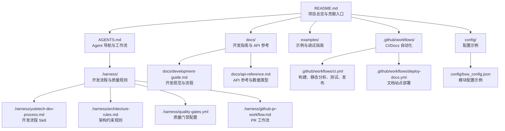
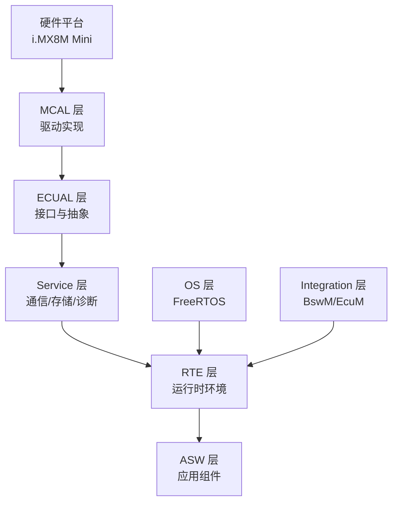
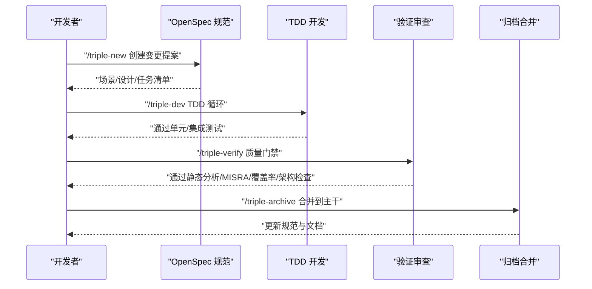
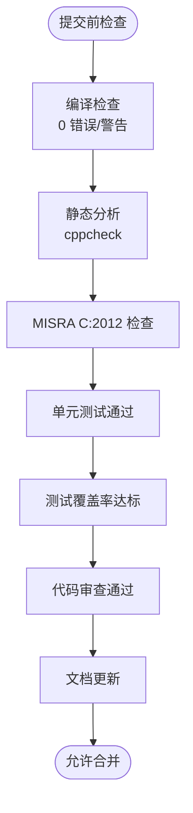
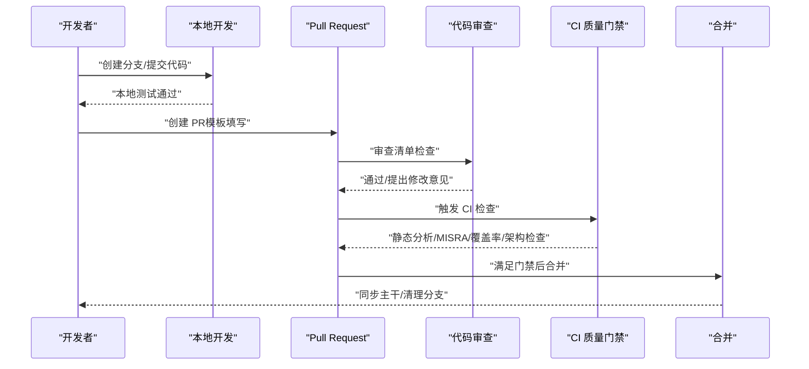
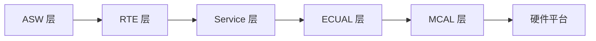

# 社区与贡献

<cite>
**本文引用的文件**
- [README.md](file://README.md)
- [AGENTS.md](file://AGENTS.md)
- [.github/workflows/ci.yml](file://.github/workflows/ci.yml)
- [.github/workflows/deploy-docs.yml](file://.github/workflows/deploy-docs.yml)
- [.harness/yuletech-dev-process.md](file://.harness/yuletech-dev-process.md)
- [.harness/architecture-rules.md](file://.harness/architecture-rules.md)
- [.harness/quality-gates.yml](file://.harness/quality-gates.yml)
- [.harness/github-pr-workflow.md](file://.harness/github-pr-workflow.md)
- [docs/development-guide.md](file://docs/development-guide.md)
- [docs/api-reference.md](file://docs/api-reference.md)
- [examples/README.md](file://examples/README.md)
- [config/bsw_config.json](file://config/bsw_config.json)
</cite>

## 目录
1. [简介](#简介)
2. [项目结构](#项目结构)
3. [核心组件](#核心组件)
4. [架构总览](#架构总览)
5. [详细组件分析](#详细组件分析)
6. [依赖分析](#依赖分析)
7. [性能考虑](#性能考虑)
8. [故障排查指南](#故障排查指南)
9. [结论](#结论)
10. [附录](#附录)

## 简介
本指南面向希望参与 YuleTech AutoSAR BSW 平台的开发者与社区成员，系统阐述项目的开源治理模式、社区参与方式、贡献流程、代码审查标准、行为准则、知识产权与许可证要求，并提供问题报告模板、功能请求流程、文档贡献指南、补丁提交方式与加入维护者团队的路径。同时，结合项目愿景、价值观与发展路线，帮助你在社区中建立高效、协作、高质量的合作关系。

## 项目结构
YuleTech BSW 平台采用分层架构与模块化组织，围绕 AutoSAR Classic Platform 4.x 标准构建，涵盖 MCAL、ECUAL、Service、RTE、ASW、OS、Integration 等层级，配套开发流程、质量门禁与自动化流水线，形成“规范驱动 + TDD + 质量门禁”的工程体系。

图表来源
- [README.md:1-326](file://README.md#L1-L326)
- [AGENTS.md:1-229](file://AGENTS.md#L1-L229)
- [.harness/yuletech-dev-process.md:1-223](file://.harness/yuletech-dev-process.md#L1-L223)
- [.harness/architecture-rules.md:1-255](file://.harness/architecture-rules.md#L1-L255)
- [.harness/quality-gates.yml:1-274](file://.harness/quality-gates.yml#L1-L274)
- [.harness/github-pr-workflow.md:1-223](file://.harness/github-pr-workflow.md#L1-L223)
- [docs/development-guide.md:1-684](file://docs/development-guide.md#L1-L684)
- [docs/api-reference.md:1-609](file://docs/api-reference.md#L1-L609)
- [examples/README.md:1-165](file://examples/README.md#L1-L165)
- [.github/workflows/ci.yml:1-144](file://.github/workflows/ci.yml#L1-L144)
- [.github/workflows/deploy-docs.yml:1-22](file://.github/workflows/deploy-docs.yml#L1-L22)
- [config/bsw_config.json:1-21](file://config/bsw_config.json#L1-L21)

章节来源
- [README.md:153-200](file://README.md#L153-L200)
- [AGENTS.md:21-60](file://AGENTS.md#L21-L60)

## 核心组件
- 开发流程与规范：OpenSpec + Superpowers + Harness Engineering 的 Triple 流程，强调“先规范后实现、TDD 循环、质量门禁”。
- 质量门禁：静态分析、MISRA C:2012、复杂度、测试覆盖率、架构合规、安全检查等多维度质量控制。
- 代码规范：AutoSAR 命名规范、错误检测 DET、内存分区 MemMap、注释与文档要求。
- 贡献流程：GitHub PR 工作流、提交规范、代码审查清单、合并策略。
- 社区与文档：项目愿景、联系方式、示例与调试、文档站点自动化部署。

章节来源
- [.harness/yuletech-dev-process.md:41-100](file://.harness/yuletech-dev-process.md#L41-L100)
- [.harness/architecture-rules.md:47-122](file://.harness/architecture-rules.md#L47-L122)
- [.harness/quality-gates.yml:6-122](file://.harness/quality-gates.yml#L6-L122)
- [.harness/github-pr-workflow.md:12-115](file://.harness/github-pr-workflow.md#L12-L115)
- [docs/development-guide.md:84-278](file://docs/development-guide.md#L84-L278)

## 架构总览
YuleTech BSW 采用 AutoSAR 分层架构，自下而上为 MCAL → ECUAL → Service → RTE → ASW，配合 OS 与 Integration 层，确保模块间通过标准接口耦合，避免跨层与循环依赖。

图表来源
- [.harness/architecture-rules.md:9-23](file://.harness/architecture-rules.md#L9-L23)
- [AGENTS.md:117-131](file://AGENTS.md#L117-L131)

## 详细组件分析

### 开发流程与规范（Triple 流程）
- 阶段划分：初始化工程、需求探索、创建变更、开发执行（TDD）、验证审查、归档合并。
- 规范驱动：每个变更均需在 OpenSpec 中定义场景与设计，再进入实现与验证。
- 代码规范：命名、注释、错误检测、内存分区、AutoSAR 类型与配置分离。
- Git 工作流：feature/fix 分支、提交规范、PR 描述模板、合并策略（merge/squash/rebase）。

图表来源
- [.harness/yuletech-dev-process.md:41-99](file://.harness/yuletech-dev-process.md#L41-L99)
- [.harness/quality-gates.yml:212-242](file://.harness/quality-gates.yml#L212-L242)

章节来源
- [.harness/yuletech-dev-process.md:41-100](file://.harness/yuletech-dev-process.md#L41-L100)
- [docs/development-guide.md:337-428](file://docs/development-guide.md#L337-L428)

### 质量门禁与代码规范
- 静态分析与 MISRA：启用 cppcheck、MISRA C:2012，抑制标准头文件噪声。
- 复杂度与风格：圈复杂度 < 10、函数/文件行数上限、参数数量与嵌套深度限制；命名风格统一。
- 测试覆盖率：MCAL/Service/Utility 不同阈值；TDD 必须通过 RED-GREEN-REFACTOR。
- 安全检查：缓冲区溢出、空指针、整数溢出、use-after-free、格式化字符串等。
- 架构检查：分层依赖、禁止循环依赖、必须使用标准接口、禁止直接硬件访问。
- 文档检查：文件头、函数注释、类型注释、宏注释。

图表来源
- [.harness/quality-gates.yml:6-122](file://.harness/quality-gates.yml#L6-L122)
- [.harness/quality-gates.yml:123-170](file://.harness/quality-gates.yml#L123-L170)
- [.harness/quality-gates.yml:171-191](file://.harness/quality-gates.yml#L171-L191)
- [.harness/quality-gates.yml:192-210](file://.harness/quality-gates.yml#L192-L210)
- [.harness/quality-gates.yml:211-242](file://.harness/quality-gates.yml#L211-L242)

章节来源
- [.harness/architecture-rules.md:47-122](file://.harness/architecture-rules.md#L47-L122)
- [.harness/architecture-rules.md:138-182](file://.harness/architecture-rules.md#L138-L182)
- [.harness/quality-gates.yml:6-122](file://.harness/quality-gates.yml#L6-L122)

### 贡献流程与代码审查
- 分支与提交：feature/*、fix/*；提交信息遵循规范（feat/fix/docs/style/refactor/test/chore）。
- PR 描述模板：变更说明、新增内容、变更统计、检查清单。
- 审查清单：逻辑正确、命名规范、错误处理、注释完整、无安全漏洞。
- 合并策略：merge/squash/rebase，依据场景选择。
- 自动化：CI 检查编译、静态分析、测试、覆盖率；PR 合并前门禁必须通过。

图表来源
- [.harness/github-pr-workflow.md:12-115](file://.harness/github-pr-workflow.md#L12-L115)
- [.harness/github-pr-workflow.md:165-185](file://.harness/github-pr-workflow.md#L165-L185)
- [.github/workflows/ci.yml:9-60](file://.github/workflows/ci.yml#L9-L60)

章节来源
- [.harness/github-pr-workflow.md:12-115](file://.harness/github-pr-workflow.md#L12-L115)
- [.github/workflows/ci.yml:9-60](file://.github/workflows/ci.yml#L9-L60)

### 社区治理与行为准则
- 项目愿景：成为工程师的合作伙伴，提供 AutoSAR 标准的开源基础软件、工具链与活跃社区，降低开发门槛，赋能中国汽车软件产业。
- 参与方式：通过 Issue/PR/讨论参与；遵循贡献流程与质量门禁；尊重他人、包容协作、聚焦技术。
- 维护者团队：通过贡献质量、审查反馈与社区影响力逐步纳入；合并权限与责任由维护者团队决定。

章节来源
- [README.md:36-38](file://README.md#L36-L38)
- [AGENTS.md:17-21](file://AGENTS.md#L17-L21)

### 知识产权与许可证
- 许可证：MIT 许可证，允许自由使用、复制、修改与分发，需保留版权与许可声明。
- 知识产权：项目代码与文档受版权保护，贡献者需确保拥有相应权利或已获得授权。
- 开源合规：遵循 MIT 许可证条款，第三方依赖需满足兼容性与披露要求。

章节来源
- [README.md:306-309](file://README.md#L306-L309)

### 问题报告与功能请求
- 问题报告模板（建议）：
  - 标题：简明扼要描述问题
  - 环境：操作系统、工具链版本、硬件平台
  - 复现步骤：最小可复现步骤
  - 预期行为与实际行为
  - 日志/截图/附加信息
- 功能请求流程：
  - 在 OpenSpec 中创建变更提案，定义场景与设计
  - 与维护者讨论可行性与影响
  - 通过质量门禁后进入开发与验证

章节来源
- [.harness/yuletech-dev-process.md:59-71](file://.harness/yuletech-dev-process.md#L59-L71)
- [.harness/github-pr-workflow.md:65-90](file://.harness/github-pr-workflow.md#L65-L90)

### 文档贡献指南
- 文档类型：开发指南、API 参考、模块说明、变更记录
- 质量要求：结构清晰、术语一致、示例完整、版本与更新时间明确
- 提交流程：与相关模块变更同步，通过 PR 审查与 CI 检查

章节来源
- [docs/development-guide.md:1-15](file://docs/development-guide.md#L1-L15)
- [docs/api-reference.md:1-15](file://docs/api-reference.md#L1-L15)

### 补丁提交与示例调试
- 补丁提交：遵循 PR 工作流与提交规范；提供最小可复现示例与测试
- 示例调试：使用 GDB、IDE 插件、Makefile 调试目标；示例包含构建与烧录步骤

章节来源
- [.harness/github-pr-workflow.md:12-115](file://.harness/github-pr-workflow.md#L12-L115)
- [examples/README.md:130-148](file://examples/README.md#L130-L148)

### 加入维护者团队
- 路径：持续高质量贡献、积极审查他人代码、推动规范落地、参与社区讨论
- 权限：由现有维护者团队评估与授予；承担代码质量与社区治理责任

章节来源
- [.harness/github-pr-workflow.md:92-115](file://.harness/github-pr-workflow.md#L92-L115)

## 依赖分析
- 分层依赖：上层可依赖下层，禁止跨层与循环依赖
- 接口约束：必须通过标准接口访问，禁止直接硬件访问
- 工具链与生成：代码生成需满足 MISRA 检查与版本信息要求

图表来源
- [.harness/architecture-rules.md:25-34](file://.harness/architecture-rules.md#L25-L34)

章节来源
- [.harness/architecture-rules.md:25-34](file://.harness/architecture-rules.md#L25-L34)

## 性能考虑
- 代码复杂度：函数圈复杂度 < 10，降低维护与测试成本
- 测试覆盖率：MCAL/Service/Utility 分层设定不同覆盖率目标，保障稳定性
- 静态分析与 MISRA：提前发现潜在性能与安全问题
- 配置与生成：配置验证与模板生成减少手工错误，提升一致性

章节来源
- [.harness/quality-gates.yml:75-99](file://.harness/quality-gates.yml#L75-L99)
- [.harness/quality-gates.yml:123-145](file://.harness/quality-gates.yml#L123-L145)
- [.harness/quality-gates.yml:211-242](file://.harness/quality-gates.yml#L211-L242)

## 故障排查指南
- 构建失败：检查工具链版本、CMake 配置、MemMap 分区与编译器选项
- 单元测试失败：对照测试用例定位边界条件与错误处理
- 静态分析/覆盖率异常：根据报告逐项修复，确保注释与复杂度达标
- 文档站点部署失败：检查 Node.js 版本与依赖安装、构建产物路径

章节来源
- [.github/workflows/ci.yml:9-60](file://.github/workflows/ci.yml#L9-L60)
- [.github/workflows/deploy-docs.yml:1-22](file://.github/workflows/deploy-docs.yml#L1-L22)
- [examples/README.md:149-160](file://examples/README.md#L149-L160)

## 结论
YuleTech BSW 平台通过“OpenSpec + Superpowers + Harness Engineering”的工程体系，结合严格的代码规范与质量门禁，形成了高可维护、可验证、可扩展的开源基础软件生态。社区成员可通过规范化的贡献流程与透明的质量控制，高效协作、持续交付，共同推进 AutoSAR 生态在中国汽车产业的应用与演进。

## 附录

### 开发与贡献常用命令
- 初始化工程：/triple-init
- 需求探索：/triple-explore
- 创建变更：/triple-new "描述"
- 开发执行：/triple-dev
- 验证审查：/triple-verify
- 归档合并：/triple-archive
- PR 创建与合并：参考 GitHub API 与合并策略

章节来源
- [README.md:279-300](file://README.md#L279-L300)
- [.harness/yuletech-dev-process.md:41-99](file://.harness/yuletech-dev-process.md#L41-L99)
- [.harness/github-pr-workflow.md:116-141](file://.harness/github-pr-workflow.md#L116-L141)