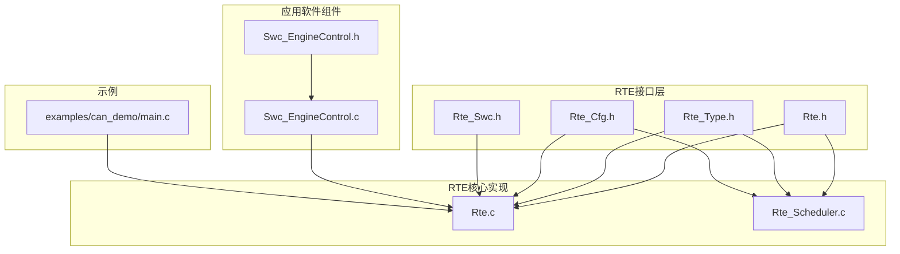
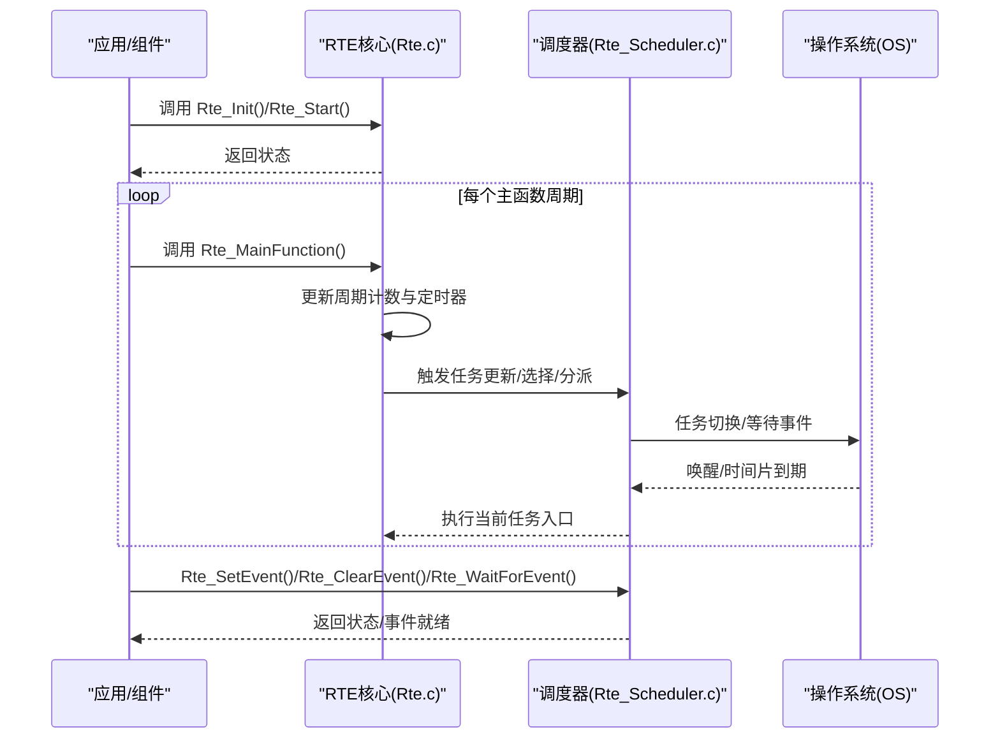
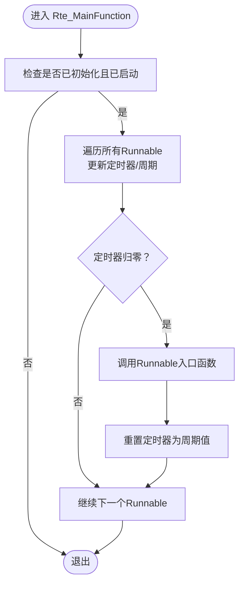
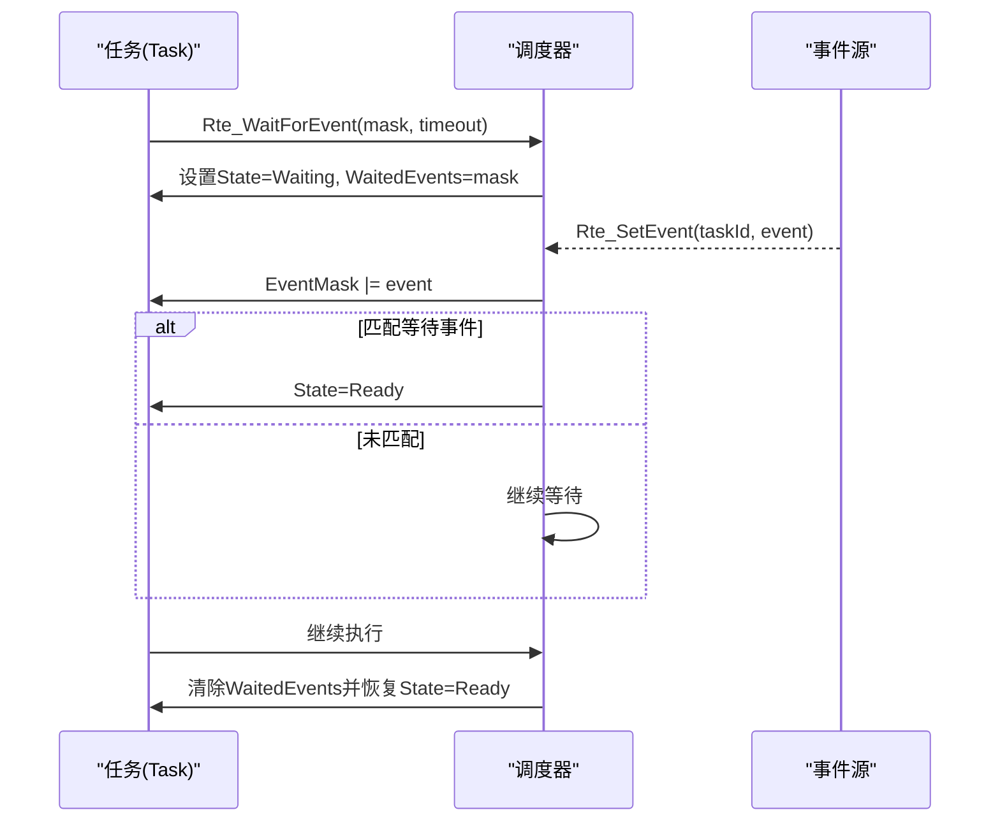
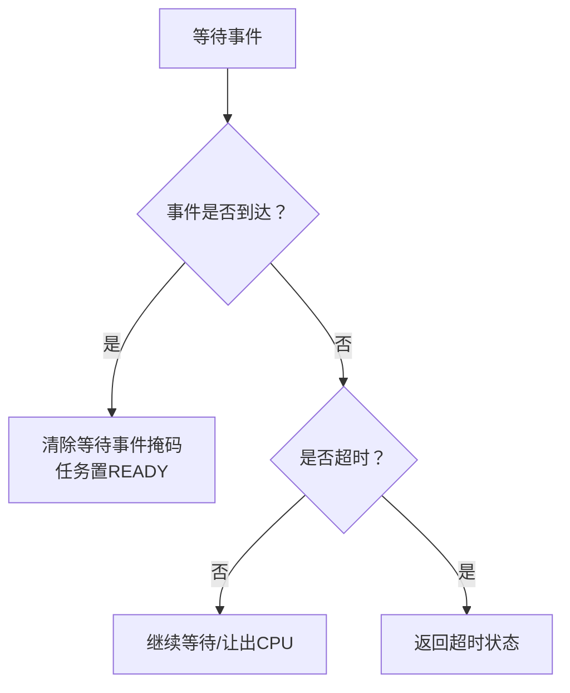
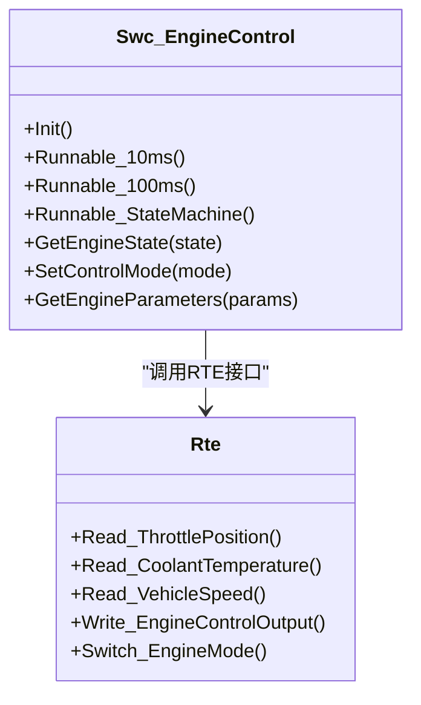
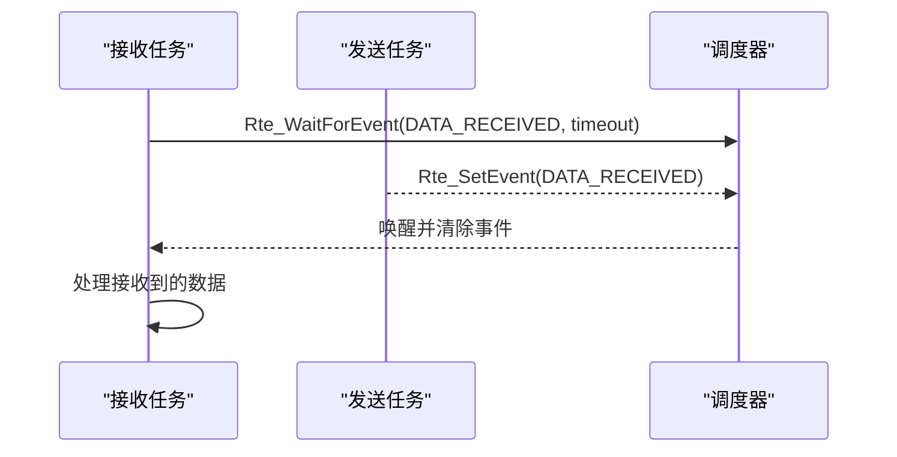
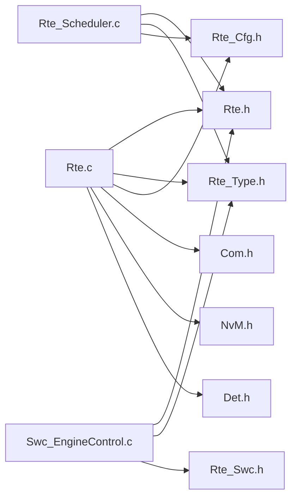

# RTE可执行单元与事件系统

<cite>
**本文档引用的文件**
- [Rte.h](file://src/bsw/rte/include/Rte.h)
- [Rte.c](file://src/bsw/rte/src/Rte.c)
- [Rte_Type.h](file://src/bsw/rte/include/Rte_Type.h)
- [Rte_Cfg.h](file://src/bsw/rte/include/Rte_Cfg.h)
- [Rte_Swc.h](file://src/bsw/rte/include/Rte_Swc.h)
- [Rte_Scheduler.c](file://src/bsw/rte/src/Rte_Scheduler.c)
- [Swc_EngineControl.h](file://src/asw/engine_control/include/Swc_EngineControl.h)
- [Swc_EngineControl.c](file://src/asw/engine_control/src/Swc_EngineControl.c)
- [main.c](file://examples/can_demo/main.c)
</cite>

## 目录
1. [引言](#引言)
2. [项目结构](#项目结构)
3. [核心组件](#核心组件)
4. [架构总览](#架构总览)
5. [详细组件分析](#详细组件分析)
6. [依赖关系分析](#依赖关系分析)
7. [性能考虑](#性能考虑)
8. [故障排除指南](#故障排除指南)
9. [结论](#结论)
10. [附录](#附录)

## 引言
本文件面向RTE（运行时环境）可执行单元与事件系统的开发者与使用者，系统性阐述以下主题：
- 可执行单元（Runnable）的概念、生命周期与调度机制
- 事件驱动模型：事件设置、清除与等待（Rte_SetEvent、Rte_ClearEvent、Rte_WaitForEvent）
- 事件掩码使用、超时处理与优先级管理
- 可执行单元调度原理、事件传播机制与同步原语
- 实际代码示例展示事件驱动编程模式与多线程同步技巧

本说明严格基于仓库中的RTE实现与相关示例，确保内容可追溯、可验证。

## 项目结构
RTE子系统位于src/bsw/rte目录，采用分层设计：
- 接口层：Rte.h、Rte_Type.h、Rte_Cfg.h、Rte_Swc.h
- 核心实现：Rte.c（基础RTE功能）、Rte_Scheduler.c（任务与事件调度）
- 应用软件组件（ASW）：如引擎控制组件Swc_EngineControl.*，展示Runnable与RTE接口的使用
- 示例工程：examples/can_demo/main.c，演示底层通信与RTE主循环的配合

**图表来源**
- [Rte.h:1-441](file://src/bsw/rte/include/Rte.h#L1-L441)
- [Rte.c:1-792](file://src/bsw/rte/src/Rte.c#L1-L792)
- [Rte_Type.h:1-361](file://src/bsw/rte/include/Rte_Type.h#L1-L361)
- [Rte_Cfg.h:1-280](file://src/bsw/rte/include/Rte_Cfg.h#L1-L280)
- [Rte_Swc.h:1-406](file://src/bsw/rte/include/Rte_Swc.h#L1-L406)
- [Rte_Scheduler.c:1-590](file://src/bsw/rte/src/Rte_Scheduler.c#L1-L590)
- [Swc_EngineControl.h:1-183](file://src/asw/engine_control/include/Swc_EngineControl.h#L1-L183)
- [Swc_EngineControl.c:1-540](file://src/asw/engine_control/src/Swc_EngineControl.c#L1-L540)
- [main.c:1-119](file://examples/can_demo/main.c#L1-L119)

**章节来源**
- [Rte.h:1-441](file://src/bsw/rte/include/Rte.h#L1-L441)
- [Rte.c:1-792](file://src/bsw/rte/src/Rte.c#L1-L792)
- [Rte_Type.h:1-361](file://src/bsw/rte/include/Rte_Type.h#L1-L361)
- [Rte_Cfg.h:1-280](file://src/bsw/rte/include/Rte_Cfg.h#L1-L280)
- [Rte_Swc.h:1-406](file://src/bsw/rte/include/Rte_Swc.h#L1-L406)
- [Rte_Scheduler.c:1-590](file://src/bsw/rte/src/Rte_Scheduler.c#L1-L590)
- [Swc_EngineControl.h:1-183](file://src/asw/engine_control/include/Swc_EngineControl.h#L1-L183)
- [Swc_EngineControl.c:1-540](file://src/asw/engine_control/src/Swc_EngineControl.c#L1-L540)
- [main.c:1-119](file://examples/can_demo/main.c#L1-L119)

## 核心组件
本节聚焦RTE可执行单元与事件系统的核心构件及其职责。

- 可执行单元（Runnable）
  - 定义：软件组件中按周期或事件触发执行的功能单元
  - 生命周期：初始化、激活（Rte_RunnableActivate）、终止（Rte_RunnableTerminate）、销毁
  - 调度：由RTE内部定时器驱动周期性执行；也可通过事件驱动等待与唤醒

- 事件系统
  - 事件类型：数据接收、发送完成、操作调用/完成、模式切换、定时、错误等
  - 事件掩码：位掩码组合多个事件，支持按位匹配与清除
  - 同步原语：Rte_SetEvent、Rte_ClearEvent、Rte_WaitForEvent

- 系统状态与配置
  - 内部状态：Rte_InternalState（初始化、启动、周期计数、主函数定时器等）
  - 配置参数：RTE_MAIN_FUNCTION_PERIOD_MS、默认/最大超时、组件/端口/Runnable数量上限等

**章节来源**
- [Rte.h:265-316](file://src/bsw/rte/include/Rte.h#L265-L316)
- [Rte_Type.h:124-140](file://src/bsw/rte/include/Rte_Type.h#L124-L140)
- [Rte.c:46-106](file://src/bsw/rte/src/Rte.c#L46-L106)
- [Rte_Cfg.h:103-112](file://src/bsw/rte/include/Rte_Cfg.h#L103-L112)

## 架构总览
RTE在AutoSAR经典平台4.x标准下，提供组件间通信与调度能力。其核心流程如下：
- 初始化阶段：Rte_Init()建立内部状态，Rte_Start()进入运行态
- 主循环：Rte_MainFunction()按固定周期推进定时器与周期性Runnable
- 事件调度：Rte_Scheduler_*系列函数负责任务创建、激活、终止与事件等待
- 组件交互：ASW通过Rte.h声明的读写接口与模式切换接口与RTE交互

**图表来源**
- [Rte.c:387-397](file://src/bsw/rte/src/Rte.c#L387-L397)
- [Rte_Scheduler.c:530-558](file://src/bsw/rte/src/Rte_Scheduler.c#L530-L558)
- [Rte.h:265-316](file://src/bsw/rte/include/Rte.h#L265-L316)

## 详细组件分析

### 可执行单元（Runnable）与生命周期
- 激活与终止
  - Rte_RunnableActivate(instance, runnableId)：激活指定Runnable
  - Rte_RunnableTerminate(instance, runnableId)：终止指定Runnable
- 周期性执行
  - Rte_MainFunction()在每个周期递增内部计数并推进各Runnable的定时器
  - 当定时器归零时，调用对应Runnable入口函数

**图表来源**
- [Rte.c:177-199](file://src/bsw/rte/src/Rte.c#L177-L199)
- [Rte.c:163-172](file://src/bsw/rte/src/Rte.c#L163-L172)

**章节来源**
- [Rte.h:265-316](file://src/bsw/rte/include/Rte.h#L265-L316)
- [Rte.c:208-255](file://src/bsw/rte/src/Rte.c#L208-L255)
- [Rte.c:387-397](file://src/bsw/rte/src/Rte.c#L387-L397)

### 事件系统：设置、清除与等待
- 事件设置：Rte_SetEvent(instance, event)
  - 将事件掩码写入目标任务的EventMask
  - 若任务处于等待状态且等待的事件被设置，则将其置为READY
- 事件清除：Rte_ClearEvent(instance, event)
  - 清除任务事件掩码中对应的事件位
- 事件等待：Rte_WaitForEvent(instance, eventMask, timeout)
  - 将任务置为WAITING，等待eventMask中任一事件发生
  - 支持超时：达到timeout后返回超时状态并清除等待标志

**图表来源**
- [Rte_Scheduler.c:378-445](file://src/bsw/rte/src/Rte_Scheduler.c#L378-L445)
- [Rte_Scheduler.c:450-491](file://src/bsw/rte/src/Rte_Scheduler.c#L450-L491)
- [Rte_Scheduler.c:496-525](file://src/bsw/rte/src/Rte_Scheduler.c#L496-L525)

**章节来源**
- [Rte.h:284-307](file://src/bsw/rte/include/Rte.h#L284-L307)
- [Rte_Scheduler.c:378-525](file://src/bsw/rte/src/Rte_Scheduler.c#L378-L525)

### 事件掩码、超时与优先级
- 事件掩码
  - 使用Rte_EventType（uint8）表示事件集合，典型掩码包括数据接收、发送完成、操作完成、模式切换、定时、错误等
- 超时处理
  - Rte_WaitForEvent(timeout)支持毫秒级超时，超时后返回超时状态
- 优先级管理
  - 任务优先级由调度器维护，选择最高优先级READY任务执行
  - 当更高优先级任务就绪时，可抢占当前运行任务

**图表来源**
- [Rte_Scheduler.c:409-431](file://src/bsw/rte/src/Rte_Scheduler.c#L409-L431)
- [Rte_Type.h:124-140](file://src/bsw/rte/include/Rte_Type.h#L124-L140)

**章节来源**
- [Rte_Type.h:124-140](file://src/bsw/rte/include/Rte_Type.h#L124-L140)
- [Rte_Scheduler.c:378-445](file://src/bsw/rte/src/Rte_Scheduler.c#L378-L445)

### 软件组件与Runnable示例
以引擎控制组件为例，展示Runnable的定义与使用：
- Runnable定义：10ms快速回路、100ms慢速回路、状态机Runnable
- 数据读写：通过Rte_Read_*与Rte_Write_*接口访问端口数据
- 模式切换：通过Rte_Switch_*接口切换运行模式

**图表来源**
- [Swc_EngineControl.h:96-150](file://src/asw/engine_control/include/Swc_EngineControl.h#L96-L150)
- [Swc_EngineControl.c:359-407](file://src/asw/engine_control/src/Swc_EngineControl.c#L359-L407)
- [Rte.h:365-390](file://src/bsw/rte/include/Rte.h#L365-L390)

**章节来源**
- [Swc_EngineControl.h:70-150](file://src/asw/engine_control/include/Swc_EngineControl.h#L70-L150)
- [Swc_EngineControl.c:359-407](file://src/asw/engine_control/src/Swc_EngineControl.c#L359-L407)

### 事件驱动编程模式与多线程同步技巧
- 事件驱动模式
  - 任务通过Rte_WaitForEvent等待特定事件，避免忙等
  - 事件源通过Rte_SetEvent唤醒等待任务
- 多线程同步
  - 在任务等待期间，调度器可让出CPU给其他任务
  - 通过优先级抢占实现高优先级任务及时响应

**图表来源**
- [Rte_Scheduler.c:378-445](file://src/bsw/rte/src/Rte_Scheduler.c#L378-L445)
- [Rte_Scheduler.c:450-491](file://src/bsw/rte/src/Rte_Scheduler.c#L450-L491)

**章节来源**
- [Rte_Scheduler.c:378-491](file://src/bsw/rte/src/Rte_Scheduler.c#L378-L491)

## 依赖关系分析
RTE模块之间的依赖关系如下：
- Rte.c依赖Rte.h、Rte_Type.h、Rte_Cfg.h、Com/NvM/Det等外部模块
- Rte_Scheduler.c依赖Rte.h、Rte_Type.h进行任务与事件管理
- ASW组件（如引擎控制）依赖Rte.h与自动生成的Rte_Swc.h接口

**图表来源**
- [Rte.c:19-26](file://src/bsw/rte/src/Rte.c#L19-L26)
- [Rte_Scheduler.c:19-22](file://src/bsw/rte/src/Rte_Scheduler.c#L19-L22)
- [Swc_EngineControl.c:15-18](file://src/asw/engine_control/src/Swc_EngineControl.c#L15-L18)

**章节来源**
- [Rte.c:19-26](file://src/bsw/rte/src/Rte.c#L19-L26)
- [Rte_Scheduler.c:19-22](file://src/bsw/rte/src/Rte_Scheduler.c#L19-L22)
- [Swc_EngineControl.c:15-18](file://src/asw/engine_control/src/Swc_EngineControl.c#L15-L18)

## 性能考虑
- 主函数周期
  - 默认周期为10ms（RTE_MAIN_FUNCTION_PERIOD_MS），影响Runnable与事件等待的最小粒度
- 事件等待开销
  - Rte_WaitForEvent在等待期间可能进行简单让出，建议结合具体OS实现优化
- 任务优先级
  - 通过优先级抢占减少高优先级任务延迟，但需避免优先级反转
- 缓冲与拷贝
  - 端口缓冲区大小（RTE_MAX_BUFFER_SIZE）限制单次传输数据量，注意内存与带宽约束

**章节来源**
- [Rte_Cfg.h:105](file://src/bsw/rte/include/Rte_Cfg.h#L105)
- [Rte.c:502-510](file://src/bsw/rte/src/Rte.c#L502-L510)

## 故障排除指南
- 常见错误码
  - 未初始化（RTE_E_UNINIT）、越界（RTE_E_OUT_OF_RANGE）、无数据（RTE_E_NO_DATA）、超时（RTE_E_TIMEOUT）、段错误（RTE_E_SEG_FAULT）等
- 错误检测
  - 开启RTE_DEV_ERROR_DETECT后，Rte_*系列函数在参数非法或状态异常时上报DET错误
- 排查步骤
  - 确认Rte_Init()与Rte_Start()调用顺序正确
  - 检查Runnable定时器是否正确配置，避免定时器不归零导致无法执行
  - 检查事件掩码与等待事件是否一致，避免事件未触发导致超时

**章节来源**
- [Rte.h:54-69](file://src/bsw/rte/include/Rte.h#L54-L69)
- [Rte.c:36-41](file://src/bsw/rte/src/Rte.c#L36-L41)
- [Rte.c:264-287](file://src/bsw/rte/src/Rte.c#L264-L287)

## 结论
RTE可执行单元与事件系统提供了AutoSAR经典平台下的组件通信与调度框架。通过Runnable的周期性执行与事件驱动等待，系统实现了高效的任务管理与数据交换。结合事件掩码、超时与优先级机制，可在复杂嵌入式场景中实现可靠的实时行为。建议在实际项目中：
- 明确Runnable周期与事件边界，避免竞态与死锁
- 合理设置事件掩码与超时，平衡实时性与可靠性
- 利用DET错误检测提升系统可观测性与可维护性

## 附录
- 关键API速查
  - 初始化与启动：Rte_Init()、Rte_Start()、Rte_Stop()
  - 可执行单元：Rte_RunnableActivate()、Rte_RunnableTerminate()
  - 事件：Rte_SetEvent()、Rte_ClearEvent()、Rte_WaitForEvent()
  - 主循环：Rte_MainFunction()

**章节来源**
- [Rte.h:76-316](file://src/bsw/rte/include/Rte.h#L76-L316)