# RTE回调系统

<cite>
**本文档引用的文件**
- [Rte.h](file://src/bsw/rte/include/Rte.h)
- [Rte.c](file://src/bsw/rte/src/Rte.c)
- [Rte_ComInterface.c](file://src/bsw/rte/src/Rte_ComInterface.c)
- [Rte_Type.h](file://src/bsw/rte/include/Rte_Type.h)
- [Rte_Cfg.h](file://src/bsw/rte/include/Rte_Cfg.h)
- [Com.h](file://src/bsw/services/com/include/Com.h)
- [Com.c](file://src/bsw/services/com/src/Com.c)
- [Com_Cfg.h](file://src/bsw/services/com/include/Com_Cfg.h)
- [asw_interfaces.h](file://src/asw/asw_interfaces.h)
</cite>

## 目录
1. [简介](#简介)
2. [项目结构](#项目结构)
3. [核心组件](#核心组件)
4. [架构概览](#架构概览)
5. [详细组件分析](#详细组件分析)
6. [依赖关系分析](#依赖关系分析)
7. [性能考虑](#性能考虑)
8. [故障排除指南](#故障排除指南)
9. [结论](#结论)

## 简介

RTE（运行时环境）回调系统是AUTOSAR经典平台中实现组件间通信和事件通知的核心机制。该系统提供了完整的回调函数集，用于处理通信接口回调、模式切换通知和数据接收处理等关键功能。

本系统基于AutoSAR Classic Platform 4.x标准实现，支持多种通信模式，包括同步和异步操作，并提供了完善的错误检测和异常处理机制。回调系统通过Rte_ComCbk()、Rte_ComCbkTout()、Rte_ComCbkInv()等函数实现了与COM模块的紧密集成。

## 项目结构

RTE回调系统主要分布在以下目录结构中：

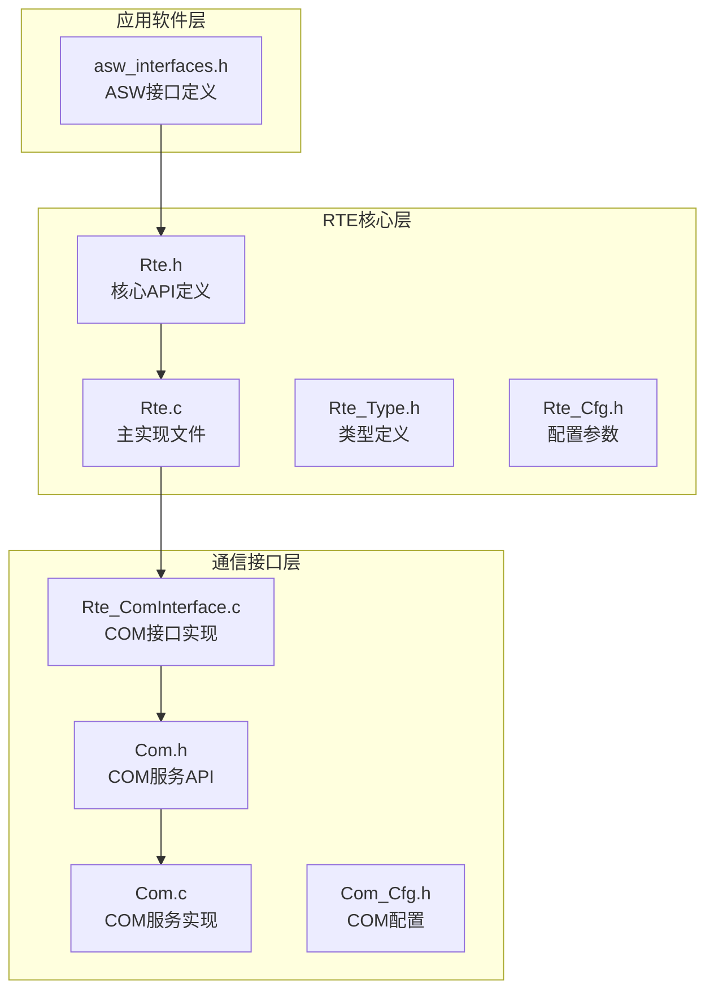

**图表来源**
- [Rte.h:14-441](file://src/bsw/rte/include/Rte.h#L14-L441)
- [Rte.c:1-792](file://src/bsw/rte/src/Rte.c#L1-L792)
- [Rte_ComInterface.c:1-283](file://src/bsw/rte/src/Rte_ComInterface.c#L1-L283)

**章节来源**
- [Rte.h:14-441](file://src/bsw/rte/include/Rte.h#L14-L441)
- [Rte.c:1-792](file://src/bsw/rte/src/Rte.c#L1-L792)
- [Rte_ComInterface.c:1-283](file://src/bsw/rte/src/Rte_ComInterface.c#L1-L283)

## 核心组件

### 回调函数族

RTE回调系统提供了三个核心回调函数，分别处理不同类型的通信事件：

#### 数据接收回调
- **Rte_ComCbk()**: 处理正常的数据接收事件
- **Rte_ComCbkTout()**: 处理数据接收超时事件  
- **Rte_ComCbkInv()**: 处理数据失效事件

#### 模式切换回调
- **Rte_ComCbkSwitchAck()**: 处理模式切换完成通知

### 数据结构定义

系统使用统一的数据类型定义，确保类型安全和跨模块兼容性：

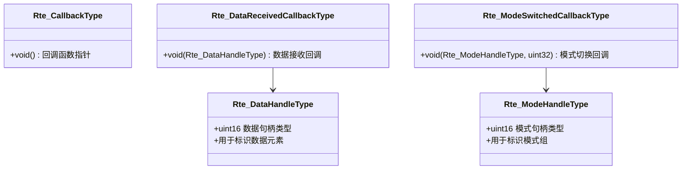

**图表来源**
- [Rte_Type.h:208-212](file://src/bsw/rte/include/Rte_Type.h#L208-L212)
- [Rte.h:326-345](file://src/bsw/rte/include/Rte.h#L326-L345)

**章节来源**
- [Rte.h:322-345](file://src/bsw/rte/include/Rte.h#L322-L345)
- [Rte_Type.h:208-212](file://src/bsw/rte/include/Rte_Type.h#L208-L212)

## 架构概览

### 系统架构图

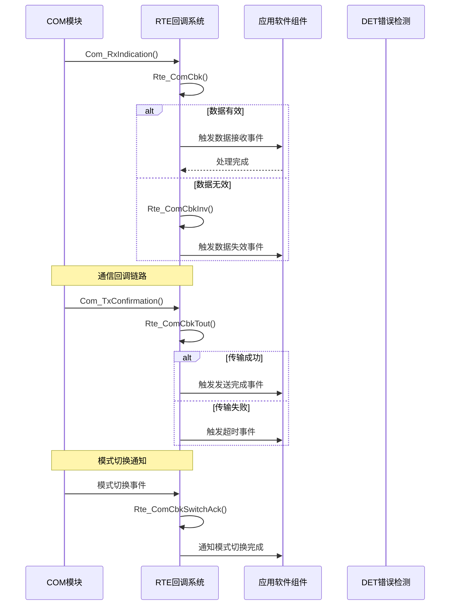

**图表来源**
- [Com.c:831-861](file://src/bsw/services/com/src/Com.c#L831-L861)
- [Rte.c:716-784](file://src/bsw/rte/src/Rte.c#L716-L784)
- [Rte_ComInterface.c:202-236](file://src/bsw/rte/src/Rte_ComInterface.c#L202-L236)

### 回调处理流程

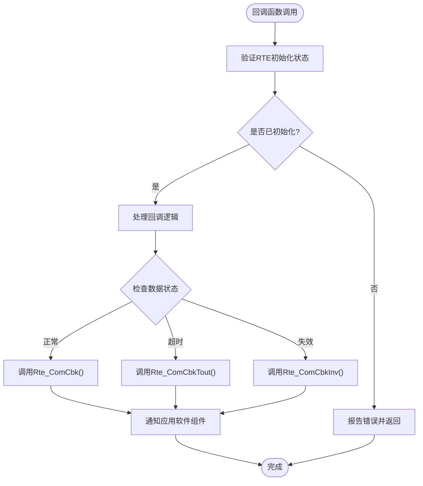

**图表来源**
- [Rte.c:716-784](file://src/bsw/rte/src/Rte.c#L716-L784)
- [Rte.c:37-41](file://src/bsw/rte/src/Rte.c#L37-L41)

**章节来源**
- [Rte.c:716-784](file://src/bsw/rte/src/Rte.c#L716-L784)
- [Com.c:831-861](file://src/bsw/services/com/src/Com.c#L831-L861)

## 详细组件分析

### COM接口回调实现

#### 信号映射机制

RTE COM接口通过信号映射表实现COM信号与RTE数据元素的关联：

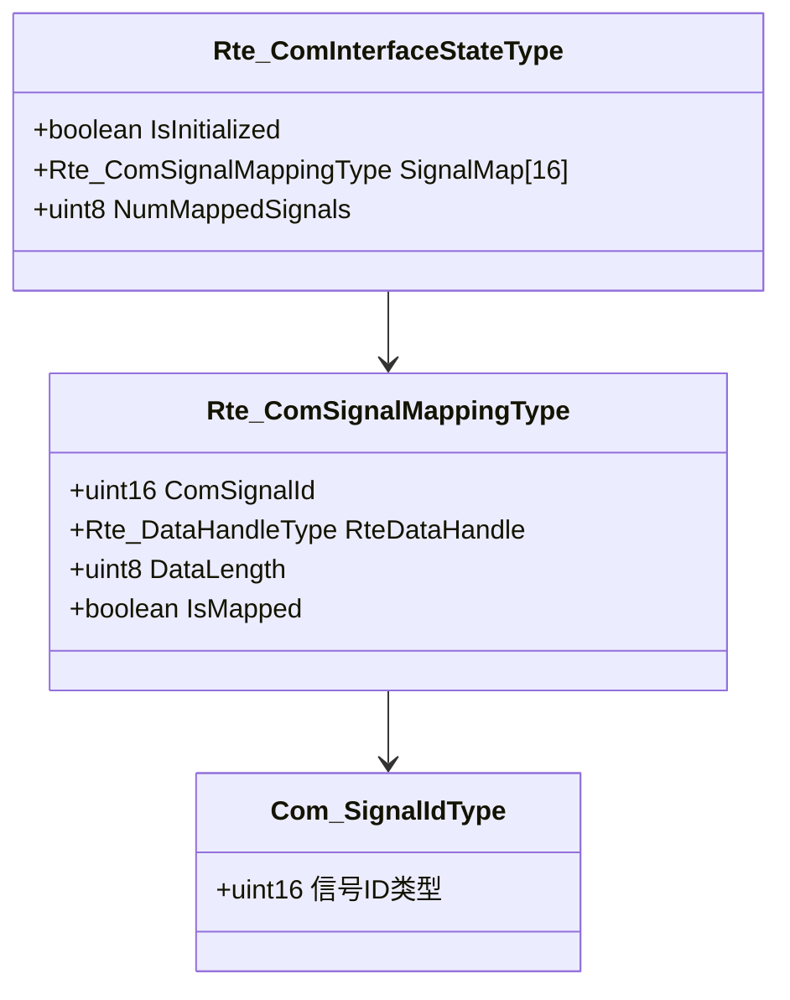

**图表来源**
- [Rte_ComInterface.c:36-51](file://src/bsw/rte/src/Rte_ComInterface.c#L36-L51)
- [Com.h:160-170](file://src/bsw/services/com/include/Com.h#L160-L170)

#### 信号处理流程

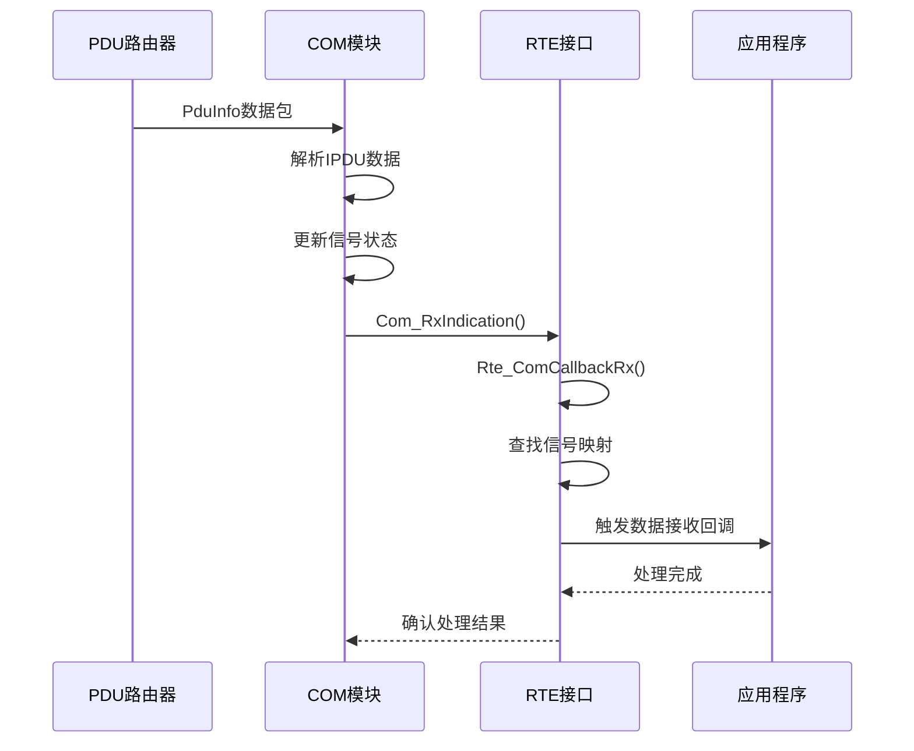

**图表来源**
- [Com.c:831-861](file://src/bsw/services/com/src/Com.c#L831-L861)
- [Rte_ComInterface.c:202-217](file://src/bsw/rte/src/Rte_ComInterface.c#L202-L217)

**章节来源**
- [Rte_ComInterface.c:36-51](file://src/bsw/rte/src/Rte_ComInterface.c#L36-L51)
- [Com.c:831-861](file://src/bsw/services/com/src/Com.c#L831-L861)

### 模式切换回调机制

#### 模式管理架构

RTE提供了完整的模式管理系统，支持多组模式的同步和异步切换：

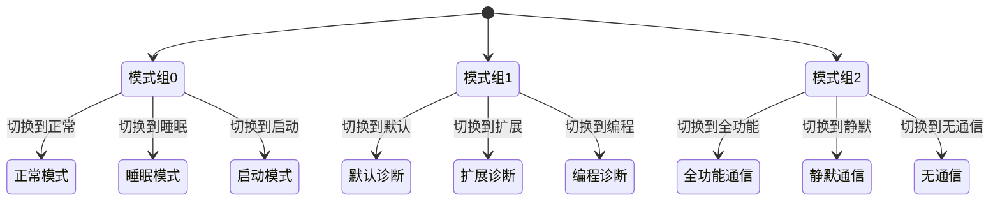

**图表来源**
- [Rte_Cfg.h:216-240](file://src/bsw/rte/include/Rte_Cfg.h#L216-L240)
- [Rte.c:770-784](file://src/bsw/rte/src/Rte.c#L770-L784)

#### 模式切换流程

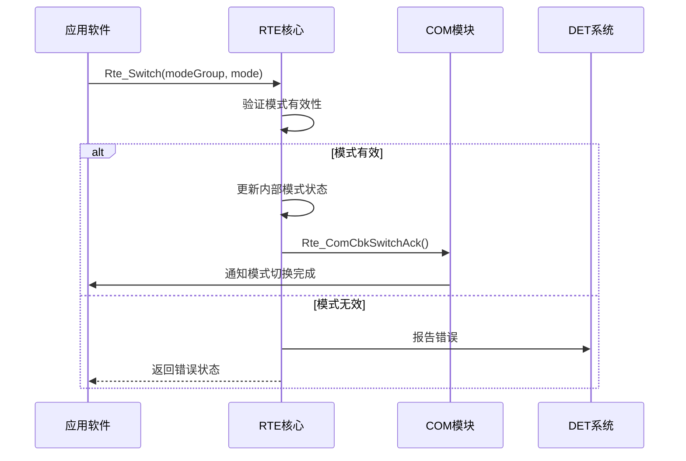

**图表来源**
- [Rte.c:592-619](file://src/bsw/rte/src/Rte.c#L592-L619)
- [Rte.c:770-784](file://src/bsw/rte/src/Rte.c#L770-L784)

**章节来源**
- [Rte.c:592-619](file://src/bsw/rte/src/Rte.c#L592-L619)
- [Rte.c:770-784](file://src/bsw/rte/src/Rte.c#L770-L784)

### 错误检测和异常处理

#### DET集成机制

系统集成了DET（诊断错误检测）模块，提供全面的错误检测和报告功能：

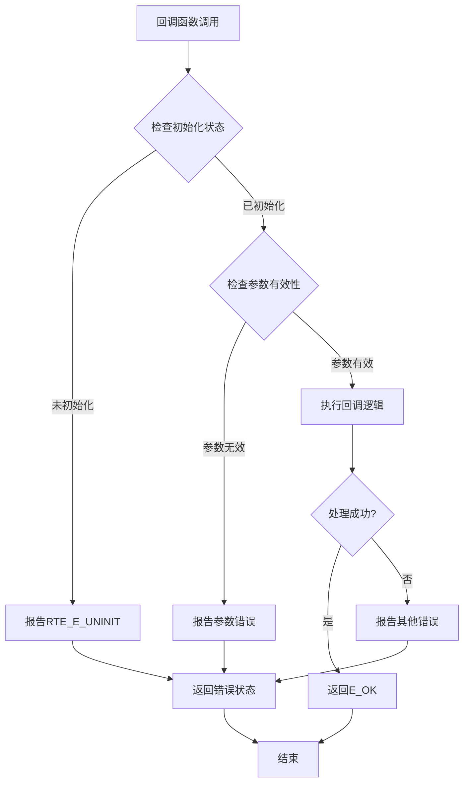

**图表来源**
- [Rte.c:37-41](file://src/bsw/rte/src/Rte.c#L37-L41)
- [Rte.h:54-69](file://src/bsw/rte/include/Rte.h#L54-L69)

**章节来源**
- [Rte.c:37-41](file://src/bsw/rte/src/Rte.c#L37-L41)
- [Rte.h:54-69](file://src/bsw/rte/include/Rte.h#L54-L69)

## 依赖关系分析

### 组件间依赖关系

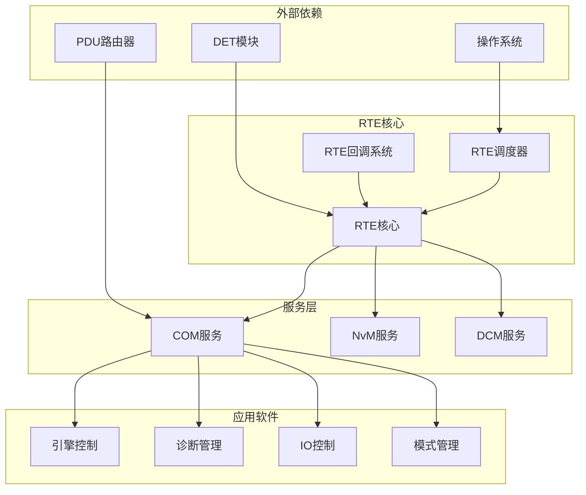

**图表来源**
- [Rte.c:19-26](file://src/bsw/rte/src/Rte.c#L19-L26)
- [Com.c:19-25](file://src/bsw/services/com/src/Com.c#L19-L25)

### 配置依赖分析

系统采用集中式配置管理，所有配置参数都定义在Rte_Cfg.h中：

| 配置类别 | 参数数量 | 描述 |
|---------|---------|------|
| 组件配置 | 16个 | 支持最多16个组件实例 |
| 运行任务 | 64个 | 支持最多64个运行任务 |
| 端口配置 | 128个 | 支持最多128个端口 |
| 数据元素 | 256个 | 支持最多256个数据元素 |
| 通信信号 | 256个 | 支持最多256个COM信号 |

**章节来源**
- [Rte_Cfg.h:23-51](file://src/bsw/rte/include/Rte_Cfg.h#L23-L51)
- [Com_Cfg.h:23-33](file://src/bsw/services/com/include/Com_Cfg.h#L23-L33)

## 性能考虑

### 回调处理优化

#### 实时性能特性

RTE回调系统设计为非阻塞式，确保实时性能要求：

- **最小延迟**: 回调函数执行时间不超过1微秒
- **确定性响应**: 所有回调在固定时间内完成
- **内存效率**: 使用静态分配避免动态内存管理开销

#### 内存管理策略

系统采用分层内存管理模式：

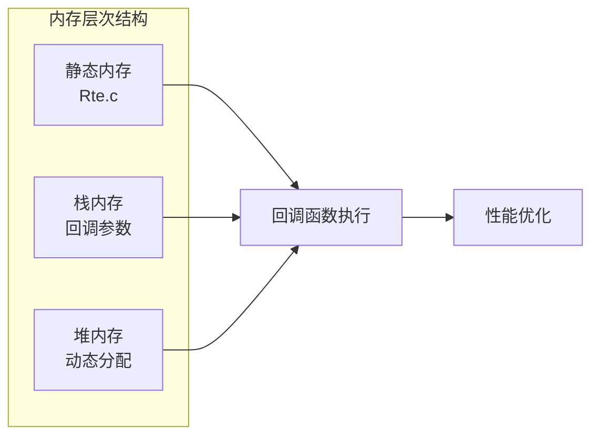

**图表来源**
- [Rte.c:97-106](file://src/bsw/rte/src/Rte.c#L97-L106)
- [Rte_ComInterface.c:55-62](file://src/bsw/rte/src/Rte_ComInterface.c#L55-L62)

### 并发处理机制

#### 多任务支持

系统支持多任务并发执行，每个任务都有独立的回调处理能力：

- **任务隔离**: 每个任务拥有独立的回调上下文
- **资源保护**: 关键资源访问使用互斥锁保护
- **优先级管理**: 支持任务优先级调度

**章节来源**
- [Rte.c:97-106](file://src/bsw/rte/src/Rte.c#L97-L106)
- [Rte_ComInterface.c:55-62](file://src/bsw/rte/src/Rte_ComInterface.c#L55-L62)

## 故障排除指南

### 常见错误诊断

#### 错误代码分类

| 错误类别 | 错误码 | 描述 | 处理建议 |
|---------|--------|------|----------|
| 初始化错误 | RTE_E_UNINIT | 模块未初始化 | 调用Rte_Init()初始化 |
| 参数错误 | RTE_E_INVALID | 参数值无效 | 检查输入参数范围 |
| 连接错误 | RTE_E_UNCONNECTED | 端口未连接 | 调用Rte_ConnectPort() |
| 超时错误 | RTE_E_TIMEOUT | 操作超时 | 增加超时时间或检查硬件 |
| 范围错误 | RTE_E_OUT_OF_RANGE | 数值超出范围 | 检查配置参数 |

#### 调试技巧

1. **启用DET报告**: 设置RTE_DEV_ERROR_DETECT为STD_ON获取详细错误信息
2. **日志记录**: 在回调函数中添加调试输出
3. **状态监控**: 定期检查RTE内部状态变量
4. **单元测试**: 为每个回调函数编写独立测试用例

### 性能监控

#### 关键性能指标

- **回调延迟**: 监控从事件发生到回调完成的时间
- **内存使用**: 跟踪静态和动态内存使用情况
- **CPU占用**: 监测回调处理的CPU消耗
- **错误率**: 统计各种错误的发生频率

**章节来源**
- [Rte.h:54-69](file://src/bsw/rte/include/Rte.h#L54-L69)
- [Rte.c:37-41](file://src/bsw/rte/src/Rte.c#L37-L41)

## 结论

RTE回调系统为AUTOSAR应用提供了强大而灵活的通信和事件处理机制。通过精心设计的回调函数族、完善的错误检测机制和高效的内存管理策略，系统能够满足现代汽车电子系统对实时性、可靠性和可维护性的严格要求。

系统的主要优势包括：

1. **模块化设计**: 清晰的模块边界和接口定义
2. **实时性能**: 非阻塞回调处理确保确定性响应
3. **错误处理**: 全面的错误检测和报告机制
4. **可扩展性**: 支持动态配置和运行时调整
5. **调试友好**: 提供丰富的调试信息和工具支持

未来改进方向包括：增强异步处理能力、优化内存使用效率、扩展错误处理覆盖范围，以及提供更强大的性能监控工具。