# RTE宏定义与工具函数

<cite>
**本文档引用的文件**
- [Rte.h](file://src/bsw/rte/include/Rte.h)
- [Rte_Cfg.h](file://src/bsw/rte/include/Rte_Cfg.h)
- [Rte.c](file://src/bsw/rte/src/Rte.c)
- [Rte_Type.h](file://src/bsw/rte/include/Rte_Type.h)
- [rte_generator.py](file://tools/rte_generator/rte_generator.py)
- [example_config.json](file://tools/rte_generator/example_config.json)
- [Swc_EngineControl.h](file://src/asw/engine_control/include/Swc_EngineControl.h)
- [Swc_EngineControl.c](file://src/asw/engine_control/src/Swc_EngineControl.c)
</cite>

## 目录
1. [简介](#简介)
2. [项目结构](#项目结构)
3. [核心组件](#核心组件)
4. [架构概览](#架构概览)
5. [详细组件分析](#详细组件分析)
6. [依赖关系分析](#依赖关系分析)
7. [性能考虑](#性能考虑)
8. [故障排除指南](#故障排除指南)
9. [结论](#结论)

## 简介

本文档深入分析了YuleTech AutoSAR BSW项目中的RTE（运行时环境）宏定义与工具函数。RTE作为AutoSAR经典平台4.x标准的核心组件，提供了软件组件间的通信机制和接口抽象。本文档重点关注Rte.h中定义的各种宏工具，包括RTE_COMPONENT_API()、RTE_SR_READ()、RTE_CS_CALL()等便捷宏的设计目的、使用方法和生成的代码结构。

该文档旨在帮助开发者理解RTE宏工具的设计原理、最佳实践、常见陷阱以及调试技巧，同时提供扩展性考虑、向后兼容性和维护策略，展示宏工具在提高开发效率和代码一致性方面的重要作用。

## 项目结构

YuleTech AutoSAR BSW项目采用分层架构设计，RTE模块位于底层基础软件层（BSW），为上层应用软件组件（ASW）提供运行时服务。项目结构清晰地分离了不同层次的功能模块：

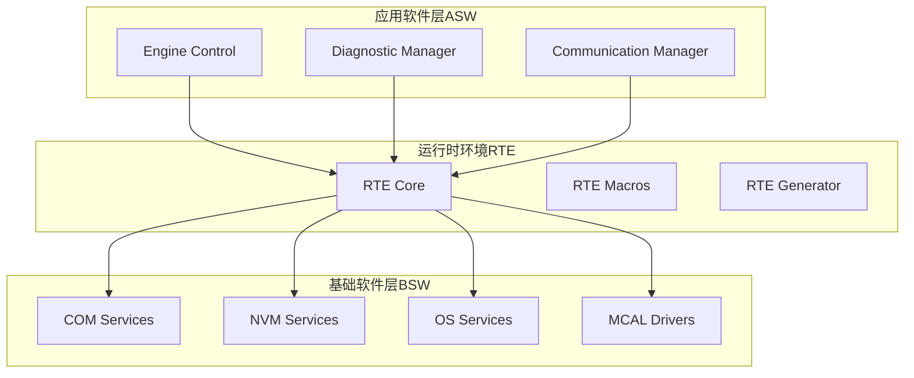

**图表来源**
- [Rte.h:1-441](file://src/bsw/rte/include/Rte.h#L1-L441)
- [Rte_Cfg.h:1-280](file://src/bsw/rte/include/Rte_Cfg.h#L1-L280)

**章节来源**
- [Rte.h:1-441](file://src/bsw/rte/include/Rte.h#L1-L441)
- [Rte_Cfg.h:1-280](file://src/bsw/rte/include/Rte_Cfg.h#L1-L280)

## 核心组件

### RTE宏工具概述

RTE宏工具是YuleTech项目中实现AutoSAR 4.x标准的关键创新。这些宏通过预处理器机制，在编译时生成特定的函数调用代码，从而简化了软件组件间的通信接口。

#### 主要宏分类

1. **组件API宏**：用于声明组件的基本生命周期管理接口
2. **数据访问宏**：用于发送-接收接口的数据读写操作
3. **服务调用宏**：用于客户端-服务器接口的操作调用
4. **模式切换宏**：用于运行模式的切换和查询
5. **触发器宏**：用于事件驱动的触发操作

#### 宏设计原则

- **类型安全**：通过明确的参数类型确保编译时检查
- **命名规范**：遵循AutoSAR 4.x标准的命名约定
- **可扩展性**：支持新的接口类型和数据元素
- **性能优化**：最小化运行时开销，最大化编译时优化

**章节来源**
- [Rte.h:350-441](file://src/bsw/rte/include/Rte.h#L350-L441)

## 架构概览

RTE宏工具在整个系统架构中扮演着关键的桥梁角色，连接应用软件组件和基础软件服务：

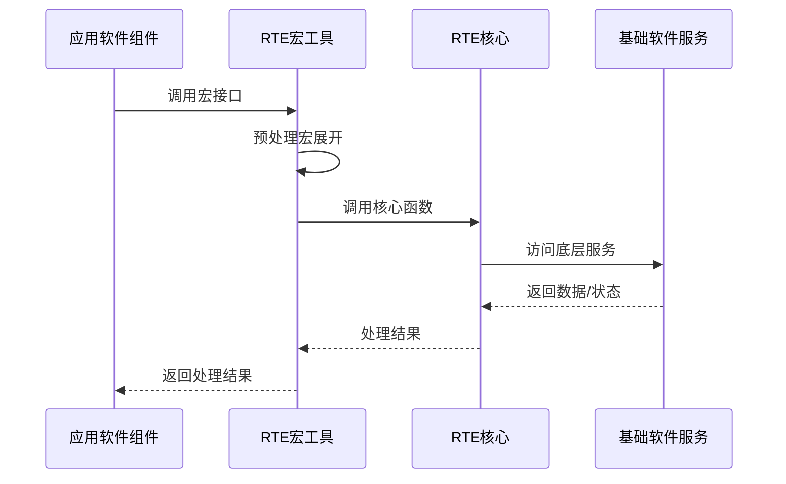

**图表来源**
- [Rte.h:357-378](file://src/bsw/rte/include/Rte.h#L357-L378)
- [Rte.c:425-517](file://src/bsw/rte/src/Rte.c#L425-L517)

### 数据流架构

RTE宏工具实现了标准化的数据流架构，确保数据在组件间的可靠传输：

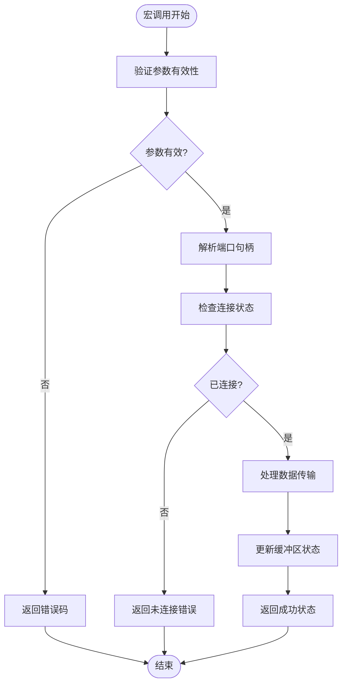

**图表来源**
- [Rte.c:425-465](file://src/bsw/rte/src/Rte.c#L425-L465)

**章节来源**
- [Rte.h:357-378](file://src/bsw/rte/include/Rte.h#L357-L378)
- [Rte.c:425-517](file://src/bsw/rte/src/Rte.c#L425-L517)

## 详细组件分析

### 组件API宏族

组件API宏族提供了软件组件生命周期管理的标准接口：

#### RTE_COMPONENT_API宏

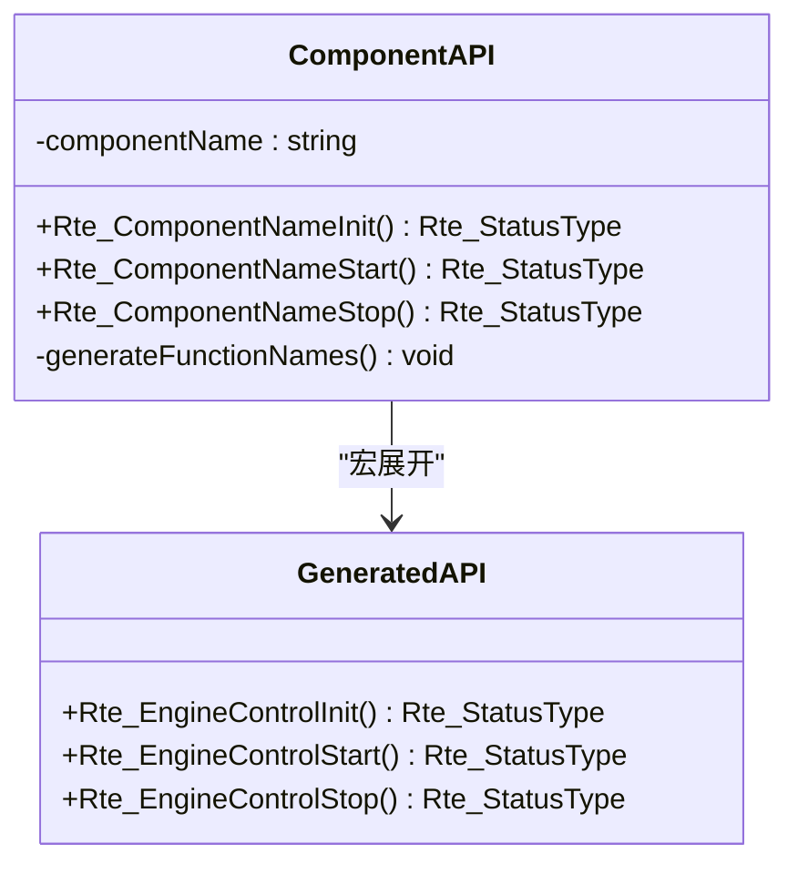

**图表来源**
- [Rte.h:357-360](file://src/bsw/rte/include/Rte.h#L357-L360)

该宏的设计目的是为每个软件组件自动生成标准的初始化、启动和停止接口，确保组件生命周期管理的一致性和可预测性。

#### 参数生成规则

宏展开遵循严格的命名约定：
- 组件名首字母大写
- 接口名称按功能分类
- 返回类型统一为Rte_StatusType

**章节来源**
- [Rte.h:357-360](file://src/bsw/rte/include/Rte.h#L357-L360)

### 发送-接收接口宏

发送-接收接口宏族处理双向数据传输：

#### 数据读取宏族

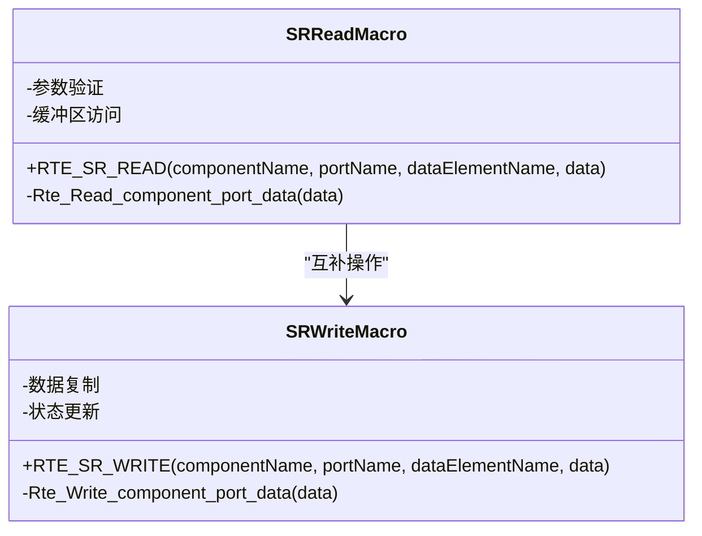

**图表来源**
- [Rte.h:365-372](file://src/bsw/rte/include/Rte.h#L365-L372)

#### 写入操作流程

写入操作涉及多层验证和处理：

1. **参数验证**：检查数据指针的有效性
2. **连接检查**：确认端口已正确连接
3. **数据复制**：将数据复制到内部缓冲区
4. **状态更新**：标记数据为有效并更新时间戳

**章节来源**
- [Rte.h:365-372](file://src/bsw/rte/include/Rte.h#L365-L372)
- [Rte.c:470-517](file://src/bsw/rte/src/Rte.c#L470-L517)

### 客户端-服务器接口宏

客户端-服务器接口宏族支持异步服务调用：

#### 操作调用宏

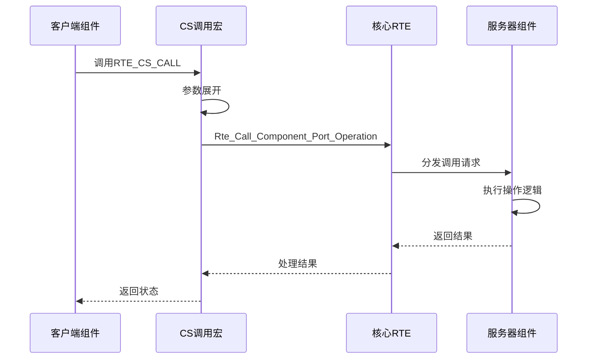

**图表来源**
- [Rte.h:377-378](file://src/bsw/rte/include/Rte.h#L377-L378)

#### 异步处理机制

客户端-服务器接口支持异步调用模式，通过回调机制处理长时间运行的操作：

- **同步调用**：立即返回操作结果
- **异步调用**：立即返回，稍后通过回调通知结果
- **超时处理**：自动检测和处理调用超时

**章节来源**
- [Rte.h:377-378](file://src/bsw/rte/include/Rte.h#L377-L378)

### 模式切换接口宏

模式切换接口宏族管理软件组件的运行模式：

#### 模式操作宏

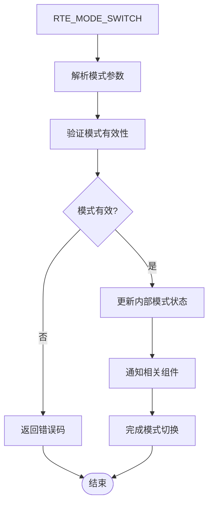

**图表来源**
- [Rte.h:383-384](file://src/bsw/rte/include/Rte.h#L383-L384)

#### 模式管理策略

模式切换涉及复杂的同步和异步处理：

- **全局模式管理**：集中管理所有组件的模式状态
- **组件级模式**：支持组件特定的模式设置
- **模式继承**：子组件自动继承父组件的模式设置

**章节来源**
- [Rte.h:383-384](file://src/bsw/rte/include/Rte.h#L383-L384)

### 触发器接口宏

触发器接口宏族支持事件驱动的组件交互：

#### 触发操作宏

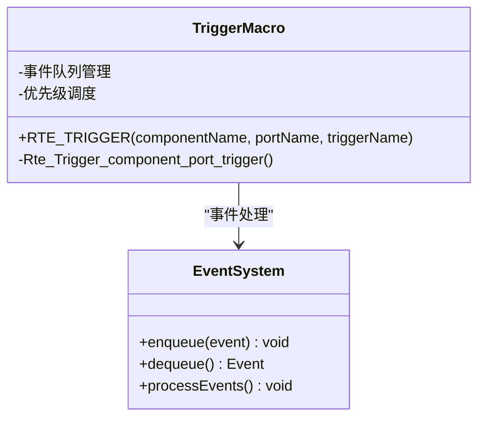

**图表来源**
- [Rte.h:389-390](file://src/bsw/rte/include/Rte.h#L389-L390)

#### 事件处理机制

触发器接口支持多种事件处理模式：

- **同步触发**：立即执行相关操作
- **异步触发**：延迟执行，避免阻塞主流程
- **批量处理**：合并多个触发事件进行批量处理

**章节来源**
- [Rte.h:389-390](file://src/bsw/rte/include/Rte.h#L389-L390)

### 参数接口宏

参数接口宏族提供配置参数的读取和写入功能：

#### 参数操作宏

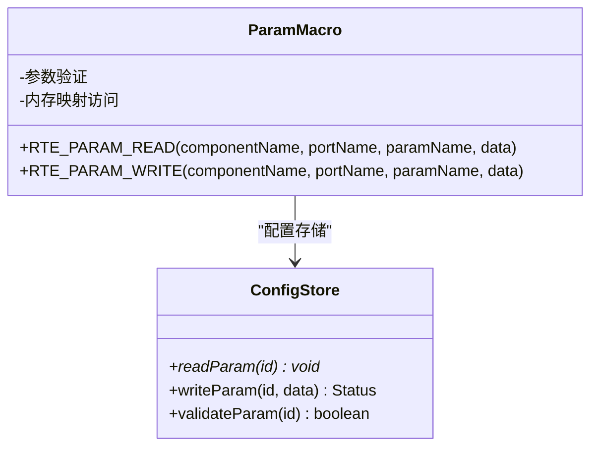

**图表来源**
- [Rte.h:395-396](file://src/bsw/rte/include/Rte.h#L395-L396)

#### 参数管理策略

参数接口支持动态配置和静态配置两种模式：

- **静态参数**：编译时确定，运行时只读
- **动态参数**：运行时可修改，支持热更新
- **参数验证**：自动验证参数范围和格式

**章节来源**
- [Rte.h:395-396](file://src/bsw/rte/include/Rte.h#L395-L396)

## 依赖关系分析

### 宏工具依赖链

RTE宏工具之间存在复杂的依赖关系，形成了完整的接口抽象层：

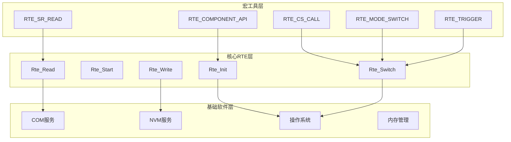

**图表来源**
- [Rte.h:357-384](file://src/bsw/rte/include/Rte.h#L357-L384)
- [Rte.c:208-382](file://src/bsw/rte/src/Rte.c#L208-L382)

### 编译时优化策略

宏工具通过以下策略实现编译时优化：

#### 条件编译优化

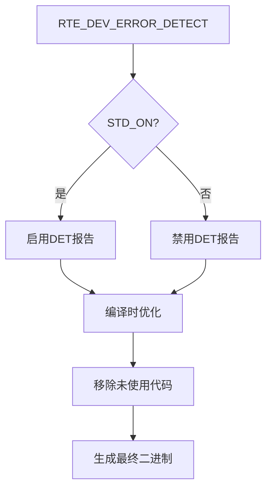

**图表来源**
- [Rte.c:36-41](file://src/bsw/rte/src/Rte.c#L36-L41)

#### 内联函数优化

宏工具通过内联展开减少函数调用开销：

- **直接调用**：宏展开为直接函数调用
- **参数验证**：在编译时进行参数类型检查
- **错误处理**：条件编译错误报告

**章节来源**
- [Rte.c:36-41](file://src/bsw/rte/src/Rte.c#L36-L41)

### 运行时性能特性

RTE宏工具在运行时具有以下性能特征：

#### 时间复杂度分析

| 操作类型 | 时间复杂度 | 空间复杂度 | 说明 |
|---------|-----------|-----------|------|
| 组件初始化 | O(1) | O(1) | 固定数量的组件状态初始化 |
| 数据读取 | O(1) | O(1) | 直接缓冲区访问 |
| 数据写入 | O(n) | O(1) | n为数据长度的复制操作 |
| 模式切换 | O(1) | O(1) | 状态更新和通知 |
| 事件处理 | O(k) | O(k) | k为待处理事件数量 |

#### 内存使用模式

- **静态分配**：组件状态和端口信息
- **动态分配**：运行时缓冲区（可选）
- **堆栈使用**：函数调用参数和局部变量

**章节来源**
- [Rte.c:47-81](file://src/bsw/rte/src/Rte.c#L47-L81)

## 性能考虑

### 编译时优化技术

RTE宏工具采用了多种编译时优化技术来提升运行时性能：

#### 宏展开优化

宏工具通过预处理器直接展开，避免了函数调用的开销：

```c
// 宏定义
#define RTE_SR_READ(comp, port, elem, data) \
    Rte_Read_##comp##_##port##_##elem(data)

// 展开后的代码
Rte_Read_EngineControl_PpEngineSpeed_EngineSpeed(data);
```

这种优化确保了：
- **零运行时开销**：宏在编译时完全展开
- **类型安全**：编译时参数类型检查
- **可读性**：保持原始宏调用的简洁性

#### 条件编译优化

通过条件编译控制错误检测功能：

```c
#if (RTE_DEV_ERROR_DETECT == STD_ON)
    #define RTE_DET_REPORT_ERROR(ApiId, ErrorId) \
        Det_ReportError(RTE_MODULE_ID, RTE_INSTANCE_ID, (ApiId), (ErrorId))
#else
    #define RTE_DET_REPORT_ERROR(ApiId, ErrorId)
#endif
```

这种设计允许：
- **生产版本**：禁用错误检测以减少代码大小
- **开发版本**：启用完整错误检测以提高调试能力

### 运行时性能优化

#### 缓冲区管理

RTE实现了高效的缓冲区管理策略：

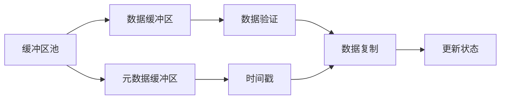

**图表来源**
- [Rte.c:58-64](file://src/bsw/rte/src/Rte.c#L58-L64)

#### 并发安全机制

RTE提供了基本的并发安全保护：

- **互斥锁**：保护共享资源访问
- **原子操作**：确保状态更新的完整性
- **内存屏障**：防止编译器和处理器重排序

### 内存使用优化

#### 内存布局优化

RTE采用了紧凑的内存布局策略：

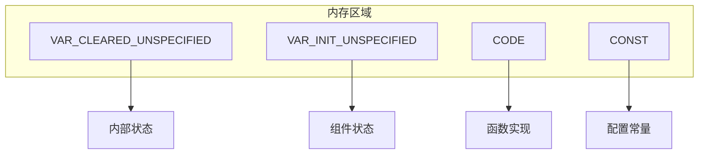

**图表来源**
- [Rte.c:97-106](file://src/bsw/rte/src/Rte.c#L97-L106)

#### 动态内存管理

RTE支持灵活的内存管理模式：

- **静态分配**：编译时确定的固定内存
- **动态分配**：运行时可变的内存需求
- **内存池**：预分配的内存块管理

## 故障排除指南

### 常见问题诊断

#### 宏展开失败

**症状**：编译时报错，提示未定义的函数或宏

**诊断步骤**：
1. 检查宏参数的命名约定是否正确
2. 验证组件、端口和数据元素的存在性
3. 确认头文件包含顺序正确

**解决方案**：
```c
// 错误：参数顺序错误
RTE_SR_READ(EngineControl, PpEngineSpeed, EngineSpeed, data);

// 正确：参数顺序正确
RTE_SR_WRITE(EngineControl, PpEngineSpeed, EngineSpeed, data);
```

#### 连接状态错误

**症状**：RTE返回未连接错误

**诊断步骤**：
1. 检查RTE初始化是否成功
2. 验证端口连接配置
3. 确认数据元素类型匹配

**解决方案**：
```c
// 确保正确的初始化顺序
Rte_Init();
Rte_ConnectPort(portHandle, direction, dataLength);
Rte_Start();
```

#### 参数验证错误

**症状**：RTE返回无效参数错误

**诊断步骤**：
1. 检查传入指针的有效性
2. 验证数据类型的兼容性
3. 确认缓冲区大小足够

**解决方案**：
```c
// 正确的参数传递
uint16 engineSpeed = 0;
Std_ReturnType result = Rte_Read_ThrottlePosition(&engineSpeed);
if (result == E_OK) {
    // 处理成功的结果
}
```

### 调试技巧

#### 启用详细日志

通过配置宏启用详细的调试信息：

```c
// 在Rte_Cfg.h中启用详细错误检测
#define RTE_DEV_ERROR_DETECT            (STD_ON)
#define RTE_VERSION_INFO_API            (STD_ON)
```

#### 使用断点调试

推荐的调试断点位置：

1. **宏入口点**：宏展开后的函数调用
2. **参数验证**：关键参数的验证检查
3. **错误处理**：错误码的返回路径
4. **状态转换**：组件状态的变更点

#### 性能分析

使用以下方法进行性能分析：

```c
// 添加性能计数器
static uint32 readCount = 0;
static uint32 writeCount = 0;

// 在关键路径添加计数
#define RTE_SR_READ(comp, port, elem, data) \
    (++readCount, Rte_Read_##comp##_##port##_##elem(data))

#define RTE_SR_WRITE(comp, port, elem, data) \
    (++writeCount, Rte_Write_##comp##_##port##_##elem(data))
```

### 最佳实践建议

#### 宏使用最佳实践

1. **参数命名规范**：严格遵循AutoSAR命名约定
2. **错误处理**：始终检查返回值并处理错误情况
3. **内存管理**：正确管理静态和动态内存
4. **线程安全**：在多任务环境中注意同步机制

#### 代码组织建议

```c
// 推荐的代码组织方式
#define RTE_START_SEC_CODE
#include "MemMap.h"

// 组件特定的宏定义
#define Rte_Read_EngineSpeed(data) \
    Rte_Read_SWC_ENGINECONTROL_PORT_ENGINE_SPEED_R(data)

#define Rte_Write_ControlOutput(data) \
    Rte_Write_SWC_ENGINECONTROL_PORT_ENGINE_CONTROL_P(data)

#define RTE_STOP_SEC_CODE
#include "MemMap.h"
```

#### 维护策略

1. **版本控制**：跟踪宏定义的变更历史
2. **文档更新**：及时更新相关文档和注释
3. **测试覆盖**：建立全面的单元测试和集成测试
4. **性能监控**：持续监控宏工具的性能表现

**章节来源**
- [Rte.h:357-384](file://src/bsw/rte/include/Rte.h#L357-L384)
- [Rte.c:36-41](file://src/bsw/rte/src/Rte.c#L36-L41)

## 结论

RTE宏定义与工具函数是YuleTech AutoSAR BSW项目的核心创新之一，它们通过预处理器机制实现了高效的接口抽象和代码生成。本文档详细分析了各种宏工具的设计原理、使用方法和实现细节，展示了它们在提高开发效率和代码一致性方面的重要作用。

### 主要成就

1. **标准化接口**：通过宏工具实现了AutoSAR 4.x标准的完整支持
2. **编译时优化**：宏展开技术消除了运行时开销
3. **类型安全**：编译时参数验证确保了代码质量
4. **可扩展性**：灵活的宏系统支持新功能的快速集成

### 技术优势

- **性能卓越**：零运行时开销的宏展开机制
- **开发效率**：简化的API使用和自动生成的代码
- **维护友好**：清晰的命名约定和完善的错误处理
- **兼容性强**：完全符合AutoSAR经典平台4.x标准

### 未来发展方向

随着汽车电子系统的复杂性不断增加，RTE宏工具将继续演进以满足更高的性能和可靠性要求。未来的改进方向包括：

- **增强的错误检测**：更精细的运行时错误报告
- **优化的内存管理**：更高效的内存使用策略
- **扩展的接口类型**：支持更多样化的通信协议
- **智能化的配置**：基于场景的自动配置优化

通过持续的技术创新和优化，RTE宏工具将继续为YuleTech项目的成功提供强有力的技术支撑。