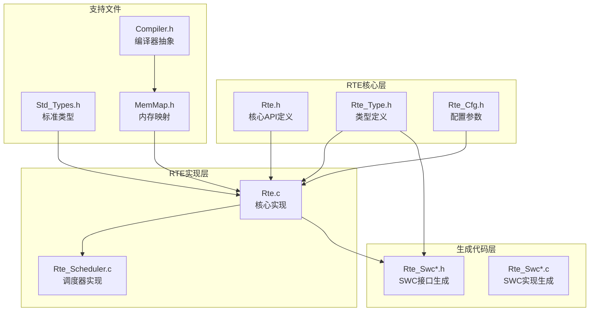
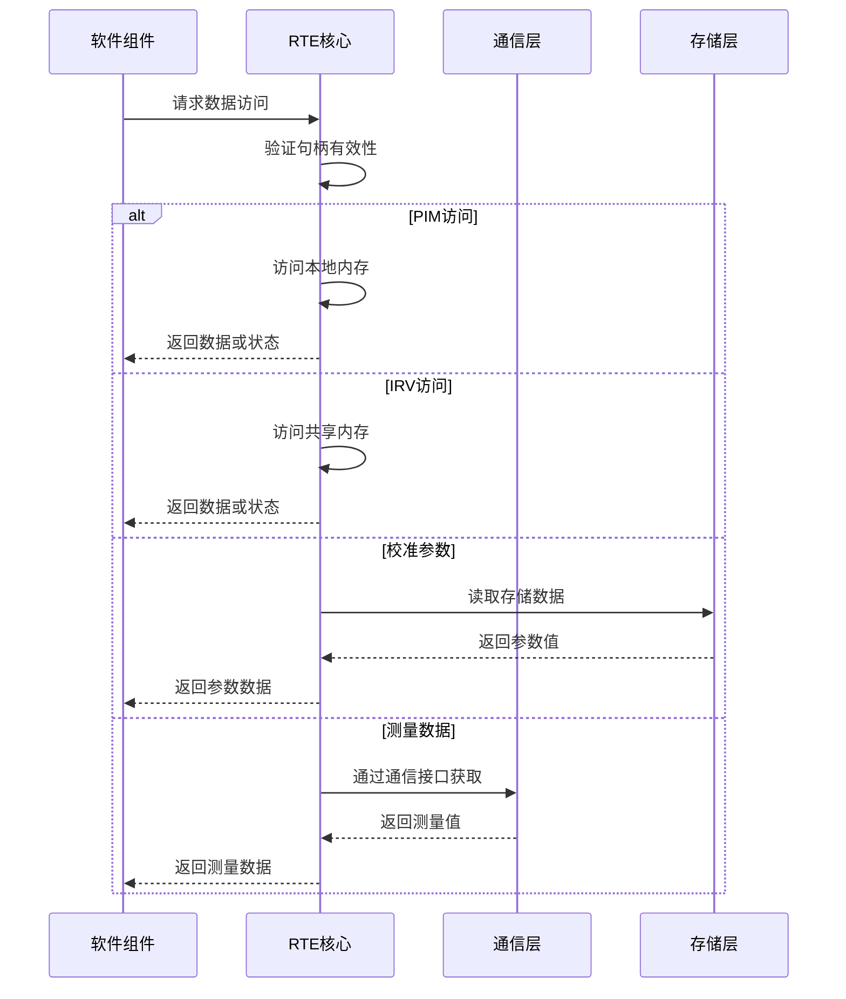
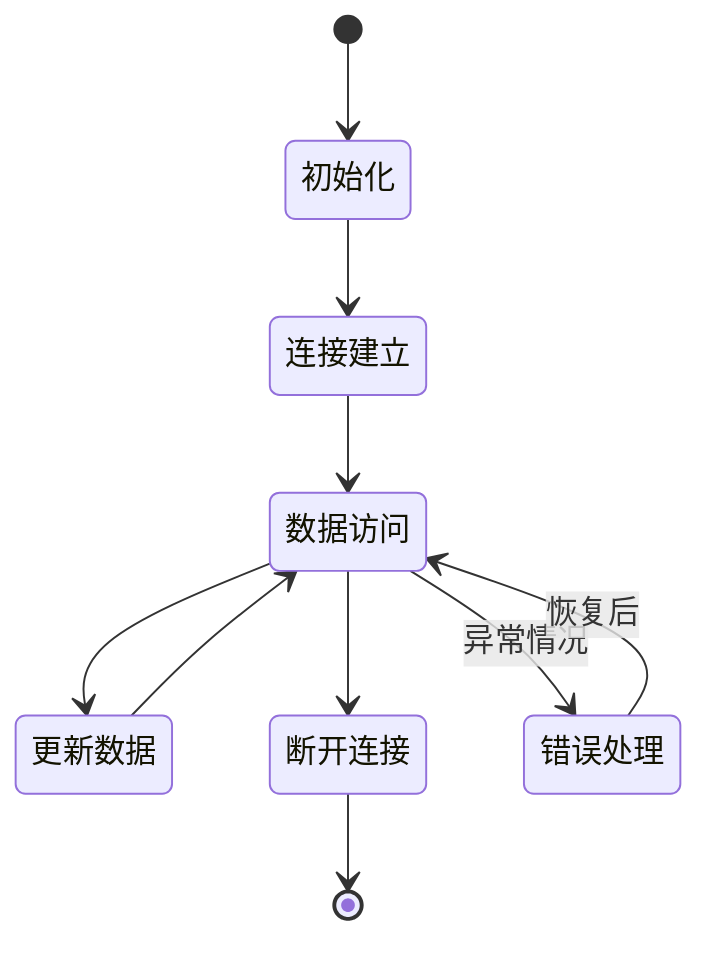
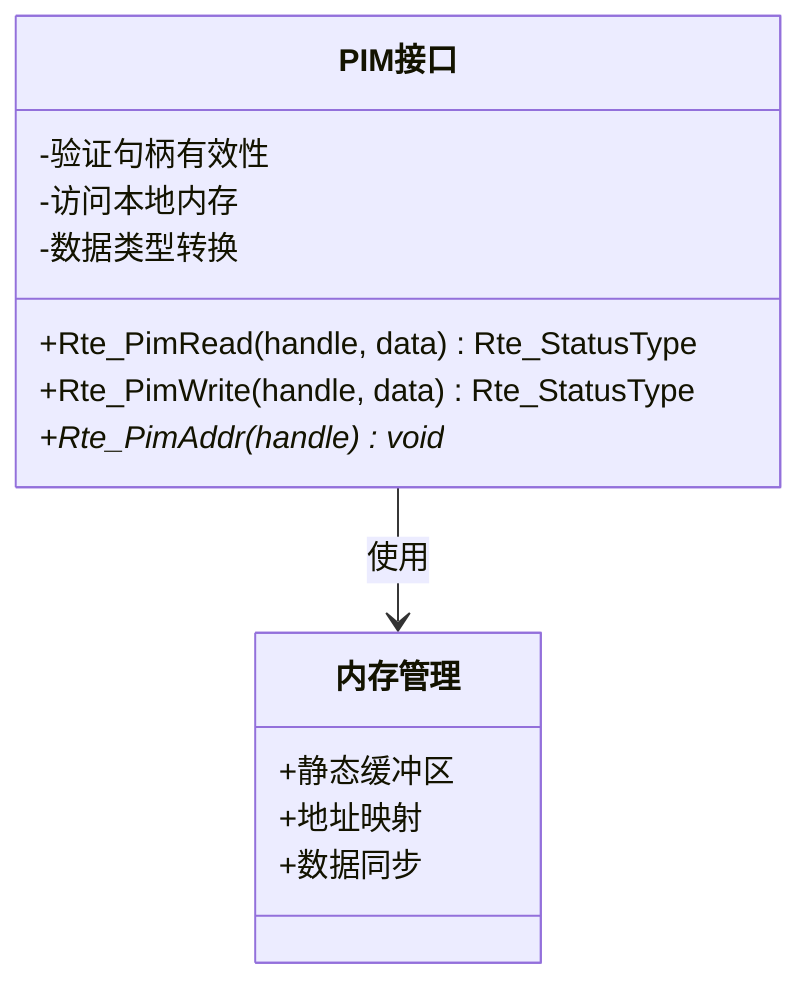
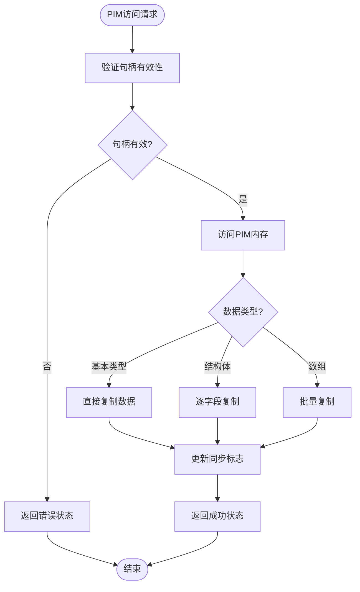
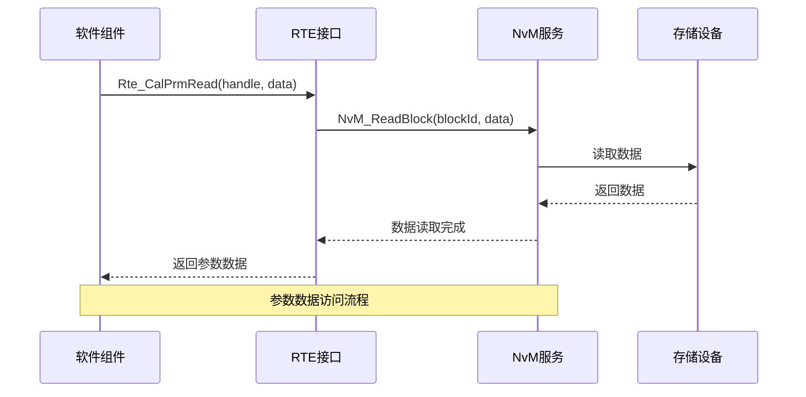
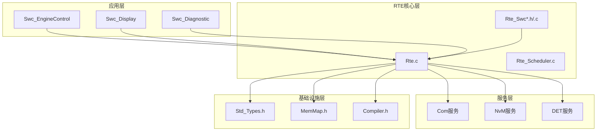

# RTE数据管理接口

<cite>
**本文档引用的文件**
- [Rte.h](file://src/bsw/rte/include/Rte.h)
- [Rte_Type.h](file://src/bsw/rte/include/Rte_Type.h)
- [Rte_Cfg.h](file://src/bsw/rte/include/Rte_Cfg.h)
- [Rte.c](file://src/bsw/rte/src/Rte.c)
- [Rte_Scheduler.c](file://src/bsw/rte/src/Rte_Scheduler.c)
- [Rte_SwcEngineCtrl.h](file://src/bsw/rte/generated/Rte_SwcEngineCtrl.h)
- [Rte_SwcDisplay.h](file://src/bsw/rte/generated/Rte_SwcDisplay.h)
- [RteGenerator_spec.md](file://openspec/changes/dev-rte-generator/specs/RteGenerator_spec.md)
- [Std_Types.h](file://src/bsw/common/Std_Types.h)
- [MemMap.h](file://src/bsw/general/inc/MemMap.h)
- [Compiler.h](file://src/bsw/common/Compiler.h)
- [Swc_EngineControl.c](file://src/asw/engine_control/src/Swc_EngineControl.c)
</cite>

## 目录
1. [简介](#简介)
2. [项目结构](#项目结构)
3. [核心组件](#核心组件)
4. [架构概览](#架构概览)
5. [详细组件分析](#详细组件分析)
6. [依赖关系分析](#依赖关系分析)
7. [性能考虑](#性能考虑)
8. [故障排除指南](#故障排除指南)
9. [结论](#结论)

## 简介

RTE（运行时环境）数据管理接口是YuleASR汽车软件平台的核心组件，基于AutoSAR Classic Platform 4.x标准实现。该接口提供了统一的数据访问抽象层，支持多种数据类型的管理，包括PIM（每实例内存）、IRV（可运行实体间变量）、校准参数和测量数据。

本系统采用模块化设计，通过代码生成工具自动生成SWC（软件组件）的RTE接口，确保了接口的一致性和可维护性。系统支持多任务调度、事件驱动编程和实时数据处理，适用于复杂的车载应用场景。

## 项目结构

RTE数据管理接口位于项目的`src/bsw/rte`目录下，采用分层架构设计：

**图表来源**
- [Rte.h:1-441](file://src/bsw/rte/include/Rte.h#L1-L441)
- [Rte_Type.h:1-361](file://src/bsw/rte/include/Rte_Type.h#L1-L361)
- [Rte_Cfg.h:1-280](file://src/bsw/rte/include/Rte_Cfg.h#L1-L280)

**章节来源**
- [Rte.h:1-441](file://src/bsw/rte/include/Rte.h#L1-L441)
- [Rte_Type.h:1-361](file://src/bsw/rte/include/Rte_Type.h#L1-L361)
- [Rte_Cfg.h:1-280](file://src/bsw/rte/include/Rte_Cfg.h#L1-L280)

## 核心组件

### 数据句柄类型体系

RTE系统定义了完整的数据句柄类型体系，用于标识和管理不同类型的数据资源：

| 数据类型 | 句柄类型 | 描述 | 使用场景 |
|---------|---------|------|----------|
| PIM（每实例内存） | `Rte_PimHandleType` | 每个组件实例独立的内存区域 | 运行时配置数据、动态参数 |
| IRV（可运行实体间变量） | `Rte_IrvHandleType` | 可运行实体间的共享数据 | 状态传递、中间结果缓存 |
| 校准参数 | `Rte_CalPrmHandleType` | 标定和校准数据 | 参数调优、性能优化 |
| 测量数据 | `Rte_MeasurementHandleType` | 实时测量和监控数据 | 性能监控、诊断数据 |

### 数据访问接口分类

系统提供四类主要的数据访问接口：

1. **PIM接口**：支持读写操作和地址获取
2. **IRV接口**：支持跨可运行实体的数据共享
3. **校准参数接口**：支持只读参数访问
4. **测量接口**：支持双向数据访问

**章节来源**
- [Rte_Type.h:186-203](file://src/bsw/rte/include/Rte_Type.h#L186-L203)
- [Rte.h:180-245](file://src/bsw/rte/include/Rte.h#L180-L245)

## 架构概览

RTE数据管理接口采用分层架构，实现了数据抽象、接口管理和执行控制的分离：

**图表来源**
- [Rte.c:520-587](file://src/bsw/rte/src/Rte.c#L520-L587)
- [Rte.h:208-245](file://src/bsw/rte/include/Rte.h#L208-L245)

### 生命周期管理

RTE系统实现了完整的数据生命周期管理：

**图表来源**
- [Rte.c:208-382](file://src/bsw/rte/src/Rte.c#L208-L382)
- [Rte.h:72-106](file://src/bsw/rte/include/Rte.h#L72-L106)

**章节来源**
- [Rte.c:208-382](file://src/bsw/rte/src/Rte.c#L208-L382)
- [Rte.h:72-106](file://src/bsw/rte/include/Rte.h#L72-L106)

## 详细组件分析

### PIM（每实例内存）接口

PIM接口为每个软件组件实例提供独立的内存空间，支持运行时数据的存储和访问。

#### 接口功能

**图表来源**
- [Rte.h:180-205](file://src/bsw/rte/include/Rte.h#L180-L205)
- [Rte.c:520-587](file://src/bsw/rte/src/Rte.c#L520-L587)

#### 数据同步机制

PIM接口实现了线程安全的数据同步机制：

**图表来源**
- [Rte.c:520-587](file://src/bsw/rte/src/Rte.c#L520-L587)
- [Rte_Type.h:248-261](file://src/bsw/rte/include/Rte_Type.h#L248-L261)

**章节来源**
- [Rte.h:180-205](file://src/bsw/rte/include/Rte.h#L180-L205)
- [Rte.c:520-587](file://src/bsw/rte/src/Rte.c#L520-L587)

### IRV（可运行实体间变量）接口

IRV接口支持在同一软件组件内部不同可运行实体之间的数据共享。

#### 实现特点

| 特性 | 描述 | 实现方式 |
|------|------|----------|
| 数据共享 | 支持多个可运行实体共享数据 | 共享内存区域 |
| 同步保护 | 防止并发访问冲突 | 互斥锁机制 |
| 类型安全 | 支持多种数据类型 | 类型检查和转换 |
| 生命周期管理 | 自动内存管理 | 配置驱动 |

**章节来源**
- [Rte.h:160-179](file://src/bsw/rte/include/Rte.h#L160-L179)
- [Rte.c:520-587](file://src/bsw/rte/src/Rte.c#L520-L587)

### 校准参数接口

校准参数接口提供对存储在非易失性存储器中的标定数据的访问。

#### 数据流处理

**图表来源**
- [Rte.h:208-224](file://src/bsw/rte/include/Rte.h#L208-L224)
- [RteGenerator_spec.md:143-149](file://openspec/changes/dev-rte-generator/specs/RteGenerator_spec.md#L143-L149)

**章节来源**
- [Rte.h:208-224](file://src/bsw/rte/include/Rte.h#L208-L224)
- [RteGenerator_spec.md:143-149](file://openspec/changes/dev-rte-generator/specs/RteGenerator_spec.md#L143-L149)

### 测量接口

测量接口支持实时测量数据的读取和写入操作。

#### 接口特性

| 功能 | 描述 | 实现细节 |
|------|------|----------|
| 实时访问 | 支持高频数据采样 | 循环缓冲区 |
| 数据完整性 | 确保数据一致性 | 时间戳标记 |
| 错误检测 | 检测数据异常 | 校验和机制 |
| 缓冲管理 | 管理数据队列 | FIFO队列 |

**章节来源**
- [Rte.h:226-245](file://src/bsw/rte/include/Rte.h#L226-L245)
- [Rte_Cfg.h:17-18](file://src/bsw/rte/include/Rte_Cfg.h#L17-L18)

## 依赖关系分析

RTE数据管理接口的依赖关系体现了清晰的分层架构：

**图表来源**
- [Rte.c:19-26](file://src/bsw/rte/src/Rte.c#L19-L26)
- [Rte_SwcEngineCtrl.h:22-25](file://src/bsw/rte/generated/Rte_SwcEngineCtrl.h#L22-L25)

### 关键依赖关系

1. **标准类型依赖**：所有RTE组件都依赖`Std_Types.h`提供的标准数据类型定义
2. **内存管理依赖**：通过`MemMap.h`实现编译器无关的内存段管理
3. **编译器抽象依赖**：`Compiler.h`提供编译器特定的宏定义和属性
4. **服务接口依赖**：RTE接口依赖底层服务如COM、NvM等

**章节来源**
- [Rte.c:19-26](file://src/bsw/rte/src/Rte.c#L19-L26)
- [MemMap.h:35-796](file://src/bsw/general/inc/MemMap.h#L35-L796)
- [Compiler.h:26-121](file://src/bsw/common/Compiler.h#L26-L121)

## 性能考虑

### 内存优化策略

1. **静态分配**：PIM和IRV数据使用静态内存分配，避免运行时内存碎片
2. **缓冲区复用**：Sender-Receiver接口使用循环缓冲区，减少内存分配开销
3. **数据对齐**：通过编译器属性确保数据结构正确对齐，提高访问效率

### 并发访问优化

1. **无锁设计**：PIM和IRV访问采用无锁设计，通过句柄验证确保线程安全
2. **批量操作**：支持批量数据传输，减少系统调用次数
3. **异步处理**：COM和NvM操作支持异步模式，提高系统响应性

### 实时性能保证

1. **确定性延迟**：所有数据访问操作具有确定性的最大延迟
2. **优先级调度**：支持基于优先级的任务调度，确保关键任务及时执行
3. **中断处理**：优化中断处理路径，减少中断延迟

## 故障排除指南

### 常见错误类型及解决方案

| 错误代码 | 错误描述 | 可能原因 | 解决方案 |
|----------|----------|----------|----------|
| RTE_E_UNINIT | 未初始化 | 组件未正确初始化 | 调用Rte_Init()和Rte_Start() |
| RTE_E_INVALID | 无效参数 | 句柄或指针无效 | 验证输入参数的有效性 |
| RTE_E_UNCONNECTED | 未连接 | 端口未正确连接 | 检查端口连接状态 |
| RTE_E_TIMEOUT | 超时 | 操作超时 | 增加超时时间或检查硬件状态 |
| RTE_E_NO_DATA | 无数据 | 数据缓冲区为空 | 检查数据源或等待数据到达 |

### 调试技巧

1. **启用DET报告**：通过`RTE_DEV_ERROR_DETECT`宏启用详细的错误报告
2. **状态监控**：定期检查RTE内部状态和组件状态
3. **日志记录**：记录关键数据访问操作和错误信息
4. **性能分析**：使用计时器分析数据访问延迟

**章节来源**
- [Rte.h:54-69](file://src/bsw/rte/include/Rte.h#L54-L69)
- [Rte.c:36-41](file://src/bsw/rte/src/Rte.c#L36-L41)

### 安全性考虑

1. **内存保护**：所有数据访问都经过边界检查，防止缓冲区溢出
2. **类型安全**：强制类型检查，防止类型不匹配导致的数据损坏
3. **权限控制**：通过句柄机制控制数据访问权限
4. **异常处理**：完善的异常处理机制，确保系统稳定性

## 结论

RTE数据管理接口为YuleASR汽车软件平台提供了强大而灵活的数据访问能力。通过标准化的接口设计和模块化的架构实现，系统能够有效支持多种数据类型的管理需求。

### 主要优势

1. **标准化接口**：基于AutoSAR标准，确保接口的兼容性和可移植性
2. **高性能实现**：优化的内存管理和并发访问机制，满足实时性要求
3. **可扩展性**：模块化设计支持功能扩展和定制开发
4. **可靠性**：完善的错误处理和异常恢复机制

### 应用场景

该接口适用于以下应用场景：
- 发动机控制系统
- 车身电子系统
- 底盘控制系统
- 信息娱乐系统
- 诊断和测试系统

通过合理的配置和使用，RTE数据管理接口能够为复杂的车载应用提供稳定可靠的数据访问服务。