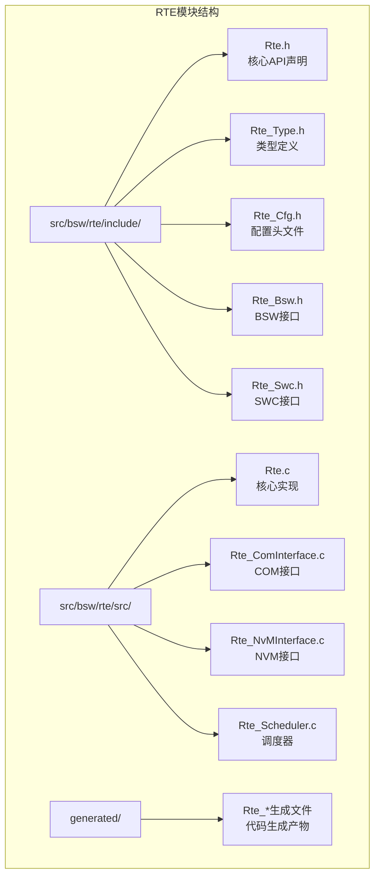
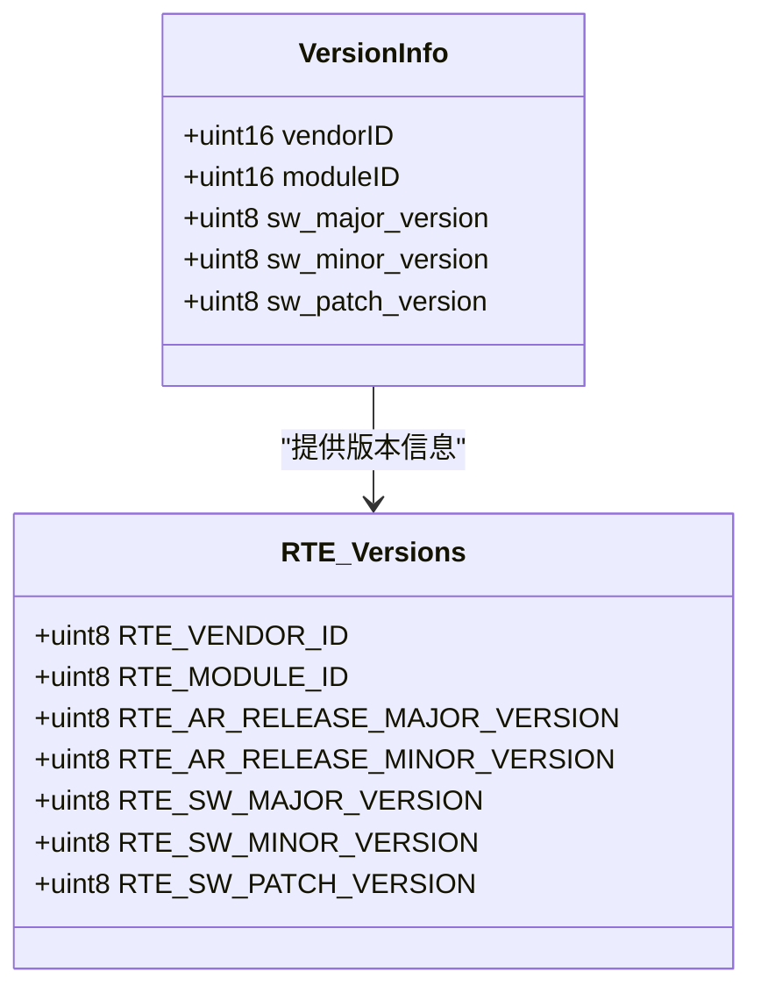
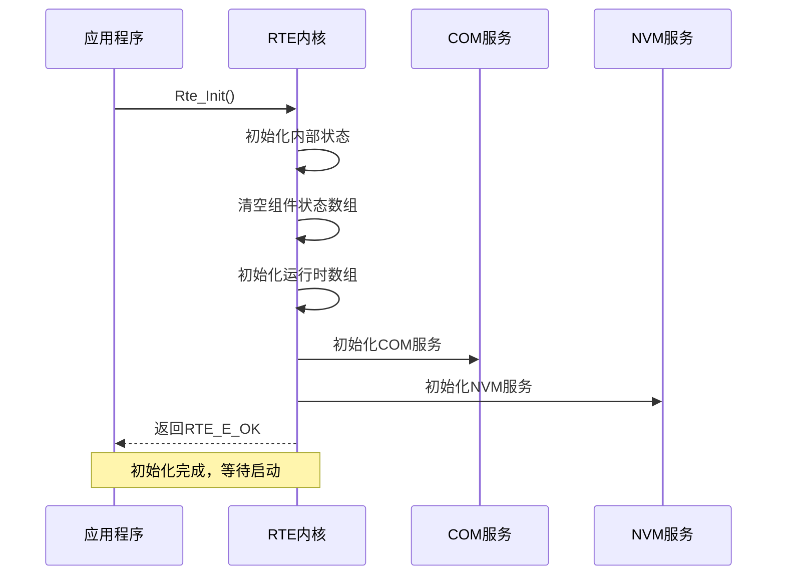
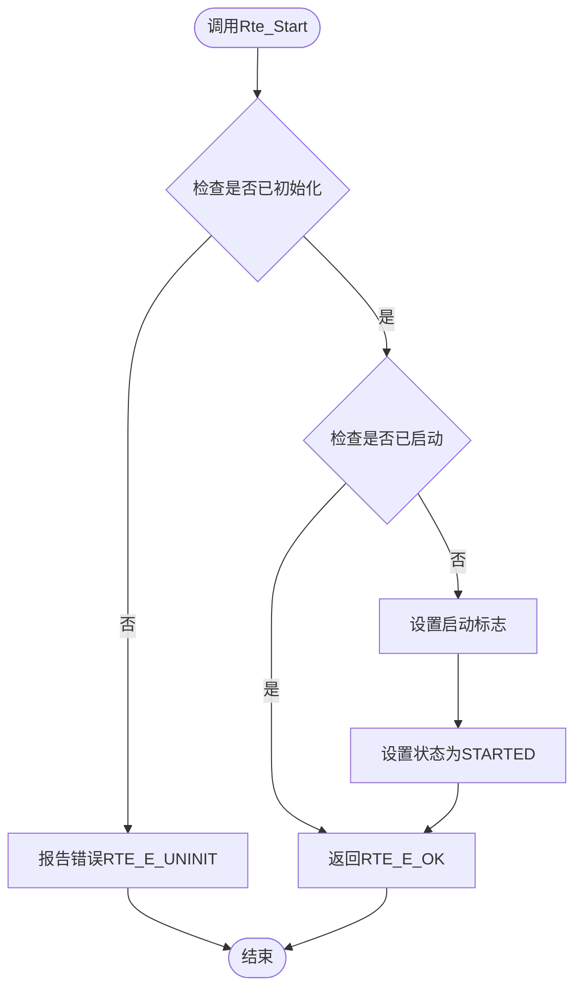
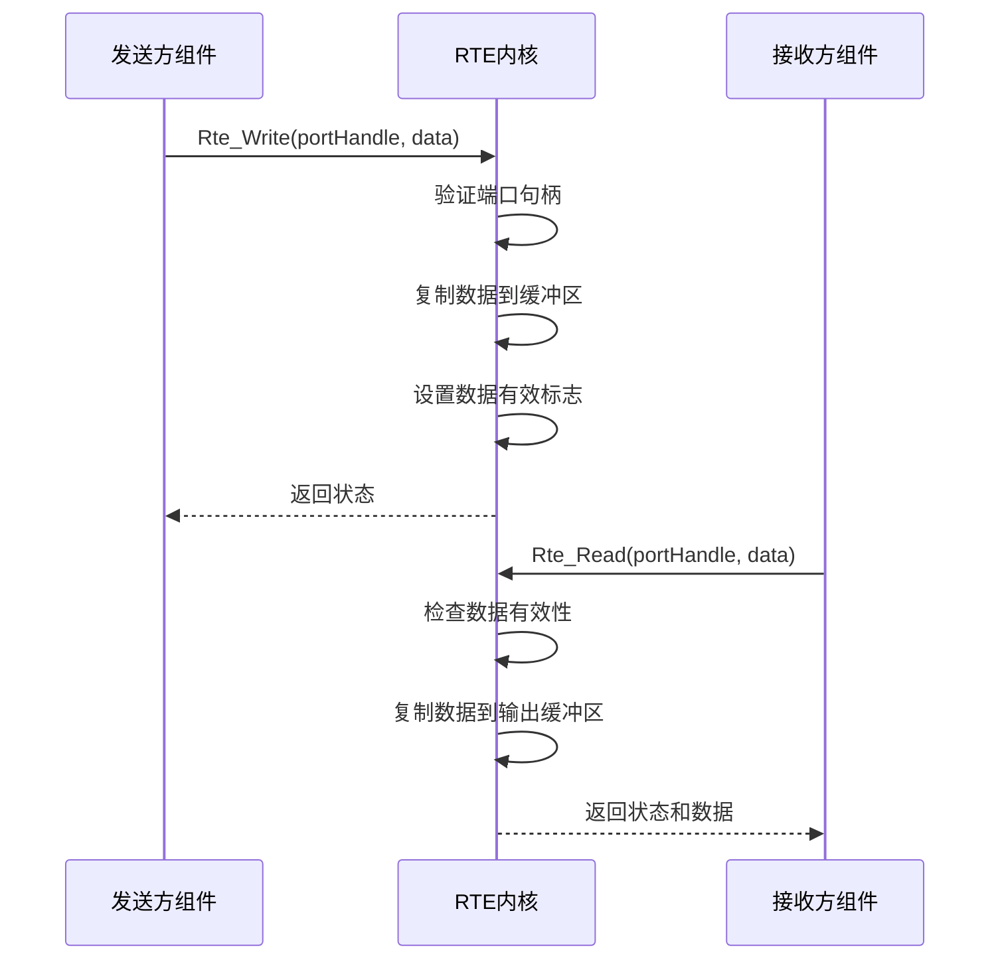
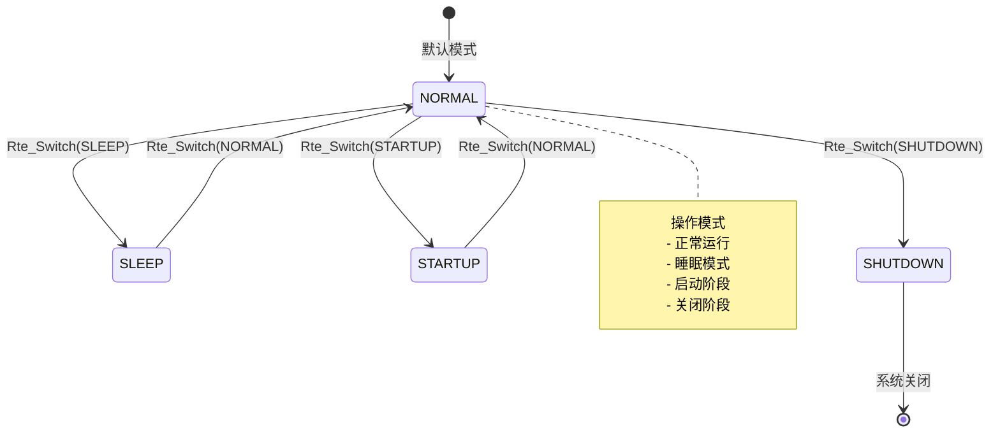
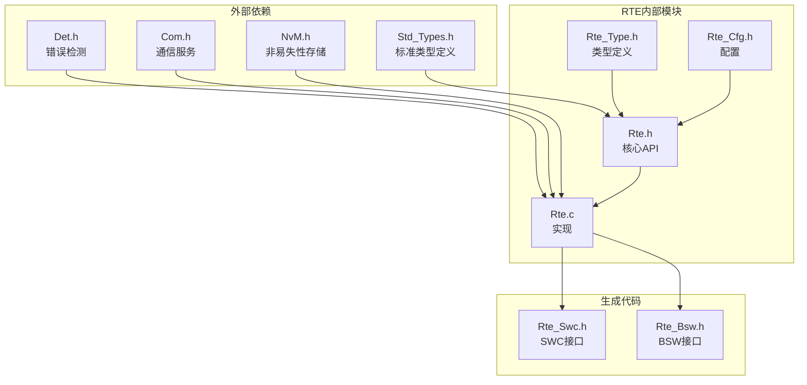

# RTE核心API接口

<cite>
**本文档引用的文件**
- [Rte.h](file://src/bsw/rte/include/Rte.h)
- [Rte_Type.h](file://src/bsw/rte/include/Rte_Type.h)
- [Rte_Cfg.h](file://src/bsw/rte/include/Rte_Cfg.h)
- [Rte.c](file://src/bsw/rte/src/Rte.c)
- [Std_Types.h](file://src/bsw/os/include/Std_Types.h)
- [README.md](file://tools/rte_generator/README.md)
- [example_config.json](file://tools/rte_generator/example_config.json)
- [api-reference.md](file://docs/api-reference.md)
</cite>

## 目录
1. [简介](#简介)
2. [项目结构](#项目结构)
3. [核心组件](#核心组件)
4. [架构概览](#架构概览)
5. [详细组件分析](#详细组件分析)
6. [依赖关系分析](#依赖关系分析)
7. [性能考虑](#性能考虑)
8. [故障排除指南](#故障排除指南)
9. [结论](#结论)

## 简介

YuleTech AutoSAR BSW Runtime Environment (RTE) 是一个遵循AutoSAR Classic Platform 4.x标准的实时运行环境。该RTE实现了核心API接口，为软件组件之间的通信提供了统一的抽象层。本文档详细分析了RTE的核心API函数，包括初始化和生命周期管理函数、服务ID定义、错误码常量以及版本信息管理。

## 项目结构

RTE模块位于`src/bsw/rte/`目录下，采用分层架构设计：



**图表来源**
- [Rte.h:1-50](file://src/bsw/rte/include/Rte.h#L1-L50)
- [Rte_Type.h:1-30](file://src/bsw/rte/include/Rte_Type.h#L1-L30)
- [Rte_Cfg.h:1-30](file://src/bsw/rte/include/Rte_Cfg.h#L1-L30)

**章节来源**
- [Rte.h:1-50](file://src/bsw/rte/include/Rte.h#L1-L50)
- [Rte_Type.h:1-30](file://src/bsw/rte/include/Rte_Type.h#L1-L30)
- [Rte_Cfg.h:1-30](file://src/bsw/rte/include/Rte_Cfg.h#L1-L30)

## 核心组件

### 版本信息管理

RTE实现了完整的版本信息管理机制，支持AutoSAR标准的版本标识：



**图表来源**
- [Rte.h:25-32](file://src/bsw/rte/include/Rte.h#L25-L32)
- [Std_Types.h:74-80](file://src/bsw/os/include/Std_Types.h#L74-L80)

### 错误码常量系统

RTE定义了全面的错误码常量，覆盖了运行时环境的各种错误情况：

| 错误码类别 | 常量名称 | 数值 | 描述 |
|------------|----------|------|------|
| 初始化错误 | RTE_E_UNINIT | 0x01 | 模块未初始化 |
| 参数错误 | RTE_E_INVALID | 0x02 | 无效参数 |
| 连接错误 | RTE_E_UNCONNECTED | 0x03 | 端口未连接 |
| 超时错误 | RTE_E_TIMEOUT | 0x04 | 操作超时 |
| 限制错误 | RTE_E_LIMIT | 0x05 | 达到限制条件 |
| 数据错误 | RTE_E_NO_DATA | 0x06 | 无可用数据 |
| 内存错误 | RTE_E_SEG_FAULT | 0x07 | 段错误 |
| 范围错误 | RTE_E_OUT_OF_RANGE | 0x08 | 超出范围 |

**章节来源**
- [Rte.h:55-68](file://src/bsw/rte/include/Rte.h#L55-L68)
- [Rte.c:36-41](file://src/bsw/rte/src/Rte.c#L36-L41)

## 架构概览

RTE采用分层架构设计，实现了AutoSAR标准的运行环境功能：

```mermaid
graph TB
subgraph "应用层"
A[软件组件(SWC)]
B[BSW模块]
end
subgraph "RTE核心层"
C[Rte_Init<br/>初始化]
D[Rte_Start<br/>启动]
E[Rte_Stop<br/>停止]
F[Rte_MainFunction<br/>主函数]
end
subgraph "通信层"
G[COM服务]
H[NVM服务]
I[DEM服务]
end
subgraph "操作系统层"
J[OS任务]
K[中断处理]
L[内存管理]
end
A --> C
B --> D
C --> G
D --> H
E --> I
F --> J
G --> K
H --> L
```

**图表来源**
- [Rte.h:76-98](file://src/bsw/rte/include/Rte.h#L76-L98)
- [Rte.c:208-397](file://src/bsw/rte/src/Rte.c#L208-L397)

## 详细组件分析

### 生命周期管理API

#### Rte_Init() - 初始化函数

Rte_Init()是RTE的入口初始化函数，负责建立内部状态并准备运行环境：



**图表来源**
- [Rte_Init:208-255](file://src/bsw/rte/src/Rte.c#L208-L255)

**函数签名**: `Rte_StatusType Rte_Init(void)`

**参数**: 无

**返回值**:
- `RTE_E_OK`: 初始化成功
- `RTE_E_UNINIT`: 模块未初始化（检测启用时）

**使用示例**:
```c
// 初始化RTE
Rte_StatusType result = Rte_Init();
if (result == RTE_E_OK) {
    // 继续初始化其他模块
}
```

**章节来源**
- [Rte_Init:208-255](file://src/bsw/rte/src/Rte.c#L208-L255)
- [Rte.h:76-80](file://src/bsw/rte/include/Rte.h#L76-L80)

#### Rte_Start() - 启动函数

Rte_Start()启动RTE运行环境，使所有组件进入活动状态：



**图表来源**
- [Rte_Start:331-354](file://src/bsw/rte/src/Rte.c#L331-L354)

**函数签名**: `Rte_StatusType Rte_Start(void)`

**参数**: 无

**返回值**:
- `RTE_E_OK`: 启动成功或已启动
- `RTE_E_UNINIT`: 模块未初始化

**使用示例**:
```c
// 启动RTE
Rte_StatusType result = Rte_Start();
if (result == RTE_E_OK) {
    // 开始主循环
    while (1) {
        Rte_MainFunction();
        // 其他处理
    }
}
```

**章节来源**
- [Rte_Start:331-354](file://src/bsw/rte/src/Rte.c#L331-L354)
- [Rte.h:82-86](file://src/bsw/rte/include/Rte.h#L82-L86)

#### Rte_Stop() - 停止函数

Rte_Stop()停止RTE运行环境，将所有组件置于非活动状态：

**函数签名**: `Rte_StatusType Rte_Stop(void)`

**参数**: 无

**返回值**:
- `RTE_E_OK`: 停止成功或已停止
- `RTE_E_UNINIT`: 模块未初始化

**使用示例**:
```c
// 停止RTE
Rte_StatusType result = Rte_Stop();
if (result == RTE_E_OK) {
    // 执行清理操作
}
```

**章节来源**
- [Rte_Stop:359-382](file://src/bsw/rte/src/Rte.c#L359-L382)
- [Rte.h:88-92](file://src/bsw/rte/include/Rte.h#L88-L92)

### 通信接口API

#### Rte_Read() 和 Rte_Write()

RTE实现了标准的发送-接收端口通信接口：



**图表来源**
- [Rte_Read:425-465](file://src/bsw/rte/src/Rte.c#L425-L465)
- [Rte_Write:470-517](file://src/bsw/rte/src/Rte.c#L470-L517)

**函数签名**:
- `Std_ReturnType Rte_Read(Rte_PortHandleType portHandle, void* data)`
- `Std_ReturnType Rte_Write(Rte_PortHandleType portHandle, const void* data)`

**参数**:
- `portHandle`: 端口句柄（包含组件ID和端口ID）
- `data`: 数据缓冲区指针

**返回值**:
- `E_OK`: 操作成功
- `RTE_E_UNINIT`: 模块未初始化
- `RTE_E_UNCONNECTED`: 端口未连接
- `RTE_E_NO_DATA`: 无可用数据

**章节来源**
- [Rte_Read:425-465](file://src/bsw/rte/src/Rte.c#L425-L465)
- [Rte_Write:470-517](file://src/bsw/rte/src/Rte.c#L470-L517)
- [Rte.h:425-465](file://src/bsw/rte/include/Rte.h#L425-L465)

### 模式管理API

#### Rte_Switch() 和 Rte_Mode()

RTE支持多模式管理，允许动态切换操作模式：



**图表来源**
- [Rte_Switch:592-619](file://src/bsw/rte/src/Rte.c#L592-L619)
- [Rte_Mode:624-661](file://src/bsw/rte/src/Rte.c#L624-L661)

**函数签名**:
- `Rte_StatusType Rte_Switch(Rte_ModeHandleType modeGroup, uint32 mode)`
- `Rte_StatusType Rte_Mode(Rte_ModeHandleType modeGroup, uint32* mode)`

**参数**:
- `modeGroup`: 模式组句柄
- `mode`: 目标模式值

**返回值**:
- `RTE_E_OK`: 操作成功
- `RTE_E_UNINIT`: 模块未初始化
- `RTE_E_OUT_OF_RANGE`: 模式超出范围

**章节来源**
- [Rte_Switch:592-619](file://src/bsw/rte/src/Rte.c#L592-L619)
- [Rte_Mode:624-661](file://src/bsw/rte/src/Rte.c#L624-L661)
- [Rte.h:592-661](file://src/bsw/rte/include/Rte.h#L592-L661)

### 独占区API

#### Rte_EnterExclusiveArea() 和 Rte_ExitExclusiveArea()

RTE提供了独占区保护机制，用于关键代码段的互斥访问：

**函数签名**:
- `void Rte_EnterExclusiveArea(Rte_ExclusiveAreaHandleType exclusiveArea)`
- `void Rte_ExitExclusiveArea(Rte_ExclusiveAreaHandleType exclusiveArea)`

**参数**:
- `exclusiveArea`: 独占区句柄

**返回值**: 无

**使用示例**:
```c
Rte_EnterExclusiveArea(RTE_EA_GLOBAL);
// 关键代码段
Rte_ExitExclusiveArea(RTE_EA_GLOBAL);
```

**章节来源**
- [Rte_EnterExclusiveArea:666-686](file://src/bsw/rte/src/Rte.c#L666-L686)
- [Rte_ExitExclusiveArea:691-711](file://src/bsw/rte/src/Rte.c#L691-L711)
- [Rte.h:121-131](file://src/bsw/rte/include/Rte.h#L121-L131)

### 可变参数宏系统

RTE提供了丰富的宏系统，简化了API调用：

| 宏类型 | 宏名称 | 功能描述 |
|--------|--------|----------|
| 组件API | `RTE_COMPONENT_API(name)` | 声明组件初始化/启动/停止API |
| 发送-接收 | `RTE_SR_READ()` | 读取发送-接收数据元素 |
| 发送-接收 | `RTE_SR_WRITE()` | 写入发送-接收数据元素 |
| 客户端-服务器 | `RTE_CS_CALL()` | 调用客户端-服务器操作 |
| 模式切换 | `RTE_MODE_SWITCH()` | 执行模式切换接口 |
| 触发接口 | `RTE_TRIGGER()` | 触发触发接口 |

**章节来源**
- [Rte.h:354-439](file://src/bsw/rte/include/Rte.h#L354-L439)

## 依赖关系分析

RTE模块具有清晰的依赖层次结构：



**图表来源**
- [Rte.c:19-26](file://src/bsw/rte/src/Rte.c#L19-L26)
- [Rte.h](file://src/bsw/rte/include/Rte.h#L20)

### 配置参数详解

RTE支持丰富的配置参数，通过Rte_Cfg.h进行集中管理：

| 配置类别 | 参数名称 | 默认值 | 描述 |
|----------|----------|--------|------|
| 通用配置 | RTE_DEV_ERROR_DETECT | STD_ON | 启用错误检测 |
| 通用配置 | RTE_VERSION_INFO_API | STD_ON | 启用版本信息API |
| 组件配置 | RTE_NUM_COMPONENTS | 16 | 组件数量上限 |
| 组件配置 | RTE_NUM_INSTANCES | 32 | 实例数量上限 |
| 端口配置 | RTE_NUM_PORTS | 128 | 端口数量上限 |
| 数据配置 | RTE_NUM_DATA_ELEMENTS | 256 | 数据元素数量上限 |
| 缓冲区配置 | RTE_MAX_BUFFER_SIZE | 4096 | 最大缓冲区大小 |
| 时间配置 | RTE_MAIN_FUNCTION_PERIOD_MS | 10 | 主函数周期 |

**章节来源**
- [Rte_Cfg.h:15-111](file://src/bsw/rte/include/Rte_Cfg.h#L15-L111)

## 性能考虑

### 内存管理

RTE采用了静态内存分配策略，预分配所有必要的数据结构：

- **内部状态**: 1个Rte_InternalStateType结构
- **组件状态**: RTE_NUM_COMPONENTS × Rte_ComponentStateType数组
- **运行时信息**: RTE_NUM_RUNNABLES × Rte_RunnableInfoType数组
- **缓冲区**: 每个端口最多4KB的数据缓冲区

### 时间复杂度

- **初始化**: O(C × P)，其中C为组件数，P为每组件最大端口数
- **端口连接**: O(1)
- **数据读写**: O(D)，其中D为数据长度
- **模式切换**: O(1)
- **主函数处理**: O(R)，其中R为运行时任务数

### 最佳实践

1. **及时初始化**: 在系统启动时立即调用Rte_Init()
2. **合理配置**: 根据实际需求调整配置参数
3. **错误处理**: 始终检查RTE API的返回值
4. **内存规划**: 确保配置的缓冲区大小满足应用需求
5. **定时调用**: 定期调用Rte_MainFunction保持系统响应性

## 故障排除指南

### 常见错误诊断

| 错误类型 | 可能原因 | 解决方案 |
|----------|----------|----------|
| RTE_E_UNINIT | 未调用Rte_Init() | 确保在使用任何RTE API前先初始化 |
| RTE_E_UNCONNECTED | 端口未正确连接 | 检查Rte_ConnectPort()调用 |
| RTE_E_TIMEOUT | 操作超时 | 增加超时时间或优化系统性能 |
| RTE_E_OUT_OF_RANGE | 句柄超出范围 | 验证句柄的有效性 |
| RTE_E_SEG_FAULT | 空指针访问 | 检查传入参数的有效性 |

### 调试技巧

1. **启用错误检测**: 将RTE_DEV_ERROR_DETECT设置为STD_ON
2. **使用版本信息**: 调用Rte_GetVersionInfo()验证RTE版本
3. **监控状态**: 定期检查RTE内部状态
4. **日志记录**: 记录关键API调用和返回值

**章节来源**
- [Rte.c:36-41](file://src/bsw/rte/src/Rte.c#L36-L41)
- [Rte.h:55-68](file://src/bsw/rte/include/Rte.h#L55-L68)

## 结论

YuleTech AutoSAR BSW的RTE模块提供了完整而高效的运行环境实现。其特点包括：

1. **完整的AutoSAR兼容性**: 符合Classic Platform 4.x标准
2. **清晰的API设计**: 提供直观且易于使用的接口
3. **强大的错误处理**: 全面的错误检测和报告机制
4. **灵活的配置选项**: 支持根据应用需求进行定制
5. **高性能实现**: 采用静态内存分配和优化的数据结构

通过本文档的详细分析，开发者可以充分理解和有效使用RTE的核心API接口，构建可靠的汽车电子系统应用。