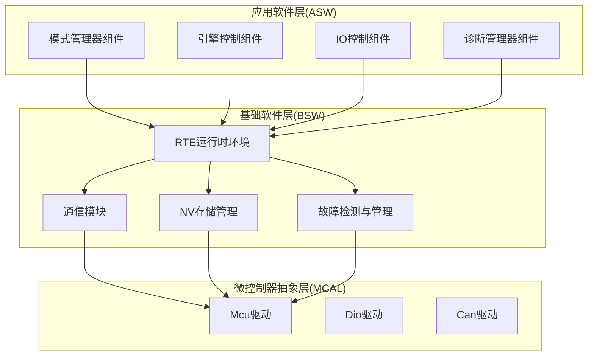
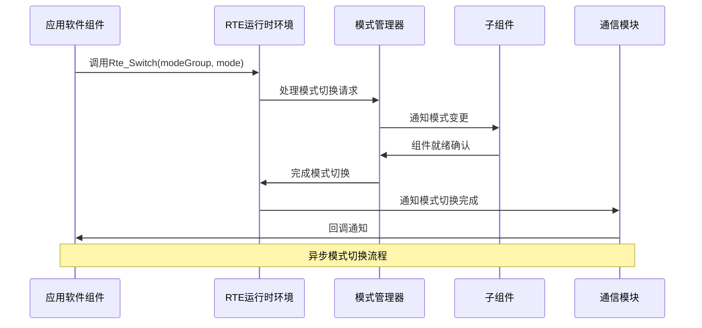
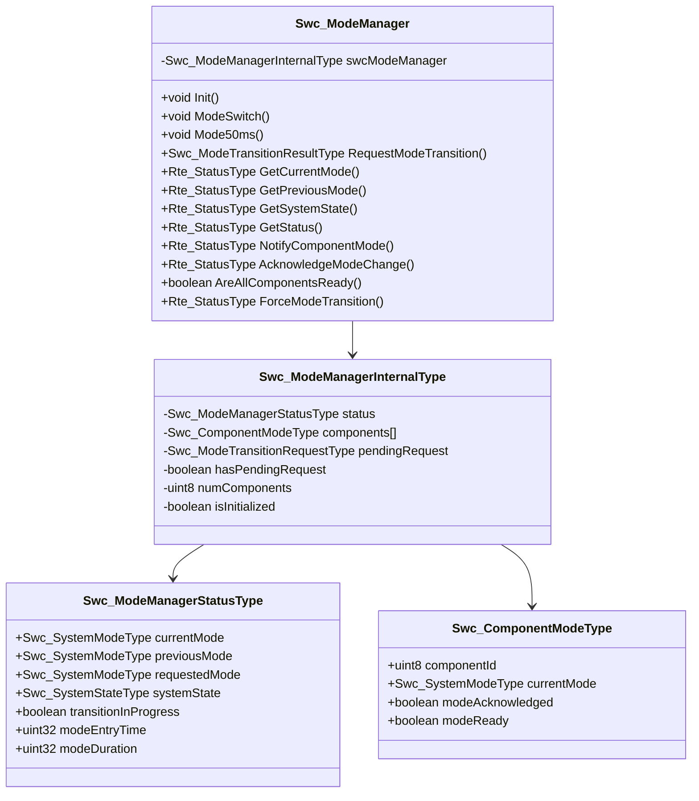
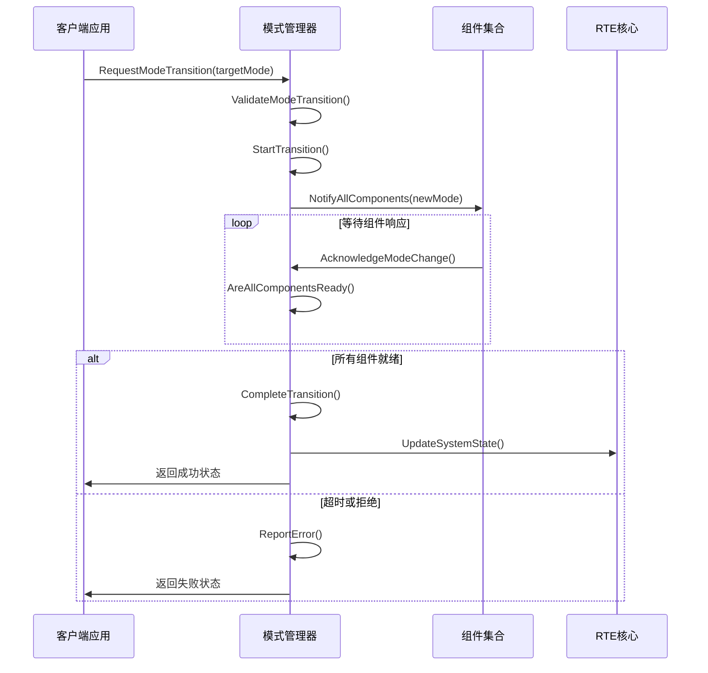
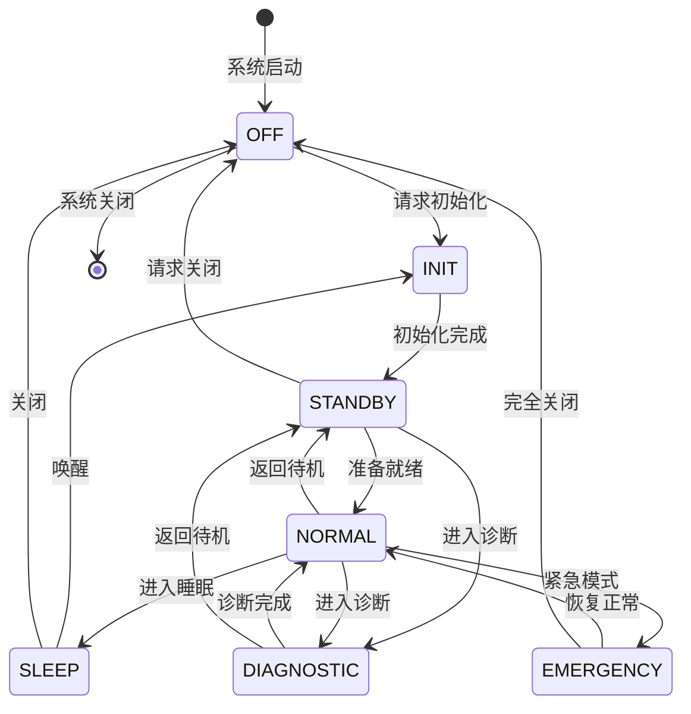
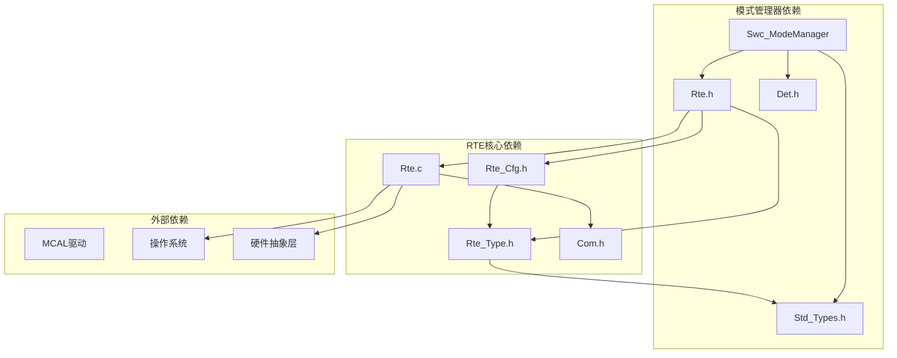
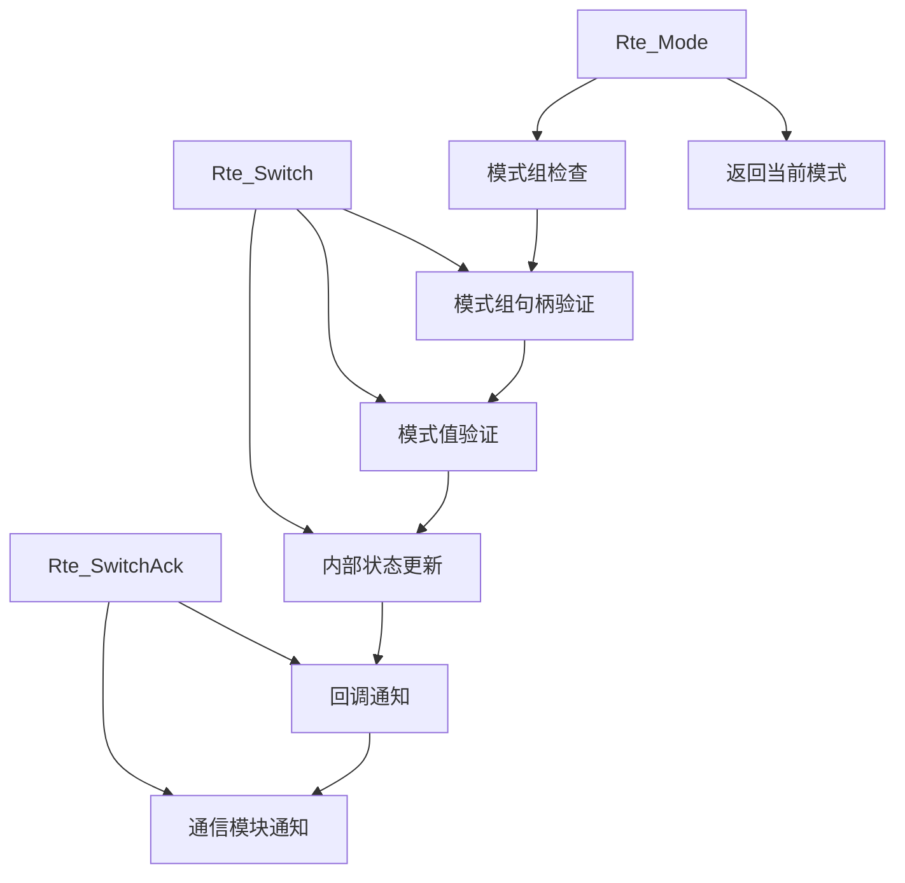

# RTE模式管理接口

<cite>
**本文档引用的文件**
- [Swc_ModeManager.h](file://src/asw/mode_manager/include/Swc_ModeManager.h)
- [Swc_ModeManager.c](file://src/asw/mode_manager/src/Swc_ModeManager.c)
- [Rte.h](file://src/bsw/rte/include/Rte.h)
- [Rte.c](file://src/bsw/rte/src/Rte.c)
- [Rte_Type.h](file://src/bsw/rte/include/Rte_Type.h)
- [Rte_Cfg.h](file://src/bsw/rte/include/Rte_Cfg.h)
- [Rte_Swc.h](file://src/bsw/rte/include/Rte_Swc.h)
- [Rte.c](file://src/bsw/rte/src/Rte.c)
- [Rte_Swc.c](file://src/bsw/rte/src/Rte_Swc.c)
- [Rte_Swc.c](file://src/bsw/rte/src/Rte_Swc.c)
</cite>

## 目录
1. [简介](#简介)
2. [项目结构](#项目结构)
3. [核心组件](#核心组件)
4. [架构概览](#架构概览)
5. [详细组件分析](#详细组件分析)
6. [依赖关系分析](#依赖关系分析)
7. [性能考虑](#性能考虑)
8. [故障排除指南](#故障排除指南)
9. [结论](#结论)
10. [附录](#附录)

## 简介

本文件为RTE（运行时环境）模式管理接口的详细技术文档。该系统实现了AutoSAR Classic Platform 4.x标准下的模式管理系统，重点涵盖以下核心功能：

- **Rte_Switch()** - 模式切换函数，用于启动模式切换请求
- **Rte_Mode()** - 获取当前模式函数，查询指定模式组的当前模式值
- **Rte_SwitchAck()** - 模式切换确认函数，通知模式切换完成

文档深入解释了模式组句柄、模式值定义和模式状态管理机制，详细说明了模式切换的通知机制、异步处理和状态同步策略。同时提供了最佳实践、错误处理策略和性能优化建议，并包含详细的时序图、状态转换表和实际使用示例。

## 项目结构

该项目采用分层架构设计，主要包含以下层次：



**图表来源**
- [Swc_ModeManager.h:1-217](file://src/asw/mode_manager/include/Swc_ModeManager.h#L1-L217)
- [Rte.h:1-441](file://src/bsw/rte/include/Rte.h#L1-L441)

**章节来源**
- [Swc_ModeManager.h:1-217](file://src/asw/mode_manager/include/Swc_ModeManager.h#L1-L217)
- [Rte.h:1-441](file://src/bsw/rte/include/Rte.h#L1-L441)

## 核心组件

### 模式管理器组件

模式管理器组件是系统的核心协调者，负责管理整个系统的模式切换过程。其主要职责包括：

- **模式状态管理**：维护当前模式、前一个模式、请求模式和系统状态
- **组件协调**：通知各个子组件进行模式切换准备
- **状态同步**：确保所有组件都准备好后才完成模式切换
- **超时处理**：防止模式切换无限期挂起

### RTE核心组件

RTE（运行时环境）提供以下关键服务：

- **模式管理API**：Rte_Switch()、Rte_Mode()、Rte_SwitchAck()函数
- **组件生命周期管理**：组件初始化、启动、停止
- **端口连接管理**：动态端口连接和断开
- **事件管理**：可触发事件的管理和等待

**章节来源**
- [Swc_ModeManager.c:274-335](file://src/asw/mode_manager/src/Swc_ModeManager.c#L274-L335)
- [Rte.h:136-158](file://src/bsw/rte/include/Rte.h#L136-L158)

## 架构概览

系统采用分层架构，模式管理在整个架构中扮演着关键角色：



**图表来源**
- [Rte.h:136-158](file://src/bsw/rte/include/Rte.h#L136-L158)
- [Swc_ModeManager.c:89-120](file://src/asw/mode_manager/src/Swc_ModeManager.c#L89-L120)

### 模式组和模式值定义

系统支持多种模式组，每种模式组都有特定的模式值：

| 模式组 | 模式值 | 描述 |
|--------|--------|------|
| 操作模式 | NORMAL (0) | 正常操作模式 |
| 操作模式 | SLEEP (1) | 睡眠模式 |
| 操作模式 | STARTUP (2) | 启动模式 |
| 操作模式 | SHUTDOWN (3) | 关闭模式 |
| 诊断模式 | DEFAULT (0) | 默认诊断模式 |
| 诊断模式 | EXTENDED (1) | 扩展诊断模式 |
| 诊断模式 | PROGRAMMING (2) | 编程诊断模式 |

**章节来源**
- [Rte_Cfg.h:214-240](file://src/bsw/rte/include/Rte_Cfg.h#L214-L240)

## 详细组件分析

### 模式管理器类结构



**图表来源**
- [Swc_ModeManager.h:25-83](file://src/asw/mode_manager/include/Swc_ModeManager.h#L25-L83)
- [Swc_ModeManager.c:34-41](file://src/asw/mode_manager/src/Swc_ModeManager.c#L34-L41)

### 模式切换时序图



**图表来源**
- [Swc_ModeManager.c:354-387](file://src/asw/mode_manager/src/Swc_ModeManager.c#L354-L387)
- [Swc_ModeManager.c:125-179](file://src/asw/mode_manager/src/Swc_ModeManager.c#L125-L179)

### 模式状态转换表



**图表来源**
- [Swc_ModeManager.h:28-49](file://src/asw/mode_manager/include/Swc_ModeManager.h#L28-L49)
- [Swc_ModeManager.c:154-177](file://src/asw/mode_manager/src/Swc_ModeManager.c#L154-L177)

### 模式管理器内部状态

模式管理器维护以下关键状态：

| 状态字段 | 类型 | 描述 | 默认值 |
|----------|------|------|--------|
| currentMode | Swc_SystemModeType | 当前系统模式 | SYSTEM_MODE_OFF |
| previousMode | Swc_SystemModeType | 上一个系统模式 | SYSTEM_MODE_OFF |
| requestedMode | Swc_SystemModeType | 请求的目标模式 | SYSTEM_MODE_OFF |
| systemState | Swc_SystemStateType | 系统状态 | SYSTEM_STATE_OFF |
| transitionInProgress | boolean | 是否正在进行模式切换 | FALSE |
| modeEntryTime | uint32 | 模式进入时间戳 | 当前时间 |
| modeDuration | uint32 | 当前模式持续时间 | 0 |

**章节来源**
- [Swc_ModeManager.h:75-83](file://src/asw/mode_manager/include/Swc_ModeManager.h#L75-L83)
- [Swc_ModeManager.c:49-64](file://src/asw/mode_manager/src/Swc_ModeManager.c#L49-L64)

## 依赖关系分析

### 组件间依赖关系



**图表来源**
- [Swc_ModeManager.h:18-19](file://src/asw/mode_manager/include/Swc_ModeManager.h#L18-L19)
- [Rte.h:20-21](file://src/bsw/rte/include/Rte.h#L20-L21)

### 模式切换API依赖

RTE模式管理API的依赖关系：



**图表来源**
- [Rte.h:136-158](file://src/bsw/rte/include/Rte.h#L136-L158)
- [Rte.c:592-661](file://src/bsw/rte/src/Rte.c#L592-L661)

**章节来源**
- [Rte.c:19-27](file://src/bsw/rte/src/Rte.c#L19-L27)
- [Rte.h:136-158](file://src/bsw/rte/include/Rte.h#L136-L158)

## 性能考虑

### 模式切换性能优化

1. **超时机制**：默认5秒超时，防止模式切换无限期挂起
2. **优先级处理**：支持不同优先级的模式切换请求
3. **批量处理**：支持多个组件的并发模式切换
4. **内存管理**：静态分配模式管理器状态，避免动态内存分配

### 内存使用优化

- **静态内存**：模式管理器状态使用静态内存分配
- **缓冲区大小**：最大支持16个组件的模式管理
- **数据结构紧凑**：使用紧凑的数据结构减少内存占用

### 实时性能特性

- **周期性执行**：50ms周期的模式管理循环
- **非阻塞设计**：模式切换不阻塞其他任务执行
- **快速路径**：正常情况下模式切换在单个周期内完成

## 故障排除指南

### 常见错误类型

| 错误代码 | 描述 | 可能原因 | 解决方案 |
|----------|------|----------|----------|
| RTE_E_UNINIT | 未初始化 | 组件未正确初始化 | 调用Rte_Init()和组件初始化函数 |
| RTE_E_INVALID | 参数无效 | 模式值超出范围 | 验证模式值在有效范围内 |
| RTE_E_TIMEOUT | 模式切换超时 | 组件未及时响应 | 检查组件状态和通信链路 |
| RTE_E_OUT_OF_RANGE | 越界访问 | 组件ID无效 | 验证组件ID的有效性 |
| RTE_E_UNCONNECTED | 端口未连接 | 端口未正确连接 | 检查端口连接状态 |

### 调试策略

1. **状态监控**：定期检查模式管理器状态
2. **日志记录**：启用DET报告错误信息
3. **超时检测**：监控模式切换超时情况
4. **组件状态检查**：验证各组件的就绪状态

**章节来源**
- [Rte_Type.h:38-67](file://src/bsw/rte/include/Rte_Type.h#L38-L67)
- [Swc_ModeManager.c:136-143](file://src/asw/mode_manager/src/Swc_ModeManager.c#L136-L143)

## 结论

RTE模式管理接口为AutoSAR系统提供了完整的模式管理解决方案。通过Rte_Switch()、Rte_Mode()和Rte_SwitchAck()等核心API，系统实现了：

- **可靠的模式切换**：支持同步和异步模式切换
- **完整的状态管理**：跟踪系统和组件的模式状态
- **灵活的通知机制**：支持组件间的模式变更通知
- **强大的错误处理**：提供全面的错误检测和报告

该接口的设计充分考虑了实时性要求，提供了高效的模式切换机制，适用于复杂的汽车电子系统。

## 附录

### 使用示例

#### 基本模式切换示例

```c
// 请求模式切换到NORMAL模式
Swc_ModeTransitionRequestType request = {
    .targetMode = SYSTEM_MODE_NORMAL,
    .requestSource = 0x01,
    .requestTime = Rte_GetTime(),
    .priority = 10,
    .isForced = FALSE
};

Swc_ModeTransitionResultType result = 
    Swc_ModeManager_RequestModeTransition(&request);

if (result == MODE_TRANSITION_OK) {
    // 模式切换已启动
    // 等待组件响应
} else {
    // 处理模式切换失败
}
```

#### 模式状态查询示例

```c
Swc_SystemModeType currentMode;
Swc_SystemStateType systemState;

// 获取当前模式
if (Swc_ModeManager_GetCurrentMode(&currentMode) == RTE_E_OK) {
    printf("当前模式: %d\n", currentMode);
}

// 获取系统状态
if (Swc_ModeManager_GetSystemState(&systemState) == RTE_E_OK) {
    printf("系统状态: %d\n", systemState);
}
```

#### 组件模式通知示例

```c
// 通知特定组件模式变更
Rte_StatusType status = 
    Swc_ModeManager_NotifyComponentMode(
        COMPONENT_ID_ENGINE, 
        SYSTEM_MODE_NORMAL
    );

if (status == RTE_E_OK) {
    // 组件已收到通知
    // 等待组件确认
}

// 接收组件确认
Rte_StatusType ackStatus = 
    Swc_ModeManager_AcknowledgeModeChange(
        COMPONENT_ID_ENGINE, 
        TRUE
    );
```

### 最佳实践

1. **模式验证**：始终验证目标模式的有效性
2. **超时处理**：合理设置和处理模式切换超时
3. **错误报告**：启用DET以捕获和报告错误
4. **状态监控**：定期检查模式管理器状态
5. **组件协调**：确保所有组件都参与模式切换过程
6. **优先级管理**：合理设置模式切换请求的优先级

### 性能优化建议

1. **减少模式切换频率**：避免频繁的模式切换
2. **优化组件响应**：确保组件能够快速响应模式变更
3. **合理设置超时**：根据系统需求调整超时时间
4. **内存预分配**：预先分配必要的内存资源
5. **避免阻塞操作**：在模式切换过程中避免长时间阻塞操作